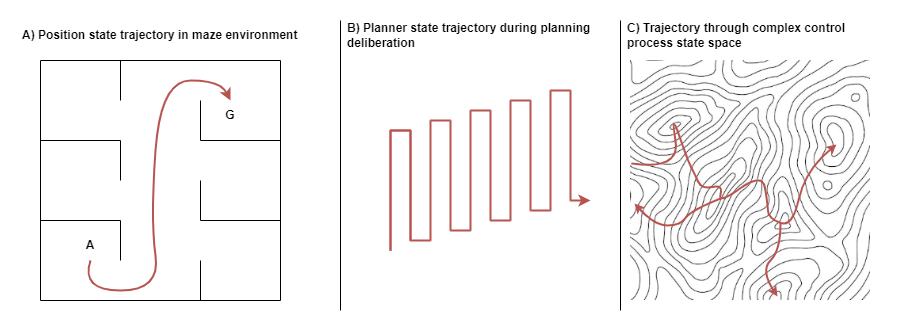

_This is a work in progress._

_Please come back later._

Abstract:
- Consciousness is produced by a semiotic multi-step planner state machine with meta management. 

This article is interested in resolving the most perplexing question of consciousness..... In an attempt at being as precise as possible, I use the term "subjective experience". Necessary to deflect from our own intuitions and biases and connotations associated with words used in discussion of Cs. Here, we are interested in understanding the mechanisms underlying subjective experience. What produces subjective experience? Why might some structures produce subjective experience while others might not? What are the sufficient and necessary conditions for subjective experience?

Many extent theories invoke non-Materialistic mechanisms. Here I present the case that CS can be fully explained through materialistic means. It just requires that we understand some of how General Intelligence works. 

Some provide mechanistic explanations, but often either only at a philosophical level or only provide part of the story. In many respects, the skill of a researcher in this area is to sieve through the many partial stories and see how they can be linked together. This paper attempts just that. None of the ideas are entirely new. But I believe this to be the most comprehensive attempt to combine theories together at the most detailed level. 

---

# Part I - Introduction

# I.1 Summary of Thesis

I believe that three things go hand-in-hand: general intelligence, meta-management, and consciousness. Further, understanding these systems must proceed in that order. Thus, in order to understand why we have subjective experience, we need to begin to develop a theory of general intelligence and of the processes that restrain it from cascading into chaos. This article presents an end-to-end argument following that thread. The entire argument is first presented here in brief, with background explanations omitted for the sake of brevity. The rest of the article is devoted to detailed explanations of each of the logical steps in the argument thread.

Any computational system is limited in the complexity that it can handle within a single execution of its computational process. For embodied agents, this appears as a limit on the environmental complexity that they can sufficiently model and respond to within a single executional iteration. For more complex problems, multiple iterations of processing are required in order to determine the next physical action. Such recurrency in processing may for example entail further analysis of the environment in order to better model its state; or consideration of alternative action plans. In biology, this provides scope for evolutionary pressures to trade off between a more energy hungry complex brain and a simpler less energy intensive one that takes longer to make some decisions. Van Bergen & Kriegeskorte (2020) make the case that recurrency is indeed employed in biology for that very reason.

During the execution of a _multi-iteration_ controller within an embodied agent, its control process (CP) passes through an internal state trajectory that is only occasionally associated with interaction with the physical environment. That internal state trajectory can become increasingly disassociated with the physical environment the more complex the problem space and the longer time required for deliberation. If the multi-iteration processor must also learn through reinforcement then it is likely to exhibit chaotic and unproductive behaviour, particularly so during the earliest stages of learning. Reinforcement from the environment may be too sparse for efficient learning to take place, and simple rules that penalise longer deliberation time may be insufficiently advanced to cater for the complexity of problem domains that the agent may be faced with. Explicit meta-management processes are required to observe the control process, to model its behaviours, to track its success rate, to act upon it to prevent chaotic behaviours that could harm the agent, and to participate in providing rewards and penalties with more advanced problem-domain aware knowledge than just a simple penalty for deliberation time.

In a complex biological brain that can operate its body effectively within the real world, including all the complexity of modern human life, the systems and processes required to model and understand the environment and to interact with them are immense. It turns out that the systems required to effectively carry out meta-management are similarly complex. More importantly, the systems required for meta-management are similar to those required for primary control: observing, modelling, inference, planning, sequencing, controlling. Additionally, the domain knowledge required by the meta-management process in order to effectively meta-manage the control process is often strongly associated with the domain knowledge employed by the primary control process at the time. The level of overlap between primary control and meta-management implies a radical solution: that the control process meta-manages itself.

In order to meta-manage itself, the control process needs to observe itself. This can be achieved through a _meta-management feedback loop_ that observes the state of the control process, observes the recent trajectory of the control process, distils that into a high-order representation with lower dimensionality, and makes it available to the control process as a sensory input signal. Thus, the fact that we have awareness of some aspect of our own mental state is a direct result of the need for meta-management. And that meta-management feedback loop is a 6th sense.

The existence of the meta-management feedback loop does not alone explain subjective experience. Two more ingredients are required: interpretation and meaning. In a complex organism such as a human being, the brain maintains _schema_ that represent and track the characteristics of different aspects of the individual. This includes the body schema, which models and tracks the location and orientation of the limbs, their abilities, and whether any injuries have been acquired. This includes schema about regularly encountered external things, such as is required to mentally track the location and orientation of the wheels while driving a car over potholes. With the introduction of the meta-management feedback loop, this also includes schema for tracking the state and capabilities of the mind. And, importantly, it includes a strongly developed sense of self vs other. All external and internal sensory inputs (including the meta-management feedback loop), all schema states, are labelled as to their source. Different source labels imply significantly different meaning in terms of, for example, the level to which the agent can affect that state.

External sensory inputs, meaning association, and feedback loop together are interpreted by the brain and a decision made about the next action. Information about that action and/or the mental state that produced it is available via the feedback loop in the next iteration of processing. This creates a continuous cyclic stream of ever changing inputs, states and actions. As the control process decides to perform some body action, knowledge of that chosen action is immediately available as a sensory input before the action is even started. As the control process chooses to deliberate further on a problem at hand, knowledge of that deliberation and is immediately available. At every moment in time, the control process can choose to attend to external matters, to continuation of the current deliberation problem at hand, or to the very feedback sense that it receives continuously while it is usually distracted doing other things. If the control process stops to consider its own feedback sense, compares that to memory of recent deliberations, compares that to its schema of self vs other, it necessarily concludes that it has its own "stream of thought". That stream of thought is subjective experience.

The metaphor of a _philosophical zombie_ was introduced to hypothesise a human-like individual that has all the behavioural characteristics of a human, including voicing that it is conscious, without actually experiencing subjective experience. A philosophical zombie is _behaviourally indistinguishable_ from a human with consciousness. I argue that, if the zombie employs the mechanisms given in the explanation above (and outlined in more detail in the chapters that follow), then it is also _computationally indistinguishable_ from a human with consciousness. In other words, if we were to assume an ability to tap into all of the inner state and workings of a brain, and if we were to compare the philosophical zombie from the conscious human, we would find no difference. At that point I argue that the zombie is not a zombie after all, but instead is a fully conscious human being having subjective experience.

Finally, I argue that our disgruntlement with such an explanation is not an _explanatory gap_ [citation], but an _intuitional gap_. Nagal famously pointed out that we have no conception of and no way of developing a conception of what it is like to be anything other than ourselves [citation]  [is the 'no way of developing a conception' reference due to 'The Harder Problem of Consciousness'?]. But that does not stop us making assumptions about what should and should not experience subjective experience. It took us a very long time to accept that animals could have any form of consciousness and subjective experience, and likely many still deny that outcome [details, citations]. If we have no way to conceive of the experience held by an animal, why should we be so adamant about its properties? The answer simply is our deluded intuition. Our brains excel at finding patterns and extrapolating from them. This works well when the physical environment around us is there to provide an error signal. But when no error signal is available, we are prone to delusion. Our minds create such a strong sense of self vs other by keying that information into every sensory signal that we ever receive, so that our senses seem to take on an extra quality of realness, of subjectiveness, of _qualia_ [citation]. That seeming extra quality is further processed by the same system that produced it, reinforcing the delusion that the qualia is something extra, beyond mere sensory information. And thus we are deluded into the intuition that subjective experience is somehow more than can be produced by mere computational processing.

# I.2 Background - Theories of Consciousness
What is consciousness? This a question that has been considered for a long time. When Chalmers now famously re-phrased it as the "hard problem of consciousness", he went so far as to claim that no currently known mechanism can produce the phenomenon of subjective experience.

_todo later: extend out as suitable intro for someone totally new to the question._

Many theories exist about the nature of consciousness. A summary of such theories will be given here. To provide some uniformity, the explanatory framework of a stack of theoretical layers is used, illustrated in the following diagram. Here, the physical biology of the brain is viewed as a substrate that might potentially be replaced or emulated via some other substrate (eg: silicon neurons). Built upon that substrate are many non-conscious processes. Either directly from the underlying substrate, or as a result of the non-conscious processes, some mental states are associated with subjective experience. The blue boxes represent potential layers involved in that subjective experience. For example, some non-conscious processes may produce representations that are associated with subjective experience. Such representations may or may not require specific functional structures in order to lead to subjective experience. Additionally, even with appropriate functional structures, something extra special may or may not be needed in order for those representations to be associated with subjective experience.

* _**Layers common to many theories of consciousness.** Theories of consciousness can be discussed in terms of which of these stacked layers that they focus on. Many theories focus on just one of these layers_

**Substrate:** Everything is constructed within a physical substrate such as biological neurons. Identity Theory posits that there may be something special about biological neurons that give rise to subjective experience; or in other words, that functional isomorphisms of biological neurons such as silicon neurons or computer simulated neurons will never produce subjective experience. Inspired by the peculiar behaviour of quantum mechanics, some have suggested that the physical substrate produces quantum entanglement and that this quantum entanglement may be the underlying mechanism behind subjective experience, such as  ...{insert name of Microtubules theory}.... Such theories are quiet on which of the other layers are required. Those theories bare some similarity to that of Pan-Psychism, the theory that consciousness is fundamental in the same way that physical forces and energies are fundamental. Under Pan-psychism, some non-conscious processes lead directly to subjective experience with pan-psychist properties providing the "something special" without necessarily requiring specific representations or functional structures. However, pan-psychism is unable to explain why only certain processes are associated with subjective experience while others are not. An obvious explanation would be to require that only certain representations and associated functional structures are sufficient to "combine" the conscious properties of independent neurons / molecules / atoms, but this still leads many open questions about what those representations and/or functional structures might be that have such a power over this underlying fundamental consciousness.

**Non-conscious processes:** Many processes operate that neither directly nor indirectly lead to any kind of conscious subjective experience. While earlier work assumed that most brain processes are conscious, there is increasingly strong evidence that almost all mental processes are non-conscious, even for mental processes that are associated with attentive subjective experience. The furthest logical extension is that of epi-phenomenalism which posits that no functional mental processes are associated with subjective experience. Rather, subjective experience is posited as being some sort of non-causal summary of internal and external events. A significant problem with epi-phenomenalism is why subjective experience, and indeed consciousness at all, would have evolved if it can provide no functional / causal benefit to the individual. In that sense, epi-phenomenalism only makes any sense if viewed in conjunction with pas-psychism or with metaphysical dualistic theories where some "spirit" that exists on another plane of reality are perceiving the experiences for some grander purpose outside of the context of the corporeal reality.
- References: https://www.britannica.com/topic/philosophy-of-mind/Qualitative-states

**Representation:** Under Computational Representation Theories of Consciousness, some of those non-conscious processes produce representations that are associated with subjective experience. Debates within this area are about the kinds of these representations. For example, the intransitive vs transitive debate questions whether it is sufficient that a representation is simply held in attention or whether the representation must be in relation to the individual.......{needs work and better tie-back to actual theories}....
- References: https://www.britannica.com/topic/philosophy-of-mind/The-computational-representational-theory-of-thought-CRTT
- Reference: https://www.britannica.com/topic/philosophy-of-mind/Qualitative-states#ref283994

**Functional Structures:** The next question arises about why certain representations would have subjective experience and others would not. Is it sufficient that a particular kind of representation exists for it to be associated with subjective experience, or does that representation need to occur in conjunction with particular functional structures? For example, imagine that all aspects of the brain were understood to the point that we could identify exactly which representations are associated with subjective experience. Now imagine that an exact replica of a particular representation was encoded within the gates of a silicon memory chip within a computer. Most would argue that the silicon memory chip does not subsequently have subjective experience of that representation, because a representational state alone is insufficient for subjective experience. Some kind of functional structure presumably must be required to observe that representation. But if functional structures are indeed required, what are those functional structures? And what distinguishes those functional structures that are associated with subjective experience and those that are not? Once again here it can be hard to avoid the pitfall of infinite regress: if a representation must be interpreted in order to be perceived, and a functional structure is required in order to interpret that representation, what is the output of that interpretation if it is not just another representation needing to be further interpreted?

**Something Special:** A deeper philosophical debate rages about whether representation and functional structures alone are sufficient to produce subjective experience, or whether something else is required. In the example below, if all the representational and functional structures are in place for an individual to have both the external behaviours and internal mental behaviours of an individual in intense pain, can we even conceive it to be possible that they would not have the typical associated subjective experience of the pain?

> Suppose that, in order to avoid the risks to his patient of anaesthesia, a resourceful surgeon finds a way of temporarily depriving the patient of whatever nonfunctional condition the critic of functionalism insists on, while keeping the functional organization of the patient’s brain intact. As the surgeon proceeds with, say, a massive abdominal operation, the patient’s functional organization might lead him to think that he is in acute pain and to very much prefer that he not be, even though the surgeon assures him that he could not be in pain because he has been deprived of precisely “what it takes.” It is hard to believe that even the most ardent qualiaphile would be satisfied by such assurances.
>
> Reference: https://www.britannica.com/topic/philosophy-of-mind/Qualitative-states#ref283995

One particular area of debate falls variously under the terms "Cartesian theatre" or "homunculus problem". The Cartesian Theatre ..introduced by ....describes the interactions between supposedly two parts of the mind: the part that has subjective experience (the audience in the theatre), and the part that produces the contents of subjective experience (the actors in the theatre). This has also been described as a "homunculus" or "little man" inside the brain that has the experiences. Both descriptions pose a problem: that the audience/homonculus requires a significant level of intelligence in order to interpret and understand the show being put on; but that same intelligence is required to produce the show in the first place. In the case of homunculus, we can provide two descriptions w.r.t. to the layers described above. In the first description, the non-conscious processes produce a representation that is perceived by the homunculus. Here the problem becomes what mechanisms the homunculus uses to do that perceiving? In the second description, the representation is sufficiently processed by functional structures so that no further processing is required, and that final result is simply perceived-without-processing. In practice this raises more questions than it seeks to address. What kind of thing is it that can perceive-without-processing? In response, the theory of semiotics (discussed in a section below) claims that it is impossible for such a thing to exist, because there is no perception without interpretation, and interpretation necessarily involves processing.

_todo: references and more details from:_
- https://www.lesswrong.com/posts/GBXKZujXSZe84aAL9/the-homunculus-problem
- https://en.wikipedia.org/wiki/Homunculus
- http://pespmc1.vub.ac.be/HOMUNCUL.html
- https://www.consciousentities.com/deadends.htm
- For later: semiotics explains this as being one and the same system.

Ned Block and various other's variations propose that consciousness is divided into access consciousness and phenomenal consciousness, and that access-consciousness variously stops somewhere below the "something special" layer, with various arguments about where it stops. Such arguments down to differences in opinion about the relation between access and phenomenal consciousness: i) are they one-to-one: all access conscious events have phenomenal consciousness, ii) can some access conscious events lead to external behaviour without the individual having subjective experience?, or iii) can some phenomenal conscious events occur that have no access consciousness: for example that the individual experiences in the moment but cannot have any memory of it and cannot report on it.

# I.3 Background - Biology and Neuroscience 

Todo - brain parts etc

---

# Part II - Problems in Simple Synthetic Control Processes

# II.1 Interlude: Environment, Body, and Control Processes (first part)

_...todo..._

# II.2 Complexity and the need for Processing Loops

In most artificial neural network (ANN) based reinforcement learning (RL) agents today, each input is associated with an immediately produced output. This means that in an embodied agent the choice of the next physical action is made by a single pass through its ANN(s): input nodes are populated with current sensory signals, matrix operations are carried out that permute and transform those input node values through the multi-layer network of weights, and the values produced by the output nodes are immediately taken as the chosen next action. This is true even for Recurrent Neural Networks (RNN). RNNs are _recurrent_ in the sense that state from a previous pass is made available to influence the output on the next pass with the next input value. In this way, when a time-bound signal stream is fed into the RNN, it produces an output stream where each value in the output stream is influenced not just by the current input but by all inputs received up until that point. However, the RNN still produces exactly one output for every input, and each output is produced by a single pass through its network.

* _**Single-iteration Artificial Neural Networks (ANN).** Each of these networks produce one output for each input, via a single pass pass through the network. In the context of an embodied agent, this means that the agent has no option for further deliberation of the same input._

Another form of recurrency is to execute multiple passes through the same network before producing an output. This form is common in hand-rolled algorithms, where it is usually referred to as processing _loops_. When an algorithm employs a processing loop, a single output may be produced for each input, but only after a variable length delay. Some inputs may lead to updates of internal algorithm state only, without producing an output. Or a single input may produce multiple outputs. Examples abound, but one familiar to those in the AI research community is the Expectation Maximisation algorithm. It takes as input a set of data points, produces as output a set of parameters that describes the input data set, and employs multiple iterations of alternating calculation of log-likelihood expectations and parameter optimisation. The alternating expectation and parameter optimisation loop is stopped according to a _halting rule_ that is either based on detecting diminishing returns in the improvement of log likelihoods or on completing a fixed number of iterations.

Some have begun to experiment with loops in ANNs. Complex results can be achieved with shallower networks when using a loop-style of recurrency [Kubilius et al (2019); Wen et al (2018)]. Loop architectures have been used to adaptively vary the amount of computation time allocated to problems, as Adaptive Computation Time [Graves, 2016], which has been suggested as an important component of next generation language decoder-encoders known as Universal Translators [Dehghani et al, 2018].

There is a practical limit to the complexity that a single-iteration processing architecture can achieve. The network can be made broader (more nodes in each layer) and deeper (more layers), but that increases the number of parameters that need to be optimised during learning. In earlier versions of ANNs, where smooth non-linearity functions such as sigmoid were used within hidden layers, the vanishing gradient problem [citation] meant that practical networks could not be more than a few layers in depth. Current state of the art ANNs obtain non-linearity through piecewise linear functions and enable many more layers before the vanishing gradient problem becomes an issue. However an upper bound on the number of layers is still recommended [details, and citation]. Even GPT 3 only uses 96 layers [citation].

Another problem with a single-iteration processing architecture is that its fixed depth implies a tradeoff between the maximum complexity that the architecture can handle and the cost of training in order to cater for the average complexity of situations that the agent must cope with. Additionally, if we consider that such processing may entail multiple stages of processing, the order in which those stages is executed is fixed.

An architecture that employs multiple passes through its network can be conceptualised by unrolling its iterations into a much deeper single-iteration network. But it has a number of advantages. Its depth varies dynamically as needed, for example that it is deeper for more complex problems. If processing is made up of multiple separable stages, the order in which those stages are executed can now be dynamically varied. It is additionally quite natural to imagine that for certain problems, some stages will be simply omitted entirely.

* **Multi-iteration network.** Panel A: a multi-iteration network with the result from its output layer fed back as input. Panel B: an equivalent single pass network by unrolling the iterations into a deeper network assuming 3 iterations. Notice that in the depth-unrolled network, weights are shared between sections.

So, it can be said that there is a limit on the complexity that can be handled by a single pass through any computational process. While that computational process can be extended with more parameters, there are practical limitations to how much it can be extended. For embodied agents, this appears as a limit on the complexity of the environmental and of their own body that they can sufficiently model and respond to within a single processing iteration. In biological terms, this practical limit is manifested in terms of both the energy costs of larger brains and in terms of the time required to reach maturity of brain function.

To adapt to more complex environments, an embodied agent must employ multiple iterations of processing. This enables, for example, further analysis of the environment in order to better model its state; or further deliberation alternative action plans before proceeding. In biology, this provides scope for evolutionary pressures to trade off between a more energy hungry complex brain and a simpler less energy intensive one that might take longer to reach a decision for more complex problems. Van Bergen & Kriegeskorte (2020) make the case that recurrency is indeed employed in biology for that very reason.

_todo: Estimate of layer depth in brain?_

_todo: I use the term multi-step processing to clarify that I am referring to a particular form of recurrency where, for some materially significant portion of the process, the majority of its outcome is fed back as input.... yeesh, this is hard to quantify. _

_Todo: To avoid confusion with micro-level recurrency, this article uses the term "multi-step processing". 
or should I use multi-iteration processing everywhere instead?_

# II.3 State Trajectories in a Multi-iteration Processor

The course taken by an agent to get from a past state to its current state is its _state trajectory_. Analogous to the path taken by an agent while walking through a maze, the state trajectory describes the path of the agent through state space. Here the state space can refer to its possible locations in physical space, such as in the maze example, or to more abstract possible states, such as an encapsulation of all measurable aspects of the agent's body parts.

Not all state trajectories are good ones. The figure below illustrates a number of possible state trajectories from start state A to goal state G, while avoiding obstacle X. Each trajectory successfully reaches the goal, but they vary in other ways that may have significant impact to the agent. They length of the trajectory may indicate energy efficiency, which is important for an agent with limited energy reserves. The length may also indicate the time taken, which impacts whether or not the goal is reached "in time". The smoothness of the trajectory can be important. A jagged trajectory might indicate that the agent's physical body is moved in a chaotic way with abrupt stops and starts, causing damage to delicate moving parts from the stresses of that chaotic movement. A smoother trajectory may be easier for the agent to subsequently learn from and reason about in order to improve its later attempts; whereas a more chaotic path may add so much noise to the observations of the trajectory that the agent is unable to detect the most important patterns for such learning.

* _**Good and bad state trajectories.** Examples of some possible state trajectories from start state A, to goal state G, while avoiding obstacle X. The shortest and smoothest trajectory is assumed to be the best: the most energy-efficient, the quickest, the least stresses applied to the mechanics of the agent._

In a multi-step control process, the controller traverses a state space independent of the state of the body that it controls, as illustrated below. It needs to incorporate mechanisms to control its own state. Those mechanisms are referred to as _meta-management_, because they relate to management of the controller's own processes, rather than to management of the primary thing that the controller acts against (the agent's body in this case).

<ul>
<li style="list-style-type: none;"><i><b>Control process trajectories.</b> With multi-step processing, the control process (`CP`) has its own state trajectory (`S_cp`), influenced by its actions (`A_cp`). Control process actions only occasionally produce changes to body state (`S_bdy`).</i></li>
</ul>

Within a learning setting, the control processes must learn to manage the state of the agent's body. Typically this is influenced by feedback received in association with the outcome of some sequence of actions. That feedback must be interpreted and used to infer the best way to optimise the parameters of the control process. In a synthetic RL setting, that feedback and parameter optimisation is performed via hand-coded learning algorithms, often incorporating back-propagation and gradient descent. In a biological organism, the corresponding learning processes may be somewhat more complex and are certainly much less understood, but their effect is the same: that parameters of the control process are optimised such that future attempts would be more successful or efficient. This is a first concrete example of meta-management.

The learning processes involved with a multi-step processor may be very similar to those involved with multi-step bodily actions. Each body action plays out over time, with complex dynamics affecting the speed and trajectory taken. The body actions required to reach a particular target body state may involve the sequencing and coordination of multiple actuators or muscles. Feedback about the relative success or failure may be sparse - only received as certain points in time, with no specific details about the relative effectiveness of steps in between, and even then the meaning of the information and how it relates to the state trajectory may be ambiguous. Any learning algorithm resolves that by assuming some distribution of the affects of the feedback over the length of the state trajectory and by averaging over multiple attempts. Some of the feedback received by an agent can be more frequent and detailed, such as those produced by evolved low-level processes that encourage smooth and efficient movements.

* _**Control Process with state.** A control process (CP) that has state needs to act to manage its own state as well as the actions and state of the body that it controls. In some cases, this may require an additional _meta-management_ process. Some interactions omitted from the diagram for simplicity._

For simple control processes, those same mechanisms can be applied to parameter optimisation affecting the control process state trajectories. For example, the same low-level evolved processes can encourage efficient CP state trajectories by attempting to minimise the number of CP actions that don't produce body actions, without degrading the quality of the body state trajectories. Likewise, they may encourage "smooth" CP state trajectories in order to avoid disorganised chaotic processing.

But the simplicity of these suggested low-level CP state controls limits the capacity of the control process. Some computational problem spaces will require much more extended computational time, with much more divergent state space trajectories, than could be accompanied by these simplistic parameter optimisation rules. If a real physical world includes not just straight lines, but obstacles, walls, mazes, and other complex environmental constructions involving complex sequences of actions, then so too might a "computational world" that an advanced control process might have some need to operate within.

A good example is that of a path planner.........todo.....describe one particular planning algorithm in simple terms... Also mention that there are multiple approaches. 

* _**Complex state trajectories**. A) An example of agent position state trajectory as the agent navigates a maze environment. B) A hypothetical 2D representation of the trajectory of the internal state of a planner as it considers different possible paths for navigation within the maze environment. Here, pairs of upward and downward sub-trajectories represent the forward and backward pass of each considered path, and the general motion from lower-left to upper-right signifies the planner progressing as it finds increasingly better solutions._

The sequence of CP actions required to execute a planner are complex and, although an overall strategy is known, the exact sequence is unknown a priori. Additionally, there are multiple strategies for solving the planning problem and different domains may be better aligned to different strategies. 

So meta-management may be more than just parameter optimisation at learning time. It may involve processes for monitoring, modelling, and actively affecting the state of the control process while the control process performs its control of the body.

A detailed discussion for all the possible reasons for meta management will be carried out in a later chapter after introducing more elaborate forms of deliberative control process. For now, in the context of the control processes discussed so far, some example forms of meta management include:
- parameter optimisation at time of learning based on past action sequences and feedback 
- generation of low-level feedback signals such as to indicate efficiency and "smoothness" of state trajectories
- generation of feedback signals based on higher order understanding of the problem domain (eg: that the path planner considered paths in the wrong order)
- monitoring of control process
- active tuning of control process during execution
- strategy selection

In conclusion, a multi-step processor requires meta-management. For the most simple multi-step processors, meta-management can be in the form of simple parameter optimisation algorithms applied during a learning phase post execution. For more advanced multi-step processors, a much more advanced and active form of meta-management is required, one which might even have comparable complexity to the primary control process itself.

---

# Part III - Problems in Complex Synthetic Control Processes

We now turn our attention to deliberative artificial embodied agents that might operate within the real world.

# III.1 Meta-management in Deliberative Systems

_todo: needs a clear strategy for referring to "main/standard/first-order control process"_

Why might we need to add meta-management processes to connectionist architectures? Deep AI techniques have had many successes of late [citation]. However, these networks still lack some of the most basic adaptive capabilities that we see in many biological organisms (citations, eg: sloman). A key feature lacking from AI today is _deliberation_. Deliberation can be thought of as an extension of multi-iteration processing to more human-like thought that incorporates modelling of multiple problem domains, selection of goals, the ability to break problems into smaller sub-goals, and the ability to select between multiple strategies for problem solving.

A number of potential control problems have been identified in systems with such deliberative capabilities (Beaudoin, 1994):
- **Oscillation between decisions.** Wasteful re-assessments of decision points, leading to a meta-stable (oscillating) but stagnant state (ultimately achieving nothing useful).
- **Insistent goal disruption.** Repeatedly getting distracted by competing goals that have been previously disregarded.
- **High busyness.** Attempting to multi-task between too many goals, leading to poor outcomes.
- **Digressions.** Choosing to deliberate over some sub-goal, and then loosing track of the "big picture" by forgetting to return to the overarching goal.
- **Maundering.** Getting stuck deliberating over the details of a goal without making a decision.

Here some specific meta-management features are discussed in the context of how they might improve connectionist computational systems with deliberative capabilities. This "design stance" is useful as a means for teasing out the lower level mechanisms that may underlie much higher-order behaviours such as meta-cognition.

## State Trajectory Control during Body Action
Actions by an embodied agent occur over time. During the time it takes for an agent to move its arm through space from the arm's initial position to target position, the agent will make many observations about the environment and body states. The agent's goal and action plan must be relatively persistent during that time. Otherwise the agent's behaviour will be chaotic, with rapid goal and action changes.

Thus, while the agent manages (controls) the trajectory of its body state through the use of its computational state (eg: the given goal and action-plan at the time), it must also meta-manage the trajectory of that computational state. In this case, the agent's computational state must to some extent resist change influenced by new observations.

## State Trajectory Control during Multi-iteration Processing
During multi-iteration processing the control process navigates through computational state space, without performing body actions.

This state trajectory needs to be managed just the same as for the body state trajectory. In order to maintain stability the agent needs to i) observe the state trajectory, ii) apply some objective measure to decide upon the relative effectiveness of the trajectory, and iii) act to change the trajectory if a better one is available.

## State Trajectory Control during Iterative Inference
A special case of multi-iteration processing is that of _iterative inference_, where the control process takes multiple iterations to interpret some input signal. Here a representation of the input signal may need to be held persistent for the duration of the inference, even if the original input signal has ceased. For example in an animal context where a fleeting glimpse of a potential predator has been observed but that observation needs re-review before being certain.

In that case, some portion of the state must be held stable, while the rest is free to change significantly. Something needs to manage

## State trajectory control in summary
_todo: do I really need this summary?_

As discussed in detail in an earlier chapter, there is a strong case for the need to actively manage the trajectory of the agent's computational state. Three contexts have been highlighted for this need:
- during iterative prediction (micro-scale recurrency)
- during looping multi-step execution (macro-scale recurrency)
- while waiting for actions to play out.

Mechanisms underlying state trajectory control can include:
- Observing performance over time
- Predicting future outcomes from current trajectory
- Predicting expected future utility of current trajectory, and comparing against that of other predicted possible trajectories.
- Applying tuning control where current trajectory is sub-optimal.

## Objective learning
How does a continuously learning embodied agent know which actions are better than others? This decision is tied to the agent's objective: it's ultimate goal that influences all other goals. For example, to eat and stay healthy in order to survive. Or to produce as many staples as possible in as little time as possible (citation). If the agent is not pre-configured with its objective, then it must learn that objective.

An agent in the human world requires the use of inedible metal tokens (coins), which are used in complex ways for the purpose of life preservation. The involvement of such an inedible metal token as part of some process (eg: doing a job and being payed) does not necessarily immediately result in a life sustaining outcome. Thus, without any other information, it is hard for the agent to learn the relationship between that inedible metal token, the processes that it must be involved in, and the life sustaining result. This is known in the AI community as _sparse feedback_, and it poses a particularly difficult problem for continuously learning agents (citation needed).

Another problem for a continuously learning agent is known as the "exploration-exploitation dilemma" (citation needed). The agent gains knowledge about its world and itself by exploring places and things, and by experimenting with novel behaviours. When the agent needs to achieve a goal, it may know that it can achieve the goal via its existing knowledge (exploitation), but it may be able to achieve that goal in some better way if it were to explore more first; it also may not. The dilemma concerns how the agent chooses between exploration and exploitation at any given moment.

Sparse feedback and the exploration-exploitation dilemma make objective learning difficult. One solution is for the agent to build simplified models of its environment, itself, the behaviours it can perform, and how those behaviours influence different outcomes. Simplified models have fewer degrees of freedom than found in the raw first-order signals. This means that the models can be built up from fewer examples, and they are easier to change as learning progresses. These models become the agent's "knowledge", and somewhere within that knowledge a continuously learning agent builds a structure that ultimately governs its behaviours and goals – that is, an objective that it infers over time.

_todo: remove....Importantly, those models can have different forms, and their forms influence what kinds of inferences the agent can draw from the knowledge, and consequently how they can be used for other management and meta-management purposes. A discussion of different models is presented in a later section._

_todo: needs revising....Objective learning becomes a meta-management concern for two reasons. Firstly, the objective governs all lower level concerns, including meta-management. Secondly, as will be seen later, meta-management necessarily operates at a higher-order representation, and is thus an appropriate framework upon which to build objective learning._

## Mode control
A number of seemingly distinctly different behavioural outcomes share a single principle, referred to here as _mode control_. Mode control involves a decision being made between multiple alternatives and that decision influencing the way in which a subsequent process or decision is carried out.

Examples of mode control include:
- **Strategy selection.** Choosing between multiple previously learned strategies (ie: sequences of processing) that may be useful for solving the particular problem at hand. The selected strategy may affect goal selection and/or it may bias the outcomes of certain processes.
- **Goal selection.** Choosing the next target state, for example based on an interpretation of external signals, or from weighed up options in an ambiguous situation. The chosen target state thus becomes the reference point for generation of actions.
- **Context.** Context plays a huge part in the interpretation of sparse signals. A visual patch of yellow with dark spots, when seen in the Savannah, may indicate a leopard, but the same patch on the beach may simply indicate sea shells. Context is not always available from direct sense of the external environment. Most perceptual interpretation also receives context from short-term and/or long-term term memory. Thus meta-management plays a role in inferring that context from a mixture of current sensory signals plus memory.
- **Attention.** As suggested in the chapter on embodied state machines, the bandwidth of any computational system is limited, and the complexity of the environment may exceed the agent's computational bandwidth. One solution is to focus on only the most salient features of the environment, ignoring the rest. What the agent considers salient differs depending on things in the environment, the context in which the agent is operating, and on the agent's knowledge. Attention has a significant impact on the processes executed by the main control process – a change in attention changes the input to the control process, and thus to its output.
- **Exploration vs exploitation.** Already introduced in an earlier discussion on objective learning, the choice between exploration and exploitation affects sub-goal selection and the actions taken by the agent. Where an agent chooses its actions based on certainty of expected outcome, an exploration mode may for example bias the agent towards preferring expected outcomes with less certainty.

## Mode identification
For mode selection to be possible, the agent must identify the modes that can be selected from, whether they be discrete or a range of continuous values. This requires two important features of the meta-management system: i) that it has sufficient access to observe the things that it needs to control, the outcomes of the control, and the values used in control; and ii) that it can model those observations and later use that model to choose the control mode.

In some cases this may involve modelling the relationships between different components of the first-order control process. Timmermans et al (2012) give the example of meta-cognitive processes learning cause-effect relationships between the supplementary motor cortex and the primary motor cortex and using this to infer what signals to send from higher order areas.

## Distributed cooperation
Some theories of brain function describe the brain as having multiple independent processes that are in constant competition. For example the biased-competition theory of attention (citations) assumes multiple processors, each interpreting their own local sub-scene out of a larger visual scene. It pits those different sub-scene interpretations against each other, until a single unified scene interpretation wins out. Global Workspace Theory adds the option for groups of otherwise competing processes to cooperate (citation), with the outcome being that a group of processes can collectively win the competition for attention when each process individually would loose.

This seems like an obvious situation in which meta-management has a part to play – in managing the competition and cooperation between those processes. One possible mechanism is the same as discussed in the section above on Mode selection – by adjusting priors.

Curiously, as observed by Baars (citation, pp ref), humans don't appear to have experiential awareness of this competition / cooperation process. Rather, we observe only a sort of stabilized outcome. So perhaps this is a first-order concern, at least in humans. But in principle it could also be a meta-management concern.

## Certainty measurement / reaction
todo: Eg: low level simulations linking certainty encoding to attention. Not sure how used for meta mgtmt, but has a plausible low level mechanism.

# III.2 Interlude: Mechanisms of Standard Control Processes

What form might meta-management take. In order to answer that question I shall first present a review of different architectures for standard control (ie: non meta-management). 

_..todo...maybe now diagram all the component parts of an AI RL learning algorithm, so we can see what meta-management is already incorporated._

In AI, a common scenario is to train a simulated robot to navigate within a virtual environment. It is common to incorporate a Neural Network (NN) as part of the control system and to use Reinforcement Learning (RL) to train that neural network. Several broad options exist for the architecture of the control algorithm. These can be framed as a progression of improvements, that lead to increasingly better adaptability. The progress is illustrated in the diagram below, and outlined as follows. 

_...todo...update wording below to use "policy" instead of "function"._

* _**Control algorithms.** A graduation of increasingly adaptive control algorithms in an embodied controller. Training algorithm connectivities simplified or it is entirely omitted for the sake of simplicity. A) A so called "model-free" parameterised function that produces action without awareness of its own state. B) Model-free parameterised function that is aware of its own state. C) A so called "model-based" planner that predicts entire trajectories in order to choose the best action, with or without awareness of its own state. D) a hybrid that employs model-free control with a planner to observe and protect against major errors._

_..todo.. for all of the sections that follow:_
- _need to describe the algorithms better, and more formally._
- _look at industry explanations_

## Stateless reactive control process
In the most simple case, a _policy_ NN simply predicts the best action given a sensory input about the environment. A typical example is a robot car with very simple choices of actions: stop/go, left/right/forwards. The robot observes its surroundings using, for example, vision, sonar, or laser. The dynamics of the robot itself are ignored. The robot is assumed to produce the required action immediately; for example that no time is taken while the robots changes its steering angle.

This kind of agent is known as _model-free_, because it lacks an explicit model of the state-space in which it operates. For example, it has no possibility to predict expected outcomes of actions and to detect when actual outcomes diverge from expectation.

The RL algorithm is really the thing with the smarts here. It has access to much information that the agent does not. For example, it knows what the training goal is (eg: to navigate a race course), it knows the ground truth position and orientation of the robot at all times, and it knows how "costly" each robot action was relative to the goal. From that information it computes a _loss function_ as the time-devalued sum of those action costs [citation, and details]. That loss function is then used via back propagation to update the weights within the NN.

In the earlier days of neural network research, including deep learning, many of the problems addressed were of this very simple form.

## Stateful reactive control process
A small improvement enables the agent to cope with its own dynamics.

Here the agent has information about its own state. For example, information about the current steering angle and speed of the robot car's wheels. ....[citation needed].... how does that actually improve things?

A particular scalability problem afflicts reactive control processes for more realistic real-world scenarios. In the real world, the best trajectory is a function not just of the initial state, but also of the goal at the time. Here the policy NN learns a probability distribution `P(a|s,g)`. The potential range of goals could be large, and thus the dimensionality of the distribution is exponentially larger than `P(a|s)` alone. And this solution only generalises to new goals that are similar to ones seen at training time.

## Planning control process
A significant improvement to adaptability and reduction in training time is seen in AI research by incorporating a planner into the control process. Here, a model is incorporated that predicts the effect of an action on the state of the environment and on the agent's own state. Rather than predicting a single best action, the agent simulates a trajectory from its current state via a sequence of actions to see where it may end up. It does that multiple times with multiple trajectories. It completes each step by picking the best trajectory tried, and the first action from that trajectory. Then it repeats the whole process again for the next timestep.

Compared to reactive control processes. Such a solution has a significant advantage in the real world where the most appropriate action depends on the goal at the time. The planner learns a model P(s'|s,a). The model is not parameterised by goal, as the goal needs only be considered at the time of planning. Additionally, the same model parameters can be updated from experience regardless of the goal that was being followed at the time. So the model generalises well to totally unseen goals.

A key feature of this control algorithm is the use of _simulation_ when considering different possible trajectories. A simulated sequence of actions can often be run orders of magnitude faster than actually carrying out the same sequence of actions. Negative outcomes in a simulation have no impact on the agent except for the time spent running the simulation. And simulations can even be used to train other systems.......todo: [citation] example of EM where problem space is split into multiple models.

Unfortunately, this planning approach can also be computationally inefficient. In a naive implementation an extensive amount of computations are performed that are completely discarded and repeated again. It also doesn't scale well into long trajectories of high-resolution. Various optimisations exist. One particularly relevant optimisation is to use a planner to produce a course-grained high-level trajectory, and to use a reactive control process for the fine-grained motion control. In such a setup, the next point in the high-level trajectory sets a dynamic goal that is fed into the reactive control process as an additional input. [citations]

Note that the structure and algorithm of the planner is far from given. It too has many parameters. In AI research the planning algorithm is typically chosen beforehand. In a biological setting, the planning algorithm itself may be learned from experimentation and instruction.

_...todo....this needs better phrasing. I think I should accept that the planner is multi-step, and that meta-management is incorporated into the hard-coded planner implementation, but that it's all totally different for a biological setting:_
_- In most AI research today, a planning control process is still a single-step control process: each env + body state inference is associated with a single pass through its control process and an immediate choice of action. Any apparent multi-step processing, such as within the planner, are typically hard-coded by AI engineers. The planning process is not controlled by a learned NN. In biology, such a hard-coded static planner does not exist. The biological organism needs to learn how to do and control such a process itself._

_...todo...use this to introduce the idea of a biologically plausible NN-based planner._

## Expectation-Maximisation / Iterative Convergent Control Processes
...todo..

## A Biologically Plausible Planning Control Process

_...todo...But first, to help motivate the discussion, let's first specify a useful example to have in mind...._

The control algorithms considered were taken directly from AI research, but not all of the implementations are biologically plausible in the same form as used within AI research. It is reasonable to consider that an ability to do planning is very important for biological agents just as much as it is for artificial agents. But biological agents are unlikely to be imbued with a fully-formed pre-built planning engine. And even if such a thing was partially or fully formed, it is more likely to built using the same kind of neural network structures found throughout the rest of the brain.

* _**A biologically plausible planner.**_ _A NN-based policy executes as a multi-step control process (`CP`). CP state_ (`s_cp`) _represents everything that a planner may need to hold onto, including the partially complete trajectory being considered at the time and information about other trajectories already attempted. The policy predicts control process actions_ (`a_cp`) _that change the control process state_ (`s_cp`). CP actions sometimes also cause body actions_ (`a_bdy`) _that lead to new body state_ (`s'_bdy`) _and environment state_ (`s'_env`). One or more separately trained models could feed into the policy, or the policy itself could effectively represent those models. The training algorithm optimises policy parameters in order to achieve the right body state trajectories while meeting CP state constraints_ (`c_cp`) _and body state constraints_ (`c_bdy`). _Parameter optimisation of models not shown._

The above diagram presents a rough structure of a biologically plausible planner. The pre-built planner is replaced by a policy network that controls the behaviour of the planner in exactly the same way that a policy network could control the outwardly visible behaviour of an embodied agent. Actions produced by the planner (`a_cp`) are for the most part hidden - they modify the state of the control process (`s_cp`) without producing any outwardly visible behaviour. Depending on certain properties, some CP actions additionally produce body actions (`a_bdy`), this being the key goal of the planner.

The policy network is trained through reinforcement learning to produce suitable CP actions and body actions. On average the right body actions should be generated that produce suitable body state trajectories from current state to goal. And the number of CP actions that don't produce body actions should be minimised in such a way that the appropriateness of body actions are not significantly reduced. In a biological setting, suitable low-level constraints would be optimised through evolution in order to achieve those outcomes.

A traditional AI planner incorporates one or more models in order to predict the effect of actions. The policy network described here incorporates an inverted version of that model, and so it does not require a separate model as input. However, as mentioned in the planning control algorithm introduction above, having a separate model of state space and the effects of actions against that state space gains some efficiencies and improved generalisations. Thus a biologically plausible NN-based planner likely incorporates models too. The specifics of how that might be achieved are outside of the scope of this article.

The structure described here can produce the behaviour of a planner in the traditional AI sense. But it is more generic than that as its behaviour is driven by whatever reinforcement learning is applied against it. It could also produce other kinds of behaviour, including iteratively refined interpretation of observed state, other AI algorithms such as Expectation Maximisation (EM), or more human-like behaviours like problem solving. The same policy network could even exhibit multiple behaviours, depending on the need at the time.

But how stable would it be? Would it need a meta-management process to help it converge more rapidly?

_...todo...Also present argument that meta-management only makes sense in the context of a planner such as this, because it has multiple steps where it doesn't produce actions, whereas all the variations of reactive function always produce body actions.  That motivates why the next section considers meta-management in the context of a planner._

# III.3 Meta-control Options in Meta-management

What options are available for a control process to be meta-managed? We have already mentioned parameter optimisation. Here we shall look at some other options. The goal is not to provide an exhaustive list, but to build up a case for the need to observe the control process and to draw out what kinds of observation might be needed.

* _**How meta-management can influence the control process.** Identification of some ways in which a control process may be meta-managed._

Let's examine some options:

- **Parameter optimisation.** Our first example of meta-management was "after the fact" parameter optimisation. This occurs as a training process guided by feedback following execution of the control process against some problem. Through processes such as gradient descent and back-propagation the parameters of the control process can be optimised so that future attempts are improved.
- **Strategy selection.** The control process may develop multiple strategies for solving different kinds of problems. For example there are multiple ways to do path planning. Selection of the most appropriate strategy for a given problem at hand is an example of meta-management. 
- **Goal selection.** Real world agents don't have hard-coded goals. They change goals according to situation.
- **Bias control.** The biological brain is believed to incorporate a predictive coding architecture....[citations, and elaboration]. Inferences incorporate biases. Those biases can be manipulated by some explicit meta-management process. An example can be seen in mammals with interactions between the sympathetic and parasympathetic nervous systems influencing thought processes.
- **Direct state control.** Perhaps it is possible to directly influence the state of the control process.
- **Input manipulation.** It is possible to change the input in order to change the behaviour of the control process. This could be, for example, through attention. A more elaborate example is to infer what input manipulations are necessary in order to produce a desired CP behaviour, which would require more advanced modelling of CP behaviours and how various inputs affect those behaviours.
- **Output manipulation.** Another possibility is to directly manipulate the output from the control process before it takes effect on other systems. One example is to use this to entirely replace the control process in some situations. Another, perhaps more realistic example, is to attenuate the strength of signals from the control process while the control process is in its earliest stages of training. When the control process is untrained, it is likely to produce chaotic behaviours that might be detrimental to the survival of the agent. Some measurement of its level of stability could be used to gradually increase the strength of its output signals over time.
- **Feedback manipulation.** The outcome of the control process causes feedback. Meta-management can be involved in the interpretation and even manipulation of that feedback. A simple example is to infer what parameter optimisations are required based on the feedback. This may include mechanisms for handling sparse feedback by somehow averaging and distributing the feedback over the sequence of actions that were carried out. Another example is to produce the feedback itself. In AI this is known as learning the reward model...[citation, and elaboration]. A further extension is possible if the meta-management processes are actually more advanced than the reactive control process, and that the meta-management processes can independently devise measures of success.
- **Controller selection.** Similar to the case of strategy selection. If multiple different control processes are available, a meta-management task is to choose which control process takes effect, or perhaps to choose a relative weighting of effect.

A few general notes can be said about the above. Firstly, parameter optimisation is the only example of an "after the fact" meta-management process. The rest all take effect during online execution of the control process against a current problem. This is significant because it suggests that a) meta-management processes need to be actively involved during execution of control processes, and b) meta-management processes need immediate live observation of the behaviour of the control process as it executes.

Many meta-management processes can be implicit or explicit. Implicit meta-management occurs as a side-effect of the reactive mechanisms of the control process. Explicit meta-management is driven by a separate process that somehow influences the control process. For example, in AI, parameter optimisation is typically carried out as an "offline" process by a learning algorithm that is entirely separate from the processes used when executing the control process. In contrast, within biological brains, it is believed that _hebbian learning_ occurs as the primary learning mechanism and that it primarily occurs as "online" learning ....[citation, and further elaboration].

# III.4 Meta-observation Options in Meta-Management

In order to carry out any of the meta-control mechanisms described in the section above, any explicit meta-management processes need to observe the behaviour of the main control process. We look now at a brief review of some of those meta-observation options.

* _**How meta-management can observe the control process.** Illustration of the sorts of things that explicit meta-management may need to observe, and the processes that might be involved to draw inferences from that information._

Mechanisms for meta-management processes to observe the control process include:
- **Inputs.** Including any goal selection supplied from systems outside of the scope of discussion. Needed in order to associate CP behaviour with certain kinds of input.
- **Outputs.** Needed in order to observe CP behaviour.
- **State.** For multi-step control processes, their internal hidden state may be the only thing that changes from step to step. It is the trajectory of the CP state that we first called out above as needing meta-management.
- **Whether outputs lead to body action or not.* Useful in order to measure the "efficiency" of the multi-step process for producing useful body actions.
- **Feedback.**
- **Trajectory caches.** Unlike the control process itself, meta-management may need to track the trajectory of CP behaviours over time. Likely across multiple timeframes. This will involve some mechanism to represent those trajectories. For example, the trajectory in the context of the current problem at hand in order to monitor whether it is leading towards a solution. And for example tracking of the control process's overall abilities and over time, and whether it tends to produce useful results or tends to be "wrong" (for some definition of "wrong").
- **Modelling.** Modelling of CP behaviour and how meta-control signals affect them, in order to infer the most appropriate meta-control signals.
- **Predicting.** For example predicting whether the current CP state trajectory is likely to lead towards a beneficial outcome or not.
- **Associative memory.** Used to recognise frequent and infrequent CP behaviours that need specific meta-management. For example, situations in which the multi-step CP tends to get "stuck in a loop", where it would repeat a particular cyclic sequence of steps ad-infinitum without any intervention.
- **Measuring error rate.** Recording and tracking how beneficial the CP behaviours are, such as would be needed to attenuate CP output strength in early stages of CP training.

Of particular note is the fact that many of these mechanisms described are the same kinds of systems that would be used in an advanced agent for the observation, inference, and manipulation of interactions between the agents limbs, and between the agent and the environment.

# III.5 Architectural Options for Meta-management

..todo: intro..

* _**Meta-management Architectures.** Three broad architectures for meta-management. A) Implicit - the control process converges towards stable behaviour without any explicit meta-management processes acting upon it. B) Independent - explicit meta-management processes acting upon the main control process. C) Inline - control process acting upon itself to self meta-manage._

## Implicit Meta-management
This is the null-hypothesis of meta-management strategies. The control process somehow produces stable behaviour without any explicit meta-management processes acting upon it. Or whatever meta-management processes are required are inherent within the primary mechanisms of the control process.

Only the simplest of control processes could fit this category of meta-management. One example is a simple mechanical thermostat that uses temperature feedback to control a heater. No meta-management is required as the system's control strategy is static - it does not learn.

Perhaps it could be argued that an Expectation Maximisation style of iterative inference incorporates its own implicit meta-management. This could be true provided that no additional process is required to act upon it in order to adjust its behaviour. Once again, no real learning takes place.

## Independent Meta-management
A training process that records positive and negative feedback, derives a loss function, computes the gradients, and optimises the parameters of the control process is a simple example of an independent meta-management process. It is the most common example within AI research today.

In AI research the training process is typically hand-rolled, but research has begun to look at how some parts of that process can be replaced with ANNs. This includes using ANNs to estimate gradients (Bengio, Léonard, Aaron Courville, 2013) and using ANNs to calculate parameter updates (Andrychowicz et al, 2016).

So, one can consider the possibility of a neural network that calculates and executes all of the meta-management needs against a target control process. This could include all of the meta-control options discussed in a section above.

## Inline Meta-management
A somewhat radical suggestion is that perhaps the control process can meta-manage itself, given the right conditions. This suggestion stems from the observation that the processes involved to observe, infer, and act as part of meta-management seem very similar to those processes that we would assume make up the main control process in terms of interactions with its own body and the environment. In a complex environment we would expect those processes to be very complex. In a biological brain, due to the complexities and difference between the different sub-processes (modelling vs memory, for example) we expect some degree of brain region specialisation. Correspondingly, if two different problem domains need the same kind of processing capability, perhaps the same brain region might handle that processing capability for both problem domains.

What conditions might make this possible? Firstly, the control process needs to observe its own behaviours. 
This could be achieved via a feedback loop that captures that behaviour and feeds it back as input. That feedback may capture the control process' current state, its recent trajectory, and its inputs and outputs.

In some architectures, the overall state of the control process may be held as state within each network node. Any attempt to capture the whole of that state leads to an infinite regress on the size of the control process. Thus, necessarily, the feedback loop would provide a higher-order, dimensionality reduced, summary of that state and behaviour.

Importantly, the output of the feedback loop needs to frame observations about the control process not from the perspective of the control process's current state on its immediate current task, "from the inside" as it were. Rather, it must carry the perspective of the control process as part of a larger system, and as it interacts over a larger period of time. In other words, framed with a perspective as "from the outside".

Lastly, training of the whole system needs to be bootstrapped. Initially the self meta-management capabilities of the control process will be as chaotic as its primary control behaviours. This could be achieved through a separation of meta-management concerns into a non-learning primitive (or "innate") independent process that applies simple domain agnostic constraints against the learning, adaptive, and complex processes of the self meta-managing control process.

## Chapter Summary
All of the meta-management architectures described above may be valid. In fact, biological brains probably incorporate a mixture of all of them, and perhaps with other mechanisms not listed above. But we are interested in the most significant form of meta-management that might be at play in the context of subjective experience. Subjective experience seems to be tightly correlated with higher order executive control, and so we are interested in the most significant form of meta-management as it pertains to that higher-order executive control.

When looking at generic control problems, there is no architecture that is clearly more effective or more realistic than the others. Perhaps the answer depends too much on how the control process itself functions. The devil is in the details, as they say. The functioning of the control process depends also on what kinds of control are required, and the more interesting kinds of control process occur in more complex agents.

Another sobering issue is that the distinction between these three architectures is somewhat poorly defined. If inline meta-management is a valid architecture, what distinguishes it from an implicit architecture? What distinguishes the "Summarisation" component in panel C from the independent meta-management process component in panel B?

For those reasons, the next part drills deeper into more complex control process requirements and mechanisms. After that we will be in a better position to circle back to re-address the question of meta-management architecture.

In the interim, however, there is some anecdotal evidence to suggest that the inline meta-management architecture is at play within humans. It is said that humans have 5 senses of touch, taste, smell, sight, and hearing. That list has since grown with the recognition of proprioception, balance, and other internal senses ..[citation, and use of accurate terminology]. While it is not often classified as such, our awareness of our own mental state behaves like any other sense. The extent to which we can attend to any sense varies by modality (eg: while we have proprioceptive sense, it doesn't seem to carry the same ability to flood our consciousness than, say, our vision), but they are clearly all available for observation, integration, differentiation, correlation, modelling, and reaction-to within that higher-order executive control process that seems to be associated with subjective experience. This applies equally to the sense of mental state. That suggests the feedback loop described within the inline meta-management architecture.

_todo: either here or somewhere else, I need to draw correlation between the inline meta-management architecture and human phenomena, eg: higher-order thought, awareness of only certain processes_

---

# Part IV - Problems in Biological Control Processes

The focus of this article now shifts from generic "agents" of any form to biological organisms with complex brains. I shall start by reviewing some human concerns that relate to meta-management and for which suggestions have been made about their connection to human consciousness. This will be followed by an examination of potential meta-management processes within human brains.

Like many others, I focus on humans in order to avoid the ambiguity and uncertainty inherent with topics such as intelligence and subjective experience within the larger animal kingdom. This should not be taken to imply any statement about that larger animal kingdom. In fact I do make a few points in relation to other animals in a later part.

Now that this article is focused on biology, and humans in particular, the reader will also notice that some of the terminology shifts to be more human-centric.

# IV.1 Interlude: Environment, Body, and Cognitive Processes

Before continuing, it'll be useful to do a deep dive into the interactions between the three key systems of: external environment, body, and the cognitive processes. This is key because it explains the importance of independent modelling of env, body and CP, and thus why "I" becomes so prominent in the computation that produces subjective experience.

With respect to an embodied individual, three interacting systems are typically assumed: external environment, body, and mind. In an attempt to be a little more precise, this article uses the term _"cognitive processes"_ (CPs) instead of _"mind"_. In any case, while these systems provide a useful basis for discussion, their exact distinction can become blurred. So some effort is first required to define them more clearly.

## Classification

In attempting to define the delineation between these three systems, it is important to take a particular perspective: that of evolution. The most simple organisms lack a nervous system but nevertheless have evolved to react sufficiently well in order for their species to continue. We can say with some certainty that they lack cognitive processes of any sort, but they do have a clear delineation between their body and the environment around them - that delineation usually being a semi-permeable membrane. Evolutionary forces have produced such an organism to act in a way that it mostly protects itself from danger long enough to produce offspring. With some organisms, such as jelly fish, a nervous system has evolved that improves the ability of that organism to meet its homeostatic needs (eg: feeding), to protect itself from danger, and to procreate. The nervous system is entirely there to meet the needs of the body as a whole - those same same needs that applied to simple organisms lacking a nervous system. In mammals that nervous system is largely centralised into the brain as a discrete organ and in some cases that brain acts to look after its own homeostatic needs independent of the direct needs of the rest of the body.

So the nervous system is just a part of the body in the same way that a limb is. There is no need to be confused about body vs mind, as in truth the mind is just a physical brain, which is a subset of the body.

It is useful however to treat the processes and states of the brain/main as separate from the rest of the body, so they we can analyse the interactions between the subsystem of the brain/mind against the other subsystems of the rest of the body. This article draws such a distinction.

Thus we have:

||Environment|Body|Cognitive Processes (CPs)|
|--|--|--|--|
|Description|All people and things external to the physical body of the individual.|The physical form of the individual in its entirety, including head and brain.|A part of the Body. Computational processes that operate within the nervous system of the body.|
|State|Environment State|Body State|Variously referred to as Cognitive State or CP State.|
|Actions||_Body Actions_ include: any externally observable actions, hormone released from anywhere except the brain. Body Actions exclude: actions performed directly by the Cognitive Processes.|_Cognitive Actions_ include: sending nerve signals to control body actions, changing cognitive state, hormone release from the brain.|

During discussions that follow it will often be necessary to place cognitive processes and their underlying neural basis in juxtaposition with the rest of the body. In general I try to use the phrase "rest of the body" to make that clear, but in some cases that becomes too cumbersome and the term _Body_ implicitly assumes the meaning "rest of the body". This is particularly the case for the term _Body Actions_, which are always assumed to exclude those actions which are better categorised as _Cognitive Actions_.

With that said, let's examine what these three systems can do:

* _**Some pathways of how the environment, body, and cognitive processes are leveraged to support the needs of the body.** Solid arrows indicate the most significant relationships, with dotted arrows indicating supporting processes._

**Environment:**
- The environment is a source of nourishment, of pleasure, and of danger. Some components of the environment (eg: family members) have a vested interest in helping the individual. While others (eg: predators and bacteria) have a vested interest in using the body of the individual in ways that would be detrimental to the survival of the individual.
- For most interactions the size and stability of the environment outweighs any ability for the individual to manipulate it. Thus the individual may manipulate the environment in a small localised way in order to meet the needs of the individual. The individually generally does not need to also consider the homeostatic needs of the environment itself. But in some situations the individual will need to consider the environment's homeostatic needs and act accordingly; for example to water the food crops before they die, or to act nicely to other individuals in order to keep them as friends.
- In the discussions that follow, we assume a simplified model whereby the individual acts in relation to the environment only in terms of their own immediate needs. But that is not intended to imply that those other important interactions do not exist.

**Body:**
- The body's most obvious actions are those that can be externally observed, such as those it performs via its limbs. The individual performs actions using these devices and in so doing changes the state of its body, eg: the left arm was hanging down but is now held upright. In some cases the action also changes the state of the environment, eg: by pulling a fruit from a tree branch.
- The body also performs more subtle actions, including using the eye and neck muscles to change where it is looking. In that sense, body actions can be performed due to some need that is more directly related to cognitive processes than to the immediate state of the rest of the body. These range from the innocuous (eg: idly looking around while day-dreaming) to the urgent (eg: looking to see whether the unexpected sound signifies danger). Thus, the body can perform actions that influence the cognitive processes. 
- Another kind of body action is the release of hormones by endocrine glands distributed around the body. These include the thyroid, parathyroid, thymus, adrenal glands, kidneys, pancreas, ovaries and uterus (females) or testes (males). As discussed earlier, for the purposes of the discussions in this article, hormones released from the brain are arbitrarily attributed to CP rather than to the body.
- Body actions are performed for a number of broad reasons:
  - to meet immediate homeostatic needs of the body excluding cognitive processes, eg:
    - the need to maintain body temperature near an ideal level
    - the need to maintain energy levels
    - the need to sleep when the body requires it
  - to meet immediate homeostatic needs of the cognitive processes (more on this later),
  - goals that the individual has decided upon, eg:
    - to seek a partner for procreation
    - to explore the far mountain
    - to build a hut

**Cognitive Processes:**
- Arguably the most important role of CP is to take all of the raw information obtained from sensory nerves distributed throughout the body, to infer the state of the body and the state of the environment, to infer the necessary body actions to take, and to coordinate the many body muscles and organs in the execution of those body actions.
- The brain also contains endocrine glands that produce hormones and which have direct impacts on both the body and the cognitive processes. These include the hypothalamus, the pituitary gland, and the pineal gland.
- But CP is now sufficiently complex that it has its own homeostatic needs. Eg: to stop unnecessary processing in order to minimise energy usage, to avoid chaotic processing for it's negative effects on learning, to stabilise attention control. In addition, the mind is complex enough that it can execute goals that don't directly involve the body - eg: solving maths problems for the sake of learning. 
- Jobs:
  - monitor and infer body state
  - coordination of body actions
  - release of brain-based hormones
  - infer and control mind actions to meet homeostatic and goal needs of body
    - monitor and infer cognitive state
    - infer and control cognitive actions to meet homeostatic and goal needs of body
    - infer and control cognitive actions to meet the homeostatic and goal needs of the mind
- So cognitive actions are performed for a number of broad reasons:
  - to meet immediate homeostatic needs of the body excluding cognitive processes
  - to meet immediate homeostatic needs of the cognitive processes
  - goals that the individual has decided upon

## System Interactions

* _**Environment, body, and CP interactions.** todo - description._

[Braindump] Points on above diagram:
- Body and CPs have their own homeostatic needs and in many cases this requires CPs to coordinate the necessary actions and other processes to meet those homeostatic needs.
- Individual's goals may relate specifically to something in the body sense (eg: "I want to move into the shade to cool down"), to something specifically in the CP sense (eg: "I want to be better at problem solving"), or have elements of both (eg: "I want to go to a cafe to study").
- The state of the environment is inferred by CPs based on information obtained via the 5 senses and from past learnings. Such inference has low certainty because the 5 senses provide only minimal information about the environment, and thus there are many hidden (unobserved) variables.
- The state of the body is inferred by CPs based on information obtained via the 5 senses, via internal senses such as proprioception and hunger, and from past learnings about the body. Such inference has a moderate certainty. The individual can act with high confidence regarding the broad high-level location and orientation of its limbs, for example. But the individual has very limited information about the internal workings of the body across its many scales. For example, often only a trained physician can identify the cause when an individual experiences pain within the area of the abdomen. There is significant room for variation on the amount of information that could be obtained about body processes, but not without cost. For example, any increase in information acquisition carries costs of a) extra energy expenditure, b) extra space taken up by additional nerves, c) extra processing capacity required in order to accurately infer based on the larger informational dimensionality. Thus the amount of information known about the body is a trade-off that is balanced through evolutionary pressures.
- The state of CPs are inferred through the meta-management feedback loop and from past learnings and modelling of the individual's own CPs. Like for the body, there is a trade-off associated with variations in the amount of information acquired about cognitive state. This is especially obvious for the case of CPs gaining information about themselves. The more CPs state that is acquired, the larger the brain must be to infer based on that acquired information. The larger and more complex the brain, the greater the amount of CPs state that might need to be acquired. Thus, necessarily, the amount of information obtained by CPs about their own processes is minimal, and the associated inference of that state carries only moderate certainty at best - something akin to knowing the broad high-level location and orientation of a limb, without knowing anything of the individual muscles, nerves, ligaments involved with holding the limb in that state.
- The level of control that the individual has over the environment is minimal, and tends to carry a high energy and time expense. Additionally, the certainty that an individual has that they will be able to obtain the desired environment state is low, eg: that a branch over their head will prevent rain from falling on them.
- The individual has full control over the state of their body, disregarding low-level molecular breakdown processes and quantum uncertainty. Most of that control is carried out automatically by the body without CPs, through localised biological processes controlled by DNA. A small selection of high order body actions are controlled by CPs. The level of energy and time expenditure associated with body control varies significantly, with most localised biological processes operating very efficiently, while some large scale outwardly observable actions requiring significant energy and time expenditure (eg: running). Those automatic biological processes probably have a fairly high accuracy in their ability to effect the desired outcome. On the other hand, the ability for CPs to control body state carries some uncertainty. Every action initiated via nerve signals from the brain occurs over a period of time and is affected by many dynamic factors, including: i) whether the individual is experiencing normal, above normal, or below normal levels of energy at the time, ii) whether some unexpected resistance is affecting movement of limbs (eg: tight fitting clothes), iii) uncertainty in the inference of body state, and iv) uncertainty in inference in the environment state that might affect body action (eg: an unseen stick that trips the individual while walking).
- The individual also has full control over the state of its CPs. Similarly for the body, many of those CPs are controlled in a localised manner. For example, there is evidence that raw optical nerve signals are initially normalised via an entirely localised process .......[citation and details]............ While the brain uses about 20% of oxygen availability within the body [citation], in general we can say that CPs are relatively effortless in comparison to large-scale body actions. Thus, it is usually more energy and time efficient to imagine many possible actions and their outcomes before choosing the appropriate body action, than it is to physically act out all of those possible actions. But CP effort is not negligeable. The level of certainty associated with a CP action is harder to quantify, but is probably relatively high.
- Environment, body, and CP state affect each other, leading to additional indirect pathways for the individual to control state of those systems. Body actions against the environment change the environment state, which can indirectly change the body state; eg: building a house to keep warm. CP actions against the body change the body state, which can indirectly change CP state, eg: turning away from a disturbing sight in order to direct attention away from it.

## Markov Process Modelling

With such significant differences between the behaviours, predictability, and level of control over each environment, body, and CP, a key feature of any models regarding them will be to distinguish between those three systems. For any given sense and associated inferred hidden state, whether that state is primarily associated with the environment, the body, or with CP has a significant impact on how certain the individual can be about the accuracy of the inference, and about the likelihood that the individual will be able to change the hidden state to a more favourable one.

That information is of particular relevance to meta-management processes. In order for meta-management processes to operate efficiently, they need to operate against a higher-order approximation. Some investigation into how those processes may operate illustrates this point.

An agent observing and interacting with an environment can model that environment with a markov process such as illustrated below in panel A: a set of `n` actions are possible, and many combinations are possible. Those actions influence `j` hidden states in complex ways. The agent make makes an observation containing `q` features. Each of those components have very large cardinality. Each individual effector nerve in the individual can lead to a range of actions in continuous space, depending on the frequency and strength of its spike train. The observations are made up of thousands of individual nerve signals. And the hidden state space is potentially enormous. For training of fine-controlled muscle movement, with actions inferred from high precision visual, tactile, and audial sensory information, that scale of modelled markov process is appropriate. However, for higher-order monitoring, rationalisation, and inference of required adjustments, that level of granularity would overwhelm any process that needs to simulate outcomes and consider alternatives. More importantly, that fine-grained level of granularity is unnecessary.

Thus, it is more efficient to apply a high-order re-modelling. In a slight simplification, that can be conceived of as grouping the low-level parts of the modelled markov process as indicated in panel B. That results in a much simpler higher-order model, represented in panel C. For example, our touch sense is really millions of independent nerve endings, but within our conscious perception we think about touch as a single state space with location, texture, amplitude and valence being parameters instead of low-level individual points.

<ul>
<li style="list-style-type: none;"><i><b>Markov process modelling.</b> Actions `a`, hidden state `h`, and observations `o`. Lower-case letters refer to low-level fine-granularity, while upper-case letters refer to higher-order abstractions. `m << n`, `k << j`, and `p << q`.</i></li>
</ul>

As an aside: its worth noting that it is likely not just meta-management processes but higher-order planning as a whole that operates at this higher-order level. So while precise control of limb movement, for example, may require the more detailed modelling; overall coordination of actions across the body and CP probably operate a higher-order level.

## Identification of Source

So, meta-management operates against a higher-order representation of action, observation, and hidden state spaces. It is also needs to partition those spaces by their mutual level of interaction (aka mutual information).

Actions in the CP space have no impact on the environment. Actions in the body space influence the environment and the body, and have varying levels of influence over the CP space. Thus, when inferring the best action to take to apply a correction against a non-ideal state, the individual needs to model which modalities of actions are effective against different modalities of state.

Thus the higher-order representations have a strong segmentation between environment, body, and CP in both state and action spaces. Effectively, any sensory information that reaches the attention of higher-order executive and meta-management processes will have a sort of labelling associated with it to identify its source. Events that occur in the environment are labelled as occurring external to the body. Events that occur within the body are labelled as such. Events that occur within CPs are correspondingly labelled.

## Schema

_todo: flesh out:_
- body schema
- cognitive schema

## The Ego in "I"
_todo_

In combination with body schema and cognitive schema, labelling of events leads to a strong association between an event and the schema of its source. So, when I think a thought and subsequently think about having that thought, I know that "I" had that thought.

# IV.3 Deeper Dive into Control Process Learning

By the end of Part III it was clear that complex multi-iteration control processes require meta-management, and we were able to identify some possible architectures that capture the interaction between control processes and meta-management, but we are left with an outstanding question: how do we identify which meta-management architecture is more likely in humans? The question is important to our end goal because, as will be seen, the answer impacts our ability to explain subjective experience.

In order to answer that question, we now look at learning in humans.

The controversies surrounding meta-cognition research stems from one problem: that it's not just one system that controls meta-cognitive processes. The meta-cognitive research discussed above generally acknowledge two systems: first-order non-conscious processes and high-order conscious processes. Debates about whether a behaviour is meta-cognitive or not hangs on an assumption that only conscious processes can be classified as meta-cognitive. We can avoid getting caught up in such debates when we acknowledge that all behaviour is an outcome of interactions between all systems. What we need to investigate is what those systems are, their underlying mechanisms, and how they interact to produce that behaviour.

_..todo..introduce concept of layered architecture with: i) innate, ii) habitual, iii) rational systems._
_...todo : there must be lots of research on this already.....review that and then write this section._
_...can also introduce Daniel Kahneman's System I and II Thought._

* _**Three Systems of Control.** Innate control and innate feedback interpretation bootstrap learning of habitual and rational systems. Habitual and rational systems interact in order to produce learned behaviour._

Experience informs us that any attempt to classify biological processes into discrete categories is fraught with ambiguity because biological systems do not subscribe to such simple classifications. Nevertheless, the classifications will help our current endeavour, so beware in taking the distinctions between these classifications too literally.

## Innate Control
The _innate control system_ is driven by genetics and is in place at the time of birth. It varies throughout the life of an individual due to biochemical developmental processes, but does not incorporate learning. The innate control system incorporates only the most primitive control mechanisms necessary for sustaining life, for example: reflexes, thermo-regulation, heart-rate, hormone release. It also incorporates primitive sensory interpretation, for example: pain is to be avoided, pleasure is to be sought out, hunger necessitates action, and satiation permits relaxation.

The innate control system bootstraps development of more advanced systems such as habitual and rational control. It does this in three key ways. Firstly, it prevents untrained habitual and rational systems from causing the individual harm through incorrect action or through inaction. For example, the reflex to flinch and withdraw from pain is so powerful that to counteract that reflex requires an individual to carefully coordinate calming effects against the parasympathetic nervous system and tensing of counteracting muscles. Likewise, young children are often unable to prevent themselves from taking food when they have been told to wait. Habitual and rational systems can counteract innate control, but  only once they have reached sufficient maturity.

Secondly, the innate control system participates within the training of those more advanced systems through its interpretation of primitive feedback signals such as pain, pleasure, hunger, and satiation. The more advanced systems learn through reinforcement learning by seeking to maximise the integral of positive valence interpreted by the innate control system.

Thirdly, it likely provides additional primitive feedback in the form of indications of energy and time cost that should minimised by reinforcement learning. Any action should be carried out in the most energy conserving way - don't use more muscles than necessary; don't tense counteracting muscles so that motion is difficult and more effort required than necessary. Mental processes should produce effective outcomes quickly.

## Habitual Standard Control
The _habitual control system_ simply replays common behaviour that it has learned through repeated experience. Notice that now this article is focused on biology, and humans in particular, I use the term "habitual". But I am clearly referring to the same thing that I called "reactive control" when being agnostic to the kind of agent involved.

_todo: following diagrams is too concrete and implies an unrealistic architecture_

* _**Habitual System.** ...todo...._

Initially, learning is driven by environmental and body feedback that is interpreted by the innate system. Pain signals are interpreted by the innate system as negative feedback, and used to effect neuronal weight changes that reduce the likelihood of that same behaviour in the future. Satiation following hunger is interpreted as positive feedback and likewise used to effect neuronal weight changes, but in order to increase the likelihood of that behaviour.

For more complex situations, the rational system influences behaviour. As those more complex situations are repeatedly encountered, the habitual system learns the new behaviours, freeing up the rational system for other things. In that way, habitual system learning is driven by a combination of bottom-up pressure from the innate system, and from top-down pressure from the rational system.

Significantly, habitual learning is slow. A habitual system alone would be unable to produce the kinds of rapid adaptation that we see in humans.

## Rational Standard Control Management
The _rational control system_ is significantly more elaborate than the habitual system. It's purpose is to enable rapid adaptation through high-level modelling and reasoning.

Our knowledge of rational processes in humans is still in its infancy, and as such we can only guess at the underlying mechanisms. In order to motivate some of the discussion that follows I shall hazard a guess at some of its features, illustrated in the diagram below. As discussed above already, control processes must utilise multi-iteration processing, and I believe that is a key part of the rational system. As part of that multi-iteration processing, I suspect it also learns a repertoire of strategies for navigating CP state space given different problem domains. It incorporates short term and long term memories. It incorporates modelling of other systems, in a way that it can somehow incorporate new information from few or even a single example. And it includes the ability simulate and examine environmental, body, and mental behaviours without actioning them.

The product of the rational system may be a goal selection that is then applied against habitual processes in order to actually produce the desired behaviour.

* _**Rational System.** Some of the features that might underlie rational thought._

The learning processes within the rational system may be very complex. While for any given problem domain the models that it operates against are likely very high-level and efficient, and thus require only a few neurons, the brain mass required to operate such an elaborate and adaptive system is likely very large. ......_todo: details of suggested parts of brain involved and percentage of brain neuronal mass_... Correspondingly, while in a well developed brain the training required for any given problem domain may be small, the training required to reach a point where the rational system is effective may require a very long time due its overall complexity. In early infancy, the rational system is likely extremely chaotic. I expect that developmental processes attenuate the rational system during the infant period of a baby's life.

In that way, the rational system may be "held to account" by i) the innate system, which prevents the rational system from sending the individual outside of a safe operating range, ii) developmental processes, that only let the rational system take control once it is ready to do so, and iii) the habitual system, that actually carries out most actions and which is itself constrained by innate feedback mechanisms.

Daniel Kahneman describes thought as being either rapid with immediate conclusion without deliberation (_System I thinking_) or deliberative (_System II thinking_) [citation]. I suspect that habitual and rational control coincide very closely with System I and System II thinking, respectively, if not exactly coincident. Where any ambiguity may arise is in the underlying mechanisms of habitual and rational control. For example, the learned strategies that I mention as part of rational control could be described as learned habits of thought.

# IV.4 Deeper Dive into Meta-management
points:
* domain knowledge, complex, lots of neural mass
* domain knowledge at time of meta-management same as domain knowledge in effect within CP at that time, so if there is any mechanism that "loads" domain knowledge in order to hold it is context during execution, then that same domain knowledge may be at play in both systems.
* rational system can model outside world concerns; can also model internal concerns, such as needed for meta-mgmt
* some components of rational system are probably implemented through habitual mechanisms
* conclusion: inline meta-management with meta-management feedback loop
* what exactly does it incorporate?
    - ......have I repeated that already?

So, the brain leverages both habitual and rational mechanisms in order to strike a balance between their relative strengths. Habitual systems are slow to adapt, but efficient to execute. Rational systems are fast to adapt, but complex and slow to execute. Independent habitual systems seem to be distributed throughout the human brain, as multiple habitually controlled behaviours can be executed simultaneously, eg: talking while driving. In contrast, there appears to be only one rational system, which can only operate against one task at a time.

What differences are there in the meta-management of these two different systems? Might meta-management itself also employ both mechanisms? And does that help us identify the architecture of meta-management?

As we proceed, remember that by the definitions as they stand, standard control is related to how the individual governs actions against their body and the environment, whereas meta-management is related to how the individual governs the execution of the computational processes involved with the former. If, by the end of this section, you are beginning to suspect that this distinction is somewhat arbitrary, then you will be well towards grasping one of the key points of this article.

## Components of Habitual and Rational Meta-management
Habitual mechanisms could well help to solve meta-management needs. _Habitual mechanisms of meta-management_ (HMMM) would be an individual's learned automatic behaviours with respect to meta-management. Some examples might include:
* Higher-order production and interpretation of feedback. Providing more frequent feedback for RL algorithms. Providing better understanding of feedback with broader contexts. Influences: habitual standard control, rational standard control.
* Strategy execution within rational system -- it's meta-management, but it's implemented through habitual mechanisms.
* Strategy selection within rational system - will be a mixture of habitual and rational meta-management, depending on familiarity with problem domain.
* detecting when habitual standard control behaviour has resulted in unexpected outcomes that require rational systems to take over in order to correct the situation
* Learned meta-learning behaviours - observed by others as an individual's position on the sliding scale of "learning mindset" to "fixed mindset".
* ..others..

Rational mechanisms are equally important for meta-management. _Rational mechanisms of meta-management_ (RMMM) would leverage all of the higher-order modelling and deliberative capabilities discussed above. Some examples might include:
* modelling the behaviours of the standard control processes, including tracking of their abilities (in other words, effectiveness) against different problem domains.
* deliberative selection of problem solving strategy based on above modelling
* domain knowledge, complex, lots of neural mass
* domain knowledge at time of meta-management same as domain knowledge in effect within CP at that time, so if there is any mechanism that "loads" domain knowledge in order to hold it is context during execution, then that same domain knowledge may be at play in both systems.
* In short, this is all the most advanced meta-learning, meta-cognitive thought processes that we can think of. This is the magic sauce that enables abstract thought.
* other examples (but be careful to avoid just replicating what's already in other lists:
    - noticing repeated states/sequences of states that indicate _stuck thought_.
    - associative memory to shortcut via memo-isation.
    - modelling and observing CP strategies: if CP is currently using a weaker strategy and it is floundering, then MM can detect that and encourage to use an alternative strategy.
    - modelling and improving CP strategies: choosing to use a weaker strategy in order to improve it.
    - modelling and selecting CP strategies: choosing to use the strongest strategy in CP according to a particular problem.
    - meta-mgmt is effectively a big part of the learning against CP.
    - loss-function rewards: using higher-order / domain knowledge to measure CP performance & apply as loss function -> mm acting as part of learning algorithm.

_todo: review other lists, eg from my notebook._

## Reusable Domain Knowledge

..todo..

## Summary of Meta-management Architecture
_todo: avoid temptation to relate this back to subjective experience. That'll come in the solution part._

We are now finally in a position to place our bets on the most likely architecture of meta-management, that of _inline meta-management_, incorporating both habitual and rational systems.

diagram: habitual with standard + meta-management intermingled, rational with standard + meta-management intermingled.

# IV.4 Distinguishing Meta-management from Standard Control
Things are getting blurry. At first I claimed that meta-management is something entirely different from standard control. Now I claim that there is no independent meta-management system. And to top it off, I'm also claiming that the same functions and even states associated with standard control can be re-used for meta-management. So is meta-management in any way distinct from standard control?

The answer to that question is nuanced. I believe the best answer is that some aspects of meta-management and standard control differ significantly while others have very close coincidence. Thus I consider them as separate processes that are superimposed and intermingled within the same system.

I will make this case by looking at three aspects that I believe do differ considerably between standard control and meta-management: state representation, pathways, and learning.

## State Representation
The state of the standard control process, as used as part of its computations for action decision, is considerably different to the state of the standard control process as used for meta-management. The most significant differences are in terms of context. 

Consider the biologically plausible planner introduced earlier. The state that it would hold and use in its computations would be focused on the specific problem at hand at the time, for example:
- the results of simulated real-world trajectories already attempted
- factors related to generation of new real-world trajectory simulations yet to be attempted
- factors helping to decide whether to continue to search for better real-world trajectories or to settle on the current best guess.

In contrast, the state information required for meta-management of that same planner has the planner itself as its target of representation:
- the computational state trajectory of the control process itself (ie: the three bullet points above, together, form a single point in the computational state trajectory), including how long it has been running for on the current problem
- the class of problem that the control process is currently operating against
- modelled information about how effective the control process is against that class of problem
- indication of whether the control process is currently trending towards finding an effective solution
- indication of whether the control process appears to be repeating any past observed behaviour that required intervention

Further to that. Meta-management processes can model not just past observed behaviours (of the control process), but expected future behaviours. For example, through teacher instruction and by observation of others, an individual can develop a model of how good they _should be_ at a particular task. This is clear, for example, in students comparing their results on a maths test and in a parent scolding their child for doing badly on said maths test. So the meta-management process not only observes the state of the control process, but generates additional state information in the act of comparing the current behaviour of the control process against past actual behaviours and future possible behaviours.

The distinction is best summed up in colloquial vernacular: that a standard control process represents its state "from the inside", whereas meta-management represents the state of the control process "from the outside".

## Pathways
For a standard control process, its "state" is just a concept that the scientific community apply against it as a way of understanding its operation. We know that its behaviour for the same input will be different depending on the sequence of past inputs. We explain to ourselves that the process itself must be somehow affected by that sequence of past inputs. And we summarise that as a) the process has a state, and b) the state of the process changes as processing occurs. Importantly, there is nothing said about the representation of that state, nor of the underlying mechanics of how that state is "held".

Our understanding from neuroscience is that state in brains is held in the form of recurrency: results at various layers are fed back as inputs at earlier layers [citation]. That feedback can occur with different lengths, anywhere from each individual neuron holding onto its own state to outputs at the final nodes being fed as inputs into the earliest nodes. Captured in panel A in the diagram below.

* _**State pathways.** A) Short-path and long-path recurrency of immediate state in standard control. B) Long-path recurrency of state plus context in meta-management._

In contrast, meta-management processes require an explicit representation of the control process state. That representation is most likely constructed through a pathway that has the express purpose of generating that very representation from various sources. The sources include some kind of cache or accumulative representation generator of CP state trajectory plus information obtained through comparison with models of past and expected behaviour.

As mentioned earlier, to represent the state held by every neuron within the control process would lead to an infinite regress in the scale of the system.....todo....

## Learning
- learning pressure: standard control representations trained to accurately represent the problem state w.r.t. the mechanisms needed to solve them. Rational control representations trained to represent all of the inner workings with the minimal amount of information needed to attain sufficient stability.

# IV.5 Semiotics
_todo_: don't worry about wrapping up overall architecture. Almost just do a background interlude on semiotics, but with focus on its relation to meta-management. Then let next part pull it all together.

_todo_:
* background of semiotics
* what semiotics tells us about the architecture of standard control -> no self-interpretation loop
* what semiotics tells us about the meta-management architecture -> self-interpretation loop

## Objects, Representations, and Interpretations
..todo..intro to semiotics, including different classes of representation.

A single object may have different representations - eg: stop sign in red or yellow.

## Examples
Example: stop sign - object is all the aspects of the local road rules and the reasons why they exist to avoid accidents and ensure a smooth flow of traffic. Representation is a stop sign, simple, designed to be easy to identify from a difference. Interpretation is a recollection of all of those related road rules providing the rationale for why an action is required, plus observation about the current context, and a realisation of the need to put foot to brake at just the right rate at just the right timing so that the car comes to a stop at the line.

Example: language - extend the point of how the object can be significantly more nuanced and deep than the representation, but that the interpretation can be fairly close to the original object.

A semiotic process doesn't have to stop at one iteration. A semiotic loop [todo, is this an official term?] can keep iterating, with the interpretation becoming the object of the next.

Example: DNA as a semiotic loop.

Example: In the human context, an example of the semiotic process is in how the body gathers and interprets information about the environment. The environment is the _object_, and its true state is what the individual hopes to attain knowledge of. But the individual will never gain such knowledge as they do not directly perceive the environmental state. Signals obtained from the classic five senses of sight, sound, smell, touch, taste _represent_ the environment. That collective representation captures only a narrow and shallow aspect of the true state of the environment: for example that our visual sense only reports on a small field of view at any given time, and that too only about the external surface of whatever thing is being looked at. Finally, the network of neurons within the visual context, .....todo: etc....., _interpret_ the state of the environment from those representations. 

...then, those interpretations are needed for further processing within the brain. Thus, they become the object, perhaps in combination with some underlying goal, and a representation of the interpretation is sent to some other system in the form of neural firings. That other system interprets the representation.

## Semiotic Analysis of Control Processes
The objects of standard control include the environment, the body, and the goal state. The representation is information garnered about the state of the environment and the body, and some neural signal conveying the goal at the time. The interpretation is some conclusion about those states and the next actions required in order to move towards the goal state.

This plays out within a semiotic loop, with the interpretations produced at each iteration feeding as objects into the next iteration. At each step, representations and interpretations are tuned towards the needs related to standard control.

When the individual is performing some externally focused task, such as clay sculpting, the objects at play within standard control are entirely external. This is particularly true when they are already skilled at such a task - for elaborate meta-management processes are not required to observe their learning progress and decide upon meta-corrective actions. Thus they need not _attend_ to the object of their own capabilities, nor even of their own identity as separate from the things surrounding them. The individual enters an experiential state known as _flow_ [citation].

For meta-management processing, the object is the control process and its behaviours. For an inline meta-management architecture, the representation is the signal supplied via the meta-management feedback loop. The interpretation is produced by the process that receives that representation.

## ....

..point of all this: that only meta-management needs the kind of representations that we get in subjective experience, and that it creates a self-observing loop.

---

# Part V - Solution

_todo_

## Conditions of Consciousness

## Conditions of Evolution of Consciousness

## Interplay with attention and memory
...maybe...

---

# Part VI - The Intuitional Gap

_todo_

---

# Part VII - Predictions

_todo_

## Convergence of Meta-Management

_todo: this is not really relevant to my goal of explaining subjective experience. It's just apologetics on my theory of inline meta-management architecture. It can be useful to include, but it needs to be introduced as going outside of scope of what I'm trying to focus on._

The rational meta-management process still appears fundamentally unstable. What learning pressures make it converge towards stability and utility? At this stage I can only offer a few suggestions.

_todo: the description of "narrowing convergent boundaries" and how I've used it aren't quite aligned._

_todo: also describe habitual and rational systems as being part of an adversarial co-training system - the level to which they are co-convergent indicates how accurate or inaccurate they are. This is probably the first thing to mention. And then go into the narrowing convergent boundaries are a more specific concrete description of that._

I suspect that interactions between the habitual system, the rational system, and pressures from the external environment, create an effect of narrowing convergent boundaries. With respect to a single learning system, negative and positive feedback from its surroundings causes it to converge towards an optimum behaviour, but that convergence may be slow. If, at the same time, a second system builds up a model of the surroundings and its feedbacks, and if it applies additional feedback on the first system, then it applies a kind of an additional soft boundary against that first system. More importantly, as that second system gradually improves its model, the boundary that it applies to the first also converges. Thus, the range of behaviours of the first system that are allowed by the second system gradually narrows over time.

Panel A in the diagram below illustrates how the external environment and the rational system may act to apply narrowing convergent boundaries against the learning within the habitual system. Feedback signals received from the environment apply an after-the-fact convergent pressure, in the form of negative and positive rewards and in the form of prediction error. When the rational system is operating near its optimum it provides a before-the-fact convergent pressure, in the form of prevention (usually to avoid a catastrophic error occurring) and in the form of encouraging exploration. For example, the individual may have developed a habit of walking a particular route through the forest to the nearest watering hole, but the rational system will prevent that habituated path because it remembers that a tree had fallen and blocked the path at a location that is currently out of sight.

* _**Narrowing convergent boundaries.**_ ...todo...

When the rational system is not operating near its optimum, the environment and habitual system act to apply a narrowing convergent boundary, illustrated in Panel B. The external environment applies after-the-fact feedback in the form of positive and negative rewards that the rational system can use for future improvement through both rational adaptation and through whatever underlying learning mechanisms it operates on. As actions become more strongly habituated, it becomes harder for the rational system to counteract them, thus applying a before-the-fact prevention against the most catastrophic errors.

The modalities of environmental pressures requires some further discussion. Discussion in a section above already mentioned pure positive and negative rewards such as hunger satiation and pain. It also mentioned learned higher-order feedback mechanisms that layer on top of those innate learning mechanisms.

One further learning layer exists on top. With such advanced and flexible learning and meta-management comes a high degree of freedom. For example, many different modes of behaviour are potentially equally effective. Most negative short-term outcomes can be adapted to, so that the total outcomes is net positive. This can lead to a high degree of instability - if so many modes of behaviour are equality advantageous, there is little learning pressure to maintain a consistent mode of behaviour. In turn, that can lead to constant re-learning within the habitual system. Ultimately, the individual may converge extremely slowly towards its most optimum set of behaviours. It has been suggested...[citations, including Damasio's emotion book].... that society plays an important role here.

Effectively, society is a collective behavioural exploration and learning system that spans a longer time scale than that of an individual. There are many possible systems of societal norms, and the societies that thrive will tend to have produced systems of societal norms that benefit the society and the individuals within it and those systems will tend to remain relatively stable over time. Through constant feedback from adults and peers, a naive individual's higher order processes are trained to produce behaviours that are consistent with the norms of the society in which they live. That societal pressure thus provides a significant portion of the narrowing convergent boundary exerted by the environment on the individual's learning, particularly for its rational systems including meta-management.

---

# Part VII - Next Steps

_todo_

# References

* Estimating or Propagating Gradients Through Stochastic Neurons for Conditional Computation
    - https://arxiv.org/abs/1308.3432
    - 2013. Yoshua Bengio, Nicholas Léonard, Aaron Courville.