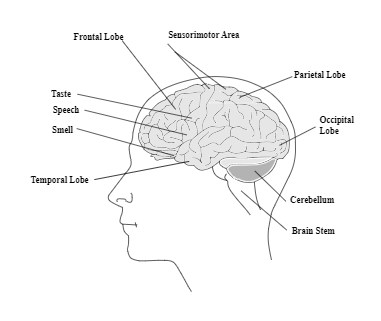
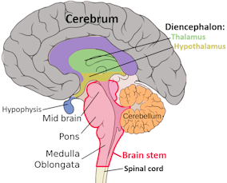
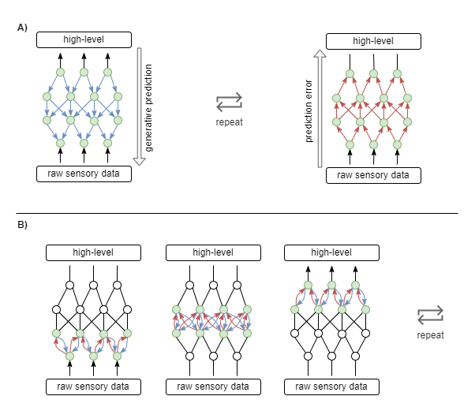
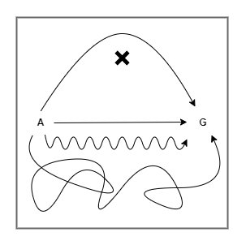
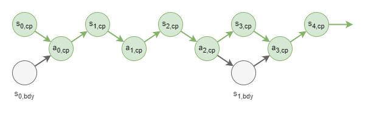
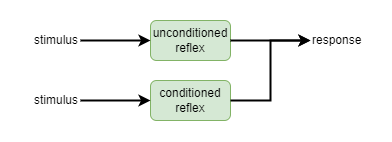
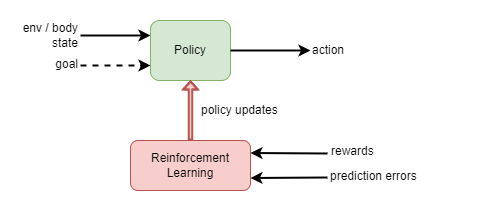
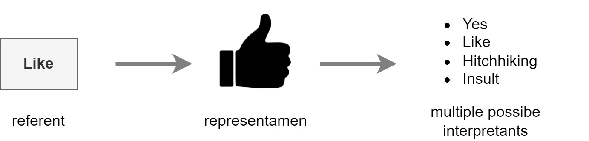
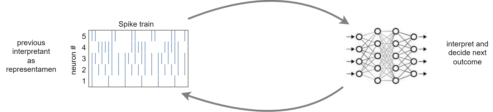
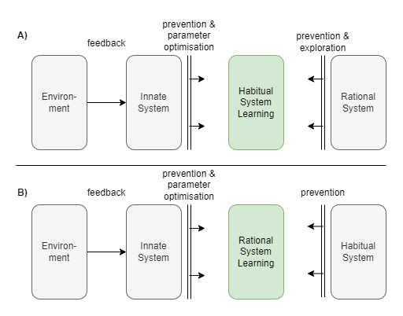

_This is a work in progress._

_Please come back later._

Abstract:
- Consciousness is produced by a semiotic multi-step planner state machine with meta management. 

Contents:

[Part I - Introduction](#part-i---introduction)
* [I.1 A Question of Consciousness](#i1-a-question-of-consciousness)
* [I.2 Summary of Thesis](#i2-summary-of-thesis)
* [I.3 Background - Consciousness](#i3-background---consciousness)
  * [Questions of Consciousness](#questions-of-consciousness)
  * [The Purpose of Consciousness](#the-purpose-of-consciousness)
  * [General Theories of Consciousness](#general-theories-of-consciousness)
  * [Specific Theories of Consciousness](#specific-theories-of-consciousness)
  * [A point of Central Unification?](#a-point-of-central-unification)
  * [More Reading](#more-reading)
* [I.4 Background - Biology and Neuroscience ](#i4-background---biology-and-neuroscience-)
  * [Functional map of brain](#functional-map-of-brain)
  * [Neural activity waves and the Predictive Coding theory of brain function](#neural-activity-waves-and-the-predictive-coding-theory-of-brain-function)

[Part II - Problems in Simple Synthetic Control Processes](#part-ii---problems-in-simple-synthetic-control-processes)
* [II.1 Interlude: Environment, Body, and Control Processes (first part)](#ii1-interlude-environment-body-and-control-processes-first-part)
* [II.2 Complexity and the need for Processing Loops](#ii2-complexity-and-the-need-for-processing-loops)
* [II.3 State Trajectories in a Multi-iteration Processor](#ii3-state-trajectories-in-a-multi-iteration-processor)

[Part III - Problems in Complex Synthetic Control Processes](#part-iii---problems-in-complex-synthetic-control-processes)
* [III.1 Meta-management in Deliberative Systems](#iii1-meta-management-in-deliberative-systems)
  * [State Trajectory Control during Body Action](#state-trajectory-control-during-body-action)
  * [State Trajectory Control during Multi-iteration Processing](#state-trajectory-control-during-multi-iteration-processing)
  * [State Trajectory Control during Iterative Inference](#state-trajectory-control-during-iterative-inference)
  * [State trajectory control in summary](#state-trajectory-control-in-summary)
  * [Objective learning](#objective-learning)
  * [Mode control](#mode-control)
  * [Mode identification](#mode-identification)
  * [Distributed cooperation](#distributed-cooperation)
  * [Certainty measurement / reaction](#certainty-measurement--reaction)
* [III.2 Interlude: Mechanisms of Standard Control Processes](#iii2-interlude-mechanisms-of-standard-control-processes)
  * [Stateless reactive control process](#stateless-reactive-control-process)
  * [Stateful reactive control process](#stateful-reactive-control-process)
  * [Planning control process](#planning-control-process)
  * [Expectation-Maximisation / Iterative Convergent Control Processes](#expectation-maximisation--iterative-convergent-control-processes)
  * [Hand-written Control Processes in AI vs Biologically Plausible Control](#hand-written-control-processes-in-ai-vs-biologically-plausible-control)
  * [A Biologically Plausible Planning Control Process](#a-biologically-plausible-planning-control-process)
* [III.3 Meta-control Options in Meta-management](#iii3-meta-control-options-in-meta-management)
* [III.4 Meta-observation Options in Meta-Management](#iii4-meta-observation-options-in-meta-management)
* [III.5 Architectural Options for Meta-management](#iii5-architectural-options-for-meta-management)
  * [Implicit Meta-management](#implicit-meta-management)
  * [Independent Meta-management](#independent-meta-management)
  * [Inline Meta-management](#inline-meta-management)
  * [Chapter Summary](#chapter-summary)

[Part IV - Problems in Biological Control Processes](#part-iv---problems-in-biological-control-processes)
* [IV.1 Interlude: Embodiment](#iv1-interlude-embodiment)
  * [Identification of Source](#identification-of-source)
  * [Schema](#schema)
  * [The Ego in "I"](#the-ego-in-i)
  * [Emotions](#emotions)
  * [Meaning Attachment](#meaning-attachment)
* [IV.2 Meta-cognition](#iv2-meta-cognition)
  * [Analysis of Meta-cognition](#analysis-of-meta-cognition)
  * [First-order vs Conscious](#first-order-vs-conscious)
* [IV.3 Modes of Behavioural Control](#iv3-modes-of-behavioural-control)
  * [Innate behaviour](#innate-behaviour)
  * [Habitual behaviour](#habitual-behaviour)
  * [Rational behaviour](#rational-behaviour)
  * [Emotion](#emotion)
  * [Co-development of behavioural control systems](#co-development-of-behavioural-control-systems)
* [IV.3 Habitual and Rational Meta-management](#iv3-habitual-and-rational-meta-management)
* [IV.5 Semiotics](#iv5-semiotics)
  * [Objects, Representations, and Interpretations](#objects-representations-and-interpretations)
  * [Infinite semiosis](#infinite-semiosis)
  * [Semiotic Analysis of Control Processes](#semiotic-analysis-of-control-processes)
    * [Body action control](#body-action-control)
    * [Meta-management of CP state trajectory](#meta-management-of-cp-state-trajectory)
    * [Meta-learning](#meta-learning)
    * [Summary](#summary)
  * [Trains of Thought](#trains-of-thought)
* [IV. x Representations](#iv-x-representations)
  * [Representation Redescription Theory](#representation-redescription-theory)
  * [Architectures of Redescription](#architectures-of-redescription)
* [IV.y Deeper Dive into Meta-management](#ivy-deeper-dive-into-meta-management)
  * [Reusable Domain Knowledge](#reusable-domain-knowledge)
  * [Summary of Meta-management Architecture](#summary-of-meta-management-architecture)
* [IV.z Distinguishing Meta-management from Standard Control](#ivz-distinguishing-meta-management-from-standard-control)
  * [State Representation](#state-representation)
  * [Pathways](#pathways)
  * [Learning](#learning)

[Part V - Solution](#part-v---solution)
* [V.1 The Architecture of Subjective Experience](#v1-the-architecture-of-subjective-experience)
* [V.2 Subjective Experience State](#v2-subjective-experience-state)
* [V.3 Interpretation of Subjective Experience States](#v3-interpretation-of-subjective-experience-states)
  * [Rounding it out](#rounding-it-out)
* [V.4 The Properties of Subjective Experience](#v4-the-properties-of-subjective-experience)
  * [Homunculus](#homunculus)
  * [Conscious and Unconscious Thought](#conscious-and-unconscious-thought)
  * [Subjective experience is "always on"](#subjective-experience-is-always-on)
* [V.5 Conditions of Subjective Experience](#v5-conditions-of-subjective-experience)
  * [Access to computational state](#access-to-computational-state)
  * [Processing of computational state](#processing-of-computational-state)
  * [Subjective experience state](#subjective-experience-state)
  * [Representational and processing capacity and qualities](#representational-and-processing-capacity-and-qualities)
  * [Modelling](#modelling)
  * [Attention](#attention)
  * [Self-schema](#self-schema)
* [V.6 Degrees of Subjective Experience](#v6-degrees-of-subjective-experience)
* [V.7 An example of an alternative consciousness](#v7-an-example-of-an-alternative-consciousness)

[Part VI - The Intuitional Gap](#part-vi---the-intuitional-gap)
* [VI.1 The Explanatory Gap and the Problem with Intuition](#vi1-the-explanatory-gap-and-the-problem-with-intuition)
* [VI.2 Argument By Elimination](#vi2-argument-by-elimination)
* [VI.3 Argument By Delusion](#vi3-argument-by-delusion)

[Part VII - Predictions and Conclusions](#part-vii---predictions-and-conclusions)
  * [Convergence of Meta-Management](#convergence-of-meta-management)
  * [On the Causality of Consciousness](#on-the-causality-of-consciousness)
* [References](#references)

---

# Part I - Introduction

# I.1 A Question of Consciousness

It has been said that the field of neuroscience is data rich, and theory poor. While vast quantities of data are available from the nature of individual neurons to the activity of the brain as a whole, we lack functional theories of cognitive function in order to make sense of that data. While theories exist, they are just not detailed enough [citation, and fleshing out].

That problem is no less poignant for the question of consciousness. What is the basis of consciousness? It's underlying mechanisms? What makes one thing conscious, while another is not? What is this ethereal "something other" that seems to be associated with conscious experience - the "what it feels like" to be conscious [citation, nagal]? We have ample information about so called _correlates of consciousness_ - neurological data about high level brain activity at the time of conscious experience. But we lack an effective functional theory to compare that activity against. While many _theories of consciousness_ (TOC) exist, they lack the details needed to sufficiently explain the neurological data ..._todo: needs some more precise wording_.

One particular attribute of interest is best explained through contrast. When we look at a rock rolling down a hill, many of us would imagine that the rock has no experience of itself or of its current activity in rolling. The rock has nothing in its physical makeup that could behave like neurons, and thus no capability for computational or cognitive processing of any sort in order to capture its state and activity, nor to consider that state and activity. Many who have belief in some kind of spiritual reality also do not imagine the rock to have a form of spirit that could comprehend or somehow sense its existence. In the short, the rock is both not alive and not aware.

A plant is alive. Furthermore, a plant can react to its environment. But again many of us would imagine that the plant produces its reactions without any real "awareness" of what happens to it and what it does in response. Instead, we imagine that the plant is an entirely (bio-chemical) mechanical process that just operates its mechanics as is.

Contrast that to humans. We have some sort of internal experience of the things that happen to us, of the things we do in response, and of and the thoughts that swim around our brain while all of that is happening. That internal experience is variously referred to as _phenomenal consciousness_ [citations] and _subjective experience_ [citations]..._todo: any other terms?_. I shall use the term _subjective experience_ in a hope to avoid some of the debate associated with other terms. What is peculiar about subjective experience is that despite hundreds of years of theorising [citation], we cannot explain a) what the underlying processes are that produce subjective experience, nor b) why we might have subjective experience in the first place.

_todo: clarify that I consider any kind of experience as potentially having subjective experience, including but not limited to: sensory perception, bodily awareness, memory, imagination, emotion, desire, action, and thought. And clarify that I am referring to all aspects of subjective experience, including awareness of that experience and any kind of "something extra" or "raw feels" associated with it.

Chalmers makes the claim that no physical property, mechanical or computational process known to us today can explain subjective experience [citation], and the issue has become known as the _Hard Problem of Consciousness_. This problem is so "hard", that it has led many, Chalmers included, to pose non-materialistic theories: theories that incorporate some form of reality outside of what we can measure through physical means.

This article is interested in resolving that most perplexing question of consciousness. I present the case that subjective experience can be fully explained through materialistic means. Not only that, I present a theory that explains _why_ and _how_ subjective experience occurs - the underlying mechanisms of subjective experience.

The theory presented here provides an opportunity for testing against empirical evidence. .....

The theory presented is compatible with ...._todo: HOT, IIT, competition theories....._ In fact, many of the ideas presented here are not new. But I believe this to be the most comprehensive attempt to combine ideas together at the most detailed level. I suspect that in many respects, a key skill of anyone doing research in this area is to sieve through the many partial stories and see how they can be linked together.

# I.2 Summary of Thesis

I believe that three things go hand-in-hand: general intelligence, meta-management, and consciousness. Further, understanding these systems must proceed in that order. Thus, in order to understand why we have subjective experience, we need to begin to develop a theory of general intelligence and of the processes that restrain it from cascading into chaos. This article presents an end-to-end argument following that thread.

To save the impatient reader from the tedium of waiting till the end, the entire argument is first presented here in brief. Background explanations and some definitions are omitted for the sake of brevity. The rest of the article is devoted to detailed explanations of each of the logical steps in the argument thread here.

Any computational system is limited in the complexity that it can handle within a single execution of its computational process. For embodied agents, this appears as a limit on the environmental complexity that they can sufficiently model and respond to within a single executional iteration. For more complex problems, multiple iterations of processing are required in order to determine the next physical action. Such recurrency in processing may for example entail further analysis of the environment in order to better model its state; or consideration of alternative action plans. In biology, this provides scope for evolutionary pressures to trade off between a more energy hungry complex brain and a simpler less energy intensive one that takes longer to make some decisions. Van Bergen & Kriegeskorte (2020) make the case that recurrency is indeed employed in biology for that very reason.

During the execution of a _multi-iteration_ controller within an embodied agent, its control process (CP) passes through an internal state trajectory that is only occasionally associated with interaction with the physical environment. That internal state trajectory can become increasingly disassociated with the physical environment the more complex the problem space and the longer time required for deliberation. If the multi-iteration processor must also learn through reinforcement then it is likely to exhibit chaotic and unproductive behaviour, particularly so during the earliest stages of learning. Reinforcement from the environment may be too sparse for efficient learning to take place, and simple rules that penalise longer deliberation time may be insufficiently advanced to cater for the complexity of problem domains that the agent may be faced with. Explicit meta-management processes are required to observe the control process, to model its behaviours, to track its success rate, to act upon it to prevent chaotic behaviours that could harm the agent, and to participate in providing rewards and penalties with more advanced problem-domain aware knowledge than just a simple penalty for deliberation time.

In a complex biological brain that can operate its body effectively within the real world, including all the complexity of modern human life, the systems and processes required to model and understand the environment and to interact with them are immense. It turns out that the systems required to effectively carry out meta-management are similarly complex. More importantly, the systems required for meta-management are similar to those required for primary control: observing, modelling, inference, planning, sequencing, controlling. Additionally, the domain knowledge required by the meta-management process in order to effectively meta-manage the control process is often strongly associated with the domain knowledge employed by the primary control process at the time. The level of overlap between primary control and meta-management implies a radical solution: that the control process meta-manages itself.

In order to meta-manage itself, the control process needs to observe itself. This can be achieved through a _meta-management feedback loop_ that observes the state of the control process, observes the recent trajectory of the control process, distils that into a high-order representation with lower dimensionality, and makes it available to the control process as a sensory input signal. Thus, the fact that we have awareness of some aspect of our own mental state is a direct result of the need for meta-management. And that meta-management feedback loop is a 6th sense.

The existence of the meta-management feedback loop does not alone explain subjective experience. Two more ingredients are required: interpretation and meaning. In a complex organism such as a human being, the brain maintains _schema_ that represent and track the characteristics of different aspects of the individual. This includes the body schema, which models and tracks the location and orientation of the limbs, their abilities, and whether any injuries have been acquired. This includes schema about regularly encountered external things, such as is required to mentally track the location and orientation of the wheels while driving a car over potholes. With the introduction of the meta-management feedback loop, this also includes schema for tracking the state and capabilities of the mind. And, importantly, it includes a strongly developed sense of self vs other. All external and internal sensory inputs (including the meta-management feedback loop), all schema states, are labelled as to their source. Different source labels imply significantly different meaning in terms of, for example, the level to which the agent can affect that state.

External sensory inputs, meaning association, and feedback loop together are interpreted by the brain and a decision made about the next action. Information about that action and/or the mental state that produced it is available via the feedback loop in the next iteration of processing. This creates a continuous cyclic stream of ever changing inputs, states and actions. As the control process decides to perform some body action, knowledge of that chosen action is immediately available as a sensory input before the action is even started. As the control process chooses to deliberate further on a problem at hand, knowledge of that deliberation and is immediately available. At every moment in time, the control process can choose to attend to external matters, to continuation of the current deliberation problem at hand, or to the very feedback sense that it receives continuously while it is usually distracted doing other things. If the control process stops to consider its own feedback sense, compares that to memory of recent deliberations, compares that to its schema of self vs other, it necessarily concludes that it has its own "stream of thought". That stream of thought is subjective experience.

The metaphor of a _philosophical zombie_ was introduced to hypothesise a human-like individual that has all the behavioural characteristics of a human, including voicing that it is conscious, without actually experiencing subjective experience. A philosophical zombie is _behaviourally indistinguishable_ from a human with consciousness. I argue that, if the zombie employs the mechanisms given in the explanation above (and outlined in more detail in the chapters that follow), then it is also _computationally indistinguishable_ from a human with consciousness. In other words, if we were to assume an ability to tap into all of the inner state and workings of a brain, and if we were to compare the philosophical zombie from the conscious human, we would find no difference. At that point I argue that the zombie is not a zombie after all, but instead is a fully conscious human being having subjective experience.

Finally, I argue that our disgruntlement with such an explanation is not an _explanatory gap_ [citation], but an _intuitional gap_. Nagal famously pointed out that we have no conception of and no way of developing a conception of what it is like to be anything other than ourselves [citation]  [is the 'no way of developing a conception' reference due to 'The Harder Problem of Consciousness'?]. But that does not stop us making assumptions about what should and should not experience subjective experience. It took us a very long time to accept that animals could have any form of consciousness and subjective experience, and likely many still deny that outcome [details, citations]. If we have no way to conceive of the experience held by an animal, why should we be so adamant about its properties? The answer simply is our deluded intuition. Our brains excel at finding patterns and extrapolating from them. This works well when the physical environment around us is there to provide an error signal. But when no error signal is available, we are prone to delusion. Our minds create such a strong sense of self vs other by keying that information into every sensory signal that we ever receive, so that our senses seem to take on an extra quality of realness, of subjectiveness, of _qualia_ [citation]. That seeming extra quality is further processed by the same system that produced it, reinforcing the delusion that the qualia is something extra, beyond mere sensory information. And thus we are deluded into the intuition that subjective experience is somehow more than can be produced by mere computational processing.

# I.3 Background - Consciousness
Many theories exist about the nature of consciousness. A very brief summary of such theories will be given here. This serves two purposes. Firstly, to provide a background to readers who are not familiar with the topic. Secondly, to define clearly the particular meanings that I will use for various key terms throughout the rest of the article.

The word "consciousness" is an overloaded term, ie: that it has many meanings, with the particular meaning depending on context. Furthermore, consciousness of the sort that I wish to talk about here is an ill-defined concept. For example, consider the following working definition:

> By consciousness I simply mean those subjective states of awareness or sentience that begin when one wakes in the morning and continue throughout the period that one is awake until one falls into a dreamless sleep, into a coma, or dies or is otherwise, as they say, unconscious. (Searle, 1990)

Firstly, this is not a definition, but an example. One that implores the reader to refer to their own intuition in order to guess the author's meaning. Secondly it leaves ambiguous the case of dreams, which many might argue also carry some extent of conscious-like awareness. But this is typical of any research in this field, and I shall do no better.

Here's my attempt at defining consciousness of the form that shall be discussed here:
* Consciousness is not just the state of being awake. It is the collection of first-person subjective experiences that we have while awake. Not only do we have such experiences, but we can be aware of the fact that we are having or have had those experiences. We also have first-person subjective experiences while dreaming, and thus consciousness refers to those experiences too. In contrast, consciousness is absent when in deep sleep, and presumably when in vegetative comas. Likewise we are not conscious of everything that happens in our brain, even at the best of times. For example, when you look across the room and observe a chair, you have no awareness of any of the processes that just occurred within the brain that took the visual sensory information and identified that a chair was present. So, consciousness includes the things that you aware of, and excludes those things that you are not aware of.

Unfortunately there is still much ambiguity and room for disagreement. But it will suffice as a start so that I can refine some ideas as we go along.

## Questions of Consciousness
For the study of consciousness, we have three broad questions that we wish to answer, that we can paraphrase as "what, why and how?":

* **What:** are the defining characteristics and properties of consciousness? ie: what do we look for in order to identify whether some thing or some creature experiences consciousness, or to distinguish whether a particular mental state is conscious? Also, what kinds of properties are we trying to explain through an explanation of consciousness?
* **Why:** does it exist? ie: why did it evolve? what functional benefit does it offer over and above a creature that lacks consciousness?
* **How:** does it occur? ie: what are the underlying mechanisms that produce consciousness?

The definitions given above are examples of attempts to answer the "what" question, but there are many more details yet to be elaborated on.

Spanning across the "what, why, and how" questions are a different set of questions, often referred to as questions of _creature consciousness_ and _state consciousness_:
* **Creature Consciousness:** what is it about certain things (humans, animals, maybe other kinds of things) that results in them having consciousness, while other things do not?
* **State Consciousness:** what is it about certain brain states that mean that the individual has conscious experience of those states? And which aspects of those states are associated with consciousness?

This leads to different variants of the "what" question, two examples of which are a) what are the characteristics associated with creature consciousness? b) what kinds of things are we conscious of?

A good answer to the former requires us to answer the questions of why and how. But the latter is more open to investigation on its own. A few kinds of experience have been identified:
* **perception:** specifically via the traditional five senses of sight, sound, smell, taste, touch that give us information about the world external to us
* **bodily awareness:** this includes strong feelings such as pains and pleasures, and more subtle body-state awareness such as balance and proprioception
* **memory:** recalling past experiences, where that past experience may be any of the sorts described here
* **imagination:** conjuring images (and perhaps via other modalities) within our mind of things that do not exist
* **emotion:** the experience of feeling one's emotional state
* **desire:** the awareness of ones goals and desires
* **action:** experience and awareness of one's actions, or of the intent to act
* **thought:** an awareness of the sequence of thoughts, particularly via internal imagined worded vocalisations

The term "experience" itself is sometimes attributed to only a subset of the above, but I shall use it here to refer to any of the above where one could be said as being consciously aware of that experience. Or in other words, I take it that we can consciously experience all of the above "experiences".

We can also ask what it is about experiences that make them somehow _special_. Again an appeal to intuition is necessary. If a modern computer can produce interesting behaviour but we take it as granted that it has no conscious experience, and in fact nothing we would even call "experience" of any sort, then what are the properties of experience that are lacking in the computer? Another example uses a so called _philosophical zombie_ (or p-zombie for short), which is identical to a conscious human in every respect except that they have no conscious experience [citation: enc. phil; chalmers]. In particular, they behave in every way like a human, including having all the same conversations as a human, but all of their behaviour is produced in some way more comparable to the modern computer - there "no light on upstairs". We can say that the states of both the human mind and p-zombie include everything they need to include in order to produce behaviour, but that the state of the human mind also includes properties of experience that are lacking in the p-zombie.

These properties are the _phenomological properties_ of experience, also known as _qualia_ (Tye, 2021). Frustratingly, it has been painfully difficult to pin down these properties. They are often summarised simply as the "what it's like" to have experience (Nagel, 1974) or the "raw feels" of consciousness [citation]. Another problem with discussions of qualia is that such discussions often get caught up with the observation that perceptions don't always correlate exactly with reality; a case that is seen clearly with the way that our perception of colour of a particular object is only tenuously associated with the physics of light and its interactions with that object. How our perception correlates or fails to correlate with reality is an important question, and not entirely unrelated to the former question, but it is somewhat of a distraction when we are trying to define what qualia are in the first place.

One such property is that experiences seem to "look through" to other things (Siewert, 2004). While many debates exist, we seemingly always have experiences _of_ something (Siegel, 2021; Siewert 2022). That _something_ that experience is _of_ is referred to as the _intent_ of the experience (Crane, 2009). A key feature of the intent is that it is relatively easy to conceive how it is constructed through entirely mechanistic processes. That stands in stark contrast to the experience itself. Other properties that could perhaps be associated with experience itself include the individual's awareness of themself, and a sense of agency or purpose (Smith, 2018).

A problem that arises is whether the experience of its intent and the intent itself can be separated. This has led some to consider a conceptual separation, and perhaps even an actual separation, between the following (Block, 1995):
* **Access Consciousness:** awareness of the perception, body sensation, memory, imagination, emotion, desire, action, or thought, to a sufficient extent that the individual can in some way react to the experience
* **Phenomenal Consciousness:** the first-person subjective experience of those things.

In general the two are tied together. Access consciousness excludes non-conscious processes, such as by being restricted to awareness of experiences that have a phenomenal nature. Phenomenal consciousness has a content, and that content is access consciousness. But many debates exist, resting on more detailed analysis and on attempts to define these terms more accurately. There are claims that some phenomenal conscious experiences carry no representational qualities of the sort that characterise access consciousness, and thus we can have phenomenal consciousness without access consciousness. [....todo example from Block....]. Likewise, some definitions of access consciousness make it possible to have access consciousness without phenomenal consciousness.

I subscribe to the view that access consciousness and phenomenal consciousness are just different ways of looking at the same thing. Specifically, that access consciousness is a reference to the processes that construct the specific _content_ of consciousness, including not just the intent but also its "raw feels", while phenomenal consciousness refers to the _question_ of why that specific content became conscious and others did not. Mind you, this is not a standard view; most would associate the raw feels with phenomenal consciousness.

## The Purpose of Consciousness
Why does consciousness exist? Presumably conscious experience confers some sort of benefit to the individual in order that it evolved. In order words, we assume that it serves some _function_ or _functions_, that those functions are useful, and that the individual would be an a disadvantage if it were lacking that function.

When attempting to decipher the _function of consciousness_, there are a number of different angles that can and should be considered (Niikawa et al, 2020; Rosenthal, 2008). Firstly, we need to distinguish whether we are asking about creature consciousness or state consciousness. On the one hand, we're asking whether the creature as a whole benefits from having conscious experience. On the other hand, we are asking about whether a given process benefits from having conscious experience associated with part or the whole of that process.

A second important consideration is to distinguish whether we are talking about the _functional basis_ of consciousness, or the _functional contribution of consciousness_ (Niikawa et al, 2020). As we now understand, many brain processes occur unconsciously, including many processes that associated with perceptions and thoughts that we consciously experience. The functional basis of consciousness is an otherwise unconscious process that _produces_ conscious experience. In contrast, the functional contribution of consciousness is the thing that conscious experience itself produces. It is whatever behaviour or other function that conscious experience bestows upon the individual and that they would not otherwise have had.

Unfortunately, when we understand so little about the processes underlying consciousness, it can be very hard to tease those two conceptions apart. Thus most work that attempts to pinpoint a purpose for consciousness could be said more accurately to identify a correlation and to then build up a theory around that correlation.

A number of such theories have been proposed that either attempt to directly suggest a functional purpose for consciousness, or that merely suggest a possible purpose as part of larger theories into the _what_ or _how_ of consciousness. Some broad ideas follow.

**Integration and Global broadcast:** a predominant feature of consciousness is that it appears to pull together multiple streams of information into a single coherent representation and than make that available for further processing by multiple systems. This is held as the key purpose of consciousness within a number of theories, including Global (Neuronal) Workspace Theory (Baars and Franklin, 2007; Dehaene et al, 2003; Dehaene, 2014), IIT (Tononi and Sporns, 2003), and Supramodular Interaction Theory (Morsella, 2005).

**Flexible behaviour:** a predominant feature of consciousness is its apparent association with flexible behaviour. This can be characterised as an ability to adapt to novel situations more rapidly than would be expected from "learning". A closely related and somewhat ill-defined conception is that of "rational behaviour". Many have proposed that consciousness serves to enable adaptive and/or rational behaviour (Kotchoubey, 2018; Morsella, 2005; Earl, 2004; Humphrey, 2002; Shimamura, 2000; Tye, 1996).

**Counter-factual reasoning:** Some have proposed that consciousness enables flexible and adaptive behaviour through specific mechanisms. One such example is that of enabling counter-factual reasoning through the ability to imagine alternatives (Kanai et al, 2019).

**Association learning:** Another specific case of flexible behaviour is through the ability to learn a seemingly unlimited range of associations, both from direct experience and from second hand experience such as observing others or being told about the association. It has been suggested that consciousness directly correlates with that ability and thus must be an integral part of the ability (Birch et al, 2020).

**Meta-cognition:** A view that some have taken, this author included, is that consciousness is strongly associated with meta-cognition (Fernandez Cruz et al, 2016; Paul et al, 2015; Flemming et al, 2014; Flemming et al, 2012; Cleeremans, 2007; Shimamura, 2000). For example, perhaps the point of the integration and broadcasting associated with consciousness is to obtain enough information to enable the individual to determine how best to gain more information (Kriegel, 2004). Or perhaps it is for the detection and correction of errors encountered when performing long chains of reasoning (Rolls, 2004 and 2005).

**Social interactions:** A fascinating possibility is that consciousness evolved as an integral part of our nature as a social species. Consciousness enables _theory of mind_ about one's own mind, and by extension, the minds of others (Frith, 2008; Bahrami et al, 2012; Flemming et al, 2012). Theory of mind plays a key part in enabling us to cooperate with other individuals.

**Volition:** Consciousness may simply be the magic ingredient that enables mobile bundles of matter to have volition in a _free-will_ sense (Pierson and Trout, 2017). For example, _Panpsychism_ holds that consciousness is a fundamental property of the universe (Chalmers, 1996), and of all the matter within it. A commonly presumed feature of such panpsychist consciousness is that it has free-will, and thus it would confer free-will onto the behaviour of fully-formed individuals.

**Functionless:** Another possibility is that consciousness confers no benefit to the individual. For example, this is implied by the claims of _Epiphenomenalism_ (Robinson, 2019). A slightly softer stance is that consciousness occurs as a side effect of other functions, where those functions themselves provide significant benefit to the individual, but consciousness itself does not add an extra benefit (Rosenthal, 2008). Under this view, consciousness is a side-effect of behaviour rather than a driver of behaviour.

Other supposed purposes of consciousness identify strong correlations but which don't really explain why consciousness is needed for that to occur. For example, consciousness appears to be essential for long-term episodic memory. We are unable to remember things that we were not conscious of at the time. (Tulving, 1987; Edelman et al, 2011).

## General Theories of Consciousness
I now describe some generic and specific theories of consciousness. To provide some grounding to the summary and to aid in comparing theories, a framework of a stack of conceptual layers is used, illustrated in the diagram that follows. This is not meant to imply a priori anything about the actual structure of consciousness and its underlying mechanisms. For example, none of the layers are assumed necessarily to exist a priori, nor is the particular illustrated order appropriate in every case.

* _**Conceptual layers used here to summarise theories of consciousness.** Substrate: the physical biology of the brain is viewed as a substrate that "hosts" other processes, such as computational processes. In some theories the substrate might potentially be replaced or emulated via some other substrate (eg: silicon neurons). A-conscious processes: all processes built upon the particular substrate (eg: neural signalling) that produce behaviour and/or affect the state of the brain. Some of these processes or their results are somehow associated with conscious experience, while others are not. Representation: some theories hold that particular kinds of representations are associated with conscious experience. Functional Structures: some theories hold that certain kinds of structure are key to conscious experience. Something Special: some claim that conscious experience is an effect that cannot be explained via purely materialistic means, or that we need some new kind of understanding to explain it. Subjective Experience: the ultimate effect of consciousness that we wish to understand._

The _substrate_ is the (generally physical) thing in which the processes of the mind are carried out. For example, biology and neuroscience has taught us that biological neurons are the substrate of the human mind. There is a conceptual difference between the thing that "hosts" the processes, and the processes themselves. Historically there has been three broad views with regards to the substrate. Perhaps the oldest view is the _dualist_ view of Descartes. In their view  there was the physical substrate, entailing the body and brain, and there was some other non-physical substance that hosted the mind, independent of the physical body (Descartes, 1644; Van Gulick, 2022). While few hold to that view today, it made more sense at the time when Descartes first proposed it. Reportedly Aristotle believed that the purpose of the brain was to cool the blood (Smart, 2022). Most today hold to a _monist_ view that there is only one substrate, and that this substrate is physical, for example the biological neurons of the brain. More generally, such _physicalistic_ or _materialistic_ views hold that the properties of physical substances and their interactions are entirely sufficient from which to base an explanation of everything about consciousness, even if we don't know enough about those properties just yet (Stoljar, 2023). An alternative monist view, that of _idealism_, is that nothing is physical and that everything we perceive exists only within our minds (Guyer and Horstmann, 2023).

Returning to the materialistic view, for humans and for any other animal that happens to have consciousness, we can say that the conscious mind is _realized_ upon the physical substrate of biological neurons. Is that the only physical substrate upon which consciousness can be realized? If consciousness is _multi-realizable_ then perhaps it could also be realized upon silicon neurons. Even more radically, perhaps the operation of neurons could be _simulated_ within a super computer, and a simulated brain could also by conscious. By extension, if multi-realizability is true, then any _functional isomorphism_ of a biological human brain should be not only conscious, but conscious in a human-like way. In contrast, _identity theory_ (specifically, _psycho-physical identity theory_) posits that there may be something special about biological neurons that give rise to subjective experience, and that non-biological functional isomorphisms would not have such experiences (Van Gulick, 2022) [todo: also see citations listed here: https://plato.stanford.edu/entries/functionalism/].

One view of brain activity is that is computational in nature (Rescorla, 2020a). In initial versions of this idea likened such computation to that of the _Turing machine_ (McCulloch and Pitts, 1943), with its serial computation, finite set of states, and random access memory. Later variations accepted that the brain wasn't exactly like a Turing machine, but was still Turing-like. In particular, Turing machines operate upon a finite set of symbols. Fodor's _representational theory of mind_ (Fodor, 1975, 1981, 1987, 1990, 1994 and 2008) extended that idea to more generic _representations_. Importantly, these representations could be hierarchically composed, enabling their computational model to create infinitely many variations of states, more closely mirroring our ability to form larger ideas by composition of smaller ones. Nowadays, most apply a _connectionist_ lens to computation (Marcus, 2001; Smolensky, 1988; Kriegesgorte, 2015), following advances in both our neuroscientific understanding of the brain and in artificial intelligence (Krizhevsky, Sutskever, and Hinton, 2012; LeCun, Bengio, and Hinton, 2015). Another lens recognises that the brain must deal with a significant amount of uncertainty and thus might actively include that within its representations and computations (Ma, 2019; Rescorla, 2020).

One particular line of criticism levelled at computational models draws issue with the idea of representation (Rescorla, 2020a). Initial views of the brain as a Turing machine, or at least Turing-like, suggested that the brain would operate against symbols in the same way that a computer does. This drew obvious criticism. But the modern connectionist view of computation is not immune. One particularly strong issue lies with the distinction between _syntax_ and _semantics_. Here, syntax refers just to the _form_ of the representation, while semantics refers to its _meaning_. A clear example of the distinction can be seen in the case of computers. In a modern computer, all information is represented via the _form_ of zeros and ones, regardless of its meaning. For example, a particular string of zeros and ones might _mean_ a particular base-10 number, or it might _mean_ the colour of a pixel. Furthermore, all computation is performed against the form alone. This can be seen in the way that two large base-10 numbers can be multiplied in a mechanistic way that has no knowledge that it is multiplying base-10 numbers, that sees only a sequence of binary bits and performs only a series of simple per-bit operations (Booth, 1951) that do not involve any multiplication. There exist arguments that all computation is of this form (Rescorla, 2020a), including that of the brain (Fodor, 1981). It seems intuitively problematic that the inherent meaning of the representation is discarded, and thus there is a reluctance to accept representation as being a complete story of mind.

My own stance is that meaning is not lost. For simple habitually repeated operations it is encoded within the process that performs the computation, and for complex operations the meaning is itself represented. But more on that later.

It is now known that many brain processes operate that neither directly nor indirectly lead to any kind of subjective experience. And for those processes that do have an impact on subjective experience, the vast majority of the details of those processes are still hidden from that subjective experience, including the operation of the processes and the content that they operate on. While earlier work assumed that most brain processes are conscious, there is increasingly strong evidence in fact that almost all mental processes are non-conscious, even for mental processes that are associated with attentive subjective experience. [citations, see Blind Brain Theory, also look to background discussions in Higher Order Thought Theory]
[see Rosenthal, 1990b, from Dennet's book, referenced pg 309]

An obvious question thus arises about why certain processes and/or representations would be associated with subjective experience and others would not. Is it sufficient that a particular kind of representation exists for it to be associated with subjective experience, or does that representation need to occur in conjunction with particular functional structures? For example, imagine that all aspects of the brain were understood to the point that we could identify exactly which representations are associated with subjective experience. Now imagine that an exact replica of a particular representation was encoded within the gates of a silicon memory chip within a computer. Most would argue that the silicon memory chip does not subsequently have subjective experience of that representation, because a representational state alone is insufficient for subjective experience. Some kind of functional structure presumably must be required to observe that representation. But if functional structures are indeed required, what are those functional structures? And what distinguishes those functional structures that are associated with subjective experience and those that are not?

A deeper philosophical question exists about whether representation and functional structures alone are sufficient to produce subjective experience, or whether something else is required. Thus perhaps qualia is a case of an extra _something special_ that we do not yet understand about physics, or that exists in a dualistic relationship to physics. These are the questions posed by the distinction between access consciousness and phenomenal consciousness. Consider this example provided by the Britannica online article on [philosophy of mind](https://www.britannica.com/topic/philosophy-of-mind/Qualitative-states#ref283995):

> Suppose that, in order to avoid the risks to his patient of anaesthesia, a resourceful surgeon finds a way of temporarily depriving the patient of whatever nonfunctional condition the critic of functionalism insists on, while keeping the functional organization of the patient’s brain intact. As the surgeon proceeds with, say, a massive abdominal operation, the patient’s functional organization might lead him to think that he is in acute pain and to very much prefer that he not be, even though the surgeon assures him that he could not be in pain because he has been deprived of precisely “what it takes.” It is hard to believe that even the most ardent qualiaphile would be satisfied by such assurances.

If all the representational and functional structures are in place for an individual to have both the external behaviours and internal mental behaviours of an individual in intense pain, can we even conceive it to be possible that they would not have the typical associated subjective experience of the pain?

## Specific Theories of Consciousness
_Higher-order Thought (HOT)_ and _Higher-order Perception (HOP)_ are a group of theories that focus on the form of the representation. It is claimed that there are broadly two types of cognitive state (Carruthers and and Gennaro, 2020; Rosenthal, 2004). _First-order states_ represent things that are typically world-focused, such as representations of perceptions. In contrast, _higher-order states_ represent things about first-order states.

Where a higher-order state _represents_ that a first-order state was _experienced_, then we have conscious experience. Several variations exist in this group of theories. HOP theories focus on perception, and in particular an idea that we have an explicit perceptual inner-sense that observes our cognitive state, for example in the same way that our visual sense observes the world outside (Armstrong, 1968 and 1984; Lycan, 1996 and 2004). HOT theories are computational theories that propose that higher-order states are _constructed_ from or about the first-order states. Some HOT theories propose that first-order states become conscious through the presence of associated higher-order states, and thus that we only experience such first-order states at the moment that a HOT in constructed about them (Rosenthal, 1986, 1993, and 2005). A subtle variation holds that certain first-order states are inherently _disposed_ to have associated higher-order states and that is sufficient for the first-order states to be experienced as conscious (Carruthers, 1996, 2000, and 2005). Some view that first-order states and higher-order states are related but independent, and thus that one kind can occur without the other, while others take a more _self-repreresentational_ view that higher-order states are somehow always constructed inline with their intentional first-order states (Gennaro, 1996 and 2012; Kriegel, 2003, 2006 and 2009).

_Global Workspace Theory_ (GWT) sees the brain as a system of individual computational processes that compete, and sometimes collaborate, to gain a winner(s)-take-all right to _broadcast_ their results to a _global workspace_ (Baars, 2021; Baars and Franklin, 2007). The state of the global workspace then forms the context upon which subsequent processing occurs by all those same computational processes. This occurs in a continuous and dynamic way typical of the parallel processing that we've come to understand about the brain. GWT is primarily a theory of cognitive processing that focuses on its a-conscious processes, representations, and functional structures. In doing so it offers a partial explanation of the underlying mechanisms of rational thought, or so called _general intelligence_. The link to subjective experience is by way of claiming that the global workspace is the content of subjective experience, based on correlations with the apparent integrative nature of conscious perceptual attention and decision making, forming an apparent single stream of consciousness (Baars, 2021). GWT is a abstract computational theory that composes high-level concepts such as a workspace, processes, frames, and competition and collaboration between processes. While it makes some claims about regions of brain involved, it doesn't explain how groups of neurons produce such behaviour. In other words, it omits important details about the substrate from its explanation.

GNT was formed by Baars (1988), but has been taken up and extended by many others, such as to provide a more detailed computational model (Franklin and Graesser, 1999), the addition of internal simulation (Shanahan, 2005), or to model via spiking neurons (Shanahan, 2008). Of particular note is _Global Neuronal Workspace_ theory (GNW). GNW takes inspiration from a growing view of neuronal interactions as _dynamical systems_ (Miller, 2016; Favela, 2020; Shapiro, 2013). It proposes how non-linear interactions between populations of neurons can create a sudden "ignition" effect, where multiple independent stimuli suddenly become mutually _salient_, particularly due to long-range axons from sensorial stimuli (Dehaene, Sergent, and Changeux, 2003). In other words, it proposes a specific mechanism of how groups of neurons can cooperate to form a single representation that is then broadcast to others.

The massive number of neurons within the substrate of the brain makes it hard to study how specific computational theories may or may not apply, both from the point of view of empirical neurological investigations and in analytical attempts to formulate how neurons interact to form those higher-level computational abstractions. One avenue is to embrace the combinatorial complexity and to examine the activity across _populations_ of neurons - ie: groups of neurons that are spatially close and/or are active together in some sense. This is seen in theories that view the brain as a _dynamical system_, mentioned earlier, use _information theoretic_ techniques, or that look at waves and oscillations in the pattern of activity.

The work on the _Theory of Neuronal Group Selection_ (TNGS) (Edelman 1987; Edelman 2003), also known as _Neural Darwinism_, and in particular its _Dynamic Core_ hypothesis (Edelman and Tononi 2000; Tononi and Edelman 1998), neither of which will be discussed here, introduced a quantitive measure of _neural complexity_ (Tononi et al, 1994). The measure is based on the information theoretic idea of _mutual information_. Consider two random variables _x_, and _y_. If knowing the value of _x_ informs me of anything about _y_, then we say that they have mutual information. The more _x_ and _y_ correlate, the more mutual information there is between them. In contrast, if they are statistically independent, then they carry zero mutual information. Mutual information is important if you care about finding correlations or relationships between things (more mutual information is good), and if you care about being able to store or represent large amounts of detail (less mutual information is good). Within the brain there will be regions of activity that are _differentiated_: to a large extent uncorrelated perhaps because they are busy with different functions, or perhaps because the brain is in a state of disorganised chaos. Likewise there will be regions of activity that are _integrated_: strongly correlated because for example that the brain is organised and focused on one task, or perhaps because it has a lot of unnecessary duplication. Neural complexity measures the extent to which activity within the network is both integrated and differentiated by computing the average mutual information between bipartitions of the network.

_Integrated Information Theory_ (IIT) provides another closely related measure that claims to calculate an objective quantity of consciousness, indicated as Φ (phi). This looks not just for mutual information, which is inherently bidirectional (ie: just a correlation without any idea of cause-effect relationships), but attempts to measure the extent to which certain information is _causually effective_. It then computes the amount of causally effective information that can be integrated across the weakest link of the the system (Tononi and Sporns, 2003; Tononi, 2004). This has since received two major revisions, first in 2008 to measure based on active dynamics rather than static configuration (Tononi, 2008), and then again in 2014 with the introduction _maximally irreducible conceptual structures_ (MICS) (Oizumi, Albantakis, and Tononi, 2014).

Another approach is to look at the dynamics of waves and oscillations of activity within the brain. For example, in older studies it was found that consciousness coincided with so called _gamma-waves_, in the frequency range 30 to 80 Hz, in electroencephalogram (EEG) readings. That is now understood as being the outwardly measurable effect of the micro-interactions at the neuronal level (Llinás, Ribary, Contreras & Pedroarena, 1998; Friston et al 2014; Hunt and Schooler, 2019). In particular, a productive line of thought has been to treat such brain activity as harmonics, with different global and sub-global populations of neurons dynamically forming groups of closely synchronised activity (Atasoy, Donnelly, and Pearson, 2016; Atasoy et al 2018). The ever changing groupings of neurons that create those harmonics is proposed to be self-organising, with one theory describing _self-organizing harmonic modes_ (SOHMs) (Safron, 2020). The larger _Integrated World Modeling Theory_ of consciousness (IWMT) (Safron, 2020), where SOHMs were introduced, combines IIT and GNW with the _Free Energy Principle_ (Friston, 2019) and _Active Inference Framework_ of Friston (Friston, Kilner, and Harrison, 2006; Friston et al 2017; Sajid et al 2021).

It is important to note that while such theories find useful correlations to consciousness, known as _neural correlates of consciousness_ (NCC), they do not explain the mechanism by which those correlated activities or measures produce subjective experience.

Other noteworthy theories of consciousness include the _Orch OR_ theory of consciousness [citation], and pan-psychism [citation].

## More Reading
For those who wish to learn more, the _Stanford Encyclopedia of Philosophy_ has excellent articles covering many topics related to this area. In particular I recommend articles on: [Consciousness](https://plato.stanford.edu/entries/consciousness), [The Unity of Consciousness](https://plato.stanford.edu/entries/consciousness-unity/), [The Contents of Perception](https://plato.stanford.edu/entries/perception-contents/), [Perceptual Experience and Perceptual Justification](https://plato.stanford.edu/entries/perception-justification), [Representational Theories of Consciousness](https://plato.stanford.edu/entries/consciousness-representational/), [The Computational Theory of Mind](https://plato.stanford.edu/entries/computational-mind/), [Neuroscience of Consciousness](https://plato.stanford.edu/entries/consciousness-neuroscience/), [Higher-Order Theories of Consciousness](https://plato.stanford.edu/entries/consciousness-higher), [Introspection](https://plato.stanford.edu/entries/introspection/), [Mental Causation](https://plato.stanford.edu/entries/mental-causation/), [Epiphenomenalism](https://plato.stanford.edu/entries/epiphenomenalism/), and [Animal Consciousness](https://plato.stanford.edu/entries/consciousness-animal/). The Wikipedia article on [Experience](https://en.wikipedia.org/wiki/Experience) also provides an excellent summary of various concerns.

For more background on the various theories of consciousness, I recommend Seth (2022) and the Scholarpedia article on [Models of Consciousness](http://www.scholarpedia.org/article/Models_of_consciousness).

Many of the broad topics on consciousness require a background in philosophy to really understand them. For some readings, I recommend the Stanford Philosophy articles on [Metaphysical Explanation](https://plato.stanford.edu/entries/metaphysical-explanation/), [Phenomenology: 1. What is Phenomonology](https://plato.stanford.edu/entries/phenomenology), [Functionalism](https://plato.stanford.edu/entries/functionalism/), and the Wikipedia article on [Intentionality](https://en.wikipedia.org/wiki/Intentionality).

# I.4 Background - Biology and Neuroscience 

Todo - brain parts etc

Purpose:
* provide framing that my box-and-lines theory doesn't assume a box-and-lines implementation.
* highlight that processing occurs at the system level, dependent on all the systems involved, that no system on its own can really do anything much
* state that we now know they are not discretely modular
    * ie: view that neurons that are closest to a particular sensory modality will tend to process things related to that modality, with closer neurons more closely related to the raw signals, and further neurons more abstract and perhaps taking in more information from other places (Mountcastle, see note an "Articles on Predictive Coding"), and similar for motor control (the monkey stimulous thing)
    * this can be seen quite clearly in the case of the primary and secondary visual cortices.

## Functional map of brain

* _*todo.* todo (Image courtesy of publicdomainvectors.org)._

* _*todo.* todo (Image courtesy of [Belomaad](https://sites.google.com/view/biologyerettsegi), CC BY-SA 4.0, via Wikimedia Commons)._

## Neural activity waves and the Predictive Coding theory of brain function
A traditional conception of brain processing of senses can be characterised as "perception by representation": that the brain attempts to use the senses to accurately represent what is observed. A typical assumption associated with that characterisation is that sensory perception is a largely "feed-forward" process: raw low-level sensory signals are hierarchically interpreted into higher and higher-level representations, eventually identifying specific objects, their boundaries, and other properties such as location, pose, and motion (Buckley et al, 2017; Walsh et al 2020).

An alternative conception is characterised as "perception by inference": that the brain attempts to infer the (hidden) state of the environment, known as the _latent state_, from sensory signals. In this conception, rather than predicting a representational model that _correlates_ to the sensory signals, the brain attempts to model the underlying structure that _caused_ the sensory signals (Friston, 2005). Furthermore, rather than producing this inference within a single forward pass, it is derived through an iterative process employing both feed-forward and feed-back signals (Rao and Ballard, 1999).

One particular theory, Predictive Coding, holds that much of brain function is the result of such inference (Friston, 2010; Clark, 2013 and 2019; Kilner, Friston, Frith, 2007), including not just perception but also action generation (Friston, 2010). The explanation stems from the observation that Bayesian inference is analytically intractable for most problems, but can be solved through the _empirical bayes method_ by _factorising_ the problem space (Buckley et al, 2017). A so called _generative model_, which models the the causal structure from environment state to sensory signal, can be approximated by factorising it in three ways (Buckley et al, 2017; Millidge, Seth, Buckley, 2021). Firstly, the state of the environment at a given moment in time can be factorised as a multi-variate combination of independent gaussians. Secondly, the time-dependent dynamics of state can be factorised into the current value, its first-order derivative, its second-order derivative, and so on. Thirdly, the unknown relationships between latent causes can be modelled and learned as a hierarchy of layers (Friston, 2008), with each successive layer acting as a generative model of the layer before.

This factorisation can be distributed across the neural structure of the cortex (Mumford, 1991; Rao and Ballard, 1999), with activity of each individual neuron representing the mean of the gaussian distribution of the particular variable that it models (Buckley et al, 2017), and possibly also representing the variance (Feldman, Friston, 2010). Some aspects of this 3-dimensional factorisation can be seen in the structure and activity within the brain. For example, the hierarchical nature of brain processing can be seen in the way that  the primary visual cortex appears to process visual information at a lower level of representation than the visual association area, and similarly for the primary and secondary somatosensory areas [citations]. Additionally, there is some evidence that neurons within the cortex are formed into _columns_, where the neurons in each column together model a single multi-dimensional variable (Mountcastle, 1997), and likely with more accurate modeling than via the simple assumption of multi-variate independence.

* _**Predictive coding in action.** A) Top-down computations predict sensory data based on high-level priors. Bottom-up computations indicate prediction errors, leading to updated priors. The process is repeated until prediction errors are sufficiently reduced. B) The same top-down and bottom-up interactions occur at the micro level between adjacent pairs of the hierarchical layers, and at the macro level across the entire system._

Counter-intuitively, under the theory of predictive coding, the forward computational direction from sensory signal to higher-level representation, also known as the _bottom-up_ calculation, conveys only prediction error. The main computation is performed by the generative model during _top-down_ computation, ie: in backward direction from high level representation towards low-level sensory input. Each layer within the hierarchy represents a _prior_ on the layer below, _conditioned_ on the layer above. At time of inference, bottom-up prediction error is used to identify priors that don't fit reality, which triggers further prediction errors up to higher levels. That is eventually returned with new top-down conditioning adjusting the priors, ultimately resulting in each layer representing its best guess of the latent state at its level of representation. Over longer timescales, bottom-up prediction errors are also used to learn better generative models (Friston, 2008).

This leads to a lot of activity. A novel sensory signal is likely to immediately trigger prediction errors against priors in low-level layers that were _framed_ by previous contextual information. Thus there is immediate short-range waves of generative prediction and prediction error activity (see panel B in the diagram above). In order to completely resolve the prediction errors, higher-level priors may need to be revised, resulting in long-range waves of activity (panel A in the diagram above). Activity eventually settles once prediction errors are sufficiently minimized across all layers.

Predictive coding offers an explanation of various otherwise puzzling features of perception (Millidge, Seth, Buckley, 2021), including so called "end-stopping" in visual perception, bistable perception effects under right/left-eye competition, repetition suppression, attentional modulation of neural activity, and of hebbian learning. The suitability of predictive coding as a larger theory of brain function is debated (Walsh et al 2020, and see commentaries on Clark, 2019), but the basic idea behind it may yet prove to be a good explanation of the waves of activity that we see in EEG and fRMI recordings.

---

# Part II - Problems in Simple Synthetic Control Processes

# II.1 Interlude: Environment, Body, and Control Processes (first part)

_...todo..._

# II.2 Complexity and the need for Processing Loops

In most artificial neural network (ANN) based reinforcement learning (RL) agents today, each input is associated with an immediately produced output. This means that in an embodied agent the choice of the next physical action is made by a single pass through its ANN(s): input nodes are populated with current sensory signals, matrix operations are carried out that permute and transform those input node values through the multi-layer network of weights, and the values produced by the output nodes are immediately taken as the chosen next action. This is true even for Recurrent Neural Networks (RNN). RNNs are _recurrent_ in the sense that state from a previous pass is made available to influence the output on the next pass with the next input value. In this way, when a time-bound signal stream is fed into the RNN, it produces an output stream where each value in the output stream is influenced not just by the current input but by all inputs received up until that point. However, the RNN still produces exactly one output for every input, and each output is produced by a single pass through its network.

* _**Single-iteration Artificial Neural Networks (ANN).** Each of these networks produce one output for each input, via a single pass pass through the network. In the context of an embodied agent, this means that the agent has no option for further deliberation of the same input._

Another form of recurrency is to execute multiple passes through the same network before producing an output. This form is common in hand-rolled algorithms, where it is usually referred to as processing _loops_. When an algorithm employs a processing loop, a single output may be produced for each input, but only after a variable length delay. Some inputs may lead to updates of internal algorithm state only, without producing an output. Or a single input may produce multiple outputs. Examples abound, but one familiar to those in the AI research community is the Expectation Maximisation algorithm. It takes as input a set of data points, produces as output a set of parameters that describes the input data set, and employs multiple iterations of alternating calculation of log-likelihood expectations and parameter optimisation. The alternating expectation and parameter optimisation loop is stopped according to a _halting rule_ that is either based on detecting diminishing returns in the improvement of log likelihoods or on completing a fixed number of iterations.

Some have begun to experiment with loops in ANNs. Complex results can be achieved with shallower networks when using a loop-style of recurrency [Kubilius et al (2019); Wen et al (2018)]. Loop architectures have been used to adaptively vary the amount of computation time allocated to problems, as Adaptive Computation Time [Graves, 2016], which has been suggested as an important component of next generation language decoder-encoders known as Universal Translators [Dehghani et al, 2018].

There is a practical limit to the complexity that a single-iteration processing architecture can achieve. The network can be made broader (more nodes in each layer) and deeper (more layers), but that increases the number of parameters that need to be optimised during learning. In earlier versions of ANNs, where smooth non-linearity functions such as sigmoid were used within hidden layers, the vanishing gradient problem [citation] meant that practical networks could not be more than a few layers in depth. Current state of the art ANNs obtain non-linearity through piecewise linear functions and enable many more layers before the vanishing gradient problem becomes an issue. However an upper bound on the number of layers is still recommended [details, and citation]. Even GPT 3 only uses 96 layers [citation].

_..todo: any estimate on number of layers in human brain?_

Another problem with a single-iteration processing architecture is that its fixed depth implies a tradeoff between the maximum complexity that the architecture can handle and the cost of training in order to cater for the average complexity of situations that the agent must cope with. Additionally, if we consider that such processing may entail multiple stages of processing, the order in which those stages is executed is fixed.

An architecture that employs multiple passes through its network can be conceptualised by unrolling its iterations into a much deeper single-iteration network. But it has a number of advantages. Its depth varies dynamically as needed, for example that it is deeper for more complex problems. If processing is made up of multiple separable stages, the order in which those stages are executed can now be dynamically varied. It is additionally quite natural to imagine that for certain problems, some stages will be simply omitted entirely.

* **Multi-iteration network.** Panel A: a multi-iteration network with the result from its output layer fed back as input. Panel B: an equivalent single pass network by unrolling the iterations into a deeper network assuming 3 iterations. Notice that in the depth-unrolled network, weights are shared between sections.

So, it can be said that there is a limit on the complexity that can be handled by a single pass through any computational process. While that computational process can be extended with more parameters, there are practical limitations to how much it can be extended. For embodied agents, this appears as a limit on the complexity of the environmental and of their own body that they can sufficiently model and respond to within a single processing iteration. In biological terms, this practical limit is manifested in terms of both the energy costs of larger brains and in terms of the time required to reach maturity of brain function.

To adapt to more complex environments, an embodied agent must employ multiple iterations of processing. This enables, for example, further analysis of the environment in order to better model its state; or further deliberation alternative action plans before proceeding. In biology, this provides scope for evolutionary pressures to trade off between a more energy hungry complex brain and a simpler less energy intensive one that might take longer to reach a decision for more complex problems. Van Bergen & Kriegeskorte (2020) make the case that recurrency is indeed employed in biology for that very reason.

_todo: Estimate of layer depth in brain?_

_todo: I use the term multi-step processing to clarify that I am referring to a particular form of recurrency where, for some materially significant portion of the process, the majority of its outcome is fed back as input.... yeesh, this is hard to quantify. _

_Todo: To avoid confusion with micro-level recurrency, this article uses the term "multi-step processing". 
or should I use multi-iteration processing everywhere instead?_

# II.3 State Trajectories in a Multi-iteration Processor

The course taken by an agent to get from a past state to its current state is its _state trajectory_. Analogous to the path taken by an agent while walking through a maze, the state trajectory describes the path of the agent through state space. Here the state space can refer to its possible locations in physical space, such as in the maze example, or to more abstract possible states, such as an encapsulation of all measurable aspects of the agent's body parts.

Not all state trajectories are good ones. The figure below illustrates a number of possible state trajectories from start state A to goal state G, while avoiding obstacle X. Each trajectory successfully reaches the goal, but they vary in other ways that may have significant impact to the agent. They length of the trajectory may indicate energy efficiency, which is important for an agent with limited energy reserves. The length may also indicate the time taken, which impacts whether or not the goal is reached "in time". The smoothness of the trajectory can be important. A jagged trajectory might indicate that the agent's physical body is moved in a chaotic way with abrupt stops and starts, causing damage to delicate moving parts from the stresses of that chaotic movement. A smoother trajectory may be easier for the agent to subsequently learn from and reason about in order to improve its later attempts; whereas a more chaotic path may add so much noise to the observations of the trajectory that the agent is unable to detect the most important patterns for such learning.

* _**Good and bad state trajectories.** Examples of some possible state trajectories from start state A, to goal state G, while avoiding obstacle X. The shortest and smoothest trajectory is assumed to be the best: the most energy-efficient, the quickest, the least stresses applied to the mechanics of the agent._

In a multi-step control process, the controller traverses a state space independent of the state of the body that it controls, as illustrated below. It needs to incorporate mechanisms to control its own state. Those mechanisms are referred to as _meta-management_, because they relate to management of the controller's own processes, rather than to management of the primary thing that the controller acts against (the agent's body in this case).

<ul>
<li style="list-style-type: none;"><i><b>Control process trajectories.</b> With multi-step processing, the control process (`CP`) has its own state trajectory (`S_cp`), influenced by its actions (`A_cp`). Control process actions only occasionally produce changes to body state (`S_bdy`).</i></li>
</ul>

Within a learning setting, the control processes must learn to manage the state of the agent's body. Typically this is influenced by feedback received in association with the outcome of some sequence of actions. That feedback must be interpreted and used to infer the best way to optimise the parameters of the control process. In a synthetic RL setting, that feedback and parameter optimisation is performed via hand-coded learning algorithms, often incorporating back-propagation and gradient descent. In a biological organism, the corresponding learning processes may be somewhat more complex and are certainly much less understood, but their effect is the same: that parameters of the control process are optimised such that future attempts would be more successful or efficient. This is a first concrete example of meta-management.

The learning processes involved with a multi-step processor may be very similar to those involved with multi-step bodily actions. Each body action plays out over time, with complex dynamics affecting the speed and trajectory taken. The body actions required to reach a particular target body state may involve the sequencing and coordination of multiple actuators or muscles. Feedback about the relative success or failure may be sparse - only received as certain points in time, with no specific details about the relative effectiveness of steps in between, and even then the meaning of the information and how it relates to the state trajectory may be ambiguous. Any learning algorithm resolves that by assuming some distribution of the affects of the feedback over the length of the state trajectory and by averaging over multiple attempts. Some of the feedback received by an agent can be more frequent and detailed, such as those produced by evolved low-level processes that encourage smooth and efficient movements.

* _**Control Process with state.** A control process (CP) that has state needs to act to manage its own state as well as the actions and state of the body that it controls. In some cases, this may require an additional _meta-management_ process. Some interactions omitted from the diagram for simplicity._

For simple control processes, those same mechanisms can be applied to parameter optimisation affecting the control process state trajectories. For example, the same low-level evolved processes can encourage efficient CP state trajectories by attempting to minimise the number of CP actions that don't produce body actions, without degrading the quality of the body state trajectories. Likewise, they may encourage "smooth" CP state trajectories in order to avoid disorganised chaotic processing.

But the simplicity of these suggested low-level CP state controls limits the capacity of the control process. Some computational problem spaces will require much more extended computational time, with much more divergent state space trajectories, than could be accompanied by these simplistic parameter optimisation rules. If a real physical world includes not just straight lines, but obstacles, walls, mazes, and other complex environmental constructions involving complex sequences of actions, then so too might a "computational world" that an advanced control process might have some need to operate within.

A good example is that of a path planner.........todo.....describe one particular planning algorithm in simple terms... Also mention that there are multiple approaches. 

* _**Complex state trajectories**. A) An example of agent position state trajectory as the agent navigates a maze environment. B) A hypothetical 2D representation of the trajectory of the internal state of a planner as it considers different possible paths for navigation within the maze environment. Here, pairs of upward and downward sub-trajectories represent the forward and backward pass of each considered path, and the general motion from lower-left to upper-right signifies the planner progressing as it finds increasingly better solutions._

The sequence of CP actions required to execute a planner are complex and, although an overall strategy is known, the exact sequence is unknown a priori. Additionally, there are multiple strategies for solving the planning problem and different domains may be better aligned to different strategies. 

So meta-management may be more than just parameter optimisation at learning time. It may involve processes for monitoring, modelling, and actively affecting the state of the control process while the control process performs its control of the body.

A detailed discussion for all the possible reasons for meta management will be carried out in a later chapter after introducing more elaborate forms of deliberative control process. For now, in the context of the control processes discussed so far, some example forms of meta management include:
- parameter optimisation at time of learning based on past action sequences and feedback 
- generation of low-level feedback signals such as to indicate efficiency and "smoothness" of state trajectories
- generation of feedback signals based on higher order understanding of the problem domain (eg: that the path planner considered paths in the wrong order)
- monitoring of control process
- active tuning of control process during execution
- strategy selection

In conclusion, a multi-step processor requires meta-management. For the most simple multi-step processors, meta-management can be in the form of simple parameter optimisation algorithms applied during a learning phase post execution. For more advanced multi-step processors, a much more advanced and active form of meta-management is required, one which might even have comparable complexity to the primary control process itself.

---

# Part III - Problems in Complex Synthetic Control Processes

We now turn our attention to deliberative artificial embodied agents that might operate within the real world.

# III.1 Meta-management in Deliberative Systems

_todo: needs a clear strategy for referring to "main/standard/first-order control process"_

Why might we need to add meta-management processes to connectionist architectures? Deep AI techniques have had many successes of late [citation]. However, these networks still lack some of the most basic adaptive capabilities that we see in many biological organisms (citations, eg: sloman). A key feature lacking from AI today is _deliberation_. Deliberation can be thought of as an extension of multi-iteration processing to more human-like thought that incorporates modelling of multiple problem domains, selection of goals, the ability to break problems into smaller sub-goals, and the ability to select between multiple strategies for problem solving.

A number of potential control problems have been identified in systems with such deliberative capabilities (Beaudoin, 1994):
- **Oscillation between decisions.** Wasteful re-assessments of decision points, leading to a meta-stable (oscillating) but stagnant state (ultimately achieving nothing useful).
- **Insistent goal disruption.** Repeatedly getting distracted by competing goals that have been previously disregarded.
- **High busyness.** Attempting to multi-task between too many goals, leading to poor outcomes.
- **Digressions.** Choosing to deliberate over some sub-goal, and then loosing track of the "big picture" by forgetting to return to the overarching goal.
- **Maundering.** Getting stuck deliberating over the details of a goal without making a decision.

Here some specific meta-management features are discussed in the context of how they might improve connectionist computational systems with deliberative capabilities. This "design stance" is useful as a means for teasing out the lower level mechanisms that may underlie much higher-order behaviours such as meta-cognition.

## State Trajectory Control during Body Action
Actions by an embodied agent occur over time. During the time it takes for an agent to move its arm through space from the arm's initial position to target position, the agent will make many observations about the environment and body states. The agent's goal and action plan must be relatively persistent during that time. Otherwise the agent's behaviour will be chaotic, with rapid goal and action changes.

Thus, while the agent manages (controls) the trajectory of its body state through the use of its computational state (eg: the given goal and action-plan at the time), it must also meta-manage the trajectory of that computational state. In this case, the agent's computational state must to some extent resist change influenced by new observations.

## State Trajectory Control during Multi-iteration Processing
During multi-iteration processing the control process navigates through computational state space, without performing body actions.

This state trajectory needs to be managed just the same as for the body state trajectory. In order to maintain stability the agent needs to i) observe the state trajectory, ii) apply some objective measure to decide upon the relative effectiveness of the trajectory, and iii) act to change the trajectory if a better one is available.

## State Trajectory Control during Iterative Inference
A special case of multi-iteration processing is that of _iterative inference_, where the control process takes multiple iterations to interpret some input signal. Here a representation of the input signal may need to be held persistent for the duration of the inference, even if the original input signal has ceased. For example in an animal context where a fleeting glimpse of a potential predator has been observed but that observation needs re-review before being certain.

In that case, some portion of the state must be held stable, while the rest is free to change significantly. Something needs to manage

## State trajectory control in summary
_todo: do I really need this summary?_

As discussed in detail in an earlier chapter, there is a strong case for the need to actively manage the trajectory of the agent's computational state. Three contexts have been highlighted for this need:
- during iterative prediction (micro-scale recurrency)
- during looping multi-step execution (macro-scale recurrency)
- while waiting for actions to play out.

Mechanisms underlying state trajectory control can include:
- Observing performance over time
- Predicting future outcomes from current trajectory
- Predicting expected future utility of current trajectory, and comparing against that of other predicted possible trajectories.
- Applying tuning control where current trajectory is sub-optimal.

## Objective learning
How does a continuously learning embodied agent know which actions are better than others? This decision is tied to the agent's objective: it's ultimate goal that influences all other goals. For example, to eat and stay healthy in order to survive. Or to produce as many staples as possible in as little time as possible (citation). If the agent is not pre-configured with its objective, then it must learn that objective.

An agent in the human world requires the use of inedible metal tokens (coins), which are used in complex ways for the purpose of life preservation. The involvement of such an inedible metal token as part of some process (eg: doing a job and being payed) does not necessarily immediately result in a life sustaining outcome. Thus, without any other information, it is hard for the agent to learn the relationship between that inedible metal token, the processes that it must be involved in, and the life sustaining result. This is known in the AI community as _sparse feedback_, and it poses a particularly difficult problem for continuously learning agents (citation needed).

Another problem for a continuously learning agent is known as the "exploration-exploitation dilemma" (citation needed). The agent gains knowledge about its world and itself by exploring places and things, and by experimenting with novel behaviours. When the agent needs to achieve a goal, it may know that it can achieve the goal via its existing knowledge (exploitation), but it may be able to achieve that goal in some better way if it were to explore more first; it also may not. The dilemma concerns how the agent chooses between exploration and exploitation at any given moment.

Sparse feedback and the exploration-exploitation dilemma make objective learning difficult. One solution is for the agent to build simplified models of its environment, itself, the behaviours it can perform, and how those behaviours influence different outcomes. Simplified models have fewer degrees of freedom than found in the raw first-order signals. This means that the models can be built up from fewer examples, and they are easier to change as learning progresses. These models become the agent's "knowledge", and somewhere within that knowledge a continuously learning agent builds a structure that ultimately governs its behaviours and goals – that is, an objective that it infers over time.

_todo: remove....Importantly, those models can have different forms, and their forms influence what kinds of inferences the agent can draw from the knowledge, and consequently how they can be used for other management and meta-management purposes. A discussion of different models is presented in a later section._

_todo: needs revising....Objective learning becomes a meta-management concern for two reasons. Firstly, the objective governs all lower level concerns, including meta-management. Secondly, as will be seen later, meta-management necessarily operates at a higher-order representation, and is thus an appropriate framework upon which to build objective learning._

## Mode control
A number of seemingly distinctly different behavioural outcomes share a single principle, referred to here as _mode control_. Mode control involves a decision being made between multiple alternatives and that decision influencing the way in which a subsequent process or decision is carried out.

Examples of mode control include:
- **Strategy selection.** Choosing between multiple previously learned strategies (ie: sequences of processing) that may be useful for solving the particular problem at hand. The selected strategy may affect goal selection and/or it may bias the outcomes of certain processes.
- **Goal selection.** Choosing the next target state, for example based on an interpretation of external signals, or from weighed up options in an ambiguous situation. The chosen target state thus becomes the reference point for generation of actions.
- **Context.** Context plays a huge part in the interpretation of sparse signals. A visual patch of yellow with dark spots, when seen in the Savannah, may indicate a leopard, but the same patch on the beach may simply indicate sea shells. Context is not always available from direct sense of the external environment. Most perceptual interpretation also receives context from short-term and/or long-term term memory. Thus meta-management plays a role in inferring that context from a mixture of current sensory signals plus memory.
- **Attention.** As suggested in the chapter on embodied state machines, the bandwidth of any computational system is limited, and the complexity of the environment may exceed the agent's computational bandwidth. One solution is to focus on only the most salient features of the environment, ignoring the rest. What the agent considers salient differs depending on things in the environment, the context in which the agent is operating, and on the agent's knowledge. Attention has a significant impact on the processes executed by the main control process – a change in attention changes the input to the control process, and thus to its output.
- **Exploration vs exploitation.** Already introduced in an earlier discussion on objective learning, the choice between exploration and exploitation affects sub-goal selection and the actions taken by the agent. Where an agent chooses its actions based on certainty of expected outcome, an exploration mode may for example bias the agent towards preferring expected outcomes with less certainty.

## Mode identification
For mode selection to be possible, the agent must identify the modes that can be selected from, whether they be discrete or a range of continuous values. This requires two important features of the meta-management system: i) that it has sufficient access to observe the things that it needs to control, the outcomes of the control, and the values used in control; and ii) that it can model those observations and later use that model to choose the control mode.

In some cases this may involve modelling the relationships between different components of the first-order control process. Timmermans et al (2012) give the example of meta-cognitive processes learning cause-effect relationships between the supplementary motor cortex and the primary motor cortex and using this to infer what signals to send from higher order areas.

## Distributed cooperation
Some theories of brain function describe the brain as having multiple independent processes that are in constant competition. For example the biased-competition theory of attention (citations) assumes multiple processors, each interpreting their own local sub-scene out of a larger visual scene. It pits those different sub-scene interpretations against each other, until a single unified scene interpretation wins out. Global Workspace Theory adds the option for groups of otherwise competing processes to cooperate (citation), with the outcome being that a group of processes can collectively win the competition for attention when each process individually would loose.

This seems like an obvious situation in which meta-management has a part to play – in managing the competition and cooperation between those processes. One possible mechanism is the same as discussed in the section above on Mode selection – by adjusting priors.

Curiously, as observed by Baars (citation, pp ref), humans don't appear to have experiential awareness of this competition / cooperation process. Rather, we observe only a sort of stabilized outcome. So perhaps this is a first-order concern, at least in humans. But in principle it could also be a meta-management concern.

## Certainty measurement / reaction
todo: Eg: low level simulations linking certainty encoding to attention. Not sure how used for meta mgtmt, but has a plausible low level mechanism.

# III.2 Interlude: Mechanisms of Standard Control Processes

What form might meta-management take. In order to answer that question I shall first present a review of different architectures for standard control (ie: non meta-management). 

_..todo...maybe now diagram all the component parts of an AI RL learning algorithm, so we can see what meta-management is already incorporated._

In AI, a common scenario is to train a simulated robot to navigate within a virtual environment. It is common to incorporate a Neural Network (NN) as part of the control system and to use Reinforcement Learning (RL) to train that neural network. Several broad options exist for the architecture of the control algorithm. These can be framed as a progression of improvements, that lead to increasingly better adaptability. The progress is illustrated in the diagram below, and outlined as follows. 

_...todo...update wording below to use "policy" instead of "function"._

* _**Control algorithms.** A graduation of increasingly adaptive control algorithms in an embodied controller. Training algorithm connectivities simplified or it is entirely omitted for the sake of simplicity. A) A so called "model-free" parameterised function that produces action without awareness of its own state. B) Model-free parameterised function that is aware of its own state. C) A so called "model-based" planner that predicts entire trajectories in order to choose the best action, with or without awareness of its own state. D) a hybrid that employs model-free control with a planner to observe and protect against major errors._

_..todo.. for all of the sections that follow:_
- _need to describe the algorithms better, and more formally._
- _look at industry explanations_

## Stateless reactive control process
In the most simple case, a _policy_ NN simply predicts the best action given a sensory input about the environment. A typical example is a robot car with very simple choices of actions: stop/go, left/right/forwards. The robot observes its surroundings using, for example, vision, sonar, or laser. The dynamics of the robot itself are ignored. The robot is assumed to produce the required action immediately; for example that no time is taken while the robots changes its steering angle.

This kind of agent is known as _model-free_, because it lacks an explicit model of the state-space in which it operates. For example, it has no possibility to predict expected outcomes of actions and to detect when actual outcomes diverge from expectation.

The RL algorithm is really the thing with the smarts here. It has access to much information that the agent does not. For example, it knows what the training goal is (eg: to navigate a race course), it knows the ground truth position and orientation of the robot at all times, and it knows how "costly" each robot action was relative to the goal. From that information it computes a _loss function_ as the time-devalued sum of those action costs [citation, and details]. That loss function is then used via back propagation to update the weights within the NN.

In the earlier days of neural network research, including deep learning, many of the problems addressed were of this very simple form.

## Stateful reactive control process
A small improvement enables the agent to cope with its own dynamics.

Here the agent has information about its own state. For example, information about the current steering angle and speed of the robot car's wheels. ....[citation needed].... how does that actually improve things?

A particular scalability problem afflicts reactive control processes for more realistic real-world scenarios. In the real world, the best trajectory is a function not just of the initial state, but also of the goal at the time. Here the policy NN learns a probability distribution `P(a|s,g)`. The potential range of goals could be large, and thus the dimensionality of the distribution is exponentially larger than `P(a|s)` alone. And this solution only generalises to new goals that are similar to ones seen at training time.

## Planning control process
A significant improvement to adaptability and reduction in training time is seen in AI research by incorporating a planner into the control process. Here, a model is incorporated that predicts the effect of an action on the state of the environment and on the agent's own state. Rather than predicting a single best action, the agent simulates a trajectory from its current state via a sequence of actions to see where it may end up. It does that multiple times with multiple trajectories. It completes each step by picking the best trajectory tried, and the first action from that trajectory. Then it repeats the whole process again for the next timestep.

Compared to reactive control processes. Such a solution has a significant advantage in the real world where the most appropriate action depends on the goal at the time. The planner learns a model P(s'|s,a). The model is not parameterised by goal, as the goal needs only be considered at the time of planning. Additionally, the same model parameters can be updated from experience regardless of the goal that was being followed at the time. So the model generalises well to totally unseen goals.

A key feature of this control algorithm is the use of _simulation_ when considering different possible trajectories. A simulated sequence of actions can often be run orders of magnitude faster than actually carrying out the same sequence of actions. Negative outcomes in a simulation have no impact on the agent except for the time spent running the simulation. And simulations can even be used to train other systems.......todo: [citation] example of EM where problem space is split into multiple models.

Unfortunately, this planning approach can also be computationally inefficient. In a naive implementation an extensive amount of computations are performed that are completely discarded and repeated again. It also doesn't scale well into long trajectories of high-resolution. Various optimisations exist. One particularly relevant optimisation is to use a planner to produce a course-grained high-level trajectory, and to use a reactive control process for the fine-grained motion control. In such a setup, the next point in the high-level trajectory sets a dynamic goal that is fed into the reactive control process as an additional input. [citations]

Note that the structure and algorithm of the planner is far from given. It too has many parameters. In AI research the planning algorithm is typically chosen beforehand. In a biological setting, the planning algorithm itself may be learned from experimentation and instruction.

_...todo....this needs better phrasing. I think I should accept that the planner is multi-step, and that meta-management is incorporated into the hard-coded planner implementation, but that it's all totally different for a biological setting:_
_- In most AI research today, a planning control process is still a single-step control process: each env + body state inference is associated with a single pass through its control process and an immediate choice of action. Any apparent multi-step processing, such as within the planner, are typically hard-coded by AI engineers. The planning process is not controlled by a learned NN. In biology, such a hard-coded static planner does not exist. The biological organism needs to learn how to do and control such a process itself._

_...todo...use this to introduce the idea of a biologically plausible NN-based planner._

## Expectation-Maximisation / Iterative Convergent Control Processes
...todo..

## Hand-written Control Processes in AI vs Biologically Plausible Control
_todo_:
* I need to make regular reference to the idea that AI today uses a lot of "hand-written" processes, many of which are imperative in style rather than connectionist. So there are many aspects of AI today that are a) not biologically plausible, and b) conveniently skip some of the problems that I'm trying to identify and propose solutions for.
* Then draw some specific comparisons and a framework for understanding the biologically plausible equivalents: dynamic layers bootstrapping on top of relatively static layers.

In the above I have taken substantial inspiration from contemporary AI research into artificial connectionist computational paradigms. I shall continue to use AI research for to take inspiration and to draw comparisons. For that comparison to be legitimate, I need to address a major difference between contemporary AI's use of connectionist architectures and that of biology.

In contemporary AI...... It could be argued that even the primary control process itself is more imperative than it is connectionist. The connectionist architecture is just a "model" - not the real thing, but a data structure that represents some key properties of the real thing. As it is just a data structure, something else must _execute_ it. And the thing that executes is hand-written imperative code.

In its most significant example, and applicable to most implementations today, the main cyclic processing loop - the thing that takes the current sensory input, processes it, and then actions the output - is governed entirely by imperative code. The decision whether or not to feed the output into actuators is governed by hand-written imperative code. The decision whether to start the loop in the first place is governed by hand-written code. The decision of _when_ to stop the loop is governed by hand-written code. That last, most important decision, is not based on anything related to the connectionist model, nor the outputs of the connectionist model, nor even of any sense of "lifespan" of the agent. Rather, it is typically related to either a training "epoch" (an entirely arbitrary time period, usually of only a few seconds) or to a "buffer size" (ie: of how long before some data buffer becomes full and where those hand-coded meta-management processes must kick in).

...

* _**Control and meta-management processes in contemporary AI.** A mixture of imperative code hand-written by AI researchers plus connectionist models implement the control and meta-management processes of the agent._

...that is not entirely dissimilar from biology. Biology employs aspects that are "hard-coded" by an individual's genetics. But the key point here is that significantly more of the control and meta-management processes use connectionist solutions that learn. In that way, contemporary AI today avoids some of the difficulties faced by biology. But it also misses out on the opportunities provided by that flexibility.

* _**Control and meta-management processes in biology.** Layers of increasingly flexible and learning connectionist networks run on top of more static connectionist networks, plus on top of a "hard-coded" body._

_todo: improve diagram by making it just one vertically connected network, with fussy boundaries rather than strict boundaries, and describe the vertical sections as layers._

## A Biologically Plausible Planning Control Process

_...todo...But first, to help motivate the discussion, let's first specify a useful example to have in mind...._

The control algorithms considered were taken directly from AI research, but not all of the implementations are biologically plausible in the same form as used within AI research. It is reasonable to consider that an ability to do planning is very important for biological agents just as much as it is for artificial agents. But biological agents are unlikely to be imbued with a fully-formed pre-built planning engine. And even if such a thing was partially or fully formed, it is more likely to built using the same kind of neural network structures found throughout the rest of the brain.

* _**A biologically plausible planner.**_ _A NN-based policy executes as a multi-step control process (`CP`). CP state_ (`s_cp`) _represents everything that a planner may need to hold onto, including the partially complete trajectory being considered at the time and information about other trajectories already attempted. The policy predicts control process actions_ (`a_cp`) _that change the control process state_ (`s_cp`). CP actions sometimes also cause body actions_ (`a_bdy`) _that lead to new body state_ (`s'_bdy`) _and environment state_ (`s'_env`). One or more separately trained models could feed into the policy, or the policy itself could effectively represent those models. The training algorithm optimises policy parameters in order to achieve the right body state trajectories while meeting CP state constraints_ (`c_cp`) _and body state constraints_ (`c_bdy`). _Parameter optimisation of models not shown._

The above diagram presents a rough structure of a biologically plausible planner. The pre-built planner is replaced by a policy network that controls the behaviour of the planner in exactly the same way that a policy network could control the outwardly visible behaviour of an embodied agent. Actions produced by the planner (`a_cp`) are for the most part hidden - they modify the state of the control process (`s_cp`) without producing any outwardly visible behaviour. Depending on certain properties, some CP actions additionally produce body actions (`a_bdy`), this being the key goal of the planner.

The policy network is trained through reinforcement learning to produce suitable CP actions and body actions. On average the right body actions should be generated that produce suitable body state trajectories from current state to goal. And the number of CP actions that don't produce body actions should be minimised in such a way that the appropriateness of body actions are not significantly reduced. In a biological setting, suitable low-level constraints would be optimised through evolution in order to achieve those outcomes.

A traditional AI planner incorporates one or more models in order to predict the effect of actions. The policy network described here incorporates an inverted version of that model, and so it does not require a separate model as input. However, as mentioned in the planning control algorithm introduction above, having a separate model of state space and the effects of actions against that state space gains some efficiencies and improved generalisations. Thus a biologically plausible NN-based planner likely incorporates models too. The specifics of how that might be achieved are outside of the scope of this article.

The structure described here can produce the behaviour of a planner in the traditional AI sense. But it is more generic than that as its behaviour is driven by whatever reinforcement learning is applied against it. It could also produce other kinds of behaviour, including iteratively refined interpretation of observed state, other AI algorithms such as Expectation Maximisation (EM), or more human-like behaviours like problem solving. The same policy network could even exhibit multiple behaviours, depending on the need at the time.

But how stable would it be? Would it need a meta-management process to help it converge more rapidly?

_...todo...Also present argument that meta-management only makes sense in the context of a planner such as this, because it has multiple steps where it doesn't produce actions, whereas all the variations of reactive function always produce body actions.  That motivates why the next section considers meta-management in the context of a planner._

# III.3 Meta-control Options in Meta-management

What options are available for a control process to be meta-managed? We have already mentioned parameter optimisation. Here we shall look at some other options. The goal is not to provide an exhaustive list, but to build up a case for the need to observe the control process and to draw out what kinds of observation might be needed.

* _**How meta-management can influence the control process.** Identification of some ways in which a control process may be meta-managed._

Let's examine some options:

- **Parameter optimisation.** Our first example of meta-management was "after the fact" parameter optimisation. This occurs as a training process guided by feedback following execution of the control process against some problem. Through processes such as gradient descent and back-propagation the parameters of the control process can be optimised so that future attempts are improved.
- **Strategy selection.** The control process may develop multiple strategies for solving different kinds of problems. For example there are multiple ways to do path planning. Selection of the most appropriate strategy for a given problem at hand is an example of meta-management. 
- **Goal selection.** Real world agents don't have hard-coded goals. They change goals according to situation.
- **Bias control.** The biological brain is believed to incorporate a predictive coding architecture....[citations, and elaboration]. Inferences incorporate biases. Those biases can be manipulated by some explicit meta-management process. An example can be seen in mammals with interactions between the sympathetic and parasympathetic nervous systems influencing thought processes.
- **Direct state control.** Perhaps it is possible to directly influence the state of the control process.
- **Input manipulation.** It is possible to change the input in order to change the behaviour of the control process. This could be, for example, through attention. A more elaborate example is to infer what input manipulations are necessary in order to produce a desired CP behaviour, which would require more advanced modelling of CP behaviours and how various inputs affect those behaviours.
- **Output manipulation.** Another possibility is to directly manipulate the output from the control process before it takes effect on other systems. One example is to use this to entirely replace the control process in some situations. Another, perhaps more realistic example, is to attenuate the strength of signals from the control process while the control process is in its earliest stages of training. When the control process is untrained, it is likely to produce chaotic behaviours that might be detrimental to the survival of the agent. Some measurement of its level of stability could be used to gradually increase the strength of its output signals over time.
- **Feedback manipulation.** The outcome of the control process causes feedback. Meta-management can be involved in the interpretation and even manipulation of that feedback. A simple example is to infer what parameter optimisations are required based on the feedback. This may include mechanisms for handling sparse feedback by somehow averaging and distributing the feedback over the sequence of actions that were carried out. Another example is to produce the feedback itself. In AI this is known as learning the reward model...[citation, and elaboration]. A further extension is possible if the meta-management processes are actually more advanced than the reactive control process, and that the meta-management processes can independently devise measures of success.
- **Controller selection.** Similar to the case of strategy selection. If multiple different control processes are available, a meta-management task is to choose which control process takes effect, or perhaps to choose a relative weighting of effect.

A few general notes can be said about the above. Firstly, parameter optimisation is the only example of an "after the fact" meta-management process. The rest all take effect during online execution of the control process against a current problem. This is significant because it suggests that a) meta-management processes need to be actively involved during execution of control processes, and b) meta-management processes need immediate live observation of the behaviour of the control process as it executes.

Many meta-management processes can be implicit or explicit. Implicit meta-management occurs as a side-effect of the reactive mechanisms of the control process. Explicit meta-management is driven by a separate process that somehow influences the control process. For example, in AI, parameter optimisation is typically carried out as an "offline" process by a learning algorithm that is entirely separate from the processes used when executing the control process. In contrast, within biological brains, it is believed that _hebbian learning_ occurs as the primary learning mechanism and that it primarily occurs as "online" learning ....[citation, and further elaboration].

# III.4 Meta-observation Options in Meta-Management

In order to carry out any of the meta-control mechanisms described in the section above, any explicit meta-management processes need to observe the behaviour of the main control process. We look now at a brief review of some of those meta-observation options.

* _**How meta-management can observe the control process.** Illustration of the sorts of things that explicit meta-management may need to observe, and the processes that might be involved to draw inferences from that information._

Mechanisms for meta-management processes to observe the control process include:
- **Inputs.** Including any goal selection supplied from systems outside of the scope of discussion. Needed in order to associate CP behaviour with certain kinds of input.
- **Outputs.** Needed in order to observe CP behaviour.
- **State.** For multi-step control processes, their internal hidden state may be the only thing that changes from step to step. It is the trajectory of the CP state that we first called out above as needing meta-management.
- **Whether outputs lead to body action or not.* Useful in order to measure the "efficiency" of the multi-step process for producing useful body actions.
- **Feedback.**
- **Trajectory caches.** Unlike the control process itself, meta-management may need to track the trajectory of CP behaviours over time. Likely across multiple timeframes. This will involve some mechanism to represent those trajectories. For example, the trajectory in the context of the current problem at hand in order to monitor whether it is leading towards a solution. And for example tracking of the control process's overall abilities and over time, and whether it tends to produce useful results or tends to be "wrong" (for some definition of "wrong").
- **Modelling.** Modelling of CP behaviour and how meta-control signals affect them, in order to infer the most appropriate meta-control signals.
- **Predicting.** For example predicting whether the current CP state trajectory is likely to lead towards a beneficial outcome or not.
- **Associative memory.** Used to recognise frequent and infrequent CP behaviours that need specific meta-management. For example, situations in which the multi-step CP tends to get "stuck in a loop", where it would repeat a particular cyclic sequence of steps ad-infinitum without any intervention.
- **Measuring error rate.** Recording and tracking how beneficial the CP behaviours are, such as would be needed to attenuate CP output strength in early stages of CP training.

Of particular note is the fact that many of these mechanisms described are the same kinds of systems that would be used in an advanced agent for the observation, inference, and manipulation of interactions between the agents limbs, and between the agent and the environment.

# III.5 Architectural Options for Meta-management

..todo: intro..

* _**Meta-management Architectures.** Three broad architectures for meta-management. A) Implicit - the control process converges towards stable behaviour without any explicit meta-management processes acting upon it. B) Independent - explicit meta-management processes acting upon the main control process. C) Inline - control process acting upon itself to self meta-manage._

## Implicit Meta-management
This is the null-hypothesis of meta-management strategies. The control process somehow produces stable behaviour without any explicit meta-management processes acting upon it. Or whatever meta-management processes are required are inherent within the primary mechanisms of the control process.

Only the simplest of control processes could fit this category of meta-management. One example is a simple mechanical thermostat that uses temperature feedback to control a heater. No meta-management is required as the system's control strategy is static - it does not learn.

Perhaps it could be argued that an Expectation Maximisation style of iterative inference incorporates its own implicit meta-management. This could be true provided that no additional process is required to act upon it in order to adjust its behaviour. Once again, no real learning takes place.

## Independent Meta-management
A training process that records positive and negative feedback, derives a loss function, computes the gradients, and optimises the parameters of the control process is a simple example of an independent meta-management process. It is the most common example within AI research today.

In AI research the training process is typically hand-rolled, but research has begun to look at how some parts of that process can be replaced with ANNs. This includes using ANNs to estimate gradients (Bengio, Léonard, Aaron Courville, 2013) and using ANNs to calculate parameter updates (Andrychowicz et al, 2016).

So, one can consider the possibility of a neural network that calculates and executes all of the meta-management needs against a target control process. This could include all of the meta-control options discussed in a section above.

## Inline Meta-management
A somewhat radical suggestion is that perhaps the control process can meta-manage itself, given the right conditions. This suggestion stems from the observation that the processes involved to observe, infer, and act as part of meta-management seem very similar to those processes that we would assume make up the main control process in terms of interactions with its own body and the environment. In a complex environment we would expect those processes to be very complex. In a biological brain, due to the complexities and difference between the different sub-processes (modelling vs memory, for example) we expect some degree of brain region specialisation. Correspondingly, if two different problem domains need the same kind of processing capability, perhaps the same brain region might handle that processing capability for both problem domains.

What conditions might make this possible? Firstly, the control process needs to observe its own behaviours. 
This could be achieved via a feedback loop that captures that behaviour and feeds it back as input. That feedback may capture the control process' current state, its recent trajectory, and its inputs and outputs.

In some architectures, the overall state of the control process may be held as state within each network node. Any attempt to capture the whole of that state leads to an infinite regress on the size of the control process. Thus, necessarily, the feedback loop would provide a high-level, dimensionality reduced, summary of that state and behaviour.

Importantly, the output of the feedback loop needs to frame observations about the control process not from the perspective of the control process's current state on its immediate current task, "from the inside" as it were. Rather, it must carry the perspective of the control process as part of a larger system, and as it interacts over a larger period of time. In other words, framed with a perspective as "from the outside".

Lastly, training of the whole system needs to be bootstrapped. Initially the self meta-management capabilities of the control process will be as chaotic as its primary control behaviours. This could be achieved through a separation of meta-management concerns into a non-learning primitive (or "innate") independent process that applies simple domain agnostic constraints against the learning, adaptive, and complex processes of the self meta-managing control process.

## Chapter Summary
All of the meta-management architectures described above may be valid. In fact, biological brains probably incorporate a mixture of all of them, and perhaps with other mechanisms not listed above. But we are interested in the most significant form of meta-management that might be at play in the context of subjective experience. Subjective experience seems to be tightly correlated with higher order executive control, and so we are interested in the most significant form of meta-management as it pertains to that higher-order executive control.

When looking at generic control problems, there is no architecture that is clearly more effective or more realistic than the others. Perhaps the answer depends too much on how the control process itself functions. The devil is in the details, as they say. The functioning of the control process depends also on what kinds of control are required, and the more interesting kinds of control process occur in more complex agents.

Another sobering issue is that the distinction between these three architectures is somewhat poorly defined. If inline meta-management is a valid architecture, what distinguishes it from an implicit architecture? What distinguishes the "Summarisation" component in panel C from the independent meta-management process component in panel B?

For those reasons, the next part drills deeper into more complex control process requirements and mechanisms. After that we will be in a better position to circle back to re-address the question of meta-management architecture.

In the interim, however, there is some anecdotal evidence to suggest that the inline meta-management architecture is at play within humans. It is said that humans have 5 senses of touch, taste, smell, sight, and hearing. That list has since grown with the recognition of proprioception, balance, and other internal senses ..[citation, and use of accurate terminology]. While it is not often classified as such, our awareness of our own mental state behaves like any other sense. The extent to which we can attend to any sense varies by modality (eg: while we have proprioceptive sense, it doesn't seem to carry the same ability to flood our consciousness than, say, our vision), but they are clearly all available for observation, integration, differentiation, correlation, modelling, and reaction-to within that higher-order executive control process that seems to be associated with subjective experience. This applies equally to the sense of mental state. That suggests the feedback loop described within the inline meta-management architecture.

_todo: either here or somewhere else, I need to draw correlation between the inline meta-management architecture and human phenomena, eg: higher-order thought, awareness of only certain processes_

---

# Part IV - Problems in Biological Control Processes

The focus of this article now shifts from generic "agents" of any form to biological organisms with complex brains. I shall start by reviewing some human concerns that relate to meta-management and for which suggestions have been made about their connection to human consciousness. This will be followed by an examination of potential meta-management processes within human brains.

Like many others, I focus on humans in order to avoid the ambiguity and uncertainty inherent with topics such as intelligence and subjective experience within the larger animal kingdom. This should not be taken to imply any statement about that larger animal kingdom. In fact I do make a few points in relation to other animals in a later part.

Now that this article is focused on biology, and humans in particular, the reader will also notice that some of the terminology shifts to be more human-centric. One such shift, with a happy coincidence, is that the abbreviation CP will now be used interchangeably to stand for both _Control Process_ and _Cognitive Process_ - because a cognitive process is just a computational-style of control process, implemented upon a substrate of wet biological neurons.

# IV.1 Embodiment

To fully capture all the ways in which cognitive processes are involved to sustain life would require a considerable review well beyond the scope of this article. In particular, such a review would need to discuss in detail the many different interactions between the external environment, the body, and the cognitive processes. Just a small selection of such interactions are illustrated in the diagram that follows.

* _**Some pathways of how the environment, body, and cognitive processes are leveraged to sustain the individual's life.** Solid arrows indicate the most significant relationships, with dotted arrows indicating supporting processes._

What follows is a brief discussion of a few salient features that bear significance to the discussions of meta-management and subjective experience.

## Identification of Source
As the brain learns about the world around it and about its own body, it builds up models of the various objects within those spaces of environment and body. An important aspect of those models is to capture what ability the individual has to affect the state of the different objects within its models. A chair that obstructs motion can be easily lifted and moved. A tree cannot. The modality of action varies by the form and location of the object. The chair can be moved by performing physical actions involving the entire body. An itch may be scratched via motion of only a single arm and hand. A racing heart can be calmed by modulating one's breathing. A pain in the eyes from a blinding light can be resolved by closing the eyelids or averting gaze.

The same applies to actions against our cognitive processes. Different modalities of action are required for different situations. To remain focussed on a particular task in the presence of distractions requires us to continually re-asses whether we are still focused on that task. In contrast, if we are "stuck in a rut" unable to solve a problem, the action required is to intentionally remove the focus in order to allow broader ideas to surface. On the topic of distractions, different actions are more suitable depending on the source of the distraction. If someone is repeatedly interrupting our thought by talking to us, a suitable action is to remove ourselves from the situation or ask them to desist. In contrast, if our own wondering thoughts are the source of distraction, we can only perform physical or mental actions against ourselves in order to solve the problem. The distraction examples are particularly interesting because in both cases some sort of thought is projected into our conscious processes, but the ultimate source differs. The ability to identify source, at least for external events, is acknowledged in metacognitive source monitoring studies, where subjects are asked, for example, to remember when or where some event occurred or to remember who presented the information (Shimamura, 2000).

More generally, I suggest that the brain identifies the source for the majority (if not all) of perceptions and thoughts that pass through our cognitive processes. This includes identifying whether the perception (of external senses or imagined) and thoughts were sourced from external factors or from the result of the self's cognitive processes. The identification may be in the form of an extra meta-data label that is _attached_ as it were to the original perception or thought, or perhaps just the nature of the underlying representation is sufficient for the brain to identify the source wherever it needs to. This _source labelling_, as I shall refer to it, would be useful for many components of cognitive processing, including i) helping to distinguish between independent objects when developing models of the environment, body, and of cognitive behaviours, ii) identifying the range of suitable actions, and iii) would form the basis of the concept of "I". 

Source labelling is consistent with the suggestion that the feeling of _conscious volition_ is the result of a an after-the-fact inference process that identifies whether action was caused by the self. Experiments have found that such inferences can be easily misled, leading to the individual falsely acknowledging or rejecting their causal involvement in the action (Wegner, 2003).

## Schema
Psychology has long identified in humans the existence of a model of the individual's body – known as the _body schema_. It is used in production of action control, and integrates information from our main physical senses and the proprioceptive senses (Proske & Gandevia, 2012). A clear definition is given by Morasso et al (2015):
> In summary, we view the body schema as a set of fronto-parietal networks that integrate information originating from regions of the body and external space in a way, which is functionally relevant to specific actions performed by different body parts. As such, the body schema is a representation of the body’s spatial properties, including the length of limbs and limb segments, their arrangement, the configuration of the segments in space, and the shape of the body surface. (p. 1)

Why should the brain need a body schema? There are a few obvious reasons, such as for tracking of limb position (proprioception) and for tracking of the capability and health status of various body parts. With reference to the prior section, another reason for a body schema is to build up a statistical model of the range of suitable actions a) that those body parts can themselves perform, and b) that can be performed against those body parts by other body parts. One way in which such a model may develop, at least in part, is to perform a clustering against sensory and effector signals into separate objects, through a measure of (relative) statistical independence. If the brain treats all sensory and effector signals as part of one single system, then the scale of joint probabilities that must be learnt is enormous. In contrast, the total scale of learnt joint probabilities is significantly reduced by modelling the fine-grained sensory and effector aspects of objects independent from each other. A consequent effect is that those objects acquire their own _identities_, in the sense that cognitive control processes can represent knowledge and planning at a higher-level of abstraction that just refers to the identity of those objects. It is quite likely that these objects of (relative) statistical independence largely coincide with what we call _body parts_.

I propose the existence of a second schema, the _cognitive schema_, that performs an analogous role for the modelling and regulation of cognitive processes. Anecdotally, this seems highly plausible within humans given our introspective ability towards our own cognitive capabilities. For example, we can know that we are good at focusing, but struggle with math, that we are more creative when background music is present, and that we need the support of tools to help remember people's names (eg: a notebook). The underlying notion here is that the cognitive schema helps us to monitor, predict, control, and rationalize about our cognitive structure and behaviours in the same higher-level abstract way that our body schema enables for our physical structure and behaviours. It can be indirectly observed in individuals where this regulation breaks down, such as in the case of _anosognosia_ where individuals are unaware of their own cognitive deficiencies.

The idea of some sort of cognitive schema has also been made in the form of Attention Schema Theory (AST), whereby a model of attention is developed and used for control of attention (Graziano & Kastner, 2011; Webb & Graziano, 2015; Graziano, 2017). The idea of a cognitive schema is similar but has a broader focus.

In the same way that the body schema likely creates explicit _identities_ for individual body parts, the cognitive schema likely creates an explicit _identity_ for the "mind". When we say that we had a thought, we identify the source of that thought to our "conscious self", the inner part of us that experiences subjective experience. For neuro-typical individuals, we are under no delusion that the thought arose from perception of some external source, nor that it arose from our limbs. Furthermore, in the same way that we identify multiple independent body-parts, it's possible that our cognitive processes create not just one "mind" identity, but multiple. This may not be as far fetched as it sounds. An old idea of consciousness was of a little person, known as a _homunculus_, watching from the inside (now more commonly referred to as the Cartesian Theatre). While the idea of a little person inside our heads has been thoroughly dismissed in modern times, it remains an accurate description of what it "feels like" to be conscious. It seems quite reasonable to me to conclude that the brain thus forms at least two separate identities for its own cognitive processes: i) the homunculus, which clusters together cognitive senses and actions that are captured under higher-order monitoring, and ii) the non-consciousness, for all the rest. Another possibility is that cognitive processes are divided along more functional lines, such as having a cognitive identity for "memory", explaining why we consciously perceive no obvious difference between recall of episodic and semantic memories although their underlying structures are likely very different.

The exact specifics are not important here, as the most important point has already been made, summarised as follows: a cognitive schema creates a causal association between the outcome of mental processes and the source of those outcomes as coming from the individual, and it strongly demarks the boundary between the individual as source versus other possible sources. This is a major component of our first person experiences of consciousness.
  
## Meaning Attachment
It has been observed that thoughts and experiences are experienced in conjunction with the meanings of those thoughts and experiences (Van Gulick, 1992 & 2022). For example, we don't just see a lion, we see a lion plus with an instantaneous association of the level of danger that we're in, and perhaps the beauty of such a wild animal. When we see a toothbrush on the bathroom sink, we don't just see it a patch of colourful pixels and edges mapped into a three-dimensional shape, we immediately experience an identification of whether it is our toothbrush or someone else, and perhaps displeasure that it is no longer safely in its holder.

I refer below to this process as _meaning attachment_. The source labelling discussed above is one form of meaning that may be attached to the experience or thought. Information regarding the thought or experience's association to our body or cognitive schemata is another form of meaning attachment. Emotions may be a third form. More generally, meaning attachment includes any contextual information that is associated to the thought or experience.

For the topic of subjective experience, the effect of meaning attachment is that we never truly experience a raw perception. Every perception is contextualised with source labelling, knowledge, and emotional affect. If the meta-management feedback loop led to construction of a higher-order thought representing that the individual had just observed their own thought, it would be experienced as far more than just information about a thought. It would also be contextualised by the cognitive schema, with concomitant emotional significance.

# IV.2 Meta-cognition

One recurring question in research on consciousness in general, and on subjective experience particularly, is what utility it provides over and above other brain processes that are not associated with subjective experience. Many theories of consciousness make reference to the need for flexibility or adaptation, but it is hard to pin-point what that entails. How do you quantify flexibility? What kinds of processes produce flexible behaviour? Behavioural scientists have been asking these very questions in the study of _meta-cognition_. This area looks at the ability of an individual to monitor and control their own mental processes, and how that relates to flexibility, learning, and other capabilities. The study of meta-cognition tries to incorporate behavioural studies with our growing understanding of brain function from neuroscience.

Meta-cognition does not have a single agreed definition, but in general covers the ability for an individual to _examine_ their own knowledge, memories, and physical and mental abilities; to _respond_ to that information in some way, such as to act to improve their knowledge or abilities; and to _report_ on that information (Winkielman & Schooler, 2012; Fleming at al, 2012; Koriat, 2007). Meta-cognition is sometimes paraphrased as "knowledge about knowledge" (Karmiloff-Smith, 2012), "behaviour about behaviour" (Koriat, 2007), or "cognition about cognition" (Fleming et al, 2012a; Timmermans et al, 2012). Meta-cognition "adds flexibility to cognitive processes, making them less dependent on external cues" (Fernandez-Duque et al, 2000, p. 289).

Meta-cognition has been variously studied in terms of:
* "feelings of knowing" or "tip of the tongue" situations, where one has a feeling that they know the answer before being able to recall the specifics of the answer itself (Rosenthal, 2012; Shimamura, 2000; Metcalfe & Shimamura, 1994),
* its contribution to successful learning as a whole (Paris & Winograd, 1990),
* memory of the source of knowledge or the source of other memories (Dunlosky & Bjork, 2008; Shimamura, 2000; Fernandez-Duque, 2000; Benjamin et al, 1998; Metcalfe & Shimamura, 1994), 
* judgements of certainty and error detection (Carruthers & Williams, 2022; Cleeremens et al, 2020; Whitmarsh et al, 2017; Fernandez Cruz et al, 2016; Paul et al, 2015; Fleming et al, 2012a; Fleming et al, 2012b; Shimamura, 2000; Fernandez-Duque, 2000),
* classification of first-order outcomes into knowledge, hope, fear, regret, etc. (Cleeremans et al, 2007),
* identification of links between separately obtained knowledge (Clark & Karmiloff-Smith, 1993; Karmiloff-Smith, 1992),
* representing the absence of knowledge (Fleming et al, 2012a),
* selection of strategies for memory, learning, lifespan approaches (Marković et al, 2021; Shimamura, 2000),
* learning higher-level objectives (Timmermans et al, 2012),
* trading off between exploration and exploiting existing knowledge (Marković et al, 2021),
* balancing effort vs benefits of possible behaviours (Carruthers & Williams, 2022; Marković et al, 2021; Peters, 2010; Fernandez-Duque, 2000),
* planning (Marković et al, 2021; Cleeremens, 2020; Fernandez-Duque, 2000),
* monitoring and predicting first-order dynamics (Cleeremens, 2020; Fleming et al, 2012a; Timmermans et al, 2012; Cleeremans et al, 2007; Peters, 2010),
* control of attention (Whitmarsh et al, 2017; Shimamura, 2000),
* control over working-memory (Whitmarsh et al, 2017; Shimamura, 2000),
* internal conflict resolution (Shimamura, 2000; Fernandez-Duque, 2000),
* maintenance of cognitive homeostatic needs (Peters, 2010; Shimamura, 2000),
* emotion regulation (Shimamura, 2000),
* theory of mind and its ability to support social cohesion (Carruthers & Williams, 2022; Cleeremens, 2020),
* and in support of social cooperation by enabling a group to identify the individual who is most certain about some decision point (Cleeremens, 2020; Fleming et al, 2012a; Fleming et al, 2012b; Cleeremans et al, 2007).

## Analysis of Meta-cognition
In discussing meta-cognition together with meta-management, I view the term _meta-management_ as referring to the lower-level architectural and network-level mechanisms that underly the higher-level behavioural forms. And I view _meta-cognition_ as those higher-level behavioural forms. An analysis of the various studies of meta-cognition reveals a few common factors that provide some insight into the lower-level architectural aspects of meta-management. These are summarised in the following diagram and discussed below.

* _**Layers of Meta-cognition.** At a level of scientific description, meta-cognition and consciousness are presumed to closely coincide, although there may be some exceptions. At a behavioural level, meta-cognition consists of meta-memory, meta-learning, meta-representations, and meta-control. In contrast, the term "meta-management" is used to refer to the low-level architectural mechanisms underlying those behaviours, which is made up of low-level mechanisms of meta-observation and meta-control._

There are four broad _behavioural forms_ of meta-cognition:
* **Meta-memory.** Meta-cognitive awareness of memory. Memories appear to be encoded or are accessible in at least two forms: one for their specific content, and a second form that identifies meta-data such as source, certainty, and mere familiarity. The second form appears to be used extensively in judgements about memory, including the "tip of the tongue" effect.
* **Meta-learning.** Individuals can assess their own learning progress. They can use that to make judgements of certainty and to take corrective actions to improve their learning progress.
* **Meta-representation.** Various aspects of meta-cognition appear to depend on developing new representations about first-order processes. These new representations are assumed to be both a) as a higher-level abstraction than used in first-order processes, and b) _about_ those first-order processes and knowledge, known as _second-order_ or _higher-order_ representations.
* **Meta-control.** While some aspects of meta-cognition merely enable reporting on first-order processes, others elicit direct control over first-order processes as a result of that meta-cognitive awareness.

Through extensive use of fRMI and comparative studies, meta-cognitive studies are beginning to tentatively identify specific brain regions involved with those different behavioural forms. The reader is encouraged to review the papers referenced in the prior section for details.

At the architectural level, we can identify some low-level meta-observation mechanisms that play a significant part in meta-cognitive abilities. Including for example:
* identification of familiarity,
* identification of prediction uncertainty and conflicts,
* knowledge of current attentional focus,
* emotional state,
* and judgements of informational source and form.

Additionally, we can identify some low-level meta-control mechanisms, including for example:
* control of attention,
* conflict resolution,
* and apparent direct manipulation of first-order processing.

## First-order vs Conscious
Meta-cognitive studies attempt to divide our cognitive processes into _first-order_ and _second-order_ (Fleming et al, 2012a; Winkielman & Schooler, 2012; Koriat, 2007). First-order _behaviour_ is considered to be produced by "mindless" sense-action processes, for example merely repeating learned actions for a given sensory perception. These are the _habitual_ or _automatized_ behaviours. Likewise, first-order _knowledge_ is gained directly from our experiences, particularly from our perceptions. In contrast, second-order knowledge is considered to be gained by introspecting our own mental processes - it is knowledge _of_ our mental processes. In addition, it is common in meta-cognitive studies to tie second-order knowledge to both _rational_ cognition and to _consciousness_ (Fleming et al, 2012a; Koriat, 2007; Nelson, 1996; Snodgrass et al, 2009).

In practice, however, it is difficult to distinguish whether a given behaviour is truly meta-cognitive (Fleming et al, 2012a; Winkielman & Schooler, 2011; Koriat, 2007). Many of the claimed second-order behaviours might be explained by unconscious first-order processes. Lab results are hard to interpret. For example, many meta-cognitive studies depend on verbal report, and it is difficult to separate whether an identified brain region is activated because of its involvement in the original meta-cognition task or from the separate production of verbal report subsequent to the meta-cognitive task (Norman, 2020; Turvey & Crowder, 2017). Consequently, some have questioned the link to higher-order processes and consciousness in general, suggesting rather that meta-cognition is itself just part of first-order processes (Rahimian, 2021, Overgaard & Kirkeby-Hinrup, 2021; Cleemans et al, 2021).

A deeper understanding of the low-level mechanisms underlying meta-cognition would help significantly to untangle the confusion. For example, many of the debates revolve around trying to correlate identified behaviours with whether they were produced habitually or through rational control. I suspect many of the debates are missing a more subtle nuance: that "first-order versus second-order" may be orthogonal to "habitual versus rational". This is a point to which we will return, but first we need to look a little deeper at habitual, rational, and other modes of control.

# IV.3 Systems of Behavioural Control
By the end of Part III it was clear that complex multi-iteration control processes require meta-management, and we were able to identify some possible architectures that capture the interaction between control processes and meta-management, but we are left with an outstanding question: how do we identify which meta-management architecture is more likely in humans? The question is important to our end goal because it impacts our ability to explain subjective experience. To my knowledge, there is no research investigating the relative merits of the proposed possible meta-management architectures within the context of connectionist computational architectures. Thus we are left to postulate based on a theoretical analysis.

The controversies surrounding meta-cognition research stems from one problem: that it's not just one system that controls meta-cognitive processes. The meta-cognitive research discussed above generally acknowledge two systems: first-order non-conscious processes and high-order conscious processes. Debates about whether a behaviour is meta-cognitive or not hangs on an assumption that only conscious processes can be classified as meta-cognitive. We can avoid getting caught up in such debates when we acknowledge that all behaviour is an outcome of interactions between all systems. What we need to investigate is what those systems are, their underlying mechanisms, and how they interact to produce that behaviour.

To help alleviate some of these confusions, we can examine behavioural control from a developmental perspective.

* _**Three Systems of Control.** Innate control and innate feedback interpretation bootstrap learning of habitual and rational systems. Habitual and rational systems interact in order to produce learned behaviour._

The literature in behavioural science identifies three broad categories of behaviour, delineated by presumed differences in underlying control mechanisms: innate, habitual, and rational. Innate behaviour is predetermined through our genetics and is characterised by a (semi-)fixed response to stimulus irrespective of goal. Habitual behaviour is characterised by _automatized_ stimulus-response associations. Rational behaviour is characterised by considered stimulus-goal-action associations. As will be seen, these three systems of behaviour follow a path of evolutionary development that combines their respective strengths and weaknesses: speed of adaptation, accuracy, the resources required for computing control, and whether they are modulated by current goals.

## Innate behaviour

* _**Innate System.** Evolutionarily pre-determined (unconditioned) responses are produced for certain stimulus. Some adaptability is possible with the same reflex response being associated with (conditioned against) other stimuli._

Often referred to as _Pavlovian_ behaviour in the literature (Dayan, 2008), innate behaviour has two forms: unconditioned responses and conditioned responses. Unconditioned responses encompass inborn, inflexible and genetically pre-determined _reflexes_ (Dayan, 2008; Dolan & Dayan, 2013; Gęsiarz & Crockett, 2015) that often cannot be consciously overridden. For example the knee-jerk reflex, salivating at the recognition of food, thermo-regulation, heart-rate, and the fight-or-flight response to danger. Innate behaviour is considered to arise because it was significant in our evolutionary history (Dayan, 2008; Gęsiarz & Crockett, 2015). In that sense it can be seen as providing the basic life-sustaining backbone of behaviour upon which all the rest of our behaviour is built.

Despite the genetic pre-definition, some minimal experience-driven adaptation does occur. A _conditioned response_ occurs where an otherwise neutral stimulus becomes associated with a reflex response (Dayan, 2008; Dolan & Dayan, 2013; Gęsiarz & Crockett, 2015). The famous example of Pavlov's dog describes an experiment where a bell was rung every time that food was presented. The dog had a pre-existing unconditioned response of salivating at the sight of food. Some time later, the bell would be rung without food and the dog would salivate at the sound of the bell alone. The dog was _conditioned_ to elicit an innate reflex from a stimulus that was not directly genetically associated with that response.

An significant feature of both unconditioned and conditioned responses is that they are not modulated by the individual's goals at the time. There is a direct stimulus-response association, irrespective of other context.

## Habitual behaviour
Unlike innate behaviour, habitual behaviour is a) learned through experience, and b) can be very complex, and c) can be goal-modulated. Additionally, habitual behaviour is learned to the point of being _automatic_: we no longer have to think about how to carry out the behaviour (Snow, 2006). However habitual behaviour is slow to be learned, and slow to be unlearned (van Es, 2019). There is some disagreement in the literature as to whether it is affected by contextual priming such as goals (Snow, 2006) or not (Gęsiarz & Crockett, 2015; Bernacer & Murillo, 2014; Dayan, 2008). It is likely that this reflects the specific focus of the research undertaken at the time and as an attempt to identify distinguishing factors between habitual and rational behaviour, rather than a claim that habitual behaviour is truly inflexible to the point of ignoring the individual's goals.

As illustrated in the diagram below, control of habitual behaviour is believed to be structured as an _implicit model_ (Sutton, 1998) that directly associates (or _computes_/_infers_) a response to a given stimulus (de Wit, 2009). In Reinforcement Learning literature this same architecture is referred to as _model-free_ because it lacks a structural model of the environment that can be queried in arbitrary ways - discussed further in the section below on rational behaviour. The reader will notice the similarity to mention of _reactive control_ in earlier sections. I use the word habitual now that the context is biologically focused, but the two terms should be treated synonymously. Indeed, the behavioural science literature often uses the _reactive_ terminology.

* _**Habitual System.** A policy network learns a mapping from stimulus to action, sometimes referred to as an implicit-model. The stimulus-action mapping may or may not be modulated by the current goal. Adaptation occurs through reinforcement learning that takes rewards and punishments and/or prediction errors and uses them to update neural weights._

The learning of habitual behaviour is thought to develop concurrently with rational behaviour (de Wit, 2009; Dayan, 2008). While rational systems control behaviour, the habitual system learns those same behaviours. As the behaviour becomes more practiced, the habitual system takes over (Dolan and Dayan, 2013; Dayan, 2008; Sutton, 1998; Gęsiarz & Crockett, 2015). The mechanism by which the habitual system is "judged" as being trustworthy enough to take over is unclear. A commonly accepted working theory is that both the habitual and rational systems track their predictive uncertainty, and this uncertainty is used to select the system for control (Daw et al, 2005; Sutton, 1998).

Habitual and rational control of the same behaviours enable a trade-off between effort and time costs versus accuracy (Daw et al, 2005; Gęsiarz & Crockett, 2015; Douskos, 2018; Sloman, 1998). As will be discussed, rational behaviour control is a) computationally expensive, thus taking considerable time to infer the next action, and b) prone to mistakes or inaccuracies. For a well practiced behaviour, habitual control captures fine-tuned improvements that cannot be attained through rational control, and thus it is more accurate than rational control for such behaviours. Indeed, one particular form of habitual control, described as _Episodic Control_, repeats wholesale a complete sequence of actions (Dayan, 2008), such as the complex sequence of actions required in a golf swing. Many such sequences of action occur too quickly for deliberative planning to have any benefit.

Historically habitual and rational control were seen as a binary choice, but more recent work has identified ways in which they can be combined for control of a single behaviour, leveraging their relative strengths (Douskos, 2018). For example, the goal used by the rational system may be selected by a habitual process (Cushman, 2015), or the rational controller may select a particular habitual sequence of actions to carry out (Cushman, 2015).

## Rational behaviour
Often referred to as _goal-directed_, _deliberative_, _executive control_, or _voluntary_, rational behaviour is characterised by multi-iteration processing with conscious awareness of at least some part of the decisioning process. Unlike for habitual behaviour, rational behaviour control adapts quickly (Dayan, 2008; van Es, 2019), and is the optimal behavioural control strategy for novel situations (Cushman & Morris, 2015). Behavioural sciences describe it as learned outcome-action associations (de Wit, 2009; Gęsiarz & Crockett, 2015).

There are two key presumed features of the systems underlying rational behaviour that distinguish it from habitual behaviour. Firstly, rational behaviour is thought to employ an _explicit model_ (Sutton, 1998) that captures the causal structure of the world (Cushman & Morris, 2015). For example, it can capture likely outcomes for different possible actions when in known initial states. It might also capture relationships between things in the world, such as the shape of a maze that the individual needs to navigate. This model can be queried in almost arbitrary ways. Importantly, the model can be used to obtain information without immediately triggering action. In other words, the explicit model can be used to _simulate_ a sequence of events and to identify the most likely result. Thus the outcomes for different actions can be considered, or the most likely action to achieve a certain goal can be selected, and from that information the rational system can choose how to act next. Within AI research, this is known as _model-based_ reinforcement learning (Carruthers & Williams, 2022; Kanai et al, 2019), and there is considerable knowledge on how it can be implemented within an AI setting.

Secondly, there is evidence that only rational behaviour employs _working memory_ (van Es, 2019). For example, it has been proposed that the explicit model is combined with working memory in order to perform _planning_, by searching through a decision tree (Dayan, 2008; Dolan and Dayan, 2013).

* _**Rational System.** Some of the features that might underlie rational thought: deliberative strategies, explicit modelling, working memory, and simulation. All driven through multi-iteration (a.k.a. deliberative) processing._

While rational behaviour confers considerable adaptive advantage for novel situations, is believed to be complex, resource intensive, and inefficient (Cushman & Morris, 2015; Sutton, 1998; Dolan & Dayan, 2013). Where habitual and innate behaviour can be controlled immediately upon stimulus, rational behaviour requires deliberation - multiple iterations of processing. For example, where the model is extremely complex or where the search space is too large, approximations may be required in order to avoid spending too much time deliberating. It has been proposed that habitual processes may play a part in helping to carry out some of those deliberative approximations (Dayan, 2008; Cushman & Morris, 2015). Another limitation of rational behaviour is that it tends to be inaccurate. For example, where the choice of behaviour requires searching a deep tree of possible actions, it is thought that working memory is unable to accurately track of all of the intermediate states, and thus introduces noise (Dayan, 2008). Another possibility is that the explicit model can only capture relationships within the world to a course level of granularity, as it represents information in a more complex way than the stimulus-action mapping of habitual behaviour.

Planning through decision tree searches is just one particular _strategy_ that's possible for rational determination of appropriate behaviour. There may be many others. In particular, connectionist learning methods are quite adept at mixing-and-matching different informational sources and control mechanisms. So in addition to the above, I would propose that rational behaviour is also characterised by many different deliberative strategies, and that those strategies are _learned_ through experience and reinforcement.

Notice that, while rational behaviour is generally associated with conscious experience, it is not necessarily meta-cognitive in nature. For example, a goal-driven or explicit model-based decision process that focuses on external needs can be carried out without any recourse to self-appraisal. Where self-appraisal becomes necessary is for after-the-fact analysis of performance. Thus, second-order processes and rational processes should not be seen as the same thing.

## Emotion
There is another fascinating aspect of control that has for a long time been left on the periphery of studies, but which has more recently gained more traction. Damasio and others are beginning to make strong cases that emotion is a key part of "truly rational" behaviour (Damasio, 1994; Picard, 1997; Sloman, 2001). Studies are finding that individuals with brain lesions that prevent emotions influence over control struggle to make suitable long-term life choices. It appears that they lack fear of their own loss and suffering and thus cannot "rationally" weigh up options, often choosing short-term wins that have significant long-term deleterious effects.

Damasio's 1994 book _Descartes' error : emotion, reason, and the human brain_ provides an excellent discussion of the importance of emotion in rational decision making, as well as discussions of how cognitive processes, emotion, and body are intertwined. Clearly, a discussion of human behavioural control would not be complete without a discussion of emotions. Unfortunately such a discussion is beyond the scope of the present focus.

## Co-development of behavioural control systems
...todo: review the evolutionary history...

From an evolutionary perspective, Pavlovian behaviour is seen as being most ancient. It developed initially as simple localised reflexes in single celled organisms [citation]. Later, as multi-celled organisms evolved, their reflexes needed to be globally choreographed, which is believed to have led to the evolution of loosely networked nerves, and later to central nervous systems [citation]. The evolution of habitual action appears to have occurred during the time known as the "Cambrian explosion" (about 542 to 485 million years ago), or perhaps even a little earlier during the Ediacaran period (635 to 542 million years ago) (Godfrey-Smith, 2016, p27-41). Rational behaviour is believed to have occurred more recently in conjunction with the development of the neo-cortex.

That is from the perspective of development of a species. What about for the development of an individual? How do these three systems interact in order to help the individual learn to control its own behaviour?

One area that appears to have received only minimal research to date is the extent to which innate behaviour may _bootstrap_ learning of habitual and rational behaviours. For example, there is some research suggesting that the same mechanisms underlying innate behaviour are also involved in the prediction of outcomes (Dolan & Dayan, 2013) such as future rewards and punishments (Dayan, 2008). I suggest that innate behavioural control systems may influence habitual and rational control in more fundamental ways.

Firstly, it may prevent untrained habitual and rational systems from causing the individual harm through incorrect action or through inaction. For example, the reflex to flinch and withdraw from pain is so powerful that to counteract that reflex requires an individual to carefully coordinate calming effects against the parasympathetic nervous system and tensing of counteracting muscles. Likewise, young children are often unable to prevent themselves from taking food when they have been told to wait. Habitual and rational systems can counteract innate control, but only once they have reached sufficient maturity. So, while habitual and rational systems are under-developed and prone to error, the innate system maintains behaviour within the bounds of a "safe zone".

Secondly, the innate control system may participate within the ongoing training of those more advanced systems through its interpretation of primitive feedback signals such as pain, pleasure, hunger, and satiation. Effectively, it bootstraps learning of rewards. The more advanced systems learn through reinforcement learning by seeking to maximise the integral of positive valence interpreted by the innate control system.

Thirdly, it likely provides additional primitive feedback in the form of indications of energy and time cost that should be minimised by reinforcement learning. Any action should be carried out in the most energy conserving way - don't use more muscles than necessary; don't tense counteracting muscles so that motion is difficult and more effort required than necessary. Mental processes should produce effective outcomes quickly.

Much of that plays a direct influence on habitual learning in particular. Thus innate control provides a bottom-up _restriction_ on habitual behaviour as well as a learning pressure that leads to improved habitual control over time. At the same time, rationally controlled actions provide a top-down reinforcement learning pressure against habitual behaviour. In that way, habitual behaviour _converges_ towards the best possible behaviours through a combination of bottom-up and top-down restrictive and learning pressures.

To complete the circle, as it were, I wish to briefly mention how the same might occur for the rational system. However I have not studied this at length and so this is just a conjecture. The rational system must surely also need to _learn_ to perform its duties. I have suggested above one such learning in the form of strategies, but there may be more. Thus the rational system is likely prone to gross errors in its early development during early childhood. Furthermore, as a far more complex system than for habitual control, it is likely that the rational system takes longer to develop. I suspect that the rational system may be "held to account" by three factors: i) the innate system, which prevents the rational system from sending the individual outside of a safe operating range, ii) the habitual system, that may develop earlier than the rational system, and iii) developmental processes, that only let the rational system take control once it is ready to do so.

# IV.3 Habitual and Rational Meta-management
In comparing innate, habitual, and rational behavioural control we see that the innate system primarily provides a bootstrapping role for the more advanced systems of habitual and rational control, and we see that habitual and rational control are combined in ways that strike a balance between their relative strengths. Habitual systems are slow to adapt, but efficient to execute. Rational systems are fast to adapt, but complex and slow to execute. Independent habitual systems seem to be distributed throughout the human brain, as multiple habitually controlled behaviours can be executed simultaneously, eg: talking while driving. In contrast, there appears to be only one rational system, which can only operate against one task at a time. Clearly there is an advantage to combining them wherever possible.

Further to that, we have seen that there is evidence that habitual processes may play a role in rational control. This fits well with the prevalence of debates about whether apparently rational behaviour is actually executed by habitual first-order processes. Perhaps rational behaviour _always_ involves significant habitual control.

What about for meta-management?

I have made the claim earlier that rational behaviour is not the same thing as second-order or meta-cognitive behaviour. I now make the claim that meta-management, the low-level architectural aspect of meta-cognition, is itself a combination of habitual and rational control mechanisms and that these systems develop in conjunction with each other in the same way as they do for first-order control.

Rational mechanisms of meta-management would leverage all of the modelling and deliberative capabilities discussed above, but operate at a higher-order meta-cognitive level. Some examples might include:
* **Higher-level modelling of reinforcement feedback.** For example, reinforcement learning struggles where reinforcement is sparse. By observing and developing explicit causal models of the world, including eventual reinforcements, the individual can infer whether a given action just taken is likely to be a step towards or away from a desired future reinforcement. Thus the individual can generate their own reinforcement feedback for individual actions, filling in the gaps as it where between the sparse rewards provided by the environment.
* **Behaviour modelling.** Developing higher-order models of first-order habitual and rational behaviours, including tracking of abilities (in other words, effectiveness) against different problem domains.
* **First-order strategy selection.** Through deliberative processes involving the above models, the meta-management process may help to select the strategy used within first-order rational deliberation.
	
As discussed earlier, rational processes are computationally expensive. To make matters worse, as rational processes seem to be executed in a serial fashion, if an individual is carrying out rational meta-cognitive thought, they are preventing themselves from carrying out rational first-order control. An example of this is when we are doing something that needs constant attention but we become distracted. Our default mode network (DMN), which may be a form of meta-management, takes over our rational processes, leaving our primary task under solely habitual control.

Thus ideally even meta-management would be done through habitual processes wherever possible. This is entirely plausible. Habitual control of meta-management would occur for meta-management tasks that have been sufficiently repeated that they can become automatized. Some examples might include:
* **Generation of frequent feedback.** Learned from regular use of higher-order models.
* **First-order rational strategy selection.** Learned from repeated similar decisions.
* **Error detection.** Detecting when habitual first-order control behaviour has resulted in unexpected outcomes that require rational systems to take over in order to correct the situation
* **Learned meta-learning behaviours.** For example, as observed by others as an individual's position on the sliding scale of _learning mindset_ to _fixed mindset_.

Before I wrap up the discussion of habitual and rational control, I need to be up front about an issue that is emerging with my description of meta-management. The distinction between first-order control and meta-management is getting blurry. At first I claimed that meta-management is something entirely different from first-order control. Then I claimed that rather than being independent, meta-management processing may be performed by the same underlying system that performs first-order processing. I have now elaborated on that by claiming that meta-management makes the same distinction between habitual and rational control. So is meta-management really distinct from first-order control? In order to answer that, we need to look at the details of the representations used and of how they are processed. And in order to do that, I need to first introduce the concept of _semiotics_.

# IV.5 Semiotics
The claim so far is that the meta-management feedback loop generates a (high-level, and filtered) representation of the state of the goings on within the brain. That representation is then available for processing, which may produce some computational actions as part of meta-management. Assuming an inline meta-management architecture, a logical extension is that the outcome of that meta-management processing result is a new state that is subsequently captured by the meta-management feedback loop and fed back as a new representation.

This description begins to mimic what we'd expect of the basis for subjective experience: it provides a self-referential observation, along with a choice about simply observing or reacting to that observation. But the meta-management process only has a few basic things going on: capturing of data, generation of a representation of that data, processing of that representation, and generation of actions in response to that representation. Which of those could possibly produce subjective experience? The answer is that it's all of those basic steps, taken together, and repeated over and over. But to explain that clearly we need the right language to talk about it.

Another issue that has arisen from the discussion so far is that the proposed mechanisms of meta-management overlap so much with those of first-order control that it appears hard to disentangle them. This seems to mirror the difficulty in behavioural studies to distinguish between first-order and meta-cognitive behaviour. As it will turn out, this confusion can be alleviated by looking more closely at the representations in use by the different processes. But again, to explain that we need a language that will unable more precision in our statements.

In both cases the language that will help us is that of _semiotics_: the study of signs and their interpretations.

## Objects, Representations, and Interpretations
Semiotics studies signs, meaning making, and the processes involving them. There are different formulations but the one that we shall use is through the triad of _Objects_, _Representations_, and _Interpretations_.

* _**Components of Semiotics.** Semiotics identifies three components to communication and meaning-making: the original object, its representation, and the interpretation of that representation. For good communication, the interpretation should closely resemble a re-construction of the original object, or at least a mental image of the original object. In that sense, the interpretation is itself just a representation._

**Representation.** Also known as a _signifier_, _representamen_, _sign-vehicle_, and just _sign_. A representation is anything that does or could communicate meaning through some aspect of its presentation. It can be of any form, eg: visual, auditory, tactile, electrical, or as some kind of virtualised information. Three forms of representation are typically identified. _Icons_ share some important quality with the object that they represent, such as by bearing a direct resemblance to that object. For example a cartoon picture of a lion represents an actual lion through nature of resembling the appearance of a lion. _Indices_ share some linkage of fact with the object, such as through a causal relation. Smoke represents fire because fire causes smoke. _Symbols_ represent their objects through conventional or cultural knowledge, and unlike the first two have no natural relation to the object that they represent. For example, in phonetic languages (and semi-phonetic languages such as English) written characters represent the sounds they make, not because there is any resemblance in the way that the characters look to the way they sound or because the shape of the characters are somehow caused by their sounds, but because we've all agreed to the convention that these characters make those sounds.

**Object.** Also known as the _referent_, the object is the underlying thing or concept being represented. For example, the lion, the fire, the sounds that written characters make. It may be some simple physical thing, or be a deep and broad concept, or a thought.

**Interpretation.** The interpretation or _interpretant_ is the meaning obtained through the act of interpreting or translating that representation. In some cases the representation exists with the intent to convey the original object as the interpretation. For example, a stop sign on the road is a representation erected with the intent to be interpreted to convey the concept of the original object: all of the traffic rules around stopping at stop signs in order to prevent accidents. In other cases the object and interpretation are different. This is particularly the case for physical objects. For example, the interpretation of smoke is that a fire is present, it does not clone the original fire within the mind of the person seeing the smoke. Likewise, the interpretation of the word "lion", elicits the recall of the hearer's conceptualisation of a lion. That conceptualisation is itself just a representation, and depending on other contextual information available, may or may not be very accurate in relation to the particular lion that the speaker was referring to.

A few points are worth drawing out.

The representation is an informational bottleneck. The object typically has far greater detail and nuance than is ever captured by a representation of it. A cartoon image of a lion captures only a superficial resemblance to the outward appearance of a real lion, omitting all of its internal biological structure, its behaviour, and the fear induced in someone who hears it roar. The varieties of intentions behind the single spoken word "happiness" far exceed  the informational qualities of the sound waves that represent it to the listener. Indeed, in many cases the purpose of a representation is that it indicates the object without consuming the same physical and informational resources as the object it represents. How short our life would be if we needed to explain to a friend that a lion is approaching by explaining in minute detail every molecular property of all the cells in the near (and approaching) vicinity.

If the object is a detailed and nuanced entity with high physical and informational bandwidth, and the representation is a bandwidth bottleneck, the interpretation can be viewed as an up-scaling of bandwidth through re-construction. This requires that information be added, where should that information come from? An example will help.

While driving, it is common to see signs that indicate that certain traffic features are ahead by some distance, such as an intersection. Often the features themselves are around a corner out of sight, and the only information one has about the approaching feature is within the sign that says "Intersection ahead, 500m" - an informational bottleneck. At the moment of observing the sign, the rest of the information comes from the observer's own knowledge - of the road rules involving intersections, of past experience with intersections, and perhaps with memory of that specific intersection. 

So the full construction of the interpretation is a little bit from the sign, and a lot from the individual doing the interpretation. In other words, interpretation requires an _interpreter_.

Moreover, the particular interpretation obtained from a representation depends on the knowledge and disposition (a.k.a. state) of the interpreter at the time. As example, consider the thumbs up hand signal illustrated in the following diagram. A thumbs up hand signal can mean several different things. When used in conversation or while interacting with social media platforms, it can mean that you appreciate or support the statement made by someone else. When used while standing on the side of the road it can mean the request for a ride. In some cultures it makes a sexual reference intended as an insult. 

All of these issues with informational bottlenecks and misinterpretations arise because the object is unknown at the time, or even ultimately unknowable in a practical sense. When smoke is observed in the distance, you do not have any other information about the object itself at the time; though it is possible to move closer to investigate and learn more about the source of the smoke. Conversely, when someone speaks, they are translating (representing) the complex sequence of ideas and thoughts within their mind. While it is possible to ask questions and gain more information, it is practically impossible to know every nuance of those original ideas and thoughts within the mind of the speaker.

Semiotics provides a tool for understanding meaning-interpretation processes in different domains, regardless of whether those domains include obvious signs. Today semiotics is used in many fields, either explicitly or implicitly. It can be said that medical diagnosis is the act of interpreting a sign (the symptoms) in order to identify (diagnose) the original object (the underlying condition) (Burnum, 1993; Nessa 1996). It is used extensively in marketing to understand what meanings people are likely to add to different messaging (Borţun & Purcarea, 2013). A listing available from the Wikipedia page on [Semiotics](https://en.wikipedia.org/wiki/Semiotics) indicates specific sub-fields for biosemiotics, cognitive semiotics, computational semiotics, literary semiotics, cultural semiotics, social semiotics, and many more.

The study of Semiotics has a long history, but it's modern structure is most commonly traced to the works of Ferdinand de Saussure and Charles Sanders Peirce. Peirce was the first to introduce it via its triadic formulation. It is informative to note that in Peirce's earlier works he was focused on semiotics as the process underlying cognition (Peirce, 1982, vol 2, pg 56, 213). To that end, Peirce supported an idea of _infinite-semiosis_ within the mind: representations being interpreted, producing new representations that need to be further interpreted, and so forth. This is convenient to us, as it is an idea to which we shall now turn.

## Infinite semiosis
The examples mentioned above describe single iterations of a semiotic process: an object exists in some way, a representation of the object is presented, an interpreter constructs an interpretation based on the representation. Infinite-semiosis is the continued execution of the semiotic process, with the interpretation itself becoming an object that must be represented and further interpreted. Infinite-semiosis is not necessarily infinite in an absolute sense, and in practice never can be, but that the process is in principle capable of continuing "for a long time" before it breaks down in some way.

A fascinating and informative example comes in the form of the life sustaining processes surrounding DNA replication.....

_todo_

...Lessons:
* interpretation doesn't require a "cognitive entity"
* representation is nothing without interpretation, the interpreter is nothing without the representation.

Things get a little more nuanced when you look at computational semiotic processes in connectionist paradigms. When the entire brain is a massive multi-layered network involving many different kinds of processes, some of which talk to each other in some way, but all part of a single larger system, where are the boundaries of object, representation, and interpretation? One answer is that the brain involves many objects, representations and interpretations, layered in deep hierarchies. But more generally, the lesson is that semiotics is a tool. The concepts of object, representation and interpretation help us to understand processes as they occur, and we can apply the tool to whatever layer or part of the process that we need.

As a first example of semiotics in the brain, consider how the body gathers and interprets information about the environment, illustrated in the diagram below. The environment is the _object_, and its true state is what the individual hopes to attain knowledge of. But the individual will never gain such knowledge as they do not directly perceive the environmental state. Signals obtained from the classic five senses of sight, sound, smell, touch, taste _represent_ the environment. That collective representation captures only a narrow and shallow aspect of the true state of the environment. For example, our visual sense only reports on a small field of view at any given time, and that too only about the external surface of whatever thing is being looked at. That representation is interpreted by the network of brain neurons, producing an inference about the state of the environment. What form does this inference take? Millions of _spike trains_ [citation] in some particular pattern of activity.

Those millions of spike trains are not an end to themselves. Spike trains that went only to dead-end neurons would result in nothing happening. Spike trains are themselves just a representation, and thus must be interpreted.

In order to respond to the environment, the individual interprets those spike trains by applying knowledge of the environment and of the individuals own body. The resultant interpretation: an action plan that is sent as further spike trains via effector nerves to muscles. Or perhaps the individual simply chooses to think more about the environment. Thus the semiotic process forms a repeating cycle of representation and interpretation, as illustrated below. This plays out in the communication between brain regions. It also plays out at the whole system level during multi-iteration processing.

Importantly, spike train representations have the same informational bottleneck effect as discussed earlier. For example, if we consider some localised region of brain, whatever processing that occurs is through the activity of many layers involving hundreds or thousands of neurons. The activity of those neurons, and the synapses between them, is potentially impacted by dynamic static held within the neurons and synapses. In contrast, only a small subset of synapses convey messages to other regions of the brain. Whatever region receives those messages re-constructs meaning through the addition of its own knowledge - knowledge that is inherent through its structure and the learning processes that have tuned it throughout the individuals lifetime.

One question arises. Where is the object in such cyclic semiotic processes? From a computational point of view, the question is not an interesting one as the processes will continue to function regardless of how we understand them - after all, semiotics is just a tool for analysis, rather than a statement about how the world must be. But perhaps from a philosophical perspective we may gain some extra insight, or at the least another reference point for further discussion. From the outside world we have the example of a real physical lion, a cartoon image representing it, and the mental concept created in the mind of the interpreter upon seeing the cartoon image. The object, the lion, is a thing that exists and has a reality extending through time. In a multi-iteration cognitive semiotic process, the object of the next iteration is the interpretation of the current interpretation. But even the interpretation seems nebulous.

The discussion one paragraph before gives the example of a brain region producing a spike train representation that it supplies through its synaptic connection to other brain regions. That is a representation of its interpretation. Where is the interpretation? The interpretation never exists. At least, it never exists as a single whole entity with all its component parts being present at the same time. Rather, as the individual neurons fire, performing their individual proto-computations, they construct individually some small part of the whole interpretation and then immediately forget it. The immediately next neurons pick up from there and construct, individually again, other small parts of the whole interpretation. At the same time, each synaptic connection between individual neurons supplies only a spike-train representation, as part of a semiotic process at a finer level of granularity. By the time that the wave of neural activity reaches the edge of our arbitrarily chosen brain region, only the finer-grained representation of the final outgoing synaptic connections exist.

So, in computational infinite-semiosis, objects are past interpretations, but interpretations are nebulous and exist only as the sequence of activities spanning many neurons over a course of time. And representations are no better - they exist only as a sequence of electrical spikes, spanning many synapses, over a period of time. More brutally, in computational infinite-semiosis, at any given instantaneous moment in time, nothing ever exists in its complete form except the interpreters with their background (learned) knowledge ready to be applied as representations pass transiently through them.

## Trains of Thought
[citation, research investigations of how the necessary outcomes of a process lead to certain evolved input representations and representational capacities, thus limiting what can and cannot be captured as input]

.._todo: do I need to be clearer that "pathways" can include both state, direct feedback, and MM feedback?_...

There is another key takeaway from the semiotic analysis above that needs a more thorough discussion. This regards the kinds of thoughts that are possible.

A common turn of phrase is to refer to a "train of thought". For example, when someone suddenly speaks to us after a period of silence we complain that they "broke our train of thought". There are two notions behind that statement. One is that thought progresses. For example when trying to solve a problem, thought progresses from problem to solution through a series of steps. Another notion refers to there being one particular basic grounding idea, or _topic_, being considered which is held onto for the duration of a period of thought. For example, the topic may be the underlying problem that one is attempting to solve. So that while thought shifts from step to step, and between different possible solutions, the topic remains the same for the duration of that sequence of thoughts. When our train of thought is "broken", our attentional focus shifts from that topic to some other, and we loose some of the details held as temporary state in the progression from problem to solution.

For the discussion that follows, I shall define a _train of thought_ as the finite sequence of processing that occurs while a given topic is attended to, with that train of thought ending and another starting when the attended-to topic changes. A _topic_ is to defined intuitionally from the example given above. The definition here is somewhat vague but that is not important for the discussion to follow. More generally, we can say that a thought belongs to the same train of thought as before to the extent that the topic is similar to before.

Now, given a computational system, and given some particular potential topic and associated train of thought, what is required for that train of thought to inhabit the computational system? Or in other words, is it even possible for the given computational system to produce such a train of thought, and what would be required in order to enable that?

* _**Semiotic cycle.** todo_

Illustrated in the above figure, we have seen that all thought is the act of interpreting representations, producing more representations requiring interpretation, in an endless cycle. The questions around trains of thought translates to questions around the capacities of those representations and interpretations. By this I mean that a representation only captures a certain amount of information, about a certain thing. Something that is never represented is never available for interpretation. And a representation with a coarse granularity makes less information available to the intepreter than a fine-grained representation. Likewise, an interpreter can only produce interpretations (or rather, interpretational representations) according to its degree of computational complexity (ie: the number of neurons and synapses that make it up) and the learned knowledge available to it.

Furthermore the question of capacities of those representations and interpretations comes down to their purposes. Despite many historical claims of evolution producing features without utility [citations], most have been eventually debunked [citations]. Thus we have a strong reason to believe that evolution would only produce representational and interpretational capacities that meet the needs of the individual. More specifically, evolution would only produce representational and interpretational capacities that increase the individual's likelihood of producing progeny that also go onto to produce more progeny.

So, what kinds of trains of thought can be entertained by a given computational processing system? Those that provide utility according to the given system's function in maximising evolutionary survival.

There are fascinating philosophical discussions that can stem from this idea, like asking what kinds of thought we have never had and will never have simply because our evolved structures are incapable of entertaining them [citation?]. But I am more interested in something a little more concrete.

The first key message I wish to convey is simply the fact that representational and interpretational capacity is not arbitrarily large - it is finite, and tuned according to specific needs. Thus the trains of thought that are possible according to a given system are _constrained_ by that system.

In our semiotic analysis of control and meta-management processes, we identified three examples where interpretational purposes were very different. Thus, viewed on their own, the multi-iteration pathways involving those interpretations very significantly in the potential trains of thought that they may entertain. Even when their capacities are combined in some way, the potential trains of thoughts are still constrained by the purpose-defined capacities of those components.

Secondly, successive iterations of interpretation, representation, and re-interpretation will tend to _attenuate_ the train of thought down to the capacity of some weakest, least complex stage. As we have stated before, representation is almost always an informational bottleneck, so whatever receives that representation has only the informational capacity of the representation plus its own (learned) knowledge. The brain is an extremely complex system, with many sub-processes interacting in complex ways. Any information that is obtained, but not retained through all those interactions, is lost. We can see this effect in the apparent limitation on the number of things that can we can retain within working memory........[citation and details]....

A concrete example of attenuation at play can be directly experienced. It is experienced anytime that we are unable to focus. Imagine this scenario: it's 2pm, you finished your lunch an hour or two ago, and you forgot to have your coffee. You're attempting to complete the work you started earlier in the morning. Something mentally difficult, like doing the accounts for your tax return. You're finding, like many around this time of day [citation], that you're struggling to remain focussed on the task at hand. You start to think about the problem immediately in front of you, you start to form the idea in your mind, and then you realise you can't remember what the next step is. You shift focus to recall the next step, but then can't remember the details of the result you'd just obtained from the prior step. The underlying issue here is one of attention [citations], energy use of digestive processes [citation], and the way our circadian rhythm impacts our cognition [citation], rather than there being anything wrong with our fundamental potential for such thought. However, it illustrates what our experience might be if we had some of the computational and representational capacity for such a task, but that during multi-iteration processing it quickly became too attenuated to be operated against.

The last key message I want to draw out here is that a given thought only exists for the duration that it is repeatedly cycled between representation and interpretation. As we have seen, representations in the brain are fleeting transient sequences of energy spikes travelling along synapses, and interpretations are merely the action of target neurons in receiving those signals and producing new signals. Once those spike trains stop representing a given thought, it ceases to be a thought.

"But what about memory?", I hear you say. Indeed, through mechanisms that we are only beginning to understand, individual neurons do hold temporary state [citation] that modifies their behaviour [citations]. So interpreters could "hold onto" the thought representations that they receive or produce. Likewise, we easily recall past thoughts, indicating that they are somehow recorded within our episodic memory. However, the point I wish to make is that these representations are not "thought" while they are stationary. It is only through re-interpretation that they become thought.

The argument here may seem somewhat tautological to some (thought only exists while thought exists), but the message is more fundamental: that thought only exists as a fleeting interaction between representation and interpretation and that a given thought collapses (ceases to exist as a thought) when that cyclic interaction ends or changes topic. This argument will make more sense when used in the discussion of subjective experience that follows in the next part.

# IV.6 Representations

From the discussion on semiotics we see that representations must always be interpreted in order for them to have any effect. Each interpreter process has some specific focus, and the representations that it uses must have a similar focus for it to have any benefit to the individual. Evolution and individual developmental processes produce representations that are targeted to the needs of the interpretive processes that use them.
The representational spaces used by different processes are thus different. These spaces can differ in terms of i) what thing is represented, ii) represented properties of that thing, and iii) the form of representation used.

In this chapter we shall look at some specific examples of the ways in which different representations can be produced about the same domain. Finally from here the differences between first-order and meta-management processes will become clear.

## Representation Redescription Theory
The theory of _Representation Redescription_ (RR) proposes that the brain develops multiple representations for the same domain (Karmiloff-Smith, 1992 & 1994; Clark & Karmiloff-Smith, 1993). It looks at the development process of an individual from infant, and sees the first representation as habitual in nature. The literature uses the term _implicit_, which is meant to signify a particular observation about the nature of first-order connectionist architectures. A simple connectionist architecture (predictive or not) encodes a mapping from sense plus state to action. The mapping is learned from multiple examples, with each repeated exposure subtly modifying connection weights. The behaviour that the mapping produces is _emergent_, resulting from the interactions of all those many connection weights. Importantly, the details of that mapping are hidden to every part of the system. Even the particular sub-system that encodes a particular mapping cannot identify the rules that it encodes. Thus a first-order network encodes "knowledge _in_ the system", but it does not make it available as "knowledge _to_ the system" (Clark & Karmiloff-Smith, 1993, p495).

That is contrasted with an _explicit_ representation that captures the individual parts of the causal chain from input to action. Where implicit representations _compute_ an action for a given input, explicit representations _model_ causal relations and as such can be queried and manipulated: "No system in which rules are always merely implicit and emergent can, in our view, exhibit the kinds of higher order flexibility and creativity found in humans. Only explicit rules have the genuine, systematically manipulable components that make radical flexibility possible." (Clark & Karmiloff-Smith, 1993, p504). RR proposes that implicit knowledge is _re-described_ into an explicit representation through an offline process. Subsequently, habitual behaviour continues to be driven by the original implicit representation, but rational cognitive processes can make use of the explicit representation. Explicit representations may be formed that directly cover some particular habitual domain, or may integrate across multiple domains. In that way, rational cognition is able to identify and use associations across different domains and time-scales. Importantly, it is able to do all that independently from actioning the behaviour that the original implicit representations encoded.

RR does not attempt to explain the underlying details of how redescription takes place. The _Radical Plasticity Theory_ of consciousness (RPT) of consciousness proposes a predictive mechanism, whereby one system in the brain learns to predict the behaviour of another and in so doing builds up a representation of that other systems behaviour (Cleeramans, 2007; Cleeramans, et al 2007; Pasquali et al, 2010; Timmermans et al 2012; Cleeremans et al, 2020). Clearly, in order to observe and predict the behaviour of a first-order system, a second-order process must occur. RPT even takes this one step further to claim that consciousness itself is a second-order process that we learn to do.

There are two important points to make here about the predictive mechanism. Firstly, every representation encodes information about a given domain in a certain way that is applicable for the way in which that representation will be used, or in other words, according to its _purpose_. The process that attempts to predict internal behaviours would almost certainly have a different underlying purpose, and thus would produce a representation that captures a different aspect of the same domain. Secondly, we should not assume that the _form_ of representation would be the same either. As we have already said, a first-order connectionist representation is _implicit_. Many predictive networks may also be inherently _implicit_ in their representation. In contrast, the assumption here is that redescribed representations are _explicit_, and thus capture the _causal structure_ of the domain.

## Semiotic Analysis of Control Processes
I shall now return to the question of control processes and meta-management, by examining them in terms of semiotics. I shall present three examples of processing, and in so doing we will see that their objects, representations, and interpretations have some important differences:
* first-order body action control
* task-focused CP state trajectory meta-control
* meta-learning

In any computational processing, the purpose of the process is to produce its result. In evolved systems, the information made available to the process is partly a result of the needs of the process to produce those particular results. We shall mirror that fact by working backwards from the interpretation to the object. For this exercise, we will define the interpretation produced by a computational process as the direct _effect_ of the process under discussion: any changes to state, any actions that are triggered by the process, and any new representation that it makes available for subsequent processing. We will consider the representation to be the synaptic signals received by the process in question. The object is the (mostly unknowable) state of the thing that the process is "focussed on" - ie: the thing that the processing attempts to understand in some way in order to produce appropriate results.

### Body action control
For first-order control of body actions via a multi-iteration control process, we can look at habitual and rational processing separately. The generated interpretation by habitual processes are simply the outcomes that we'd expect of a body control process: body actions that affect the state of the body and the environment around it, plus CP state updates as it executes its multi-iteration processing.

Interpretation from rational processes is a little more interesting. It includes modelling of the problem space for later use (ie: modelling of environment and body), deliberative outcomes in terms of environment and body, strategy selection with regards to the overall type of response required against the current environment/body problem (eg: the individual is getting wet in the rain, so built a hut or find a cave), and body actions. 

To make that work, the habitual and rational control processes require information about the environment and body. This includes knowledge about their dynamics. Furthermore, the more the individual knows about the future of the environment and body, the better it can make decisions. These are the attributes of the object.

Notice that the object is dominated by state that the individual needs but will never have, or will only have after the fact. This is a feature of the object in any semiotic system where the interpreter must learn about the object from scratch (more or less). We gain wonderfully complex and nuanced understandings of the world around us and of our own body through experience and through education. But the truly amazing thing about that learned knowledge is just how little we have and yet manage to survive.

The representation presented to the standard control process includes the individual's raw senses that sample some practically insignificant portion of information about the environment and body. It includes those learned approximate models of the dynamics of the environment and body produced through prior interpretations. And it includes working memory, for example so that a given aspect of state can still be responded to even when no longer in sight.

As a concrete example, consider the biologically plausible path planner introduced earlier. This leverages the modelling and simulation capabilities of rational control systems. While for entirely novel situations, it may need considerable meta-management oversight, let us a consider just the first-order elements of this process. The state that this planner would need to hold and use in its computations would be focused on the specific problem at hand at the time, for example:
* real-world paths already simulated
* identification of choice points along those paths, where alternative paths could be simulated
* factors helping to decide whether to continue to search for better real-world trajectories or to settle on the current best guess.

Notice that largely these representations are focused on direct objects in the particular problem domain, in this case paths through a real-world environment.

### Meta-management of CP state trajectory
For meta-management of the state trajectory of a multi-iteration control process, the generated interpretation most predominantly includes some action that affects the first-order control process (CP) state trajectory. This could be through any of the mechanisms described in section III.3, including but not limited to direct state manipulation, adjusting bayesian biases, or through manipulation of input signals to the first-order control process.

Arguably another form of meta-management against CP state trajectory includes directly initiating body action. This can be seen in the example when someone consciously chooses to avert their eyes to aid in distracting themselves from a thought that was associated with the previous visual scene (as opposed to an instinctual revulsion aversion response).

A key difference to the previous example is that the object in this case is the first-order process itself, as it performs processing against a particular task. That includes its state, the trajectory that it has taken, and its progress in relation to the task. The object also includes the CP state trajectory that it will take going forwards on the current task. Knowing that is important for selecting appropriate meta-management actions that need to be taken now. Of course the future is unknown, so models stand-in as a means to estimate the most likely future.

The representation provided to this meta-management process includes that provided by the meta-management feedback loop: a high-level summary of the current CP state, and its trajectory so far on the current task. It includes learned dynamic models of CP behaviour. The identification of the current task would presumably be represented within the state of the first-order process itself. For inline meta-management, that state could be easily accessed directly or somehow directly influence the meta-management processing. Or perhaps the meta-management feedback loop includes a representation of the current task with a higher-level abstraction that is more suitable for the needs of meta-management processing.

For a concrete example, let us return to the planner. In contrast to first-order control, the state information required for meta-management of that same planner has the planner itself as its target of representation. This may include for example:
* the computational state trajectory of the first-order process itself (ie: the three bullet points above, together, form a single point in the computational state trajectory), including how long it has been running for on the current problem
* the _class_ of problem that the first-order process is currently operating against
* modelled information about how effective the first-order process is against that class of problem
* indication of whether the first-order process is currently trending towards finding an effective solution
* indication of whether the first-order process appears to be repeating any past negative behaviours that would require intervention

### Meta-learning
The idea of _meta-learning_ captures the ability for an individual to examine their abilities and to make decisions that directly influence their subsequent learning. Through teacher instruction and/or by observation of others, an individual can develop a model of how good they _should be_ at a particular task. For example, after observing that their friends have become proficient in use of a skipping-rope after spending a day practising, an individual may set a goal to do the same. Meta-learning is thus about long term skill observation and development. Here the meta-management process not only observes the state of the first-order process, but generates additional state information in the act of comparing the current behaviour of the first-order process against past actual behaviours and future possible behaviours.

For meta-learning applied against the first-order process, the interpretation produces state changes and actions. To do this, its processing includes a number of things. Firstly, it requires the construction of a broad understanding of the behaviours and abilities of the first-order process across many problem domains. This includes strengths and weaknesses. It also includes building models of the comparative behaviours, strengths and weaknesses of comparable individuals. Finally, interpretation includes meta-cognitive decisions that drive further learning, such as through setting goals, acknowledging and remembering certain behaviours that need to be avoided, or likewise for behaviours that should be repeated.

The object is once again the first-order process itself, but the focus is on a much longer term than in the example in the prior subsection. It now encapsulates a measurement of the relative effectiveness of the first-order process against the range of all potential problem domains. Like for the other examples, the object has much that the individual is entirely unaware of, including what the optimum set of behaviours really is, and what the future holds. And once again, learned models stand in as approximations of dynamics in order to make predictions about those optimum behaviours.

Contrast this to the object in the case of CP state trajectory meta-management. There the object was the immediate state trajectory. Here, the object is about the collection of learned abilities and how they can be used in different scenarios.

The meta-management process infers what it can about the object through the representations made available via the meta-management feedback loop, and via models. Here the models are built up over time to capture the CP behaviours and abilities on different kinds of problems. Separate models capture the individual's understanding of how other individuals fit against those measures.

# IV.7 Review of Meta-management
To wrap up this part I shall briefly lay out the salient points that have been made about the architecture and processes of meta-management. I shall also present some final points that I have not found a better way to introduce earlier.
	
## Similarities between first-order processes and meta-management
Meta-management processes likely leverage many of the same systems used for first-order control. I have made the case that the balancing of strengths and weaknesses between habitual and rational control equally benefit meta-management. This enables well practiced meta-management actions to be carried out automatically. Anecdotally I believe this makes every bit of sense and correlates with with our general lack of needing to continuously consciously monitor our thought processes.

Another aspect that I believe is shared between first-order control and meta-management is _domain knowledge_. The world that we interact with is tremendously complex, and so are our bodies. We must devote considerable neural mass to learned implicit and explicit models of our environment and of the control of our own bodies. That knowledge obviously plays a extremely important role in first-order control. But it is also must surely play an important role in meta-management - how else can meta-management model and operate against those first-order processes without understanding the domain in which they operate? We have discussed that different purposes require different representations, and Representation Re-description theory even formalises that as a key part of developmental processes, but multiple representations take up more neural mass. There must surely be ways in which the brain optimises the form of representations in order to minimise the number of re-representations required, and it seems likely that the shared domain knowledge required by both first-order and meta-management are a contender for such optimisations.

## Differences between first-order processes and meta-management
One key difference between first-order processes and meta-management has been identified as the representations used by these respective processes. First-order processes use representations that focus on the immediate task at hand. Meta-management uses representations about the first-order processes themselves.

Other likely areas in which they differ include the _pathways_ taken for such processing, and associated _learning_ mechanisms. Meta-management requires two key differences in pathway from first-order processes: i) it needs to observe and model behaviours over a longer period of time than for first-order control, and ii) it requires a higher-level abstraction in order to avoid an infinite regress on the neural count. This is encapsulated in the idea of a meta-management feedback-loop. Likewise, within a reinforcement learning paradigm, meta-management needs different reinforcement signals; though a detailed discussion is beyond a scope of this article.

## Meta-management Architecture
We are now finally in a position to place our bets on the most likely architecture of meta-management, that of _inline meta-management_, incorporating both habitual and rational systems.

This stands from i) the evolutionary need to avoid duplicating the complexity of rational control systems, ii) the benefit in sharing domain knowledge, and iii) anecdotal evidence that we can freely switch between consciously considering a task at hand and consciously thinking about our own awareness.

But that is not the all of it. We started with the suggestion that complex systems require explicit meta-management and then took ourselves on a journey to investigate the component parts of that meta-management system. By the end of our journey we have identified that key first-order systems equally play a part in meta-management. While we have identified some differences in terms of representations, pathways, and learning pressures, these differences are not necessarily are more fundamental than the differences required to cope with different sensory modalities and different problem domains as part of first-order control. Innate, habitual, and rational control systems already incorporate many different representations, explicit models, pathways and learning pressures.

We are thus at a point where a re-description of meta-management is warranted. Meta-management is an emergent phenomena, evolutionarily enabled by one key modification: the addition of a meta-management feedback-loop. Everything else being equal, with that one adjustment the same habitual and rational systems that provide automatized and deliberative first-order control can perform automatized and deliberative meta-cognitive management of their own processes. While there are differences in representation and modelling, those can easily be incorporated. There are also differences in reinforcement learning pressures, but these are likely bootstrapped by the same innate feedbacks: pain, pleasure, hunger, satiation, time cost, energy consumption, etc. In practice, rational control and meta-management likely evolved together, developing all of these representations and innate feedbacks in conjunction.

---

# Part V - Solution

The sections before laid out a sequence of logical inferences. Working from a basic need to cope with complexity, we have seen that this concludes with meta-management processes superimposed over the same systems that perform primary control of the body, enabled through a feedback loop that captures a high-level summary of the state of that control process. And we have seen that this results in the control process state having both a "from the inside" representation and a separate "from the outside" representation.

We are now in a position to state the core thesis of this article, which is this:
* Subjective experience is the result of the meta-management feedback loop, an inline meta-management architecture, and the cyclic processing of self-referential state interpreted from that feedback loop.

In more colloquial terms, subjective experience is a _strange loop_ [citation, Hofstadter] produced by the meta-management feedback loop.

This part explores that core thesis in detail. It starts by summarising the processes underlying subjective experience within the human cognitive processes, and then attempts to define subjective experience in more general terms that might be applicable to arbitrary evolved and synthetic agents. A later part examines some possible statements about subjective experience in the wider animal kingdom.
    
# V.1 The Architecture of Subjective Experience
- Setup:
	- Reminder: the core reason-for-being of this paper is to explain the mechanisms of subjective experience in humans. So don't worry about the bigger more general picture yet. Just pull this all together and show how SE occurs in humans.
    
The following illustration pulls together the various processes described in sections above, creating a description of the major _functional_ components involved in the construction of subjective experience within humans. The implication is not that the brain contains specific components and pathways as per this diagram, but that these broad functions and connectivities are present in some way:
    

* _**Functional processes underlying subjective experience in humans**. Habitual, rational, and innate control processes receive sensory input about the state of the body and the environment and produce body actions that effect change against the state of the body and environment. Control processes retain state, enabling multi-iteration processing. The current and recent trajectory of control process state (CP state) is captured and a dimensionality reduced high-level representation is made available as an additional sense to the control processes via the meta-management feedback loop. Environment, body, and cognitive schemas attach additional contextual and meaning information to sensory input, for example providing source labelling to the control processes. Emotions/feelings add an extra level of "importance" to some information. Attentional control mechanisms "choose" which sensory information is attended to._
    
At its core, these functional processes take the externally focussed physical senses (sight, sound, smell, touch, taste) and the internally focussed physical senses (proprioception, balance, etc.), and process them through the action of the innate, habitual and rational control processes, producing appropriate body actions. Schemas for body and environment attach additional contextual and meaning information to the raw senses, including "source labelling" - identifying whether the sense indicates an external or internal source. Emotions/feelings likewise attach additional meaning information to the raw senses. Emotions likely also a have more direct manipulative effect on the control processes, but that is not important for our discussion. Attention affects which information from those sense modalities becomes the focus of the control processes at any given time.

Over the course of multi-iteration processing, the state and recent trajectory of the control processes are captured through some means and a dimensionality reduced representation is constructed. That is made available as an additional sense, a _cognitive sense_, via the meta-management feedback loop. That cognitive sense goes through the same processes for meaning attachment and source labelling as any other sense, including through the development of cognitive schemas.

The cognitive sense likely also encounters the same attentional control as for any other sense. The full extent to which attention attenuates the meta-management feedback loop cannot be clarified at this stage. Anecdotally there is definitely a way in which we can attend less or more to our own mental states, but conversely the arguments of the need for meta-management suggest that the data feed from the feedback loop should always be available. The answers are not important for an understanding of subjective experience. For now we will simply assume that handling of meta-management feedback has the same mixture of "unconscious" and "conscious" processing that we are familiar with for other things - to whatever extent that actually means.

Through the action of multi-iteration processing, this system is capable of entertaining trains of thought. The kinds of trains of thought, the topics that are possible to be thought about, and the duration of any given train of thought are all constrained by the computational capacity and representational qualities of the components of this system.

Memory enables past computational states to be recovered.
        
Before proceeding further, it is important to briefly clarify what the above description is _not_. As a functional description, it makes no claims about the specific neurological pathways or components involved. For example, the meta-management feedback loop may follow a single neurological pathway, forming a single integrated representation, in the style of a _cartesian theatre_ [citation]. Alternatively, it may be the effect of many independent feedback pathways, for example in the style of Dennetian _multiple-drafts_ [citation]. The functional description presented is focused on the most significant processing underlying subject experience and thus omits a lot of other cognitive processes and even omits other connectivities between processes identified. For example, as identified in an earlier section, the emotions can be viewed as a meta-management process themselves and likely directly influence the behaviour of the identified control processes. I have also not attempted to capture in this illustration _how_ the control processes might perform their meta-management functions.

# V.2 Subjective Experience State
I believe that the processes described above are entirely sufficient for the creation of all of our subjective experiences. These processes can be used to explain the specific nature of the content of subjective experience, and of the existence of subjective experience in the first place.

Subjective experience does not "just happen" in some mystical way. It is a specific sequence of computational steps. I hold that, together with circular processing forming a train of thought, subject experience is a specific kind of computational state; a state that represents the presence of subjective experience, ie: a _subjective experience state_ (SES). That computational state doesn't just happen either. It must be constructed. And it takes a few steps to get there.

First, you need a topic. We can have subjective experience of anything that we are capable of representing within our computational system. We can stand at the top of a mountain, staring out wordlessly in awe of the beautiful scene before us, and having no apparent thoughts save for a general sense of wonderment. We can loose ourself in the narration of a good book, with words and pictures, sounds, and even smells flowing through our mind like an excitable babbling river. We can examine our past actions and thoughts, searching for the source of a disagreement with a loved one. We can talk to ourselves "in our head", having lengthy and detailed arguments and disagreements with ourselves. At any time during any of those moments we can catch ourselves and ask the question "do I have subjective experience of this moment?" and we will surely acknowledge in the affirmative. Likewise at any time later we can think back to those moments and claim that we were aware of the event at the time and so had subjective experience of it. And, while having such thoughts about our own thoughts, we can catch ourselves and ask the same question: "do I have subjective experience of this moment?". Any of these suffice for a topic that can become part of the subjective experience state.

Note that I am not considering the truth of statements like "yes, I had subjective experience at the time", merely that most individuals would reach that conclusion. The question of accuracy of such statements will be addressed a little later.

So the first step is that the brain generates a representation of some topic. Let's call it _x_. The topic _x_ does not itself need to have anything to do with subjective experience, and in order to understand the logic here it is best not to think of such an example. I find a good grounding example to be the representational state obtained when I look at an apple on the table and merely notice some particular attribute of the texture of the skin of the apple, with no other specific thought beyond that. So _x_ is, for example, "apple with odd shaped mark, on table".

Skipping a few steps, when subjective experience of a topic occurs, it is because the brain has constructed a subjective experience state about that topic. The SES is a (non-language, non-visual) representation of this:
* "[I] [OBSERVING] [_x_]".

The "I" here captures a few things, constructed from the schema and meaning attachment processes described above:
* It is a statement (in a figurative sense) of location - ie: the place where the observation is occurring is within the bounds of my body.
* It is a statement of identity - ie: the thing doing the observing is me; it is not some other individual.
* It is a statement of source - ie: the observation came from "my" senses.

At this stage, this is not a worded "I" as in the form of worded thoughts. It is more of a raw feeling, a knowing.

The representation of "observing" is important too. It is not just a statement that _x_ "is". Rather:
* It is an acknowledgement that a relationship is present: a relationship between _x_ and something else (in this case "I").
* It is a statement that the relationship is an action that has occurred: the act of observation.

This may sound like some mere play on language, where we take our culturally acquired conceptual baggage and hold it against a word (here the word "observing") in order to grant it more meaning than is appropriate for the context in which it is used. On the contrary, I suspect the existence of the word "observing" is a cultural attempt (a reverse engineering of sorts) at identifying and labelling a phenomenon that existed before the word, and that this phenomenon is the product of our brain structure and the self-referential representation that it produces - the very representation that I am attempting to identify here. [citation: there are theories that language affects how we think, there must also be theories that language is a reverse engineered labelling of phenomenon we observe about ourselves]

In order to construct this SES, the brain needed to invoke at least two key features, likely over a sequence of multiple iterations of processing. Firstly, it invoked a model of the concept of "observing" and identified that such an action was taking place. It is important to note that this model does not need to have any socially constructed language or meaning attached to it. It is merely a model that captures a cause and effect relationship. For example, through a long series of experiments during infancy, we develop a cause and effect model that when we see (observe) something through our visual sense, then that something exists and can be interacted with. If that's not clear enough, consider a hypothetical opposite - where our visual senses are predominated by random hallucinations. The same series of infantile experiments would learn us to ignore the visual sense because there is no relationship between the seen objects and any kinds of interactions that are possible. Similarly to the real case of the cause-effect model that we build from our visual sense, we can build a cause-effect model from our cognitive sense. It is to this kind of model that I refer when I state that the brain identifies an act of "observing". All of the extra meaning and connotations that we attach to that concept through or socially acquired knowledge just adds extra nuance and depth to a concept that we already have.

It is also important to note that the model of "observing" can only be constructed in the first place because of the meta-management feedback loop. As discussed above, the representations produced by the standard control processes are in relation to the problems that the control processes operate against - eg: control of body state. Those representations would never encapsulate the state of the control process itself in such a way that subsequent processing could identify a cause-effect relationship from the control process state to other related events. Only the meta-management feedback loop has a _need_ to construct such representations.

Secondly, the brain used its schemas and source labelling to identify that the action (the "observing") was performed by the individual. The same statements about modelling apply here. The brain does not require any form of spoken language to understand or represent the concept of "I" or that an action was performed by "I". It is a learned model of cause-effect relationships that associates the kinds of subsequent interactions that are possible.

# V.3 Interpretation of Subjective Experience States
With a representation of SES, a few things may happen next. Illustrated in the following diagram.

* _**Options for consequent interpretation of a subjective experience state.** From an example subjective experience state representing "[I] [OBSERVE] [x]". Further thought stemming from the ses. Physical actions that report the existence of the SES. "Storage" to memory, particularly episodic memory. Discarding of the SES without any further processing._

**More thought.** The SES may be further interpreted resulting in additional thought. For example, the wordless representation of "[I] [OBSERVING] [_x_]" may be turned into a verbal language representation "I am observing _x_" in the mind. Such further thought could also entail logical rationalisation about the fact that I am "aware" of what I observe, leading to more general statements about consciousness. Those more general statements could then be further acted upon, such as by constructing SES about them, producing physical action, or remembering them for later.

**Physical action.** The SES may lead to physical action, such as a spoken report or some other physical action (eg: a thumbs up) that acknowledges awareness of observing _x_ [citation, recognition from non-verbal half of split brain patient].

**Memory.** The SES may be merely "saved" to episodic memory before attention switches to something else. Later, that same SES (or some approximation thereof [citation, recall is reconstructed]) may be recalled and further processed. Such further processing could be in the form of more thought or physical action, both of which may be further remembered and recalled.

**Forgotten.** The SES may be simply discarded, with no further processing nor memorisation of its existence.

The outcomes of all of the above entail the content of subjective experience. Most importantly, this includes the specific property of the content that claims "I am experiencing this". So this also explains the existence of subjective experience - that it is processing of a state that claims "I am experiencing this". And why should we such a state and associated processing occur? Because it is necessary for meta-management.

## Rounding it out
_todo_

Finally, we become convinced of the existence and specific nature of SES by anything subsequent that offers proof that it existed at the time. eg:
* by way of its effect on subsequent processing
* memory and subsequent recall
* physical behaviour that reports its existence

_todo: maybe_:
* The subjective experience state is not itself subjective experience. It is merely the content of the experience: a statement that the individual has observed whatever is the topic of the so called subjective experience.
* The processing that follows is also not itself subjective experience. It is merely the interpretation of the representation, which has as its output another representation. In the brain, that interpretation occurs through the action of millions of individual neurons. There is no place to pinpoint as the thing that has subjective experience.
* There is also no time to pinpoint as the moment of subjective experience. At any given moment in time, the only thing that exists of subjective experience is a representation that subjective experience occurred plus the in-flight action of millions of individual computational units interpreting that representation.
* The only evidence we have for the supposed existence of subjective experience is the actions that follow from the above: further thought plus further representations of subjective experience, external actions such as verbal report with regard to our observations, and the subsequently processed memories of the former two.
* Finally, we need to shift our view from looking for a particular place or point in time when subjective experience occurs, to seeing it as duration over which various aspects of its content are processed. The exact point in time when the subjective experience starts cannot be identified, because it is gradually built up from earlier computational states. The point in time when a given subjective experience ends also cannot be identified as computation gradually shifts from being about the the observation to doing things as a result of the observation.

# V.4 The Properties of Subjective Experience
To show more clearly how the above creates subjective experience, let us examine some specific properties of subjective experience. We shall focus on heterophenomena - [define, cite].

## Homunculus
...earlier content:
* In the same way that the body schema likely creates explicit _identities_ for individual body parts, the cognitive schema likely creates an explicit _identity_ for the "mind". When we say that we had a thought, we identify the source of that thought to our "conscious self", the inner part of us that experiences subjective experience. For neuro-typical individuals, we are under no delusion that the thought arose from perception of some external source, nor that it arose from our limbs. Furthermore, in the same way that we identify multiple independent body-parts, it's possible that our cognitive processes create not just one "mind" identity, but multiple. This may not be as far fetched as it sounds. An old idea of consciousness was of a little person, known as a _homunculus_, watching from the inside (now more commonly referred to as the Cartesian Theatre). While the idea of a little person inside our heads has been thoroughly dismissed in modern times, it remains an accurate description of what it "feels like" to be conscious. It seems quite reasonable to me to conclude that the brain thus forms at least two separate identities for its own cognitive processes: i) the homunculus, which clusters together cognitive senses and actions that are captured under higher-order monitoring, and ii) the non-consciousness, for all the rest. Another possibility is that cognitive processes are divided along more functional lines, such as having a cognitive identity for "memory", explaining why we consciously perceive no obvious difference between recall of episodic and semantic memories although their underlying structures are likely very different.

...[details and citation of old ideas of homunculus in brain]...

_todo_

The existence of an impression of a homunculus has a simple explanation:
* schema, SES constructed from the schema
* MM needs that source identification in order to model appropriate actions

The apparent location of the homunculus within the bounds of our head is curious.
* the brain constructs body schema to identify the specific location of its senses. This provides the important purpose of guiding where actions should be targeted. Many of our physical senses are hosted within our head (sight, sound, smell, taste), and so the schema naturally locates them as such. Although our vision is purposed to gain information about the world outside, our visual sense organs are located within our head. This affects interpretation of the perspective of our vision (things at the centre of our visual field are at about the height of our head, while things at the bottom of our visual field are below our heads), and of actions we need to take if our visual sense organs are in danger of being damaged. These locations encoded within our schema are learned through exploration of cause and effect.
* For the cognitive sense, there are no cause and effect relationships that could be explored under normal circumstances in order to build a schema that locates the cognitive senses within the head. So it is not obvious why the brain chooses the head as the location of the cognitive sense. A possible explanation is that it is an artifact of the fact that most of our senses are located within our head. But I suspect the real answer is not so simple.

## Conscious and Unconscious Thought
_todo_

* Seem to have some thought that is always unconscious, some that can be selectively accessed (even after the fact), and some where we are actively involved.

* For most of entirely unconscious thought simply has no need to be represented by the meta-management feedback loop. The meta-management feedback loop will be optimised by evolution to contain the minimal set of information needed for effectively meta-management of control processes. Anything else would serve to consume extra neural capacity without further benefit, and would simply be evolved away. Thus, anything that is not represented, is by extension superfluous - for the purpose of meta-management.

* For some processing, the specific steps used to reach an outcome are not important for meta-management. Perhaps for example this is because the processing occurs as the result of habitual processes that do not need higher-order intervention. For most of us, the answer to the maths question "5 + 3" is recalled rather than worked out - the answer simply appears in our thought some time after we consider the question. There is perhaps a lot of activity occurring in the intermission between originally considering the question and the answer appearing. However, if that activity is the result of habitually learned processes, then meta-management likely applies as a training mechanism that only takes effect once a result is produced.

* For more elaborate multi-iteration processing, and in particular where rational control processes are involved, thought appears to proceed in a more slow-paced sequential way with many intermediate states. And it is exactly this kind of thought where I have argued that meta-management is important. Thus those intermediate states are represented via the meta-management feedback loop.

In summary, conscious thought is the collection of processing iterations where aspects of the processing behaviour require meta-management, and the content information of that conscious thought is constrained to the information that is needed for the purpose of meta-management. So called unconscious thought is all other processing that occurs within the brain.

## Subjective experience is "always on"
- example of driving/walking with no memory of it
- Q: are we always SE for the rest of the time?
- What about when we are lost in thought about a hard problem, are we SE at the time, or is it constructed after the fact when we reflect back on it?

_todo_

SES and associated interpretations may occur in a number of different scenarios, and such states may be constructed through a number of different sequences of events. By examining this, we may be able to form some accurate statements about whether subjective experience can be said to be "always on".

Let us start by considering some initial topic _x_ that has no representation of subjective experience. For example the textured apple sitting on a table.

From a processor state representing _x_ a number of things may occur next, illustrated in the following diagram.

* _**Options for consequent interpretation of a representation of x.** Further thought stemming from x. Physical actions that relate to x in some way. "Storage" to memory, particularly episodic memory. Discarding of x before it has been "stored" to memory._

**More thought.** The representation _x_ may immediately be further processed (interpreted) in some way that produces new representations. Perhaps this results in further representations about different aspects of _x_ ("that apple looks tasty"), or a deeper analysis of _x_ in relation to the individual ("I saw that apple yesterday"). Such thought might gradually or rapidly "wander" from _x_ to something else entirely. It might also involve converting the form of the representation or "enacting" it within the mind, for example as verbal language in the mind.

One of the kinds of thought possible here is to combine additional context with the existing representation. So, based on whatever attentional or motivational trigger that may cause it, a thought of _x_ ("there is an apple") may become a thought of "[I] [_x_]" ("there is an apple near me"), and then a thought of "[I] [OBSERVE] [_x_]". This likely occurs via a series of intermediate steps that are hard to quantify without a deeper understanding of the representations actually employed within the brain.

**Physical action.** A representation of _x_ may be further processed (interpreted) as requiring or enabling an external action. For example it may lead to the individual reaching for and taking the thing in question. It may lead to the individual speaking something about _x_: "oh look, an apple".

**Episodic memory.** The representation may be merely "stored" to memory, particularly to episodic memory, and recalled at a later time. When recalling memories we (usually) have some idea of where the memory came from, known as _meta-memory_ [citation]. If we saw an apple, we remember that it was ourselves who saw the apple. If however we were told about an apple by a friend, with that friend going to elaborate details about how it looked and where they found it, creating a detailed visual image within our imagination, we still know that the image we remember was described to us rather than directly observed through our eyes. This is the result of the labelling function. Our recalled representation includes labels attached at the time of original representation.

So, for any recalled _x_, there is a recalled label that identifies the original source of _x_. That is sufficient to construct further representations of many statements about _x_ well after the event where _x_ originally occurred. In particular, it enables construction of representations of new statements about _x_ in relation to "I". For example, "I was told about _x_", "I saw _x_", "I observed _x_".

A SES about _x_ does not need to be constructed at the time of the original observation of _x_. It is sufficient that _x_ can be recalled, and that it is labelled with "I".

**Forgotten.** Attention may suddenly shift before _x_ has had time to be "stored" into episodic memory, and it is forgotten. For some _x_ that has the potential of leading to a subjective experience state, if it is entirely discarded before being "stored", there may be no evidence available for the absence of the ability to recall that event. So it is entirely possible that there are many moments in our life for which we never have subjective experience. Whether this kind of forgetting without evidence actually occurs in humans, and to what extent it occurs, may not be easy to measure.

Now, I have taken a certain amount of creative license here, making some assumptions about how the brain operates that could well be factually inaccurate. Nevertheless, I think it illustrates an important point of SES - that these states only occur because a particular sequence of processing steps have been taken that produced an SES, and that many other sequences exist that do not produce SES. Considering the finite computational and energy resources of the brain, there is every reason to expect that SES are only constructed under specific situations where there is something that triggered it - eg: a previously selected goal of observing one's own thoughts, or idle mind wondering looking for novel stimulation.

On the other hand, it appears to us that SES are always present. Firstly, this is because almost any given (recent) moment in time is captured in some way within memory, is able to be recalled, and carries with it sufficient contextual information for constructing an SES about that memory. Secondly, likely many moments in time are not remembered in such a way as to construct SES, but in the same way that they lack sufficient information to construct SES, they also lack sufficient information to identify that an SES should be present. So we never become alarmed that an SES is not present for a given moment, and we are only aware of those where SES are present. We are false-negative blind.

You can actually see this effect at play for yourself. If you recall the actions that you took earlier today you will probably perceive them as having a similar level of subjective experience as you do in the present moment. Likewise if you recall scenes from a holiday a year or more ago you will probably find a similar result. However notice that your recall of the holiday is of only a few scenes here and there, with gaps in between. Perhaps you remember being at a beach, but not how you got there from the hotel. You may be able to construct SES from the memories that you can recall, but not from those that you have forgotten. Now, try to recall things about your childhood - not visual scenes, but facts. Many of us have memories of our childhood that we don't actually remember from a first person point of view, but because our parents repeatedly told us. So the facts remain long after the first-person memory has been lost. For those memories, we cannot construct SES, unless it has been so instilled in us that we have created artificial first-person memories.

.._todo: look for research on subjective experience of memories_...

So, subjective experience is not "always on". It is not a continuous stream. It is sparsely constructed, and only at the times when it is needed or desired. But it can be constructed post-hoc from many of our memories, particularly for the more recent episodic memories, and so we trick ourselves into thinking that we had subjective experience at the time. We conclude, falsely, that we have a continuous stream of subjective experience because by sampling a few random data points we find that we can construct an SES about any of the situations where we expect to be able to construct SES.

Contrast all of the above to the meta-management feedback loop itself, the real source of SES. As discussed above, we don't have the empirical evidence to be certain about the continuity of the meta-management feedback, but in a first simplistic interpretation, we would expect that the meta-management feedback loop is indeed "always on". So even though SES are only sparsely constructed, any given thought is potentially available for construction of SES.

# V.5 Conditions of Subjective Experience
One of the problems plaguing studies of consciousness is that we lack an understanding of the necessary and sufficient conditions for production of subjective experiences. Without that knowledge we are unable to be certain which things exhibit consciousness and which do not.

_todo: survey of attempts to define necessary and sufficient conditions, including Tononi's IIT._

I have so far focused on human subjective experience. The explanation I have proposed has been somewhat tailored towards that human experience. This means that the architecture described is not necessarily the only architecture capable of producing subjective experience.

With that caveat in place, the following attempts to define a first draft of the _necessary_ and _sufficient_  conditions of subjective experience based on the analysis so far. The statements here are somewhat vague, but I believe they offer a good starting point for further refinement.
    
## Access to computational state
A feedback loop that provides a summary of CP state and feeds it back in at the level of a sense. In other words, the CP state sense should have the same capacity for applying modelling and meaning attachment as for any other sense.

In a biological organism defined through evolutionary forces such a feedback loop would only evolve in the context where it meets an evolutionary need. Thus, when considering the conditions for evolution of such a feature, one must also consider that a certain level of environmental and behaviour complexity are required in order to lead to the evolution of multi-iteration processing and the need for access to CP state in order to maintain stability of that multi-iteration processing.

## Processing of computational state
The computational state supplied via the feedback loop must be processed in some meaningful way, such as for the purpose of meta-management.

## Subjective experience state
The computational processes must be capable of taking the feedback loop and constructing a subjective experience state (SES) about at least some kinds of computational state.

## Representational and processing capacity and qualities
The representational capacity and qualities of the feedback loop must convey sufficient information to the computation that meaningful computations can be performed about that state. Likewise, the computational processes must be capable of producing new representations about that computational state, and those new representations must be made available via the computational state feedback loop.

Together, repeated through multiple iterations, the representations and processing must be capable of retaining sufficient informational complexity without attenuation for long enough that an SES can be constructed, processed, and acted upon in some way that can be later referenced as evidence that it existed in the first place.

## Modelling
In order for an SES to be constructed, the computational processes must perform sufficient and sufficiently flexible modelling that they can a) model the existence of a cause-effect relationship involving the observation of computational states, b) identify specific instances of such observations, c) label a specific computational state as being an instance of an observation, and d) further process that label against its associated computational state.

## Attention
If the computational processes incorporate a mechanism of attentional focus, then that mechanism too must retain attention long enough that an SES can be constructed and processed in a meaningful way.

## Self-schema
It helps if the computational processes incorporate a schema of the self. However it is likely not necessary.

# V.6 Degrees of Subjective Experience
There is a lot of room for variations within the statements above. In particular, there is a possibility of variations in _degree_.

Representational capacities and qualities can be varied while still meeting the conditions. The degree of representational complexity, the kinds of nuance possible, affect the kinds of SES that can be constructed.

The extent to which the individual has a concept of their own identity, the complexity of that representation, influences the kinds of information that can be attached to an SES, and the kinds of interpretations that are possible from an SES.

Trains of thought are at constant risk of attenuation due to representational capacity limits or attentional focus shifts. The duration over which a train of thought is possible that covers the topic of a SES affects the depth and complexity of subsequent actions and processing. Where consequent processing is the production of new models capturing concepts of self-awareness, the ability to form those models and the depth of detail to which they can be constructed is affected by the duration of such trains of thought. A sub-human intelligence may observe its own computational state, but be unable to consider it beyond that mere observation.

Thus there are many possible variations of degree of subjective experience, and of degree of representational modelling that can be constructed as a result of that subjective experience.

Does this level of degree extent towards zero? In the information theoretic sense, can you have 1 bit of subjective experience? The answer is no. There is some minimum complexity required in order to meet the conditions described above. To state exactly where that limit lies require further information theoretic work.

# V.7 An example of an alternative consciousness
I shall conclude this part with a thought exercise to consider what it might like to be a consciousness with a slightly different brain architecture. This is largely for a bit of fun, but the particular example I shall use also highlights once again why I believe humans employ an inline meta-management architecture.

Consider your own human introspective experience. You can observe your physical senses of sight, sound, touch etc. Likewise you can observe your own thoughts, images that you imagine, words spoken that only you can hear. You can freely switch attention between any of these, and to some extent even choose to attend to multiple sensory modalities at the same time including both external physical senses and that of your cognitive sense. Importantly, you experience a high degree of detail about the external environment, particularly when you look at it.

As claimed earlier, that is all because of the inline meta-management architecture.

Now consider the independent meta-management architecture described in chapter III.5, and illustrated here:

* _**Alternative meta-management architecture.** An independent meta-management architecture._

The control process only receives as input the physical senses. It holds state related to the processing of those senses and associated tasks, but does not have access to directly observe that state. Likewise, though the behaviour of the control process is affected by signals from the meta-management processor, it has no direct computational access to those signals. The control process cannot form any conclusions about its own state.

For the meta-management process, its availability of access to information is the opposite as for the control process. It takes as input the computational state of the control process and so has a clear and detailed "view" of that state. In contrast, it has no direct access to the external physical senses. The control process state likely incorporates some information about the external senses, but the representation held within that state is tuned to the needs of subsequent processing rather than for the purpose of representing current environmental and body state. For example, it may be focused more on conclusions drawn such as about the next action that should be taken. Thus the meta-management process has only indirect evidence about the state of the environment and body.

Where does the SES get constructed? The control process has no access to its own state, so necessarily if an SES is to be constructed it will be constructed within the meta-management process. Furthermore, it is reasonable to state for our thought experiment that the meta-management process has its own state, so that it can hold that SES once it has constructed it.

Oh, but if it has state, then its state trajectory needs to be meta-managed. We have already stated that a feedback-loop and specific meta-management processing is required for anything beyond simple reactive/habitual meta-management. So in order to avoid an infinite regress, our meta-management processor will have to have its own inline meta-management for the purpose of meta-meta-management of itself. Well, maybe that's true, maybe it's not, but this is our thought experiment so we can decide what we want. While we're at it, let's assume that this meta-management process has all the same capabilities of modelling and schema generation that we do.

What do we have now? We have a processor, the meta-management processor, that can observe and manage its own computational state in the same way that we humans can. It has an input sense that conveys information about something external to itself: the state of the main control process. The meta-management process has effector capabilities against that control process state, and so it can build cause-effect models encapsulating its ability to "observe" those states. Thus, it considers the control process state to be a part of "itself". However, its awareness of the external physical environment and of the body that contains all this processing is vague at best.

I imagine that the subjective experience of the meta-management process (for that is where the subjective experience occurs in this example), would be something akin to a pilot in an advanced flight simulator but where the computer screens have been turned off and there's no pistons underneath the cabin creating the effect of motion. They can turn knobs and move joysticks, changing their internal state. They can see readouts on the altimeter and compass, indicating their current state. But they would struggle to grasp that any of that relates to anything that might occur "outside".

---

# Part VI - The Intuitional Gap

# VI.1 The Explanatory Gap and the Problem with Intuition
_todo_:
* make sure 'materialistic' is fully defined in the intro sections
* re-read Chalmer's paper and see if there's any attempt at clearly defining the properties that cannot be explained.
* survey other works for lists of properties

A common issue with materialistic explanations of consciousness is that they suffer from an _explanatory gap_ between the properties that they are capable of explaining and the apparently inexplicable properties of conscious subjective experience. The claim is that none of the physical processes understood today can explain the "raw feels" of consciousness. This "Hard Problem of Consciousness" [chalmers] has been used to justify non-physical explanations such as _pan-psychism_, where consciousness is treated as a fundamental property of nature.

In practice, it is hard to clearly define what these properties are that cannot be explained by materialistic means. Terms like "raw feels" and "what it is like" don't offer much detail. It seems that the best anyone can do is to provide a few examples and then hope that their readers recognise what they are attempting to refer to by considering their own experiences. That is a reasonable starting approach when one lacks a deeper scientific understanding. Generally, as scientific understanding of a topic improves, the use of examples gets replaced by definitions that become more precise over time. Unfortunately, that doesn't seem to be occurring for the study of these non-physical properties of consciousness. We seem to completely lack any basic idea that could even get us started to explain these properties, let alone consciousness itself (Block, 2002).

If we lack any conception of how to handle all this, where do these ideas come from in the first place? Our intuition. We introspect our own minds, examining what we observe, forming ideas about what those things are that we observe, and then try to describe them to others. This all occurs within the nebulous thoughts that float around our heads, so we lack any means to measure those observations, to hold them up and compare them accurately against anything else. We have no way of proving that there is anything special about our internal observations. We just _think_ that there is something special about them.

Now, we know that our minds have their limitations, that they do not always produce rational conclusions [citations]. These ideas that we form about the special nature of subjective experience were constructed by these same irrational minds. If these ideas were formed by one irrational mind examining another, then we might be better off, but unfortunately that is not possible. So these ideas were formed by each irrational mind examining itself, using those same irrational processes to interpret the observations of questionable accuracy made of that irrational behaviour. We are not in a strong position.

It is from here that I provide my explanation. The explanatory gap is not a lack in our ability to explain the things that _are_ through materialistic processes. It is an _intuitional gap_: the gap between what is known to exist and what our faulty intuition makes us believe exists.

To make this case, I shall now offer two arguments that support this conclusion.

# VI.2 Argument By Elimination
The notion of a _philosophical zombie_ (p-zombie for short) offers as a tool for examining some questions of consciousness [citation, and details]. It works like this. Firstly, you imagine two individuals, one a real human being, and the other a zombie that walks and talks like a human but is claimed to be missing some important aspect of its experiential inner life. Then you use this hypothetical example to argue one way or another about the nature of those missing aspects of its inner life and to what extent they serve a purpose.

Let us use such a tool, building up from a simple example to a more complex one, and see what we find.

The first p-zombie is an anthropomorphised Turing-test passer. It looks, walks, talks like a normal human and in all other ways behaves just like a normal human. It is _behaviourally indistinguishable_ from a normal human being - anyone attempting to determine whether this individual was a real human or a philosophical zombie would be unable to make a determination with any confidence between 50%. And that is where the similarities stop. The zombie controls all of its behaviour through processes that do not produce subjective experience of any sort or degree. Perhaps for example the structure of its brain is such that it has no access to its own thoughts in any direct way. Where it produces the appropriate external behaviours with regards to thought, it is done via a kind of blindsight (here I am making reference to experiments showing that some people with specific kinds of damage to their visual processing can still react to visual scenes, even though they don't know that they do it [citations]). If we were to attempt to imagine the inner life of the zombie, it would be as if it was permanently in a dreamless sleep - and all of its behaviour was done while sleepwalking.

Such an example is not hard to imagine. For many centuries people believed that humans were entirely different from animals. Even when it was recognised that humans are also an animal, it was still believed that humans were the only animal to have consciousness [citations?]. So the above is just an animal that looks like a human. Well, looks, walks, talks and behaves in all ways like a human. Maybe that's stretching the analogy a little too far. How about an alien? Surely there are aliens that we may one day meet that have entirely different kinds of brains, employing entirely different kinds of structures and processing. Maybe one of those alien species is like a p-zombie - it controls all of its behaviour without the need to observe its own internal processing state. Mind you, it wouldn't look or behave like a human, and if we're trying to use this to gain an understanding of the "extra stuff" that is added with subjective experience then there's just too many other things that are different here too. While we're questioning the efficacy of our own hypothetical scenarios, it's worth taking a second look at this blindsight-powered verbal report of thought. Does that really make any sense? Dennet calls these these experiments _intuition pumps_ [citation], and the problem with them is that they seem to make sense on face value but break down when you look deeper. If our p-zombie can report on its own thought, and report on the fact that it has thoughts, and report on its thought about thought, just like any human could, how could it possibly do that without the same internal reporting mechanisms that are available to humans?

Let us give up on that example and move to something more advanced. Where the first p-zombie was behaviourally indistinguishable from a normal human, the second p-zombie is additionally _computationally indistinguishable_. To whatever extent that it might be theoretically possible here or anywhere in the future to examine all of the computational processes within the mind of this p-zombie, and to compare them to a normal human, no difference would be found. Furthermore, the p-zombie has introspective access to its own computational state. The representations it constructs about those computational states, and the interpretations that it is capable of making from those representations are indistinguishable from the kinds of representations and interpretations possible within a normal human. The the greatest extent this p-zombie _is_ a normal human. The only limitation imposed on it is that its computational state can only be derived from materialistic physical processes that we understand today.

Now we get to ask two very interesting questions about our second p-zombie. Firstly, is it possible for a collection of entirely materialistic computational processes to produce the same kinds of computational results as a human? Secondly, what, if anything, does the human have that the p-zombie does not?

Many past issues with materialistic explanations of consciousness have been based on the claim that the answer to the first question is "no". I believe that we are finally in the position to strongly affirm the answer "yes". Some of the past struggles have been a failure to find any explanation for the functional purpose of consciousness. To that we have the explanation of multi-iteration processing, complexity, and meta-management. Other struggles have been due to an inability to find a plausible explanation for what kinds of states subjective experience is. For that we have cause-effect models of observation, subjective experience states representing that an observation has taken place, and interpretation of those SES producing further representations that an SES has been experienced.

More generally, I believe that the mechanisms described within this article are capable of producing all of the computational states that we know and love and call subjective experience. This includes the "raw feels" of that subjective experience, which itself is just another representation and associated interpretation. Moreover, not only are these mechanisms _capable_ of producing such computational states, but they are _likely_ to produce such computational states, given sufficient modelling capabilities and mind-wondering characteristics that are typical of humans.

So, can a materialistic computational p-zombie construct the same computational states as humans? Absolutely.

With the first question answered in the affirmative, the second question reduces to asking whether there exists anything _beyond_ computational state. Here we hit up firmly against the intuitional gap. For many, there absolutely must be something extra beyond computational state [citations, and details]. Many claim that our mental experience cannot be reduced to computational state, that there is some part of thought that occurs _beyond_ the confines of computations. I have already combated that claim to the best of my ability while answering the first question.

There are also those who accept that materialistic computation is sufficient for control of our human bodies and mind states, but that there is still something extra. This leads to the curious case of epiphenomenalism, where subjective experience and consciousness in general are considered non-causal - having no impact on those computations [citations, and details]. This is easily discarded as absurd. If consciousness is non-causal then it should not influence my report that I am conscious. But I do report that I am conscious, which either means that my consciousness _caused_ that, or that something else caused my report and that my consciousness is reduced to...well...something that I am not even aware of.

_todo: read up more about epiphenomenalism and decide whether to rebut it or ignore it_.

At this point this second questions turns on itself. Does there exist anything beyond computational state? Why would there be? If all human behaviour, external and internal, can be explained through materialistic processes, what need could there possibly be that invokes "something extra"? By occam's razor, I claim that there is none.

# VI.3 Argument By Delusion
A common belief is that the evolved purpose of our physical senses and associated perceptions is to reveal the true state of the world to our logical processes, in order that we might respond to them accurately. Of course that purpose can never be attained as there will always be information about the world that we cannot obtain. For one thing, our computational and representational capacity is limited and thus could never, for example, represent all of the state of the world to the level of individual atoms. Secondly, our senses only ever catch a glimpse of the world, from the point of view of wherever we happen to be located at the time. So the common belief can be stated more clearly as: the evolved purpose of our perceptions is to reveal the true state of the world as accurately as possible, within the computational and representational limitations of our brain.

Another aspect to the process of perception is interpretation. The glimpses provided by our physical senses at any given moment can be augmented by prior gained knowledge about the world. Thus the raw senses are interpreted within the context of a learned _model_ of the world. This augmentation serves to add further information to perception. Hopefully it also increases accuracy of perception at the same time, but that is not necessarily true. In 1781 Immanuel Kant argued extensively that our perceptions are biased by a priori assumptions and that these assumptions never accurately reflect reality (Kant, 1781).

An excellent case in point is that of perception of colour. We know now that colour simply does not exist in any way that is even similar to how we perceive it [citation]. What does exist, to the best of our scientific knowledge, are electromagnetic waves of various frequencies interacting with the nano-scale texture of objects surrounding us, being absorbed, refracted, reflected in complex ways, and leading to further electromagnetic waves of various frequencies making contact with the cones and rods in our eyes. The electromagnetic waves that happen to interact with our eyes form a complex _spectral power distribution_, a mixture of different wavelength frequencies with different amplitudes, not to mention the variations and possible effects of phase and polarization. In contrast, the photosensitive receptors in our eyes produce only three signals (for most people) for any given "spot" within the visual field: the amplitude of signals detected by the S, M, and L cones [citation]. These _sample_ the received electromagnetic spectra over heavily overlapping regions of wavelength with response peaks that roughly correspond to what we ultimately perceive as blue, green-yellow, and yellow-red colours, respectively. By the time that we perceive these signals, however, our brains have interpreted those three signals into a single "colour" in a virtual colour space. That colour space has values that map directly onto single electromagnetic wavelengths, so-called spectral colours, such as blue (420nm), green (534nm), and red (564nm). It has non-spectral colours that exist only as a combination of multiple wavelengths, for example white (a mixture of roughly equal amplitudes of blue, green, and red wavelengths). Additionally, we have metamerism effects whereby we perceive the same colour for completely different spectral distributions [citation]. For example, while the perceptual colour yellow can be produced by a single wavelength, it can also be produced through a combination of blue, green, and red wavelengths [needs better citation, temporary source: https://en.wikipedia.org/wiki/Metamerism_(color)].

More recently, Donald Hoffman extended this via the _User Interface Theory of Perception_ [citation]. It claims that not only is it wrong to assume that our perceptions are accurate representations of reality but that it is an entirely wrong way of looking at the underlying purpose of perception. When looking at perception with an evolutionary perspective, we see that perception is in aid of survival, and so only those aspects of perception that increase the fitness of a species will be retained. Hoffman likens this to the way that a user interface is designed to help us get a particular task done while avoiding unnecessary details, and states "natural selection fosters perceptions that act as simplified user interfaces, expediting adaptive behavior while shrouding the causal and structural complexity of the objective world" [citation: Hoffman, ?].

This can be made even clearer if we look at this from an optimisation point of view. The purpose of the group of neurons that control our behaviour is to control that behaviour as effectively as possible while consuming as few resources as possible (energy and time). Simpler computations that perform almost as good as more complex computations win. The control neurons need to know about the state of the world, as generated by perceptual neurons. The purpose of the perceptual neurons is to construct representations of the world that are most effective in aiding the needs of the control neurons, while also using as few resources as possible. Simpler representations that lead to almost as good outcomes win over more complex representations. Furthermore, abstract representations that do not have direct one-to-one mappings to physical reality (eg: virtual colour spaces and metamerisms) but that aid survival win over representations that are more realistic but cost more.

Unfortunately, a system that evolves to maximise such a tenuous, abstract, and moving target as survival will on occasion misfire. This is exemplified in the effects of hallucinations and delusions. It is common enough for the brain to be thoroughly convinced of something which is clearly wrong to everyone else. Furthermore, even with the evidence clearly presented and accepted by the individual, they refuse to change their deluded conclusion. Hallucinations and delusions have one thing in common that extends the problem: the tools that one depends on test the accuracy of their perceptions are the same tools that are in some sense "broken", and thus they are unable to accurately inform the individual of the inaccuracy of their perception.

In the famous case of the mathematician John Nash, who experienced hallucinations, voices, and irrational thoughts for much of his career, he was able to "intellectually reject" his hallucinations [citation, wikipedia]. This is not particularly hard for visual and audial hallucinations - you can step forward and check that the visual hallucination can be interacted with in the normal way, or ask someone for a second opinion. It is harder, but also possible, for one to identify mental hallucinations and irrational thoughts through similar means. In general it requires a stable ("sane") reference point - being able to compare ones own thoughts to that of others. It is much harder still if are no sane reference points because everyone around you is also delusional in the same way.

The notion that our subjective experience carries any extra "raw feels" beyond computational representation and interpretation, and our intuition that materialistic processes cannot explain those raw feels, is a delusion. A collective delusion. A delusion that stems quite naturally from the fact that our perceptions are optimised for fitness not accuracy and from the specific architecture of our brain.

How else could our perception be of our internal computational state? What other kinds of "raw feels" might it be possible for one to experience. Could there be any computational way of observing our own computational state without "raw feels"? Perhaps a significant component of "raw feels" is that we seem to observe our inner state at a certain point within its processing - not exactly at the true raw sensory inputs, but after a significant amount of interpretational processing has already occurred; and not every consequent processing step, but just at certain sampling points afterwards. The lack of observational access to all those intermediate computations creates an impression that certain things "just are". What would it be like if we could observe the electrochemical interactions within each and every rod and cone receptor in the eye, observe each resultant electrical impulse as it leaves the receptor and travels down the optic nerve, watch as millions of such signals reach the visual processing centers of the brain [citation, number of synapses in optic nerve], and continue to observe each and every neuronal computation that ultimately results in the brain forming a representation of an apple on a table followed by an abstract thought about that visual image? Firstly, any meaning that we form from our observations is driven by the models that we construct through experience, and the specific structure and content of those models is driven by the information available at the times of our experiences. So the mental models that we form about the concept of "observe" would be completely different if we had such detailed access. For example, our concept of "observe" would probably be more like a concept of "process". Secondly, unlike the joyful ride that is the 2014 Hollywood movie "Lucy", evolution would never produce an individual that had such access to their internal processes. Ignoring the obvious issue with infinite regress on the number of neurons required to process all that information, there is simply no need to observe the internal operations of the brain processes to such an extent. Evolution creates a "user interface" to our computational state that is as simple as possible, and at the most suitable level of abstraction, in order to meet the needs that they serve.

What about other aspects of "raw feels"? I find it very hard to be more specific at this point because we don't have a good description of the apparent properties of "raw feels". So until someone comes up with a good list, a more general statement will have to suffice. The "delusion of raw feels" and the specific properties of that delusion are due to the compounding effect of all of the computational processes within the human brain. Not the least of those processes and their effects include:
* cause-effect modelling that constructs concepts of "I" as different from other individuals, and the specific properties of the constructed models
* cause-effect modelling that constructs concepts of "observe" from a) the fact that I can obtain information about the external world independent of others, b) the fact that I can obtain information about the state of my own computational processing that others cannot obtain, and c) that in both cases that information can be useful to me.
* meaning attachment that associates "I" with "observe"
* feelings/emotions that serve other utilitarian functions through the action of attaching further contextual information to the combined concept of "I observe".

So we observe our own thoughts, identify them as our own, and feel strongly about that identification and all that is connoted by it. Alternative architectures would construct different concepts and produce different effects, but for humans the particular concepts and effects that we produce in relation to "raw feels" are a foregone conclusion driven by our evolution and the societies in which we live.

---

# Part VII - Predictions and Conclusions

In this final part I shall take a little time to draw out some of the consequences of my theory of subjective experience. There are a few reasons for doing so. Firstly as a place to fill out some of the details of explanations presented earlier that otherwise would have made them longer. Secondly as a chance to deal with some of the likely rebuttals. And lastly as an opportunity to be a little more speculative.

Top priority:
* Convergence of Meta-Management
* Brain structures
    * Why would there only be one subjective experience within the brain?
    * Effect of split-brains

Then:
* Consciousness in the animal kingdom and artificial consciousness
* Causality
* Blindsight
* Cartesian Theatres vs other models
    * Have I re-created a cartesian theatre? Maybe.

Dropped:    
* Abstract thought
    * Meta-management leads to abstract thought and general intelligence
* Content type of memory
    * That meta-management feedback loop becomes the central language
    * => Nah. It's too tied to having a central point, ignoring decentralised processing.
* Continuous stream or just a blip?
    * => already covered.
    
## Convergence of Meta-Management
In developing this theory I have been palpably aware of concerns that what I am proposing makes no sense because such a system could never be stable enough to operate effectively. I have made the claim that habitual and rational system learn off each other. That alone can produce unstable results. Indeed, I have made the claim that they are so unstable that they need a meta-management process in order make them stable. But then I've twisted that assumption on its head by claiming that somehow those very same unstable systems can meta-manage themselves. Without sound empirical results what basis do I have to believe that this could possibly work? And if it's not a feasible architecture, then my entire argument for the basis of subjective experience is in question.

I have attempted to keep this article focused on the theoretical for two reasons. One is that I am not really attempting to prove exactly _how_ the human brain generates subjective experience through material means; but rather merely to prove that it is _plausible_ and _likely_ that material means are sufficient. The detail that I have included hopefully provides a reference point for others to pick up from. The second reason is that I only have so much time in the day. It takes long enough to generate and write about a plausible theory. It takes longer still to do all the empirical research needed to provide data proof behind such a theory. Thus my original intent was not to provide a watertight solution for every question, and I certainly did not intend to prove how such a system could attain stability.

So, perhaps it is more to alleviate my own discomfort than that of anyone else that I shall now offer a few suggestions about how such a system could attain stability.

For this endeavour I shall once again borrow from the AI literature, in particular the concept of _convergence_. ......_todo: introduce the AI concept of "convergence": meaning "stable" + "leading towards the desired outcome"_.

_todo: the description of "narrowing convergent boundaries" and how I've used it aren't quite aligned._

_todo: also describe habitual and rational systems as being part of an adversarial co-training system - the level to which they are co-convergent indicates how accurate or inaccurate they are. This is probably the first thing to mention. And then go into the narrowing convergent boundaries are a more specific concrete description of that._

I suspect that interactions between the habitual system, the rational system, and pressures from the external environment, create an effect of narrowing convergent boundaries. With respect to a single learning system, negative and positive feedback from its surroundings causes it to converge towards an optimum behaviour, but that convergence may be slow. If, at the same time, a second system builds up a model of the surroundings and its feedbacks, and if it applies additional feedback on the first system, then it applies a kind of an additional soft boundary against that first system. More importantly, as that second system gradually improves its model, the boundary that it applies to the first also converges. Thus, the range of behaviours of the first system that are allowed by the second system gradually narrows over time.

Panel A in the diagram below illustrates how the external environment and the rational system may act to apply narrowing convergent boundaries against the learning within the habitual system. Feedback signals received from the environment apply an after-the-fact convergent pressure, in the form of negative and positive rewards and in the form of prediction error. When the rational system is operating near its optimum it provides a before-the-fact convergent pressure, in the form of prevention (usually to avoid a catastrophic error occurring) and in the form of encouraging exploration. For example, the individual may have developed a habit of walking a particular route through the forest to the nearest watering hole, but the rational system will prevent that habituated path because it remembers that a tree had fallen and blocked the path at a location that is currently out of sight.

* _**Narrowing convergent boundaries.**_ ...todo...

When the rational system is not operating near its optimum, the environment and habitual system act to apply a narrowing convergent boundary, illustrated in Panel B. The external environment applies after-the-fact feedback in the form of positive and negative rewards that the rational system can use for future improvement through both rational adaptation and through whatever underlying learning mechanisms it operates on. As actions become more strongly habituated, it becomes harder for the rational system to counteract them, thus applying a before-the-fact prevention against the most catastrophic errors.

The modalities of environmental pressures requires some further discussion. Discussion in a section above already mentioned pure positive and negative rewards such as hunger satiation and pain. It also mentioned learned higher-order feedback mechanisms that layer on top of those innate learning mechanisms.

One further learning layer exists on top. With such advanced and flexible learning and meta-management comes a high degree of freedom. For example, many different modes of behaviour are potentially equally effective. Most negative short-term outcomes can be adapted to, so that the total outcomes is net positive. This can lead to a high degree of instability - if so many modes of behaviour are equality advantageous, there is little learning pressure to maintain a consistent mode of behaviour. In turn, that can lead to constant re-learning within the habitual system. Ultimately, the individual may converge extremely slowly towards its most optimum set of behaviours. It has been suggested...[citations, including Damasio's emotion book].... that society plays an important role here.

Effectively, society is a collective behavioural exploration and learning system that spans a longer time scale than that of an individual. There are many possible systems of societal norms, and the societies that thrive will tend to have produced systems of societal norms that benefit the society and the individuals within it and those systems will tend to remain relatively stable over time. Through constant feedback from adults and peers, a naive individual's higher order processes are trained to produce behaviours that are consistent with the norms of the society in which they live. That societal pressure thus provides a significant portion of the narrowing convergent boundary exerted by the environment on the individual's learning, particularly for its rational systems including meta-management.

* _**Convergence pressures operating against the control systems of an individual.** ..todo.._

## On the Causality of Consciousness
Many of the debates around the causal nature of consciousness are in the form of deep metaphysical ontological questions about mind-states, physical-states, and the kinds of relationships between them (Yablo, 2002; Kim, 2002; Robb et al 2023; Robinson & William, 2019). Those debates arise even assuming a materialistic basis for those mind-states. I have neither the skill nor the inclination to attempt a response to those philosophical questions. I merely hope that those more philosophically skilled will find my scientific explanations as a useful grounding for their metaphysical arguments - hopefully in support of my own conclusions.

To the more practical scientific questions of causation is what I shall devote some time here.

In now famous work by Libet, it was found that electrophysiological readiness potentials (RPs) that reliably indicated the beginnings of cerebral function leading to a decision to act occurred between 350ms to 400ms prior to the individual being consciously aware of that decision (Libet, 1985 & 2004). This seemed to suggest that conscious awareness of a decision is an "after the fact" event, and worse yet that it may be epiphenomenal - having no causal effect. Libet softened the blow a little in that same work in the discovery that subjects could "veto" the motor performance if a counter-decision is made (supposedly consciously) within 150ms after the conscious recognition of the first decision. That work is further backed up by observations of causal chains of brain activity that occur over several seconds leading up to a conscious decision, and that the specific patterns of activity can be used by an observer to predict the selection given a predefined set of available choices (Haynes, 2013; Soon et al 2008).

Other experiments have found that people can judge themselves to have at least partial control of a movement that in fact they lacked control of (Wegner and Wheatley, 1999; Wegner, 2002; Linser and Goschke, 2007). And to the more abstract examples, it has been found that people will sometimes confabulate their reasons for judgments  - unknowingly giving false reasons for their conclusions, when the experimenter knows that their judgements were made for other reasons (Nisbett and Wilson, 1977a & 1977b).

I can see two questions of interest here with respect to consciousness and causality, stated as such:
1. Is subjective experience the _cause_ of its intent?
2. Does the act of having a subjective experience have any effect on the individual's subsequent state?

Both of these questions need some clarification before I continue.

Within philosophical circles, and while there are exceptions, it is generally said that subjective experience is always _of_ something. The thing that subjective experience is _of_ is referred to as its _intent_. The word "intent" here does not take its usual english meaning, which would suggest that a subjective experience is itself autonomous and has its own desires or goals. Rather, it is best thought of as a target or a focus. This is clearest in the case of thought: is the subjective experience of thought the cause of that thought, or does it occur afterwards? Replace "thought" with "decision" and you have the questions posed by Libet. Conveniently that mirrors my definition of a subjective experience state (SES).

In order to provide some clarity to the second question, I shall rephrase it with a slightly different meaning and it will be to this meaning that I attempt to provide an answer: is it ever the case that the state of having a subjective experience has causal effect on subsequent computations?

The empirical results that we have from the works of Libet and others is a good start to begin to answer these questions, but their interpretation is still speculative in nature because we lack a clear understanding of the functional purpose of consciousness and its underlying mechanisms. Perhaps we can now add something more concrete to the debate by examining the effects of the claims of this article.

Firstly, as claimed, subjective experience is created from a sequence of computations. There is not just one kind of computational sequence that we need to consider, but perhaps several. I shall consider the following kinds of sequence:
1. sequences of events that for some meaningful duration were controlled entirely through habitual processes with minimal or no use of the meta-management feedback loop
2. sequences of events that produce SES
3. sequences of events that employ significant meta-management processing, but form no subjective experience states (SES)

Clearly in the first case subjective experience was not causal as there was no subjective experience in the situation, no SES was constructed and interpreted. The events may be later recalled, and an SES constructed from them, and at that point there will be a subjective experience of the memory of the events. But at the time of the events in question, there was no subjective experience.

In the second case, an SES is constructed. An SES is always _about_ something, and that something always occurs _prior_ to the construction of the SES. In the overly simplistic case of an SES about seeing an apple, clearly the SES is in no way causal in terms of the seeing of the apple. Likewise, an SES about a decision to eat that apple is also non-causal in terms of that particular decision.

But this does not mean that SES are non-causal in absolute terms. On the contrary, SES may be further interpreted. Whatever result is produced by that interpretation is _caused_ by the SES (in conjunction with the specific nature of the interpretation process executed). That result could be the start of a lengthy thought process about the nature of self-awareness, it could be a body action reporting that you observe whatever the target of the SES was, it could be a decision to eat an apple in order to produce SES about eating apples, or it could be any number of other more subtle effects, all of which would be caused by the presence of that original SES.

What happens if an SES is constructed but not interpreted? SES are just representational states after all. An SES is entirely non-causal with regards to any computational results that are produced at that moment if it is constructed and merely "stored" to memory before attention switches to something else. But it still _causes_ something - the particular episodic memory of that SES. If that same SES was constructed and then immediately discarded without memory storage, then the answer is a little less clear. Did that particular SES _cause_ the subsequent processing outcome that concluded that attention should be shifted elsewhere? If yes, then the SES caused something. On the other hand, if the SES was discarded due to some other attentional control process that was entirely unaffected by whatever state happened to already be present, then we can say that the SES _caused_ nothing.

Another nuance comes from remembering that processing in the human brain is not so step-wise as it is in von Neumann computers. The events entailing seeing an apple and then deciding to eat the apple do not occur as two discrete processing steps. Rather, the latter processing outcome is reached through a continuous motion of waves of neural signalling spanning many regions of brain with multiple repeated and varied interactions. If anything, the conclusion "eat the apple" slowly resolves from a vague proto-decision until it is clearly defined enough that actions can be initiated from it. And even then the proto-decision may still resolve further while action is already in play, perhaps to further refine the action plan. Likewise, the computational state that holds the representation of that proto-decision is not a discrete one-thing-holder like in von Neumann computers. It is a mass of neurons that represents through whatever fluffy organic mess of a means that evolution has stumbled upon. We have every reason to suspect that it is quite capable of holding multiple proto-anythings at the same time, including a proto-decision-to-eat-apple and a proto-SES. Ultimately the decision to eat the apple may have been caused in some way by the SES that was being constructed at the same time. That is not to say that an SES would always be constructed in parallel, but that it could be.

One last nuance considers that the only way that we can know that an SES was constructed is through its effects. An SES that is entirely discarded before producing any effect is merely a representational state that was never interpreted. At the very least it must be "stored" into episodic memory so that it can be later recalled and reacted to. If that does not occur, then no subsequent computational processes are affected by the SES. From a computational point of view, the question of whether SES are causal collapses to a tautology. But that is not the end of it. The construction of the SES used energy resources, resulting in changes to blood flow. An experimenter examining the activity of the individual's brain via fRMI would see, ever so briefly, those associated blood flow changes. If, perhaps in the future, we had some advanced scanning technology that reveals the precise state of individual neurons, we would see even more clearly the brief existence of that SES within the mind of the individual. And all the while, the individual would claim that no such SES existed at that time, because they have no computational evidence that it existed.

There is one last kind of computational sequence to consider, where significant meta-management processing is employed but forms no subjective experience states (SES). I have included this case last because it quickly becomes convoluted by questions around how we map this new mechanistic understanding onto our more nebulous conception of subjective experience. A hint of the issue has already appeared in the preceding paragraph. In many respects, this is a definitional problem and thus heavily affected by opinion, but let us now attempt to examine this to some extent. Meta-management processes, when they occur, are causal of what comes next (at least to every extent worth considering at this point). But meta-management processes do not always produce SES, so we likely would not choose to pin the definition of subjective experience to the action of meta-management processes per se. Additionally, the construction of SES do not require that meta-management actions be undertaken at the time. SES are constructed not from the interpretive processes that is meta-management, but rather from any processing that incorporates sensory data supplied by the feedback loop. We can also say that sometimes that sensory data provided by the feedback loop is processed without any kind of subsequent processing that recognises that the feedback loop was used. In other words, the computational state can be observed (via the feedback loop) without an SES being constructed about that observation. So we can say that an SES is just a recognition that an observation took place, but that the observation still took place regardless of whether an SES is constructed about it.

Now, that observation was indeed causal. By my definition, the act of computationally processing the signal from the feedback loop _is_ the observation, and the computational process always produces an outcome (ignoring the moment when the energy levels required to convey electrical spikes across synaptic junctions drop towards zero as the individual dies), and thus the observation is always causal with respect to subsequent events. In contrast, the observation may _not_ be causal with respect to the thing being observed - because the thing being observed is the dimensionality reduced representation of the computational state of the immediately prior iteration. However, that assumes a von Neumann style architecture where capturing of computational state occurs as a separate step after the fact. The observation and the thing being observed could resolve together as per the same argument for SES.

So, an SES is a state that represents a prior causal state, certainly at least with respect to subsequent events. What is subjective experience? As best as I can say here, it's an awareness of our own computational states. That's what an SES is. But an SES is just a representation. It has to be interpreted to have any meaning or effect. Well, arguably the SES _is_ the interpretation, of the original observation; the original observation that we've said is causal of subsequent events, while not being casual of the thing being observed. It's not clear whether to pick the observation or the SES of that observation as subjective experience.

In summary, for many cases observations and their SES are not the cause of the things that they are about, but rather are produced after that thing occurred. However, it is entirely plausible that sometimes observations occur and SES are constructed in parallel with the thing that they are about (over the course of gradual resolution) and as such contribute to the causal history of that thing. By definition, observations always cause subsequent events, but do not always cause the construction of SES. SES often cause subsequent processing outcomes, which themselves may or may not produce further observations and SES. It is possible for SES to be constructed that have no computational effect, both with respect to the thing that they are about, and with respect to any subsequent processing.

If we pick (somewhat arbitrarily) that the construction of an SES is the closest concrete thing we can attribute to subjective experience, then we can say that subjective experience is a mixture of causal and non-causal natures in the exact ways as described in the prior paragraph, except for the last sentence. 

With respect to the last sentence, whether you can have entirely non-causal subjective experiences is another example of the problem of defining the mapping from our concept of subjective experience to the concrete mechanisms surrounding observation and SES. I would argue that, by definition, subjective experience only exists if the individual is aware that it existed, otherwise it was not subjective experience in the first place. And I would argue that this awareness occurs in the form of the underlying SES having a causal effect on some further result. But this is not the only way of defining subjective experience and not the only way to map from it to the mechanisms explained here. So I will leave any further discussion of whether there exists entirely non-causal subjective experience as a matter of definitional opinion and metaphysical debate.

# Summary

...todo...

Consciousness is the result of:
* "a cognitive schema creates a causal association between the outcome of mental processes and the source of those outcomes as coming from the individual, and it strongly demarks the boundary between the individual as source versus other possible sources" [Schema section]

# References

* Armstrong, D. (1968). A Materialist Theory of the Mind. London: Routledge.

* Armstrong, D. (1984). Consciousness and causality. In D. Armstrong and N. Malcolm (eds), Consciousness and Causality, Oxford: Blackwell.

* Atasoy, S., Donnelly, I., and Pearson, J. (2016). Human brain networks function in connectome-specific harmonic waves. Nature communications, 7, 10340. https://doi.org/10.1038/ncomms10340

* Atasoy, S., Deco, G., Kringelbach, M. L., and Pearson, J. (2018). Harmonic brain modes: a unifying framework for linking space and time in brain dynamics. Neuroscientist 24, 277–293. doi: 10.1177/1073858417728032.

* Baars, B. J. (1988). A cognitive theory of consciousness. New York, NY: Cambridge University Press.

* Baars, B. J., and Franklin, S. (2007). An architectural model of conscious and unconscious brain functions: Global Workspace Theory and IDA. Neural networks : the official journal of the International Neural Network Society, 20(9), 955–961.

* Baars, B. J. (2021) On Consciousness: Science & Subjectivity - Updated Works on Global Workspace Theory. Nautilus Press

* Bahrami, B., Olsen, K., Bang, D., Roepstorff, A., Rees, G., and Frith, C. (2012). What failure in collective decision-making tells us about metacognition. Phil. Trans. R. Soc. B 367, 1350–1365.doi:10.1098/rstb.2011.0420 (doi:10.1098/rstb.2011.0420).

* Bernacer, J. Murillo, J.I. (2014). The Aristotelian conception of habit and its contribution to human neuroscience. Front. Hum. Neurosci. 8:883. doi: 10.3389/fnhum.2014.00883

* Benjamin, A.S., Bjork, R.A., Schwartz, B.L. (1998). The mismeasure of memory: When retrieval fluency is misleading as a metamnemonic index. Journal of Experimental Psychology: General, 127 (1), pp. 55-68

* Birch, J., Ginsburg, S., Jablonka, E. (2020). Unlimited associative learning and the origins of consciousness: a primer and some predictions. Biol Philos, 35:56.

* Block, N. (1995). On a confusion about a function of consciousness. Behavioral and Brain Sciences, 18(2), 227–247. https://doi.org/10.1017/S0140525X00038188. [Full Text](https://www.researchgate.net/publication/28762323_On_A_Confusion_About_a_Function_of_Consciousness).

* Block, N. (2002). The Harder Problem of Consciousness. The Journal of Philosophy, 99(8), 391–425. https://doi.org/10.2307/3655621

* Booth, A. D. (1951). A Signed Binary Multiplication Technique. The Quarterly Journal of Mechanics and Applied Mathematics. IV (2): 236–240.

* Borţun, D., & Purcarea, V. L. (2013). Marketing and semiotic approach on communication. Consequences on knowledge of target-audiences. Journal of medicine and life, 6(1), 103–108.

* Buckley, C. L., Kim, C. S., McGregor, S., and Seth, A. K. (2017). The free energy principle for action and perception: A mathematical review. Journal of Mathematical Psychology, 81, 55–79.

* Burnum J. F. (1993). Medical diagnosis through semiotics. Giving meaning to the sign. Annals of internal medicine, 119(9), 939–943. https://doi.org/10.7326/0003-4819-119-9-199311010-00012

* Carruthers, P. (1996). Language, Thought and Consciousness. Cambridge: Cambridge University Press.

* Carruthers, P. (2000). Phenomenal Consciousness: a naturalistic theory. Cambridge: Cambridge University Press.

* Carruthers, P. (2005). Consciousness: essays from a higher-order perspective. Oxford: Oxford University Press.

* Carruthers, P., Gennaro, R. (2020). Higher-Order Theories of Consciousness., The Stanford Encyclopedia of Philosophy (Fall 2020 Edition), Edward N. Zalta (ed.), URL = <https://plato.stanford.edu/archives/fall2020/entries/consciousness-higher/>.

* Carruthers, P., Williams, D.M. (2022). Model-free metacognition. Cognition, Volume 225, 105117, https://doi.org/10.1016/j.cognition.2022.105117.

* Chalmers, D. (1996). The Conscious Mind. Oxford: Oxford University Press.

* Clark, A. (2013). Whatever next? Predictive brains, situated agents, and the future of cognitive science. Behav. Brain Sci. 36, 181–204.

* Clark, A. (2019). Beyond desire? Agency, choice, and the predictive mind. Australas. J. Philos. 9: 1–15.

* Clark, A., Karmiloff-Smith, A. (1993). The cognizer’s innards: a psychological and philosophical perspective on the development of thought. Mind and Language (Mind Lang.) 8, 487–519

* Cleeremans, A. (2007). Consciousness: the radical plasticity thesis. Editor(s): Rahul Banerjee, Bikas K. Chakrabarti. Progress in Brain Research, 168, 19-33. Elsevier. https://doi.org/10.1016/S0079-6123(07)68003-0.

* Cleeremans, A., Achoui, D., Beauny, A., Keuninckx, L., Martin, J-R., Muñoz-Moldes, S., Vuillaume, L., de Heering, A. (2020). Learning to Be Conscious, Trends in Cognitive Sciences, 24(2), 112-123, https://doi.org/10.1016/j.tics.2019.11.011.

* Cleeremans, A., Timmermans, B., Pasquali, A. (2007). Consciousness and metarepresentation: A computational sketch. Neural Networks, 20(9), 1032-1039, https://doi.org/10.1016/j.neunet.2007.09.011. 

* Cleeremans, A., Achoui, D., Beauny, A., Keuninckx, L., Martin, J.-R., Muñoz-Moldes, S., Vuillaume, L., de Heering, A. (2020). Learning to Be Conscious, Trends in Cognitive Sciences, 24(2), 112-123. https://doi.org/10.1016/j.tics.2019.11.011.

* Cleeremans, A., Achoui, D., Beauny, A., Keuninckx, L., Martin, J.-R., Muñoz-Moldes, S., Vuillaume, L., de Heering, A. (2021). Do You Need to Be Conscious to Learn to Be Conscious?. Trends in Cognitive Sciences, Volume 25, Issue 1, Pages 9-11, ISSN 1364-6613, https://doi.org/10.1016/j.tics.2020.10.002.

* Crane, T. (2009). Intentionalism. The Oxford Handbook to the Philosophy of Mind. Oxford: Oxford University Press. pp. 474–93. [Abstract](https://philpapers.org/rec/CRAI-17).

* Cushman, F., Morris, A. (2015). Habitual control of goal selection in humans. Proceedings of the National Academy of Sciences of the United States of America, 112(45), 13817–13822. https://doi.org/10.1073/pnas.1506367112

* Damasio, A.R. (1994). Descartes' error : emotion, reason, and the human brain. New York :G.P. Putnam. Re-printed 2006, Vantage.

* Daw, N.D., Niv, Y., Dayan, P. (2005). Uncertainty-based competition between prefrontal and dorsolateral striatal systems for behavioural control. Nat. Neurosci. 8, 1704–1711. doi: 10.1038/nn1560

* Dayan, P. (2008). The role of value systems in decision making. In Engel, C. and Singer, W. (Eds), Better Than Conscious? Implications for Performance and Institutional Analysis (Cambridge, MA: MIT press), 51–70.

* de Wit, S., Corlett, P.R., Aitken, M.R., Dickinson, A., Fletcher, P.C. (2009). Differential Engagement of the Ventromedial Prefrontal Cortex by Goal-Directed and Habitual Behavior toward Food Pictures in Humans. Journal of Neuroscience, 29 (36) 11330-11338; DOI: https://doi.org/10.1523/JNEUROSCI.1639-09.2009

* Dehaene, S. (2014). Consciousness and the Brain: Deciphering How the Brain Codes Our Thoughts. New York: Penguin Books.

* Dehaene, S., Sergent, C. and Changeux, J. P. (2003). A neuronal network model linking subjective reports and objective physiological data during conscious perception. Proc Natl Acad Sci U S A 100, 8520-5.

* Descartes, R. (1644/1911). The Principles of Philosophy. Translated by E. Haldane and G. Ross. Cambridge: Cambridge University Press.

* Dolan, R.J., Dayan, P. (2013). Goals and habits in the brain. Neuron 80, 312–325. doi: 10.1016/j.neuron.2013.09.007

* Douskos, C. (2018). Deliberation and Automaticity in Habitual Acts. ETHICS IN PROGRESS, 9(1), 25–43. https://doi.org/10.14746/eip.2018.1.2

* Dunlosky, J., Bjork, R.A. (2008). Handbook of metamemory and memory, 1st edn. East Sussex, UK: Psychology Press.

* Earl, B. (2014). The biological function of consciousness. Front. Psychol. 5:697. doi: 10.3389/fpsyg.2014.00697

* Edelman, G. M. (1987). Neural Darwinism: The Theory of Neuronal Group Selection. New York: Basic Books, Inc.

* Edelman, G. M. (2003). Naturalizing consciousness: a theoretical framework. Proc Natl Acad Sci U S A 100, 5520-4.

* Edelman, G. M., Gally, J. A. and Baars, B. J. (2011). Biology of consciousness. Front. Psychology 2:4. doi: 10.3389/fpsyg.2011.00004. \[[Full Text](https://www.frontiersin.org/articles/10.3389/fpsyg.2011.00004/full)\]

* Edelman, G. M., Tononi, G. (2000). A universe of consciousness : how matter becomes imagination. New York, NY: Basic Books.

* Favela, L. H. (2020. Dynamical systems theory in cognitive science and neuroscience. Philosophy Compass. 15:e12695. https://doi.org/10.1111/phc3.12695

* Fernandez Cruz, A.L., Arango-Muoz, S., Volz, K.G. (2016). Oops, scratch that! Monitoring ones own errors during mental calculation. Cognition, 146, pp. 110-120, 10.1016/j.cognition.2015.09.005

* Fernandez-Duque, D., Baird, J.A., Posner, M. I. (2000). Executive attention and metacognitive regulation. Consciousness and Cognition, 9, 288–307.

* Fleming, S.M., Dolan, R.J., Frith, C.D. (2012a). Metacognition: computation, biology and function. Phil. Trans. R. Soc. B 367: pp 1280–1286. http://doi.org/10.1098/rstb.2012.0021

* Fleming, S.M., Huijgen, J., Dolan, R.J. (2012b). Prefrontal contributions to metacognition in perceptual decision making. J. Neurosci., 32 (18), pp. 6117-6125, 10.1523/JNEUROSCI.6489-11.2012

* Fleming, S.M., Lau, H.C. (2014). How to measure metacognition. Front. Hum. Neurosci. 8:443. doi: 10.3389/fnhum.2014.00443

* Fodor, J. (1975). The Language of Thought. New York: Thomas Y. Crowell.

* Fodor, J. (1981). Representations. Cambridge: MIT Press.

* Fodor, J. (1987). Psychosemantics. Cambridge: MIT Press.

* Fodor, J. (1990). A Theory of Content and Other Essays. Cambridge, MA: MIT Press.

* Fodor, J. (1994). The Elm and the Expert. Cambridge, MA: MIT Press.

* Fodor, J. (2008). Lot 2: The Language of Thought Revisited. Oxford: Clarendon Press.

* Franklin, S. & Graesser, A. (1999). A software agent model of consciousness. Conscious Cogn 8, 285-301

* Friston, K. J. (2005). A theory of cortical responses. Philosophical Transactions of the Royal Society of London B: Biological Sciences, 360(1456), 815–836. 

* Friston, K. J. (2008). Hierarchical models in the brain. PLoS computational biology, 4(11).

* Friston, K. J. (2010). The free-energy principle: a unified brain theory? Nat. Rev. Neurosci. 11, 127–138. doi: 10.1038/nrn2787

* Friston, K. J. (2019). A free energy principle for a particular physics. ArXiv190610184 Q-Bio. Available online at: http://arxiv.org/abs/1906.10184 (accessed July 1, 2019).

* Friston, K. J., FitzGerald, T., Rigoli, F., Schwartenbeck, P., and Pezzulo, G. (2017). Active inference: a process theory. Neural Comput. 29, 1–49. doi: 10.1162/NECO_a_00912

* Friston, K. J., Kahan, J., Razi, A., Stephan, K. E., and Sporns, O. (2014). On nodes and modes in resting state fMRI. NeuroImage 99, 533–547. doi: 10.1016/j.neuroimage.2014.05.056

* Friston, K. J., Kilner, J., and Harrison, L. (2006). A free energy principle for the brain. J. Physiol. Paris 100, 70–87. doi: 10.1016/j.jphysparis.2006.10.001

* Frith, C.D. (2008). Social cognition. Phil. Trans. R. Soc. B 363, 2033–2039.doi:10.1098/rstb.2008.0005 (doi:10.1098/rstb.2008.0005).

* Gennaro, R. (1996). Consciousness and Self-Consciousness. Amsterdam: John Benjamins.

* Gennaro, R. (2012). The Consciousness Paradox: Consciousness, Concepts, and Higher-Order Thoughts. Cambridge, MA: MIT press.

* Gęsiarz, F. Crockett, M.J. (2015). Goal-directed, habitual and Pavlovian prosocial behavior. Front. Behav. Neurosci. 9:135. doi: 10.3389/fnbeh.2015.00135

* Godfrey-Smith, P. (2016). Other Minds: The octopus and the evolution of intelligent life. Farrar, Straus and Giroux, New York.

* Graziano, M.S.A., Kastner, S. (2011). Human consciousness and its relationship to social neuroscience: a novel hypothesis. Cogn. Neurosci. 2, 98–113. doi:10.1080/17588928.2011.565121

* Graziano, M.S.A. (2017). The Attention Schema Theory: A Foundation for Engineering Artificial Consciousnes. Front. Robot. AI. doi:10.3389/frobt.2017.00060.

* Guyer, P., and Horstmann, R-P. (2023). Idealism. The Stanford Encyclopedia of Philosophy (Spring 2023 Edition), Edward N. Zalta & Uri Nodelman (eds.), URL = <https://plato.stanford.edu/archives/spr2023/entries/idealism/>.

* Haynes, J-D. (2013). Beyond Libet: Long-Term Prediction of Free Choices from Neuroimaging Signals. In A. Clark, J. Kiverstein and T. Vierkant (eds.), Decomposing the Will, Oxford: Oxford University Press.

* Hoffman (?). The Interface Theory of Perception. https://sites.socsci.uci.edu/~ddhoff/interface.pdf

* Humphrey, N. (2002). The uses of consciousness. In N. Humphrey (Ed.), The mind made flesh: Essays from the frontiers of evolution and psychology (pp. 65–85). Oxford: Oxford University Press.

* Hunt, T., and Schooler, J. W. (2019). The Easy Part of the Hard Problem: A Resonance Theory of Consciousness. Frontiers in human neuroscience, 13, 378. https://doi.org/10.3389/fnhum.2019.00378

* Kahneman, D. (2011). Thinking, fast and slow. Farrar, Straus and Giroux.

* Kanai, R., Chang, A., Yu, Y., de Abril, I. M, Biehl, M, Guttenberg, N. (2019). Information generation as a functional basis of consciousness, Neuroscience of Consciousness, Volume 2019, Issue 1, 2019, niz016, 

* Kant, I. (1781). Critique Of Pure Reason. Translated by Norman Kemp Smith, London: Macmillan, 1929. Koestler, Arthur, The Act of Creation, London: Pan Books, 1970.

* Karmiloff-Smith, A. (1992). Beyond Modularity: A Developmental Perspective on Cognitive Science, MIT Press

* Karmiloff-Smith, A. (1994). Précis of Beyond modularity: A developmental perspective on cognitive science. Behavioral and Brain Sciences , Volume 17, Issue 4, December 1994, pp. 693 - 707. DOI: https://doi.org/10.1017/S0140525X00036621

* Kilner, J. M., Friston, K. J., & Frith, C. D. (2007). Predictive coding: an account of the mirror neuron system. Cognitive processing, 8(3), 159–166. https://doi.org/10.1007/s10339-007-0170-2

* Kim, J. (2002). The Many Problems of Mental Causation (Excerpt). In Chalmers, D. (ed.), Philosophy of Mind: Classical and Contemporary Readings. Oxford and New York: Oxford University Press, 170-179.

* Koriat A. (2007). Metacognition and consciousness. The Cambridge handbook of consciousness (eds , Zelazo P.D., Moscovitch M.& Thompson E.), pp. 289–325. Cambridge, UK: Cambridge University Press.

* Kotchoubey, B. (2018). Human Consciousness: Where Is It From and What Is It for. Front. Psychol. 9:567. doi: 10.3389/fpsyg.2018.00567

* Kriegel, U. (2003). Consciousness as intransitive self-consciousness: two views and an argument. Canadian Journal of Philosophy, 33: 103–132.

* Kriegel, U. (2004). The functional role of consciousness: a phenomenological approach. Phenomenol Cogn Sci, 3:171–93.

* Kriegel, U. (2006). The same-order monitoring theory of consciousness. In U. Kriegel and K. Williford (eds.) 2006.

* Kriegel, U. (2009). Subjective Consciousness. Oxford: Oxford University Press.

* Kriegesgorte, K. (2015). Deep Neural Networks: A New Framework for Modeling Biological Vision and Brain Information Processing. Annual Review of Vision Science, 1: 417–446

* Krishevsky, A., Sutskever, I., and Hinton, G. (2012). ImageNet Classification with Deep Convolutional Neural Networks. Advances in Neural Information Processing Systems, 25: 1097–1105.

* Levine, J. (1983). Materialism and the Qualia: The Explanatory Gap. Pacific Philosophical Quarterly, LXIV, 354-61.

* Libet, B. (1985). Unconscious Cerebral Initiative and the Role of Conscious Will. In Voluntary Action, Behavioral and Brain Sciences, 8: 529–566.

* Libet, B. (2004). Mind Time: The Temporal Factor in Consciousness. Cambridge, MA: Harvard University Press.

* Miller P. (2016). Dynamical systems, attractors, and neural circuits. F1000Research, 5, F1000 Faculty Rev-992. https://doi.org/10.12688/f1000research.7698.1

* Linser, K and Goschke, T. (2007). Unconscious modulation of the conscious experience of voluntary control, Cognition, 104: 459–475.

* Llinás, R., Ribary, U., Contreras, D., and Pedroarena, C. (1998). The neuronal basis for consciousness. Philosophical Transactions of the Royal Society of London, Series B, 353, 1841-1849.

* Lycan, W. (1996) Consciousness and Experience. Cambridge, MA: MIT Press.

* Lycan, W. (2004) The superiority of HOP to HOT. In R. Gennaro (ed.) 2004, pp. 93–114.

* Ma, W. J. (2019). Bayesian Decision Models: A Primer. Neuron, 104: 164–175.

* Marcus, G. (2001). The Algebraic Mind, Cambridge, MA: MIT Press

* Marković, D., Goschke, T., Kiebel, S.J. (2021). Meta-control of the exploration-exploitation dilemma emerges from probabilistic inference over a hierarchy of time scales. Cognitive, affective & behavioral neuroscience, 21(3), 509–533. https://doi.org/10.3758/s13415-020-00837-x

* McCulloch, W. and Pitts, W. (1943). A Logical Calculus of the Ideas Immanent in Nervous Activity. Bulletin of Mathematical Biophysics, 7: 115–133.

* Metcalfe, J., Shimamura, A.P. (Eds.). (1994). Metacognition: Knowing about knowing. MIT press.

* Millidge, B., Seth, A., Buckley, C. (2021). Predictive Coding: a Theoretical and Experimental Review. Computer Science. https://doi.org/10.48550/arXiv.2107.12979. ([full text](https://arxiv.org/abs/2107.12979))

* Morasso, P., Casadio, M., Mohan, V., Rea, F., Zenzeri, J. (2015). Revisiting the body-schema concept in the context of whole-body postural-focal dynamics. Front. Hum. Neurosci. 9:83. doi:10.3389/fnhum.2015.00083.

* Morsella, E. (2005). The function of phenomenal states: supramodular interaction theory. Psychol Rev, 112:1000–21.

* Mountcastle, V. B. (1997. The Columnar Organization of the Neocortex. Brain, Vol. 120, No. 4, 1997, pp. 701-722. http://dx.doi.org/10.1093/brain/120.4.701. ([full text](https://academic.oup.com/brain/article-pdf/120/4/701/17863573/1200701.pdf))

* Mumford, D. On the computational architecture of neocortex. Biol. Cybern. 65, 135–145 (1991).

* Nagel, T. (1974). What Is It Like to Be a Bat? The Philosophical Review, 83(4), 435–450. https://doi.org/10.2307/2183914

* Nelson T.O. (1996). Consciousness and metacognition. Am. Psychol. 51, 102–116.doi:10.1037/0003-066X.51.2.102 (http://dx.doi.org/10.1037/0003-066X.51.2.102).

* Nessa J. (1996). About signs and symptoms: can semiotics expand the view of clinical medicine?. Theoretical medicine, 17(4), 363–377. https://doi.org/10.1007/BF00489681

* Nisbett, R. E. & Wilson, T. D. (1977a). Telling More Than We Can Know: Verbal Reports on Mental Processes. Psychological Review, 84: 231–259.

* Nisbett, R. E. & Wilson, T. D. (1977b). The halo effect: evidence for unconscious alteration of judgments. Journal of Personality and Social Psychology, 35: 250–256.

* Norman, E. (2020). Why Metacognition Is Not Always Helpful. Front. Psychol. 11:1537. doi: 10.3389/fpsyg.2020.01537

* Oizumi, M., Albantakis, L., Tononi, G. (2014). From the Phenomenology to the Mechanisms of Consciousness: Integrated Information Theory 3.0. PLOS Computational Biology 10(5): e1003588. https://doi.org/10.1371/journal.pcbi.1003588

* Overgaard, M., Kirkeby-Hinrup, A. (2021). Is Learning the Cognitive Basis of Consciousness? The Moral Implications of SOMA, Trends in Cognitive Sciences, Volume 25, Issue 1, Pages 8-9, ISSN 1364-6613. https://doi.org/10.1016/j.tics.2020.08.004.

* Paris, S.G., & Winograd, P. (1990). How metacognition can promote academic learning and instruction. In B. F Jones & L., Idol (Eds.), Dimensions of thinking and cognitive instruction (pp. 15-51). Hillsdale, NJ: Erlbaum.

* Pasquali, A., Timmermans, B., Cleeremans, A. (2010). Know thyself: metacognitive networks and measures of consciousness. Cognition 117, 182–190

* Paul, E.J., Smith, J.D., Valentin, V.V., Turner, B.O., Barbey, A.K., Ashby, F.G. (2015). Neural networks underlying the metacognitive uncertainty response. Cortex, Volume 71, Pages 306-322, ISSN 0010-9452. 

* Peirce, C.S. (1982-). The Writings of Charles S. Peirce: A Chronological Edition. Volumes 1–6. And 8. Eds. Peirce Edition Project. Bloomington I.N: Indiana University Press.

* Peters, F. (2010). Consciousness as recursive, spatiotemporal self-location. Psychological Research 74, 407–421. https://doi.org/10.1007/s00426-009-0258-7

* Picard, R. (1997). Affective Computing. MIT Press.

* Pierson, L. M., Trout, M. (2017). What is consciousness for?. New Ideas in Psychology, Volume 47, 2017, Pages 62-71. https://doi.org/10.1016/j.newideapsych.2017.05.004.

* Proske, U., Gandevia, S.C. (2012). The Proprioceptive Senses: Their Roles in Signaling Body Shape, Body Position and Movement, and Muscle Force. Physiol. Rev., 92:4, 1651-1697. doi:10.1152/physrev.00048.2011.

* Rahimian, S. (2021). Consciousness in Solitude: Is Social Interaction Really a Necessary Condition? Front. Psychol. 12:630922. doi: 10.3389/fpsyg.2021.630922

* Rao, R. P. & Ballard, D. H. Predictive coding in the visual cortex: A functional interpretation of some extra-classical receptive-field effects. Nat. Neurosci. 2, 79–87 (1999).

* Rescorla, M. (2020a). The Computational Theory of Mind. The Stanford Encyclopedia of Philosophy (Fall 2020 Edition), Edward N. Zalta (ed.), URL = <https://plato.stanford.edu/archives/fall2020/entries/computational-mind/>.

* Rescorla, M. (2020b). A Realist Perspective on Bayesian Cognitive Science. in Inference and Consciousness, A. Nes and T. Chan (eds.), New York: Routledge.

* Robb, David, John Heil, and Sophie Gibb (2023). Mental Causation. The Stanford Encyclopedia of Philosophy (Spring 2023 Edition), Edward N. Zalta & Uri Nodelman (eds.), URL = <https://plato.stanford.edu/archives/spr2023/entries/mental-causation/>

* Robinson, W. (2019). Epiphenomenalism. The Stanford Encyclopedia of Philosophy (Summer 2019 Edition), Edward N. Zalta (ed.), URL = <https://plato.stanford.edu/archives/sum2019/entries/epiphenomenalism/>.

* Rolls, E. T. (2004). A higher order syntactic thought (HOST) theory of consciousness. In R. J. Gennaro (Ed.), Higher-order theories of consciousness (pp. 137–172). Amsterdam & Philadelphia: John Benjamins Publishers.

* Rolls, E. T. (2005). Emotion explained. Oxford: Oxford University Press.

* Rosenthal, D. (1986). Two concepts of consciousness. Philosophical Studies, 49: 329–359.

* Rosenthal, D. (1993). Thinking that one thinks. In Davies and Humphreys (eds) 1993.

* Rosenthal, D. (2004). Varieties of higher-order theory. In Gennaro, R. (ed.) (2004), Higher-Order Theories of Consciousness: An Anthology. John Benjamins, pp. 17–44.

* Rosenthal, D. (2005). Consciousness and Mind. Oxford: Oxford University Press.

* Rosenthal, D. (2008). Consciousness and Its Function. Neuropsychologia 46(3):829-40. http://dx.doi.org/10.1016/j.neuropsychologia.2007.11.012 

* Rosenthal, D. (2012). Higher-order awareness, misrepresentation and function. Phil. Trans. R. Soc. B 367: pp1424–1438. http://doi.org/10.1098/rstb.2011.0353

* Safron, A. (2020). An Integrated World Modeling Theory (IWMT) of Consciousness: Combining Integrated Information and Global Neuronal Workspace Theories With the Free Energy Principle and Active Inference Framework; Toward Solving the Hard Problem and Characterizing Agentic Causation. Frontiers in artificial intelligence, 3, 30. 

* Sajid, N., Ball, P. J., Parr, T., Friston, K. J. (2021). Active Inference: Demystified and Compared. Neural Comput 2021; 33 (3): 674–712. doi: https://doi.org/10.1162/neco_a_01357

* Searle, J.R. (1990). Who is computing with the brain? Behavioral and Brain Sciences, 13:4:632-64.

* Seth, A.K., Bayne, T. (2022). Theories of consciousness. Nat Rev Neurosci. https://doi.org/10.1038/s41583-022-00587-4

* Shanahan, M. (2005). A cognitive architecture that combines internal simulation with a global workspace. Conscious Cogn. 15(2):433-49

* Shanahan, M. (2008). A spiking neuron model of cortical broadcast and competition. Conscious Cogn. 17(1):288-303.

* Shapiro, L.A. (2013). Dynamics and Cognition. Minds and Machines 23 (3):353-375.

* Shimamura, A.P. (2000). Toward a Cognitive Neuroscience of Metacognition. Consciousness and Cognition. Volume 9, Issue 2. Pages 313-323, ISSN 1053-8100, https://doi.org/10.1006/ccog.2000.0450.

* Siegel, S. (2021). The Contents of Perception. The Stanford Encyclopedia of Philosophy (Fall 2021 Edition), Edward N. Zalta (ed.), URL = <https://plato.stanford.edu/archives/fall2021/entries/perception-contents/>.

* Siewert, C. (2004). Is Experience Transparent?. Philosophical Studies. 117 (1/2): 15–41. [doi:10.1023/B:PHIL.0000014523.89489.59](https://doi.org/10.1023%2FB%3APHIL.0000014523.89489.59)

* Siewert, C. (2022). Consciousness and Intentionality. The Stanford Encyclopedia of Philosophy (Summer 2022 Edition), Edward N. Zalta (ed.), URL = <https://plato.stanford.edu/archives/sum2022/entries/consciousness-intentionality/>.

* Sloman, A. (1998). Damasio, Descartes, alarms and meta-management. SMC'98 Conference Proceedings. 1998 IEEE International Conference on Systems, Man, and Cybernetics (Cat. No.98CH36218), San Diego, CA, USA, 1998, pp. 2652-2657 vol.3, doi: 10.1109/ICSMC.1998.725060.

* Sloman, A. (2001). Beyond Shallow Models of Emotion. Cognitive Processing 2 (1), 177–198.

* Smart, J. J. C. (2022). The Mind/Brain Identity Theory. The Stanford Encyclopedia of Philosophy (Winter 2022 Edition), Edward N. Zalta & Uri Nodelman (eds.), URL = <https://plato.stanford.edu/archives/win2022/entries/mind-identity/>.

* Smith, D. W. (2018). Phenomenology: 1. What is Phenomenology?. The Stanford Encyclopedia of Philosophy. Metaphysics Research Lab, Stanford University. Retrieved 20 September 2021.

* Smolensky, P. (1988). On the Proper Treatment of Connectionism. Behavioral and Brain Sciences, 11: 1–74.

* Snodgrass, M., Kalaida, N., Winer E. S. (2009). Access is mainly a second-order process: SDT models whether phenomenally (first-order) conscious states are accessed by reflectively (second-order) conscious processes. Conscious. Cogn. 18, 561–564; discussion 565–567.doi:10.1016/j.concog.2009.01.003

* Snow, N.E. (2006). Habitual Virtuous Actions and Automaticity. Ethic Theory Moral Prac 9, 545–561. https://doi.org/10.1007/s10677-006-9035-5

* Soon, C., Brass, M., Heinze, H-J., and Haynes, J-D. (2008). Unconscious determinants of free decisions in the human brain. Nature Neuroscience, 11: 543–545. https://doi.org/10.1038/nn.2112

* Stoljar, D. (2023). Physicalism. The Stanford Encyclopedia of Philosophy (Summer 2023 Edition), Edward N. Zalta & Uri Nodelman (eds.), forthcoming URL = <https://plato.stanford.edu/archives/sum2023/entries/physicalism/>.

* Sutton, R.S., Barto, A.G. (1998). Reinforcement Learning: An Introduction. Cambridge, MA: MIT Press.

* Timmermans, B., Schilbach, L., Pasquali, A., Cleeremans, A. (2012). Higher order thoughts in action: consciousness as a unconscious re-description process. Philos. Trans. R. Soc. B 367, 1412–1423

* Tononi, G. (2004). An information integration theory of consciousness. BMC Neurosci 5, 42.

* Tononi, G. (2008). Consciousness as integrated information: A provisional manifesto. Biological Bulletin 215, 216-42.

* Tononi, G., Edelman, G. M. (1998). Consciousness and complexity. Science 282, 1846-51.

* Tononi, G., Sporns, O. (2003). Measuring information integration. BMC Neurosci 4, 31.

* Tononi, G., Sporns, O., Edelman, G. M. (1994). A measure for brain complexity: relating functional segregation and integration in the nervous system. Proc Natl Acad Sci U S A 91, 5033-7.

* Tulving, E. (1987). Multiple memory systems and consciousness. Hum. Neurobiol. 6, 67–80.

* Turvey, B.E., Crowder, S. (2017). Investigators and the Scientific Method. In Turvey, B.E., Crowder, S. (Eds), Forensic Investigations. Academic Press. Pages 67-90. https://doi.org/10.1016/B978-0-12-800680-1.00004-3.

* Tye, M. (1996). The function of consciousness. Noûs, 30:287–305.

* Tye, M. (2021). Qualia. The Stanford Encyclopedia of Philosophy (Fall 2021 Edition), Edward N. Zalta (ed.), URL = <https://plato.stanford.edu/archives/fall2021/entries/qualia/>.

* van Es, D.M., Knapen, T. (2019). Implicit and explicit learning in reactive and voluntary saccade adaptation. PloS one, 14(1), e0203248. https://doi.org/10.1371/journal.pone.0203248

* Van Gulick, R. (1992). "Nonreductive materialism and intertheoretical constraint." In A. Beckermann, H. Flohr, J. Kim, eds. Emergence and Reduction. Berlin and New York: De Gruyter, 157–179.

* Van Gulick, R. (2022). Consciousness. In Zalta, E.N. & Nodelman, U. (eds.), The Stanford Encyclopedia of Philosophy (Winter 2022 Edition). URL = <https://plato.stanford.edu/archives/win2022/entries/consciousness/>.

* Yablo, S. (2002). The Many Problems of Mental Causation (Excerpt). In Chalmers, D. (ed.), Philosophy of Mind: Classical and Contemporary Readings. Oxford and New York: Oxford University Press, 179-197.

* Walsh, K. S., McGovern, D. P., Clark, A., & O'Connell, R. G. (2020). Evaluating the neurophysiological evidence for predictive processing as a model of perception. Annals of the New York Academy of Sciences, 1464(1), 242–268. https://doi.org/10.1111/nyas.14321. ([full text](https://www.ncbi.nlm.nih.gov/pmc/articles/PMC7187369/))

* Webb, T.W., Graziano, M.S.A. (2015). The attention schema theory: a mechanistic account of subjective awareness. Front. Psychol. 6:500. doi:10.3389/fpsyg.2015.00500.

* Whitmarsh, S., Oostenveld, R., Almeida, R., Lundqvist, D. (2017). Metacognition of attention during tactile discrimination. NeuroImage, Volume 147, Pages 121-129.

* Winkielman, P.,  Schooler, J. (2012). Consciousness, metacognition, and the unconscious. In Fiske, S.T., Macrae, C.N. (Eds), The SAGE Handbook of Social Cognition. SAGE Publications Ltd. http://dx.doi.org/10.4135/9781446247631.n4

* Wegner, D. M. and Wheatley, T. (1999). Apparent mental causation: sources of the experience of will. American Psychologist, 54: 480–492.

* Wegner, D. M. (2002). The Illusion of Conscious Will, Cambridge, MA: MIT Press/Bradford.

* Wegner, D. M. (2003). The mind’s best trick: How we experience conscious will. Trends in Cognitive Sciences, 7(February (2)), 65–69.

