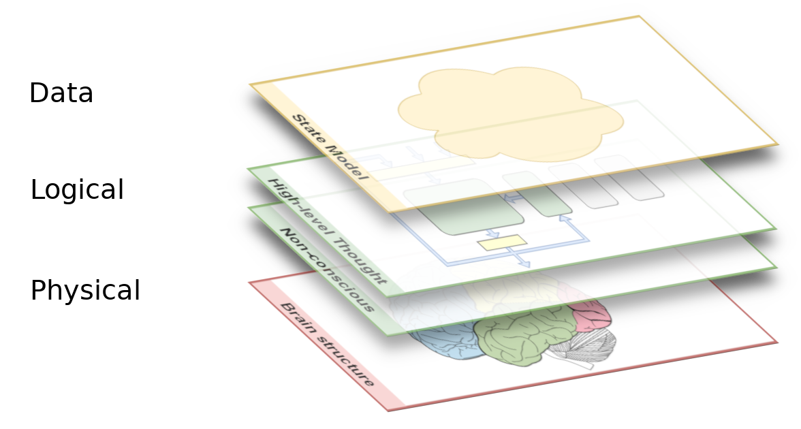
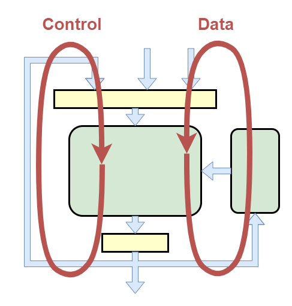
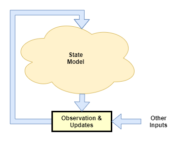
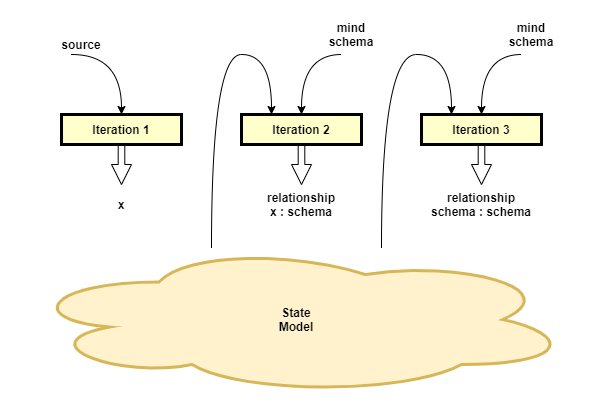
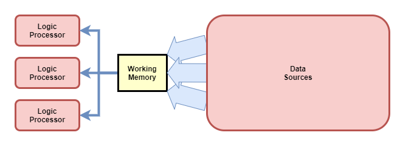
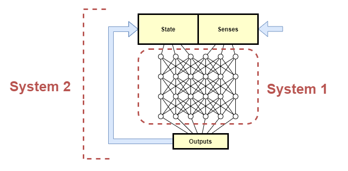

(WORK IN PROGRESS: This is a re-work that will replace the existing [[A Theory of the Human Mind]] page)

This page outlines a working theory for the algorithmic and computational aspects of consciousness, including its external and internal behaviours, and explains why consciousness evolved in order to support high-level thought. It is suggested that the content of conscious experience is governed by a representational 'state model', along with a particular form of state machine processing loop, that explains the majority of the internal subjective attributes of consciousness. It provides a framework within which consciousness could be emulated, and which may prove to be the basis for artificial general intelligence. Finally, an investigation of the gaps remaining in our understanding is covered.

# Introduction
The question of consciousness has been a conundrum for many centuries. In modern times, disciplines as varied as philosophy, neuroscience, physics, and computer science all discuss the topic. There are many theories available, each focusing on a particular subset of the problem and coming from different perspectives (eg: philosophy vs. neuroscience vs. AI). For a detailed discussion of the problem and various viewpoints see: [Consciousness](https://iep.utm.edu/consciou/) and [The Hard Problem of Consciousness](https://iep.utm.edu/hard-con/) (Internet Encyclopedia of Philosophy).

Some of those viewpoints are discussed here:

* Chalmers: explains how the problem is split into a comparatively "easy problem" of explaining the mechanical/computational mechanisms behind the functions of learning, reasoning, remembering, perceptual discrimination internal access, etc.; while the "hard problem" is why these functions are accompanied by the feeling of subjective experience, commonly referred to as _phenomenal experience_. This remains a philosophical question because we don't have any possible physical explanation. [Chalmers1995]

* Tononi: partial mechanism for measurement, but not complete: doesn't define sufficiency.

* AST: introduces how important the model is.

* Higher-order Thought Theory [Rosenthal2011, Rosenthal2005, Gennaro1996, Gennaro2012] suggests that the brain uses high-level abstract representations of objects within conscious thought. There are many critics of the theory however.

* Halligan and Oakley: explain how conscious thought happens _after_ the action that it purports to have caused, and thus they suggest that consciousness is merely a side effect with no functional purpose [Halligan2017]

* tbd. Dennet.

In general all of the theories above provide some pieces of the puzzle but fail to convincingly explain the overall question of consciousness because they are either too abstract or too narrow in scope. Furthermore, many physicalist theories fail to account for the "hard problem" and try to hand-wave the problem away, while others fall back onto metaphysical explanations. Neither outcome seems satisfactory. 

The theory presented here is different. Via a mechanistic computational account, it attempts to attack head-on the hardest "easy problem" questions of how it is that we can observe our own thoughts, and of why consciousness evolved; and it attempts to draw as close as possible to the "hard problem" of phenomenal experience itself. Through considerations of our current understanding of neuroscience, the characteristics of biological and artificial neural networks, and through extensive self introspection, I shall provide what I believe to be a plausible architecture or framework for the mechanisms that underlie high-level thought and how they are associated with conscious experience. My theory can be seen as an application of Attention Schema Theory and Higher-order Thought Theory, but I believe it provides a much broader and more concrete account than the abstract notions posited by those theories. 

I shall first present an outline of the theory in its entirety, followed separately by the rationale that forms its background. I shall follow this up with a discussion of the most significant remaining open questions, and conclude by summarising where I think this theory is useful for future directions of research.

# Theory Overview

I posit that the architectural structures and computional mechanims that I shall explain shortly are the basis for consciousness in humans, and that they may be sufficient to produce consciousness in any system that contains these structures and mechanisms. This includes biological organisms such as humans, and other mammals, and likely in other biological forms too). It would also apply to artificial organisms and systems, including virtual ones (ie: simulated in a computer).

I shall use the human mind as the primary example, but I am focused on providing a theoretical fundamental architecture of consciousness that applies irrespective of whether it is realized in the form of a human biological consciousness, an artificial consciousness simulated on a computer, or some alien mechanical consciousness.

But first, what do I mean by the use of the words 'consciousness' and 'conscious'?

In simple terms, I'm referring to, the internal subjective awareness of self that is lost during sleep, and regained upon waking [citation]. But even that is vague. Which aspects of subjective awareness are included in the term? Which of the various things that we can be aware of should be considered as a core component of consciousness? Which components can be expected to exist in any form of consciousness, and which we would argue would remove the existence of consciousness if they were not present?

Approximately, I view a minimal consciousness as having the following characteristics:
* awareness of senses (*)
* awareness of thought
* able to elicit some sort of action as output (*)
* high-level thought processing
* phenomenal experience - ie: the conscious system's experience of its own senses and thought

As we shall see later on, the _existence_ of phenomenal experience is unfortunately not explained by the theory presented here. However, I believe all aspects of the _content_ of that experience are explained; which I think is a significant enough achievement to celebrate. The star (*) indicates two characteristics which could potentially be dropped and still yield consciousness. However, the practical reality is that such a system would be useless and would never evolve on its own.

Many other characteristics are commonly attributed to consciousness, particularly in movies on the subject; however I view them merely as addendums. They are typically characteristics that happen to occur in the human realization of consciousness, but a system could in theory exist without them and quite reasonably be argued as conscious. Some examples are:
* emotions
* empathy
* physical embodiment
* human-level of intelligence

## Views
The proposed mechanisms that lead to human consciousness will be explained here by examining them in the context of three overlayed views.

The _physical_ view examines the brain as a collection of neurons. While some regions have specific functionality that we understand, other regions serve many purposes and are hard to characterise exactly. Many different kinds of behaviours are tightly integrated and overlap across multiple regions making it very hard to identify specific functionality within this "spaghetti" of pathways.

The _logical_ view unpacks the physical "spaghetti" by reinterpreting it as simplified component architectures. 

The _data_ view examines the data state that is produced, transferred, and processed within the _logical_ view.

The majority of discussions presented here are in the context of the logical and data views.

## Physical View
Slowly science is beginning to understand the kind of processing performed by different regions of the human brain, and we are gaining some mediocre knowledge of how non-human brains function, but overall our understanding is very much at its infancy. This article will largely omit discussion about the physical view. However, as we shall see, there is one particularly significant point that needs to be made about the nature of any physical computational machine, including the biological brain.

### Consciousness across the animal kingdom
Scientists don't know for certain which animals experience consciousness, but there are some hints. All mammals share the same basic brain structure, and in particular they share a neocortex, which is believed to be the main area for higher-level thought. The experience of consciousness appears to correlate very strongly with higher-level thought, so one could conclude that the presence or lack of a neocortex can be used to distinguish the presence of consciousness in animals.

Birds have a similar structure called the dorsal ventricular ridge (DVR) that some neuroscientists believe provide similar capability to the neocortex [SDOct2012]. I have also seen some suggestion that fish have a similar structure with similar functionality.

### Neuronal structure
The neurons in mammalian brains are different to those in artificial neural networks in terms of the physical way in which they operate, but I posit that the difference is not significant for the experience of consciousness. Any mechanism that supports sufficient flexibility of learning could suffice for the realization of consciousness.

In fact, this article will use biological and artificial neural networks interchangeably for examples when expressing ideas. 

### Physical location in space
tbd.
Main conclusion:
* Physical computational machines have bulky data processing circuits, and bulky memory storage, and they need a small working area to hold the current set of data being worked on.

## Logical View
The theory claims that the high-level thought system of the human brain is a state machine with a tightly integrated control mechanism, whereas the low-level older part of the brain is something much more akin to our current deep-learning artificial neural network models - basically just pattern matching/prediction engines. High-level thought is achieved through a combination of a relatively simple state machine architecture, with the pattern matching and prediction power of those low-level neural networks.

The proposed high-level state machine of the brain is illustrated in the following diagram. Externally sourced senses (our nominal five senses), plus internal senses (eg: mental tracking of limb position), are received as inputs (likely in a pre-processed form), then used in conjunction with the current state (held in Working Memory) to produce a new state.

In the diagram above, the Logic Processing box represents what is likely the bulk of the brain and where non-conscious mental processes produce meaningful results from the received senses and internal inputs inputs [Nisbett1977]. While it is an oversimplification, the logic processing components are treated as largely stateless, in that they merely compute a result given the inputs. It is further assumed that we can think of the multiple logic components of the brain as a single aggregate.

In the terminology of Daniel Kahneman, the logic processing components on their own are of the form of _System 1_ thought (_Fast Thinking_), while the net result of multiple steps being executed by the state machine form _System 2_ thought (_Slow Thinking_).

### Working Memory
Neuroscience currently believes that we hold about seven items in working memory, for up to about one minute [citation]. This is the state data store of our state machine. The presence or absence of certain data items directly influence which logic processes activate.

In theory, the larger the working memory the more efficient computation can be. In practice, there are trade-offs affecting the size of working memory. If too small, then it is not sufficient to hold all data needed for a particular thought process - more logic processing actions are required for low-level swap-in/swap-out of data from long term storage. If too large, then the data transmission channels between working memory and logic processing become too wide.

The state representation within working memory is likely fairly high-level, and probably at the same level of detail of what we observe within our consciousness.

### Control Mechanism
A state machine employing fuzzy, learning, neural networks for its logic processor requires a control mechanism in order to maintain stability. The control mechanism uses a feedback path separate from the main processing loop. It acts like a secondary processing loop, or 'feedback loop', but for efficiency and flexibility, it re-uses the main processor. The main processor is trained to enforce stability control through learning pressure and some amount of evolutionary pre-wiring.  

The existence of the feedback path is the explanation for why we have awareness of our thoughts, and as such is often referred to as 'conscious feedback' here. However, the exact distinction of data that passes back into the main processor via working memory vs. conscious feedback remains an open question, with some discussion on this later on.

### Schematic Models
Before moving onto conscious experience itself, we need to highlight two important internal sources of information. 

**Body Schema**: It is well understood that the brain maintains a mental map of the body. This is used, for example, to track the motion of limbs so that we can know where a limb is without seeing it. It is also used to track the capabilities of those limbs; for example to track when a leg is damaged and thus must not be walked on with full body weight. The body schema is also used in a _generative_ way: to plan future actions and to control muscle signals in order to achieve a desired outcome.

**Mind Schema**: Like some other researches (eg: [Graziano2017]), I believe our brains also maintain a mental map of our mind. It tracks the observed capabilities of our mind. It will be used in a _generative_ way: to suggest a possibly suitable approach to solve a problem. And it will be used in a _predictive_ way: to monitor the thought path taken and to continually assess the likelihood that it will produce a useful outcome.

## Data View

The data view examines the data states and high-level representations used within the brain. We shall focus within the scope of conscious experience, and in particular the 'state model' of the state machine. By examining the data view we can highlight what is and isn't observed within the high-level thought of a conscious system.

### State Model
The 'state model' is the passive data representation used within the state machine. It is simultaneously the output of the main processor and the input to its next cycle.

The state model represents anything that may be useful as a direct output (eg: for governing action), or as input for the next cycle (eg: an intermediate result within a sequence of thought). Within humans, the state model has tremendous flexibility in the kinds of data sources and results that can be represented within it, and in the resolution of those representations. For example, at any given moment it may represent only one thing with high precision, or it may represent multiple things with low precision and information about the relationships between those things. 

The range of data sources that can be directly represented within the state model is particularly enlightening. Some examples from my own observations are:
* **working memory**: we seem to be only able to think about one 'thing' at a time, which I interpret as being where one item from working memory is selected into the state model at a time.
* **senses**: any of the five external senses can be focused on and observed consciously. Additionally we can simultaneously observe multiples senses, eg: when watching and listening as a car drives past.
* **body schema**: we can be aware of specific aspects of our mental map of the body, eg: we can close our eyes and 'feel' where our limbs are. And our touch sense is tightly integrated with our mental map of body to identify where the touch sense occurred from. But I don't think we have direct access to all of the body schema at once.
* **mind schema**: like the mental model of body, we are aware of specific aspects of our mind's mental model of itself. eg: a judgement about one's general ability in mathematics. But, like the body schema, I don't think we have direct access to all of this model at once.
* **long term memory**: we can draw up recent and long past memories, but we certainly do not have access to all of those directly. There appears to be some sort of fetching mechanism involved.
* **conscious feedback**: output from processing in prior cycle.

The five external senses in particular are interesting, as it is well known that we do not observe them in their raw form. Vision, for example, is produced by the eyes with varying levels of focus and detail across the visual field, and yet it's very hard for us to directly observe that because the sense has been pre-processed to construct a single coherent virtual visual field. Furthermore, we experience senses pre-attached with 'meaning': rather than seeing a series of lines and dots, I see a window, a door, a ball; rather than hearing a sampling of strange sounds, I hear specific spoken words.

I also think senses carry with them a sort of 'labelling' as to their source. For example, we have a strong perception of whether a sense came to us externally or from us internally. The labelling appears to be a reference back to the body and mind schemas. Very interesting results occur when that labelling is disrupted, such as when people with schizophrenia 'hear voices' not realising that they are the ones speaking [Klaver2016], or when the body or mind schemas cannot be updated, causing [anosognosia](https://www.nami.org/About-Mental-Illness/Common-with-Mental-Illness/Anosognosia).

### Visceral Loop
The 'Visceral Loop' is a characterisation of the kinds of thought or processing outcomes that pass through the state machine described above, and how that thought leads to the individual having a _visceral_ awareness of their own thoughts. It is thus the culmination of the theory, for it explains how we come to conclude ourselves as conscious beings.

It is described in the phrasing of a processing loop that could, in its optimum form, reach the conclusion of consciousness in the third iteration. However, that is generalised to support the fact that actually reaching the conclusion of consciousness typically requires many more than three iterations of the state machine.

The visceral loop thus characterises each cycle of the state machine as falling into one of the following categories: 
* **Iteration 1 thought**: Thought - General high-level thought that uses sense data as inputs or performs further processing of existing state, and that does not explicitly draw relationships to the individual's mind. For example, when making a decision whether or not to buy toothpaste, solving a easy maths problem, or planning how to make coffee for the first time. This covers the vast majority of thought, as we generally do not need to waste our time thinking about thought itself.

* **Iteration 2 thought**: Meta-thought - Thought that depends on having an awareness of one's own thoughts, but doesn't explicitly take note of the fact that we are observing our thoughts. This is the control mechanism that is so important for maintaining stable thought. For example, when making judgement calls about whether a particular thought process is proving productive, or realising that we made a mistake.

* **Iteration 3 thought**: Meta-meta-thought or Meta-awareness - Thoughts about the fact that one is aware of their own thoughts. For example, Descartes' famous "I think therefore I am" quote is the result of Iteration 3 thought. It is here that we compare our own awareness of thought to our socially constructed understanding of the term 'consciousness' and conclude that we, also, are conscious.

An example application of the visceral loop is seen in the following sequence of one's inner voice:
1. "What's 3 + 5? Must be 7"
2. "Oh woops, I made that mistake last time. I remember it turned out to be 8"
3. "I just had a thought about a past mistake. I can hear my own thoughts"

Iteration 2 requires the labelling of input data in relation to the mind schema. I can only say that "I remember" because I have a concept of "I" vs "not I" (ie: the mind schema itself) and that the data is indicated as being sourced from that "I" (ie: a relationship between I and the mind schema).

Iteration 3 thought takes that to the next level. The relationship itself becomes the input data that is further processed in relation to the mind schema. With sufficient thought in this category, one can conclude themselves as conscious.

More formally, the three iterations of the visceral loop can be represented using a mathematical notation that highlights the inputs to the function, and its result:
* Iteration 1: `f(inputs) -> x` - some result of simple thought
* Iteration 2: `f(x, mind-schema) -> relationship(x : mind-schema)`
* Iteration 3: `f(relationship(x : mind-schema), mind-schema) -> relationship(mind-schema : mind-schema)`

It is interesting to note that the majority of high-level thought is done in Iteration 1 alone, that Iteration 2 thought occurs exponentially less frequently, and that Iteration 3 thought occurs exponentially less frequently again.

See more: [[Visceral Loop]]

# Rationale

This section provides an account of why I believe the theory presented here is a good explanation of our experienced phenomena. The discussion is necessarily shallow in order to avoid this article becoming too large. Links to further discussions are provided.

If the theory is correct, then there is very little of our internal brain structure that we can observe directly. Thus there should be little that we can deduce about it. However, it turns out the model that I purport we operate on is much like the sort of 'abstraction layer' that is often used in software engineering; and it is well known within the software development field that every abstraction leaks internal details. So in practice we can deduce a lot through observations of the particular computational behaviours and edge cases that we experience, combined with our understanding from modern neuroscience.

## The need for working memory

Brain neurons exist in physical space and thus are subject to a simple physical law: they cannot be moved around easily.

Regions of neurons develop a structure and learn a firing pattern that produces useful computational capability. That computational capability might be useful for processing of data retrieved from arbitrary sources. It cannot be _moved_ to the different data sources, so there must be a data transfer channel from each source to the processing region.

Those sources might include long term memory. As memory becomes larger, it becomes inefficient to provide direct access from the computational region to the whole of memory - the data transfer channel could become physically very wide. Furthermore, as the brain evolves greater computational dexterity, it ends up with multiple regions with specialised capabilities. Direct access between each 'processor' and memory would now require multiple data transfer channels.

From a physical space perspective, a far more efficient solution is to have a central area where data-to-be-processed is temporarily stored, and for all processing regions to access data in that temporary storage. Essentially, it is necessary to bring the data to the processor because the processor is large and unmovable.

## High-level thought as a state machine
Various studies have revealed that we are either unaware of the majority of processes that occur within the brain [Miller1962, Nisbett1977, Halligan2000], or that we only become aware of those processes _after the fact_ [Halligan2017]. Furthermore, evidence from cognitive neuropsychology suggests that we can perform relatively complicated processing and have that influence our awareness, without even being aware of the processing or the sense inputs that the processing was based on [Driver1998, Marshall1988, Weiskrantz1985].

I suggest that this is quite straight-forward to explain.

The kinds of processing mentioned above form what Daniel Kahneman refers to as _System 1_ (or _fast thinking_) thought [Kahneman2011]. Here, deep and complex layers of neurons are involved, and while they may have cycles on the micro scale, they likely have the macro scale form of a simple [feed-forward network](https://en.wikipedia.org/wiki/Feedforward_neural_network). This _System 1_ thought can be quite advanced, as we know from the work of Kahneman. For example, it can localize the source of a specific sound, produce the result for simple well practiced questions such as "2+2=?", read text on a billboard, or even drive a car on an empty road.

To summarise all that in short form: simple macro-scale-feed-forward networks are great for efficient pattern matching, prediction, and generation of well practiced actions.

However, such networks are not suitable for high-level thought because of a number of limitations:
* they are only capable of producing results from a single pass of the network.
* it's hard to combine results from multiple arbitrarily selected processing regions.
* these networks can learn and are flexible in the long term, but are typically static and inflexible in the short term.

High-level thought involves multiple steps and intermediate states. Working memory serves to hold those intermediate states. Multiple steps are supported through operating in cycles, with each cycle taking the current state of working memory, applying one step of computation, and storing the result back into working memory. In other words, a 'state machine'.

It is this action of the state machine, with thought that spans multiple cycles, that is characterised by Kahneman as _System 2_ (or _slow thinking_) thought.

As an aside, I think it's possible that the evolution of working memory was the catalyst for the evolution of a state-machine processing loop, which of course further formed the basis of the high intelligence that we enjoy today.

## Control mechanism as basis for awareness of thoughts
If you were to build a state machine yourself, you would not want to do it with neural networks. State machines operate on the principle of a loop that repeats itself over and over, with the same logic rules but different state. They require stability and predictability. Neural networks are noisy, chaotic, and take a long time to train. A state machine using neural networks for processing is highly unstable and tends to get stuck in infinite loops. I encountered this myself in my first attempt to model the state machine of consciousness using simple logic rules. And I wasn't even subject to the unpredictable nature of neural networks.

A common engineering solution to stability problems is the addition of a control mechanism. A common control mechanism uses a feedback measurement of the output of the system, which it it compares against some ideal signal, and uses that to adjust the system's behaviour.

Broadly, there are two styles of control mechanism that might be employed in a state machine system:

1. **Independent control**: an entirely separate control processor actively monitors and manipulates state to ensure stability.
2. **Integrated control**: control is performed by a relatively simple feedback loop that is actioned on by the main processor.

Due to the complexity and variability of thought, an independent control mechanism would require significant domain knowledge about the kinds of thought that passes through the main processor. For example, if I am trying to solve '5 + x = 8' in my head by trying lots of different possible values of x, am I stuck in an infinite loop? The level of understanding required by an independent control processor suggests that the control mechanism cannot be separate, but is rather integrated into the main processor itself.

Furthermore, we can examine the two options a little more concretely to see how it may 'feel' to have such a mechanism:

1. Independent control would have limited data integration with the rest of the brain. There would be no need for awareness of thought. Unlikely to be human-like in our experience of it.
2. With Integrated control the computational and learning capabilities of the main processor would be fully leveraged to help stabilize thought. Requires that the feedback measurement is supplied into the main processer as a first-class input, like other senses. Human-like in our experience of it.

It thus seems reasonable to assume from the fact that we can observe our own thoughts, that we employ a control mechanism and that it follows the integrated control option discussed here.

In the human case, we are probably born with some basic building blocks of a control mechanism. It would do only the most basic attenuation of repeated signals to avoid tight infinite loops. This could for example be in the form of a basic attention control. Some form of evolutionarily structured learning pressure would be applied so that over the longer term we learn to override those basic controls and apply higher reasoning.

This also suggests that there is a minimum level of intelligence required for a conscious system. Without that minimum level of intelligence it cannot control thought well enough. And without being able to control thought, it would not be evolutionarily adaptive to develop a state-machine style of higher-level processing.

See more: [[The Error Prone Brain]]

## Models
Graziano [Graziano2017] introduced Attention Schema Theory (AST), which posits that the brain uses a high-level representational model to encapsulate information about the state of the body and thoughts within the mind, and that this is used for attention control. The existence of some sort of mental model of the body, or 'body schema', is well established in our understanding of the primary motor and somatosensory projection areas, along with their associated non-primary projection areas [Gleitman2003, ch2].

Graziano introduced the idea of a 'mind schema', similar to the body schema but models the capabilities of the mind itself. He then suggested how, through self-reference, this model could form the basis for the conclusion of one's own consciousness. Graziano assumes a single model that encapsulates all behavioural predictions of the body and mind, and of the state of current thought, but admits that there may be other divisions.

Like Graziano, I also think that understanding the models employed by the brain is key to understanding consciousness. However, upon considering the different kinds of information that become available to our consciousness, and in the kinds of processing that would be applied, I think there are three separate models in this context. Importantly, I think the state model is just a passive data representation that can be moved around between different regions of the brain, whereas the body and mind schema are more likely to be physically wired within certain specific regions of the brain.

Another important distinction is that the information from the body and mind schema appears to have significantly less resolution within our awareness than that of many other senses (eg: the five external senses plus conscious feedback). I can open my eyes and see lots of detail, and I can clearly observe my current thought as well as my 'inner voice'. And although I can reference specific knowledge about my ability to do maths, for example, I would not expect to observe all of my mentally mapped details of my mind's capabilities without a lengthy introspection session. Thus, my mind schema appears to behave more like a long term memory: certain events elicit specific responses due to their association, but I can freely browse all of its contents.

I think a particularly strong argument for the existence of these schemas as independent components of the brain is that i) the learning algorithm required to 'train' these schemas is relatively simple (just run in a tight cycle of predicting the next future state, observing what really happens, and correcting the network from the difference), ii) that they can be trained independently of the main processing units, and iii) that they provide a very useful input to the main processing units.

The visceral loop explains why the state model is both a significant source of input to data processing, and the outcome of that processing. The model and processing step work so closely together that it can be hard to see the distinction between them. That may be because our ability to analyse our own consciousness is a factor of that model/processing interaction.

More specifically, the scope of what we can conclude about our own consciousness through introspection alone is a factor of:
* the capability of the state model to represent different data
* the detail of our mind schema
* the evolved and learned capability of the high-level processing units to use those data representations and to produce meaningful conclusions

## Boundaries of conscious experience
It seems quite clear that there are portions of data processing within our brain that we are conscious of, and other data states and processing that we are not aware of. Why do we experience a particular subset of data processing as consciousness? The claim of the visceral loop is that the boundary and content of what we can conclude as consciousness is dictated by what is representable within the state model and by what processing can be performed against that model.

In developing this theory, I earlier wrote an article on [[The analogy of the Thalamic symbiote]]. That was a thought experiment to try to rationalise more precisely what is and isn't available to conscious experience. In brief, it describes a tiny creature (the Thalamus) living in a symbiotic relationship with the main bulk of the brain and the rest of the body (the Human). They exist that way because of mutually beneficial evolutionary strategies, whereby each avoided having to evolve the characteristics that the other had already evolved. The Thalamus prefers to sense and operate against high-level abstract concepts, rather than directly observing its physical surroundings; and it prefers just to make executive choices between available options, rather than performing any hard computations. The Human has only a moderate level of intelligence, but has successfully managed to develop accurate senses about the outside world, to process those senses in order to form simple representations of reality, and to apply some simple logic rules. Using a chess analogy, the Human can think one step at a time. As they are separate organisms, they have a different set of 'senses'. Humans have the five external senses that we are familiar with, and the Thalamus has high-level data senses that approximately translate as equivalents of those five Human senses. However, the Thalamus also has one additional sense which takes a high-level summary of the state of the Human part of the brain. The experience of consciousness, the inner most "I" when I talk about myself, is actually the Thalamus experiencing its own senses.

While the suggestion of the Thalamic symbiote seems absurd, curiously it does propose a model that fits very well with the observations that an individual may make about their own conscious experience after sufficient thought. For example:
1. We don't actually have phenomenal experience of our physical senses, but rather we experience a pre-processed form of our senses, after gaps in data have been filled in and meaning attached.
2. We have phenomenal experience of more than just our five physical senses. Conscious feedback is definitely an extra sense, and there may be more.
3. Our phenomenal experience omits all low level details of the functioning of our brain.
4. It feels like there is some inner "I" that does the experiencing.
5. On first glance, executive control (the ability to take an active role in making decisions) appears to be intimately linked with conscious experience.
6. For complex problems, each logic step produces an intermediate result, which is experienced, but the execution of the logic step itself is not.

The state machine and visceral loop theory of consciousness explains all of those observations. In response to the numbered items above:
1. It's only in Iteration 2 that we can observe our senses, and by then Iteration 1 and possibly some explicit pre-processing has already taken place.
2. The state machine requires a feedback loop as input to its control mechanism, which adds 'conscious feedback' as a sense. Our observations of 'senses' in Iteration 2 are defined by the contents of the state model, rather than the raw physical senses.
3. The low level functioning of the brain is used to produce results, which may be represented in the state model, but there are 'monitoring nerves' that track the operations of logic circuits scattered throughout the brain.
4. All senses are labelled or interpreted in relation to the mind and body schema.
5. The conclusion of having executive control comes from the fact that high-level thought typically requires multiple steps, and that we are aware of the result of each step in the process.
6. Like for the general case of not being aware of low level functioning of the brain, we are not aware of the execution of logic until it produces a result that is stored into the state model.

## Memories
I think some researchers have suggested that the perception of consciousness is an artefact of memory [citation]. Specifically, that our memory is used to construct a representation of recent thoughts. In doing so, the memory of independently produced thoughts become modelled as a continuous stream. This is assumed to operate in the same way that we perceive vision as a smooth visual field of uniform resolution whereas in reality we physically see only a tiny fraction of the scene in front of us at any point in time. The assumption is that the presence of this smoothed out memory of apparently continuous thoughts tricks us into thinking we are conscious.

In contrast, I don't see that explanation as adding much to the whole solution. While it is probably true that our memory of past thoughts creates a simplified 'smoothed out' representation, it doesn't answer why we conclude ourselves as conscious from that data, and it isn't necessary to reach the conclusion of consciousness. So rather than being core to the explanation, I see it as just yet another example of the result of the visceral loop.

# Open Questions

Like any theory being developed, there are a number of questions remaining. At the most basic level there are questions around how the logical view maps into the physical view, and about how much pre- and post-processing of signals occurs outside of the high-level processing schematic presented in the logical view here. As our understanding of neuroscience improves, we will be able to narrow down the range of possible explanations.

Clearly, the theory needs more corroborating evidence in order for us to confirm whether it is indeed correct. Much of that will come from two particular sources: i) further understanding of neuroscience, and ii) learnings from attempting to build a artificial consciousness and artificial general intelligence. For example, my entire control-mechanism basis of consciousness came from trying to build a high level emulation of the state machine components and finding how susceptible it was to infinite loops.

The sections below discuss a selection of specific open questions.

## Learning
The ability for a particular system to productively learn is a significant factor governing how the brain evolved the mechanisms it has. Unfortunately the theory presented here will not be complete without a detailed consideration of how each component could learn its required behaviours.

I will state briefly some general ideas on how learning fits together, but obviously significantly more research will be required in this area.

* The overall brain structure is obviously constructed as a result of evolutionary pressures. I suggest that the brain is also pre-wired with the most basic starting blocks of a control mechanism. That pre-wiring likely incorporates some degree of immutable hard barriers, for example to ensure that we don't get completely stuck in a tight infinite loop, but also supports the ability for us to learn, modify, and override softer control forces.

* I suspect that different components of the brain learn through different mechanisms. For example, we know that [Hebbian](https://en.wikipedia.org/wiki/Hebbian_theory) learning operates in an 'online learning' mode. There is also some evidence that our brain employs 'offline learning' such as in the suggested process of [memory consolidation](https://en.wikipedia.org/wiki/Memory_consolidation). Lastly, I suspect that some systems learn through more of a re-enforcement style, updating their state only occasionally when feedback is available, and possibly applying its state as a source of online learning pressure to other components.

## Lossiness in Visceral Loop
We appear to perceive certain external and internal senses and data sources, while not perceiving others. For example, we don't have direct access to arbitrary long term memories, and it seems quite reasonable to assume that access to long term memory requires some sort of background lookup. But our ability to infer the inputs to the main high-level processor is limited by what it can output. That limitation alone could be the explanation for what we perceive in our phenomenal experience vs what we don't. Alternatively, perhaps the processor is capable of selecting any of its inputs and allowing them to pass through un-transformed. Or perhaps the real answer is somewhere in between or a a mixture of the two. In brief, the question is about how 'lossy' the transformation is from input to output.

Considerations:
* are some inputs treated differently to others so that there is a clear distinction between those than can be processed and fed directly to output vs those that can't?
* does the processing itself, through a combination of evolution and learning, select some inputs more strongly and reflect them in the output more accurately than others?
* are there evolutionary limitations in what the state model can represent, that could means that certain inputs are effectively hidden from representation?

tbd. diagram

## Split between Working Model, State Model, and Actions
tbd. introduce this better

The self-observed distinction between state model and working model can be summarised as:
* state model - appears as a single continuous stream that is smoothly updated from cycle to cycle
* working memory - appears as a data store with multiple entries, only one of which can be accessed at a time.

However, the real delineation between the state model and working memory is not clear, or if there even is a delineation at all. At one extreme, they may be independent components that pass through two independent channels that belong to the two overlaid loops: the main computational processing loop and the control loop. At the other extreme, there may be only one such channel and the state model and working memory are one in the same thing.

tbd. diagram

An important consideration here is the above question of the lossiness of the processing step. For example, if the processing step is lossy, then it is entirely possible that there is only a working memory, that the processing step only ever passes one entry from the working memory at a time, that the output is stored back into the working memory, and that the perception of an independent state model is a result of the fact that only one working memory entry is selected at a time.

Lastly, what exactly is the output from the processing? Is that output the state model or does something else post-process it in order to produce the state model, for example, as a 'summary' of the raw output. How does that output feed into action control?

## Biological basis for phenomenal experience
I set out to explain the existence of phenomenal experience. While I think I have produced something that will contribute significantly to the fields of artificial consciousness and artificial general intelligence, and perhaps even to the field of neuroscience; in the area of phenomenal experience, I remain frustrated.

In that domain, I think the greatest benefit of my theory is that it narrows the scope of the remaining question. I have not been able to explain what phenomenal experience is or why it occurs, but I have shown how the contents of phenomenal experience can be defined entirely in terms of a mechanistic basis. And more than that, I have offered a concrete theory behind those mechanisms.

So what remains?

* The theory as presented so far seems to suggest that the combination of a simple data state with a processor that interprets the data state in a particular way is sufficient for consciousness. That implies that some very simple circuits would be conscious, but it just doesn't seem right. What's missing?

* Also, in the brain the data state may be stored in one particular set of neurons, while the processor is a different set of neurons. So which set of neurons is conscious? Or more accurately, which set of neurons has phenomenal experience?

* Lastly, given that consciousness can apparently be produced with such a simple data state and processor in a simple cyclic relationship, surely there could be many such simple cyclic regions within even a single brain. Perhaps the left and right hemispheres of the brain are examples of this. Why does such a brain not experience multiple consciousnesses?

This is the classic explanatory gap between what can and cannot be described about our subject experience through physicalist mechanistic processes, and which Chalmers refers to as the "hard problem" of consciousness. But I think these questions are better characterised as an "intuitional gap": theories of consciousness exist that support it being an entirely physical phenomenon, and yet our intuitions about consciousness make it hard for us to accept that a simple physical explanation is sufficient. For example, this has lead many to assume a metaphysical explanation is necessary. Ned Block beautifully summarised this intuitional gap in "The Harder Problem of Consciousness" [Block2003] when he stated: "Not only do we lack a ground of belief [to decide something as conscious vs not conscious], but we lack a conception of any ground of belief".

I posit that the error here is our intuition itself. The question of phenomenal consciousness is so hard to measure that we are left with little else than intuition to guide our judgements. But our intuitions on the subject tend to be contradictory; between individuals, and even from the same individual. Our intuitions are so strong that they make it hard for us to consider the possibilities rationally, and thus they may actually be leading us astray.

I won't attempt to make a claim about which aspects of our intuitions are misleading, but I do think that this is the area where research should focus.

Curiously, the theory presented here does leave open one important variable within the realm of the physical. It is possible that something physical, within the biology of the brain neurons, is required to turn the state model and/or processor into phenomenological experience. In other words, given two regions of biological neural network (in the same individual or in different individuals), both having equivalent model states and data processing capabilities, could it be that one has a biological structure that turns the model into experience, while the other does not? Our intuition is that there is something special about experience that requires more than just a self-serving data model. But our intuition has questionable judgement.

# Conclusions

The motivation for this work was threefold. Firstly, to offer a more complete and concrete theory of the mechanisms behind consciousness and to show how consciousness and high-level thought relate to each other. Secondly, to show that those physical mechanisms are sufficient for the subjective experience of consciousness. And thirdly, to form a basis for future research into artificial general intelligence.

I have presented a detailed theory of those mechanisms. Some areas of the theory are speculative and need further corroborating evidence in to be certain that they represent how human consciousness arises. However, the stated mechanisms are simple enough that they can be emulated easily using our current technology, and I am confident that it will prove useful for future research.

If the theory is correct, then it also offers some meaningful insights into the nature of the human mind. In particular, the following claims have been made:
* Working memory is a necessary component to support scalability of the kinds of thought possible.
* High-level thought is the result of the action of a state machine.
* The state machine employs a feedback loop in order to maintain stability, and it is this feedback loop that we experience as the awareness of our own thoughts.
* Consciousness is a result of the action of that state machine, along with its feedback loop and other sources of information. And in particular, the "conclusion of one's own consciousness" is an outcome of that state machine as it follows a particular path of logical conclusions.

Finally, while the theory offers no further insight into the _existence_ of phenomenal experience, it shows that there there is a tight coupling between its existence and the mechanistic basis for its _content_. I believe that this tight coupling narrows the remaining question. I have also argued that the best characterisation of that remaining question is as an "intuitional gap", and that we must directly address questions of the accuracy of our intuitions in this domain in order to move forwards.

Further research will focus on the learnings that can be attained by building an emulation of the above theory, and on incorporating more of our current understanding of neuroscience into the theory.

# References

[Block2003] Ned Block. 2003. "The Harder Problem of Consciousness". The Journal of Philosophy XCIX(8), January 2003. DOI: 10.2307/3655621.

[Chalmers1995] Chalmers, D.J. 1995. "Facing up to the Problem of Consciousness." Journal of Consciousness Studies 2: 200-19.

[Driver1998] Driver, J., and Mattingley, J. B. (1998). "Parietal neglect and visual awareness". Nat. Neurosci. 1, 1722 doi: 10.1038/217

[Gennaro1996] Gennaro, R. 1996. "Consciousness and Self Consciousness: A Defense of the Higher Order Thought Theory of Consciousness." Philadelphia, PA: John Benjamins Publishing.

[Gennaro2012] Gennaro, R. 2012. "The Consciousness Paradox: Consciousness, Concepts, and Higher-Order Thoughts." Cambridge, MA: The MIT Press.

[Gleitman2003] - Henry Gleitman, Alan J. Fridlund, Daniel Reisburg. "Psychology". Sixth edition. Norton publishing.

[Graziano2017] Michael S. A. Graziano. Nov 2017. "The Attention Schema Theory: A Foundation for Engineering Artificial Consciousness". Front. Robot. AI, 14 November 2017. https://doi.org/10.3389/frobt.2017.00060.

[Halligan2000] Halligan, P. W., and Oakley, D. A. 2000. Greatest myth of all. New Scientist #168 (pp 34-39). https://www.newscientist.com/article/mg16822653-700-greatest-myth-of-all.

[Halligan2017] Peter W. Halligan, and David A. Oakley. 2017. "Chasing the Rainbow: The Non-conscious Nature of Being". Frontiers in Science. https://doi.org/10.3389/fpsyg.2017.01924

[Kahneman2011] Kahneman, D. (2011). "Thinking, fast and slow." New York: Farrar, Straus and Giroux.

[Klaver2016] Klaver, M. and Dijkerman, HC. (2016). "Bodily Experience in Schizophrenia: Factors Underlying a Disturbed Sense of Body Ownership." Front. Hum. Neurosci. 10:305. https://doi.org/10.3389/fnhum.2016.00305

[Marshall1988] Marshall, J. C., and Halligan, P. W. (1988). Blindsight and insight in visuo-spatial neglect. Nature 336, 766767. doi: 10.1038/336766a0

[Miller1962] Miller, G. A. (1962). "Psychology: The Science of Mental Life". London: Penguin.

[Nisbett1977] Nisbett, Richard & Wilson, Timothy. 1977. "Telling More Than We Can Know: Verbal Reports on Mental Processes". Psychological Review. 84. (pp 231-259). http://dx.doi.org/10.1037/0033-295X.84.3.231.

[Rosenthal2005] Rosenthal, D. 2005. "Consciousness and Mind." New York: Oxford University Press.

[Rosenthal2011] Lau, H. and Rosenthal, D. 2011. "Empirical support for higher-order theories of consciousness." Trends in Cognitive Sciences 15: (pp 365-373).

[SDOct2012] University of Chicago Medical Center. (2012, October 1). "Homolog of mammalian neocortex found in bird brain." ScienceDaily. www.sciencedaily.com/releases/2012/10/121001151953.htm

[Weiskrantz1985] Weiskrantz, L. (1985). "Blindsight: A Case Study and Implications". Oxford: OUP
