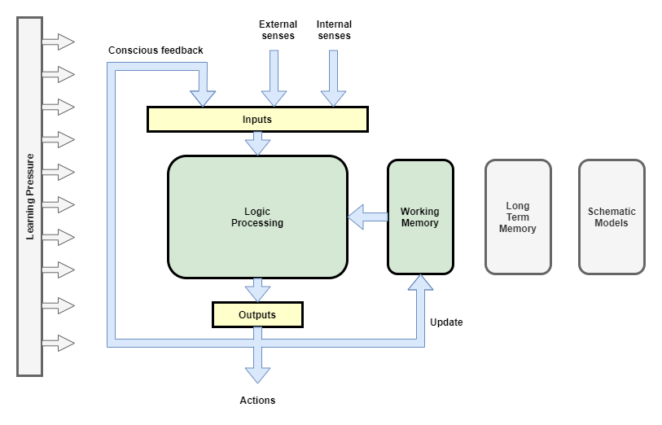
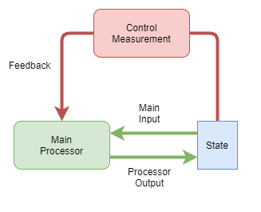

(WORK IN PROGRESS: This is a re-work that will replace the existing [[A Theory of the Human Mind]] page)

This page outlines a working theory behind the computational aspects of consciousness, including its external and internal behaviours, and explains why consciousness evolved in order to support high-level thought. It is shown that the content of conscious experience is governed by a representational 'state model' that explains the majority of the phenomena of consciousness. It provides a framework within which consciousness could be emulated, and which may prove to be the basis for artificial general intelligence. Finally, an investigation of the gaps remaining in our understanding is covered.

# Introduction
The "Hard Problem of Consciousness" (Chalmers) has been a conundrum for many centuries. In modern times, disciplines as varied as philosophy, neuroscience, physics, and computer science all discuss the topic. 

There are many theories out there, all focusing on different aspects and coming from different perspectives (eg: philosophy vs. neuroscience vs. AI). They all provide some pieces of the puzzle. For example:
* Tononi: partial mechanism for measurement, but not complete: doesn't define sufficiency.
* AST: introduces how important the model is.
** the work here can be seen as building on AST, although I reached many of the same conclusions independently.
* Higher-order Thought Theory [Rosenthal2011][Rosenthal2005][Gennaro 1996][Gennaro2012] suggests that the brain uses high-level abstract representations of objects within conscious thought
* Chalmers: explains how the problem is split into a mechanical/computational problem that is comparatively easy, while the Hard problem remains a philosophical question because we don't have any possible physical explanation. Consequently many metaphysical explanations have been suggested.

Many existing theories avoid the actual questions of how and why we have phenomenal experience. This theory is different. My goal is to answer the most difficult question, and the theory here is the closest that I have got to that goal so far.

My theory can be seen as an application and extension of AST and Higher-order Thought Theory. My theory can also be seen as a sufficient explanation of the underlying mechanisms that explains why many neuroscience researchers believe that consciousness is just an entirely passive after-the-fact summation of events [Halligan2017].

The theories here have been developed by considering our current understanding of neuroscience, the characteristics of biological and artificial neural networks, and through introspection. While the theory uses the human mind as the primary example, it is focused on the theoretical fundamental architectures of consciousness irrespective of whether that is in the form of a human biological consciousness, or some other alien mechanical consciousness.

The theory presented here attempts to show how the vast majority of phenomena have a plausible physical explanation. In so doing, the theory provides a framework to reproduce that vast majority of phenomena. The remaining unexplained phenomena is investigated later, where it is explained that the aspects of phenomenal experience still remain. It is shown however that only a small portion of that phenomenon is left in need of explanation. Furthermore, it is shown that, while it remains an important question particularly from the point of view of ethics, we now know enough that the one remaining answer makes no difference to our ability to start building it. 

I should point out that this is a working hypothesis. Some of the premises here may not be universally agreed and need further corroboration, and in general more work is needed to investigate and confirm the hypotheses. The motivation for presenting this work is to present a sufficiently plausible explanation of conscious experience that shows that conscious experience can be explained through mechanistic physical processes without the need for meta-physical explanations. In doing so, I further hope that the theory presented is at least close to reality and that it acts as a useful basis for further research.

tbd. Introduce what I define as consciousness:
* Contenders: awareness of thought, emotions, empathy, experience of senses, high-level processing
* Human vs general definition of consciousness

_Theory Overview_ presents a shallow overview of the whole of the theory. _Rationale_ presents a rationale for the theory, and examines some of its consequences......

# Theory Overview
## Views
The mechanisms that lead to human consciousness are best explained by examining them in the context of three different views.

The _physical_ view sees the human brain as a collection of neurons. While some regions have specific functionality that we understand, other regions serve many purposes. Many different kinds of behaviours are tightly integrated and overlapping making it very hard to identify the pathways that apply to conscious experience.

The _logical_ view sees the brain as layers of simplified computational architectures, with specific focus on the high-level thought mechanism. The majority of discussions presented here are in the context of this view.

The _virtual_ view exists only as the data state that is produced, transferred, and examined by the _logical_ view. However, some important concepts and behaviours are best examined within the framework of the _virtual_ view.

## Physical View
Slowly science is beginning to understand the kind of processing performed by different regions, however our understanding at this level is still very much at its infancy. This article will largely omit discussion about the biological view. However, as we shall see, there is one particularly significant point that needs to be made about the nature of any physical computational machine, such as the biological brain.

All mammals have a neocortex, and birds have a similar structure called the dorsal ventricular ridge (DVR) that neuroscience suggests provides similar capability to the neocortex [SDOct2012].

### Neuronal structure
The neurons in mammalian brains and in artificial neural networks are completely different in the physical way in which they operate, but that difference is not significant for the experience of consciousness. Any mechanism that supports sufficient flexibility of learning could suffice.

This article uses biological and artificial neural networks interchangeably for examples when expressing ideas. 

### Physical location in space
Main conclusion:
* Physical computational machines have bulky data processing circuits, and bulky memory storage, and they need a small working area to hold the current set of data being worked on.

## Logical View
The full set of data processing that occurs within our brain is immensely complicated, occurring at many levels with complicated interactions. For example, some behaviours are the result of entirely unconscious brain activity. No one paper could hope to explain all of that, and must focus on a narrow subset of brain functions. This paper is no different. The theory presented here focuses on the mechanisms behind high-order thought, and how they are associated with conscious experience.

The theory claims that the high-level thought system of the human brain is a state machine with a tightly integrated control mechanism, whereas the low-level older part of the brain is something much more akin to our current deep-learning artificial neural network models - basically just pattern matching/prediction engines. High-level thought is achieved through a combination of a relatively simple state machine architecture, with the pattern matching and prediction power of those low-level neural networks.

The proposed high-level state machine of the brain is illustrated in the following diagram. Externally sourced senses (our nominal five senses), plus internal senses (eg: mental tracking of limb position), are received as inputs (likely in a pre-processed form), then used in conjunction with the current state (held in Working Memory) to produce a new state.

In the diagram above, the Logic Processing box represents what is likely the bulk of the brain. While it is likely an oversimplification, it is assumed that the logic processing components are largely stateless, in that they merely compute a result given the inputs. It is further assumed that we can think of the multiple logic components of the brain as a single aggregate.

In the terminology of Danial Kahneman, the logic processing components on their own are of the form of _System 1_ thought (_Fast Thinking_), while the net result of multiple steps being executed by the state machine form _System 2_ thought (_Slow Thinking_).

### Working Memory
Neuroscience currently believes that we hold about 7 items in working memory, for up to about 1 minute [citation].

This is the state data store of our state machine. The presence or absence of certain data items directly influence which logic processes activate.

In theory, the larger the working memory the more efficient computation can be. In practice, there are trade-offs affecting the size of working memory. If too small, then it is not sufficient to hold all data needed for a particular thought process - more logic processing actions are required for low-level swap-in/swap-out of data from long term storage. If too large, then the data transmission channels between working memory and logic processing become too wide.

The state representation within working memory is likely fairly high-level. In fact, as we shall see, it is precisely at the level of detail of what we observe within our consciousness.

### Control Mechanism
A state machine employing fuzzy, learning, neural networks for its logic processor requires a control mechanism in order to maintain stability. The control mechanism uses a feedback path separate from the main processing loop. It acts like a secondary processing loop, or 'feedback loop', but for efficiency and flexibility, it re-uses the main processor. The main processor is trained to enforce stability control through learning pressure and some amount of evolutionary pre-wiring.  

tbd. new diagram

The existence of the feedback path is the explanation for why we have awareness of our thoughts, and as such is typically referred to as 'conscious feedback' within this theory. However, the exact distinction of data that passes back into the main processor via working memory vs. conscious feedback remains an open question, with some discussion on this later on. 

### Schematic Models
Before moving onto conscious experience itself, we need to highlight two important 'internal senses'. 

**Body Schema**: It is well understood that the brain maintains a mental map of the body. This is used, for example, to track the motion of limbs so that we can know where a limb is without seeing it. It is also used to track the capabilities of those limbs; for example to track when a leg is damaged and thus must not be walked on with full body weight. The body schema is also used in a _generative_ way: to plan future actions and to control muscle signals in order to achieve a desired outcome.

**Mind Schema**: Like some other researches (eg: [Graziano2017]), I believe our brains also maintain a mental map of our mind. It tracks the observed capabilities of our mind. It will be used in a _generative_ way: to guess at the best way to solve a problem; to monitor the thought path taken and to continually assess the likelihood that it will produce a useful outcome.

I believe that the body schema and mind schema are independent brain components that are fed as some form of input to the main processor of the state machine described above. Curiously, the information from these schema available to our conscious awareness 
appears to have significantly less resolution than that of many other senses, eg: the five external senses and conscious feedback itself. One possibility is that we don't directly receive the schema as input, but rather they are used in a pre-processing step that attaches meaning to the sense inputs. For example, when listening to someone talk in a language you are familiar with, it is almost impossible to separate the sounds from the interpreted words. And when looking at a house, by the time you perceive it consciously the image in front of you is already interpreted as being a house with a door etc.

I think a particularly strong argument for the existence of these schemas as independent components of the brain is that i) the learning algorithm required to 'train' these schemas is relatively simple (just run in a tight cycle of predicting the next future state, observing what really happens, and correcting the network from the difference), ii) that it can be trained independently of the main processing units, and iii) that it provides a very useful input to the main processing units.

## Virtual View

The virtual view focuses on the scope of conscious experience, where the state in the state machine becomes the central focus. By examining the virtual view we can highlight what can and cannot be observed by a conscious system.

### State Model
One key component of a state machine is its state. The 'state model' is the passive data representation that is simultaneously the output of the main processor, and the input to its next cycle.

The state model represents anything that may be useful as a direct output (eg: for governing action), or as input for the next cycle (eg: an intermediate result within a sequence of thought). The state model has tremendous flexibility in the kinds of data sources and results that can be represented within it, and in the resolution of those representations. At any given moment it may represent only one thing with high precision, or it may represent multiple things with low precision and information about the relationships between those things. 

The range of data sources that can be directly represented within the state model is particularly enlightening. Some examples from my own observations are:
* **working memory**: we seem to be only able to think about one 'thing' at a time, which I interpret as being where one item from working memory is selected into the state model at a time
* **senses**: any of the five external senses can be focused on observed consciously. Additionally we can simultaneously observe multiples senses, eg: when watching and listening as a car drives past
* **body schema**: we can be aware of specific aspects of our mental map of the body, eg: we can close our eyes and 'feel' where our limbs are. And our touch sense is tightly integrated with our mental map of body to identify where the touch sense occurred from. But I don't think we have direct access to all of the body schema at once.
* **mind schema**: like the mental model of body, we are aware of specific aspects of our mind's mental model of itself. eg: a judgement about one's general ability in mathematics. But, like the body schema, I don't think we have direct access to all of this model at once.
* **long term memory**: we can draw up recent and long past memories, but we certainly do not have access to all of those directly. There appears to be some sort of fetching mechanism involved.
* **conscious feedback**: output from processing in prior cycle

The five external senses in particular are interesting, as it is well known that we do not observe them in their raw form. Vision, for example, is produced by the eyes with varying levels of focus and detail across the visual field, and yet it's very hard for us to directly observe that because the sense has been pre-processed to construct a single coherent virtual visual field. Furthermore, we experience senses pre-attached with 'meaning': rather than seeing a series of lines and dots, I see a window, a door, a ball; rather than hearing a bunch of strange sounds, I hear specific spoken words.

I also think senses are 'labelled' in some way as to their source. For example, we have a strong perception of whether a sense came to us externally, or from us internally. Very interesting results occur when that labeling is disrupted, such as when people 'hear voices'.

### Visceral Loop
The 'Visceral Loop' is a characterisation of the kinds of thought or processing outcomes that pass through the state machine of high-level thought. It is also the culmination of the theory, for it explains why we conclude ourselves as conscious.

The characterisation is as follows:
* **Iteration 1 thought**: Thought - General high-level thought that use sense data as inputs or further processing of existing model state that does not explicitly draw relationships to the individual. For example, when making a decision whether or not to buy toothpaste, solving a maths problem, or planning how to make coffee for the first time. This covers the vast majority of thought, as we generally do not need to waste our time thinking about thought itself.

* **Iteration 2 thought**: Meta-thought - Thought that depends on having an awareness of one's own thoughts, but doesn't explicitly take note of the fact that we are observing our thoughts. This is the control mechanism that is so important for maintaining stable thought. For example, when making judgement calls about whether a particular thought process is proving productive, or realising that we made a mistake. It is also the reason why we can take an active role in teaching ourselves new skills.

* **Iteration 3 thought**: "Meta-meta-thought or Meta-awareness - Thoughts about the fact that one is aware of their own thoughts. For example, Descartes' famous "I think therefore I am" quote is the result of Iteration 3 thought. It is here that we compare our own awareness of thought to our socially constructed understanding of the term 'consciousness' and conclude that we, also, are conscious.

It is interesting to note that the majority of high-level thought is done in Iteration 1 alone, that Iteration 2 thought is used exponentially less frequently, and that Iteration 3 thought is used exponentially less frequently again.

An example application of the visceral loop to conclude oneself as conscious looks like this:
1. "I am tired, therefore I want to sit down"
2. "I am aware that I just had the desire to sit down, and I have the strong sense that it was I who decided that"
3. "Because I make decisions, and I am aware of those decisions, I am conscious"  

Iteration 2 thought requires the labeling of input data in relation to the mind schema. I can only say that "I" am aware of a thought because I have a concept of "I" vs "not I" (ie: the mind schema itself), and that the particular input is labeled as being sourced from "I" (ie: a relationship between I and the mind schema).

Iteration 3 thought takes that to the next level. That relationship itself becomes the input data that is further processed in relation to the mind schema.

More formerly, the sequence of the 3 visceral loop iterations to conclude oneself as conscious can be represented as follows:
* Iteration 1: `f(inputs) -> x`: some result of simple thought
* Iteration 2: `f(x) -> expr(x, mind-schema)`
* Iteration 3: `f(expr(x, mind-schema)) -> expr(mind-schema, mind-schema)`

### Higher-order thought
tbd.
There are two possibilities...

Possibility #1:
* Senses are pre-processed before becoming available as inputs to the processing system that produces the state model
* All inputs can be represented without transformation in the state model
* It the pre-processing that defines the range of possible data represented within the state model

Possibility #2
* Senses are supplied raw to processor
* Iteration 1 of visceral loop applies apparent 'pre-processing' and thus limiting how much of the raw senses we can be aware of
* It is the main processor that defines the range of possible data represented within the state model

My hunch is that possibility #1 is the best fit, because the level of flexibility of processing available and the flexibility to 'choose' to not transform inputs. We can, for example, directly observe and think about individual lines and colours within our vision. Which would seem to be quite close to un-processed sense data.

### Variations of experience
Different kinds of conscious systems will have the greatest variance from one kind to another within the virtual view. The particular data that is represented within the state model depends entirely on the specific needs of the system.

Mammals have a fairly standard set of 5 external senses (sight, smell, sound, taste, touch), all of which are represented within the state model; however, an artificial consciousness built to monitor internet activity may employ all of the same architectures described within the logical view, but the set of senses that are represented within the state model will be entirely different.

For a dog, the state model will contain much the same kinds of things as a human. It will have representations of the same 5 senses. It will employ a conscious feedback loop for a control mechanism and thus have awareness of its own thought, experienced in the same way as its 5 external senses. However, it's level of intelligence and computational needs are significantly less than that of a human, and thus its ability to process its conscious feedback in the context of its own consciousness will be significantly limited. Furthermore, with less need for computational processing, there is less need for detailed data representation within that domain. Thus, while a dog will have some form of awareness of its own thoughts, the quality of that awareness will be less defined than in a human. Significantly, a dog likely reaches iteration 2 of the visceral loop, but it is quite possible that it does not reach iteration 3.

# Rationale

This section provides an account of why I believe the theory presented here is a good explanation of our experienced phenomena. The discussion is necessarily shallow in order to avoid this full article becoming too large. Links to further discussions are provided.

If the theory is correct, then there is very little of our internal brain structure that we can observe directly. Thus there should be little that we can deduce about it. However, it turns out the model that I purport we operate on is much like the sort of 'abstraction layer' that is often used in software engineering; and it is well known within the software development field that every abstraction leaks internal details. So in practice we can deduce a lot through observations of the particular computational behaviours and edge cases that we experience, combined with the understanding from modern neuroscience.

## The need for working memory
tbd. diagram.

Brain neurons exist in physical space and thus are subject to a simple physical law: they cannot be moved around easily. When a regions of neurons have developed a structure and learned firing pattern that produces useful computational capability, that computational capability might be useful for processing of data retrieved from arbitrary sources. Those sources might include long term memory. As memory becomes larger, it becomes inefficient to provide direct access from the computational region to the whole of memory - the data transfer channel could become physically very wide. Furthermore, as the brain evolves greater computational dexterity, it ends up with multiple regions with specialised capabilities. Direct access between those 'processors' and memory would now require multiple wide data transfer channels.

From a physical space perspective, a far more efficient solution is to have a central area where data-to-be-processed is temporarily stored, and for the processing regions to access data in that temporary storage, rather than directly access full memory. Essentially, it is necessary to bring the data to the processor because the processor is large and unmovable.

## High-level thought as a state machine
tbd. diagram.

As we are discovering through the development of artificial neural networks, a simple non-cyclic network of neurons can be very effective for pattern matching and prediction. However it isn't suitable for high-level thought because of a number of limitations:
* it's only capable of producing results from a single pass of the network
* it's hard to combine results from multiple arbitrarily selected processing regions
* it's inflexible across short time scales

High-level thought involves multiple steps and intermediate states. Working memory serves to hold those intermediate state. Multiple steps are supported through operating in cycles, with each cycle taking the current state of working memory, applying one step of computation, and storing the result back into working memory. In other words, a 'state machine'.

It's possible that the evolution of working memory was the catalyst for the evolution of a state-machine processing loop, which further formed the basis of the high-level thinking that we enjoy today.

## Control mechanism as basis for awareness of thoughts
If you were to build a state machine yourself, you would not want to do it with neural networks. State machines operate on the principle of a loop that repeats itself over and over but with different state and with different operations. They require stability and predictability. Neural networks are noisy, chaotic, and take a long time to train. A state machine using neural networks for processing is highly unstable and tends to get stuck in infinite loops.

A common engineering solution to stability problems is a control mechanism that uses feedback. The control mechanism uses a feedback measurement of the output of the system that it compares against some ideal signal, and uses that to adjust the system's behaviour. 

Broadly, there are two styles of control mechanism that might be employed in such a system:

1. Independent control: an entirely separate control processor actively monitors and manipulates state to ensure stability.
2. Integrated control: control is performed by a relatively simple feedback loop that is actioned on by the main processor.

Due to the complexity and variability of thought, an independent control mechanism would require significant domain knowledge about the kinds of thought that passes through the main processors. For example, if I am trying to solve '5 + x = 8' in my head by trying lots of different possible values of x, am I stuck in an infinite loop that the control mechanism needs to intervene in? The level of understanding required by an independent control processor suggests that the control mechanism cannot be separate, but is rather integrated into the main processor itself.

Furthermore, we can examine the two options a little more concretely to see how it may 'feel' to have such a mechanism:

1. Independent control: would have limited data integration with the rest of the brain. There would be no need for awareness of thought. Unlikely to be human-like in our experience of it.
2. Integrated control: the computational and learning capabilities of the main processor would be fully leveraged to help stabilize thought. Human-like in our experience of it.

It seems reasonable to assume from the fact that we can observe our own thoughts, that we employ a control mechanism and that it follows the integrated control option discussed here.

In the human case, we are probably born with some basic building blocks of the control mechanism that do only the most basic of attenuation of repeated signals to avoid tight infinite loops. This could for example be in the form of a basic attention control. Some form of evolutionary structured learning pressure would be applied so that over the longer term we learn to override those basic controls and apply higher reasoning.

This theory also suggests that there is a minimum level of intelligence required for consciousness, because otherwise it cannot control thought well enough.

See more: [[The Error Prone Brain]]

## Models
Graziano [Graziano2017] introduced Attention Schema Theory (AST), which suggested how important a representational model might be for consciousness.

I suggest that there are at least three distinct 'models' in effect here and that they play importantly different roles:
* _State Model_: passive store of current state of in-flight thought. Closely related to Working Memory, but presumed independent.
* _Mental Model of Body_: predictive and generative model use to track locations of body components, capabilities of those components, and used to generate planning in relation to movement
* _Mental Model of Mind_: predictive and generative model use to track capabilities of the mind, and used to generate planning in relation to future thought, eg: strategies for solving problems

It is the mental models of body and mind that suffer problems when they cannot be updated [citation].

The visceral loop explains why the state model is both a significant source of input to data processing, and the outcome of that processing. The two work so closely together that it can be hard to see the distinction between them. That may be because our ability to analyse our own consciousness is a factor of that model/processing interaction.

More specifically, the scope of what we can conclude about our own consciousness through introspection alone is a factor of:
* the capability of the state model to represent different data
* the detail of our mental-model-of-mind
* the evolved and learned capability of the high-level processing units to use those data representations and to produce meaningful conclusions

A more detailed analysis of the boundaries of what can be concluded through this mechanism is discussed below.

## Sense labeling
Observation of senses
* conscious feedback loop received as a sense
* in contrast, working memory is not

But it's the subsequent processing of those data sources that determines what is experienced as a 'sense', because it is the processing and subsequent conclusionary output that states what is a sense and what is not. An open question is how lossy the processing step is. For example, could it be that working memory is also supplied as a sense in the same way that the external senses and the state model are fed in, but that the processing step never concludes anything directly about working memory - giving us the conclusion that it isn't received as a sense.

Sense labeling:
* needed in order for control mechanism to know which senses to use. Senses need to be labelled in some way, either through explicit addition of labels, location of source neurons, or some other means.
* based on mental-model-of-mind
* could be via explicit labeling, or just by the mental-model-of-mind being used to 'guess' to the source of a sense based on its characteristics

## Consciousness and the Visceral Loop
Why do we conclude ourselves as conscious? We shall now examine the theory's ability to explain this.

In order for an individual to conclude themselves as conscious, they need to follow a particular logic path. That path is presented here first in the form of an example of a person reflecting on their own thoughts, and then at a more low-level how those thoughts can be produced:

Inner thought example:
1. "I am tired, therefore I want to sit down"
2. "I am aware that I just had the desire to sit down, and I have the strong sense that it was I who decided that"
3. "Because I make decisions, and I am aware of those decisions, then I am conscious".

Logical level example:
1. .
2. .
3. .

The is referred to as a 'Visceral Loop'.

In essence, consciousness is a natural consequence of the visceral loop.

## Memories
I see memory as an extra source of data that further benefits high-level thought. Further to that, some form of memory is surely necessary for the evolution of high-level thought. However, my assumption for now is that it is not necessary to investigate in detail in order to understand consciousness.

So, rather than investigate in detail, I shall simply state that I assume that there is roughly three kinds of memory and that these are independent from the 'State Model' discussed earlier.
* Working Memory
* Short Term Memory
* Long Term Memory: known to be split into episodic and autobiographical.

# Analysis

This chapter picks two particular phenomena of conscious experience and show how they are explained by the theory presented here.

tbd. link to a separate article that does a detailed review of properties of conscious experience and how well this theory fits.

tbd. what other phenomena should I analyse?

## Explanation of Phenomena - Boundaries of Conscious Experience
The theory presents a possible explanation for why certain things produce phenomenological experience and others not; specifically, that the content of the model defines the content of conscious experience.

todo: offer some rationale for assuming that the scope of conscious experience is defined by what is represented within the model.
...

[WITHIN FIRST OR SECOND PHENOMENA SECTION?] It seems quite clear that there are portions of data processing within our brain that we are conscious of, other data states and processing that we are not aware of. Why, do we experience a particular subset of data processing as consciousness? It turns out that the boundary and content of what we can conclude as consciousness is dictated by what is representable within the model, and what processing can be performed against that model. 

# Open Questions
Like any theory being developed, there are a number of questions remaining. At the most basic level, there are questions around how the logical view maps into the physical view, and about how much pre- and post-processing of signals occurs outside of the high-level processing schematic presented in the logical view here. As our understanding of neuroscience improves, we will be able to narrow down the range of possible explanations.

The sections below discuss in detail a selection of specific open questions.

## Learning
The ability for a particular brain organisation to productively learn is significant factor governing how the brain evolved the mechanisms it has. Unfortunately the theory presented here will not be complete without a detailed consideration of how each component could learn its required behaviours.

I will state briefly some general ideas on how learning fits together, but obviously significantly more research will be required in this area.

* The overall brain structure is obviously constructed as a result of evolutionary pressures. I suggest that the brain is also pre-wired with the most basic starting blocks of a control mechanism. That pre-wiring likely incorporates some degree of immutable hard barriers, for example to ensure that we don't get completely stuck in a tight infinite loop, but also supports the ability for us to learn, modify, and override softer control forces.

* I suspect that different components of the brain learn through different mechanisms. For example, we know that [Hebbian](https://en.wikipedia.org/wiki/Hebbian_theory) learning operates in an 'online learning' mode. There is also some evidence that our brain employs 'offline learning' during sleep in order to transfer memories and new skills to long term memory [citation]. Lastly, I suspect that some systems learning through more of a re-inforcement style.

Along with new understanding coming from neuroscience, I suspect big gains will come from trying to build an artificial consciousness from the ground up. My entire control-mechanism basis of consciousness came from trying to build a high level emulation of the state machine components and finding how susceptible it was to infinite loops.

## Pre-processing of Inputs
* labelling
* meaning attachment (eg: depth perception and object recognition in vision)

## Lossiness in Visceral Loop
We appear to perceive certain external and internal senses and data sources, while not perceiving others. For example, we don't have direct access to arbitrary long term memories, and it seems quite reasonable to assume that access to long term memory requires some sort of background lookup. But our ability to infer the inputs to the main high-level processor are limited by what it can output. That limitation alone could be the explanation for what we perceive in our phenomenal experience vs what we don't. Alternatively, we may be able to perceive all of the inputs to the processor, and that's that set of inputs that we subsequently call 'senses'. Or, it could even be somewhere in between. In brief, the question is about how 'lossy' the transformation is from input to output.

Considerations:
* are some inputs treated differently to others so that there is a clear distinction between those than can be processed and fed directly to output vs those that can't?
* does the processing itself, through a combination of evolution and learning, select some inputs more strongly and reflect them in the output more accurately than others?
* are there evolutionary limitations in what the state model can represent, that could means that certain inputs are effectively hidden from representation?

tbd. diagram

## Split between Working Model and State Model
The observed distinction can be summarised as:
* state model - appears as a single continuous stream that is smoothly updated from cycle to cycle
* working memory - appears as a data store with multiple entries, only one of which can be accessed at a time.

However, the real delineation between the state model and working memory is not clear, or if there even is a delineation at all. At one extreme, they may be independent components that pass through two independent channels that belong to the two overlaid loops: the main computational processing loop and the control loop. At the other extreme, there may be only one such channel and the state model and working memory are one in the same thing.

tbd. diagram

An important consideration here is the above question of the lossiness of the processing step. For example, if the processing step is lossy, then it is entirely possible that there is only a working memory, that the processing step only even passes one entry from the working memory at a time, that the output is stored back into the working memory, and that the perception of a state model is a result of the fact that only one working memory entry is selected at a time.

## Output from processing: state model vs actions
What exactly is the output from the processing? Is that output the state model or does something else post-process in order to produce the state model, for example, as a 'summary' of the raw output. How does that output feed into action control?

## Biological basis for Phenomenal Experience
* Doesn't explain phenomenal experience 
* Doesn't entirely explain why we don't experience other cyclic regions within in the brain 

This remains an open question. And I believe it is an important question. It was a continual attempt to answer that very question that has driven the direction of this theory. However, it's scope is now significantly reduced. In fact, our physical state controls our experiential state so strongly that it is hard to conceive of experience as being anything other than entirely passive. 

This is best characterised as an intuitional gap: theories of consciousness exist that support it being an entirely physical phenomenon, and yet our intuitions about consciousness make it hard for us to accept that a simple physical explanation is sufficient. The leads many to assume a metaphysical explanation is necessary.

I posit that the error here is our intuition. Our intuitions on the subject tend to be contradictory. Even an individual talking about this area will often make statements that seem to contradict each other. Our intuitions are so strong that they make it hard for us to consider the possibilities rationally, and thus may actually be leading us astray.

Curiously, the theory presented here does leave open one important variable within the realm of the physical. It is possible that something physical, within the biology of the brain neurons, is required to turn the model into phenomenological experience. In other words, given two regions of biological neural network (in the same individual or in different individuals), both having equivalent model states and data processing capabilities, could it be that one has a biological structure that turns the model into experience, while the other does not? Our intuition is that there is something special about experience that requires more than just a self-serving data model.

At this stage, I am sympathetic to two possibilities:
1. That there does exist a biological difference between the aforementioned two neural network regions.
2. That there is no difference between the two neural network regions, and thus any system with a model and processing loop that replicates the behaviors of the visceral loop must be conscious.

I don't have any idea how to test which is true. And, furthermore, I fear that our intuition is of little help at this stage.

But, if I am to hazard a guess, I would argue in the case of the former, as per the following very simplistic logic:
* I am opposed to the theory that ordinary matter is conscious (pan-psychism) - ie: my intuition is that this is incorrect.
* Possibility #2 tends to suggest pan-psychism.
* Therefore, #1 is most likely, and we should spend time looking for that difference.

# FAQs

# Curious Effects
* [[The analogy of the Thalamic symbiote]]
* [[Visceral Loop]]
* Free will
* Properties of consciousness
* Meta problem of consciousness 

# Further research 
* Build it - see: [[Conscious Calculator v2]]
* Further study of neuroscience works in order to refine the architecture of the logical view.
* Cause of phenomenological experiences

# References
[Gennaro1996] Gennaro, R. "Consciousness and Self Consciousness: A Defense of the Higher Order Thought Theory of Consciousness." Philadelphia, PA: John Benjamins Publishing. 1996.

[Gennaro2012] Gennaro, R. "The Consciousness Paradox: Consciousness, Concepts, and Higher-Order Thoughts." Cambridge, MA: The MIT Press. 2012.

[Graziano2017] Michael S. A. Graziano, Department of Psychology and Neuroscience, Princeton University, US. "The Attention Schema Theory: A Foundation for Engineering Artificial Consciousness". Front. Robot. AI, 14 November 2017. https://doi.org/10.3389/frobt.2017.00060.

[Halligan2000] Halligan, P. W., and Oakley, D. A. (2000). Greatest myth of all. New Scientist #168 (pp 34–39). https://www.newscientist.com/article/mg16822653-700-greatest-myth-of-all.

[Halligan2017] Peter W. Halligan, and David A. Oakley. 2017. "Chasing the Rainbow: The Non-conscious Nature of Being". Frontiers in Science. https://doi.org/10.3389/fpsyg.2017.01924

[Rosenthal2005] Rosenthal, D. "Consciousness and Mind." New York: Oxford University Press. 2005.

[Rosenthal2011] Lau, H. and Rosenthal, D. "Empirical support for higher-order theories of consciousness." Trends in Cognitive Sciences 15: 365–373. 2011.

[SDOct2012] University of Chicago Medical Center. "Homolog of mammalian neocortex found in bird brain." ScienceDaily, 1 October 2012. www.sciencedaily.com/releases/2012/10/121001151953.htm.

Wegner, D. M. (2002). The Illusion of Conscious Will. Cambridge, MA: MIT Press.

