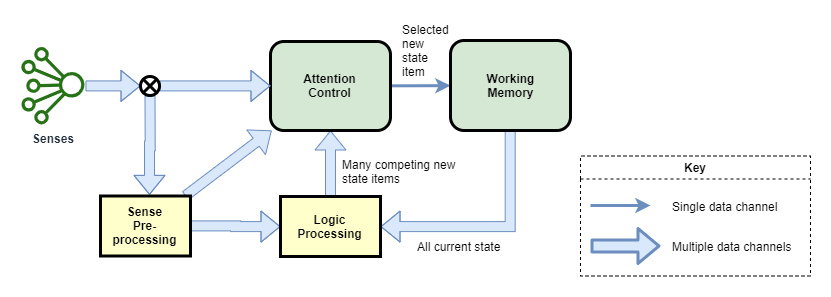

This page attempts to present a unified theory of how consciousness and high-level thinking function in the human mind, and likely in the mind of other mammals. Most of the points here are unproven assumptions, based on observations of my own thoughts and influenced from current scientific theories around world. See [[Background to A Theory of Mind]] for more details on how this theory was constructed.

While the theory uses the human mind as the primary example, it is focused on the theoretical fundamental architectures of consciousness, irrespective of whether that is in the form of a human biological consciousness, or some other alien mechanical consciousness.

### work in progress

Topics:
* All of thought is done by sub-conscious processor modules.
   * Neural pattern matching vs. sequential thought  (vis-a-vis Fast and Slow thinking, Daniel Kahneman)
* Scope of experience of Conscious Thought limited by scope of conscious feedback.
* Consciousness is just a state machine.
* Free-will - The experience of free-will is an artifact of our tightly integrated mental model, and the labeling of its inputs as 'my thoughts'.

# State Machine
The high-level thought system of the human brain is a state machine with a tightly integrated control mechanism, known as consciousness. The low-level older part of the brain is something much more akin to our current deep-learning artificial neural network models - basically just pattern matching/prediction engines. All thought, including high-level thought, is achieved through coordinating the function of the state machine with the low-level pattern matching/prediction components of the brain.

The high-level state machine of the brain is illustrated in the following diagram.

# Minimally Conscious Architecture
I believe the most basic form of consciousness needs only the following:
* sufficiently interesting inputs & outputs
* 'current state' - ie: working memory
* feedback loop - current state of thought is fed back as an input
* a minimum level of complexity sufficient to incorporate the feedback loop into main logic processing

## See Also
* [[What is Consciousness]]