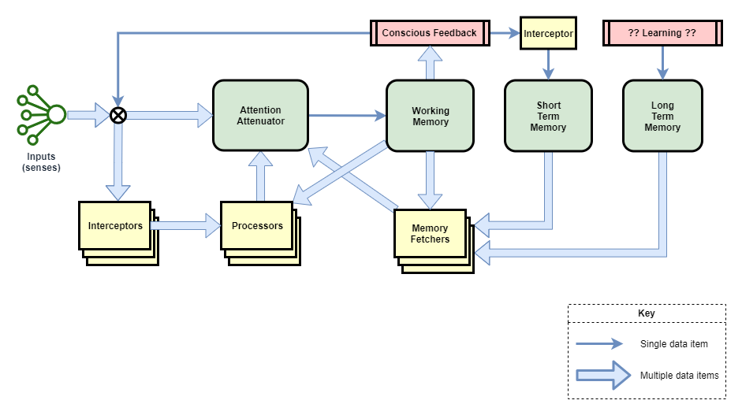

The following diagram describes the high-level architecture of Conscious Calculator.

It contains the following major components:

|Component|Description|
|----|----|
|Inputs|Input senses are treated as streams of data, and interceptors are required to identify meaningful events and/or features.|
|Attention Attenuator (AA)|Controls which input or processor output is selected for action and writing into Working Memory.|
|Working Memory (WM)|In human experiments this holds about 7 items for about 1 minute.|
|Short Term Memory (STM)|Records most recent events in chronological order. Acts like a swap-space to free up room in Working Memory.|
|Long Term Memory (LTM)|Records significant events and learned concepts.|
|Conscious Feedback (CF)|Summarises the current state of working memory and feeds it back into the system as an input sense.|
|Interceptors|Slightly stateful event detectors and pre-processors of input senses.|
|Processors|Each processor is specialised to a particular recognition, prediction, or mental task. Don't have any of their own state.|
|STM Interceptor|A special interceptor is used to populate events into Short Term Memory. Each novel state output from Conscious Feedback (CF) is fed into STM.|

There are two main data types that run through the system:
* Inputs in a stream of their raw data form
* Events

## Inputs
In humans and other biological life-forms all raw senses behave like a continuous stream. Pre-processing pathways are required to identify features, to extract basic meaning, and to trigger on events. Humans seem to be able to observe the raw input when desired (eg: to objectively examine what we see in our sight), but generally we work off feature-extracted summaries of those inputs.

Thus, inputs can be fed into the system in any of three basic ways:
1. Raw input fed straight into conscious awareness via AA
2. Pre-processed input fed straight into conscious awareness via AA
3. Pre-processed input used by processors to produce their output

Inputs can be used within the system in any of the following ways, listed roughly in order of most common usage first:
1. Input event detected by Interceptor (eg: command request), picked up by a processor for that kind of event (eg: command request), and loaded into AA as something to be worked upon. May be all that's consumed of the input at that time.
2. Input event at the start of a sequence detected by Interceptor, picked up by a processor which outputs some sort of "observe input" event.
3. Presence of "observe input" event causes AA to directly feed intercepted input directly into conscious awareness. Raw input is used too, in some unknown way.