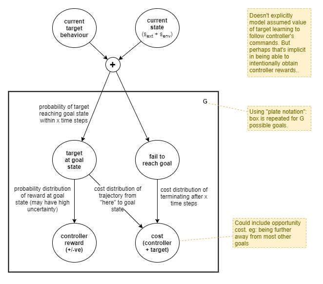

This page forms part of the [[Proto AGI v1]] series.

In the search for a strong argument for the need of conscious feedback, and for an AI architecture that could leverage such a feature, we shall now turn to the topic of _monitoring and control_.

An autonomous agent may not need to directly monitor itself. A built-in (primitive) reinforcement learning algorithm can silently update network weights and bayesian model priors without executive observability - ie: without the agent taking an active intentional part in self-tuning. However, it is my believe that the core reason for the existence of conscious feedback is to support intentional self-tuning.

So a worthy avenue of research is to investigate how an agent can monitor behaviour and infer improvements. We would need to investigate how an agent can apply that to its interactions with the external environment, but also to its interactions with itself in terms of non-physical action outputs (aka thoughts). The expectation is that this investigation will likely lead to the conclusion that conscious feedback is required in order to apply that capability against the agent's own thoughts. For example, if we put monitoring and control in context with the idea of _deconstructed RL_ and _deconstructed planning_, then it becomes more obvious that the agent needs to learn to run RL against itself, and possibly even why it needs to give itself rewards. So, hoping that this line of thought follows our expectation, we will finally be able to prove that conscious feedback is required in order to maintain thought stability.

To make sense of this, we'll first look at a scenario where one agent (the _control agent_) remotely monitors and controls a separate _target agent_. Then we'll turn that solution on its head and look at how we can make an agent apply the same logic to monitoring and control of itself.

# Anecdote
Consider the following anecdote:

> A research assistant is hired by a professor to help run training experiments against a lab mouse. The mouse is in a training environment, with some aspects of the environment able to be modified. The professor provides a small collection of tools that can be used to variously provide positive and negative rewards to a mouse. However, the professor gives no clear objectives, nor do they give any instructions on how best to train mice. The professor mentions that they'll pop in occassionally to provide further guidance, but in practice the assistant finds that the professor only provides very vague and sparse feedback. Left to their own devices, the assistant decides to make up tasks and to attempt to train the mouse to efficiently action those tasks.
>
> In the absence of any detailed information, the assistant must start by making guesses for a number of important things, and aim to observe and to improve those guesses over time:
> * **Environment:** the assistant knows that the mouse will operate within a set environment, and that they can modify that environment to some extent, but they do not what changes are possible.
> * **Task space:** the assistant doesn't know what tasks are possible, nor what tasks are achievable by a mouse, nor where the best balance lies between setting achievable and unachievable tasks.
> * **Task indication:** they do not know how to indicate tasks to the mouse.
> * **Measurement:** they do not know how best to measure achievement of tasks that they set, nor what other non-task measurements they should perform, if any.
> * **Rewards:** while they have been given some reward tools, they do not know to use them, nor what effect they have. 
> * **Training:** finally, they do not know what strategies are available for training a mouse, nor which of those strategies are most effective, nor whether they need to adjust the training strategies for different tasks.
>
> Given the dearth of information, the assistant will likely start by just passively observing the mouse's behaviour, in a sort of _play_ phase. After having made some observations, they may start to experiment with the environment. They may find, for example, that by modifying the environment they can observe new behaviours, which expands their understanding of the range of capabilities of their test subject.
>
> Next, the assistant may want to experiment with setting tasks. As they do not know the range of tasks possible, nor do they know how to indicate tasks to the mouse, they will probably start by trying to have the mouse intentionally repeat specific tasks that the assistant has previously observed the mouse to perform spontaneously, such as during the play phase. For task indication they will have to experiment quite a lot. Some options they might try include: an inanimate object placed in a goal position, food placed in a goal position, the use of sound to indicate different tasks, or they may simply find ways to punish the mouse each step it makes that is not in the direction of the goal position. Likewise they will have to experiment a lot with the different reward options. They will likely need to try each option multiple times in different scenarios, in order to build a detailed understanding of the behaviour of each task indication and reward option with respect to the mouse's training. For example, they will quickly find that setting attainable goals leads to faster learning than unattainable ones, and that a combination of effective task indicators with both positive and negative rewards leads to faster learning than any of those training components alone.
>
> Gradually the assistant will build up a detailed and nuanced understanding of how best to train the mouse to perform different tasks. They will leverage that understanding to adjust their training according the professor's feedback. Simultaneously they will also gradually build up a better understanding of the professor's objectives based on the professor's occasional feedback.

Some specific aspects of this anecdote are worth elaborating:
* **Priors:** the assistant's initial guesses are priors. And the observations that they make, and posterior likelihoods that they calculate, will enable them to adjust those priors over time. In some cases, such as with the different positive and negative reward options, the assistant will probably assign equal prior likelihood to each option. In an evolutionary setting, where the assistant is an organism's autonomous monitoring and control system, those priors will be shaped by evolution.
* **Primitive mechanisms:** the mouse itself is embued with some _primitive_ self-learning mechanisms, and the assistant may make assumptions about the existence of those primitive mechanism or infer their existence through observation. Such primitive mechanisms may, for example, include: minimising effort, avoiding injury, hunger/satiation reward association.
* **Hindsight:** the assistant will not know the most efficient way for a mouse to carry out a task, and initially will make guesses about that. Having observed a mouse perform a task, the assistant will be able to update their assumptions, and thus may use their "in hindsight" (posterior) model when determining the reward.
* **Modelling:** there is plenty of avenue in here for very complex hierarchical and classification-based models to be built up over time. Complex models can be used to predict the behaviour of the mouse given different stimuli, and for what training methods are appropriate across different scenarios. Complex models can also be build up to represent the professor's objectives.

# Remote Monitoring and Control

We will define _remote monitoring and control_ (RMC) as the case where a _control agent_ must monitor and control a remote _target agent_. We will draw a distinction between two variations:

* **External-RMC:** the control agent can only monitor and control the target agent through the environment and the agent's interactions with the environment. The control agent can only observe the target agent's state through its externally observable behaviours. Where the control agent would benefit from knowing the target agent's internal state, it must use _theory of mind_ (ToM) to model and predict the target agent's internal state based on the observed external behaviours. And it can only influence the target agent's behaviours through positive and negative rewards supplied through the environment.

* **Internal-RMC:** the control agent can directly access the target agent's internal state. The control agent can directly observe the target agent's internal state and internal behaviours (eg: "thought processes" in a generic sense), and its primitive learning parameters. And the control agent can directly control the target agent through rewards supplied directly into the target's internal senses, and through direct control over its primitive learning parameters.

## Baseline implementation
Within the anecdote above, the assistant represents an External-RMC agent. So let's focus on that first, and consider how we might emulate such an External-RMC assistant via an AI agent that must be trained (from scratch) to effectively monitor and control the target agent. The assistant is trained by the professor, who provides rewards to the assistant. For the training of our control agent, we will imagine a _control environment_, which represents the environment in which the control agent operates and which provides _control rewards_ to the control agent for its learning.

A first naive implementation is for the control agent to be a `1:1` function that passes all control rewards directly onto the target agent. We will treat this as our baseline, because it represents the ordinary case where the target agent operates within its own environment without any AI monitoring and control. For any solution we devise to be of merit, it must enable the target agent to obtain greater average reward than the baseline.

A strong reason for wanting to do better, and for thinking that we can do so, is that the control rewards are expected to be sparse and of low fidelity (ie: with minimal to no detail about how the agent could improve). If we can make some _a priori_ assumptions about what is likely to achieve greater rewards, and to build those assumptions into the control agent, then we should be able to train the target agent for greater rewards more efficiently.

Effectively we are focusing on solutions for _training shaping_: adjusting how the training is carried out to maximise learning efficiency. And we are making an assumption that there is a benefit to offloading the responsibility of training shaping to an independent control agent that too must learn. In other words, we believe that the control agent can somehow learn and use training shaping more efficiently than the target agent can learn on its own. Perhaps this is because the target agent employs slower learning techniques, such as a pure neural network architecture with millions of nodes, whereas the control agent employes faster learning techniques such as bayesian models.

## Areas for Investigation

### Control Priors
Let's start with the following assumptions:
* it's good to maximise the ability for the target agent to do different things (ie: have a multitude of skills)
* it's good for the target agent to follow instructions
* it's good to maximise reward in the most efficient way possible

### Monitoring options
Some options for monitoring of target agent:
* Model relationship between target entity's goals and the rewards it receives
* Measure expected reward vs actual

Need to model:
* Professor objectives - ie: based on _a priori_ assumptions about what's good to teach a target agent to do, and on control rewards received, infer posterior model of what leads to maximum control rewards.
* Target agent reachable states (ie: observe what states the target agent reaches, plus add prior, and use for guessing suitable goals)
* Target agent typical/possible actions at each state
* Target agent latent state

Note that the control agent does not receive rewards for spontaneous rewards received by the target agent that were not supplied by the control agent. Eg: in our anecdote above, if the mouse finds stray food and eats it, the assistant does not automatically receive a reward. That still depends on what feedback the professor gives. For example, the assistant may be punished for letting the mouse eat the stray food. Subsequently, the assistant should learn that the mouse will always eat stray food if it encounters it, and thus the assistant must steer it away. This is like us consciously avoiding situations that we know will trigger a bad habit, and it represents the difference in adaptation rates between bayesian modelling and neural-networks.

### Control options
Some options for control:
* Adjust priors used in target agent's bayesian inference components
* Adjust how frequently or infrequently target agent is given a reward, eg:
    * 1:1 with frequency of control reward
    * every time step
    * when target agent achieves goal set by control agent
    * once for every movement between state-space clusters
    * based on reaching (or closest equivalent point to) each step in high-level partial-plain output by planner. That is, use output of clustered planner for next state (ie: best next state, given current state and goal), ignoring action required to get there. If combine with state-space clustering, then will produce intermediate targets at a good intermediate frequency.
* Adjust how reward is distributed across actions in calculation of return, eg:
    * discounting method from standard RL, with epsilon-infinite horizon (ie: stop when close to zero), and varying rates
    * bayesian or NN-based inference of trajectory length that relates to reward
* Adjust exploration rate via predictive model of how much uncertainty remains about unobserved states. ie: _active inference_.

Note that this is very closely related to _reverse RL_ techniques for learning the reward functions. The difference being that we are using bayesian inference instead of a neural network.

Theory of Mind may be useful to adjust what rewards are given to the target agent. For example to:
* reward more for intentionally achieving a task than by accident
* give targeted and detailed feedback rather than just a scalar reward
* use different kinds of reward signals (ie: positive vs negative)

Example from human context: as a parent of a child I adjust when and how I give feedback to my child based on what I think she is thinking, and on my observations about what helps her learn most efficiently. For example, if she makes a mistake, I ask her to correct the mistake herself immediately, rather than just telling her what she should have done; because I've found that she remembers better this way. 

## Target Agent Behaviour Model

The controller will need to observe the target's behaviour, in order to build up predictions about its future actions. So we now look at how the controller might model the target's behaviour. 

The target will choose actions based on the value of three state variables:
* `s_env` - the environment state, eg: door is open/closed, location of cup
* `s_ext` - the target agent's state with respect to its external environment, eg: location, heading, standing/sitting/lying, position of limbs, whether it's holding a cup.
* `s_int` - the target agent's internal state, eg: policy network configuration and weights, executive control state (eg: working memory), memory that influences adaptations.

From the point of view of the target, states `s_env` and `s_ext` are hidden latent variables that the target only makes indirect observations about. Thus its actions will be based on _belief_ (`b_env` and `b_ext`) about those states. For the target's internal state, we assume that `s_int` directly affects target actions without the extra indirection of observation and belief.

An action by the target, results in a change in any or all of those state variables:
* `s_env` - interactions that affect the environment, eg: change the state of the door, move the cup
* `s_ext` - physical actions of the target agent itself, eg: move its limbs, face a different direction, move from lying to standing, drop the cup
* `s_int` - internal changes that cause the agent's behaviour to be different for the same `s_env` and `s_ext`.

The controller can observe `s_env` and `s_ext`, both before and after a target's action, the controller cannot at any point observe `s_int`. In an advanced system, the controller would build up a "Theory of Mind" about the target's internal state. For now, we will simplify this by accepting that the target's behaviour is affected by a hidden latent variable that will change over time, and thus the target's behaviour will change over time.

Like the target, the controller does not directly know the true values of `s_env` and `s_ext`, but makes observations and forms beliefs about those states. To avoid confusion with the target's beliefs, we will refer here to the controller's observations only. Thus we have: `o_env` and `o_ext` referring to the controller's observations about those states. Lastly, the controller observes the target action `a` as `o_a`.

Thus, we have the following generative model for the controller's observations at time `t`:

## Controller Reward Model

The controller receives the professor's feedback in the form of rewards, so how does the controller interpret the underlying meaning behind those rewards?

Being able to understand an the objective is an area of great concern for AGI and adaptability. Actions, trajectories, environment state, and many other things all play a big part here. In a real-world human scenario, the objective and rewards take the form of communication with high-fidelity and nuanced details that the controller interprets through its past experiences and understanding of the world (ie: a "world model"). Furthermore, in a real-world human scenario, the professor may not supply a reward at all, as it is often up to the individual to infer for themselves that the objective was met.

A scalar reward value is a low-fidelity proxy for communication. Thus we will only produce really interesting behaviour once we introduce true communication into the mix. However, a controller architecture built around low-fidelity rewards should extend to support more detailed communication and world modelling. So for now we will focus on just low-fidelity rewards.

Thus, we have the following "true" and simplified generative models for the controller rewards provided by the controller environment / professor, and we will assume the simplified model for now:

## Goal Selection

The controller will select a goal, indicate that goal to the target in some way, and reward the target for achieving that goal. How should the controller select goals?

Goal selection can be based on a number of factors. In order to prioritise attainable goals, the controller can select goals from the set of past observed states. Additionaly, in order to increase likelihood of discovering new and useful states, the controller may sometimes select previously unseen states as goals - eg: a good method for doing that is via _active inference_ (Friston _et al_, 2013; Tschantz _et al_, 2020). Where the controller has been able to infer something about the controller environment's objectives (ie: professor's objectives) then it will additionally consider that when selecting goals.

An important aspect of goal selection is the likelihood of maximising controller reward through the continuation of the current goal vs picking another. This needs to be driven by estimates of maximising the controller's _long term_ accumulation of rewards. For examle, after observing the first controller reward, should it seek to keep replicating that one observation, or should it explore further to see if greater rewards are possible? The controller probably will never know for certain whether it has observed the greatest possible reward, and it will probably never know with any certainty the likelihood of obtaining further rewards in new states. It must build up a prediction of the likelihood of that, based on its past observations, and on built-in priors.

The value of any given goal comes down to its expected rewards and costs, relative to that of other goal options. This can be represented as follows:

In order to begin to break that down, let's first assume that goals are just selections of specific states, and segregate the goals available:

|Current selection|Objective states|Seen states|Unseen states|No goal|
|---|---|---|---|---|
|Stay with current goal.|Pick a goal based on current best interpretation of controller environment objective. May be a previously seen state or a predicted unseen state.|Pick a goal out of set of past observed states. Includes states that did/did not produce a reward when last observed. Based on prior, may still consider there to be a possibility of future reward in a given state.|Stochastically generate new hypothetical state value as goal, somehow based on belief about plausible state values.|"Free play". For a period of time, select no goal and allow target to explore unencumbered from any interference by controller.|
|Expectation of controller reward based on prior belief about benefit of goal, plus current trajectory|Expectation of reward based on model of objective and associated reward.|Expectation of reward based on past observations about reward at that state, plus belief in variability of rewards.|Expectation of reward based on belief about possibility of reward at previously unseen states, plus belief in achievability of target reaching the state.|Expectation of reward based around likelihood of encountering previously unseen states, and certainty of those new states being acheivable.|
| | |Lower chance of discovering new rewards.|Chance of discovering states not otherwise likely to be encountered.|Highest likelihood of discovering new states.|
| | |Higher chance of reproducing past controller rewards (good and bad).|Chance of encountering new rewards along with those new states.|Chance of encountering new rewards along with those new states.|

### Should the controller stay with the current goal?
We want to avoid the case where the controller never stays on one goal long enough for the target to reach it. So, let's look explicitly at the decision to stay with the current goal. Considerations include:
* accruing cost of steps taken so far without expected reward
* closeness to achieving goal - ie: updated likelihood of achieving the goal within `x` time steps, given the current state and trajectory so far (ie: target's recent behaviour).
* expected total value in short term minus opportunity cost of not changing.
* long term benefit (in terms of likelihood of increasing long term aggregate controller reward) of training target to efficiently reach goals set by controller.

### Trajectory starts at goal change
There is another benefit of the controller explicitly setting goals. The controller knows exactly when the goal was selected and indicated to the target. Thus, any consideration of trajectory, accrued cost and rewards, can all start from the moment of the goal change.

This offers a nice advantage over naive reinforcement learning which never knows whether an action had any part in the received reward, and thus simplistically distributes the reward across all "recent" events, with decreasing weight the further in the past the event was, according to some arbitrary hyperparameter.

### A practical approach
A simple implementation will be to randomly sample a few possible goal states, run value analysis over each, and pick the goal state with the highest value. This has the advantage of being simple to implement, and provides some stochastic variation that avoids the controller repeatedly picking the exact same goal states.

For the sake of simplicity, we will ignore the objective states for now.

The sampled possible goal states will include:
* the current goal, and
* items from the set of past observed states, and
* a random sample from a model of the state space (to generate previously unobserved states).

Where a stochastic model is available, the sampling should be taken from that distribution, in order to increase the likelihood of picking goals with higher expected value. Some mechanism will be required in order to record a represenattion of past states while avoiding storing every single individual state ever observed. And some sort of model of all possible states will be needed too.

## Goal Benefit Modelling
Goals are measured in terms of the benefit to the controller. eg:
* Short-term chance to reproduce past controller rewards
* Medium-term chance to discover new rewardful states
* Long-term chance to maximise ability to obtain future rewards by training target to follow controller's commands

Consider:
* Chance of getting any closer to goal state and thus obtaining any better rewards for current goal
* Achievability of goal - likelihood of goal being achieved is higher for closer goals

### Measuring success
How do we tell when the target has achieved the goal set by the controller? For that matter, how do we tell when the target is "on course" vs "deviating" away from the goal state? Assuming a continuous state space, the target will only ever reach a point close to the goal state, never exactly on it. It's going to be hard to know exactly what point is the best point to accept as "success". Furthermore, it's impossible to do anything much that's very advanced without a detailed model of the environment and the state space.

For now we will assume a naive euclidean interpretation of the state space (with or without some explicit regularization process to make this assumption more reasonable). Perhaps we can use some acceptable error limit, `ε`, and conclude "achievement" of goal for any state that has `|target state - goal state| < ε`.

One purpose of setting goals is to reproduce past controller rewards. Where a goal has been selected from past observed rewardful states, then the goal selector has predicted a certain `p(r_ctrl|s_tgt)` distribution. However we do not know what error margin the environment/professor allows before issuing the expected controller reward. The best overall approach is to judge the target's ability to do better vs the cost of trying further. A simply approach may be to pick _a priori_ some ε (initially small), and keep trying, measuring the accumulated cost. Over several runs, use past experience to update the posterior ε, increasing it until a balance is struck on average that the controller doesn't wait any longer than is worth the gain.

More formally, we need to examine the cost of trying further against the likelihood of doing better; to consider the likelihood of attaining the past reward if the agent does better by some amount; and to consider the magnitude of that expected extra reward. At this point, it starts to look like a component of goal selection, and in particular the choice between sticking with the current goal vs choosing another.

It's useful to note that this problem becomes easier in cases where forms of hindsight can be used (such as in offline training). So for Internal-RMC and AMC, we may find a better solution.

### Benefit of goal repitition
Practice on existing known rewardful goals can reduce the cost on subsequent attempts by making the target more efficient. However the benefit of practice reduces over time. So there is a point where further practice gains no improvement for the future. If we knew the ideal trajectory length/path for a goal from some current state then we could assume for example that each practice will reduce actual cost by 10% closer toward the ideal cost.

Could we use a function approximator `C(s_a -> s_b)` that predicts expected cost based on past experiences? Perhaps we could measure subsequent actual cost against this prediction and use it to judge the benefit of practice? It's not entirely clear how that might actually work, but having such a predictor would be extremely useful for goal selection as it needs to estimate cost without performing planning.

### Benefit of goal exploration
Some attention also needs to be given to the selection of a goal with no past observed reward. This includes previously seen states that issued no reward, and unseen states. One benefit of setting a goal is the hope of obtaining controller reward upon reaching that goal. A second benefit of setting a goal is to train the agent to follow goals. A previously rewardful state provides both those two benefits, however it offers only a potentially very small sample of the set of plausible attainable states. Consequently, training the target against those goal states alone may not generalise well.

To put this in a slightly different way, the value of a rewardless goal is (through training) to reduce uncertainty in the target's ability to reach an arbitrary goal set by the controller. The subsequent value is to maximise our future likelihood of being able to reproduce future observations of high reward on so far unseen states. Based on lots of observations by the deep learning community, we assume _a priori_ that generalisation will be maximised by training against lots of different goals.

This is also part of how we can trade off exploration of random rewardless goals vs known rewardfull goals. It becomes yet another term in the prediction of the value of a potential goal state.

## Cost Modelling

We need to understand and model cost in order to support a number of calculations. We need it to support estimation of goal value, and (as will be seen later on) we need it for calculation of target rewards.

### Cost types
What kinds of costs must we deal with?

Costs primarily associated with the controller include:
* Time elapsed - ie: "professor impatience"
* Opportunity cost - risk of reduced controller rewards
* Risk of negative rewards

Costs primarily associated with the target include:
* Energy use - eg: faster energy use leads to needing to recharge/feed/rest sooner.
* Injury - injury either slows down the target agent, or prevents it from carrying out any further actions.
* Entrapment - risk of becoming stuck and unable to reach any further goals.
* Opportunity cost - risk of reduced target rewards, eg:
    * if target moves towards location that is furthest from majority of goal locations, then reaching those goals will become more costly in the future;
    * if target leaves/places something in a state that must be rectified later at a cost (eg: dropping cup to floor)

### State-state transition cost problem
What is the cost of executing a trajectory of actions in order to transition from one state to another? For example to transition from the target's current state to the goal state?

If state solely represents coordinates in 2D or 3D space, then simple euclidean equations can be used as a basis for accurate calculation of cost. But our state is likely to combine multiple independent components into a single multi-dimensional vector, and the relative costs of changes in different parts of that state vector will vary. For example, the cost of quickly jumping one metre forward and backward several times may be significantly more (in terms of effort and tiredeness) than spinning on the spot and moving a hand from one position to another one metre apart several times within the same time frame. And the cost of shifting the point of focus for the eyes several times between two points 500 metres apart is significantly less again.

Furthermore, it is unlikely that the state representation has anything even resembling a euclidean space even when looking at only specific components of the state representation. It's more likely to be non-linear and have complex interactions across different components of the state representation.

Lastly, being able to estimate cost is so important for accurate and efficient exploration, that we need a mechanism that can very quickly form belief about the cost function from as few samples as possible.

### State-state transition cost function approximator
The following approach provides a first practical solution.

Assuming that the state representation is a vector of `1 x m` floating point values, the cost `c` of transitioning from state `s1` to state `s2` is to be estimated as the weighted sum of the absolute differences across the state vector values. In short:
* `c(s1, s2) = Σ[i=1..m]w_i|s1_i - s2_i|`

This happens to translate naturally into a very simple neural-network of the following structure:
1. m input nodes
2. 1 fully-connected output node, with linear activation function

So we initialise all weights to `1.0` under a prior assumption of euclidean space, and use gradient descent to train the weights in order that _average_ cost estimation equals true cost. And we can use the variance to determine uncertainty.

### Cost of activity
In order to encourage efficient solutions, it's useful to incorporate the cost of different kinds of actions, and also of just mere time ticking by (in order to discourage too much inaction).

A model for cost could be:
* cost of time ticking: 0.1
* cost of mental action only: 0.1
* cost of physical action: 1.0

### Opportunity cost and empowerment
Opportunity cost is a particularly interesting case. Klyubin _et al_ (2005) introduced the concept of "empowerment" to address this, whereby the agent favours states that provide greater opportunity for future rewards. That is incorporated into the exploration/exploitation trade-off via the simple mantra of their paper's title "All else being equal, be empowered". So when weighing up the relative benefits of two actions with similar costs/benefits in the short term, choose the action that leads to greater empowerment in the long term. There has been a lot of subsequent research in this area, so we will be able to leverage that in our solution.

It's also interesting to observe that humans don't seem to intentionally optimise for empowerment when first performing actions. Rather, they often only recognise the empowerment cost after the fact. They use hindsight to recognise that a particular choice during task A subsequently made task B harder to achieve; and they remember this when next doing task A. This appears to be a sensible approach given the extra computational cost of predicting likely effects on possible later tasks for every action made now.

### Future Advancements
**Clustering**:
* The 'state-state transition cost function approximator' described above naively assumes that the state space is euclidean.
* A first step towards more accurately modelling the state space is to apply bayesian-based clustering, and to support different approximator weights for each cluster.

**Trajectory deviation penalty**:
* The cost-based reward model is simple and relatively effective. It is good at ensuring that the target moves roughly in the right direction. However, it has a drawback in that it is relatively insensitive to trajectory deviations because there's little difference in a straight line vs a curved path if they both reach the goal.
* If the controller has a good enough model of the state space then it can simulate an ideal trajectory and measure the target's motions against that trajectory, penalising based on the distance from the ideal trajectory.
* This may involve something like Simultaneous Localisation and Mapping (SLAM), and/or planning.

**Trajectory based goals**:
* Being able to simulate an ideal trajectory, and being able to judge the targets actual trajectory against the planned one, leads us naturally to start using trajectory-based goals instead of state-based goals.
* Now the controller also has a far wider range of possible goals to explore.
* Thus supports more complex and dynamic goals that incorporate specific actions, and could make a further significant step towards more advanced behaviours.
* Furthermore, it supports the capability we see in humans whereby we can aim to achieve a particular goal with focus just on that required state and some habitually learned ideal trajectory will be token (eg: finger touching nose). Or alternatively, we can consciously decide to take a particular trajectory, overriding the more efficient default (eg: move arm in an arc as part of a ballet dance).
* Some human-like actions that could be supported through trajectory-based goals include: "swing the axe to chop the wood", "throw the ball".

**Direct loss calculation instead of rewards**:
* Reinforcement Learning depends on the use of rewards given at random intervals. Those rewards are converted into per-time-step 'value' through a very naive discounted distribution across actions prior to the reward being received. And then training loss is calculated based on those values. This seems somewhat inefficient and inaccurate. What if RL could use loss values from the start?
* As we extrapolate the design into AMC, and if we use simulated ideal trajectories, we may be able to use deviation from the ideal trajectory as a loss value, and apply that directly against the policy.

## Calculating Goal Value

So, finally, we have the following generative model as an illustration of the value of attempting a particular goal for a particular length of time, as measured from "now".

The value of a goal is a result of short-term measures that estimate the probability distributions of accumulated results from "now" until termination of the goal:
* Expected accumulated controller reward
* Expected accumulated controller cost
* Expected accumulated target cost

The value of a goal is also a result of measures that estimate the intermediate-term effect on subsequent goals:
* Expected controller opportunity cost (or benefit)
* Expected target opportunity cost (or benefit)

And the value of the goal is also a result of measures that estimate the long-term benefit for future goals:
* Reduced uncertainty in probability distribution of controller rewards being received in association with certain states
* Reduced uncertainty in target's ability to reach goal states and in the expected elapsed time required
* Target improves ability to reach goal states
* Target becomes more efficient at reaching goal states

Finally, the value of a goal depends on how long we attempt that goal for, as measured by the length of the trajectory from "now", and affecting:
* Certainty of reaching goal (ie: closer goals are more likely to be reached)
* Controller and target cost (ie: closer goals cost less)

If already attempting the goal, this measures the value of continuing further. For example:
* If nearing the goal state, the expected cost until reaching the goal reduces.
* If already very close to the goal state, the likelihood of getting closer tends towards zero, and thus the likelihood of obtaining further rewards tends towards zero. At the same time, the uncertainty around the distribution of rewards in that area reduces towards zero. So the small but non-zero cost of trying further eventually exceeds the benefit, and this triggers the selection of a new goal.
* In order to avoid re-selecting that same achieved goal soon after leaving it, we may need to incorporate some sort of boredom measure, such as preferring selection of goals with less certainty.

### Relevance of Target Rewards and Costs
For the controller's choice of goal, how relevant is measuring the expected target's rewards and costs? The answer lies in whether the controller emits those values. For target reward, the controller provides those to the target in order to encourage the target to learn to achieve the goal. There is no benefit in incorporating that into the cost model of a goal.

The target cost, however, is a factor of the environment and the target itself. The controller does not consider that target cost in any other way. Thus consideration of target cost within calculation of goal value appears to be sensible.

### Learning goal indication
The target will need to learn the meaning of goal indicators. Initially it won't even know that the "goal indicator" indicates a goal. Ideally, we would first train the target to understand the concept of goals via some in-built memory and modelling capability within the target. But in the absence of that capability, we will need to use frequent preemptive or posthoc rewards and depend on the RL algorithm to do gradient descent.

So we will need to initially set goals that the target will bump into by accident, in order that it can build up an association between goal indicators and the need to move towards them.

### Exploitation vs exploration trade-off
We want to maximise the total controller reward while minimising cost, aggregated over time. Over what time frame? If time is infinite, then the most efficient method might be to explore all possible states first, accumulating cost in the short term, and then afterwards exploit the knowledge for maximum gain. But the agent's lifetime may not be infinite, and there may be a maximum cost that it can accrue without sufficient rewards to balance them (eg: hunger leading to death without sufficient food to balance the energy use).

The expectation of long term benefit from exploration vs preference for short term gain will be a tuning parameter. It could be dynamically adjusted by the controller as it observes results over time, but this still requires an _a priori_ expectation of ideal frequency of rewards. So it's the same problem in a different guise, and we'll need to look deeper to decide which representation is easier to work with. 

The biggest problem here is that the controller does not know in advance what rewards are possible. Given a certain amount of exploration, the observations it has made fall into the category of "known knowns" plus some amount of "known unknowns"; however what might be possible in the future falls under the category of "unknown unknowns", making it hard to reason about.

Within commercial software development practices today it is common to break a large problem into small 2-week chunks of work. It has been found that performing frequent reviews of the solution leads to more reliable chance of success, than hoping for a "big bang" success at the end. This can be seen as different approaches to the exploration / exploitation dilemma (Berger-Tal _et al_, 2014).

So there must be an ideal balance between expolation and exploitation. If we could model the problem sufficiently we would probably find that some sort of tuning parameter would fall out that we could adjust to reflect our _a priori_ assumptions about that ideal balance.

It's informative to note this same tuning problem occurs for humans, and (perhaps simplistically) it would appear that we see this in the variation of different individual's risk-taking vs risk-averse behaviours. For humans, however, there is a mechanism in play that helps convergence towards a narrower range than would otherwise occur. Individuals learn from others by consciously and subconsciously comparing themselves to others. They take note of those others' relative better successes or worse failures, and adjust their own risk taking profile as a result. Effectively, this mechanism leverages a population level sampling effect for the benefit of the individual. Of course, there are also genetic factors at play.

### Cost limit
A first step can be to define a limit on acceptable cost accrual. Let's assume that cost is measured on the same scale as reward, so that we can measure them as separate values but compare them easily. We define the maximum acceptible cost accrual by stating that, within a specified time frame `t_it` (for "iteration" length), accumulated reward must exceed accumulated cost. Thus, in expectation, we require:

* `E[Σr - Σc] > 0` over time period `t_it`

The time frame `t_it` is the tuning parameter here which encodes our _a priori_ assumptions about the short-term time frame over which an agent can tolerate a negative balance (of `E[Σr - Σc]`) in order to maximise gain over a longer time frame. In humans `t_it` might be 1 day, for example, ignoring a lot of subtleties. For our agent, `t_it` might be something like `1,000` time steps.

### Exploration limit
So a naive approach now is to break activity into iterations of length `t_it`, to explore in order to maximise long term `E[Σr - Σc]`, while exploiting sufficiently in order to ensuring `(Σr - Σc) > 0` for each iteration. However, this will still lead to a sub-optimal solution, as the agent will seek to be only slightly positive in its gain, and otherwise will continue to explore.

The issue here is an assumption of infinite time, once again. One solution is to make an _a priori_ assumption about the lifetime of the agent, for example that agents on average survive for `M` iterations. Alternatively, we could build in an assumption that an agent will typically observe the state space sufficiently by `N` iterations (N < M). Thus, after `N` iterations the agent can assume that it has observed the possible range of reward values and thus should focus more on exploitation. This is a biologically plausible approach. For example, by 20 years a human typically will have sufficient understanding of the world that they have an accurate model of the range and distribution of possible rewards, and that only minor tunings on that model will subsequently be possible. An alternative could be to use some sort of discounting factor that favours shorter term exploitable rewards over the potential of longer term greater rewards.

### Active inference
Overall, I think we'll find that the active inference approach will cover much of the above.

_tbd_: go into active inference in more detail. But maybe need to cover off further down when we combine goal value and cost model in more unified way.

## Goal Indication

In a physical environment with External-RMC the controller needs to manipulate the environment in order to indicate a goal to the target, and the likelihood of the target reaching the goal depends on its ability to understand the meaning of that indication. When we consider Internal-RMC this might be replaced with direct manipulation of target state. Thus the question of goal indication in a physical environment will be largely glossed over here.

We will assume that goals are indicated by some physical marker placed into the environment at the goal location, and which is immediately and always observable by the target. We will also assume that it has sufficient fidelity to indicate a range of different goals (eg: different shaped markers to indicate different required actions at the goal location).

## Rewarding Target

The controller must provide rewards to the target in order to encourage target learning. We want to choose target rewards that maximise long term gain. The selection of appropriate rewards will be based on some model about the world and the target, priors, and observations.

As we know when the goal changes, reward calculation can focus on the trajectory from the start of the current goal.

Some options for different timing of target rewards include:
* **Goal achievement**: emit online reward upon goal achievement/failure. May or may not use hindsight about the trajectory just taken to adjust the reward. If this is the only reward, and the target is a simple deep neural network-based RL solution, then depends on RL processes within the target to distribute the inferred loss across past actions.
* **Frequent online**: emit frequent online rewards based on estimate of whether the target is moving towards or away from the goal. This may be per time step or based on clustered states, for example emitting one reward for each state cluster.
* **Frequent offline**: apply offline rewards against notable points along trajectories, or for each time step, based on hindsight. For ExternalRMC this would degrade to rewarding at goal achievement only, but for InternalRMC it could be quite beneficial.

There are two different "structural" variations across possible rewards:
* **Preemptive**: rewards placed into the environment before target activity, which the target is capable of observing prior to receiving the reward. eg: food (positive reward), zappers (negative reward).
    * These will tend to act as markers (positive: "beacons"; negative: "danger signs") that affect the target's behaviour in the same way that a goal indicator would.
    * They encourage rapid adaptation in the short term. eg: leveraging existing ability to follow beacons.
    * Can be used to encourage habitual learning of trajectories.
    * Can be used to discover far off rewards that the target might not otherwise encounter. eg: particularly good for use of previously unseen states as goals.
    * However, may lead to a dependency on markers, such that the target never learns to approach a goal without them.
* **Posthoc**: rewards given to the target only after some activity and otherwise unknown to the target.
    * Depends more on target's exploration in order to encounter for the first time, and then on target's exploitation to re-encounter them.
    * Teaches target to seek indicated goals.
    * Leverages intermediate and long term forms of adaptation.
    * However, takes longer to cause behavioural changes.

### Assumptions
We require some models to accurately produce rewards:
1. A model of how reward will change the target's behaviour.
2. A world model of how states relate to each other
    * eg: the distance (or cost) between two states
3. A world model of states that should be favoured or avoided.
    * eg: dangerous situations, going off the road, recognising goal indicators.

The target's interpretation of the reward may need to be taken into account (regardless of whether the reward is somehow "correct" or not). That depends on a number of factors, including:
* Whether the controller is accurate in its assessment of whether the target is moving away from or towards the goal.
* Whether the target agent's internal representation and/or learning accurately reflects reality.
* The shape of the state space, eg: whether a straight line motion is sufficient or detours are needed to navigate a maze.

Let's declare some assumptions about rewards:
* A greater frequency (online or offline) of rewards will converge the target faster, and thus increase controller rewards.
* Erroneous target rewards will make convergence slower, and thus decrease controller rewards. This includes for example rewards that might somehow confuse the target into heading towards an old goal.
* Hindsight-based offline rewards will be more accurate than online rewards (which are inherently predictive in nature).
* There is a difference in consequence when the target goes off course when close to reaching a goal vs being far away, but it's hard to set a general rule about this. Thus it's better to attempt to judge the likelihood of reaching the goal given the current state/action.

### Reward appropriateness uncertainty
It's clear from the above that we need to model the uncertainty about appropriateness of a calculated reward. Furthermore, ideally we would also model the expected effect of a reward on the target, in order for example to avoid rewards that are otherwise appropriate but might be erroneously interpreted by the target.

For an initial simple model of reward effect on target behaviour, we assume that rewards of correct sign are good, and rewards of the wrong sign are bad. So, we need to estimate the likelihood of a reward having the correct sign and only emit rewards with > 50% certainty of the sign being correct. Note here that although we talk about the sign of a reward, in practice reward values within RL are often all within the positive number range. Thus, we interpret positive/negative rewards as being relative to some mean reward value.

### Rewarding goal achievement
As discussed above, it is tricky to identify a specific exact point where the target "achieves" a goal, because of the continuous nature of the state space. The conclusion was rather to weigh up cost and benefits, and to choose a new goal when the target is not likely to "achieve" the goal any better than it already has. So this change of goal becomes the trigger for rewarding the goal achievement.

Alternatively, we could not bother with trying to reward goal achievement, and instead focus on rewarding intermediate states (ie: based on state clustering).

### Don't mix controller and target rewards
Controller and target rewards serve different purposes, and won't be mixed. For example, we won't forward any controller rewards directly onto the target. And we won't include target rewards in the calculation of controller gain.

The controller will use the target to explore the state space, for the benefit of knowinging more about the state space, and for the benefit of training the target. During that time the controller will receive rewards/penalties for its actions, and in doing so will learn more about the appropriate objectives for its environment. Where the controller environment metaphorically shouts at the controller, the controller will avoid the applicable region of the state space later.

One particularly concrete aspect of this is the scale of reward values. The controller will receive reward values across some particular range. The reward values produced by the controller for the target will not necessarily have the same range.

In summary, the value of any target's state must always be defined by the controller under its model of success, not by the controller environment.

### A practical solution
A simple starting point is to reward based on cost. At any given point, estimate the (ideal or average) cost from that state to the goal state, and reward based on the delta in that estimate due to the target's new state. Emitting a reward each and every time step may be too frequent due to inaccuracies in the cost estimation, and those errors may train the target to diverge from ideal. A good balance can be found by additionally estimating the uncertainty in the cost estimate, and only emitting a reward once there is sufficient certainty in the _sign_ of that delta. In that way, as the target takes some trajectory, it will receive rewards at a "natural" frequency somewhere between once-per-step and once-per-goal.

Additionally, if basing rewards on cost, the reward should also take into account the cost accrued. This is important as the source of information to encourage efficient trajectories.

Putting that together gives us this approach for emitting target rewards:
* Reward is computed as: 'change in estimated remaining cost to goal' - 'accrued cost'
* Emit rewards when certainty in _sign_ of cost delta exceeds some configured minimum value.
* Estimated remaining and accrued cost values are computed relative to start of newly selected goal, or last emitted reward, whichever occurred most recently.

Using a generative model representation, the emitted reward is the inferred _value_ (`v`) of the last `x` actions relative to the ideal trajectory for the goal `g`. It is based on three parameters:
* `Σc_t..t+x` - the accumulated observations of the cost of actions from time `t` to `t+x`;
* `c_g,t` the ideal cost to reach the goal at time `t`; and
* `c_g,t+x` the ideal cost to reach the goal at time `t+x`.

With final value estimated as:
* `v_x,g = E[c_g,t+x] - E[c_g,t] - Σc_t..t+x`

# Internal RMC

As the controller is performing much of the work discussed in [[Executive Control in a proto AGI]] regarding goal selection and bayesian modelling, for simplicity, let us assume that the target uses only a naive deep neural network and reinforcement learning algorithm.

# Autonomous Monitoring and Control

Here I introduce the concept of _Intentional Autonomous Monitoring and Control_ (I-AMC). I-AMC refers to an agent that performs monitoring and control of itself, autonomously, and with active intent. In other words, using the same logic and inference processes that it would typically use for interaction with the external environment, it can determine the need and carry out actions in order to make changes to its own tuning parameters.

## Architectural Options

...tbd...

We don't know enough about how the brain functions in order to replicate that within an AI architecture. In fact, our AI architectures today appear vastly different in structure. Thus, we'll have to make our own decisions about what architecture can yield the best results.

Types of AMC:
* Independent AMC
* Integrated AMC - Uses all same systems, in line with main action control pipeline. Shares same resources, including state (eg working menory) 

## AMC learning

_...tbd..._

Random:
* Some components directly output rewards, so it may be easy to directly apply those for the use of the RL algorithm.
* AMC part of agent takes responsibility for providing reward signals to internal, even when there are external signals available. Because it is the AMC module that _interprets_ the external reward signals given the sense inputs. Ie: the AMC module uses a generative model of latent reward state -> features -> observations, and then infers the latent reward from the sense inputs. It thus may sometimes ignore external sense inputs that appear to be rewards because its inference is that they are not.
* Might be possible for the RMC module to judge goal success where the goal is represented using some abstract representation that is different to the state representation. If so, then once move into AMC we won't have to measure goal success via a primitive operative, and won't have to force that goals uses the state representation.

### Dealing with dynamic state representation
For AMC, the true state is not available. Only the belief about state. However the representation of belief in state changes over time as the target learns. It is especially unstable during the initial phase of learning. So we cannot guarantee that an observed state value from the past is achievable now nor that it is likely to produce the same reward, because it may now represent a different state.

May need some way to translate. Eg: store past state as raw inputs instead of high-level representations. If only selecting states to store after the fact, then perhaps could use some sort of predictive network to estimate the raw inputs that caused the observed high-level state. Such as in offline "sleep" processes.

Alternatively, we could just accept the error margin but minimise it by discarding past observed states older than some limit such as `T/2` (ie: only keep the second half of observations since the agent's time began).

# Advancements

The above provides a framework that supports far more advanced modelling methods to be plugged in. This chapter looks at a few advancements that could be incorporated.

**Feedback**:
* Feedback provides a whole probability distribution, rather than a meaningless reward value that only makes sense relative to other rewards. Eg: "yes, you're doing well" vs "doesn't look like you'll be able to do this". And these can be used to directly update models. 

**Planning**:
* todo

**Combining Habit with Planning**:
* Model-based RL solutions tend to produce useful results earlier than model-free solutions, however they often quickly plateau or have slower asymptotic convergence than model-free solutions (Wang _et al_, 2019). This ultimately translates to less efficient or jerkier movement, which becomes particularly noticeable within robotic arm use cases (?citation?). A common solution is to use model-based RL as a first stage of training, and then use it to bootstrap training of a model-free network (Nagabandi _et al_, 2017).
* Intuitively this seems reasonable in the context of human learning. As we first begin to master a skill we consciously control our actions based on a mental model of what is required (ie: model-based action). These actions are often slow, jerky, inaccurate, and inefficient. This process is mentally taxing, and the brain has evolved to offload that process to habitual control as soon as possible (ie: model-free action). Once under habitual control, and as we repeat the task, our speed increases and the motions become smoother and more accurate.

**Mapping**:
* eg: Simultaneous Localisation and Mapping (SLAM). There is evidence that biology has encoded an understanding of 3D space. eg: place cells. eg: "backward sweep" activity related to location, seen in fRMI when an individual is planning (Dolan & Dayan, 2013).

**Optimised Trajectory Monitoring**:
* There's also room for further optimisations inspired by human behaviour. For example, we probably don't recompute and reselect a goal every time step. We probably pick a goal, plot an expected approximate trajectory, and then just watch to look out for unexpected events along the way. That approach saves on mental effort because the monitoring can be done using subconscious processes. and this could absolutely be incorporated into the solution here.

**Curiosity-based Exploration**:
* Active inference drives exploration via an objective of reducing uncertainty. But that still won't produce very interesting behaviour if the uncertainty modelling is "inward looking" - ie: based only around uncertainties from past observations, and uncertainties within models.
* Curiosity is also about uncertainties, but is more "outward looking".
* Curiosity drives a human to investigate an object that they have not seen before. This may include discovering buttons and nobs and interacting with them. This exploration is driven by uncertainty of the object.
* Another example is where we observe someone doing something novel (eg: a child seeing someone balance on one foot for the first time). We may then attempt to do perform that same action. This exploration is at least in part driven by uncertainty in our ability to perform the action.

**Entity-based State Representation**:
* The discussions about state ignore an important concern about the state representation. A state is a single (vector) point in a multidimensional space. However it actually encodes a combination of many independent and only partially-dependent entities or features. For example in a single snapshot of vision observed by an autonomous car on a road: location of road relative to agent, location of centre line, colour of road, texture of road, grass vs buildings on the side of the road, whether it's raining/overcast/sunny/windy/snowing, people on the pavement, cats on the road in front, etc. etc.
* Any solution that is worthwhile must not just naively cluster whole state values, but will need to segment the state values, identifying those individual features. Others have shown that systems that model scenes via entities and their relationships achieve significant benefits over systems that model via global state representations (Bapst _et al_, 2019; Veerapaneni _et al_, 2019). Clustering against features makes even more sense when you consider that different features will have different clustering needs, and different relative importance to the agent. For example it has been suggested that, in this context, clustering of states is best driven by the actions needed at those states (Rigoli, 2017).
* Thus, a full AGI solution will need a solution for object segmentation, object modelling, and object detection. 

**Modelling Aleatoric vs Epistemic Uncertainty**
Epistemic uncertainty is the uncertainty about the true function, due to a lack of sufficient data to uniquely determine the underlying system exactly. 

Aleatoric uncertainty, however, arises from the inherent stochasticities of a system, such as process noise, and noise in the method of state observation. As note by Chua _et al_ (2018), "without a way to distinguish epistemic uncertainty from aleatoric, an exploration algorithm (e.g. Bayesian optimization) might mistakingly choose actions with high predicted reward-variance ‘hoping to learn something’ when in fact such variance is caused by persistent and irreducible system stochasticity offering zero exploration value."

Thus the active inference exploration algorithm benefits from explicitly identifying whether uncertainties are aleatoric or epistemic. For example, Chua _et al_ (2018) propose a solution for that via ensemble models. They are able to measure epistemic uncertainties by differences across models, and aleatoric uncertainties through explicit data variance modelling within each model.

# References

Bapst, V., Sanchez-Gonzalez, A., Doersch, C., Stachenfeld, K. L., Kohli, P., Battaglia, P. W., Hamrick, J. B. (2019). Structured agents for physical construction. ICML 2019. https://arxiv.org/abs/1904.03177

Berger-Tal, O., Nathan, J., Meron, E., Saltz, D. (2014). The Exploration-Exploitation Dilemma: A Multidisciplinary Framework. PLOS ONE 9(4): e95693. https://doi.org/10.1371/journal.pone.0095693

Chua, K., Calandra, R., McAllister, R, Levine, S. (2018). Deep Reinforcement Learning in a Handful of Trials using Probabilistic Dynamics Models. NIPS 2018. https://arxiv.org/abs/1805.12114. [Videos](https://sites.google.com/view/drl-in-a-handful-of-trials/)

Dolan, R. J., & Dayan, P. (2013). Goals and habits in the brain. Neuron, 80(2), 312–325. https://doi.org/10.1016/j.neuron.2013.09.007

Friston, K., Schwartenbeck, P., FitzGerald, T., Moutoussis, M., Behrens, T., Dolan, R. J. (2013). The anatomy of choice: active inference and agency. Front. Hum. Neurosci. 7:598 10.3389/fnhum.2013.00598. https://www.ncbi.nlm.nih.gov/pmc/articles/PMC3782702/

Klyubin, A.S., Polani, D., Nehaniv, C.L. (2005). All Else Being Equal Be Empowered. In: Capcarrère M.S., Freitas A.A., Bentley P.J., Johnson C.G., Timmis J. (eds) Advances in Artificial Life. ECAL 2005. Lecture Notes in Computer Science, vol 3630. Springer, Berlin, Heidelberg. https://doi.org/10.1007/11553090_75. \[[Cite Seer](http://citeseerx.ist.psu.edu/viewdoc/download?doi=10.1.1.101.9018&rep=rep1&type=pdf)\]

Nagabandi, A., Kahn, G., Fearing, R. S., Levine, S. (2017). Neural Network Dynamics for Model-Based Deep Reinforcement Learning with Model-Free Fine-Tuning. ArXiv. https://arxiv.org/abs/1708.02596

Postle B. R. (2016). How does the brain keep information "in mind"?. Current directions in psychological science, 25(3), 151–156. https://doi.org/10.1177/0963721416643063. \[[Website](https://www.ncbi.nlm.nih.gov/pmc/articles/PMC5115785/)\]

Rigoli, F., Pezzulo, G., Dolan, R., & Friston, K. (2017). A Goal-Directed Bayesian Framework for Categorization. Frontiers in psychology, 8, 408. https://doi.org/10.3389/fpsyg.2017.00408

Tschantz, A., Baltieri, M., Seth, A., & Buckley, C. (2020). Scaling Active Inference. 2020 International Joint Conference on Neural Networks (IJCNN), 1-8.

Veerapaneni, R., Co-Reyes, J. D., Chang, M., Janner, M., Finn, C., Wu, J., Tenenbaum, J. B., Levine, S. (2019). Entity Abstraction in Visual Model-Based Reinforcement Learning. CoRL 2019. https://arxiv.org/abs/1910.12827

Wang, T., Bao, X., Clavera, I., Hoang, J., Wen, Y., Langlois, E., Zhang, S., Zhang, G., Abbeel, P., Ba, J. (2019). Benchmarking Model-Based Reinforcement Learning. CoRR, volume 1907.02057. https://arxiv.org/abs/1907.02057. \[[Website](http://www.cs.toronto.edu/~tingwuwang/mbrl.html)\]
