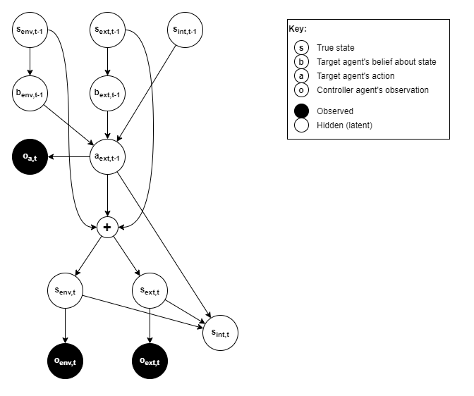
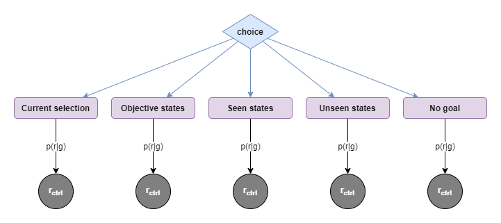
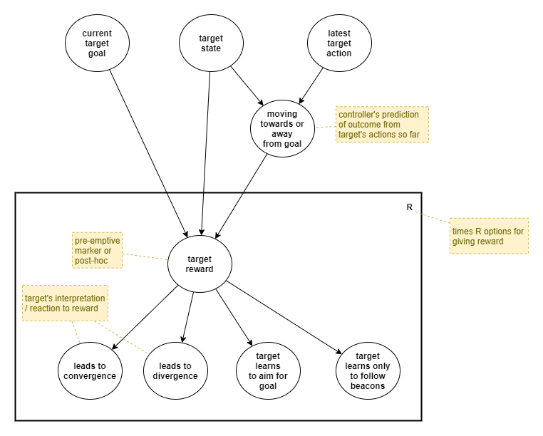
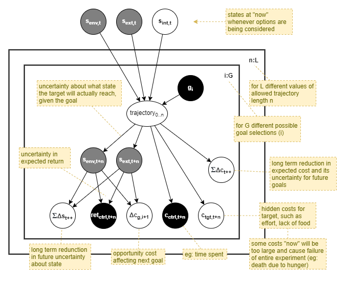

This page forms part of the [[Proto AGI v1]] series.

In the search for a strong argument for the need of conscious feedback, and for an AI architecture that could leverage such a feature, we shall now turn to the topic of _monitoring and control_.

An autonomous agent may not need to directly monitor itself. A built-in (primitive) reinforcement learning algorithm can silently update network weights and bayesian model priors without executive observability - ie: without the agent taking an active intentional part in self-tuning. However, it is my believe that the core reason for the existence of conscious feedback is to support intentional self-tuning.

So a worthy avenue of research is to investigate how an agent can monitor behaviour and infer improvements. We would need to investigate how an agent can apply that to its interactions with the external environment, but also to its interactions with itself in terms of non-physical action outputs (aka thoughts). The expectation is that this investigation will likely lead to the conclusion that conscious feedback is required in order to apply that capability against the agent's own thoughts. For example, if we put monitoring and control in context with the idea of _deconstructed RL_ and _deconstructed planning_, then it becomes more obvious that the agent needs to learn to run RL against itself, and possibly even why it needs to give itself rewards. So, hoping that this line of thought follows our expectation, we will finally be able to prove that conscious feedback is required in order to maintain thought stability.

To make sense of this, we'll first look at a scenario where one agent (the _control agent_) remotely monitors and controls a separate _target agent_. Then we'll turn that solution on its head and look at how we can make an agent apply the same logic to monitoring and control of itself.

# Anecdote
Consider the following anecdote:

> A research assistant is hired by a professor to help run training experiments against a lab mouse. The mouse is in a training environment, with some aspects of the environment able to be modified. The professor provides a small collection of tools that can be used to variously provide positive and negative rewards to a mouse. However, the professor gives no clear objectives, nor do they give any instructions on how best to train mice. The professor mentions that they'll pop in occassionally to provide further guidance, but in practice the assistant finds that the professor only provides very vague and sparse feedback. Left to their own devices, the assistant decides to make up tasks and to attempt to train the mouse to efficiently action those tasks.
>
> In the absence of any detailed information, the assistant must start by making guesses for a number of important things, and aim to observe and to improve those guesses over time:
> * **Environment:** the assistant knows that the mouse will operate within a set environment, and that they can modify that environment to some extent, but they do not what changes are possible.
> * **Task space:** the assistant doesn't know what tasks are possible, nor what tasks are achievable by a mouse, nor where the best balance lies between setting achievable and unachievable tasks.
> * **Task indication:** they do not know how to indicate tasks to the mouse.
> * **Measurement:** they do not know how best to measure achievement of tasks that they set, nor what other non-task measurements they should perform, if any.
> * **Rewards:** while they have been given some reward tools, they do not know to use them, nor what effect they have. 
> * **Training:** finally, they do not know what strategies are available for training a mouse, nor which of those strategies are most effective, nor whether they need to adjust the training strategies for different tasks.
>
> Given the dearth of information, the assistant will likely start by just passively observing the mouse's behaviour, in a sort of _play_ phase. After having made some observations, they may start to experiment with the environment. They may find, for example, that by modifying the environment they can observe new behaviours, which expands their understanding of the range of capabilities of their test subject.
>
> Next, the assistant may want to experiment with setting tasks. As they do not know the range of tasks possible, nor do they know how to indicate tasks to the mouse, they will probably start by trying to have the mouse intentionally repeat specific tasks that the assistant has previously observed the mouse to perform spontaneously, such as during the play phase. For task indication they will have to experiment quite a lot. Some options they might try include: an inanimate object placed in a goal position, food placed in a goal position, the use of sound to indicate different tasks, or they may simply find ways to punish the mouse each step it makes that is not in the direction of the goal position. Likewise they will have to experiment a lot with the different reward options. They will likely need to try each option multiple times in different scenarios, in order to build a detailed understanding of the behaviour of each task indication and reward option with respect to the mouse's training. For example, they will quickly find that setting attainable goals leads to faster learning than unattainable ones, and that a combination of effective task indicators with both positive and negative rewards leads to faster learning than any of those training components alone.
>
> Gradually the assistant will build up a detailed and nuanced understanding of how best to train the mouse to perform different tasks. They will leverage that understanding to adjust their training according the professor's feedback. Simultaneously they will also gradually build up a better understanding of the professor's objectives based on the professor's occasional feedback.

Some specific aspects of this anecdote are worth elaborating:
* **Priors:** the assistant's initial guesses are priors. And the observations that they make, and posterior likelihoods that they calculate, will enable them to adjust those priors over time. In some cases, such as with the different positive and negative reward options, the assistant will probably assign equal prior likelihood to each option. In an evolutionary setting, where the assistant is an organism's autonomous monitoring and control system, those priors will be shaped by evolution.
* **Primitive mechanisms:** the mouse itself is embued with some _primitive_ self-learning mechanisms, and the assistant may make assumptions about the existence of those primitive mechanism or infer their existence through observation. Such primitive mechanisms may, for example, include: minimising effort, avoiding injury, hunger/satiation reward association.
* **Hindsight:** the assistant will not know the most efficient way for a mouse to carry out a task, and initially will make guesses about that. Having observed a mouse perform a task, the assistant will be able to update their assumptions, and thus may use their "in hindsight" (posterior) model when determining the reward.
* **Modelling:** there is plenty of avenue in here for very complex hierarchical and classification-based models to be built up over time. Complex models can be used to predict the behaviour of the mouse given different stimuli, and for what training methods are appropriate across different scenarios. Complex models can also be build up to represent the professor's objectives.

# Remote Monitoring and Control

We will define _remote monitoring and control_ (RMC) as the case where a _control agent_ must monitor and control a remote _target agent_. We will draw a distinction between two variations:

* **External-RMC:** the control agent can only monitor and control the target agent through the environment and the agent's interactions with the environment. The control agent can only observe the target agent's state through its externally observable behaviours. Where the control agent would benefit from knowing the target agent's internal state, it must use _theory of mind_ (ToM) to model and predict the target agent's internal state based on the observed external behaviours. And it can only influence the target agent's behaviours through positive and negative rewards supplied through the environment.

* **Internal-RMC:** the control agent can directly access the target agent's internal state. The control agent can directly observe the target agent's internal state and internal behaviours (eg: "thought processes" in a generic sense), and its primitive learning parameters. And the control agent can directly control the target agent through rewards supplied directly into the target's internal senses, and through direct control over its primitive learning parameters.

## Baseline implementation
Within the anecdote above, the assistant represents an External-RMC agent. So let's focus on that first, and consider how we might emulate such an External-RMC assistant via an AI agent that must be trained (from scratch) to effectively monitor and control the target agent. The assistant is trained by the professor, who provides rewards to the assistant. For the training of our control agent, we will imagine a _control environment_, which represents the environment in which the control agent operates and which provides _control rewards_ to the control agent for its learning.

A first naive implementation is for the control agent to be a `1:1` function that passes all control rewards directly onto the target agent. We will treat this as our baseline, because it represents the ordinary case where the target agent operates within its own environment without any AI monitoring and control. For any solution we devise to be of merit, it must enable the target agent to obtain greater average reward than the baseline.

A strong reason for wanting to do better, and for thinking that we can do so, is that the control rewards are expected to be sparse and of low fidelity (ie: with minimal to no detail about how the agent could improve). If we can make some _a priori_ assumptions about what is likely to achieve greater rewards, and to build those assumptions into the control agent, then we should be able to train the target agent for greater rewards more efficiently.

Effectively we are focusing on solutions for _training shaping_: adjusting how the training is carried out to maximise learning efficiency. And we are making an assumption that there is a benefit to offloading the responsibility of training shaping to an independent control agent that too must learn. In other words, we believe that the control agent can somehow learn and use training shaping more efficiently than the target agent can learn on its own. Perhaps this is because the target agent employs slower learning techniques, such as a pure neural network architecture with millions of nodes, whereas the control agent employes faster learning techniques such as bayesian models.

## Areas for Investigation

### Control Priors
Let's start with the following assumptions:
* it's good to maximise the ability for the target agent to do different things (ie: have a multitude of skills)
* it's good for the target agent to follow instructions
* it's good to maximise reward in the most efficient way possible

### Monitoring options
Some options for monitoring of target agent:
* Model relationship between target entity's goals and the rewards it receives
* Measure expected reward vs actual

Need to model:
* Professor objectives - ie: based on _a priori_ assumptions about what's good to teach a target agent to do, and on control rewards received, infer posterior model of what leads to maximum control rewards.
* Target agent reachable states (ie: observe what states the target agent reaches, plus add prior, and use for guessing suitable goals)
* Target agent typical/possible actions at each state
* Target agent latent state

Note that the control agent does not receive rewards for spontaneous rewards received by the target agent that were not supplied by the control agent. Eg: in our anecdote above, if the mouse finds stray food and eats it, the assistant does not automatically receive a reward. That still depends on what feedback the professor gives. For example, the assistant may be punished for letting the mouse eat the stray food. Subsequently, the assistant should learn that the mouse will always eat stray food if it encounters it, and thus the assistant must steer it away. This is like us consciously avoiding situations that we know will trigger a bad habit, and it represents the difference in adaptation rates between bayesian modelling and neural-networks.

### Control options
Some options for control:
* Adjust priors used in target agent's bayesian inference components
* Adjust how frequently or infrequently target agent is given a reward, eg:
    * 1:1 with frequency of control reward
    * every time step
    * when target agent achieves goal set by control agent
    * once for every movement between state-space clusters
    * based on reaching (or closest equivalent point to) each step in high-level partial-plain output by planner. That is, use output of clustered planner for next state (ie: best next state, given current state and goal), ignoring action required to get there. If combine with state-space clustering, then will produce intermediate targets at a good intermediate frequency.
* Adjust how reward is distributed across actions in calculation of return, eg:
    * discounting method from standard RL, with epsilon-infinite horizon (ie: stop when close to zero), and varying rates
    * bayesian or NN-based inference of trajectory length that relates to reward
* Adjust exploration rate via predictive model of how much uncertainty remains about unobserved states. ie: _active inference_.

Note that this is very closely related to _reverse RL_ techniques for learning the reward functions. The difference being that we are using bayesian inference instead of a neural network.

Theory of Mind may be useful to adjust what rewards are given to the target agent. For example to:
* reward more for intentionally achieving a task than by accident
* give targeted and detailed feedback rather than just a scalar reward
* use different kinds of reward signals (ie: positive vs negative)

Example from human context: as a parent of a child I adjust when and how I give feedback to my child based on what I think she is thinking, and on my observations about what helps her learn most efficiently. For example, if she makes a mistake, I ask her to correct the mistake herself immediately, rather than just telling her what she should have done; because I've found that she remembers better this way. 

## Target Agent Behaviour Model

The controller will need to observe the target's behaviour, in order to build up predictions about its future actions. So we now look at how the controller might model the target's behaviour. 

The target will choose actions based on the value of three state variables:
* `s_env` - the environment state, eg: door is open/closed, location of cup
* `s_ext` - the target agent's state with respect to its external environment, eg: location, heading, standing/sitting/lying, position of limbs, whether it's holding a cup.
* `s_int` - the target agent's internal state, eg: policy network configuration and weights, executive control state (eg: working memory), memory that influences adaptations.

From the point of view of the target, states `s_env` and `s_ext` are hidden latent variables that the target only makes indirect observations about. Thus its actions will be based on _belief_ (`b_env` and `b_ext`) about those states. For the target's internal state, we assume that `s_int` directly affects target actions without the extra indirection of observation and belief.

An action by the target, results in a change in any or all of those state variables:
* `s_env` - interactions that affect the environment, eg: change the state of the door, move the cup
* `s_ext` - physical actions of the target agent itself, eg: move its limbs, face a different direction, move from lying to standing, drop the cup
* `s_int` - internal changes that cause the agent's behaviour to be different for the same `s_env` and `s_ext`.

The controller can observe `s_env` and `s_ext`, both before and after a target's action, the controller cannot at any point observe `s_int`. In an advanced system, the controller would build up a "Theory of Mind" about the target's internal state. For now, we will simplify this by accepting that the target's behaviour is affected by a hidden latent variable that will change over time, and thus the target's behaviour will change over time.

Like the target, the controller does not directly know the true values of `s_env` and `s_ext`, but makes observations and forms beliefs about those states. To avoid confusion with the target's beliefs, we will refer here to the controller's observations only. Thus we have: `o_env` and `o_ext` referring to the controller's observations about those states. Lastly, the controller observes the target action `a` as `o_a`.

Thus, we have the following generative model for the controller's observations at time `t`:

## Controller Reward Model

The controller receives the professor's feedback in the form of rewards, so how does the controller interpret the underlying meaning behind those rewards?

Being able to understand an the objective is an area of great concern for AGI and adaptability. Actions, trajectories, environment state, and many other things all play a big part here. In a real-world human scenario, the objective and rewards take the form of communication with high-fidelity and nuanced details that the controller interprets through its past experiences and understanding of the world (ie: a "world model"). Furthermore, in a real-world human scenario, the professor may not supply a reward at all, as it is often up to the individual to infer for themselves that the objective was met.

A scalar reward value is a low-fidelity proxy for communication. Thus we will only produce really interesting behaviour once we introduce true communication into the mix. However, a controller architecture built around low-fidelity rewards should extend to support more detailed communication and world modelling. So for now we will focus on just low-fidelity rewards.

Thus, we have the following "true" and simplified generative models for the controller rewards provided by the controller environment / professor, and we will assume the simplified model for now:

## Goal Selection

The controller will select a goal, indicate that goal to the target in some way, and reward the target for achieving that goal. How should the controller select goals?

Goal selection can be based on a number of factors. In order to prioritise attainable goals, the controller can select goals from the set of past observed states. Additionaly, in order to increase likelihood of discovering new and useful states, the controller may sometimes select previously unseen states as goals - eg: a good method for doing that is via _active inference_ (Friston _et al_, 2013; Tschantz _et al_, 2020). Where the controller has been able to infer something about the controller environment's objectives (ie: professor's objectives) then it will additionally consider that when selecting goals.

An important aspect of goal selection is the likelihood of maximising controller reward through the continuation of the current goal vs picking another. This needs to be driven by estimates of maximising the controller's _long term_ accumulation of rewards. For examle, after observing the first controller reward, should it seek to keep replicating that one observation, or should it explore further to see if greater rewards are possible? The controller probably will never know for certain whether it has observed the greatest possible reward, and it will probably never know with any certainty the likelihood of obtaining further rewards in new states. It must build up a prediction of the likelihood of that, based on its past observations, and on built-in priors.

In order to begin to break that down, let's first segregate the options available:

|Current selection|Seen states|Unseen states|No goal|
|---|---|---|---|
|Stay with current goal.|Pick a goal out of set of past observed states. Includes states that did/did not produce a reward when last observed. Based on prior, may still consider there to be a possibility of future reward in a given state.|Stochastically generate new hypothetical state value as goal, somehow based on belief about plausible state values.|"Free play". For a period of time, select no goal and allow target to explore unencumbered from any interference by controller.|
|Expectation of controller reward based on prior belief about benefit of goal, plus current trajectory|Expectation of reward based on past observations about reward at that state, plus belief in variability of rewards.|Expectation of reward based on belief about possibility of reward at previously unseen states, plus belief in achievability of target reaching the state.|Expectation of reward based around likelihood of encountering previously unseen states, and certainty of those new states being acheivable.|
| |Lower chance of discovering new rewards.|Chance of discovering states not otherwise likely to be encountered.|Highest likelihood of discovering new states.|
| |Higher chance of reproducing past controller rewards (good and bad).|Chance of encountering new rewards along with those new states.|Chance of encountering new rewards along with those new states.|

### Should the controller stay with the current goal?
We want to avoid the case where the controller never stays on one goal long enough for the target to reach it. So, let's look explicitly at the decision to stay with the current goal. Considerations include:
* accruing cost of steps taken so far without expected reward
* closeness to achieving goal - ie: updated likelihood of achieving the goal within `x` time steps, given the current state and trajectory so far (ie: target's recent behaviour).
* expected total value in short term minus opportunity cost of not changing.
* long term benefit (in terms of likelihood of increasing long term aggregate controller reward) of training target to efficiently reach goals set by controller.

### Benefit of goal exploration
Some attention also needs to be given to the selection of a goal with no past observed reward. This includes previously seen states that issued no reward and unseen states. One benefit of setting a goal is the hope of obtaining controller reward upon reaching that goal. A second benefit of setting a goal is to train the agent to follow goals. A previously rewardful state provides both those two benefits, however it offers only a potentially very small sample of the set of plausible attainable states. Consequently, training the target against those goal states alone may not generalise well.

To put this in a slightly different way, the value of a rewardless goal is (through training) to reduce uncertainty in the target's ability to reach an arbitrary goal set by the controller. The subsequent value is to maximise our future likelihood of being able to reproduce future observations of high reward on so far unseen states. Based on lots of observations by the deep learning community, we assume _a priori_ that generalisation will be maximised by training against lots of different goals. 

This is also how we trade off exploration of random rewardless goals vs known rewardfull goals. It becomes yet another term in the prediction of the value of a potential goal state.

### Exploitation vs exploration trade-off
The expectation of long term benefit from exploration vs preference for short term gain will be a tuning parameter. It could be dynamically adjusted by the controller as it observes results over time, but this still requires an _a priori_ expectation of ideal frequency of rewards. So it's the same problem in a different guise, and we'll need to look deeper to decide which representation is easier to work with. 

It's informative to note this same tuning problem occurs for humans, and (perhaps simplistically) it would appear that we see this in the variation of different individual's risk-taking vs risk-averse behaviours. For humans, however, there is a mechanism in play that helps convergence towards a narrower range than would otherwise occur. Individuals learn from others by consciously and subconsciously comparing themselves to others. They take note of those others' relative better successes or worse failures, and adjust their own risk taking profile as a result. Effectively, this mechanism leverages a population level sampling effect for the benefit of the individual. Of course, there are also genetic factors at play.

### Length of trajectory
There is a particular benefit of the controller explicitly setting goals. The controller knows exactly when the goal was selected and indicated to the target. Thus, any consideration of trajectory, accrued cost and rewards, can all start from the moment of the goal change.

This offers a nice advantage of naive reinforcement learning that never knows whether an action had any part in the received reward, and thus simplistically distributes the reward across all "recent" events, with decreasing weight the further in the past the event was, according to some arbitrary hyperparameter.

## Goal Indication

## Cost Modelling

todo: Measured cost to start accruing from change of goal.

## Target Rewards

todo: If distributing rewards across a trajectory, that trajectory should start at the change of goal.

## Measuring success

## Reviewing total Goal Value

## State Representation

The discussions above ignore an important concern about the state representation. A state is a single (vector) point in a multidimensional space. However it actually encodes a combination of many independent and only partially-dependent features. For example in a single snapshot of vision observed by an autonomous car on a road: location of road relative to agent, location of centre line, colour of road, texture of road, grass vs buildings on the side of the road, whether it's raining/overcast/sunny/windy/snowing, people on the pavement, cats on the road in front, etc. etc.

Any solution that is worthwhile must not just naively cluster whole state values, but will need to segment the state values, identifying those individual features. Clustering and modelling against those features makes a lot more sense. Additionally, clustering against features makes even more sense when you consider that different features will have different clustering needs, and different relative importance to the agent. For example it has been suggested that, in this context, clustering of states is best driven by the actions needed at those states (Rigoli, 2017).

This discussion is entering into a research field that deals with object detection and learning object representations. This makes a lot of sense for the purpose of an AGI, but for now we'll keep things simple and continue to ignore the fact that states are an aggregate of independent features.

# Internal RMC

As the controller is performing much of the work discussed in [[Executive Control in a proto AGI]] regarding goal selection and bayesian modelling, for simplicity, let us assume that the target uses only a naive deep neural network and reinforcement learning algorithm.

# Autonomous Monitoring and Control

Here I introduce the concept of _Intentional Autonomous Monitoring and Control_ (I-AMC). I-AMC refers to an agent that performs monitoring and control of itself, autonomously, and with active intent. In other words, using the same logic and inference processes that it would typically use for interaction with the external environment, it can determine the need and carry out actions in order to make changes to its own tuning parameters.

## AMC learning

_...tbd..._

Random:
* Some components directly output rewards, so it may be easy to directly apply those for the use of the RL algorithm.
* AMC part of agent takes responsibility for providing reward signals to internal, even when there are external signals available. Because it is the AMC module that _interprets_ the external reward signals given the sense inputs. Ie: the AMC module uses a generative model of latent reward state -> features -> observations, and then infers the latent reward from the sense inputs. It thus may sometimes ignore external sense inputs that appear to be rewards because its inference is that they are not.
* Might be possible for the RMC module to judge goal success where the goal is represented using some abstract representation that is different to the state representation. If so, then once move into AMC we won't have to measure goal success via a primitive operative, and won't have to force that goals uses the state representation.

# References

Friston, K., Schwartenbeck, P., FitzGerald, T., Moutoussis, M., Behrens, T., Dolan, R. J. (2013). The anatomy of choice: active inference and agency. Front. Hum. Neurosci. 7:598 10.3389/fnhum.2013.00598. https://www.ncbi.nlm.nih.gov/pmc/articles/PMC3782702/

Rigoli, F., Pezzulo, G., Dolan, R., & Friston, K. (2017). A Goal-Directed Bayesian Framework for Categorization. Frontiers in psychology, 8, 408. https://doi.org/10.3389/fpsyg.2017.00408

Tschantz, A., Baltieri, M., Seth, A., & Buckley, C. (2020). Scaling Active Inference. 2020 International Joint Conference on Neural Networks (IJCNN), 1-8.