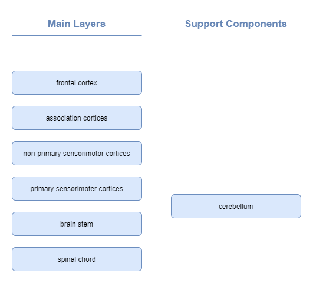
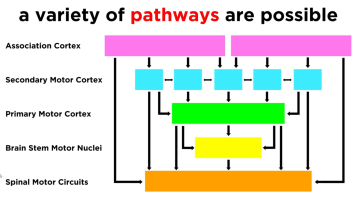
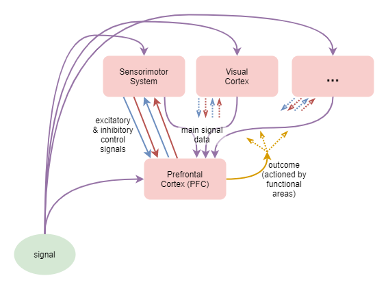
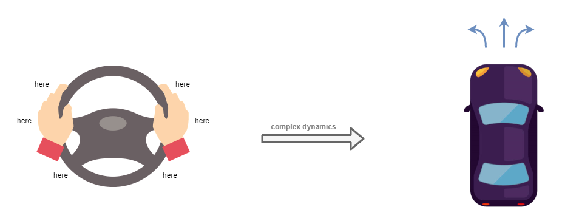

This page forms part of the [[Proto AGI v1]] series.

Here we shall review how the brain achieves its behaviours. We shall focus on both external behaviour (eg: that leads to physical motion) and internal behaviour (eg: thought). The purpose here is not to provide a complete or even accurate account of existing research. Rather, the purpose here is to identify principles that might need to be incorporated within an AI solution in order to build an AGI. Thus the content of this page is based on a mixture of neuroscience research, personal observations, and a careful selection of reasonable assumptions.

We will discover some important ways in which the current AI techniques of neural networks, reinforcement learning, and bayesian inferrence all fall short.

# Brain development

Brain size increases from birth, reaching full size at about 7 years. The number of neurons and quality of connections change drastically during that time too (Developmental Psychology, ch 4), as summarised in the following table:

|Age|Brain size as percentage of adult weight|Neuron development|
|---|---|
|0 months|25%|Most of 100 to 200 billion neurons present, but not fully mature, and with minimal myelin (fatty tissy around nerve axons, that help to increase the speed of transmission from one cell to another). Over next two years, brain undergoes proliferation of dendrites within cortex (thin outer covering of brain, involved with voluntary activity and thinking). |
|2 years|75%|Peak of cortex dendrites: a single neuron may have thousands of dendrites. Following this, neural pathways not used will be eliminated, and pathways in used will be made stronger.|
|6 years|95%|The prefrontal cortext (located behind the forehead) continues to grow and mature throughout childhood. Greatest myelin development occurs during first several years. |
|7 years|100%||
|13-18 years|100%|Prefrontal cortext experiences additional growth spurt. Experience shapes which connections are strengthened or lost, and by maturity about 40% of prefrontal connections are lost. This is the last part of the brain to mature, and eventually comprises 85% of total brain weight. Myelin levels reach maturity during this time.|

# Sensorimotor System

Approximate layers:

## Senses

(tbd)

## Motor Control

Motor control is governed by a number of layers, with increasing levels of abstraction (Neuroscience Online, s3):

|Layer|Responsibility|
|---|---|
|Level 1 - Spinal Cord|Contains motor neurons that control individual muscles. Governs rhythmic behaviours, such as walking. Ensures maintenance of balance and other safety actions through [_Reflexes_](https://en.wikipedia.org/wiki/Reflex). Reflexes elicit involuntary motion behaviours in response to stimuli, before the stimuli impulses even reach the brain. [_Primitive reflexes_](https://en.wikipedia.org/wiki/Primitive_reflexes) (a.k.a. infantile or newborn reflexes) are a subset that typically disappear as a child develops. A classic example of a reflex is the [_stretch reflex_](https://en.wikipedia.org/wiki/Stretch_reflex), which automatically contracts any muscle that feels a stretch, and is involved with maintaining balance.|
|Level 2 - Brain Stem|..|
|Level 3 - Motor Cortex|
|Level 4 - Association Cortex|

The motor cortex is further subdivided into a number of regions:

|Region|Responsibility|
|---|---|
|Primary Motor Cortex (M1)|Electrophysiological recordings have shown that the primary motor cortex homunculus appears to represent the movements of individual body parts, which often requires the coordinated activity of large groups of muscles throughout the body (Neuroscience Online, s3, ch3). In other words, the primary motor cortex homunculus does not map to the activity of individual muscles.|
|(more tbd)|..|

## Proprioception

* https://en.wikipedia.org/wiki/Body_schema
* https://en.wikipedia.org/wiki/Proprioception

Accuracy of motor control is coordinated through _proprioception_, which includes the senses of position and movement of limbs and trunk, the senses of effort, force, and heaviness, and the sense of balance. Alternatively, the term _kinesthesia_ is sometimes used when referring to just the sense of limb position and movement.

Proprioception is achieved through aggregation of direct senses and through mental tracking of limb position. It  depends on three distinct sources of feedback listed here highest priority first (Proske & Gandevia, 2012):
1. Muscle spindle fibres, tendon organs, and joints -- explicit proprioceptive senses
2. Skin
3. Vision

To summarise:
* "Proprioceptive sensations are mysterious because we are largely unaware of them. They are distinguishable from exteroceptors such as the eye and the ear in that they are not associated with specific, recognizable sensations. Yet, when we are not actually looking at our limbs, we are able to indicate with reasonable accuracy their positions and whether they are moving. Part of the explanation for this lack of identifiable sensations relates to the predictability of proprioceptive signals. We are aware that we are making a willed movement and so anticipate the sensory input that it generates. A general concept in sensory physiology is that what we feel commonly represents the difference between what is expected and what has actually occurred (e.g., Refs. 19, 86, 423). On that basis, if a movement goes to plan and there is no mismatch between the expected signals and those actually generated, no definable sensation is produced, yet the subject knows precisely the location of their limb. It is possible to generate an artificial proprioceptive signal using muscle vibration (159). Vibration produces sensations of limb displacement and movement, leading the subject to express astonishment at the unwilled nature of the sensations. This suggests that the will to move and the subsequent proprioceptive sensations are intimately linked." (quoted from Proske & Gandevia, 2012. section 1a).

In neurotypical individuals, vision feedback is only used for certain specific tasks requiring high accuracy. In deafferented individuals, where the sense from muscle spindle fibres is lost, vision can be used to replace the lost sense. However, this requires conscious control of movements, the movements are slower than normal, and are relatively short and simple due to the mental effort involved (Proske & Gandevia, 2012. section 4a).

The muscle spindle fibres etc. provide direct feedback on relative limb angles and movement, but not limb length or absolute position. The brain maintains a _body schema_ that aggregates all that information together along with learned parameters of the body shape and size, in order to track absolute limb position (Proske & Gandevia, 2012. section 4a). Studies have shown the this tracking is maintained even in the absense of visual feedback, and that predictive errors as much as 20 degrees can be induced in individuals through manipulation of muscle resting state (Proske & Gandevia, 2012. section 3).

Some theories suggest the existence of a separate _body image_, which holds more static information such as general capabilities, tracking of capability changes due to injury or amputation, and is implicated in body dismorphic syndromes. It is suggested that the body image is the cause of phantom limbs and anosognosia (Proske & Gandevia, 2012. section 4a).

## Sensorimotor Development

* https://en.wikipedia.org/wiki/Developmental_psychology

Piaget's theories on human child intellectual development come from the 1950s and 60s, and are still basically accepted today. They break development into four stages: _sensorimotor_, _pre-operational_, _concrete operational_, and _formal operational_. Sensorimotor development has six substages that build on top of each other (McLeod, 2019):
* **Reflex acts**: within first month of life, the neonate responds to external stimulation with innate reflex actions. For example, it will reflevively suck if a finger is brushed against its mouth or cheek. Piaget theorised that these are essential for bootstrapping sensorimotor learning.
* **Primary circular reactions**: from 1 to 4 months old, the baby will intentionally repeat pleasurable actions centred on its own body. Examples: wiggle its fingers, kick its legs, and suck their thumbs.
* **Secondary circular reactions**: typically from 4 to 8 months old, babies repeat pleasurable actions that involve objects as well as actions involving their own bodies. For example, shaking arattle for the pleasure of hearing the sound that it produces.
* **Co-ordinating Secondary circular reactions**: typically from 8 to 12 months old, babies show signs of an ability to use their acquired knowledge to reach a goal (ie: in contrast to simply prolonging interesting events). For example, it will reach out and knock to one side an object that stands in the way of it getting hold of the rattle.
* **Tertiary circular reactions**: from 12 to 18 months old, similar to secondary circular reactions, but actions are now intentional adaptations to specific situations. The infant who once explored an object by taking it apart now tries to put it back together. For example, it stacks the bricks it took out of its wooden truck back again or it puts back the nesting cups - one inside the other.
* **Symbolic/representational thought**: from 18 to 24 months old, babies learn to form mental representations of objects, enabling them to mentally visualise things that are not physically present. This is crucial to the acquisition of _object permanence_, which Piaget considered to be the most fundamental achievement of the whole sensorimotor stage of development. The symbolic substage is transitional to the pre-operational stage of cognitive development.

A couple of good writeups can be found on the [massey.ac.nz](https://www.massey.ac.nz/~wwpapajl/evolution/assign2/MH/webpage.htm), and [lumenlearning.com](https://courses.lumenlearning.com/suny-lifespandevelopment/chapter/piaget-and-the-sensorimotor-stage/) websites, including descriptions of the other stages.

## Corollary discharge and efference copy

These are two more or less synonymous terms with different histories. 

The basic premise is that the brain sends a copy of its intended motor command to secondary system that predicts the effect on the senses. This is used for example to counter the effect of eye or body movement on the visual image that we perceive. It is used to determine whether the observed change in image is caused by our own movement, or the movement of the scene. Vision is the only proven use of this mechanism, but it is believed that it may play a larger role throughout other systems within the brain. For example, one 2020 paper (https://journals.plos.org/plosbiology/article?id=10.1371/journal.pbio.3000639) focused on the amygdala and its management of emotions, suggested that the corollary discharge mechanism may be employed in how rewards are calculated by the brain. 

See:
* https://en.wikipedia.org/wiki/Corollary_discharge_theory
* https://en.wikipedia.org/wiki/Efference_copy
* http://www.scholarpedia.org/article/Corollary_discharge_in_primate_vision

# Memory

The kinds of memory in humans have been categorised in order to try to understand them. The categories are ([source](https://www.predictivesafety.com/blog/the-7-types-of-memory-and-how-to-improve-them)):
* Short-term Memory: memory that lasts for only about 20 to 30 seconds.
* Long-term Memory: memory that lasts longer than 30 seconds.
    * Explicit Memory: memories that you can consciously think about.
    * Implicit Memory: memories that you don't have to consciously recall

Within that categorisation, we have the following concrete forms of memory:
* Working Memory: a short-term memory
* Episodic Memory (aka Autiobiographical Memory): long-term explicit memory that stores experienced events. The details of events stored vary widely depending on the significance at the time, and on how often we access the memory. Eposidic memories are not stored in a literal form, but are reconstructed at the time of access. Episodic memories fade over time. 
* Semantic Memory: long-term explicit memory that represents general knowledge about the world. These are vey stable once learned, in contrast to episodic memories. Semantic memory declines only very slowly as we age.
* Procedural Memory: long-term implicit memory about how to do things. Better thought of as learned skill than a memory. eg: riding a bike, speaking a language.

Past theories had proclaimed that some or all of the above memories had specific brain regions primarily devoted to their storage. Increasingly that is shown to be false (Postle B. R., 2016). For example, it is now understood that upon recall of episodic memory, the past episode is _reconstructed_ through a distributed effort. If a memory included smell, vision, and physical activity, then the respective brain regions devoted to understanding smell, vision, and motion control are involved in reconstructing those aspects of the memory (_citation_).

Importantly, the same appears to be the case for working memory. Very little is understood how and where the brain retains the short-term temporary data required for thought. It is believed that the data is stored via recurrent networks - excitation that loops repeatedly for the duration of the data retention. Past theories claimed the Prefrontal Cortex (PFC) was the storage of working memory, but subsequent research has disproved this (Postle B. R., 2016).

# Executive Control

Biology does not build architectures with neat and discrete separations between components. Our understanding of how the brain processes information is still very limited. Contrary to past assumptions about functional specialisation, a growing body of research is revealing some aspects of how any given function is a result of interactions across multiple brain areas (Postle B. R., 2016). One area however, the Prefrontal Cortex (PFC), is still believed to play an more specific role: that of controlling overall behaviour for the "Central Executive" functions (Postle B. R., 2016).

Other research, in particular [Adaptive Resonance Theory (ART)](https://en.wikipedia.org/wiki/Adaptive_resonance_theory), has found and proposed the importance of synchronized cyclic behaviours. These are produced between higher and lower levels through mutual feedback loops controlled by excitatory and inhibitory signals going in both directions.

A plausible interpretation of all this is that: i) the biological architecture of the human brain creates behaviour through distributed processing across multiple regions; ii) the behaviour is also significantly governed by highly co-dependent cross-talk between those regions; iii) that no one region has full overarching control; and iv) that of the various regions involved in executive control, the PFC probably has slightly greater overarching control than the others.

This is depicted as follows:

# Examples

* Wilderbeast calves can [walk within minutes of their birth](https://en.wikipedia.org/wiki/Wildebeest#Breeding_and_reproduction). While many aspects of walking (muscle development, basic muscle control) can be developed while in the womb; there is no way that the complicated act of walking (coordinating motion, maintaining balance) can be learned from experience while in the womb. The systems involved with walking are very complex. Importantly, they cannot be governed by hard-wired basic signals - like for reflexes. They require the use of complex trained neural networks. Surely the only reasonable explanation here is that evolution has encoded the exact neural configuration (including synaptic strengths) into the DNA, for those systems that are required immediately upon birth.

# Building up a theory

## Low level motor control and senses

During fetal development, the mammallian brain does not know about the existence of its limbs, nor about how to interpret the senses it receives. As it does not know about the existence of its limbs, it cannot intentionally attempt to move them and to use the observed error to train itself. It's a classic _chicken-and-egg_ problem problem. So how to bootstrap learning about limb movement (ie: motor control) and sense interpretation?

One observation I made about my own child during their first few months is that their legs and arms flailed around a lot, seemingly without intent. Over time I observed that the flailing seemed to become more intentional. Eventually the flailing was altogether replaced by intentional controlled movement. It turns out that this flailing may have a definite purpose in bootstrapping development (citation needed), as it acts as a form of exploration of the motor control signal space, and simultaneously provides a source of data labelling to correlate with sense inputs.

(diagram: jitter -> motor control -> sense inputs -> train predictions)

In the diagram above, this provides a feedback loop where jitter on the motor control causes visual stimuli that in turn are used to train interpretation of the visual sense. For the fetus in a darkish and blurry womb, the visual stimuli are probably not going to be clear enough to form strong associative connections. But there is another feedback loop, involving the touch sense instead. We do not directly sense our muscle contractions, but the movement of mucles and tendons cause our skin to move, and thus we do observe touch senses as an indirect result of motor control. So that jitter -> motor control -> touch input feedback loop can be used to bootstrap learning in a similar way to sight. Additionally, it likely helps to build up the mental map of our body, forming tightly coupled relationships between muscle control and the touch sensitive areas of the body closest to the muscles.

And finally, after birth, the touch-based bootstrapping gets extended into vision and all the other senses.

## Layering of Motor Control

### Low-level motor control
It's pretty clear from our understanding of neuroscience that the primary motor cortex, in combination with cerebellum, and brain stem perform motor control functions at a low level.

(more tbd)

### Tool use
There's something interesting about the limitations of the above model when you consider it in the context of tool use. A good example is that of driving a car. The car is a tool with relatively simple controls but moderately complex behaviours (eg: the effects of speed and weight on how it corners; the delay in acceleration). In order to control this tool, we use our limbs. While driving, we rarely consciously examine the particular movements that we make to drive the car. Instead, our attention is focused on the environment and how the tool can be used within that environment. When we wish to turn the wheel a certain amount to the left, our ability to control the wheel is agnostic to the particular position of our arms, even though the position of our arms will lead to very different arm movements in order to achieve the same outcome (eg: left hand to pull up or down, depending on where it is at the time). Our mental control is operating at the level of the steering wheel, as if it was a limb.

One way of producing that outcome is through the use of bayesian modelling at the executive control layer. Where we would consciously examine our mental model of a car, including its steering wheel, and use that to decide how to move our arms in order to turn the wheel. But I don't think that's how it works -- the act of turning the steering wheel is too automatic. It's easy to drive a known route on auto-pilot: where we're off in thought about something else, and all we're consciously doing is to keep our eyes open and the automatic systems are doing the rest -- including steering.

Another option is that the human primary motor cortex, in conjunction with the cerebellum, is sufficiently advanced that it can learn these second order instructions with the same network. My hunch is that this isn't the case. For one reason, the architecture of our ML agent shows that the low level motor control network is specifically trained against direct motor control objectives (eg: moving an arm to a particular location), and cannot extend that to higher level abstractions (eg: turning a steering wheel through whatever means is convenient at the time).

What seems like a more realistic explanation is that there is an extra layer of indirection between executive control and the low-level motor control. One which operates at a medium-level representation, and which can plan limb movements based on high-level requirements like the examples above. Conveniently, neuroscience has uncovered just such a layer in the mammalian brain: the secondary motor cortex.

### Meta tool use
So let's assume the above is accurate enough. What happens if we attempt to take this one step further? Driving on a road with clear road signs, good conditions, and following a known route is quite a simple goal. What happens if we want to use a tool like that for a more complex goal. For example, driving a digger to shape land. The act of planning how to use the tool (the digger) to achieve a particular result is a third order problem. 

We've shown that low-level motor control (first order control), and tool use (second order control) can both be achieved without the involvement of executive control. Can a third order control requirement be achieved without executive control as well?

I think the answer here is that, to the largest extent, this is not possible. The desire to dig a hole in a particular place in front of you, requires you to intentionally move the digger arm down to the ground, and then scoop it back up again. This leverages the bayesian model of the digger and its behaviours in your conscious thought.

To some extent though, you can learn to do that on auto-pilot. The simple act of digging a hole is as repeatable a process as driving the car to your regular grocery store, and requires you to merely play out a well learned series of actions (on the tool). So there is an extent to which it becomes automatic, but still not entirely automatic. And this seems to fit with the lack of a tertiary motor cortex.

# References

Developmental Psychology, ch 4. Lumen Learning. https://courses.lumenlearning.com/suny-hccc-ss-152-1/chapter/physical-development/

McLeod, S. A. 2019, April 09. Sensorimotor stage. Simply Psychology. https://www.simplypsychology.org/sensorimotor.html

Neuroscience Online. Neurobiology & Anatomy, McGovern Medical School, University of Texas. https://nba.uth.tmc.edu/neuroscience/

Proske, Uwe; and Gandevia, Simon C. 2012, Oct. "The Proprioceptive Senses: Their Roles in Signaling Body Shape, Body Position and Movement, and Muscle Force". Physiological review. https://doi.org/10.1152/physrev.00048.2011 ([full text](https://journals.physiology.org/doi/full/10.1152/physrev.00048.2011)).