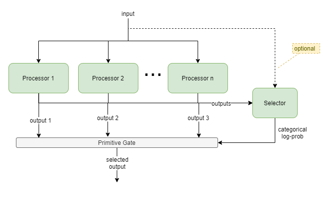
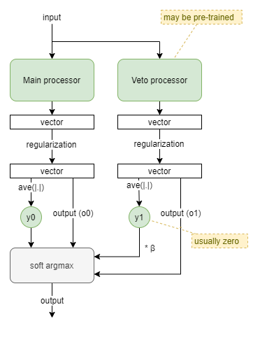
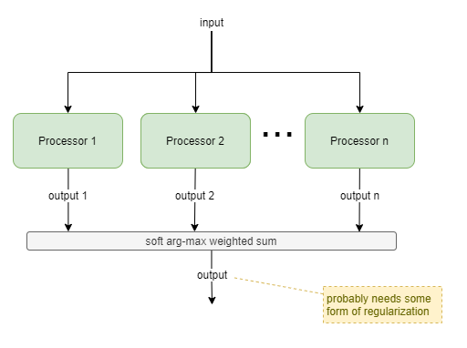

This page forms part of the [[Proto AGI v1]] series.

# Introduction
...tbd...

## Principles

* Distributed working memory
* Distributed control via mutual competition and cooperation, and shared learning.
* Reusable templates

# Templates

## Gated Output Selection

This template uses an active selection gate to enable the output to be chosen between two or more competing "processor" components. For example, selecting between the output from a habitual NN planner, and a bayesian model-based planner. The gate NN learns to choose which component produces the best output for different situations, and the competing components learn from each event regardless of whether they were involved.

### Processors
All processors must output same representation, but they can have different implementations. Eg: NN, bayesian inference engine, bayesian planning engine, decision tree.

### Selection
The Selector is a NN that outputs a vector of size `n` floats.

The Gate forwards the output via one of the following mechanisms:
* `argmax` across the selector output and using just that processor's output, or
* `softmax` across the selector output and using for weighted sum of processor outputs, or
* `log prob` frequency with probabalistic selection of processor output.

### Training
For NN processors, gradient descent against the gate's output will apply training pressure to the individual processor (or processors) that was used for the particular output at the time; however other processors will not receive training pressure (or have proportionately negligeable pressure). Thus, it is preferable to apply training pressure to each processor individually, regardless of whether it was used for the output.

Training pressure must also be applied to the final output, in order to train the Selector. 

### Variations
* Selection context: supply processor inputs to Selector too, to provide extra context to enable output selection.
* Certainty-based selection: processors updated to output certainty measure an addition to other data. Selector becomes a hard-wired primitive transformer from certainties into log prob category selection.
* NN-based Gate: combine Selector into Gate as a single NN. More flexible, but significantly adds to training dimensions because Gate now dynamically produces final output, rather than applying a simple deterministic selection.

If all processors are NNs and have no additional training pressure, then this subsystem can be replaced with a single NN.

## Vetoing Reflex

This template models a reflex processor with right of veto. It draws inspiration from biology to enable processors to indicate a level of _activation_ in their output, and then combines an always-active main processor whose output is usually used, with a usually-inactive veto processor that can take over when needed.

A _strength_, `y_i`, is determined from a processor output vector by taking the mean of vector component amplitudes (ie: `ave(|.|)`). The veto processor is given a boost in the form of a `β` multiplier against its strength. And then the final output is chosen as the soft-arg-max of the processor outputs (`o0`, `o1`), based on the weights `y0` and `β*y1`.

Some form of regularization will likely be needed to keep both processor outputs on the same scale.

### Learning
There are two pressures that need to be hard-wired for this architecture to work:
* The veto processor should be inactive most of the time so that it can specialise to reflex situations where it is needed. This can be achieved through pre-training.
* The main processor needs to be conservative with its signal strength, so that the veto processor has the strength to override it when needed. This can be achieved through regularization, and also through treating signal strength as equating to effort and penalising agent behaviours that employ more effort than needed.

### Variations
* `β` could be either hard-wired or a learnable parameter. Higher values mean that executive control cannot override the reflex.
* The veto processor is probably pre-trained and then not learnable during main agent learning. However, there may be ways for the veto processor to learn too.

### Mimicking biological neuronal signal strength
Biological neurons have both signal _value_ and _strength_, encoded in the form of spike trains with different frequencies, amplitudes, and inactive periods. In contrast, the typical usage of an AI neuron is that its output is interpreted as _value_ only. Another difference is that AI neurons output a value in range -ve to +ve, whereas biological neurons only output values in range zero through +ve values but may be interpreted as excitatory or inhibitory, depending on the physical structure.

AI neural networks can take inspiration from biological neuronal signal strength by treating a positive output as excitatory, a negative output as inhibitory, and a value close to zero as inactive.

### Mimicking biological veto mechanisms
In biology, a reflex machinism can be primarily inactive, but when needed it can emit a signal with high strength that supercedes any other signals. Additionally, a person can often consciously choose to override their reflex; the success of this depending on the specific reflex being overridden, and on training.

## Amplitude-based Selection

This template is a generalisation of the Vetoing Reflex solution. It uses relative signal strength from two or more processors, without any implied precedence. It would typically be used where multiple processors compete that have different architectures, different inputs, or different behavioural purposes. The later case requires that the processors are independently trained.

If all processors are the same, and differ only in random initialization values, then this simplifies to an ensemble model.

For each `i`-th processor, it's output `o_i` is a vector of length `m`, and the amplitude `a_i` of that output is calculated as `L1(o_i)/m` (ie: the average of absolute value of each component of the vector). Soft arg-max (typically referred to as just 'softmax') is applied to the amplitudes `a_0` ... `a_n`, producing weights `w_0` ... `w_1`: `w_i = e^a_i / Σ(e^a_j)`.

The softmax function provides a smooth way of switching between selecting just one processor output and combining the output of multiple processors. So, finally, the output is produced as: `Σ(w_i * o_i)`.

### Training
The softmax function allows some backpropagation from output to all processors. However that backpropagation is heavily attenuated for processors that produced low amplitude values. Best results will likely be achieved where some training pressure can be directly applied to each processor output.

## State
This template simply adds internal state to components, such as through the use of RNN components.

This can be used for useful behaviours such as:
* Priming - eg: where a Reviewer component is "primed" in past time steps to be biased towards a particular outcome.
* Distributed Working Memory - eg: inputs from other components is stored into the components local state, for use in subsequent time steps.

### Priming
Priming is an important feature for avoiding unnecessary reevalutions and improving reaction times. One suggestion of attention is that it is driven by expected value (Lindsay, 2020). It is computationally expensive to evaluate expected value across across multiple potential focuses and to make a selection from those evalutions. Thus unnecessary repitition of that evalution process must be avoided.

Priming enables the affected functional areas to retain focus without reevalution.

Priming also enables pre-evaluations to prepare (or "prime") functional areas for immediate response upon expected stimuli, shortening response times.

### Training
It is naively assumed that RL processes are sufficient to produce meaningful results. However, this remains to be seen. It is unlikely to be as affective as RNN in simple sequential data processing, where the RNN is trained against a high frequency of data.

## Evaluation Loop

Uses include:
* goal selection within [[Autonomous Monitoring and Control]] (AMC).
* planning

# Training Stages
...tbd...

# Future Enhancements

## Memoisation

Being able to remember recent computed results without having to recompute them.

## Attention

Plays into distributed WM, by enabling components to hold multiple items within their internal state, but only working on one or two at a time.

Plays into priming to avoid unnecessary reevalutions.

Reevaluations of attention triggered by predictive errors encountered between bottom-up and top-down attentional pressures. Consistent with ART.

## Conscious Feedback

With no centralised data channel, the nature of Conscious Feedback (CF) becomes clearer. [[Autonomous Monitoring and Control]] (AMC) requires a single unified view of brain activity so that it can monitor the trajectory that the activity takes, and take corrective action when necessary. Without a centralised data channel that represents the unified output of everything, CF performs a _summarising_ role. It must collect samples of activity from different brain regions, summarise them into a single unified state, and feed that into AMC.

# Anecdotes

## Solving a simple Maths Problem
I set myself a simple maths problem: to find the integer `?` that most closely solved `3 * ? = 27`. I intentionally constrained myself to a trial-and-error style approach.

My thought processes went like this:
1. The number `8` pops into my head.
1. I can't remember what `3 * 8` is, but I know that I'll know `2 * 8` so I first try to remember that: `16` appears.
1. I notice that there's a gap of `4` between `16` and `20`, which uses up half of the remaining `8`. That leaves another `4` to add to `20`, making `24` as the answer.
1. What number was I trying to reach again? `27`. Oh nice, `24` is pretty close to `27`, so `8` was a good guess.
1. Is `24` as close as I'm going to get to `27`? They seem pretty close, but maybe it's worth trying one more. (The idea of calculating the difference between `24` and `27` didn't cross my mind, as I had already primed myself to only consider trial-and-error.)
1. What was I trying to do again? `3 * ? = 27`. Right, I'll try the next number, `9`.
1. `3 * 9`? Don't remember. Ok, `2 * 9`? I remember `18`. Then I remember the trick with adding `9`s: each time I add `9` I simply jump to the next tens place and drop one. So, `18` ... `28` ... `27`. Oh wow, that's the number I'm trying to get.
1. Ok, quick, I must now review how I got here so I can write this down.

Some observations of the above:
* I had no logical reason to start with `8` as my first try. That number just appeared. Presumably it was generated from some heuristic prediction mechanism, as it was clearly very close.
* Assuming that functional areas hold their own working memory, then that same area must hold the original problem `3 * ? = 27`, along with the number being tried, e.g. `8`, while simultaneously working on the problem of how to calculate `3 * 8`. At the peak depth of calculation, that functional area could be holding as much as 5 layers of numbers and expressions: `3 * ? = 27`, `8`, `16`, `16 -> 20 = 4`, `4 remaining from 8`.
* Of all those numbers and expressions in working memory, only one or two are actively attended to at a time. While thinking about `2 * 8` I was no longer consciously aware of the original `3 * ? = 27` problem, or even of the `3 * 8` problem that I was partially solving via `2 * 8`.

Now, if each functional area holds WM that relates to it, we can see above that each functional area still needs to be available for other processing, even while holding onto its WM state. Could it be that each functional area has a little side storage for WM, and that attention mechanisms trigger the functional area to pull out specific values at certain times?

In the [biased competition theory](https://en.wikipedia.org/wiki/Biased_Competition_Theory) of attention (Desimone & Duncan, 1995; Beck & Kastner 2009; Turova and Rolls, 2019), attention is a biproduct of top-down biasing and bottom-up triggers. Additionally, there is some suggestion that competition for attention might be resolved within the targeted functional areas (Lindsay, 2020). I wonder, in the anecdote above, whether the maths functional area was the target of attention, or whether it was the source of the bottom-up claim for attention. In a decentralised system, perhaps any brain region can be the triggering source of activity. In which case, perhaps that functional area took "control" for a little while, continually firing signals into the rest of the brain indicating that there was a maths problem to focus on.

Of course, an open question affecting all this is how this supposed "maths functional area" is truly distributed within the brain, as it is unlikely to be a single focused brain region.

# References

Beck, D.M., Kastner, S. (2009). Top-down and Bottom-up mechanisms in biasing competition in the human brain. ‘’Vision Research, 49’’, 1154-1165.

Desimone, R., Duncan, J. (1995). Neural Mechanism of Selective Visual Attention. Annual Review of Neuroscience, 18, 193-222.

Lindsay, G. W. (2020). Attention in Psychology, Neuroscience, and Machine Learning. Front. Comput. Neurosci. 14:29. https://doi.org/10.3389/fncom.2020.00029.

Turova, T., Rolls, E.T. (2019). Analysis of Biased Competition and Cooperation for Attention in the Cerebral Cortex. Front. Comput. Neurosci. 13:51. https://doi.org/10.3389/fncom.2019.00051
