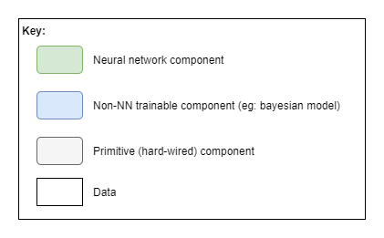
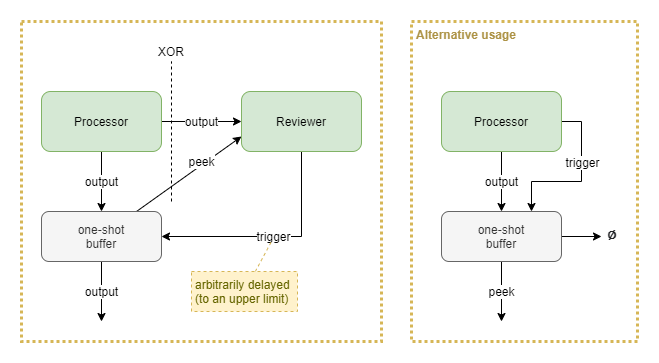
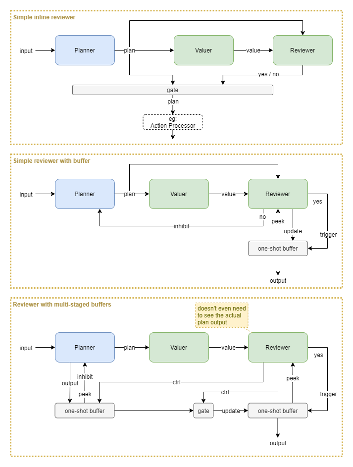
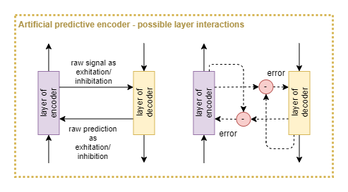
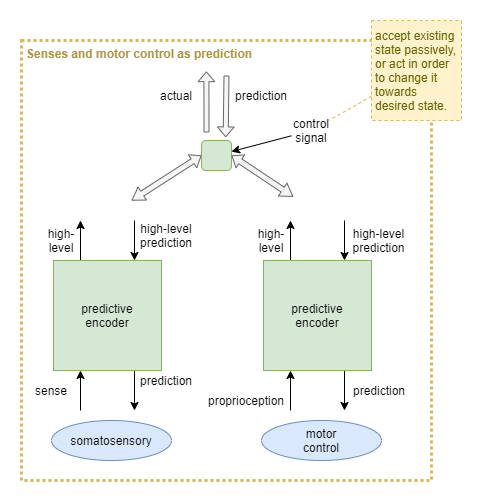
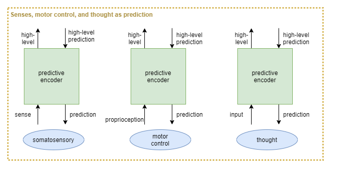
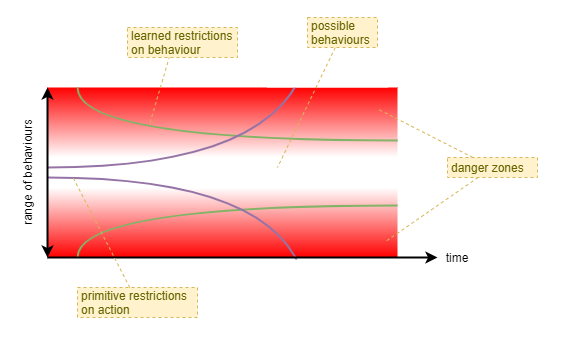

This page forms part of the [[Proto AGI v1]] series.

# Introduction

Our best understanding of the brain architecture today recognises that its behaviour is controlled via a mixture of bottom-up, top-down, and horizontal signals. That principle seems to apply most regions of the brain, both at large scales and at small scales. This is true even when considering the supposed higher-order control from the prefrontal cortex - it "competes" for control in the same way as everything else. In effect, the brain appears to operate as a decentralised system of smaller components that produce meaningful results through a finely tuned mixture of competition and cooperation.

This is a very different architecture to what we are experienced in producing within computers and AI. As such we have very little experience with creating such a decentralised architecture. The ideas discussed within the main [[Proto AGI v1]] pages would likely benefit from being discussed in the frame of a decentralised architecture. In particular, the ideas within [[Autonomous Monitoring and Control]] clearly need to be incorporated within a decentralised control system in order to emulate the kind of fully integrated control experience that we have as humans.

This page explores some ideas of how we can produce an AI architecture with decentralised control through competition and cooperation between components.

## Purpose

Unlike most other pages under the [[Proto AGI v1]], I don't necessarily intend to apply anything here. It's more of an exploration out of interest. Furthermore, it's likely too incomplete to be of use, and probably also too far removed from any theory based on biology or other AI research.

## Principles

The following principles are adhered to throughout the discussions here. These model assumptions about the organisation of the brain that we might be able to emulate.

**Distributed control**

* As much as possible, we try to eschew top-down control, and prefer behaviour that is the result of mutual competition and cooperation between components.

**Distributed working memory**

* Growing evidence suggests that the brain does not have a single shared region for storing "working memory" (Postle, 2016). Rather, it is likely that each region that focuses on a particular functional purpose encodes working state within its own circuts as recurrent loops. Further to this, the experience of having a "working memory" is likely the result of attention (see [Biased Competition Theory](https://en.wikipedia.org/wiki/Biased_Competition_Theory)).

**Reusable templates**

* It turns out that the solutions for specific use cases provide re-usable templates. So, rather than focusing on specific problems, this page focuses on those re-usable templates.

## Biological Plausibility

The approaches outlined here aren't necessarily biologically plausible. Rather, they are an attempt to step towards a biological plausible solution that draws inspiration from our current inderstanding, but is ultimately driven by the desire to produce something that we can implement using existing AI capabilities.

To become biologically plausible, we need a better understanding of the underlying mechanisms of the brain than we currently have. We need theories with the level of concrete detail such as proposed within the Thousand Brains Theory (Hawkins _et al_, 2019) and GLOM (Hinton, 2021). We need those theories confirmed. And then we can consider how the templates proposed in the sections below may be implemented in real biological fashion.

# Templates

Throughout the sections that follow, the following conventions apply:

## Gated Output Selection

This template uses an active selection gate to enable the output to be chosen between two or more competing "processor" components. For example, selecting between the output from a habitual NN planner, and a bayesian model-based planner. The gate NN learns to choose which component produces the best output for different situations, and the competing components learn from each event regardless of whether they were involved.

### Processors
All processors must output same representation, but they can have different implementations. Eg: NN, bayesian inference engine, bayesian planning engine, decision tree.

### Selection
The Selector is a NN that outputs a vector of size `n` floats.

The Gate forwards the output via one of the following mechanisms:
* `argmax` across the selector output and using just that processor's output, or
* `softmax` across the selector output and using for weighted sum of processor outputs, or
* `log prob` frequency with probabalistic selection of processor output.

### Training
For NN processors, gradient descent against the gate's output will apply training pressure to the individual processor (or processors) that was used for the particular output at the time; however other processors will not receive training pressure (or have proportionately negligeable pressure). Thus, it is preferable to apply training pressure to each processor individually, regardless of whether it was used for the output.

Training pressure must also be applied to the final output, in order to train the Selector. 

### Variations
* Selection context: supply processor inputs to Selector too, to provide extra context to enable output selection.
* Certainty-based selection: processors updated to output certainty measure an addition to other data. Selector becomes a hard-wired primitive transformer from certainties into log prob category selection.
* NN-based Gate: combine Selector into Gate as a single NN. More flexible, but significantly adds to training dimensions because Gate now dynamically produces final output, rather than applying a simple deterministic selection.

If all processors are NNs and have no additional training pressure, then this subsystem can be replaced with a single NN.

## Vetoing Reflex

This template models a reflex processor with right of veto. It draws inspiration from biology to enable processors to indicate a level of _activation_ in their output, and then combines an always-active main processor whose output is usually used, with a usually-inactive veto processor that can take over when needed.

A _strength_, `y_i`, is determined from a processor output vector by taking the mean of vector component amplitudes (ie: `ave(|.|)`). The veto processor is given a boost in the form of a `β` multiplier against its strength. And then the final output is chosen as the soft-arg-max of the processor outputs (`o0`, `o1`), based on the weights `y0` and `β*y1`.

Some form of regularization will likely be needed to keep both processor outputs on the same scale.

### Learning
There are two pressures that need to be hard-wired for this architecture to work:
* The veto processor should be inactive most of the time so that it can specialise to reflex situations where it is needed. This can be achieved through pre-training.
* The main processor needs to be conservative with its signal strength, so that the veto processor has the strength to override it when needed. This can be achieved through regularization, and also through treating signal strength as equating to effort and penalising agent behaviours that employ more effort than needed.

### Variations
* `β` could be either hard-wired or a learnable parameter. Higher values mean that executive control cannot override the reflex.
* The veto processor is probably pre-trained and then not learnable during main agent learning. However, there may be ways for the veto processor to learn too.

### Mimicking biological neuronal signal strength
Biological neurons have both signal _value_ and _strength_, encoded in the form of spike trains with different frequencies, amplitudes, and inactive periods. In contrast, the typical usage of an AI neuron is that its output is interpreted as _value_ only. Another difference is that AI neurons output a value in range -ve to +ve, whereas biological neurons only output values in range zero through +ve values but may be interpreted as excitatory or inhibitory, depending on the physical structure.

AI neural networks can take inspiration from biological neuronal signal strength by treating a positive output as excitatory, a negative output as inhibitory, and a value close to zero as inactive.

### Mimicking biological veto mechanisms
In biology, a reflex machinism can be primarily inactive, but when needed it can emit a signal with high strength that supercedes any other signals. Additionally, a person can often consciously choose to override their reflex; the success of this depending on the specific reflex being overridden, and on training.

## Amplitude-based Selection

This template is a generalisation of the Vetoing Reflex solution. It uses relative signal strength from two or more processors, without any implied precedence. It would typically be used where multiple processors compete that have different architectures, different inputs, or different behavioural purposes. The latter case requires that the processors are independently trained.

If all processors are the same, and differ only in random initialization values, then this simplifies to an ensemble model.

For each `i`-th processor, it's output `o_i` is a vector of length `m`, and the amplitude `a_i` of that output is calculated as `L1(o_i)/m` (ie: the average of absolute value of each component of the vector). Soft arg-max (typically referred to as just 'softmax') is applied to the amplitudes `a_0` ... `a_n`, producing weights `w_0` ... `w_1`: `w_i = e^a_i / Σ(e^a_j)`.

The softmax function provides a smooth way of switching between selecting just one processor output and combining the output of multiple processors. So, finally, the output is produced as: `Σ(w_i * o_i)`.

### Training
The softmax function allows some backpropagation from output to all processors. However that backpropagation is heavily attenuated for processors that produced low amplitude values. Best results will likely be achieved where some training pressure can be directly applied to each processor output.

## State

This template simply adds internal state to components, such as through the use of RNN components.

This can be used for useful behaviours such as:
* Priming - eg: where a Reviewer component is "primed" in past time steps to be biased towards a particular outcome.
* Action simulation - eg: via primed decision to not execute actions.
* Distributed Working Memory - eg: inputs from other components is stored into the components local state, for use in subsequent time steps.

### Priming
Priming is an important feature for avoiding unnecessary reevalutions and improving reaction times. One suggestion of attention is that it is driven by expected value (Lindsay, 2020). It is computationally expensive to evaluate expected value across across multiple potential focuses and to make a selection from those evalutions. Thus unnecessary repitition of that evalution process must be avoided.

Priming enables the affected functional areas to retain focus without reevalution.

Priming also enables pre-evaluations to prepare (or "prime") functional areas for immediate response upon expected stimuli, shortening response times.

### Training
It is naively assumed that RL processes are sufficient to produce meaningful results. However, this remains to be seen. It is unlikely to be as affective as RNN in simple sequential data processing, where the RNN is trained against a high frequency of data.

## One-shot Buffer

The purpose of the one-shot buffer is to grant an associated reviewer component the time to make a decision, in contrast to having to draw a conclusion "in line" with the output signal from the source processor.

Upon receiving a trigger signal, the buffer emits whatever last vector it received from the processor above, and then forgets the state. The buffer likely also forgets state after some expiry period. Trigger signals have no effect if there is no state stored within the buffer.

### Variations
* The reviewer may act upon the initial output from the source processor, which only occurs at the moment that processor produces the output. Alternatively it may "peek" the one-shot buffer's current state - which will remain constant for a period provided that no new output is emitted from the source processor.

* An alternative usage is to use the "peek" output as the primary output signal that feeds into subsequent processors. This turns it into a gated persistent buffer. The source processor "clears" the buffer by sending a trigger signal and having the buffer send its main output to nothing.

## Evaluation Loop

This template builds on others to create a complex behaviour involving a planner (may not be a NN) proposing a series of possible plans that are each reviewed until one is accepted. The template assumes an overarching iterative execution. The plans could be anything, including fine-detailed time-step by time-step actions, goal states, trajectories; however high-level plans such as goal states are likely to provide better abstractions than low-level motor control actions.

Uses include:
* goal selection within [[Autonomous Monitoring and Control]] (AMC).
* planning

### Variations

Some variations include:
* Simple inline reviewer: all processing happens in a single time step. No mechanism to handle longer running valuer or reviewer processes that may require iterations. No mechanism for inhibiting the planner from producing the same result again.
* Add a buffer: now the reviewer can copy a one-off output from the planner into a buffer and review that multiple times over several iterations. Additionally, the planner can be inhibited from producing the same output again. Requires that the reviewer takes quite an active role in shuffling data around, without accidentally changing that data (eg: inhibition signal).
* Multi-staged buffers: this takes advantage of primitive gates and buffers so that the reviewer only has to send binary control signals. The planner outputs into a buffer that subsequently immediately inhibits that same output from being generated again. The data from that buffer is only released upon a control signal from the reviewer. Additionally, the reviewer controls a gate and chooses whether to allow the planner's output to move to the output buffer. The exact mechanics of this pattern may require some further finessing, but the basic idea could prove useful.

# A Review of Auto-Encoding

Within the _Distributed Architecture_ section of [[Biological basis for proto AGI]], I suggest how the theories of predictive coding, replicated units, and distributed collaboration through competition create a unified model of neocortex architecture.

This suggests a need to review the design of auto-encoders within ANNs.

ANN auto-encoders generate a prediction error at the last layer of the decoder block, and use backpropagation to train all other layers. In biological predictive coding, the encoder and decoder work in parallel. At each layer, the decoder produces a prediction and an error signal from the encoder inhibits false prediction output. So biological predictive coding produces error signals at each individual layer, rather than only at the final output, and thus produces more detailed error signals.

Now put that into context with hebbian learning: the idea that correlated activity between pairs of neurons increases the firing efficiency of the synapse; or, in other words, increases the connection weight. If a neuron within the prediction pathway produces a false output, the signal's strength will be subsequently reduced through an additional inhibitory input from the encoding pathway. If on average the neuron tends to produce false output and is inhibited, then over time its synaptic weight should be reduced. Conversely, the synaptic weight should increase over time if it tends to produce accurate results. Additionally, the same effect should apply to the decoder pathway.

In effect, the pairing of encoder and decoder pathways produce similar signals to that of backpropagation. This suggests that an ANN autoencoder with backpropagation learning is analogous to predictive coding combined with hebbian learning. This is backed up by a small amount of research in the area (Marino, 2020; Melchior & Wiskott, 2019).

For further research:
* structure of excitation and inhibition networks in brain
* look at the model used by research that simulated 10hz waves (Ananthaswamy, 2021).
* there must be more research comparing autoencoders with predictive coding networks.

## Predictive Encoder
For the purpose of use as an ANN, let's propose a modified version of an auto-encoder, that we shall refer to as a _predictive encoder_.

Some variables remain to be refined:
* Is an error signal computed as the difference between encoder and decoder pathways? Or is the encoder output merely fed directly into the decoder?
* Assuming an error signal is computed, which side does the computation? (Knowledge of excitation/inhibition circuits in the brain may give advice on this).
* Are lateral connections purely horizontal (ie: between same layers), diagonal (ie: between diagonally adjacent layers), or a mixture of both?
* How to resolve the timing problem of ordering between bottom-up and top-down signals? (Some inspiration can be taken from models of the 10hz waves (Ananthaswamy, 2021), but that may not be sufficient).

## Motor control via predictive-encoders

It has been suggested that all somatosensory regions have both sense input and motor output (Hawkins, 2018). What if these are all architected as predictive coding networks? What might this look like as an ANN solution using predictive encoders?

For example, the theory of _active inference_ re-frames motor control as "descending proprioceptive predictions" ([wikipedia](https://en.wikipedia.org/wiki/Predictive_coding#Active_inference)).

## Executive control thought via predictive-encoders

If somatosensory regions can all be explained as predictive coding networks, then what about executive control, aka _thought_? It is harder to conceive of what exactly the sense inputs and predictions are, but it seems likely that executive control is indeed a predictive coding network.

Thus, somatosensory, proprioceptive, and _cerebro_ceptive systems would be treated as three prongs of a repeated high-level architecture:

## Challenges

Predictive coding theory is not yet proven. For a good discussion of challenges, see [wikipedia](https://en.wikipedia.org/wiki/Predictive_coding#Challenges).

# Future Enhancements

## Memoisation

Being able to remember recent computed results without having to recompute them.

## Attention

Plays into distributed WM, by enabling components to hold multiple items within their internal state, but only working on one or two at a time.

Plays into priming to avoid unnecessary reevalutions.

Reevaluations of attention triggered by predictive errors encountered between bottom-up and top-down attentional pressures. Consistent with ART.

## Conscious Feedback

With no centralised data channel, the nature of Conscious Feedback (CF) becomes clearer. [[Autonomous Monitoring and Control]] (AMC) requires a single unified view of brain activity so that it can monitor the trajectory that the activity takes, and take corrective action when necessary. Without a centralised data channel that represents the unified output of everything, CF performs a _summarising_ role. It must collect samples of activity from different brain regions, summarise them into a single unified state, and feed that into AMC.

## Primitive Behavioural Limitations

If you were to place a completely untrained AI network into a fully formed robot, you would not like the result. It would thrash around wildly smashing into things, and probably damage itself in the process. Researchers who train with robots usually either work in very constrained problem spaces, or employ a simulated environment for the earlier stage of training.

Biological organisms don't have such a luxury, but they have evolved different mechanisms to prevent immediate injury or death from the effect of an untrained neural network. There are probably a number of such mechanisms at play. Some include:

* Limited strength
    * An infant's muscles have very limited strength. Consequently, they are not mobile, and they cannot hurt themselves through self infliction. This also makes it easier for the infant's parents to care for it, as they can overpower it with ease.
* Flexible joints
    * It's joints are initially very flexible, as the bones remain soft in infants and some of the joints are just a very soft form of cartilage. 
* Staged brain development
    * Not all capabilities of the brain are "switched on" initially. It is well accepted that the brain undergoes stages of development, with different regions of the brain "maturing" at different rates, with some taking 2 or 3 decades to reach full maturity. For example, some aspects of the so called "[executive functions](https://en.wikipedia.org/wiki/Executive_functions)", that enable an individual to maintain self-control, are believed to only begin developing during adolescence.
    
When considering the development of a neural-network based intelligence, with only one life, it is clear that a mechanism (or multiple) is required to limit its initial behaviours. As its neural-network is trained and becomes more reliable, those limitations can be gradually relaxed - and they likely need to be relaxed in order to enable the network to learn from mistakes. Eventually, the neural-network should be sufficiently trained that it can proved a more accurate and trustworthy force for behaviour limitations and avoidance of injury or death than the presumably simplistic primitive mechanisms that may have initially protected it.

A second important benefit of behaviour limitation during early stages is to improve training efficiency by a reduction in search space. With a large neural network the search space is tremendous. By initially narrowing the range of behaviour the agent first learns behaviours that have a greater long term benefit. In biology, it is effectively a way of combining evolutionarily gained experience with the training experience of an individual - evolutionary forces find the optimimum initial narrow range of behavour and the optimimum rate at which those limitations should be relaxed.

A cooperative-competitive style of decentralised control is likely to lead to far greater initial chaotic behaviour than a neural-network based on centralised control. Thus, some such mechanism may need to be considered, particularly if wishing to produce a single-lifetime learning agent.

For example, the ability to choose between performing physical actions or just simulating them could lead to a suboptimal training path during initial stages when the agent needs to learn about its body through physical actions. During the early stage of training it could be beneficial to somehow disable the simulation of actions - or at least bias away from simulation.

# References

Ananthaswamy, A. (2021). Psychedelics open a new window on the mechanisms of perception. Knowledgable Magazine. \[[Website](https://knowablemagazine.org/article/mind/2021/psychedelics-open-new-window-mechanisms-perception)\]

Beck, D.M., Kastner, S. (2009). Top-down and Bottom-up mechanisms in biasing competition in the human brain. ‘’Vision Research, 49’’, 1154-1165.

Desimone, R., Duncan, J. (1995). Neural Mechanism of Selective Visual Attention. Annual Review of Neuroscience, 18, 193-222.

Hawkins, J. (2018). Location, Location, Location - A Framework for Intelligence and Cortical Computation. Johns Hopkins APL Colloquium Series. \[[Video](https://numenta.com/resources/videos/jeff-hawkins-johns-hopkins-apl-talk/)\]. \[[Slides](https://www.slideshare.net/numenta/location-location-location-a-framework-for-intelligence-and-cortical-computation)/]

Hawkins, J., Lewis, M., Klukas, M., Purdy, S., Ahmad, S. (2019). A Framework for Intelligence and Cortical Function Based on Grid Cells in the Neocortex. Front. Neural Circuits 12:121. https://doi.org/10.3389/fncir.2018.00121

Hinton, G. (2021). How to represent part-whole hierarchies in a neural network. ArXiv. https://arxiv.org/abs/2102.12627.

Lindsay, G. W. (2020). Attention in Psychology, Neuroscience, and Machine Learning. Front. Comput. Neurosci. 14:29. https://doi.org/10.3389/fncom.2020.00029.

Marino, J. (2020). Predictive Coding, Variational Autoencoders, and Biological Connections. https://arxiv.org/abs/2011.07464

Melchior, J., Wiskott, L. (2019). Hebbian-Descent. https://arxiv.org/abs/1905.10585

Postle, B. R. (2016). How does the brain keep information "in mind"?. Current directions in psychological science, 25(3), 151–156. https://doi.org/10.1177/0963721416643063.

Turova, T., Rolls, E.T. (2019). Analysis of Biased Competition and Cooperation for Attention in the Cerebral Cortex. Front. Comput. Neurosci. 13:51. https://doi.org/10.3389/fncom.2019.00051

