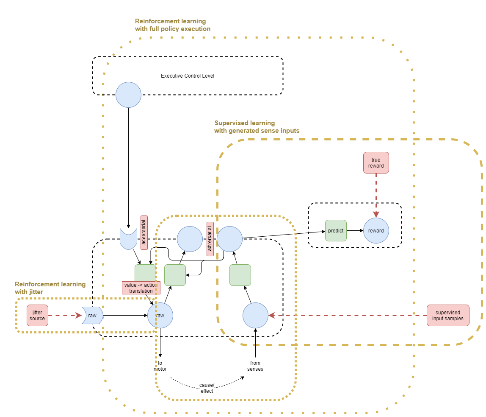

Using [[A Theory of Consciousness]] as the basis, this page attempts to build up a design what is hoped to be the basis for an artificial general intelligence.

....
work in progress
....

# Overview

# Training

Repeated cycles of the following sequence of training:
* RL of Level 1 with jitter as input
* Supervised Learning (SL) of Levels 1 + 1b with generated sense inputs
* RL of whole network with jitter against executive control output (?)
* RL of whole network with full policy execution

# Mental Models

## Background discussion on kinds of model
In the combined context of AI and human brains, there are three kinds of level of "model", with different representations:
* Model Free Policy Networks - Used in reinforcement learning to predict best action given a state
* Model Based Policy Networks - Used in reinforcement learning to predict future state given an action
* Mental Models - The ideas that humans build up about themselves and about the world around them that are used to inform decisions.

While "mental models" may seem to be something completely different to the models used in AI reinforcement learning, there is perhaps a way that mental models fit naturally into that grouping.

Bayesian networks have been studied for many years because they would seem to emulate some of the characteristics of how humans form theories about the world. Their use has often failed when applied to low-level learning of the sort that is now done with deep neural networks. But they are a good fit for higher-order "mental models".

So, the theory proposed here is that the brain uses different structures for different layers and different tasks, that are roughly split into the following:
1. Model Free Policy Networks - Slowest learned best actions given current state and a goal
2. Model Based Policy Networks - Medium-speed learned predictions of next state given current state and action
3. Bayesian Network Models - Generated, manipulated, and used by high-order thought to help inform decision making.

## Bayesian modelling engine
The assumption for now is that there is some other system that is used for creating bayesian models.

Assumed characteristics are:
* Triggered: created when from some sort of event triggers identification of the need for a new model.
* Modified: built up and refined over time as more co-factual and counter-factual examples are observed. 
* Recursively Composed: each model is built up from other models with a new layer added. Eg: a car has a wheel.
* Introspection: We can inspect individual parts of a model, but this is probably due to the composition structure. ie: it's likely that we cannot inspect within a model, but that we can observe at the interface of each of the composed parts.

## Bayesian models for goal decisioning
I suspect that bayesian models are fundamental to the advanced goal decision making of general intelligence. This also fits with the fact that humans are so easily misguided in their goals - humans target ill-conceived ideas of self-value based on cultural expectations. Eg: one person may prefer to shop at the cheapest stores in order to spend less money, while another may prefer to shop at the most expensive stores because of the social status of that store or its products.

## Outstanding questions
* How to make this work in practice?
* Assuming "bayesian modelling engine" is separate, does main executive control network need to re-learn how to use the bayesian models as they are refined? For example, a baby with no bayesian models could not learn to use those models until _after_ it had formed some initial models. Then as the models get more advanced, it'd probably need to re-learn again to fully use the more advanced aspects of the models. At some point it'd presumably reach a point where it knows how to work with any new kind of bayesian model already.
* Are bayesian models used in lower level layers too or just within the executive control layers?

(Added 2021-02-03. Labels: work-in-progress)