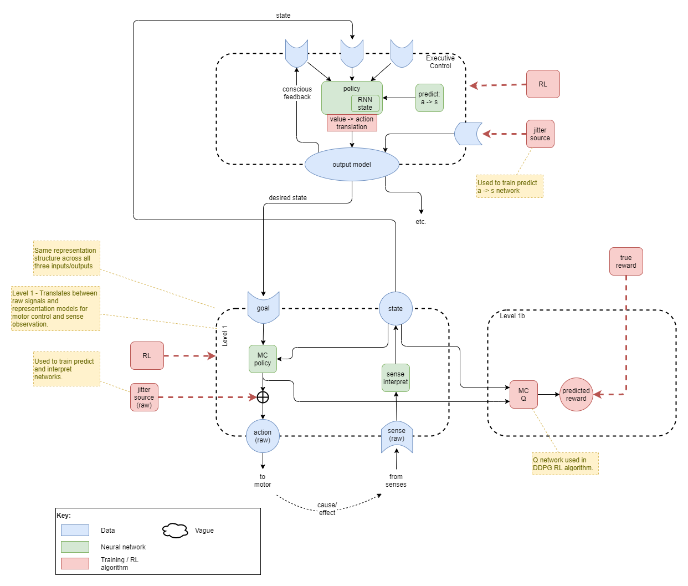
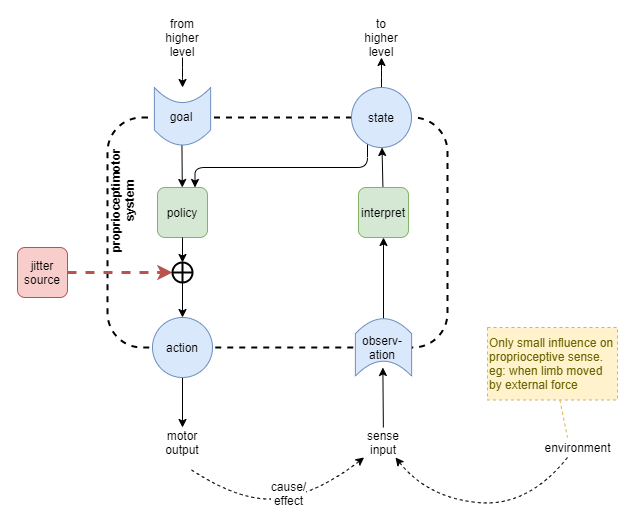

Can we use our best current understanding of neuroscience to inspire AI architectures that could form an artificial general intelligence (AGI)? This page attempts to do that. It uses the results of [[A Theory of Consciousness]] as the overarching guide, along with additional biological influences. Also see [[Biological basis for proto AGI]] for some further background to the design here.

# Overview

First, for a bit of fun, this is the complete architecture. In the sections that follow, this shall be broken down and the rationalisation explained in detail.

## Training

Repeated cycles of the following sequence of training:
* RL of Level 1 with jitter as input
* Supervised Learning (SL) of Levels 1 + 1b with generated sense inputs
* RL of whole network with jitter against executive control output (?)
* RL of whole network with full policy execution

# Building up Architecture
## Low level motor control
Mammals don't learn motor control through external rewards; they learn it through watching and observing. And through _jitter_ - in the early stages of development randomly fired muscle signals cause the ligaments to move (citation needed), and the senses are used to pick up the result (particularly touch + vision). This is likely fundamental in bootstrapping a number of brain circuits. For our solution, this will be used to bootstrap the learning of two networks:
* motor control
* sense interpretation

Start with randomly initialised policy and sense interpretation networks. Random jitter (noise) is injected into the raw motor control signal. This causes movement that affects the sense inputs and an update of the state. 

For the moment we'll ignore how the sense interpretation network is trained and focus on the motor control policy. Jitter induces an action `a`, which leads to an observed state `s'` one time step later. This forms an trainable observation that `a` lead to `s'`. Now, for context, action `a` occurred at time `t` where the state observation was `s`. So we can now collect a series of observations of the form:

    p(s'|s,a)

We could use that to learn a predictive model of the sort that is used in model-based RL algorithms. But model-based RL algorithms are cumbersome, and require a planning engine - which doesn't seem to make sense for the most low-level motor control. So we turn the observation on its head and use it to learn the action given an initial state `s` and a goal `g`. If we force that `g` uses the same representation as states, then we can train with `g=s'`. So, instead we build a network on the form here, and use supervised learning on the observations:

    p(a|s,g)

Now, there are a few gotchas here.

1. Under the rules of probabilities, you cannot flip from `p(s'|s,a)` to `p(a|s,s')` without incorporating some a-prioris about `p(s')` etc.. In practice our approximation will be good enough given that we are only using this to bootstrap learning and we will use other processes to smooth out the errors.

2. Jitter only enables us to observe `s'` for time `t+1`. But when we come to use this policy, goal `g` is quike likely only reachable at some `t+i` where `i > 1`, and our network hasn't received any training for that. For now we'll gloss over that issue with a foolish assumption that our network will generalise well enough to make reasonable guesses for the action at time `t` under those conditions. In the next section we'll use RL to train for `i > 1`.

3. Even given that assumption, it is likely that we'll run into problems of overfitting causing bad guesses. The problem is that our network capacity is significantly higher than is needed for the sparse data received so far. In humans, the initial bootstrap learning likely occurs while the brain is still developing and is much smaller than its eventual size. Thus it has less neurons to overfit with and will generalise better. In current ML, we always use fixed size networks, so we will probably need to resolve the overfitting problem here somehow.

4. In mammals, motor control is triggered by the primary motor cortex, but the exact sequencing, timing, and coordination with other movements is governed by the cerebellum. Exactly how that occurs is still unknown. For now we'll build all of that into our one policy network.

5. In mammals, the lowest level feedback-based sensorimotor development is probably further segregated into its independent modalities: muscle control and muscle senses learned against each other independent of other senses. The vision sense can only be incorporated into that circuit at a much higher level, where it can make sense of the differences when looking at the arm vs looking elsewhere.

## Reinforcement learning for low level motor control
Now we use RL to train the motor control policy (MC policy) for trajectories that best lead towards goal states. We'll use the current agent's state representation for the goals, so we do not _a priori_ know the parameters of the reward function. We must use data collected from the current policy, or at least near to it. During the training runs in the prior section, we'll collect the full unbroken trajectory within a sequential data buffer `D = (d1, d2, d3, ....dN)`, where `di` is the tuple of data taken at time `t`:

    (e,s,a,e',s')
    
where:
* `e` and `e'` are the true environment states at time `t` and `t+1`
* `s` and `s'` as before are the state representations at time `t` and `t+1`
* `a` is the action taken at time `t`.

We'll now sample from that buffer to produce (`e,g`) tuples for training: starting states and goals. There's a few ways of choosing these. The simplest is to pick a fixed number of `w` at random, separately a fixed number of `s'` at random, and to pair them up. We don't know how hard it is to get from any such `w` to `s'`, but we'll assume it's always achievable under the dynamics of a safe bootstrap training environment.

An alternative would be to randomly sample short sub-trajectories from `D` of some random length with (with a maximum length of say 10), and then to use the first event in each sub-trajectory as the initial environment state, and the last `s'` as the goal. This would definitely produce trajectories that we know are achievable within a short action length, but provide less exploration for our RL algorithm, so we'll use the first simpler approach for now and see how it goes.

We'll assume that any goal can be achieved within some reasonable maximum trajectory length, `n`, with say 10 steps. This seems a reasonable starting point, as any simple limb task is usually carried out very quickly.

We'll now run the agent under RL training conditions. For each of the training tuples selected above, we'll initialise the environment to `e`, fix the goal to `g`, and then allow the agent to run for a maximum of `n` steps. Our reward function will encourage the agent to achieve a state output that matches the goal sometime within that maximum trajectory length, but also to prefer achieving it sooner rather than later. For each run, we'll pick the state output `s(t+k)` that is closest to the goal `g`, and reward it based on how closely that state output matches the goal, and additionally discount based on how many steps it takes to achieve that best outcome. For the error measurement, we'll just pick something simple and convenient, such as RMSE. There are some more advanced "hard-wired" rewards that we might build into that too at a later time - see the section below on _Internalised Reward_.

As our policy network produces deterministic continuous actions, we'll use the [Deep Deterministic Policy Gradient (DDPG))](https://spinningup.openai.com/en/latest/algorithms/ddpg.html) algorithm for training.

The RL learning discussed here will be alternated with the jitter and supervised learning discussed above. Thus, the low-level MC policy will accurately learn `p(a|s(t),s(t+i)` for all of `1 <= i <= n`.

## Low level state representation
How do we train the state representation?

In the complete architecture, the state representation will be used as input to highel level executive control networks. It represents abstract features that the higher level network will decide how to use. Thus we don't expect it to have any direct relationship to the external environment and cannot train the sense interpetation network directly. In practice, provided it is initialised with random weights, its initial configuration will provide a meaningful usefulness of representation even without training. This is known as _reservior computing_, and its usefulness is proven and leveraged further in the theory of [Extreme Learning Machines](https://en.wikipedia.org/wiki/Extreme_learning_machine).

We may wish to apply some tuning pressure to the state representation in order to achieve some goals and alleviate some concerns:
1. Training of other networks in the agent will become trivial if the state representation is a constant zero output, so there may be pressure to tune towards that outcome unless we counteract it.
2. We don't yet know what kind of information the high level networks will require, so we have only a vague notion that the state representation needs to be useful. This can be clarified a little by stating that it must produce a high contrast of outputs for highly different inputs. We paraphrase this vague requirement as requiring the representation to have _high saliency_.

As a first step towards providing some tuning pressure, we could setup a sort of adversarial network architecture. From the raw action output, we could train an extra network to predict the expected state on the next time step, and we could compare the outputs between those two networks. We might use RMSE and apply half the loss to each network for training. We could probably improve this further by calculating a loss that specifically measures contrast or saliency of the output; for example, perhaps the 'gram matrix' used in the [neural style transfer](https://www.tensorflow.org/tutorials/generative/style_transfer) TensorFlow tutorial could help here. See Option 1 in diagram below.

In practice, this approach probably wouldn't give us much. Furthermore, assuming that the networks are randomly initialised with a distribution having mean zero, the shared loss will on average encourage both networks towards zero.

Another approach could be to use the state representation as input to predict the reward received, and to use supervised learning to train a Q network with backpropagation into the state interpretation network. The intuition here is that it will ensure that the state representation has sufficient saliency for accurate reward prediction. See Option 2 in diagram below. The problem is, in the prior section, our choose was to reward based on the current state representation. So it doesn't add anything that isn't already there.

One way of solving this could be to slightly change the RL training in the section above. Instead of rewarding based on the state output, we could reward based on the actual limb positions that were observed during data collection. Then our state to reward prediction network has something more meaningful to learn. Also, this would seem to be a better reward function overall: it is more aligned with the actual goal of training the motor policy to control the limbs to reach a desired outcome, and it is less dependent on changes in state representation. The problem is that, under the current architectural framework, the implementation of this reward function depends more on external computation so cannot be internalised into the agent's online self-learning.

Some experimentation will be required here. For now, we'll work on the assumption that the sense interpretation network acts as a _reserviour_, and doesn't need training.

# Next Ideas

## Mental Models

### Background discussion on kinds of model
In the combined context of AI and human brains, there are three kinds of level of "model", with different representations:
* Model Free Policy Networks - Used in reinforcement learning to predict best action given a state
* Model Based Policy Networks - Used in reinforcement learning to predict future state given an action
* Mental Models - The ideas that humans build up about themselves and about the world around them that are used to inform decisions.

While "mental models" may seem to be something completely different to the models used in AI reinforcement learning, there is perhaps a way that mental models fit naturally into that grouping.

Bayesian networks have been studied for many years because they would seem to emulate some of the characteristics of how humans form theories about the world. Their use has often failed when applied to low-level learning of the sort that is now done with deep neural networks. But they are a good fit for higher-order "mental models".

So, the theory proposed here is that the brain uses different structures for different layers and different tasks, that are roughly split into the following:
1. Model Free Policy Networks - Slowest learned best actions given current state and a goal
2. Model Based Policy Networks - Medium-speed learned predictions of next state given current state and action
3. Bayesian Network Models - Generated, manipulated, and used by high-order thought to help inform decision making.

### Bayesian modelling engine
The assumption for now is that there is some other system that is used for creating bayesian models.

Assumed characteristics are:
* Triggered: created when from some sort of event triggers identification of the need for a new model.
* Modified: built up and refined over time as more co-factual and counter-factual examples are observed. 
* Recursively Composed: each model is built up from other models with a new layer added. Eg: a car has a wheel.
* Introspection: We can inspect individual parts of a model, but this is probably due to the composition structure. ie: it's likely that we cannot inspect within a model, but that we can observe at the interface of each of the composed parts.

### Bayesian models for goal decisioning
I suspect that bayesian models are fundamental to the advanced goal decision making of general intelligence. This also fits with the fact that humans are so easily misguided in their goals - humans target ill-conceived ideas of self-value based on cultural expectations. Eg: one person may prefer to shop at the cheapest stores in order to spend less money, while another may prefer to shop at the most expensive stores because of the social status of that store or its products.

### Outstanding questions
* How to make this work in practice?
* Assuming "bayesian modelling engine" is separate, does main executive control network need to re-learn how to use the bayesian models as they are refined? For example, a baby with no bayesian models could not learn to use those models until _after_ it had formed some initial models. Then as the models get more advanced, it'd probably need to re-learn again to fully use the more advanced aspects of the models. At some point it'd presumably reach a point where it knows how to work with any new kind of bayesian model already.
* Are bayesian models used in lower level layers too or just within the executive control layers?

## Building up to a Higher-order motor control

The current design of the low-level motor-control/sense component will tend to use a fairly low-level representation at its interface to the layer above. This is because i) it runs on a 'reservoir' theory and thus has minimal training pressure to modify its representational level, and ii) it is trained on instantaneous sense inputs without time-sensitive context (ie: it will represent motion at level of "arm is moving up at speed x"). And the goal input to the low-level will have that same level of representation.

Thus, the low-level will not learn medium level representations like "move arm towards mouth in eating position". This fits well with observations from brain stimulation in monkeys.

To build up a higher level system, we need to enforce a higher level of representation. One component of that likely comes via a _body map_. Inherently it must have some characteristics that force an optimum representational level, and that must apply a pressure to the level that it actually learns and outputs.

Another aspect of the system is that it is made up of many many neural net layers stacked on top of each other. From raw sense input up to executive control, each layer _integrates_ the data from below into a slightly higher representation. From executive control down to raw motor control, each layer _differentiates_ the data from above into a slightly lower representation. Across the system, this applies a pressure that is distributed between top and bottom, creating a _representational gradient_.

Like the body map, other support components within the system must have inherent characteristics that apply pressure on the representational level. The final result will be found at the natural equilibrium of those pressures.

Lastly, evolution will have tuned all those inherent component characteristics so that the system as a whole produces "fit" results.

## Training
So, how to actually train the intermediate-level?

Based on the above notes, the training of the intermediate-level will be a combination of:
1. back-propagation from high-level and low-level component training.
2. training during RL that incorporates the support components (body map, modelling system)

Lastly, the following narrative provides some observation:
* I want to eat. I want my hand to put the food into my mouth. I don't care how it gets there as long as it doesn't drop the food, it doesn't hurt me in the process, and it basically follows an efficient path.
* My goal is a high-level concept of "food in mouth".
* I'll actively monitor the arm and provide internal reward to myself if I achieve my high-level goal.
* And it would appear that the level of that high-level goal is a result of the representational gradient and other pressures as described above.

(Added 2021-02-03. Labels: work-in-progress)

## Artificial General Intelligence
What is general intelligence? There is no agreement on a single definiton for that, nor do we have a clear idea what characteristics should definitely be included vs excluded. In many cases the discussion is muddied with some who want to focus on _human-like_ intelligence vs a more species-agnostic view of general intelligence. 

According to Wikipedia's article on [artificial general intelligence](https://en.m.wikipedia.org/wiki/Artificial_general_intelligence), there is wide agreement among artificial intelligence researchers that intelligence is required to do the following:
* Reason, use strategy, solve puzzles, and make judgments under uncertainty
* represent knowledge, including commonsense knowledge
* plan
* learn
* communicate in natural language
* integrate all these skills towards common goals

In my own view, some of the key features include:
* obtain and recall knowledge
* reasoning, including:
    * deduction
    * induction
    * inferrence
* autonomy
* learning

However, an agent that is missing just one or two of the above list may perhaps still be considered to have general intelligence.

In any case, my current view takes a slightly different approach that initially side-steps the problem of trying to quantify general intelligence. I ask the question: how can we _build up to_ an artificial general intelligence. The focus here is to examine how humans operate, and to follow some of those principles. With that in mind, here's what I've got so far, highest priority first:

1. The agent needs to be able to interact with an environment, under constraints.
    * Interact with an environment creates data to learn from and adapt to. Without that it is too hard to define a problem space that is generic enough for generic intelligence to arise.
    * The agent needs constraints that restrict what it can do, so that the learning space is manageable.
    * The agent needs constraints applied to it that make it obligatory to explore and learning to adapt to the environment. Eg: that it gets hungry and must find food to prevent death. Without such a constraint, it could sit idly forever and never learn anything.
2. The agent must have autonomy over its learning, and this autonomy must be built in from the start.
    * From the most basic bootstrapping of learning, the agent's learning should be driven by its own internal reward/goal system.
    * That internal reward/goal system may be very primitive to begin with, but it must grow and be modified from experience just like all other learning.
    * It is only by incorporating that self-driven learning from the start that it can learn to use its own intelligence to govern its own learning.
3. The architecture of the agent must enable its executive control layer to operate against high-level abstractions.
    * This is fundamental to reducing the learning search space for the executive control layer.
    * It's also clear that humans operate at this level.
4. The executive control layer operates as a state machine.
    * As per [[A Theory of Consciousness]].
5. It must have memory.
    * Necessary in order to produce a _train of thought_.
    * Memory is the architecture that enables the agent to comprehend and rationalise about things across time.
6. It needs to be capable of modelling the difference between itself and the outside environment.

### Axis of Comprehension
From one of the notes above, it occurs to me that there are multiple axis across which an agent might be capable of comprehending and rationalising about. Some of those axis are:
* Physical space
    * At a point in time, understand _location_ of itself and things, and the relation between itself and things.
    * Generate actions that are considered in the context of physical space.
* Time
    * Understand that events can occur across time, forming a sequence of events. 
    * Understand the relationship, across time, between two or more events.
* Physics
    * Doesn't need to understand anything about physics, but should be able to predict it.
    * Be able to learn to operate within the physics of the environment.
    * Be able to learn to predict how those physics will affect things or play out. eg: that a ball drops to the ground if you hold it up and let go.
* Thing space
    * Number
        * Understand that things have _number_.
        * Be able to count - at least to some extent.
        * Understand simple mathematical relationships. eg: if you have some balls, and you take one away, then you have _less_ balls than before.
    * Boundary awareness
        * Understand that things have boundaries.
        * Awareness of itself as its own boundary.
    * Class vs Instance
        * Understand that two things that look alike or similar, have the same class but are not the same instance.
        * See stages of Piaget's sensorimotor learning theory, and how human babies don't understand this distinction to start with.
    * Composition of things
        * Understand that larger things can be composed of smaller things.
    * Label
        * Be able to use labels to refer to things.
        * Be able to compose labels into hierarchies and rationalise about things at the higher levels of hierarchy
    * Physical vs Abstract
        * Be able to build up knowledge and rationalise about abstract concepts that are not physical things.
        * This includes 'thought' and thinking about the fact that it has awareness of its own thoughts (Iteration 2 or 3 of Visceral Loop?)
* Self
    * Not sure if this just falls under 'thing space' but it might be different.
    * Ability to observe its own actions and thoughts, and to know that they are its own.
    * Ability to comprehend that it voluntary control over itself.
    * Ability to set goals, with consideration to how those goals will affect itself.
    