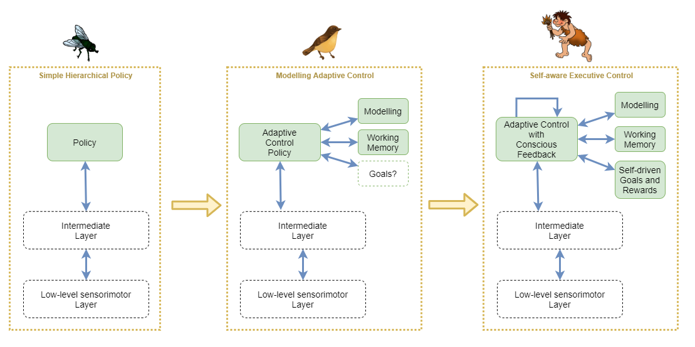
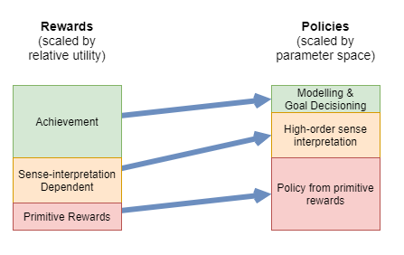
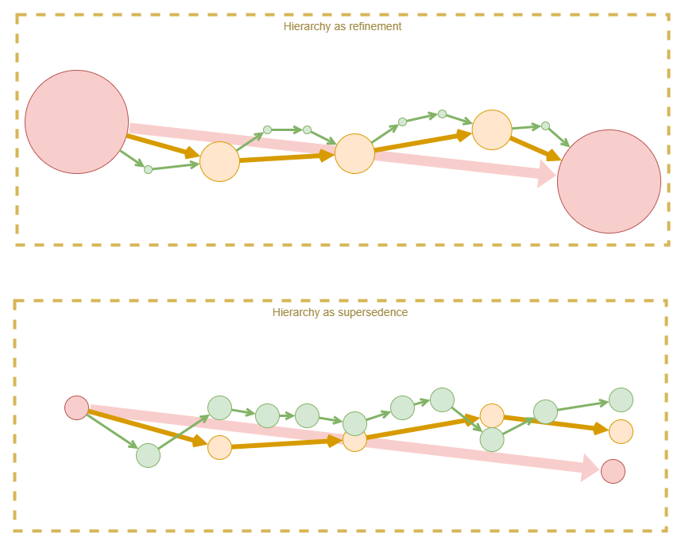
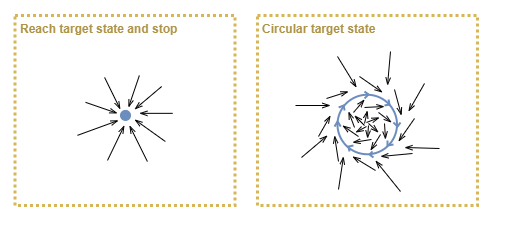
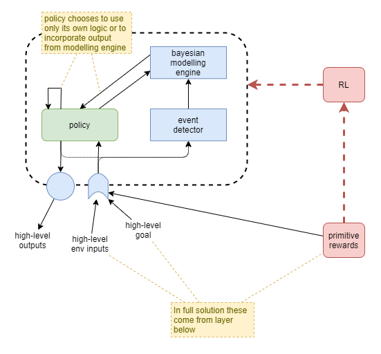
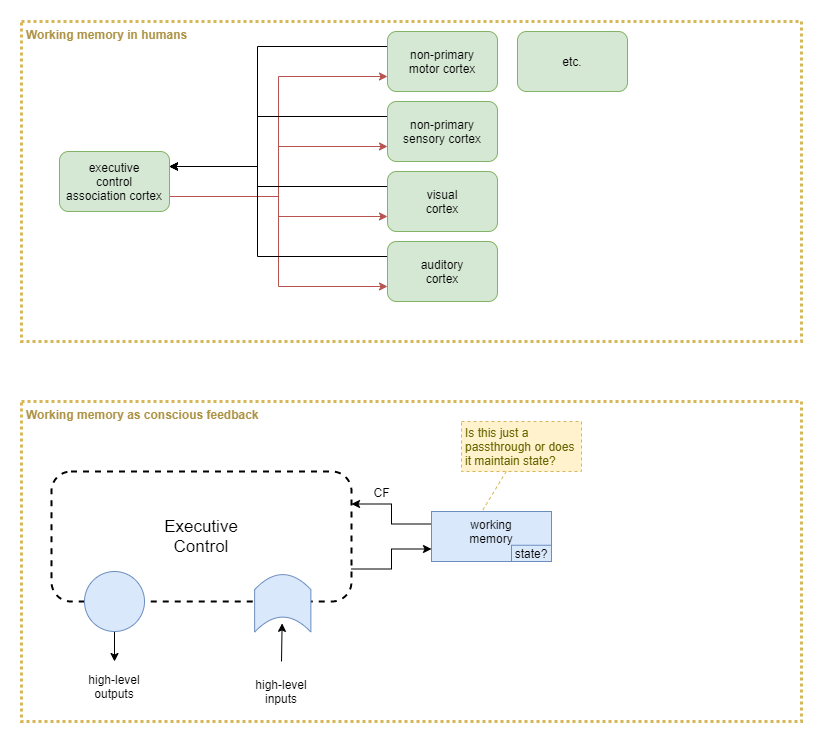
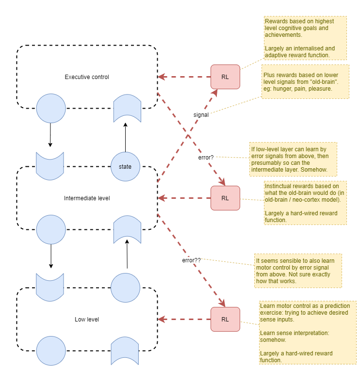

This page forms part of the [[Proto AGI v1]] series.

I present an examination of executive control for the purpose of building a proto AGI.

# Key features

I now suspect that the following features are key to general intelligence:

* Mental modeling
* Brain as a deconstructed RL algorithm
* Prediction
* Goals
* Learned rewards

tbd: diagram

# Progression of Capabilities

In what is certainly an oversimplication, we will use the following view of evolutionary progression as a way to understand the important differences between three kinds of policy that might be possible at the higher-order control layer.

* Simple Hierarchical Policy
    * Here, the high-order policy is of the sort that is currently achievable with Deep Reinforcement Learning and [hierarchical learning](https://thegradient.pub/the-promise-of-hierarchical-reinforcement-learning/). It is trained to naively follow a particular policy that was found through unconscious experimentation to approximately maximise rewards. The policy operates only on immediate sense feedbacks, perhaps using a recurrent neural network (RNN), but without any more advanced system for holding state (eg: working memory), or for understanding the environment at a higher level.
    
* Modelling Adaptive Control
    * At this stage, the system employs persisted high-level modelling of the environment and its behaviours, including other individuals. The model is constantly updated and thus adaptations can be made from only a few or single experience. The policy network is still similar in structure to the simple hierchical policy, however it now integrates with the modelling and working memory systems. This system does not have the conscious feedback loop, and thus cannot model its own internal mental state, nor can it perform any of the more advanced behaviours that depend on that.
    * The inclusion of self-driven goals and rewards is contentious. In biology, this stage would likely incorporate self-driven goals, however to make that work I believe it requires the conscious feedback loop in order to maintain stability. So biological systems would most likely evolve abilities in tandem for self-driven goals/rewards and conscious feedback handling. Thus for our purposes, and in order to maintain a clear distinction between the stages, we'll try to leave self-driven goals and rewards out of the picture for this stage.
    
* Self-aware Executive Control
    * This stage builds on the previous by adding self-driven goals and rewards, and the conscious feedback loop that enables the system to maintain stability.
    
    
With these three stages in mind, we can measure the progression of capability of our proposed solutions.

# Rewards

__(tbd: much of this should move to [[General Intelligence Classifications]]).

## Reward Categories
The rewards that a high-functioning general intelligence learns from are complex. In order to attempt to make sense of that, the following diagram categorises the rewards and illustrates how complex those rewards are to learn useful policies from.

|Reward Category|Reward Description|Policy Description|
|---|---|---|
|Primitive Rewards|These are rewards that can be supplied to a network through hard-coded mechanisms, using simple raw signals such as from primitive senses. In biology, these would be the earliest to evolve. In a complex environment, a 'teacher' may choose to leverage some of these mechanisms (eg: pain or pleasure). These signals are often sparse, and with low-fidelity (eg: I'm either hungry or I'm not). Examples: pain, hunger, hunger satiation, pleasure, effort, predictive errors.|It is hard for an AI to learn a good policy from such rewards, particularly due to their sparse and low-fidelity nature. However, given that this occurs at the most basic level of agent learning, the policy search space is very large. In many AI settings, resultant limb movements can be jerky. This can be improved by including suitable additional primitive rewards that help to improve the 'quality' (eg: effort can be used to influence the efficiency of ligament movement). Biology has the same problems as AI does with primitive rewards: in complex environments with high dimensionality, it takes a long time to optimise for a good result. Evolution took a long time from single-celled organism to mammals.|
|Sense-interpretation Dependent|This category of reward requires trained neural networks for interpretation of senses. It may even require some level of cognitive ability, but it does not require the level of high-order intelligence required for general intelligence. It includes rewards received by interpreting social feedback, such as from someone critiquing our actions (a 'teacher' in general terms), or from the result of our social interactions with potential friends. It also includes other cognitive interpretation of senses, such as 'surprise' or 'uncertainty' (_a la_ the free energy principle). Examples: teachers saying "good boy" or "no", teacher smiles, teacher frowns, popularity, de-friending, isolation. This form of feedback is often higher-fidelity, but can be frequent or sparse.|Complex networks are required to undestand social cues, based on interpretation of the senses. This form of policy builds on top of the policy learned from primitive rewards, in the sense that the agent likely would never reach the cognitive ability to intepret its senses sufficiently to understand social feedback it it were not for the primitive rewards acting as a bootstrap mechanisms for learning.|
|Achievement|Rewards that depend entirely on the agent's own measure of success. In other words, rewards that the agent gives to itself, based on a reward measure that it has devised itself. These rewards depend on mental models that the agent builds about the world, based on experience and its ability to deduce self-consistent meaning from its experience. Examples: achieving goals, reflecting on one's own character and/or lifestyle, perfectionism.|Determination of these rewards depend on systems that support dynamic mental-modelling of the world, and for determining goals based on those mental-models.|

## Interactions across Hierarchical Rewards
Each higher-order reward builds upon the policy trained via the lower-order reward. Thus they form a hierarchy. There are approximately two ways in which these categories of reward can interplay:
* Refinement
    * Each higher-order reward provides higher fidelity or a more fine-grained frequency of feedback, making it easier to train the policy to follow the best path.
* Supersedence
    * Each higher-order reward provides (or at least is interpreted to provide) a "better" measure of success, and thus can override the lower-order reward.
    
The refinement hierarchy leads to efficient convergence, and predictable outcomes, however it looses from its inflexibility. The supersedence hierarchy appears more relevant to human learning, as it recognises that a higher-order understanding of the situation enables a more accurate interpretation than is possible from the more primitive layers. Additionally, the higher-order rewards may trade off longer term larger rewards against small short term penalties. For example, an agent may be willing to tolerate a certain amount of pain in order to gain a worthwhile large reward. So the supersedence hierarchy can lead to more adaptable and interesting results, but at the cost of being less likely to converge.

In practice, we must find some way of combining the two, as they both have considerably important benefits. One approach might be to adjust a weighting between the two over the course of training, with strict preference to refinement hierarchy at first. Another likely variation over the course of training, is to start with only primitive rewards, and to slowly add reward layers over time.

So, a likely training approach is:
1. Primitive rewards only
    * The machinery for other kinds of reward will be in place, so that they can learn, but they won't be allowed to actually influence the final reward value.
    * This phase will carry on for a long time, until the agent has good motor control that produces smooth movements.
    * During this phase, the instructor's "unsaid implicit" goal is the only thing that directs training: avoid getting hurt, use unergy efficiently, eat when hungry, and learn to correlate senses and motion control.
2. Sense-interpretation as refinement
    * A 'teacher' provides visual or tactile cues to train towards some arbitrary goal.
    * Question: how does agent understand that these cues are rewards, and whether they are positive or negative? Does initially associating them with pain/pleasure work? Does it make sense to look at how people train animals? For humans, have evolution just hard-wired recognition of social cues (smiling, etc.) to such an extent that we don't have to teach the association? Or do we do it instinctively from a child's birth and we don't realise it?
    * During this phase, the instructor's "unsaid implicit" goal is again the learning direction, but the agent is interpreting the rewards itself.
3. Achievement as refinement
    * Assumption is that a capability for mental modelling is learned during the first two phases, and that mental models about the world have already been constructed. Thus, now, those mental models and goals derived from them, can be used to measure success.
    * During this phase, the mental models are expected to help the agent more efficiently and accurately achieve the instructor's "unsaid implicit" goal by way of providing high-frequency high-fidelity rewards.
    * Effective reward calculation is heavily weighted towards lower-order rewards if they are available. When they are not available, then higher-order rewards are accepted without change.
4. Achievement as supersedence
    * Finally now we take the reigns off, let the agent explore the world more fully, and really let it develop its own character.
    * The base assumption is that we don't need to change anything about what feedback we're giving. We assume that the internalised reward function from the last phase already conflicts (disagrees) with the lower-order reward functions, but that we were previously constraining the effect of its deviation. So, now we just stop constraining the effect of its deviation, and the policies will adjust.
    * Effective reward is taken as an equally weighted average across the three reward layers, thus a strong high-order reward can counteract a weak primitive penalty.

## Reward components
Some rewards that we might use, as per the categories above:
* Primitive rewards
    * pain
    * satiation
    * learning amount
    * predictive errors (eg: in training sensorimotor network)
* Sense intepreted
    * Uncertainty / curiosity

_more analysis: tbd_

## Pure Intrinsic Motivation

What if the solution is to get rid of external training altogether and use pure intrinsic motivation. The main intrinsic motivation drivers would be a combination of something like:
- Mutual information (DIAYN)
- Prediction
- Curiosity
- Desire

How can that lead to an agent that actually tries to interact with others? Mutual information might again be useful there, as it will attempt to find novel interactions that elicit different states. That will still lead to it finding many different ways of interacting with us, many of which will annoy us but it won't make a distinction. Prediction won't help alleviate that because it will learn to accurately predict our annoyance. So 'Desire' will be necessary: that it wants us to achieve an outcome, but if we are annoyed we won't cooperate and thus it will fail to meet its goal.

The policy will also need to model its rewards so that it can use that to choose goals that lead to rewards. And this will ensure that it can continue to progress and be productive. Hopefully will build up a hierarchical model of rewards so that it can focus on long term gains. However, this reward modelling can be added later, and should only have a weak influence. Its not the main driver. 

Learning algorithms could include:
- DIAYN at all levels -- certainly at the start, then slowly attenuated away
- Variational Autoencoders (VAE) for representational training
- Prediction

This seems like a much more effective long term strategy for producing an AGI.

### Example Architecture
An example architecture using pure intrinsic motivation might look like:
* Maximise I(G:S) - mutual information between goals and states (DIAYN) - encourages exploration, diversity of capabilities, and training of goal representation. 
* Decode error with state regularization (VAE) - encourages saliency of goal representation, and smoothness of the state space. Potentially optimises for reconstructability at expense of utility to higher layers. 
* Maximise I(A:S) - mutual information between sequences of actions and states (Empowerment) - encourages utility of policies. Note: may need to look into whether there is a conflict with what DIAYN does with I(A:S). 
* Backprop pressure from training of layers above - encourages utility of state representation. Although, that pressure will be most effective only when applying rewards against the accuracy of the policy of the higher layers. 

Primitive rewards would be applied at each level independently and simultaneously.

## Primitive Reward Techniques
Referred to as _intrinsic motivation_ within the RL community - but I find that term misleading and prefer to use _primitive reward_. For a detailed analysis of common techniques within RL, see [[Survey of Reinforcement Learning]].

### Circular Targets
Some instrinsic motivation techinques can lead to a policy that always moves the agent towards a particular stable state and then it tries to stay there. For example, empowerment can suffer from this technique, as it targets a state that affords the agent maximum capability of future state changes. Metaphorically, the agent will climb to the top of the hill and stay there.

We want an agent that is driven to keep doing things. One way of looking at this is to target the "stable state" as a resonant circular path through state space. Examples of intrinsic motivation that might lead to such a "stable state" are:
* boredom - desire for unique stimulation
* curiosity - desire to learn when experiences surprise
* learning degree - reward based on how much the agent learns over a period

### Primitive Reward Options
**Boredom**
* Desire for unique stimulation.

**Curiosity**
* Similar to boredom but likely computed in a slightly different way.
* Desire to learn following predictive "surprise".

**Learning Degree**
* Reward based on how much the agent learns over a period.
* Can be risky as it may discourage convergence of policy. So perhaps works better when only measured against the learning degree within modelling engine.

# Approach

## Policy Autonomy
Most RL methods today don't trust the policy with much. They hide a number of key things from the policy by not making them available as inputs:
* Goal
	* On the basis that we don't know how to encode a goal. We hold the goal to ourselves like a secret card that we don't even reveal when the policy achieves it. 
* Rewards
* Execution strategy. 
	* Model based techniques execute the path search as a mechanical process that the polucy has no control over. 

I want a policy that can "think". One that can choose inaction in order to mull over the options. So I need to trust it more. This includes with goal, rewards, but most importantly with execution strategy. 

I treat mental action the same as physical action. In order to include mental actions within the policy gradient calculations, I  include those actions in the value estimate. 

Example tasks:
* Planning: learn to simulate possible paths from model without carrying them all out. Great for efficiency in real world. 

## Functional Specialisation
Intrinsic motivation approach make it very hard to produce results that are useful to us.

Brain uses a lot of functional specialisation, as evidenced by a growing body of research. Particularly from lesion studies. So what if we tried that approach. 

We could add:
* Explicit represenation of rewards, plus uncertainty. 
* Explicit support for model free and model based computation. 
* Explicit support for "simulation" of actions. 

Example:
* In order to support simulation, action outputs could include an on/off signal that chooses between physical action vs just simulation of an action. Action outputs feed into model free reward predictor -> output into reward memory. Action output, sense inputs and reward prediction states could be fed into a reward uncertainty predictor. Policy uses that to choose to output a control signal to model based reward predictor, and waits. Model based reward predictor emits possible paths through its model. And reward uncertainty predictor estimates uncertainty. 
* _(tbd: needs diagram).
* Then extend to actually producing action planning.

## Worked Example - Primitive Rewards plus High-level Goals
We now look at how we can train the executive control layer to understand and target high-level goals. In order to "trust" our policy, and produce biologically plausible solution, our network will not be pre-trained to understand high-level rewards based on the actual goal, nor will be use external training force based on measurement against the high-level goal. Rather, we will provide the high-level goal as "sense" input to the agent, and depend on the existence of primitive rewards as the training force.

In a full solution, the primitive rewards will be supplied from lower-level layers, and the goal will be indicated by something in the environment that the agent must interpret. For example, a sign denoting the target goal position. For the purpose of focused experimentation, we will simulate the existence of the lower-level layers by providing our own high-level representations directly to the executive control layer. Simulated integrations will include:
* input as high-level representation of environment
* input as high-level representation of goal
* input as high-level representation of primitive reward
* actions applied against a high-level representation of a simple environment (eg: grid-world office space with simple left/right/up/down movements).

Primitive rewards material to this design include:
* Pain
* Pleasure

We will present both primitive rewards and high-level goals as inputs to the high-level layer in order to give the policy the opportunity to adapt its behaviour to maximise rewards. We will include a modelling capability that the policy network can _choose_ whether or not to use at each time step.

# Importance of Conscious Feedback

In prior work I've hypothesised that conscious feedback (CF) is important because it acts as a feedback mechanism that the higher-order brain uses against itself to maintain stability. But how exactly does that work?

## Analogue to Physical Senses
Learning of low-level motor control and physical sense interpretation incorporate feedback signals that act as measures of predictive error. In many cases part of the construction of those feedback error signals depend on higher layers. The executive control layer also needs to learn, and it needs error signals to help it with that. But when it's already the highest layer, where does it get its error signals from?

When the executive control layer decides on a physical action, its sense inputs become the feedback signal. They are interpreted and compared to the goal, and the difference becomes the feedback signal that the executive control layer applies to itself for that physical action. Importantly, the feedback signal is fine-grained and immediate. This leads to significantly more efficient learning and smoother actions than possible with sparse rewards.

What about thought? Many thoughts don't lead to physical actions, so the senses cannot be used to provide immediate feedback. Even for the thoughts that do lead to physical actions, the immediate action feedback may not provide much direct feedback about the quality of the thought process that lead to the action. The critiquing of a thought process requires domain knowledge that ony exists within the executive control layer, so it is only that layer that can produce and handle the feedback. Thus, CF provides a means for the executive control layer to critique its own thought processes.

How does it learn to do that critiquing? One way is for it to act as a form of sparse-to-dense reward transformation. Almost all thought leads to physical action of some sort eventually. It may be immediate body action (eg: I want to go somewhere, so I start walking). It may be immediate talking action (eg: I say what I was thinking). It may be delayed physical action. All of those physical actions have the possibility of providing some sparse reward from the environment (eg: I find that I've walked to the wrong place; the person I'm talking to looks confused). All of the executive control layer capabilities (prediction, mental models, memory, etc.) can be employed to learn that certain thought processes tend to be productive, while others tend to lead to negative rewards. So those processes can then provide constant critiquing of the thought process, and provide immediate feedback.

## Inputs vs Outputs
Why would the executive control layer need CF when it's already got access to all the sense inputs and internal state? It because those are all _inputs_ to the neural network of the executive control layer. CF is the only direct way of observing the network's _output_.

## Action Learning
In RL, we learning mappings from actions to probabilities or reward expectations. The actions here are the _output_ of the neural network of the executive control layer. So the RL algorithm needs to directly observe those outputs. Under a hypothesis that the brain implements something akin to RL, but embedded within all its other processes, then it is that same executive control layer that is involved with the RL training. Thus it needs to directly observe those outputs.

# Working Memory

In humans, working memory appears to be a decentralised process. But we don't necessarily need to repeat that for an AI. We could perhaps achieve the same thing with a single 'working memory' (WM) component. One option is the main executive control (EC) system passes some of its output into working memory, and the current state of working memory feeds into EC as an input sense.

At this point the question becomes about what state, if any, that WM component holds. Or, is WM just a pass-through?

# Training and Hard-wired Rewards

We want to be careful to offload the executive control layer from having to manage lower level aspects of the system. So we will need to carefully tune which layers receive the RL rewards related to specific things.

## Examples
Learning to balance when walking (intermediate layer reward)
* Old-brain performs this without conscious control.
* Signal from vestibular system provides feedback signal that intermediate and low-level layers use to control balance.
* Same signal from vestibular system can be used as fine-grained reward function.
* But reward shoudln't kick in when lying down, so need a simple automatic mechanism to switch that reward on/off.
* Possible mechanism:
    * Switch on/off based on pressure on soles the feet.

