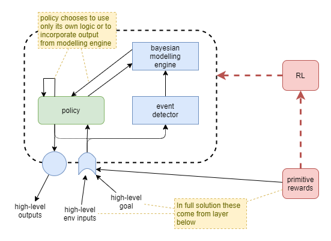
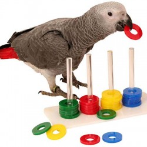

This page forms part of the [[Proto AGI v1]] series.

I present an examination of executive control for the purpose of building a proto AGI.


# Key Features

I now suspect that the following features are key to general intelligence:

* Mental modeling
* Brain as a deconstructed RL algorithm
* Prediction
* Goals
* Learned rewards

tbd: diagram


# Progression of Capabilities

In what is certainly an oversimplication, we will use the following view of evolutionary progression as a way to understand the important differences between three kinds of policy that might be possible at the higher-order control layer.


* Simple Hierarchical Policy
    * Here, the high-order policy is of the sort that is currently achievable with Deep Reinforcement Learning and [hierarchical learning](https://thegradient.pub/the-promise-of-hierarchical-reinforcement-learning/). It is trained to naively follow a particular policy that was found through unconscious experimentation to approximately maximise rewards. The policy operates only on immediate sense feedbacks, perhaps using a recurrent neural network (RNN), but without any more advanced system for holding state (eg: working memory), or for understanding the environment at a higher level.
    
* Modelling Adaptive Control
    * At this stage, the system employs persisted high-level modelling of the environment and its behaviours, including other individuals. The model is constantly updated and thus adaptations can be made from only a few or single experience. The policy network is still similar in structure to the simple hierchical policy, however it now integrates with the modelling and working memory systems. This system does not have the conscious feedback loop, and thus cannot model its own internal mental state, nor can it perform any of the more advanced behaviours that depend on that.
    * The inclusion of self-driven goals and rewards is contentious. In biology, this stage would likely incorporate self-driven goals, however to make that work I believe it requires the conscious feedback loop in order to maintain stability. So biological systems would most likely evolve abilities in tandem for self-driven goals/rewards and conscious feedback handling. Thus for our purposes, and in order to maintain a clear distinction between the stages, we'll try to leave self-driven goals and rewards out of the picture for this stage.
    
* Self-aware Executive Control
    * This stage builds on the previous by adding self-driven goals and rewards, and the conscious feedback loop that enables the system to maintain stability.
    
With these three stages in mind, we will be able to measure the progression of capability of our proposed solutions.


# Rewards

## Interactions Across Hierarchical Rewards

We want to be careful to offload the executive control layer from having to manage lower level aspects of the system. So we will need to carefully tune which layers receive the RL rewards related to specific things.

Each higher-order reward builds upon the policy trained via a lower-order reward. Thus they form a hierarchy. There are approximately two ways in which these categories of reward can interplay:
* Refinement
    * Each higher-order reward provides higher fidelity or a more fine-grained frequency of feedback, making it easier to train the policy to follow the best path.
* Supersedence
    * Each higher-order reward provides (or at least is interpreted to provide) a "better" measure of success, and thus can override the lower-order reward.
    
The refinement hierarchy leads to efficient convergence, and predictable outcomes, however it looses from its inflexibility. The supersedence hierarchy appears more relevant to human learning, as it recognises that a higher-order understanding of the situation enables a more accurate interpretation than is possible from the more primitive layers. Additionally, the higher-order rewards may trade off longer term larger rewards against small short term penalties. For example, an agent may be willing to tolerate a certain amount of pain in order to gain a worthwhile large reward. So the supersedence hierarchy can lead to more adaptable and interesting results, but at the cost of being less likely to converge.


In practice, we must find some way of combining the two, as they both have considerably important benefits. One approach might be to adjust a weighting between the two over the course of training, with strict preference to refinement hierarchy at first. Another likely variation over the course of training, is to start with only primitive rewards, and to slowly add reward layers over time.

So, a likely training approach is:
1. Primitive rewards only
    * The machinery for other kinds of reward will be in place, so that they can learn, but they won't be allowed to actually influence the final reward value.
    * This phase will carry on for a long time, until the agent has good motor control that produces smooth movements.
    * During this phase, the instructor's "unsaid implicit" goal is the only thing that directs training: avoid getting hurt, use unergy efficiently, eat when hungry, and learn to correlate senses and motion control.
2. Sense-interpretation as refinement
    * A 'teacher' provides visual or tactile cues to train towards some arbitrary goal.
    * Question: how does agent understand that these cues are rewards, and whether they are positive or negative? Does initially associating them with pain/pleasure work? Does it make sense to look at how people train animals? For humans, have evolution just hard-wired recognition of social cues (smiling, etc.) to such an extent that we don't have to teach the association? Or do we do it instinctively from a child's birth and we don't realise it?
    * During this phase, the instructor's "unsaid implicit" goal is again the learning direction, but the agent is interpreting the rewards itself.
3. Achievement as refinement
    * Assumption is that a capability for mental modelling is learned during the first two phases, and that mental models about the world have already been constructed. Thus, now, those mental models and goals derived from them, can be used to measure success.
    * During this phase, the mental models are expected to help the agent more efficiently and accurately achieve the instructor's "unsaid implicit" goal by way of providing high-frequency high-fidelity rewards.
    * Effective reward calculation is heavily weighted towards lower-order rewards if they are available. When they are not available, then higher-order rewards are accepted without change.
4. Achievement as supersedence
    * Finally now we take the reigns off, let the agent explore the world more fully, and really let it develop its own character.
    * The base assumption is that we don't need to change anything about what feedback we're giving. We assume that the internalised reward function from the last phase already conflicts (disagrees) with the lower-order reward functions, but that we were previously constraining the effect of its deviation. So, now we just stop constraining the effect of its deviation, and the policies will adjust.
    * Effective reward is taken as an equally weighted average across the three reward layers, thus a strong high-order reward can counteract a weak primitive penalty.

## Reward Components

Some rewards that we might use (grouped by reward category):
* Simple primitive rewards
    * pain
    * satiation
    * learning amount
    * predictive errors (eg: in training sensorimotor network)
* Domain-specific primitive rewards
    * Uncertainty / curiosity

_more analysis: tbd_

## Pure Intrinsic Motivation

What if the solution is to get rid of external training altogether and use pure intrinsic motivation. The main intrinsic motivation drivers would be a combination of something like:
- Mutual information (DIAYN)
- Prediction
- Curiosity
- Desire

How can that lead to an agent that actually tries to interact with others? Mutual information might again be useful there, as it will attempt to find novel interactions that elicit different states. That will still lead to it finding many different ways of interacting with us, many of which will annoy us but it won't make a distinction. Prediction won't help alleviate that because it will learn to accurately predict our annoyance. So 'Desire' will be necessary: that it wants us to achieve an outcome, but if we are annoyed we won't cooperate and thus it will fail to meet its goal.

The policy will also need to model its rewards so that it can use that to choose goals that lead to rewards. And this will ensure that it can continue to progress and be productive. Hopefully will build up a hierarchical model of rewards so that it can focus on long term gains. However, this reward modelling can be added later, and should only have a weak influence. Its not the main driver. 

Learning algorithms could include:
- DIAYN at all levels -- certainly at the start, then slowly attenuated away
- Variational Autoencoders (VAE) for representational training
- Prediction

This seems like a much more effective long term strategy for producing an AGI.

### Policy autonomy
Most RL methods today don't trust the policy with much. They hide a number of key things from the policy by not making them available as inputs:
* Goal
	* On the basis that we don't know how to encode a goal. We hold the goal to ourselves like a secret card that we don't even reveal when the policy achieves it. 
* Rewards
* Execution strategy. 
	* Model based techniques execute the path search as a mechanical process that the polucy has no control over. 

I want a policy that can "think". One that can choose inaction in order to mull over the options. So I need to trust it more. This includes with goal, rewards, but most importantly with execution strategy. I treat mental action the same as physical action. In order to include mental actions within the policy gradient calculations, I include those actions in the value estimate. 

This fits with the idea of using pure intrinsic motivation.

### Example Architecture
An example architecture using pure intrinsic motivation might look like:
* Maximise I(G:S) - mutual information between goals and states (DIAYN) - encourages exploration, diversity of capabilities, and training of goal representation. 
* Decode error with state regularization (VAE) - encourages saliency of goal representation, and smoothness of the state space. Potentially optimises for reconstructability at expense of utility to higher layers. 
* Maximise I(A:S) - mutual information between sequences of actions and states (Empowerment) - encourages utility of policies. Note: may need to look into whether there is a conflict with what DIAYN does with I(A:S). 
* Backprop pressure from training of layers above - encourages utility of state representation. Although, that pressure will be most effective only when applying rewards against the accuracy of the policy of the higher layers. 

Primitive rewards would be applied at each level independently and simultaneously.

### Functional specialisation
Intrinsic motivation approach make it very hard to produce results that are useful to us.

Brain uses a lot of functional specialisation, as evidenced by a growing body of research. Particularly from lesion studies. So what if we tried that approach. 

We could add:
* Explicit represenation of rewards, plus uncertainty. 
* Explicit support for model free and model based computation. 
* Explicit support for "simulation" of actions. 

Example:
* In order to support simulation, action outputs could include an on/off signal that chooses between physical action vs just simulation of an action. Action outputs feed into model free reward predictor -> output into reward memory. Action output, sense inputs and reward prediction states could be fed into a reward uncertainty predictor. Policy uses that to choose to output a control signal to model based reward predictor, and waits. Model based reward predictor emits possible paths through its model. And reward uncertainty predictor estimates uncertainty. 
* _(tbd: needs diagram).
* Then extend to actually producing action planning.

## Primitive Reward Techniques

Referred to as _intrinsic motivation_ within the RL community - but I find that term misleading and prefer to use _primitive reward_. For a detailed analysis of common techniques within RL, see [[Survey of Reinforcement Learning]].

### Circular targets
Some instrinsic motivation techinques can lead to a policy that always moves the agent towards a particular stable state and then it tries to stay there. For example, empowerment can suffer from this technique, as it targets a state that affords the agent maximum capability of future state changes. Metaphorically, the agent will climb to the top of the hill and stay there.


We want an agent that is driven to keep doing things. One way of looking at this is to target the "stable state" as a resonant circular path through state space. Examples of intrinsic motivation that might lead to such a "stable state" are:
* boredom - desire for unique stimulation
* curiosity - desire to learn when experiences surprise
* learning degree - reward based on how much the agent learns over a period

### Primitive reward options
**Boredom**
* Desire for unique stimulation.

**Curiosity**
* Similar to boredom but likely computed in a slightly different way.
* Desire to learn following predictive "surprise".

**Learning Degree**
* Reward based on how much the agent learns over a period.
* Can be risky as it may discourage convergence of policy. So perhaps works better when only measured against the learning degree within modelling engine.

## Worked Example - Primitive Rewards plus Teacher Goals

We now look at how we can train the executive control layer to understand and target teacher specified goals. In order to "trust" our policy, and produce biologically plausible solution, our network will not be pre-trained to understand high-level rewards based on the actual goal, nor will we use any externally driven RL mechanism based on measurement against the goal. Rather, we will provide the teacher goal as high-level "sense" input to the agent, and depend on i) the existence of primitive rewards as the training force, ii) the fact that the primitive rewards coincide with the teacher goal signal, and iii) a modelling capability that will discover the relationship and subsequently understand goal signals in the absence of primitive rewards.



The policy network will learn to _choose_ whether or not to use the modelling capability at each time step.

In a full solution, the primitive rewards will be supplied from lower-level layers, and the teacher goal will be indicated by something in the environment that the agent must interpret. For example, a sign denoting the target goal position. For the purpose of focused experimentation, we will simulate the existence of the lower-level layers by providing our own high-level representations directly to the executive control layer. Simulated integrations will include:
* input of high-level representation of environment
* input of high-level representation of primitive reward
* input of high-level representation of teacher goal
* actions applied against a high-level representation of a simple environment (eg: grid-world office space with simple left/right/up/down movements).

Humans have envolved capabilities to learn through many mechanisms from birth, such as to receive rewards via smiles, and hugs, other body language, and voice intonation signals. Our solution is not advanced enough to learn from any of those sorts of signals and thus we must opt for significantly more simplistic methods that operate against the primitive reward signals that we can easily embed: pain, pleasure, and effort.

### Add model-free learning
We assume that the above approach causes the modelling engine to develop a model of the relationship to the goal signal and low-level rewards, and that the policy learns to choose between its own devices and the output from the modelling engine to achieve maximum primitive rewards. Now we can use the goal signal to cause the agent to perform different tasks, and the agent will continue to use the modelling engine to drive its actions.

How do we turn those actions into further learning of the policy itself? It's like we need some form of hebian learning, where the repitition of an action alone is sufficient to cause learning. One option is to use the trajectories produced by this system to train a secondary predictive network. The task of the predictive network is merely to predict what the next action will most likely be, given the current state. In other words, a standard policy of the form `π = p(a|s)`.

So we collect a cache of past trajectories, and use them, in conjunction with supervised learning and generated samples, to train the secondary predictive policy off the main policy. We probably want the predictive network to calculate and output an uncertainty too.

Now the main policy has three options for deriving the next action: calculate the next itself, use the output from the modeller, or use the output from the predictor.


The predictor network acts entirely on the current state, unaware of the goal. It produces habits that are triggered by familiar states, without consideration to what the agent is actually trying to achieve at the time. This would seem to emulate human behaviour in some respects. For example, the experience of walking into a room and absent mindedly carrying out a particular sequence of actions that you routinely do, when you actually meant to do something else. These "slips of action" are a known effect in humans and relate to how strongly the habitual action is wired, and the brain's mechanism for choosing between habitual or goal-directed behaviour (de Wit _et al_, 2012).

### Future enhancements
**Control Policy Goal**
* Feed goal signal from control policy to prediction policy so that it can adjust its predictions based on the current goal.
* This may or may not be realistic in a biological sense, as it will impact the occurrence of "slips of action".
* Introducing this control policy goal into the predictive circuit will also significantly reduce stability because the solution needs a way of enforcing convergence of the goal signal to actually represent the policy's goal.

### Training
_(tbd)

Collapsing box of pain:


Bird training




# Goals

How do we enable the executive control layer to have goals?


We want the goal to represent a state that the agent eventually reaches. The first naive approach is to measure the actual state against the goal and reward based on minimising the error. But the policy will maximise that reward by always outputting the current state. We want the goal to not just be a copy of the current state, but to represent a goal in the future. So increase the reward for how much in the future the goal is achieved. In simplistic terms we can do that by rewarding based on how different the goal is to the current state at the time it is emitted, but only grant the reward if it is achieved. Additionally, we can penalise for producing goals that are never achieved.

Working through this a little further, at the time of the reward, pick the closest past goal and reward based on how different the state was to the goal at the time. Also, pick the past goal most different to the current state, and penalise for much different it is to the current state (penalise for not achieving a goal). Now turn that into a more continuous reward function and we have something like this for the reward at time `T`:

```
r(T) = Σ{t=0:T} |g(t) - s(t)| - |g(T) - s(T)|
```

That'll likely need a little more work. For one thing, when calculating rewards for a goal, it'll penalise past goals beacuse they are not achieved at time `T`, even if they were achieved at some other time in the past.


## Goal or Prediction?

The biggest issue with the design so far is that the supposed _goal_ is really just a _prediction_ about future state, ie: the agent will maximise reward by always outputting a value that accurately predicts as far into the future as possible. A related issue is that there's no training pressure for the policy to use the current state of the goal in its determination of action. In other words, we're rewarding the agent for predicting the inevitable, rather than striving for something else.

One way to enforce that the policy uses the goal is to maximise the mutual information between the goal and the actions that the policy takes. Something like:

```
I((a|s); g)
```

There is another way of looking at this though. A great way for the agent to succeed in its prediction is to intentionally make it happen, ie: to plan actions that lead to the predicted future state (aka goal). As it so happens I'm not the first to think of this approach, it's called [Active Inference](https://en.wikipedia.org/wiki/active_inference). So maybe this simple architecture could be used for goals.

The idea of active inference suggests another tweak: that failed goals are still good if the agent learns from the experience. So perhaps we shouldn't penalise a failed goal (negative reward), but simply reduce the goal's reward contribution towards zero, and add a learning quotient on top. Coincidentally, this sort of thing is incorporated in an information theoretic way within the idea of active inference.

## Policy Action Options

At any given time step, the policy now has a number of options available for which inputs to consider when choosing the next action. These are indicated here, with the options that we want to encourage in green, and other options (treated as short-cuts) in blue, and labelled according to what they translate to into our extended version of Daniel Kahneman's thought systems.


To emulate something close to human experience, it also needs to monitor its own mental behaviour through a _conscious feedback_ loop. Given the complexity of the architecture, that could well be a very useful feature for maintaining stability. A conscious feedback loop takes the raw policy output and feeds it back in as an input to the whole of the executive control layer. This can enable self-observation through access to trajectory memory of recent events. The agent can model those trajectories, in conjunction with the observed rewards received associated with those trajectories, to identify the kinds of thought processes that are best (maximise reward). Provided that rewards include not just sparse teacher feedback, but also include dense primitive rewards including effort, the agent can then use that modelling to plan its actions better.

For now, that process of self improvement will have to develop spontaneously as I don't know how to reward it for self analysis, and I hopefully shouldn't have to.


# Bayesian Modelling

## Online Hierarchical Bayesian Clustering

It's not easy to do bayesian modelling if we don't have a method for extracting unique "features" to reason about. Given a visual field image, how would I identify that a certain section of that image represents one object as distinct from other objects in the scene? One way of doing that is noting the relative likelihoods of pixels that appear together vs those that are independent. So we need a mechanism that will identify discrete objects and events out of the state input, and we need to analyse for those discrete objects/events across the breadth of the state vector and across time. This will create the lowest level set of nodes in a bayesian model, from which further bayesian modelling can be built up, so it might be the first in a number of discrete bayesian layers.

### A note on state vector representation
Our hierarchical sense interpretation will blur the inter-object independence. So maybe need to apply regularisation that seeks to maximise independence of output nodes. Perhaps, and hopefully, that's what VAE regularisation does. Will need to investigate.

### Sliding Window for Training
To make this work, we need to turn existing hierarchical bayesian clustering algorithms into an online mode that can use new information to discover errors in previous clustering. It needs to work in an _aglomerative_ (add samples to build up a cluster) and _divisive_ (divide clusters) mode. A possible training setup is a sliding window of recent state samples:


In order to train on events with equal before/after states, we lag the point in time that training is applied to the middle of the sliding window and analyse only that state sample in relation to others. The comparisons will probably be performed as part of the bayesian clustering algorithm, or otherwise we could bootstrap through background calculations of mutual information.

At runtime, the resultant clustered bayesian model can be used for predictions based on the current state, and the observation error would ultimately lead to re-clustering. The observation error might always lead to a "surprise" signal, and the magnitude of that surprise would ultimately be amplified according to a measure of "emotional affect".

## Architecture


A possible architecture involves around three bayesian modelling systems:

**Bayesian Modeller #1:**
* Analyses inputs and performs online clustering
* At inference time it emits the predicted category (the best matching cluster), and surprise at state components that aren't expected to occur with that category

**Bayesian Modeller #2:**
* Given the current state, predict the next action that maximises reward.
* The policy will subsequent use Bayesian Modeller #3 to actually predict the expected reward from the action, and may choose to discard it.
* The policy is now looking for an alternative suggested action.
* Discarded actions are collected and used to reduce their likelihood of selection (reduced priors maybe?).
* Modeller #2 can now produce a new recommendation.
* As this uses bayesian techniques, it will adapt faster than a NN policy, so should help to train the agent faster.

**Bayesian Modeller #3:**
* Given an action output by the policy (either for actual physical action or just for simulation), predict most likely reward.
* Actual reward subsequently received becomes the prediction error that will be used for re-training.

So, we build into the architecture of the executive control layer an embedded mechanism that runs in a loop, predicting and simulating actions, analysing their rewards, and discarding them, until an action is simulated that is predicted to have useful reward.


### Active inference
Add to that a method of Active Inference, and its method of trading off exploitation vs exploration via learning likelihoods, and you've now got a very adaptable agent.

### Bayesian inferred goals
Additionally, it could make sense to incorporate goals. Goal inputs to the bayesian networks could help tailor their outputs more.

More importantly, if Modeller #2 produces actions, it will be very unstable due to the fact that the benefit of an immediate next action depends on the policy, which changes over time. An alternative is to predict the desired state that will maximise expected rewards - ie: a goal. This has a nice advantage that it will be a much more constant output value over time.

In the long term the actual goal would be decided as a result of bayesian inference and habitual predictions.

And this finally starts to make sense to have an explicit goal representation floating through the executive control layer.

### NN Policy
Now the question remains whether we even need a NN policy after all that.

A possible view, inspired by biology, is that both systems work in cooperation/competition:


Another view is that it's looking more and more like we'd be best to focus on bayesian solutions for the executive control layer as our first priority. And only later add in the slower-learning NN approaches. This is starting to look like a more realistic path to true autonomous, self-motivated, self-governed general intelligence.

## Re-clustering with Memory

When an observation reveals a bayesian inference prediction error, and this triggers the need for a cluster division, we don't have all the data points available anymore for re-analysis. But, maybe we do, because in the full solution there will be a memory of past events too that could be re-loaded and re-analysed.

Example:
* I'm told this three-legged thing is not a chair. Oh now I need to reassess my assumptions. Are all three-legged things not chairs? Memory recall occurs: oh, I remember three-legged chairs.

The recall of those related memories would need to be loaded into working memory, and the whole executive control layer would need to partake in this re-training exercise. On the face of it, this seems like it's commandeering the executive control layer for the training task related to one particular component.

But maybe that's what the executive control layer is all about. The automated machinery needed in order to train these advanced computational systems. It just happens to be self-aware in order to apply top-level governance and prioritisation.

## Representational Dynamics

Something to consider is that the representational interpretation of the high-level state supplied by the intermediate layer will change over time. The modelling engine will have to cope with those changes.


# Importance of Conscious Feedback

In prior work I've hypothesised that conscious feedback (CF) is important because it acts as a feedback mechanism that the higher-order brain uses against itself to maintain stability. But how exactly does that work?

## Analogue to Physical Senses

Learning of low-level motor control and physical sense interpretation incorporate feedback signals that act as measures of predictive error. In many cases part of the construction of those feedback error signals depend on higher layers. The executive control layer also needs to learn, and it needs error signals to help it with that. But when it's already the highest layer, where does it get its error signals from?

When the executive control layer decides on a physical action, its sense inputs become the feedback signal. They are interpreted and compared to the goal, and the difference becomes the feedback signal that the executive control layer applies to itself for that physical action. Importantly, the feedback signal is fine-grained and immediate. This leads to significantly more efficient learning and smoother actions than possible with sparse rewards.

What about thought? Many thoughts don't lead to physical actions, so the senses cannot be used to provide immediate feedback. Even for the thoughts that do lead to physical actions, the immediate action feedback may not provide much direct feedback about the quality of the thought process that lead to the action. The critiquing of a thought process requires domain knowledge that ony exists within the executive control layer, so it is only that layer that can produce and handle the feedback. Thus, CF provides a means for the executive control layer to critique its own thought processes.

How does it learn to do that critiquing? One way is for it to act as a form of sparse-to-dense reward transformation. Almost all thought leads to physical action of some sort eventually. It may be immediate body action (eg: I want to go somewhere, so I start walking). It may be immediate talking action (eg: I say what I was thinking). It may be delayed physical action. All of those physical actions have the possibility of providing some sparse reward from the environment (eg: I find that I've walked to the wrong place; the person I'm talking to looks confused). All of the executive control layer capabilities (prediction, mental models, memory, etc.) can be employed to learn that certain thought processes tend to be productive, while others tend to lead to negative rewards. So those processes can then provide constant critiquing of the thought process, and provide immediate feedback.

## Inputs vs Outputs

Why would the executive control layer need CF when it's already got access to all the sense inputs and internal state? It because those are all _inputs_ to the neural network of the executive control layer. CF is the only direct way of observing the network's _output_.

## Action Learning

In RL, we learning mappings from actions to probabilities or reward expectations. The actions here are the _output_ of the neural network of the executive control layer. So the RL algorithm needs to directly observe those outputs. Under a hypothesis that the brain implements something akin to RL, but embedded within all its other processes, then it is that same executive control layer that is involved with the RL training. Thus it needs to directly observe those outputs.


# Working Memory

In humans, working memory appears to be a decentralised process. But we don't necessarily need to repeat that for an AI. We could perhaps achieve the same thing with a single 'working memory' (WM) component. One option is the main executive control (EC) system passes some of its output into working memory, and the current state of working memory feeds into EC as an input sense.


At this point the question becomes about what state, if any, that WM component holds. Or, is WM just a pass-through?


# Tasks

Learning to balance when walking (intermediate layer reward):
* Old-brain performs this without conscious control.
* Signal from vestibular system provides feedback signal that intermediate and low-level layers use to control balance.
* Same signal from vestibular system can be used as fine-grained reward function.
* But reward shoudln't kick in when lying down, so need a simple automatic mechanism to switch that reward on/off.
* Possible mechanism:
    * Switch on/off based on pressure on soles the feet.

Office world (copied from Illanes _et al_, 2020):


Planning:
* learn to simulate possible paths from model without carrying them all out. Great for efficiency in real world. 


# References

de Wit, S., Watson, P., Harsay, H. A., Cohen, M. X., van de Vijver, I., & Ridderinkhof, K. R. (2012). Corticostriatal connectivity underlies individual differences in the balance between habitual and goal-directed action control. The Journal of neuroscience : the official journal of the Society for Neuroscience, 32(35), 12066–12075. https://doi.org/10.1523/JNEUROSCI.1088-12.2012

Illanes, L., Yan, X., Icarte, R. T., McIlraith, S. A. (2020). Symbolic Plans as High-Level Instructions for Reinforcement Learning. Proceedings of the Thirtieth International Conference on Automated Planning and Scheduling (ICAPS 2020). http://www.cs.toronto.edu/~lillanes/papers/IllanesYTM-icaps2020-symbolic.pdf