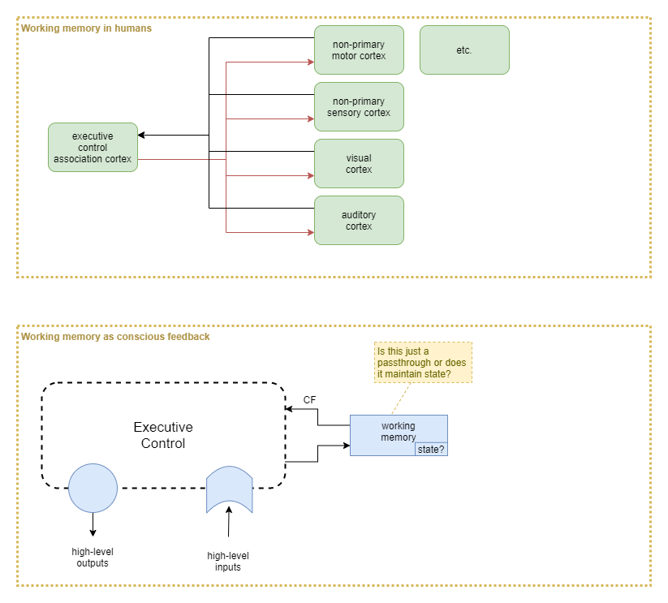

This page presents an examination of executive control.

# Working Memory

In humans, working memory appears to be a decentralised process. But we don't necessarily need to repeat that for an AI. We could perhaps achieve the same thing with a single 'working memory' (WM) component. One option is the main executive control (EC) system passes some of its output into working memory, and the current state of working memory feeds into EC as an input sense.

At this point the question becomes about what state, if any, that WM component holds. Or, is WM just a pass-through?