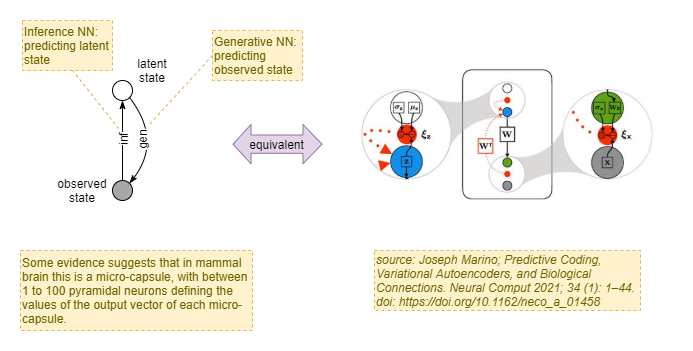
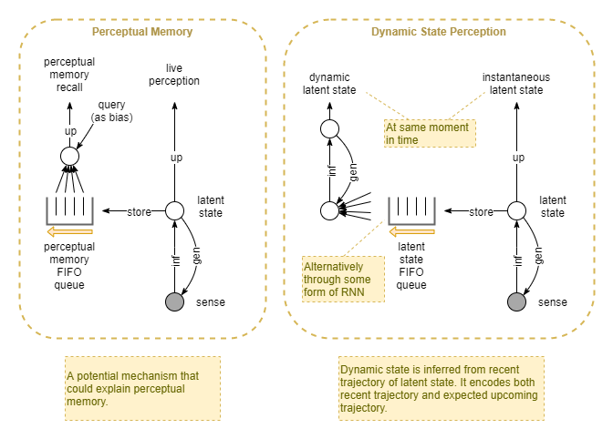

My apologies dear reader, for this page is in a "brain-dump" form and may not be the easiest to read.

# Introduction

Much of the research into consciousness had asked the question "what". And much had been gained from that question. But I think it's time to focus more on the "why".

Many aspects of the "what" have already been answered. We have vague high level understanding of what kinds of processes assets happening within the brain. We have a good collection of well studied correlates of consciousness, so that we know to some extent which parts of the brain are involved and in what ways. We have strong evidence of the resonant form of brain activity. But much of that leads to high level explanations, without specifics. We can see that dreams seem to be a form of half - consciousness, but we don't understand it. We can see and observe in fMRI when things make it into conscious awareness versus not, but we don't understand the specifics of why some things make it to conscious awareness and others don't. 

The best model we have to date is surprisingly easy to construct out of the various theories. Neural Darwinism, Adaptive Resonance Theory, Global Workspace Theory, Active Inference, and Visceral Loop Theory, and are mutually compatible. Together they produce a unified theory that explains a lot. Eg: IWMT (world models). But even that still fails to provide a strong and detailed explanation of the "why" of conscious awareness. 

The Visceral Loop begins to directly tackle that. But more needs to be done. 

A detailed investigation of the why needs to produce, with mathematical accuracy, a schematic of a self organising, self architecting, self learning, agent. In a multi layered cognitive architecture, each lower layer is trained by the layer above. But what trains the top most layer? Active Inference, in combination with evolutionarily pre-configured loss measures and attractors are part of this. But to really design such a system requires answering many more nuanced and detailed questions. Answering those, is answering the question of "why". 

It will answer:
- With greater specificity and clarity, why are we conscious at all (phenomenal consciousness)
- Why we are conscious of some things and not others (access consciousness)
	- "The big puzzle is, why is the conscious aspect so limited, and the unconscious part so vast? What is the meaning of this odd conjunction?" (Baars, 2022)
- Why we have the perception of volitional control (free will)
- Why we have conscious subjective experience of dreams. If it is something to do with learning, why is learning so tied to subjective experience?
- Why conscious priming is apparently needed to trigger learning and unconscious problem solving (as mentioned by Baars, 2021). Ie: we just hold something in awareness and we magically learn from it, or magically produce a solution to the question.
- To what level infants are conscious. Eg: probably fully conscious so that the system can learn too. 
- Why Cs is a single stream, not multiple parallel Cs streams. 
- If consciousness is a meta management system, why is it aware of not just the main processes that it is tasked with managing, but of itself as well. Exactly what learning measure or loss function requires that such meta self reference is available? 
- Why such a system doesn't need infinite regress on its meta meta-ness.

## How

Having recognised a "why", in the form of a need for better capabilities, the next thing to address is "how". What biologically plausible mechanism may provide the necessary capability? 

So the task at hand is to use the "design stance" to theoretically (or actually) build such a system. It should produces the behaviours of the Visceral Loop. It needs to be able to operate within a sufficiently complex environment. It needs to be able to learn (long term). It needs to be able to adapt (short term) and presumably it needs to meta-adapt (ie: adapt its meta management).

# Background

See:
* [[Focusing on the Why for Animal Kingdom]]
* [[Predictive Coding]]

# Stages of Improvement 

This section attempts to list a likely path from simplest to most complex architecture. At each stage, I'm trying to produce a "why" that the stage is an answer to. Or better put, I'm trying to find a "need" that earlier stages cannot fulfil, and that the newer stage does somehow. What variety of cognitive process and agent behaviours is possible with a given stage? What processes and behaviours are not feasible at that stage? What processes and behaviours could be equally achieved but in a simpler way if implemented on an architecture with a later stage?

As good example of that last point is that our current state of the art deep learning networks are often still simple feed-forward networks, the simplest of the networks. This correlates with the cognitive architecture of plants. But we've scaled up that architecture way beyond the capabilities of plants or the animal kingdom. That's because the animal kingdom found a more efficient architecture (a more advanced one) to achieve the same capabilities. In this case, efficiency probably expands to "elapsed time and energy expenditure per amount of learning".

### No network
Agents without a neural network employ evolutionarily-trained pre-configured simple chemical and electrical signalling. The sensor-adjustor-effector triad (see [[Focusing on the Why for Animal Kingdom]]) are typically collapsed into a single cell that merely reacts to its immediate environment, without any global coordination.

These range from bacteria to some simple zooplankton species.

Such agents are significantly limited in their range of behaviours, and their ability to adapt at the individual level. They are also constrained in the size and complexity of their body - the larger and more complex the body, the more a coordinated musculature is required, that cannot be controlled without a nervous system to convey messages across the body.

### Feed-forward Network
- What: First simple evolution using simple feed-forward network, or perhaps with some micro-scale recurrence of the sort found in LSTM, but without adaptive predictive mechanisms. Many of our current state of art deep learning agents, trained through RL, fall into this first naive category.
- Why: Larger bodies, more complex behaviour, the beginnings of individual adaptation.
- How: Network configuration and signal strengths likely to be primarily evolutionarily hard-coded. Perhaps with some minimal adaptation at individual neuron level.

More complex zooplankton species, and simple jellyfish are examples of feed-forward networks.

### Predictive Coding
tbd

More advanced jellyfish fit here.

### Dynamic Latent State Inference
- Why: ...
- How: It turns out that inference of dynamic state is a good choice. Particularly because it can use predictive coding, and thus gain the benefits of rapid convergence, and stability. 

### Multi-model sensory integration
- What: Given a single source perceived simultaneously via multiple sensory modalities (eg: sight, sound and touch while looking at a rock and scratching a fingernail along it) humans perceive all three sense modalities as correlated together.
- Why: Different perceptual modalities (eg: sight, sound, touch, smell, proprioception, sonar, electrical fields) have very different characteristics. Thus, latent state inference from each modality individually produces very different latent state representations. This is the case even when observing the same environmental source. This increases the bandwidth requirements of top-level action control - in order to pull all the available information together and to infer action, it requires a larger network that is slower to train.
- How: additional layer that integrates intermediate individual modality latent states into a single unified latent state.

This could be the beginnings of the development of hierarchical architecture with different lower-order and higher-order representations.

### Attention
- Why: bandwidth

### Contextual State Inference
- Why: Instantaneous perception requires a lot of ambiguity resolution requiring longer inference times. It's inefficient and unnecessary to continually repeat that for the same input.
- Why: Different environmental circumstances require different behaviours, so perceptual and action inference needs fine-tuning for those different circumstances. - ie: greater adaptation.
- How: Frame nodes that tweak the priors of the main inference processes. Frame inferred from recent perceptions. It's also advantageous to incorporate other contextual knowledge, eg from memory.

Likely the catalyst for evolution of memory.

### Multi-cycle processing recurrent network
- Why: Inference via a single pass is limited in its bandwidth. Thus such an agent cannot handle more complex environments and behaviours. eg: social interactions, resolving complex ambiguities, rational thought.
- How: state-machine with processing over multiple loop cycles with non-physical actions.

Can include multiple processing cycles "pre-action" - ie: before choosing to act on the inference. eg: consideration of multiple options before choosing best one. However, this level of processing likely requires many of the remaining evolutionary steps. So the exact position and nature of this stage needs some refining. eg: not obvious whether this can exist without meta-management, or whether meta-management could exist without multi-cycle processing.

### Global Workspace
- Why: individual processors tend to work in relative isolation. This is efficient, but it's unable to deal with novel situations.
- How: centrally orchestrated cooperation of all processors through Global Workspace (a la Baars).

### Uncertainty 
- What: At some point around about here, representation of uncertainty is needed. For example in controlling the level of training induced from errors in predictive coding feedback. And in the optimal inferences drawn from varyingly accurate senses - eg: whether it's safe to strike on something when you aren't certain of its size. Or to flee when you aren't certain of the threat (there's a cost of unnecessary fleeing).
- Why: tbd

### Meta-management
- What: self governance of learning. Eg: identification of learning opportunities. Hindsight identification/improvement of success measures. 

### Rational thought 
- Why: at some point the env interactions and agent behaviours need to be more advanced than simplistic pattern matching. 

### Later stage - memory 
- Why: greater adaptation.
- Why: population of frames from information gathered over longer timeframes.

Likely catalysed by evolution of contextual frames. Initial frames could be determined by perceptual memory. This could be extended over longer and longer timeframes by first introducing separate short term memory and then later via long term associative-recall memory.

### Later stage - Emotions
tbd

# Feed-forward Networks

An example for consideration is the difference between a feed forward network, and one that uses predictive coding. Feed forward networks are the predominant type of network in AI today. After decades of research, we now have very efficient and effective learning mechanisms for large scale feed forward networks. This depends on the back propagation algorithm. In AI, it is governed by external control which records a buffer of past observations, and uses automatic differentiation to propagate the errors.

This approach is generally considered to be not biologically plausible. 

In contrast, we have generally believed that biology uses Hebbian learning : "those that fire together, learn together". But the biological plausibility of that too had proven elusive. 

A different model is that of predictive coding. Here, two feed forward networks play in concert, but in opposite directions. The top-down network predicts the internal layer outputs of the bottom-up network, and the difference is used as an error signal that drives dynamic behaviour and convergence.

It can be shown that predictive coding is mathematically equivalent to empirical bayesian inference within a hierarchical bayesian network. This has excellent convergence characteristics.

Another way of looking at this is that the top-down network calculates the back propagated errors. 

Thus, predictive coding is equivalent to the learning algorithm of a feed forward network. Except that predictive coding is:
- Biologically plausible, and
- Doesn't require an external system to drive the learning, and
- In an ART configuration has better protection against catastrophic forgetting, and, copes better with noise, and
- Isn't vulnerable to simple image tweaks causing it to mistake a very slightly corrupted apple image as a drill. 

Another way of looking at this, is that  predictive coding simultaneously trains a forward recognition model and a backward generative model, and trains them against each other. A feed forward model, in contrast, is only a recognition model, with the environment acting as the generative model  (see below for elaboration of this) and providing error signal with less frequency and lower precision. 

RNN: The purposes of this article, I treat RNNs as a special case of feed forward. Their recurrency is at a micro level. They're really just the temporal equivalent of the spatial convolution network (CNN) - ie: they employ information about the most recent events to adjust their output. But they don't operate at a macro-scale like a state machine. They don't follow an iterative process such as employed by predictive coding. And they don't have a generative model.

This distinction between feed forward and predictive mechanisms will play out in many places throughout what follows. 

## Feed-forward only network
- May include some micro scale recurrence (ie: recurrent loops of signalling between nearby layers only), but not in a way that it can take from near the final output layer and feed back into near the input layer prior to producing an action.
- Almost all feedforward-only networks have "re-action" (a kind of recurrence) in the form of the sense-infer-act-effect cycle, but there is no macro-scale state-machine recurrence at a pre-action level.
- Many of our current state of art deep learning agents, trained through RL, fall into this first Naive category.
- Recently shown to be very inefficient from learning point of view. 
    * citation: Going in circles is the way forward: the role of recurrence in visual inference. https://www.sciencedirect.com/science/article/pii/S0959438820301768. See "Paper Refs - Loopy AI and implications for characterising.."
- Notice also that RL is orchestrated externally using biologically implausible mechanisms. If the RL algorithm was reimplemented via NN as part of the agent, then it would no longer be in this class. 
- All behaviour is reflexive / reactive.
- It's hard to imagine how such an organism can exhibit any adaptation / learning, but it is likely that nature finds a way. 
- Plankton and most jelly fish fit into this class. 
- In particular, the simplest forms of animals even have the sensor-adjustor-effector trio rolled up into single cells (see [[Focusing on the Why for Animal Kingdom]] for background).
- Inferences:
	- sense --> action: error propagation via environment as generative model

# Predictive Coding

We don't really know how to practically build predictive coding yet. VAE are a simplified version, but they don't provide quite they level of dynamic behaviour that we're after. 

Additionally, predictive coding as a theory says nothing about catastrophic forgetting. In contrast, ART specifically addresses catastrophic forgetting. It also potentially supports familiarity based rapid learning /memory. 

ART is basically built upon predictive coding, but with a slightly different focus. 

The best is a combination of the two. 
So it's best to refer to "PD/ART" in place of either, however, for the remainder of notes here, any reference to predictive coding is assumed to refer to "PD/ART".

## Predictive Coding as Bayesian Inference
It is useful here to think of predictive coding as an implementation of Empirical Bayesian Inference running over a model that was optimised via either Expectation Maximisation or Markov Chain Monte Carlo. Note: TensorFlow has some built-in support for these sorts of things: https://www.tensorflow.org/probability/.

In biology and in AI, it is useful to break the problem down into a hierarchical bayesian network.
For example:
- inference of latent state R given raw sense data S.
- p(R|S) = p(S|R) p(R) / p(S)
- => leads to R = max p(S|R) p(R) / p(S), over something.
- But p(R) is actually a complex non-linear distribution, and probably a distribution from a mixture. So we model it as a gaussian mixture model (GMM).
- Thus we have: p(R) = sum p(R|θ) p(θ) over θ.
- And this is what leads to an iterative scheme, successfully improving the estimate of both p(R|S) and p(θ|R).
- see: https://en.wikipedia.org/wiki/Empirical_Bayes_method  (note that I've used θ where they've used η)

Why:
- easier to model p(R) by factorising as a gaussian mixture models (GMM)
- opportunity to train some layers from multiple sources (eg: learning actions from other people via mirror neurons)
- dimensionality reduction

## Predictive Coding for Perception
- ie: adaptive resonance / predictive coding based networks.
- This is a form of macro-scale recurrence, but in a specific form limited to a cyclic swing between perception & prediction that "settles" over time (ie: over multiple cycles). Thus, on its own, it is closer to a feedforward-network than to a network with meta-management.
- Gives more chance for learning and thus behaviour adaptation, including some forms of rapid adaptation, but only in simplistic ways.
- All behaviour still reflexive / reactive.
- Box jellyfish may be here.
- Inferences:
	- sense --> latent state --> action: predictive coding (forward + generative model NN's) for latent state inference, error propagation via environment as generative model for action generation.
	- sense --> current latent state --> desired latent state --> action: full predictive coding
    
Sense --> representation:
- Inference of latent state given raw sense data. 
- p(R|S) = p(S|R) p(R) / p(S) 
- p(S) is learned. 
- p(R) is assumed prior, or given a bias by framing (eg: looking for something, or convinced to expect a certain thing) 
- p(R) is factorised as p(R|θ)p(θ), where θ is basically the selector for the specific model within the GMM of the latent space.
- Uses empirical bayesian inference to alternatively improve estimate in p(R|S) and p(θ|R).

## Predictive Coding for Direct Perception -> Action Inference
Presumably biology initially evolved a direct inference from raw percept to raw action, and only slowly added the different steps:
1. sense --> action
2. sense --> latent state --> action
3. sense --> current latent state --> desired latent state --> action

Without the hierarchical bayes, the modelling must employ approximations, so the first two stages presumably can be mathematically understood in that way.

Without the translation going on between current and desired latent state, there is less option for developing a consistent state space that can learn from multiple sources. Thus it presumably devolves into simple gradient descent. At that point, the environment is used for the generative model: actions are immediately executed, and error detections used to drive the direction of gradient descent. Thus, a neural net can indeed be used in stages 1 and 2, but they do not reflect true predictive coding.

## Predictive Coding for Action
Our entire experience of action is through our senses. We learn the effect of an action command by observing the result. Thus, under an assumption of Active Inference, it makes sense that action is achieved by desiring a particular observation, and letting the action system infer the correct commands. Further, the request itself is not constructed in terms of raw sense observations. Rather, it is constructed in terms of latent state - the same latent state that is inferred from predictive coding for perception. Thus, an action request is encoded as a latent state representation, which implies some strong (high confidence) requirements about certain areas of sense space, and doesn't care about others. eg: I want my hand to move to the cup, but I don't care about what's happening in the background or what my feet are doing.

The desired state itself must be inferred somehow based on current state and goal. Additionally, it might represent a state, or perhaps also encode a trajectory through latent space. I'll ignore those details for now. Thus we have:

Desired state ---> motor action:
- Inference of action, given latent state (representation) 
- p(A|R) = p(R|A) p(A) / p(R) 
- Uses empirical bayesian inference, factorising p(A) as p(A|θA)p(θA), where θA is basically the selector for the specific action model within the GMM of the latent space.
- Thus estimates A via iterative successive improvements of p(A|R) and p(θA|A).

## Predictive Coding for Desired State Inference
Current state + goal ---> desired state:
- Goal may be explicit and dynamic or implicit and static.
- I'm not sure about this inference. Maybe it's predictive coding too, maybe it's not.
- It's even possible that predictive coding evolved as: sense --> current latent state  + desired latent state --> action first, with current --> desired using simple gradient descent.
- ie: it's gradient descent with environment as the generative model, but operating at a higher-order representation. This still seems like an evolutionary advantage.

## Predictive Coding for Desired State Trajectory
Another possibility alluded to by (1), is that the desired state is represented as a trajectory.
Thus, we have:
- desired state trajectory  ---> an action is inferred
- efferent copy sent to perception processors
- perception processors predict trajectory given efferent copy
- predicted trajectory compared to desired trajectory, resulting in error
- subsequent adjustment to action inference, and repeat.

All of that probably occurs within the latent state space, as a much easier model to work with than raw sense space.

Reference 1: Predictive coding: an account of the mirror neuron system. James M. Kilner, Karl J. Friston, and Chris D. Frith. (see note: Predictive Coding).

# Sensory Integration
## Multi-modality sensory, effector, and internal state integration
- Predictive-coding to integrate multiple sensory modalities.
- Predictive-coding + afference copy to identify the difference between self-caused sensory change versus external environmental changes.
- Improved coordination for more complex environments / behaviours - but still all behaviour is reflexive / reactive.
- Some room for variations between decentralised and centralised processing models. However, this suggests a start towards a centralised control model.
- ie: this is the first part of the answer to why: centralised control?.

Resolve some ambiguities (but not ones requiring reconsideration over multiple loop cycles). 
Aggregate is more than sum of parts: eg: identify features as relationships between features in modalities. 

## Sensory Integration Details
Motivating question: what is the difference between our raw sense perception (that we may not have subjective experience of), and the integrated summary that we are aware of within our subjective experience?

One possible answer may lie in a seemingly unrelated observation: that all our senses are fictitious:
- We see in colours. And yet in physics, they don't exist. At a stretch you could say that the primary colours exist, but the non-primary colours (especially white), totally do not exist. In physics, there is only distributions of superimposed electromagnetic radiation at different frequencies. Our perception of colour is a completely artificial representation, constructed from sampling certain points along the frequency range.
- Sounds are very similar. All that occurs in physics is air particles being shoved around by a motely mix of waves emanating from different sources with different frequencies. We accurately infer the source of those sounds. But what we actually hear doesn't necessarily bare any resemblance to what you could arguably call the real physical sound. Correlation, yes. But resemblance, no.
- Touch. There are so many different kinds of touch and touch-like sensations. Some use similar kinds of cells for touch perception, while others use differing kinds of cells.  And we experience them in different ways. It's hard to say what the "real" touch is, and how similar or different our perception is.
- Taste and smell. These are just like colours. Taste and smell do not exist in a physical sense. Mixtures of different compounds are in the food/water we consume, and in the air we breath, and chemical reactions occur that trigger a mixture of different nerve impulses, and we represent all that through what we experience as taste and smell. There's every reason to believe that the representations that we subjectively experience are entirely hallucinatory.

Importantly, in our subjective experience, each sense has its own unique characteristics. They feel different. This suggests that the subjectively experienced representations are constructed in different regions of the brain, with each region devoted to that particular kind of sense->processing->representation system.

Global workspace theory hypothesises that the content of the global workspace defines the content of our subjective experience. Since we experience the sense representations discussed above, it seems likely that they are the contents of the global workspace. And since we've also claimed that they are managed by different brain regions, finally we can conclude that it is likely that the global workspace is not a unified central representation, but rather a collaboration of multiple distributed representations.

And the apparent central integrated one-representation-to-rule-them-all that we have at the centre of subjective experience? Perhaps that is another illusion. In the same way that we perceive a vast solid image in front of us, but our eye takes in only a narrow field of view at a time, and the perceived image is combined together from multiple takes - perhaps our perception of a single unified representation is a the result of trickery.
...mind you, the vision example implies a mechanism that specifically holds and builds up the whole image. So the same would be needed for the central subjective representation.

From a bayesian inference point of view, it makes sense that there is indeed a central subjective representation. In the bayesian inference phrasing, the goal is to infer the latent state of the environment using all available information (ie: all sense modalities). And that single consistent latent state is then a better source of information for choosing action etc. In particular, inference of latent state that uses all sensory modalities is better than inference using only one.

## Sensory Integration as Global Workspace
Baars (2021) notes a number of properties about the global workspace, some of which can be explained much better through the lenses of "sensory integration" and "predictive coding". Such properties include:
- multiple senses are integrated if they co-occur within the a ~100ms cycle time.
- conscious percepts are internally consistent
- raw sensory perceptions and other events compete for access to the global workspace (aka compete for attention).

This can all be elegantly explained as follows....

Predictive coding methods are used to integrate senses, whereby a higher-order representation is constructed that summarises the integrated senses. The higher-order representation is conversely compared against the raw percepts and updated if it causes too much error. This can lead to multiple iterations, and the time required for stability varies depending on the level of novelty.

Masking is applied according to attention, so that feedback errors only trigger re-evaluation of higher-order representations if they are included within the mask. Attention itself is likely also fine-tuned over the course of the same stabilisation iterations.

The higher-order representation must also be of maximum utility for further analysis. A jumbled mess that most accurately correlates to the raw percepts is of little utility because it bares least resemblance to any past experience and thus least resemblance to any past solutions. Thus the ambiguity in such a high-level representation  creates a maximally difficult problem to solve. Instead, if the higher-order representation is also constrained to tend towards consistency with existing knowledge, then it has more utility because it is simpler for subsequent processing, leads to quicker decisions, and is more effective in aiding the individual from potential threats. All of that, despite the fact that it may be less accurate. In other words, a self-consistent best guess with high precision, is better than an accurate jumble.

In the end, a single higher-order representation is achieved that correlates to the raw sensory perceptions to the maximum extent possible within its constraints, AND correlates most strongly to a consistent model from existing knowledge. Thus, sensory percepts that correlate to the most attention-grabbing event, and which are consistent with each other, tend to be integrated.

This thought experiment has led to a very useful additional conclusion:
- Predictive coding is not just between: raw percepts <--> higher-order representation
- It is between three levels - with the bottom and top being static for any given moment, and the dynamic component in the middle:
	- raw percepts <--> higher-order representation <--> existing knowledge
- It is likely that the level of novelty affects how much of this equation requires error correcting recurrency cycles.

In apparent contrast, Baars suggests that frames (Baars, 2021, part 3, section 4.3.4) are the explanation for the self-consistent nature of conscious experience. That frames themselves are self-consistent, and that we can only accept one dominant frame stack at any given moment, and that frames shape our perception. Thus, where perceptual conflict or gaps arise, the dominant self-consistent frame is used to resolve the ambiguity or fill in the gaps. This looks very much like the "existing knowledge" reference I make above.

So, frames are the existing knowledge to which I refer. But, importantly, this shows that "existing knowledge" does not refer to a global absolute and static set of knowledge. Rather, it refers to a subset of prior knowledge, dynamically selected based on priming effects.

# Attention

Inspiration:
- From Baars, 2022: " The idea that consciousness is a gateway — something that creates access to a vast unconscious mind — has interesting implications for understanding learning. It suggests that learning just requires us to point our consciousness at some material we want to learn,"
- This suggests an interpretation that attention is a "movable" thing, like a physical limb, and it needs similar control processes and learning. Likewise, it may be guided through Active Inference. 

If attention is a a form of action, then it must be trained through experience. This includes exploration to learn new capabilities and new things to avoid. It includes exploitation in order to achieve goals and avoid negative outcomes. 

Active Inference is a unified way of managing the often mutually exclusive needs of exploration and exploitation by measuring free energy as the amount of uncertainty (unknown) around some particular action, and the expected costs of re-performing past actions that had negative outcomes. It can also be extended to incorporate goals when they are present. 

A significant point of attention, brought out within Part II of Baars, 2022, is that while attention is key to consciousness and executive control, it is not under conscious control. We can (sometimes) influence our attention, but we lack direct control. In fact, specific damage can result in disorderly attention without a reduction in the apparent breadth or detail of subjective experience. 

Thus, it would seem that this Active Inference system operates independently. It obtains knowledge of the system-wide goal somehow (perhaps by inspecting WM like any other system), and presumably uses as inputs all of the conscious and unconscious data in working memory, plus the current external and endogenous sensory inputs.

Thus, consciousness can influence attention through selection of goal, but otherwise is subservient to attention. 

Even though attention selection may at times act counter to conscious goals, over time it will learn from negative outcomes. In fact those negative outcomes will also teach it to ignore goals at times when other more pressing concerns occur. 

*Why* is attention necessary? Why not feed all sensory data into the meson cognitive process and let it do filtering, unification, and processing in the same step? A: bandwidth, and training efficiency. 

Processing inputs include 5 external senses, proprioceptive, vestibular, gustative, endogenous (imagined), WM state, memory recall. That's a lot to process and works require a larger bandwidth if it's all passed verbatim into primary cognition network. So attention reduces bandwidth, reducing physical wiring requirements, reducing energy requirements, and reducing processing complexity. 

Additionally, as Friston showed, greater filtering and layering leads to less dimensionality of learning search. So it's more efficient to do with less. Thus, the task of attention is to filter out less important information so that main processing only has to deal with the most important stuff. 

Perhaps attention also had the goal of taking those disparate data sources and translating to a single unified representation. Because there's only one cognitive pipeline. But it doesn't explain why there's only one pipeline. 

## Summary of attention so far
(note: duplicate of Sensory Integration as Global Workspace section below) 
Why:
- Action control is more effective if based on inference of latent state, rather than merely driving based on raw perception.
- This is because there is not a 1:1 mapping between raw perception and latent state. Inference requires use of past observation and knowledge to "fill in the gaps" and resolve ambiguities.
- It provides a dimensionality reduction for more efficient learning. 
- It also creates a lingua franca for inter-process communication. 
What:
- Single unified inference of latent state. 
- Attenuated by attention.
- Further processing all based on that single unified representation. 

## Context-free attention (aka naive attention, aka passive attention)
- Why: Minimises bandwidth requirements and learning complexity within higher-level control mechanisms in a more complex organism. 
- Sensory integration through a lossy bandwidth bottleneck (ie: doesn't attempt to produce full predictive generation of all input sense data)
- Learns to filter based on utility to higher-level control.
- The sensory integration step above probably includes this by default, but not necessary, so this is listed as a separate step.

## Sensory Integration as Attention
One first form of attention could occur through sensory integration itself.
In the following architecture, each sense modality has its own variational auto-encoder (VAE) to produce a higher-level representation. Those are all fed into a "sensory integrator" that produces a single output representation. Importantly, the output bandwidth of the "sensory integrator" is considerably less than its input bandwidth. Furthermore, it is just a standard feed-forward network, and thus is not forced to accurately represent all inputs (which would be the case if it was a also a VAE). The sensory integrator is instead trained as part of reinforcement applied to the control processes and the actions they produce.

Naturally we would expect the sensory integrator to produce representations that are tailored to productiveness for action control. And such representations will naturally represent certain features across the sense modalities, while ignoring others. Likewise, we can imagine that for certain problem states, certain features across the sense modalities will be more important than others. After sufficient training we would thus not be surprised to find that the representation produced by the sensory integrator changes in its relative accuracy towards each sense modality.

The last point may not be a given, but it could be confirmed objectively through mutual-information measures. eg: the mutual information between sense modality 1's VAE output vs the output of the sensory integrator.

Assuming that such an outcome is achieved, this architecture would produce a simple form of attention.

Note that the same outcome can be achieved where the sensory integrator uses predictive coding, provided that it either has a representation of uncertainty, or has a form of "interest masking" in its backward prediction, so that it can still choose to represent only a subset of the sense data without training forcing it to do better at representing everything.

Where is the limitation with such an approach for attention?

One limitation is that the filtering applied by the sensory integrator is relative static. Aside from slow learning mechanics, the filter includes/excludes the same things regardless of the goal that the controller is trying to achieve. The filter that is good for one particular goal (say: catching a ball), will be bad for a completely different goal (eg: listening to music). The filter's only input is the sense inputs, and so effectively it is a static filter "per environment".

What's missing is input from the controller into the sensory integrator to manipulate how it filters. That seems like the evolutionary step that produces attention in the form we are aware of today.

Conclusion:
- attention requires data from perceptual inputs
- plus data from control output

## Active Attention
- Why: Minimises bandwidth requirements and learning complexity within higher-level control mechanisms in a more complex organism.
- Why: Incorporates "goal" feedback from higher-level control processes to dynamically control the filtering, in order to improve the utility of the filtered data (relative to naive attention).
- Implies a form of centralised control in this sense:
	- that there is only one (ie: "central") aggregate interpretation of the current external + internal state
- ie: this is the second part of the answer to why: centralised control?.
- Still doesn't necessarily have meta control. 

# Perceptual Memory 

First add RNN-style in flight "running state" memory. Better for handling inferences from temporally dynamic behaviour. 

Next add short term episodic perceptual memory. Ie: held in individual modality processors. Good for further ability to handle temporally dynamic behaviour. Also good for re-broadcasting into global workspace if prior important perceived event has not been attended to. 

This then enables a form of partially hidden working memory. The phenomenon that we can visually recall a prompted for letter in a grid of 9 that was presented too quickly for unprompted recall.  Ie: it seemed to be lost, but with the right association it w still available. However, if never prompted the perceptual memory fades quickly. 

Might first appear before sensory integration. Additionally, following sensory integration, it creates a natural space for a higher level perceptual memory that follows the same mechanisms.

This could be the next evolutionary stage in the development of a working memory. The integrated perceptual memory is normally hidden, but things can be recalled from it if associated to in the right way (which is easier, as this level of abstraction more closely matches with the abstraction level of executive control). When recalling an integrated event, it could leverage the individual perceptual memories for low level sensory recall, and also for reconstruction (generation) of needed. 

This could be extended to "rational perception". So that the result of rational / abstract thought can also have the same temporary storage. 

Somehow goals might be encoded and retained through this architecture too. Goals are usually high level, but have a degree of domain specificity. Perhaps goals are also encoded into the perceptual memory (including "rational thought" perception). 

Thus, this alone could explain the whole behaviour of working memory: temporary, contains more than we are conscious of, detailed, domain specific. 

It also influences a theory of how to integrate executive control with specialised processors for prediction (in predictive coding), because it shows more ways in which that bidirectional communication needs to operate and to support more use cases. 

## Perceptual Memory + Future Prediction 
Each sense modality has :
- Predictive Coding for perception
- Recent history sensory memory
	- either as a sliding window,
	- or as an RNN-style accumulated current state.
- Predictive context (based on predicted future utility) 
	- Much of what Baars talks about as the purpose of "frames" (Baars, 2021)

But a first cut just wraps the before and after into a single "context". For example a feedforward RNN network that aggregated the most recent events, plus takes in applicable "common knowledge", and summarises all that as a running state for input into perception. Trained via error signals where the agent makes a mistake due to bad context data, it is thus trained to optimise "utility", and thus the "context" does not directly encode the past, or future, but some selection of both.

From a bayesian point of view, that representation presumably encodes another latent state. In other words, the immediate perception is the latent state at the instant, given only the raw perception at that moment; it is the instantaneous-latent-state. Whereas the "context" is inference of the latent state of the same generative source, but with focus on its dynamic nature; it is the dynamic-latent-state. The latter considers the state trajectory taken by the generative source up until now, and the expected state trajectory from now.

Thus, it is equally a predictive coding process in just the same way as for instantaneous latent state inference, but it operates primarily over the temporal dimension (whereas the instantaneous latent state inference operates primarily over the spacial dimension).

## Dynamic Predictive Coding
For dynamic predictive processing we have the following components:
- raw input data: the instantaneous state (likely operating across multiple layers, and thus spans raw instantaneous through to latent instantaneous representations)
- inferred output data: identification of latent dynamic state - ie: trajectory, position, and rate of change.
- recognition step: feedforward from observation to identification of parameters of dynamic state
- generation + error step: feedback from dynamic parameters to generation of expected observation, plus detection of errors between prediction and real observation.
- both recognition and generation steps occur over the sequence of recent observations, requiring a sequence buffer.
- (note that this requirement for a sequence buffer is no different to the buffer required to supply the visual stream for processing. They both enable the execution of a correlation matrix, just that one operates over the spatial dimension and the other temporal. Perhaps with the usual AI difference CNN and RNN in terms of fixed vs dynamic correlation matrix size and approximations thereof).
- These steps should be rationalisable in bayesian terms in just the same way as for current state predictive coding. However, there may be useful literature that focuses on more temporal processing optimisations. Such as suggested in "Predictive coding: an account of the mirror neuron system" (James M. Kilner, Karl J. Friston, and Chris D. Frith) (see note: Predictive Coding):
	- "It is not about forecasting (i.e., predicting the sensory states in the future, given the sensory state now), aka prospective coding (see Schultz-Bosbach and Wolfgang Prinz 2007 this issue for a review of this topic)."

Papers:
- https://arxiv.org/pdf/2106.07156.pdf "Temporal Predictive Coding For Model-Based Planning In Latent Space"

Examples:
- I see a tail extending from behind a tree in the Sahara, I infer the instantaneous latent state as: adult leopard.
- I see it flattening its back and squatting down, I infer the dynamic latent state as: getting ready to strike. I predict that in about 2 to 5 seconds it will suddenly pounce forwards very quickly, jumping about 2 metres in front of where it currently is.
- I hear a voice with certain pitch, timbre, and speed. I infer the instantaneous state as: it is a human, my friend, named Joe.
- I hear the recent sequence of voice. I infer the dynamic state as: they are talking about catching the train, and that they are about to tell me what time the train arrives.
- I have previously inferred that the light in a room is strongly hued red (context frame), thus when I observe a lightly red disk, I infer the instantaneous latent state as: white disk (Gelb effect).

## Implementation
Need something that infers context, with the representation optimised to provide the best utility. 

- One implementation keeps a sliding window of the most recent perceptions. This is actually biologically plausible: it's a simple network with each layer forwarding on its state to the next layer as it receives a new state. Then each layer is fed as input into the inference process. 
- Presumably each layer of main system holds temporal data over different time scales. 

A nice side effect of this implementation is that it also explains perceptual memory. If that sliding window can also be used query and reconstruct past perceptions.

## Proprioception 
All of the above can also apply to tracking of the instantaneous and dynamic state of our own limbs. Proprioception plus visual and tactile senses combine to build an inferred latent state. The dynamic model used in dynamic state inference can then also be used in motor control. 

## Representation
Are these a single state representation or independent things? :
- Instantaneous state
- Dynamic state

Inference:
- They need different input sources and different runtime and training objectives
- so their inference is most likely independent. 
- Mind you, dynamic state depends partly on the immediately current instantaneous state. So one is an input to the other. 
- Instantaneous state inference can also depend on the current inferred dynamic state. But, rightly or wrongly, I am doing that through context frames at the moment. 

Final representation 
- Could just be two concatenated vectors. 

Usage
- Do they get used in different ways? 
- By different consumers? 
- Against different measures? 

# Framing

Why:
- Resolves spatial and temporal ambiguity, and
- Speeds up recognition. 
What:
- Acts over spatial and temporal dimensions
- Over multiple scales. 
- Human examples :
	- Local spatial "filling in" (eg: extending borders in perception of a line or box), via recurrent + lateral connections. Ie: a spatial + temporal mechanism aiding perception across spatial dimension. 
	- Short term perceptual context. Eg: while listening to spoken sentence, the first words provide context to resolve ambiguities in subsequent words. 
	- Medium term perceptual context. Eg: being told that you're looking from the bottom of a room resolving ambiguity in a Necker cube. Eg: Gelb effect for interpretation of colour (inference of an objects colour requires knowledge of the colour of light shone onto it). 
	- Medium term conceptual context. 
	- Long term context. Eg: "common knowledge" being used to resolve ambiguity
How:
- Sharing of information across both spatial and temporal dimensions, over multiple scales. 
- Lateral and recurrent connections.
- At multiple levels.

There's a strong overlap with perceptual memory. Suggests that perhaps a predictive coding model works here too. Whereby "frames" exist at all levels, holding contextual state that is continually recurrently being updated based on the outputs of each layer of the main perception. At the highest levels, the predictive aspect tries to load relevant "common knowledge".

## Mechanism
Thus, temporal frames are a continual revisement of contextual state across all levels. It operates in the background, taking input from current events (at all levels). In essence, it matches well with the current incarnation of RNNs in AI. 

Spatial frames are a result of lateral connections, and predictive coding at the low level sensory perception. 

## Predictive or not? 
It's hard to tell to what extent a predictive process takes part. RNNs naively transfer recent state into the present, without any consideration to the future. A predictive equivalent would seek to augment that with the most relevant common knowledge that would help to prepare for the future. 

## Unconscious vs Conscious Reframing
On the face of it, at this faux evaluationary stage, there is no reason for a "reframing" event to elicit any special conscious awareness (if such a model existed). However Baars (2021, part 3, section 4.2) suggests that reframing is a point-in - time event that occurs as a result of conflict between the frame and experience. He further suggests that it always elicits a conscious event, as it is the conscious cognitive process rat is required to resolve the conflict through selection of a new frame. 

I suggest a middle ground:
- The majority of framing is continually revised across all levels, without conscious involvement or awareness. Its purpose is to provide stable context, biased towards to current best prediction of what will be useful for future processing (in the short term). It thus dynamically adapts to the changing environment and agent state. This includes automatically resolving most ambiguities in selection of the best frame, via predictive processing-like mechanisms. 
- For novel situations, the autonomous reframing fails, and triggers an alert for cognitive processes to resolve the issue. The difference being that the cognitive processes can take control and orchestrate much wider groups of processes in the aid of resolving the ambiguity. 

## Example: surprise
Baars says that "“Surprise” may be a resetting of conscious frames due to competition between incompatible frames" (2021,part 3, ch 4). Surprise is just a prediction error, and the level of error is the level of surprise. Also, the breadth of error (across layers and different processors) affects the amount of surprise. 

Under predictive coding, a truly unexpected event leads to a cascade of re-predictions. This results in a disconnect in what is otherwise a smoothly transitioning stream of consciousness, as the context state is updated at all layers. A brief period of chaos occurs as the predictions resynchronise and resettle. Baars states something similar: "...if the input requires a deep revision of our current framing contexts, we do not experience it either — it is too confusing or disorganized to experience as such, though we may experience fragments and tentative interpretations of the input." (2021).

This seems entirely consistent with experience.

## Example why: rationally chosen context
One of the biggest benefits of framing is that it provides dynamic high-level context - ie: adaptation. Of particular benefit is that it enables a mechanism for the rational processes of cognitive function to influence subsequent low-level unconscious processes.

An example is an agent learning for itself about the effects of seasons. In the first few years of life, the agent has observed too many samples across seasons for it to produce a habituated learned response to them. However, through memory and executive function, it can consciously identify one season from another, and remember that certain things vary between them. For example, the memory that certain items of food are plentiful at the start of spring, where the best food sources can be found during winter, or what places provide the best shelter from cold during winter. Upon consciously identifying the season, those memories become part of the dynamic background knowledge that influences unconscious foraging behaviour, sensory priming in search of the expected food sources, and the interpretation of usefulness of different observed objects (ie: the difference in perceived benefit between a thick bushy shrub in winter vs summer).

## Empowered Frames
Baars suggests that frames somehow cooperate to form a stable state that they continually emit and is used in perceptual inference. How do they cooperate? 

One way of looking at this is: what state should the agent be in, in order to effectively handle the input? 

If you are about to be faced with planks and nails, you'll be better off if equipped with a hammer already in hand. If heading off for a week in the bush, you'll be better off if equipped with a 20kg backpack containing all assortment of gear, despite the obvious short term disadvantage of the effort to do the packing and the extra weight carried. 

Note that, having decided upon such a state, actions are often required to transition the agent from its current state, to the desired state. 

In the mental context, the same principle can apply. Based on the current best estimate of the static and dynamic latent state of the environment, what mental state is best suited to handling the unknown next input?

The goal of such a state is thus to maximise "empowerment". 

What process could be used to construct such an empowered state?

Such a state can be viewed in terms of another latent variable space. The act of infering that empowered state might be done via predictive coding or normalization flow. And, like both of those, it could operate hierarchically, such desired empowered states held across all levels of the hierarchy. This, these states form the "frames" in GWT.

The predictive coding that drives the frame state needs an objective to drive it, and the model of empowerment provides that objective. 

Such states can also represent goals, if they are not immediately achievable. Thus, frames and goals are potentially even more closely related than Baars thought.

## Frames for Attention
In a column-based architecture, each column infers a single (multi-dimensional) latent variable. Frames would tweak the priors of each column.

Something also needs to control which latent variables are currently relevant - ie: attention. Frames may be the logical place for control of attention. In addition to outputting a prior, a frame node could output an attention signal that attenuates and strengthens the signals of different columns.

It's also possible that no extra signal is required, as Friston claims that attention is encoded via priors.

## Hierarchy
The frame state inference will be distributed and hierarchical in the same way as perceptual inference. Continually updating and re-synching in response to events. Thus, this mechanism should explain all of the frame phenomena that Baars lists.

Its kind of like two pyramids, one upside down and on top of the other, so that their points meet in the middle. Perceptual inference starts at the bottom and moves up towards simpler higher order representations; while empowered state inference starts off the broad top, moving down with increasingly simpler and higher representations. And where they meet in the middle, final env latent state is concluded, influenced by both. Finally, out of that central meeting point, actions are decided.

Actually, its more like two parallel pyramids with lots of cross talk, and both moving up together. In order to support that cross-talk, they would need be interlaced: alternating latent state inference columns and contextual frame columns.

## Review of Frames
Empowered frames take as input:
- Instantaneous and dynamic perceptual state of env / body
- Instantaneous and dynamic mental state (introspective perception) 
- Possibly also unconscious frame state,in order to smooth out changes by hysteresis. Or perhaps as RNN-style network. 
Objective:
- Maximise agent empowerment through maximising mental empowerment. 
- No other objective. Eg: doesn't directly try to achieve any specific goals. That would require greater domain knowledge. Instead, mostly only focuses on mental empowerment. 
- Mental empowerment alone might lead to some negative behaviours. That could be resolved through conscious rationality.
- Alternatively , observe agent body empowerment, and build an inference model linking that to mental empowerment. Use that to weight the mental empowerment model. This fits the usual hierarchical inference architecture, so seems plausible. 
Outputs:
- Unconscious frame, encoding:
	- Priors for perception inference microcapsules
	- Weighting across perceptual inference outputs. Ie: attention. 
- Represents:
	- Background knowledge for interpreting perceptions
	- Knowledge of current env (eg: Sahara vs City) setting prios across expected perceptions (eg: lion vs rug) 
	- Current assumptions
	- Current expectations 
	- Current goals (hierarchical) 
	- Disabling of useless outcomes. 
	- Physical and conceptual for all of above.
    
## Implementation
Physical empowerment tries to maximise the mutual information between the agent's possible actions and the resulting state, given the agent's current state. A low empowered current state has less available actions, or the actions achieve lower variety of outcome states. To improve empowerment, the agent needs to model the relative empowerments of different states, and act to move towards one with higher empowerment than its current state. 

Thus the state is the variable under control, and the control is factored by the current state and the actions. 

For mental empowerment, we want to maximise cognitive empowerment. What does that mean? It can mean a reduction in surprise - better priors lead to less surprise, and more efficient inference. It could perhaps also mean a greater variety of cognitive outcomes are possible. For example if all sense inputs lead to a confused state, then the agent has low cognitive empowered. Likewise, if all sense inputs lead to the agent concluding the same result (confirmation bias) then it also has low empowerment. 

... Details, how did I make this jump?..

It may be simpler yet.

If all we want to do is tune the priors, then we just need to model a simple relation: given the current context, what's the range of values for a given latent variable 'z'. Put this into a physical example of a language translation service that reads hand writing. If it is told a priori the source language, then it can narrow its expectations over the range of characters. This resolves potential ambiguities between similar characters in different languages. The learning of the model is relatively straightforward too: after several practice runs it should discover that the language selection implies that certain subsets of characters become more likely within the same document. 

In a hierarchical structure, the highest level may provide that broad context information, when then tunes the priors on the lower levels. Thus, this may simply be the mechanism for supplying the priors down the hierarchy in predictive coding. 

## Empowered Goals
Baars (2021, Part IV, section 6.0) suggests that goal frames somehow recruit the right processors to obtain an answer, and that if they can't find an answer they instead recruit other processes that produce intermediate subgoals. 

I think that instead both outcomes are addresses by a single predictive mechanism: to infer the most empowered mental state given the contexts of the goal frame and current state. The generative valuation takes each produced outcome and measures its likely outcome vs the goal. 

The resultant state does not strictly classify into solution vs subgoal. It doesn't need to. It's a fluid space. 

## Distributed Empowerment
Just a neural network can be a distributed system with many inputs and outputs at different layers and even different architectures across those different layers. Empowerment calculations and enforcement can probably be done via distributed predictive coding. So there's no need for centralised calculation and enforcement.

Thus, empowerment can be used to **independently** drive different parts of the system, while still resulting in an optimally empowered whole.

# Isolated Hierarchical Layers 

What:
- Each layer primarily only understands itself, and the interface it shares with the layers above and below. 
Why:
- Enables local-only learning, which is more efficient and more stable than global learning that needs to train across multiple layers towards a shared objective. 
How:
- Each layer only preforms inference against the sensory motor representation of the layer immediately below. 
- Each layer produces its own output representation (latent state) according to its own objectives. The level of granularity, precision, and scope of that representation is defined entirely through the effects of connectivity (ie: as per modules). 
- Consistent with Ideomotor Theory (but with less emphasis on needing a visual image) 

How do we know to do the things we can do? Most of the actions we perform, both physical and mental, involve a vague desire for something to occur, and the expectation that it will "just happen". We are surprised if it doesn't "just happen", and when it goes wrong (eg: slips of tongue). Most of what we do is "automatised", and we only consciously control it at the very high level. In fact, we only have very high level visibility of the operation of the actions. In the case of mental actions, often we are only aware of the end product. 

I believe this suggests that the top conscious layer has no a priori knowledge of the properties of the layer below. In order to use those "processors", as Baars call it, we use an inference model to predict what request signals will elicit the result we want, and the rest we leave to magic. We build up the inference model through exploration (active inference).

## Human experience of architecture
Basically, we discover that it's possible to do certain things if the hold our conscious thought in the right way. We don't know how or why it happens, but we find it useful and so we apply it whenever we want.

More than that, our conscious introspection doesn't even get to see what the magic request format is. That's also abstracted away through a reverse inference: something infers the right request structure to send down, based on the high level conscious representation. 

See Baars, 2021,section 7.1.2 for more on this. And section 7.3 where James' Ideomotor theory is explained. 

## Local Learning
Most modern AI uses a _global learning rule_. A single loss function is applied at the output, and this is used to propagate a gradient back through all layers until it reaches the input. Aside from not being biologically plausible, it's very inefficient, both computationally and in terms of the number of training iterations required. A particular reason for the latter is that there is very little constraint applied to the representations used by the hidden layers. Over the course of training, the hidden layers can freely move around through representational space. With insufficient constraints there are many equally optimal locations throughout that representational space. Thus, the system converges slowly.

In contrast, a neural system can be constructed of individual sub-parts where each sub-part has its own mechanism for convergence. In such a system, the individual sub-parts are simple and can naturally converge very quickly. That per-sub-part convergence applies an extra constraint missing from the one described in the paragraph above. And the system as a whole also converges quickly.

One huge advantage of the predictive coding architecture is that it can be trained almost entirely through local learning. And this results in the efficient convergence described above. Each predictive coding cortical column learns to model its own latent state. Latent state output from one layer fed as input into another layer naturally builds up a higher-order latent state, without the need for a global learning rule across both layers. Ultimately, in the large network in the brain, this culminates in a collection of highest-order latent states that are subsequently used for decision making and action generation.

Internal columns likely employ a sort of _reservoir computing_ model - randomness in initial dentritic strengths leads to columns modelling different input features and different latent states. With sufficient numbers of columns, the full range of latent states required to provide sufficient utility to the agent will be uncovered. Thus, again, no global learning rule is needed to ensure that the latent states learned by the system are of sufficient utility. The brain also employs some form of normalization, through inter-column inhibition, that seems to ensure a relatively smooth variation from one column to an adjacent column to the next. And this may too act to ensure a full range of utility. Unfortunately we don't understand that yet.

In the mammalian brain, columns are oriented on the vertical axis, from inner-most to outer-most. A single hierarchical layer of columns roughly spans sideways (left/right) across the brain. Hierarchical layers are stacked on the forward/backward axis. This is indicated by this diagram pinched without authorisation from Marino (2021):

## Top Level Representation
With all this, what is the top-level representation? For example, that is used within executive control, and perhaps in rational thought too?

What if the content of consciousness is simply that final top level latent state? 

Which one though? Perceptual? Framing? Action? How do they ultimately interact at the top? 

Even assuming that perception includes input of current mental state. But it probably also includes perception of chosen actions (mental + physical). 

Baars suggests that frames are unconscious. On that basis, the entire process of inferring the most empowered mental state, acting to move towards that state, and actually being in that state are inaccessible. Rather, only the effect is accessible : in terms of the resultant perceptual inference, that was unconsciously biased by the mental state. 

# Executive Control

Aka: metacognition.

Why:
- Individual processors tend to work in relative isolation. This is efficient, but it's unable to deal with novel situations.
- Centrally orchestrated cooperation of all processors through Global Workspace (a la Baars).
- Decentralised unconscious processes operate in a relative solo, with only their own processing capabilities. When they run into unresolvable ambiguities, and when the problem at hand is bigger than any one group of cooperating processes, the inherent division and thus competition of this architecture is inefficient (wasted processing cycles and energy) and ineffective (unable to resolve the problem). 
How:
- Global workspace.
What:
- At these moments, a centrally controlled architecture is better. It can take control of the processes needed, and orchestrate their actions. 
- Solves the big problem of the relative pros and cons of centralised vs decentralised processing. 
- Handle novel situations. Eg: through deliberative selection of success measures (most habitual action embeds a fixed success measure). 
- Final say in unresolved competition. 
- Error handling (esp. as triggered by habituated error detection: Eg when missed a step in a normally habituated sequence and have a "feeling" of something being wrong but not conscious of it yet), and error detection in novel situations.

Comparison:
- unconscious decisions - automatic, rapid, driven by isolated unconscious processors, automatized, slowly adapting.
- conscious decisions - slow, non-automatized, driven by the outcome of whole-of-brain conscious rational thought, rapidly adapting. Uses the key advantage of conscious thought -- rational processing that takes control of the whole-of-brain to use all capacities to reach the best outcome, for cases where isolated unconscious processors have been deemed insufficient.

See Baars, 2021, ch 8: metacognition.

First iteration:
- Start with Naive attention architecture described above. 
- Have central control be just the output stage. Feed forward. Controls the action based on the sense inputs (after integration and filtering). 
- Reinforcement learning to train control plus sensory integration networks. 
- Naive attention has problems as outlined above. 
- Feed forward control has only slow adaption.
- Its poor at generalisation because it can only train on (state, goal, action, effect) tuples. That has high dimensionality. Eg: it is hard to get enough training samples to generalise to different goals given the same state. 

Second iteration (a) 
- Goal driven dynamic attention (as part section above). 
- How does control network know how to control its own attention? 
- Control is still stateless at this point, so each cycle may choose a different goal, and the attention will flicker chaoticly accordingly. 

Second iteration (b) 
- Use predictive coding in control network. 
- Should help to control attention better. 
- But: what is it predicting? It needs to predict the expected new sense input. 
- Maybe it could predict the high level state representation: (state, action, new state). 
- It's not really predictive coding though. It's more of a way of training a model through trial and error. 
- But: we already have a model - the predictive coding model in the sense side. 

Third iteration (a):
- Simple sense predictive coding produces a model (raw, high) + (high, raw). 
- It will also need to deal with dynamics, including afference copy. 
- Perhaps it's really modeling (raw, action, new high). 
- That's useful, because it's a generative model in the sense of model-based reinforcement learning. We could use that in the control network to reduce its dimensionality and improve its generalisation ability. 
- This fits beautifully with the Active Inference model of action control: that the action is inferred based on the query (state, new state). 
- We could try to build a generative model that's specific for the purpose of control and not shared with perception, but it would seem that we'd loose out from the cost of duplication, the complexity of the domain, and the specialisation of each sense. 
- So, finally, this implies the use of predictive coding that spans from control, down through sense integration, to the sense network. 

Third iteration (b):
- How does this now work? 
- It's going to take some work to figure out. 
- But one seemingly obvious answer is staring at us : a global workspace. 
- It provides a location for bidirectional message passing. 
- It provides a place to hold state to smooth out attentional flickering. 

## Cognitive Loop
Here's an idea: that the conscious cognitive process in humans is the secondary system. The real primary system is the autonomous sensorimotor system. We only think that the cognitive process is primary because we experience it due to its meta-cognition.

Component parts:
* Cognitive Loop
    * The frames, goals, subsystems involved are all driven by _cognitive empowerment_: empowerment of non-physical actions.
* Integrative layer
    * Switching driven by empowerment, and by prediction errors/surprise from sensorimotor loop
* Sensorimotor Loop
    * aka Sensor-Adjustor-Effector Loop
    * Frames driven by _physical action empowerment_

Under this model, the sensorimotor system (the older evolutionarily) can often function on its own. It only uses the cognitive system when needed due to high uncertainty or prediction-observation-errors. So in simple evolutionary terms, the cognitive system provides an extra adaptive layer.

The cognitive system therefore must have something about its processing that is distinctly different. One such aspect is that something about its specific architecture and the architecture of the whole means that the cognitive system can orchestrate wider groups of sub-processes in order to solve harder problems. A second aspect may be that it incorporates _rational thought_ (discussed later), whatever that is.

### Interaction control
tbd:
* Variable switching
* decentralised empowerment.

### Default Mode
An additional benefit of the separate cognitive system is the addition of _default mode thought_. When the cognitive system is not required to aid the sensorimotor system, what should it do? Should it just shut down? A more effective use of the capability is to use it against hard background problems. So the default mode is a way of cognitively re-processing past events in order to maximise future empowerment. ie: the autonomous system selects things to re-process based on what things offer the greatest chances for improving future expected empowerment or reward.

Note:
* We could use "pure empowerment" to refer to the purist idea of empowerment as merely increasing the number of actionable options available to the agent in the future.
* We could also use "positive empowerment" to refer to maximising the positive actions, and to minimising the negative outcomes. ie: positive actions are ones that increase the agent's likelihood of preferred outcomes, and negative actions are ones that increase the agent's likelihood of outcomes that it wishes to avoid. These should apply even where the outcomes have net zero difference in terms of pure empowerment. In biology, preferred and un-preferred outcomes would be measured by serotonin, pain, emotions, etc.

So, the cognitive system ultimately comes down to improving empowerment. When not needed in the short term, it focuses on improving long term empowerment. When the sensorimotor system cannot handle the immediate circumstances, the cognitive system is used to improve empowerment in the short term.

# Rational thought

- Ability to perform some form of rational thought, at a higher level than brute slowly learned bayesian inference. Or perhaps this is bayesian inference at the high level. It's somehow different to brute pattern matching that NN do. 
- Not implying logical soundness. 
- Eg: ability to consider a mixture of pro- and anti- relationships in order to conclude something. 
- Eg: primal logic ability. 
- Eg: perhaps related to numbers. 
- We are lacking a fundamental theory of this kind of thought so it's hard to define accurately.
- Why: at some point the env interactions and agent behaviours need to be more advanced than simplistic pattern matching. 
- Is it something like a loop with representation of problem + potential relation as input (recalled via associative memory) plus matching and generative abilities based on the relations. Then, by looping and generating/recalling subsequent relations it can proceed rationally. 
- Understanding this will likely put further dependency and constraints on sensory/representational integration (global workspace) and meta management. For example, is it only possible with memory? 

Central because needs to handle disparate domains, and thus needs to leverage same specialised processors normally devoted to habituated processes. 

Actually needs to commandeer one or more processes during deliberation. While doing that, the other processes can continue independently in the background. Evidenced by example of being able to multitask across different domains but not the same domains. 

In addition to perceptual processes, also activates the rational thought processes, which presumably are dormant otherwise. 

## Rational Thought versus Executive Control
Rational thought does not have to be part of executive control. It could be an unconscious process like most others. The reason why it becomes part of executive control, eg in humans, is probably because it needs to use the capabilities of disparate processors - ie: it needs the global workspace.

## Rational Thought as Emergent Property
Rational thought may just be a consequence of GW + latent state representations + mental state /action. 

# Other Systems and Capabilities

A number of significant systems and capabilities are missing from the faux evolutional stages above, some of which would be fundamental for an agent to operate within a dynamic environment.

## High-frequency sequencing
The cerebellum plays an important role of translating low to medium-frequency instructions into high-frequency micro-coordination. Such micro-coordination probably doesn't operate under a predictive coding regime, as it would be too slow. In short, the cognitive and planning structures of the brain are too slow to keep up with the dynamics of the world, and need to hand off to something fast and efficient to manage the gaps.

## High-frequency sequence matching
The cerebellum plays the same role for recognition of high-frequency perception, eg: speech perception.

## Alert system
In a truly adaptive self-sufficient agent, low-level evolutionarily-hard-wired mechanisms are required to "take over" the higher-level cognitive processes in emergency situations.

## Memory
- How does a recalled memory cause a network to behave differently? Eg: how does recalled relation cause a generative process to produce a different result, or a matching process a different result? The process is a learned one that trains neural weights. Does the memory change the weights in a very dynamic system, something akin to fast single shot familiarity learning? Or, does the memory act as an input in a standardised representation? 
- For the latter, this would likely suggest that global workspace contents, particularly from memory recall, is held in a decentralised fashion, with parts stored in each brain Region devoted to that part of the data. This raises questions for what the central integrated experience is. 
- How does the central integrated representation get back out to the appropriate regions? Each region could do its own integration, but that could lead to ambiguous competing results. And it seems the role of central integration is to resolve ambiguities. 
- It suggests that perhaps central integration is : 1) only necessary for input to meta management. 2) still necessary for combining multiple senses, but then reprocessed and distributed back out to individual regions again.

Some other improvements with unobvious location.

## Learning through mimicry
Why:
- more sources of learning, for faster learning.
- more efficient than learning through self-discovery - narrows the search space

# Examples

## Reading handwritten word.
Ambiguity in recognition of characters. In untrained reader one part looks like a chair with a dot (t + i). Experiences reader uses all context and wide vocabulary to recognise the whole word (eg: unstick), without needing to recognise individual chars. When asked about the chair char, draws attention to that part of the word. Prior inference provides priming context for recognition of t + I rather than chair with dot. 

## Inertia
I'm languishing in a hot bath thinking that it is about time I got out, but my state of relaxation applies an inertia - my body fails to act on the impetus. I hear the sound of water splashing, and the sight of my hands and arms lifting out of the water, as by body raises itself towards a standing position. And yet none of that happens, I am only imagining it. But there was no intent to imagine such a thing. I had only desired to physically get out, and instead a movie played out briefly of what would have been.

Baars (2011), and James (...) would interpret this as ideomotive action control. That the auditory and visual endogenous maginations would a signal of the desired outcome, intended to trigger physical action of the muscles in the aid of achieving such a desired target state.

I propose an alternative explanation. The auditory and visual maginations where the result of predictive systems, for the purpose of setting expectations about events as they unfold. This forms part of the predictive action system, that simultaneously predicts actions to achieve an outcome, and the outcomes following an action, using the latter compared against actual observations in order to fine tune the action control and to detect unexpected outcomes that may need further cognitive analysis. Thus, the movie was triggered by the expected actual action. In normal operation, the action is carried out simultaneously with the movie of expected outcomes, and the perception of actual outcomes overpowers any perception of the "expectation movie". In those rare occasions where our will requests an outcome, and fully assumes that the outcome should occur, but where some other more primitive system vetos the action, only then do we hear the "expectation movie" playing loud enough to be aware of it.

## On the Tip of the Tongue
Tip of the tongue "feeling of knowing" (FOK).

Baars (2021, Part III, ch 6) quotes W. James:
	"Suppose we try to recall a forgotten name. The state of our consciousness is peculiar. There is a gap therein; but no mere gap. It is a gap that is intensely active. A sort of a wraith of the name is in it, beckoning us in a given direction, making us at moments tingle with the sense of our closeness, and then letting us sink back without the longed-for term. If wrong names are proposed to us, this singularly definite gap acts immediately so as to negate them. They do not fit into its mould."
	
This calls to the hierarchical nature of our brain's processing and state representations. The TOT state occurs when we have a clear goal ( to convey the identity of a person, or to convey a concept), and an internal (conscious) representation of the person's identity or concept, but we fail to translate that into spoken language. This is a failing of the prediction (bottom-up) half of the language inference. The generation (top down) half still works, thus it can validate a suggestion as correct or not. It's a mild form of catastrophic forgetting. 

That's at one layer. Another example is where we cannot infer a stable internal representation

# Artificial Implementation

## Inverted Active Inference as Top-Level Loss Function

Most parts of the system described above use local-learning rules where the loss function is well defined - reduce the prediction error. However, the top-level executive control system still needs some sort of loss function to govern its learning. That loss function directly or indirectly controls the preferences for actions. In a predictive-coding-for-action model, the loss function directly controls the preferences for outcomes.

Active Inference has been shown as a very effective model for top-level executive control. Unfortunately, Active Inference generates actions via a mathematical formula that models the uncertainty distribution. That doesn't lead easily to a NN implementation. However, what if we flip that on its head: instead of using Active Inference to generate actions, use it _measure_ the actions of an agent as a loss function.

So, the agent would generate actions using a NN method, which may simply be a randomly initialised NN. Measure the extent to which the actions match the Active Inference distribution, and use that as the error function for gradient descent. 

The nice feature of this approach is that it can be proven out in a simple Reinforcement Learning model first, without all the predictive coding complexities.

## Predictive Coding for Active Inference at Top-Level

An alternative to the above would be to note that active inference and predictive coding are closely related.
Perhaps active inference can be directly implemented as a predictive coding network.

But I'm going to keep things simple for now.

# Other Random Notes

The following sections are further notes that I wrote down while putting this together. They don't directly relate to the topic of this page, but I don't have a better place for them right now.

## Novelty Detection
As mentioned by Baars (2021, Part III, Ch 1), Sokolov (1963) found that animals have an "Orienting Response" to novelty - including subtle changes in a normally consistent repeated stimulus. This requires a detailed remembered representation of the stimulus, along with comparison mechanisms.

Predictive Coding can account for the comparison. But on its own it doesn't account for the expectation of a certain stimulus.

## Delusional Subjective Experience
As Kant points out, all of our experience of the world is filtered and transformed by our perceptual system. We infer (read as "guess") the outside world, we don't observe it. 

Philosophers don't accept materialist explanations because they believe certain properties of PCs aren't explained. But they are deluded about those properties by the fact of subjective experience being Kantian "spectacles". Those properties may only exist as an inference, but not exist in reality. 

Likewise, as elucidated by both global workspace theory and visceral loop theory, the same is true for our perception of our internal mental state. This is true for two reasons. Firstly, our introceptive awareness is a high level integrative summary of the many low level raw states and perceptions actually held/produced by many separate components (we don't have access to the real state). Secondly as semiotics explains, a state representation is meaningless on its own. It must be interpreted. That interpretation may be no more reliable than the inference we perform about the outside world. 

Taken together, we must accept that our inference of our internal mental state is likely as far removed from reality as is our inference of our external environment. 

There is acknowledgement of this in the fields too. As is the case of posthoc rationalisation: we often think we did something for different reasons than why we really did (https://www.google.com/amp/s/www.psychologytoday.com/us/blog/thoughts-thinking/201907/why-do-people-rationalise-poor-decisions%3famp). 

Now, many of us are convinced that there is something special about the feeling of subjective experience. As per Chalmers, there is nothing in our current understanding of physics that could possibly create subjective experience. 

But our judgement of the nature of subjective experience is a judgment based on our perception of that phenomena. Our perception is not observation; it is inference. Our perception can be deluded. 

Thus, our perception of the phenomena of subjective experience may be a delusion. 
It should even be possible to create a computer which experiences similar delusions about its own subjective experience. 

This is not proof of that outcome, as this argument still allows the possibility that our perception is an accurate model of reality. But it shows how it is plausible that we could be in the state where subjective experience does not exist and yet we are convinced that it does. 

Aside: why we have confirmation bias
https://www.newyorker.com/magazine/2017/02/27/why-facts-dont-change-our-minds

## Exogenous Endogenous Representation Theory
Inspiration:
- "For present purposes we will also speak of abstract but immediately expressible concepts as conscious — including our currently expressible beliefs, intentions, meanings, knowledge, and expectations. Notice that these abstract concepts are experienced differently from perceptual and imaginal events (Natsoulas, 1982a; Baars, 1986b, and throughout this book). Abstract concepts do not have the same rich, clear, consistent qualities that we find in the visual experience of this book: no color, texture, warmth, size, location, clear beginning and ending, etc. Perceptual and imaginal experiences are characterized by such qualities. Conceptual events are not. In contrast to qualitative conscious experiences, we will sometimes refer to abstract conceptual events in terms of conscious access. This issue is closely related to the question of focal vs. peripheral consciousness." (Baars, 2021)

Some internal endogenous representations are "accurately reportable" (Baars, 2021). Internal representation of senses, particularly auditory and visual. Others are not, particularly abstract concepts and "feelings of knowing" (FOKs).

My theory is theory is that this is an unsurprising result of the fact that the accurately reportable perceptions have clear physical representations, while the abstract perceptions do not. 

For perceptions of external things, the brain uses predictive coding to fine tune its internal representation. When imagining or remembering, the same physical brain region is employed and so uses the same representation. When reporting on such imagined images, we can easily translate into universally recognisable references. 

Abstract concepts are different. Logic. Belief. Feelings. There is no external reference point for guiding the internal representation. Any predictive coding processes employed during training will operate against other internal representations, rather than external ones. Thus, these abstract representations will be less universally consistent, and less "accurately reportable". 

Additionally, due to the lack of a stable, consistent, external reference point, learning of the representation and associated cognitive processes will take longer and be more error prone. 

# References

Marino, J. (2021). Predictive Coding, Variational Autoencoders, and Biological Connections. Neural Comput 2021; 34 (1): 1–44. doi: https://doi.org/10.1162/neco_a_01458. \[[Full Text](https://direct.mit.edu/neco/article/34/1/1/107911/Predictive-Coding-Variational-Autoencoders-and)/]

Mountcastle, V. B. (1997). The columnar organization of the neocortex. Brain (1997), 120, 701–722
\[[Full Text](https://academic.oup.com/brain/article-pdf/120/4/701/17863573/1200701.pdf)\]