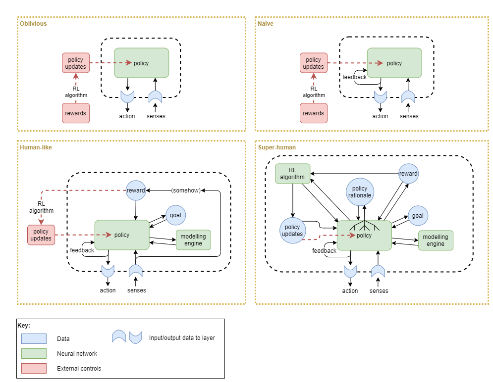
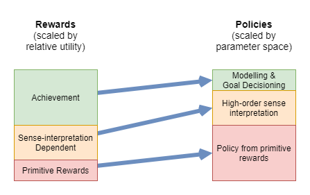

This page forms part of the [[Proto AGI v1]] series.

General intelligence is a classic ill-defined problem: we don't understand it well enough even to define what it is. Many have attempted to define it, but there is no agreement. We don't have a way to measure whether something has general intelligence or not, or the level to which it has general intelligence. We don't have a clear idea of what characteristics should definitely be included vs excluded. In many cases the discussion is further muddied by disagreement on whether to focus on _human-like_ intelligence or a more species-agnostic view of general intelligence. 

One useful technique is to classify what we know. As such, this section is devoted to a detailed analysis of what we know, and what we can take some reasonable guesses about. The end result is that we will:
* identify some characteristics that are worth trying to build into our solution,
* be able to measure the extent of effectiveness of our solution against some defined levels of capability, and
* hopefully gain some insight into how to build it.

# Characteristics of General Intelligence

According to Wikipedia's article on [artificial general intelligence](https://en.m.wikipedia.org/wiki/Artificial_general_intelligence), "there is wide agreement among artificial intelligence researchers that intelligence is required to do the following:
* Reason, use strategy, solve puzzles, and make judgments under uncertainty;
* represent knowledge, including commonsense knowledge;
* plan;
* learn;
* communicate in natural language;
* integrate all these skills towards common goals".

In my own view, some of the key features include:
* acquire and recall knowledge
* reasoning, including:
    * deduction
    * induction
    * inferrence
* autonomy
* learning

However, an agent that is missing just one or two of the above list may perhaps still be considered to have general intelligence.

In any case, my current view takes a slightly different approach that initially side-steps the problem of trying to quantify general intelligence. I ask the question: how can we _build up to_ an artificial general intelligence. The focus here is to examine how humans operate, and to follow some of those principles. With that in mind, here's what I've got so far, highest priority first:

1. The agent needs to be able to interact with an environment, under constraints.
    * Interact with an environment creates data to learn from and adapt to. Without that it is too hard to define a problem space that is generic enough for generic intelligence to arise.
    * The agent needs constraints that restrict what it can do, so that the learning space is manageable.
    * The agent needs constraints applied to it that make it obligatory to explore and learning to adapt to the environment. Eg: that it gets hungry and must find food to prevent death. Without such a constraint, it could sit idly forever and never learn anything.
2. The agent must have autonomy over its learning, and this autonomy must be built in from the start.
    * From the most basic bootstrapping of learning, the agent's learning should be driven by its own internal reward/goal system.
    * That internal reward/goal system may be very primitive to begin with, but it must grow and be modified from experience just like all other learning.
    * It is only by incorporating that self-driven learning from the start that it can learn to use its own intelligence to govern its own learning.
3. The architecture of the agent must enable its executive control layer to operate against high-level abstractions.
    * This is fundamental to reducing the learning search space for the executive control layer.
    * It's also clear that humans operate at this level.
4. The executive control layer operates as a state machine.
    * As per [[A Theory of Consciousness]].
5. It must have memory.
    * Necessary in order to produce a _train of thought_.
    * Memory is the architecture that enables the agent to comprehend and rationalise about things across time.
6. It needs to be capable of modelling the difference between itself and the outside environment.

# Thought Levels

(tbd: flesh out further)

Daniel Kahneman characterises thought into two categories, System 1 and System 2 thought, by making a distinction between whether the thought is produced heuristically and immediately, or from slow deliberated thought, and the suggestion that these two thought styles much employ different systems within the brain.

I find that distinction extremely useful as it fits very well with my theory on the architecture of the conscious part of the brain as desribed in [[A Theory of Consciousness]]. I also find it useful to re-characterise System 1 and System 2 in terms of that architecture, and to propose one more level, System 0, that characterises another kind of thought. Described here:

**System 0:**
* Processed and actioned on without conscious awareness.
* May or may not become consciously aware afterwards.

**System 1:**
* Thought produced via single pass through predictive systems that is subsequently actioned consciously. 

**System 2:**
* Thought that requires multiple passes through conscious part of brain. 

# Biological Constraints

All biological life forms evolve in the context of constraints that impact their ability to maintain life and to succeed in procreating. While these constraints may not be directly necessary for general intelligence _per se_, they are important context for how general intelligence has evolved in humans. Some such constraints act on the individual during their lifetime, acting as motivation drivers, affecting their exposure to different experiences, and thus affecting what they learn. Other constraints act only at evolutionary scales. I shall attempt to identify the constraints that had the most impact on the evolution of human intelligence, and to classify them as "learning" or "evolutionary" constraints.

Evolutionary constraints:
* The process of evolution itself - provides a mechanism for experimenting with different architectures and tuning parameters. with its own inherent limitations. eg: the vast majority of adaptations are achieved through gradual improvement on top of existing adaptations.
* Evolutionary success factor - the evolutionary reward function measures the ability to produce many healthy offspring. Note that this is a subtly different reward function than the one that drives day-to-day experience (hunger, sex, etc.). 
* An increasingly complicated social structure
* Parallel evolution of body and brain

Individual learning constraints:
* The need to repeatedly consume food
    * Hunger provides a reward function that operates over relatively short timescales
* The need for protection from the environment (including weather and predators)
    * eg: Finding shelter from the rain offers almost immediate reward
* Brain capacity grows as the individual matures

# Axis of Comprehension

It occurs to me that there are multiple axis across which an agent might be capable of comprehending and rationalising. The distinction between the different axis fundamentally comes down to the mechanics of how that comprehension can be achieved. For example, memory is necessary in order to comprehend the effects of time. In contrast, memory is not required in order to comprehend physical space without the impacts of time: an agent can see in an instant that one object is above the other, without needing to remember anything.

Some of those axis might be:
* Physical space
    * At a point in time, understand _location_ of things, the relation between different things, and the relationship between those things and itself.
    * Generate actions that are considered in the context of physical space.
* Time
    * Understand that events can occur across time, forming a sequence of events. 
    * Understand the relationship, across time, between two or more events.
* Physics
    * Doesn't need to understand anything about physics, but should be able to predict it.
    * Be able to learn to operate within the physics of the environment.
    * Be able to learn to predict how those physics will affect things or play out. eg: that a ball drops to the ground if you hold it up and let go.
* Thing space
    * Number
        * Understand that things have _number_.
        * Be able to count - at least to some extent.
        * Understand simple mathematical relationships. eg: if you have some balls, and you take one away, then you have _less_ balls than before.
    * Boundary awareness
        * Understand that things have boundaries.
        * Awareness of itself as its own boundary.
    * Class vs Instance
        * Understand that two things that look alike or similar have the same class but are not the same instance.
        * See stages of Piaget's sensorimotor learning theory, and how human babies don't understand this distinction to start with.
    * Composition of things
        * Understand that larger things can be composed of smaller things.
    * Label
        * Be able to use labels to refer to things.
        * Be able to compose labels into hierarchies and rationalise about things at the higher levels of hierarchy
    * Physical vs Abstract
        * Be able to build up knowledge and rationalise about abstract concepts that are not physical things.
        * This includes 'thought' and thinking about the fact that it has awareness of its own thoughts (Iteration 2 or 3 of Visceral Loop?)
* Self
    * Not sure if this just falls under 'thing space' but it might be different.
    * Ability to observe its own actions and thoughts, and to know that they are its own.
    * Ability to comprehend that it has voluntary control over itself.
    * Ability to set goals, with consideration to how those goals will affect itself.

# Executive Observability

Human conscious experience has some specific characteristics that inform us about the kinds of data that is available to the highest level _executive control_ layer of the brain. Some things that we can observe and think about include:
* our physical senses
* our own thoughts
* our goals
* observation of motor control error
* primitive reward signals (eg: pain, pleasure)
* emotional interpretation of rewards from teacher roles around us (eg: parent saying "no" or smiling)

Within [[A Theory of Consciousness]], I propose Visceral Loop Theory as a mathematical summary of the computational aspects of conscious experience. In short, it says that an agent can only observe and think its own awareness through multiple iterations of its main processing loop. In particular, an agent _experiences_ something only after at least two iterations of that loop: the first iteration receives a sense signal and produces an action output, the second iteration takes that action output as input and deduces something about the action output and its relation to the agent's _self_, and lastly during the third iteration the agent uses that deduction to generalise about its awareness of its own thoughts.

So, with reference to Visceral Loop Theory, we say that there is _executive observability_ of some data if the policy within the executive control layer has sufficient access to the data that i) it can produce outputs that relate directly to that data, and ii) that there is _executive observability_ of those outputs. In practice, this means that the policy's outputs are fed back as additional inputs, and that the main data is question is either a direct input to the policy (at a representational level suitable for the policy) or that the policy holds it as recurrent state.

The ability to classify data as having executive observability is important for judging the level to which an artificial network architecture has any possibility of emulating conscious experience. Given our lack of understanding of what general intelligence truly is, this becomes our proxy for measuring the level of AGI that we've produced. Another way of looking at this is to take an example artifical network architecture, focus on the main policy network within the highest level layer (assumwed to be the executive control layer) and imagine what kind of experience a sentient bearing would have should it be based on the architecture surrounding that policy network and based on the assumption that visceral loop theory informs us of what a sentient being experiences. Such as in the network architectures pictured here:

So, with the definition of executive observability in hand, let's look at the above network architectures and classify what kind of executive observability they have. 

**Oblivious:**
* No executive observability of policy inputs or outputs.
* This is a purely mechanical network without any visceral loop activity. A sentient being with this kind of network, would experience only a permanent void. Or rather, it would definitely not be sentient in any way. 

**Naive:**
* Executive observability of policy output only
* No observability of error or reward signals
* No observability of policy updates (from training)
* A sentient being with this kind of network could be aware of the world around it (its senses), and of the interactions (actions) between its body and the world. But it would feel entirely passive, trapped in a body that it had no influence over. It would not be aware of _why_ the body interacted in the way that it did, nor would it have the ability to model the policy sufficiently to infer or predict the _why_. The salient being has no ability to monitor its own behaviours over time, and so would not notice that its policy changes; however its sense input may include an element of prediction, which could identify when the policy is updated from training.
* Network architecture variations possible that still fall under this classification:
    * The feedback loop could be replaced by use of memory or a modelling engine that captures policy outputs and enables modelling of the policy. This could provide post-hoc executive observability of the policy output, however it only replace the capability of the feedback loop in a weak way because it does not provide immediate feedback.
    * The feedback loop could be replaced by the policy holding internal recurrent state. In order for the policy to have executive observability of its policy output, the internal state needs to accurately correlate with the output. Without that, the policy cannot observe and perform furthure computations about its own outputs, and connot satisfy the requirement for being passed through multiple iterations of the visceral loop. Thus, the problem with building an architecture of this sort is that there is no guarantee that the internal state will accurately reflect the policy output, and it is likely to reduce to the Obvilious network above.

**Human-like:**
* Executive observability of high level errors and rewards 
* Executive observability of intermediate states in complex high level thought
* Executive observability of high level policy outputs
* Executive observability of goals
* Post-hoc executive observability of policy changes over time (through modelling / memory)
* No observability of policy calculations
* A sentient being with this kind of network (like a human) has a balanced amount of awareness and control over its own operations. It often constructs its own short-term and long-term goals and then proceeds to execute actions in order to achieve those goals, and furthermore uses the achievement of those goals as intrinsic reward. There are also many computational processes for which it is only aware of the output (referred to by Daniel Kahnemann as "System 1 Thought"), or even just the effect after the action has already been carried out (eg: reflexes).
* Network architecture variations possible that still fall under this classification:
    * Goals may not be discrete data units, and instead may just be internal recurrent state with the policy. This makes sense because not all actions have correpsonding goals; sometimes they are just instinctual immediate rections to unexpected stimuli.

**Super-human:**
* Executive observability of policy inputs and outputs
* Executive observability of policy internal computations (ie: of why an action was chosen) 
* Executive observability of goals
* Executive observability (and control) of reinforcement algorithm rewards and the policy updates from it
* In addition to the experience of a human-like sentience, a super human sentient being with this network would have total awareness and control of its own policy network, including its internal operations. It would never experience an instinctual action or suddenly "just knowing something, because it would have full awareness of how it reached all computationl states.

# Phases of Adaptation

Learning, and adaptation in general, can be broken down into a few phases. They vary by their timescales, and are differentiated by the underlying mechanisms necessary in order to produce the adaptation. Each phase, in order, acts as a source of learning for subsequent phases.

1. Just-in-time adaptation:
    * This phase of adaptation occurs as an application of the flexibility already built in within existing skills and knowledge.
    * It may include the use of short-term working memory; in the sense that short-term working memory is used to govern sequences of actions and critical thinking. The memory of the event could be completely forgotten afterwards.
    * This adaptation occurs during a single sequence of events, over very short timescales (a few minutes at most).
    * No learning or longer term change in behaviour occurs during this phase.
    * The level of complexity of adaption here does however depend heavily on the longer term adaptions from other phases.
    * Example: attempting to write with a pen, discovering that the pen has run out, and getting another pen from the drawer.
    
2. Memorisation:
    * This phase uses medium to long term memory of events to adapt to situations without technically learning anything.
    * It also excludes changes to 'mental models' (the subject of the next phase).
    * Like the just-in-time adaption phase, the level of complexity of adaption here depends on longer term adaptions.
    * Example: see someone try a particular approach that works, and then try it yourself.
    * Example: try different approach for a problem than previously tried, even with a period of days in between. 
    * Example: when about to sit on a particular chair, remembering that the last time you sat on that chair you fell off -- without having updated any mental models about why certain kinds of chairs may be unstable.
    
3. Mental model updates:
    * Within this phase, adaption is achieved through incorporation of new knowledge or experiences into the high-level representational models that we create in order to understand the world.
    * This is more abstract than just memorising a particular event. In fact, the actual event(s) that triggered the mental map updates may be forgotten.
    * The timescales over which this occurs can vary widely, from a few seconds to years.
    * Mental models may be updated automatically as new facts are acquired, or may result from consciously working through a problem and reaching a conclusion.
    * Example: realising for the first time that some chairs 'swivel', and that they're easier to topple over, and from then on recognising swivel chairs as being different to non-swivel chairs.
    * Example: learning about the world through reading books.
    
4. Long-term skill potentiation:
    * Here I use _skill_ in a very broad sense, referring to any physical or mental capability that can be done without conscious orchestration, and also including the capabilities of thought itself.
    * Could be applied at any layer.
    * Typically only occurs over medium to long timescales - hours to years.
    * Examples: walking, talking, working with the hands, driving a car, learning to think, learning problem solving skills.

I suspect that for the majority of new physical and mental skills, their development undergoes each phase in turn.

## Example
In order to clarify this, I offer a learning example annotated with how I suspect it interacts with the phases:
* A right-handed child is learning to write with a pen. They first pick up the pen with their left hand, and upon instruction swap the pen to their right hand. This is just-in-time adaptation.
* The event also feeds into the memorisation phase: in the next class they will remember being told to use the right hand. They will need to carry that out consciously for a few times before a _habit_ (long term potentiation) sets in.
* During practice they will be told many things about how letters are formed, about how they should look. All of those instructions (at least those not forgotten) will initially be adapted to through memorisation, but will also be used to build mental models about hand writing in general, and about the construction and appearance of individual letters. Following that, the teacher no longer needs to give feedback when the child's writing is messy - because they will judge that for themselves. Furthermore, the child will use the teacher's and their own feedback to develop mental models about how to drive their hands and fingers in order to produce the desired outcome.
* Initially memorisation and mental models will continue to be used by the child to drive their actions and judge their own success. Through practice, and over time, the ability to control the pen develops, the quality of writing improves, and there will be less dependency on memories and mental models to govern action. Eventually they will cease to be used on a regular basis - once the skill has been achieved sufficiently that the child no longer consciously controls how to write. The mental models may be occassionaly consulted when making a mistake or writing some less familiar.
* Later, when learning maths, the writing skill is depended on without conscious control, and it frees up the learning phases for the more complicated task at hand.

## Capabilities required for adaptive phases
The above phases suggest certain machinery:
1. Just-in-time adaptation depends on:
    * Short-term working memory.
    * External and self-produced feedback
    * Existing capabilities acquired as a result of all other phases.
2. Memorisation adaptation depends on:
    * Medium and long term memory and recall of events.
    * Executive and sub-executive control capabilities sufficient to be able to act on information from memories.
3. Mental model-based adaptation depneds on:
    * Mental modelling capability.
    * External and internal experiences as source of input.
4. Long-term skill potentiation depends on:
    * Modality dependent trainable components.
        * This may not require any new components. Rather, perhaps it just means that each layer needs to be trainable.
    * Self-driven reward

On a side note, for many years neuroscience and psychology have struggled to understand how humans can apparently learn so fast. I suspect the answer is the way that shorter term adaption phases can be used to bootstrap development in longer term phases.

(tbd: tie into actual neuroscience/developmental psychology theories in this area, and on what the known brain regions and pathways are)
    
(tbd: biological background discussing different potentiation levels with different durations)

(tbd: probably need to add some extra phases to support different biological neural potentiation levels)

# Training Signals

How do humans receive the error signals used in supervised learning circuitry, and reward signals that are used in reinforcement learning mechanisms within the brain? This section examines error signals and rewards across biology and AI.

## Reward Levels

The rewards that a high-functioning general intelligence learns from are complex. In order to attempt to make sense of that, the following diagram categorises the rewards and illustrates how complex those rewards are to learn useful policies from.

The rewards can be further distinguished into levels identified by their dependencies and where they apply within the development stages:

|Order|Thought Level|Reward Category|Brief Description|
|---|---|---|---|
|1|System 0 and 1 |Primitive                        |Wiring-level mechanisms that don't require training of a neural network|
|2|System 1       |Goal achievement                 |Automated "sense of achievement" upon attaining goals|
|3|System 1       |Pre-trained domain-specific      |Evolutionarily embedded neural networks "pre-trained" before birth|
|4|System 1       |Internalised                     |Automated habitualised form of teacher rewards|
|5|Systems 1 and 2|Teacher                          |Conscious observation and interpretation of messages from teacher roles|
|6|System 2       |Self-determined                  |Fully conscious self judgement|

### Primitive rewards
Examples:
* Pain / Pleasure 
* Hunger / Satiation
* Temperature discomfort 
* Learning quotient (curiosity, dopamine signalling?) 
* Effort
* Predictive errors

Sparse. Low-fidelity. Operates within Systems 0 and 1 thought.

These are the simplest reward signals, supplied to a network from simple raw primitive senses. The reward signals are fed from simple wiring-level mechanisms that don't require training of a neural network to interpret. In biology, these would likely be the earliest reward mechanisms to evolve, and in they would grow within an individual and be largely fully formed during foetal development. Some such signals are often sparse and with low-fidelity (eg: I'm either hungry or I'm not). Many are closely related to systems that elicit responses without conscious involvement (eg: reflexes, hunger leading to stomach activity, temperature leading to sweating or shivering). Some primitive rewards operate only as error signals between low-level layers and may not have executive observability, while others have executive observability "after the fact" (eg: after reflex action has occurred), or indirectly (eg: feeling of stomach activity).

In a complex environment, a 'teacher' may choose to leverage some of these mechanisms (eg: pain or pleasure).

It is hard for an AI to learn a good policy from sparse and low-fidelity rewards. In many AI solutions, sparse and low-fidelity rewards are supplied against the most low-level sense interpretation layers, where the policy search space is very large. The resultant limb movements are often jerky. This can be improved by including suitable additional primitive rewards that help to improve the quality. For example, _effort_ can be used to influence the efficiency of ligament movement.

Biology clearly has the same problems as AI does with primitive rewards: that in complex environments with high dimensionality it takes a long time to optimise for a good result. For example, evolution took a long time to migrate from single-celled organism to mammal.

### Goal achievement rewards
Examples:
* Sense of achievement of self-defined goals

Frequent and high-fidelity. Operates within System 1 thought.

Automated intrinsic reward upon attainment of a goal, as measured via a pre-wired system that compares observed state to intended goal. Operates primarily against short-term goals.

It's not clear whether this is a biologically plausible reward system.

### Pre-trained domain-specific rewards
Examples:
* Smiles
* Frowns
* Fear (primitive recognition only) 
* Body language (primitive recognition only, if any)
* Surprise / uncertainty (_a la_ the free energy principle)

Operates within System 0 thought.

This category of reward requires neural networks for interpretation of senses, except that they are required prior to the opportunity to sufficiently learn from environmental experience. I assume that their network structure is thus genetically encoded, and that they are effectively "pre-trained" during foetal development. Sometimes also results in hormone signals that then act as simple primitive rewards/learning signals.

### Internalised rewards
Examples:
* Internalised version of all of teacher rewards mentioned above
* Sense of achievement of externally defined goals (internalised encouragement)
* Fear (internalised discouragement)
* Surprise (depends on learned models and prediction)
* Impatience

Operates within System 1 thought. Frequent and high-fidelity.

These are habitually formed internalisation of teacher rewards. Ie: from slow prediction learning systems. While they depend on teacher rewards to develop, they operate in a much less conscious way than teacher rewards, and thus are listed first.

It's interesting to observe that this form of reward is the source of stress in humans, due in part to its high frequency and the fact that it is an internalised reward metric that may not be accurate.

### Teacher rewards via learned domain-specific recognition
Examples:
* Body language 
* Telling off
* Encouragement 
* Social cues

Operates within Systems 1 and 2 thought. Often higher-fidelity, but can be frequent or sparse.

Rewards and punishments given by someone fulfilling the general sense of a teacher role at the time. The reward is processed via mental modelled hierarchical learning, that is built up on top of domain specific primitive rewards. Probably still with some genetically embedded propensity to learn these models.

It includes rewards received by interpreting social feedback, such as from someone critiquing our actions, or from the result of our social interactions with potential friends. It also includes other cognitive interpretation of senses, such as 'surprise' or 'uncertainty' (_a la_ the free energy principle). Examples: teachers saying "good boy" or "no", teacher smiles, teacher frowns, popularity, de-friending, isolation.

Complex networks are required to undestand social cues, based on interpretation of the senses. This form of policy builds on top of the policy learned from primitive rewards, in the sense that the agent likely would never reach the cognitive ability to intepret its senses sufficiently to understand social feedback it it were not for the primitive rewards acting as a bootstrap mechanisms for learning.

### Self-determined rewards
Examples:
* Reflection on achievement of own goals (more than just internalised achievement reward)
* Reflecting on one's own character and/or lifestyle
* Perfectionism

Operates within System 2 thought.

Rewards that depend entirely on the agent's own measure of success.

Here, mental modelling is used to construct goals, and then mental modelling and prediction is used to recognise achievement or the lack thereof. Thus, the agent rewards itself based on a measure that it has devised itself. These rewards depend on mental models that the agent builds about the world, based on experience and its ability to deduce self-consistent meaning from its experience.

While it primarily operates within System 2, it also further adds to internalised rewards and can even be used to change past learned internalised rewards (although often with some difficulty).

## Styles of RL Training Mechanism

**Embedded:**
* tbd

**External:**
* tbd

With the above in mind, we another important term to define...

**Embeddable:**
* An RL mechanism or training technique that is capable of being embedded.

# Executive Control Capabilities

I now present a more detailed analysis of human mental capabilities, focussing primarily on capabilities under executive control.

_(tbd: notes in "Page - To Note Down")_

|Capability|Primary Thought Systems|Description|
|---|---|---|
|Prediction|System 0 + 1|..|
|Habitial Action|System 0 + 1|..|
|Emotions|System 0 + 1|..|
|Spatial Understanding|System 1 + 2|..|
|Social Understanding|System 1 + 2|..|
|Language|System 1 + 2|..|
|Memory|System 1 + 2|..|
|Spatial Planning|System 2|..|
|Non-spatial Planning|System 2|..|
|Simulation|System 2|..|

