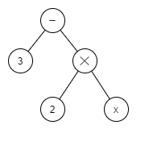

# PREPRINT DRAFT

## Title: A Characterisation of processing loops in AI and biological systems and its implications for understanding Consciousness - Extended Version

# Abstract

The claim is made that cycles of non-physical "mental" actions are required in agents that operate within complex environments, and that such actions require regulation through the use of a model. A framework is proposed, named the _Visceral Loop_, that identifies three distinct kinds of processing within such a system in terms of how it uses that model. It is shown that this can be used to characterise human thought, including about thought itself, and how it is involved when an individual concludes that they are conscious. A proof is given relating an upper bound on data available within access consciousness to the Visceral Loop characterisations of thought.

# Introduction

_tbd_: should this be rephrased in terms of recurrency?

Any computational system is limited in the complexity that it can handle within a single computational step. For embodied agents, this appears as a limit on the environmental complexity that they can sufficiently model and respond to within a single observe-infer-act cycle. For more complex problems, multiple steps of processing are required in order to determine the next physical action. Such multiple processing steps may entail, for example, further analysis of the environment in order to better model its state; or it may entail action planning over multiple iterations.

_TBD_: add references to biology papers showing strong use of recurrence.

In biology, this provides scope for evolutionary pressures to trade off between a more energy hungry complex brain and a simpler less energy intensive one that takes longer to make some decisions. Van Bergen & Kriegeskorte (2020) make the case that recurrency is indeed employed in biology for that very reason.

This paper makes the claim that an agent that employs _multi-step processing_ (ie: multiple cycles of processing without producing physical action) also must employ a model of its own processing capabilities in order to regulate its _non-physical actions_. Different agentive architectures support different abilities for the agent to introspect the internal structure of that model. A framework, the _Visceral Loop_, is offered as a way to characterise an agent's ability to introspect those models and to use it for drawing inferences about itself. Some examples of the descriptive power of the Visceral Loop will be given. Of particular interest is that the Visceral Loop shows how an agent, such as a human individual, may reach the conclusion that they are conscious.

The rest of this paper is structured as follows. The Regulation, Model, and Schemas sections set the scene by elaborating further the need for regulating models, and suggest how they are manifested within humans. The Visceral Loop section presents the core thesis of this paper. The Consciousness and Analysis sections examine how the Visceral Loop can be applied to understanding aspects of consciousness. Final thoughts are presented in the Summary section.

# Regulation

_tbd_: needs a better intro in this first section, current starting is a bit jarring. eg: "Agents that operate within an external environment for the purpose of manipulating that environment, or part thereof, towards a target can be described as _regulators_ of that environment."

An agent that regulates its environment operates within a system containing environment state `S_env` which changes with some ambient dynamics `D_env(t)`. The agent must perform an action, `A_env`, against the environment in order to regulate itself towards some target. After an action has been executed the environment state outcome `O_env` is influenced by both `D_env(t)` and `A_env`. This can be summarised as the following equation:

    S_env + D_env(t) + A_env = O_env

According to the _good regulator theorem_, if the agent is to regulate the environment state it must be a "model of the system" (Conant & Ashby, 1970). Furthermore, we can say that the efficiency of the agent to regulate its environment depends on its accuracy in modelling the system. Errors in the accuracy of the model result in errors in the regulation of the system. In learning agents, those errors are used for subsequent training of the model.

An embodied agent with complex actions may require an additional level of regulation. For example, an animal must not only regulate its external environment, but also regulate its own physical state. This includes both maintaining homeostasis and controlling action for efficiency and effectiveness. The agent performs action `A_body` against its body with the intent to regulate the body towards efficiently achieving environment action `A_env` while satisfying its requirement for body homeostasis. Such an agent thus operates in a system that additionally has body state `S_body` with ambient dynamics `D_body(t)`. The agent performs action `A_body` against its body, producing outcome `O_body`, summarised as follows:

    S_body + D_body(t) + A_body = O_body
    
Agents that incorporate multi-step processing have a third kind of action: one that changes its internal data state without affecting its physical state. Importantly, this system also requires regulation for the same reasons as for environment and body, but such _non-physical_ actions do not elicit any change to `S_body` or `S_env`. Thus the agent must regulate its non-physical state `S_mind`, having ambient dynamics `D_mind(t)`. The target state in this case is dynamically inferred based on its requirement for environment action `A_env`, body action `A_body`, and possibly for some form of non-physical homeostasis of `S_mind`. In order to regulate towards that target it performs action `A_mind` producing outcome `O_mind`, summarised as follows:

    S_mind + D_mind(t) + A_mind = O_mind
    
By way of example of the importance of such mind regulation, consider the case of fluent aphasia caused by damage to the Wernicke's area of the brain (_Wernicke's area_). Individuals with fluent aphasia can easily produce speech, but it is typically full of many meaningless words and often unnecessarily long winded. Wernicke's area is associated with language comprehension. In a neurotypical individual, the comprehension of their own vocalizations provides a corrective mechanism.

# Models

All of the systems described above are of the form `S + D(t) + A = O`. The production of the optimal action `A` for a given situation can be computed by a function, `f`, such that `A = f(S,O) = O - S - D(t)`. In this way, function `f` becomes a _model_ of the system in exactly the way meant by Conant and Ashbey. There are many different ways of constructing such a function, with implications on how much its inherent model can be introspected for purposes other than merely computing the next action.

Consider the following function. This function is, for example, effective at predicting the action required to regulate towards a target state of `3` by doubling the input signal and comparing to that target state. However, an agent that merely uses this function to calculate actions cannot inspect anything about the function other than the actions it calculates for different inputs.

    f(x) = 3 - 2x
    
Alternatively, consider the following diagram, which shows an _abstract syntax tree_ (AST) of the function above, of the sort used in computer science to parse an expression within a software compiler (_Abstract syntax tree_). A regulating agent could use this AST to calculate its next action, instead of using the function above, and achieve the same outcome. However, the AST is a more explicit model of the dynamics being regulated. The components of the original function are represented individually and thus they can be individually queried. So here the AST can be introspected and much more can be derived from it that may apply either to the system being modelled or to how the AST models that system. 

The function and the AST are two forms of model with very different introspective opportunities. Consider now the task of constructing a set, `F`, that contains all beliefs that may be drawn from the model. In the case of the function, pairs of input and output action values are all that can be drawn from the model, ie: `<0,3>, <2,-1>, <-3,9>, <-1,5>`, etc. The AST supports the ability to draw those same pairs of input and action values. However the AST also supports that many other beliefs may be drawn from the model and added to `F`. For example that i) the target is `3`, ii) the input signal `x` is scaled by a factor of 2, and iii) the execution of the function depends on the operations of _subtraction_ and _multiplication_.

So, it is clear that different architectures enable different levels of _introspection_ of the underlying models. What about the case for neural networks? In the modern use of artificial neural networks (ANNs), it is commonplace to refer to ANNs as a _function approximator_ (Goodfellow et al., 2016), and indeed many networks fall into the category of a function. For example, in _model-free_ deep reinforcement learning (RL) an ANN is used to calculate either the next action or the expected value of a possible action given the current state (Lazaridis, Fachantidis & Vlahavas, 2020). The architecture of the RL algorithm treats the ANN as a function without any introspective capabilities. There is also _model-based_ RL. One variant of _model-based_ RL uses ANNs to predict the expected outcome of executing an action. The introspective ability here is the same as for _model-free_ deep RL -  the ANN is treated as a function. For the RL models mentioned so far, the set `F` of beliefs is of similar content: `F` is the set of `<state,action>`, or `<state,action,expected-value>`, or `<state,action,expected-outcome>` tuples, respectively. There do exist forms of model-based RL that use something more akin to the AST, usually where there is a known physics model that is represented mathematically, and which could potentially be used to introspect for more than just `<state,action,outcome>` tuples. However, a significant point to note here is that ANNs, and neural networks in general, may not lend themselves naturally to introspection on their own.

For that reason, a third form of model exists, whereby a secondary model predicts the behaviours of the former. The secondary model may, for example, be a second ANN that captures aspects of the same underlying system but at a more macro level, and it may be more suitable for integration with other data. This macro representation is at the core of the theory of Higher Order Thought (Rosenthal, 1997 & 2006) and recent theories based on it, such as Hierarchical Active Inference (Giovanni _et al_, 2018) and Integrated World Modeling Theory (IWMT) (Safron, 2020).

All of that is to show that some architectures enable more _introspection_ of the underlying model than others.

## Schemas

Psychology has long identified in humans the existence of a model of the individual's body - known as the _body schema_. A good definition is given by Morasso _et al_: "In summary, we view the body schema as a set of fronto-parietal networks that integrate information originating from regions of the body and external space in a way, which is functionally relevant to specific actions performed by different body parts. As such, the body schema is a representation of the body’s spatial properties, including the length of limbs and limb segments, their arrangement, the configuration of the segments in space, and the shape of the body surface; it can also incorporate, after suitable training, the spatial/dynamic properties of tools employed by skilled users" (2015). So the body schema is used in action control, it integrates information from proprioceptive senses (Proske & Gandevia, 2012), and it is at least in same way accessible to conscious thought. Thus, at least in humans, the body schema is accessible for some introspection. The body schema provides that important role of model in the task of regulation of the body and physical action.

This paper hypothesises the existence of a second kind of schema, the _mind schema_, that performs an analogous role for the regulation of the mind and non-physical actions. Anecdotally, this seems highly plausible within humans given our introspective ability towards our own mind's capabilities. For example, we can know that we are good at focussing, but struggle with maths, that we are more creative when background music is present, and that we need the support of tools to help remember people's names (eg: a notebook). The underlying notion here is that the mind schema helps us to control, monitor, predict, and rationalise about our mental structure in the same way that our body schema does that for our physical structure, and that the brain likely employs very similar architectures for both.

On first reading this may seem counterintuitive. Likely the greatest reason for seeming counterintuitive is that physical space is euclidean and, being subject to our tools of objective analysis, we are able to understand how things relate to each other within euclidean space. Thus we can envisage and even replicate how a neural network might model those underlying euclidean relationships. In contrast, we have very limited ability to understand the shape of the state space of the mind, and it is harder to imagine how those same neural networks might model that state space. The argument offered here is that such a conclusion is drawn merely from the lack of our imagination; a neural network is suitable for modeling non-euclidean state space too. A detailed analysis and stronger argument for the existence of a mind schema is outside the scope of this paper. The intent here was simply to show the importance of models for the purpose of the regulation of non-physical actions (a.k.a. thought), and to highlight the fact that we have some sort of introspective capability towards those models. For the remainder of this paper, the term _mind schema_ is intended to refer to that introspective capability without specifically trying to define the underlying mechanisms.

The suggestion of a mind schema has also been made in the form of the _Attention Schema Theory_ (Graziano & Kastner, 2011; Webb & Graziano, 2015; Graziano, 2017), although the meaning there is perhaps narrower than what is proposed in this paper.

# Visceral Loop

This paper introduces the concept of a _Visceral Loop_ as a characterisation of processing within a multi-step processing biological or AI agent. The Visceral Loop is so named because it refers to an agent concluding that it experiences consciousness in a visceral way. It identifies that an agent with sufficient representational capabilities can, at the most optimum, conclude itself as conscious within three iterations of the processing loop. Each of those iterations have specific characteristics, and the Visceral Loop can be used to characterise any thought as falling into one of those three iterations.

Let:
* `E` be the agent's set of beliefs about the external world
* `B` be the agent's set of beliefs about its own physical body (drawn from the body schema) and of bodies in general, and if it has a concept of its identity then this set includes a belief that relates other body beliefs to its identity
* `M` be the agent's set of beliefs about its own mind (drawn from the mind schema) and of minds in general, and if it has a concept of its identity then this set includes a belief that relates other mind beliefs to its identity
* `f(..)` be the function executed by the agent on the specified inputs in order to draw inferences

`M` can be thought of as an agent's "theory of mind", because it relates not only to itself but also to its ability to predict the hidden mental state of others.

**Iteration 1:**

_Iteration 1_ represents the most common kind of data processing, such as spending multiple processing cycles to refine the identification of something within the visual field. While an agent's mind schema may be used to regulate the thought process, the result of Iteration 1 never makes any reference to it.

Let `x` be an inference produced as the result of a processing step, such that it does not draw any reference to `M` (ie: `x ∉ M`, and if `x` is a relation then `x = relation(α,β)` such that `α ∉ M` and `β ∉ M` and `α ⊄ M` and `β ⊄ M`). Given some sense input or past state `s`, a processing step is characterised as Visceral Loop Iteration 1 if it is of the following form:

* `f(s, E ∪ B ∪ M) -> x`

**Iteration 2:**

_Iteration 2_ processing steps draw conclusions that relate past non-physical actions and conclusions to the agent's theory of mind and to the agent's concept of its identity. For example, concluding that a past data state or non-physical action is classified as "thought", concluding whether the primary source of a past data state was external or internal, or relating the fact of an internal source to the agent's concept of its identity.

Iteration 2 requires an agent to have sufficient representational capabilities to produce inferences that represent relations involving `M`. Given some prior inference `y`, a processing step is characterised as Visceral Loop Iteration 2 if it is of the following form, and the relation with respect to `M` is non-empty, and it can not be characterised as Iteration 3:

* `f(y, E ∪ B ∪ M) -> relation(y, M)`

**Iteration 3:**

_Iteration 3_ is a special case of what would otherwise be Iteration 2, but it implies stricter requirements on the agent's introspective and representational capabilities. Iteration 3 covers the ability for the agent to develop a summary of its own mental capabilities (ie: some subset `m ⊂ M`), and to consider that in relation to its conception of mental capabilities in general or to its identity (ie: `M`). Iteration 3 is involved in an agent concluding itself as conscious, as will be seen in the section below.

Given some prior inference `relation(z, M)`, and some subset of beliefs `m ⊂ M`, a processing step is characterised as Visceral Loop _Iteration 3_ if it is of the following form and the relation with respect to `M` is non-empty:

* `f(relation(z, M), E ∪ B ∪ M) -> relation(m, M)`

# Consciousness

The Visceral Loop has important implications for understanding consciousness, particularly in its _access consciousness_ interpretation (Block, 1995). Three examples of the descriptive power of the Visceral Loop in relation to human consciousness are presented here.

## Concluding oneself as conscious

In this first example, the Visceral Loop is applied to understand the thought processes whereby an individual concludes themselves as conscious. Consider the following sequence of internal mental observations:
1. "What's that red blob in the tree? Oh, it's an apple".
2. "Oh, those thoughts just came from my mind, and not from the outside world".
3. "That's what consciousness is. I am conscious".

The first observation is a straightforward example of Iteration 1 that does not make any reference to the agent's theory of mind (of their own mind or of others). The concepts of "red", "blob", "tree" and "apple" are all contained within the set `E`, and thus the inference in relation to the visual field sense input `s` is of the form `x_1 = relation(s, E)`.

The second observation contains two examples of Iteration 2 inferences. In the first, the individual's processing capabilities have selected attentional focus upon the prior Iteration 1 inference, and have drawn a subsequent inference about it as being data that can be classified as a "thought". As beliefs about "thought" are contained within `M`, this is an inference of the form `x_2 = relation(x_1, M)`. In the second, the individual draws a subsequent inference about the source of the Iteration 1 inference as being their own mind. The individual's ability to classify inferences in relation to themselves also depends upon `M`, and the inference is of the form `x_3 = relation(x_1, M)`.

The third observation draws upon the individual having an _a priori_ conception about consciousness in general, denoted here by `m_c ⊂ M`. The individual compares its prior Iteration 2 inferences `x_2` and `x_3` to `m_c`, and produces an inference that `x_2` and `x_3` together satisfy the requirements for consciousness. This is another iteration 2 inference of the form `x_4 = relation(x_2 & x_3, m_c)`. Finally, the individual relates `m_c`, the belief of consciousness in general, to itself, which again depends on `M`. That final inference is thus an Iteration 3 inference in the form `x_5 = relation(m_c, M)`.

## Content of conscious thought

As a second example of the descriptive power of the Visceral Loop, a theorem is presented here about the nature of human consciousness.

First an axiomatic baseline must be established. The author is unable to think of any rationale way in which they may consciously experience something and yet be unable to subsequently think about that experience and to know that they are thinking about that experience. This is the _transitivity principle_ of Rosenthal (1997). Thus, it would seem that being able to knowingly think about our conscious experiences is a fundamental component of consciousness. The following claims are derived from this statement without further proof (the veracity of these claims will be discussed in the next section):

Claim 1:
* All conscious experience is subsequently available for further thought.

Claim 2:
* For all thought about conscious experience, the individual can identify that thought as being their own.

Note that these claims do not assume that all conscious experience is actually thought about; only that it is in principle available for such thought. Additionally, no assumption is made about whether other kinds of thought are consciously experienced or not.

Theorem 1:
* the content of conscious experience is upper bounded by the data about which Visceral Loop iteration 2 inferences can be produced.

Proof:
* The _content of conscious experience_ here refers to the set of data represented and/or processed within the brain which is consciously experienced by that individual, in distinction to other data represented and/or processed in the brain which is not consciously experienced.
* Thought is a computational process, and thus is a series of inferences.
* As per claim 1, all of conscious experience must be available for producing subsequent inferences about those conscious experiences.
* As per claim 2, the individual must be able to identify that they produced those inferences.
* In order for an individual to identify an inference as being their own, they must have some beliefs about their inference capabilities and how they relate to themselves as an individual entity. This is included in the set `M`, which iteration 2 produces inferences in relation to, and which is not directly accessible for inferences within iteration 1.
* Imagine some supposed experience, and an inference `i` produced about that experience. Additionally imagine that an iteration 2 inference cannot be produced about `i`, for example, due to some incompatibility of structure, lack of data path to iteration 2 processing capabilities, or inherent limitation in iteration 2 processing capabilities. The inference `i` cannot be identified in relation to the individual. As such, the supposed experience fails on Claim 2 and `i` must be in actual fact an inference about some sort of non-conscious experience.
* Thus, an experience is not a conscious experience if it can only lead to inferences which cannot be included in an iteration 2 inference.

# Delayed awareness of decisions

The Visceral Loop can be used to understand other aspects of thought. For example, it explains why fRMI studies have suggested that we become aware of a decision after it is made (Soon, Brass, Heinze & Haynes, 2008) - because it takes extra processing cycles to consciously consider the fact of the decision being made.

In short, we can only think about one thing at a time, so the decision itself and thought about the decision require separate steps.

# Analysis

Theorem 1 is obviously applicable to access consciousness. The extent to which it is also applicable to phenomenal consciousness depends on the reader's preferred theory of consciousness.

...
...todo: look through these authors' works to classify their views into correlated vs uncorrelated:
> (source: https://plato.stanford.edu/entries/consciousness-higher/) Some claim that for a state to be conscious in the relevant sense is for it to be poised to have an impact on the organism’s decision-making processes (Kirk 1994; Dretske 1995; Tye 1995, 2000), perhaps also with the additional requirement that those processes should be distinctively rational ones (Block 1995). Others think that the relevant requirement for access-consciousness is that the state should be suitably related to higher-order representations—experiences and/or thoughts—of that very state (Armstrong 1968, 1984; Rosenthal 1986, 1993, 2005; Dennett 1978a, 1991; Carruthers 1996, 2000, 2005; Lycan 1987, 1996; Gennaro 2012).
...

The theorem offered above is likely acceptable to some, but will seem unreasonable to others. The issue lies in  Claim 1, which calls to a conflict between two different intuitions about the nature of interaction between _Phenomenal Consciousness_ (P-Cs) and _Access Consciousness_ (A-Cs). P-Cs is generally recognised as some sort of "what it is like-ness" of having experiences of senses, thoughts, and/or states (citation: Nagal). A-Cs refers to detailed executive control, such as rational thought. Block defines A-Cs states as "(1) ... poised for use as a premise in reasoning, (2) poised for rational control of action, and (3) poised for rational control of speech" (1955, p. 231).

Some theorists hold to a notion that P-Cs and A-Cs fulfil different functions and that one may exist without the other; although it is recognised that they seem to coincide most of the time (..citations..). Let's call this the "uncorrelated theorem". Others hold to the notion that P-Cs is the phenomenal experience of the data held and/or processed within A-Cs. Let's call this the "correlated theory".

Claim 1 is consistent with the correlated theorem. However, it is not consistent with the uncorrelated theorem, which holds that it is possible to phenomenally experience something without having access to it for thought. Thus Theorem 1 cannot be proven with certainty until the issue of these two notions of consciousness are resolved. However, there is a middleground that can be taken until such a time is reached. While it is indeed plausible that P-Cs and A-Cs are uncorrelated, there remains a strong overlap: most of P-Cs is available to A-Cs, and vice versa (..citation...). Thus, while Theorem 1 may not be true 100% of the time, it still remains a useful tool for understanding at least _most_ of thought. Furthermore, the Viscera Loop as a descriptive tool still offers tremendous benefit.

# Summary

The claim has been made that sufficiently complex environments and agent bodies require a trade-off between the inferential computing power of a single processing step versus the use of multi-step processing. In order to be a "good regulator" of its own non-physical actions, the agent must model its non-physical behaviours. Various different forms of such modelling are possible, and the characterisations offered by the Visceral Loop provide an insight into what kinds of self-referential thought are possible depending on the kind of model in use.

The Visceral Loop has been shown to offer significant insight into consciousness. More work is possible here. It should be noted that there are aspects of consciousness that the Visceral Loop makes no claim over. In particular, it offers no explanation for the so called "hard problem" of phenomenal consciousness (Chalmers, 1995) - the "what it feels like" aspect of consciousness. However, the author believes that stronger claims about the natures of both access consciousness and phenomenal consciousness can yet be made, based on the framework of the Visceral Loop.

The Visceral Loop provides a framework for classifying the capabilities of different processing systems.

_tbd_: closely related to the Higher-Order Thought Theory of Rosenthal (1997, 2006).

_tbd_:
* _Tie VL to need for computational models, as discussed by (Michael D. Colagrosso, Michael C. Mozer. 2004. Theories Of Access Consciousness. NIPS.)_
* _elaborate further on ramifications of VL_.
* Look for "Libet et al, 1983" as another example of becoming aware of something after the fact: "S is aware of something (P-consciousness) he mistakenly believes caused his response when, in fact, the latter was triggered by cerebral events which occurred prior to its phenomenal representation (see Libet eta!. 1983)."

The work presented here has implications for understanding consciousness, for the design of AI systems, and perhaps forms one of the necessary building blocks towards artificial general intelligence (AGI).

# References

Abstract syntax tree (n.d.). In _Wikepedia_. In https://en.wikipedia.org/wiki/Abstract_syntax_tree

Block, N. (1995). On a confusion about a function of consciousness. Brain and Behavioral Sciences, 18(2), pp 227–247. https://doi.org/10.1017/S0140525X00038188. \[[Full Text](https://www.nyu.edu/gsas/dept/philo/faculty/block/papers/1995_Function.pdf)\]

Chalmers, D. J. (1995). Facing up to the problem of consciousness. Journal of Consciousness Studies 2(3): pp 200-19. http://dx.doi.org/10.1093/acprof:oso/9780195311105.003.0001. \[[Full Text](http://consc.net/papers/facing.pdf)\]

Conant, R. C., and Ashby, W. R. (1970). Every good regulator of a system must be a model of that system. Int. J. Systems Sci., vol. 1, No. 2, pp 89-97. https://doi.org/10.1080/00207727008920220. \[[Full Text](http://pespmc1.vub.ac.be/books/Conant_Ashby.pdf)\]

Giovanni, P., Rigoli, F., Friston, K. J. (2018). Hierarchical Active Inference: A Theory of Motivated Control. Trends in Cognitive Sciences, Volume 22, Issue 4, 294 - 306. https://doi.org/10.1016/j.tics.2018.01.009

Goodfellow, I., Bengio, Y., & Courville, A. (2016). Deep learning. MIT Press.

Graziano, M. S. A., and Kastner, S. (2011). Human consciousness and its relationship to social neuroscience: a novel hypothesis. Cogn. Neurosci. 2, 98–113. doi:10.1080/17588928.2011.565121

Graziano, M. S. A. (2017). The Attention Schema Theory: A Foundation for Engineering Artificial Consciousnes. Front. Robot. AI. https://doi.org/10.3389/frobt.2017.00060.

Lazaridis, A., Fachantidis, A., & Vlahavas, I. (2020). Deep Reinforcement Learning: A State-of-the-Art Walkthrough. J. Artif. Intell. Res., 69, 1421-1471. https://doi.org/10.1613/jair.1.12412. \[[Full Text](https://jair.org/index.php/jair/article/view/12412/26638)\]

Morasso, P., Casadio, M., Mohan, V., Rea, F., and Zenzeri, J. (2015). Revisiting the body-schema concept in the context of whole-body postural-focal dynamics. Front. Hum. Neurosci. 9:83. https://doi.org/10.3389/fnhum.2015.00083

Proske, U., and Gandevia, S. C. (2012). The Proprioceptive Senses: Their Roles in Signaling Body Shape, Body Position and Movement, and Muscle Force. Physiological Reviews 2012 92:4, pp 1651-1697. https://doi.org/10.1152/physrev.00048.2011.

Rosenthal, D. M. (1997). A Theory of Consciousness. In N. Block, O. Flanagan, & G. Güzeldere (Eds.), _The Nature of Consciousness: Philosophical Debates_ (pp. 729-753). Cambridge, Massachusetts: MIT Press/Bradford Books. \[[Full Text](https://www.davidrosenthal.org/DR-A-Theory.pdf)\]

Rosenthal, D. (2006). Consciousness and Higher‐Order Thought. https://doi.org/10.1002/0470018860.s00149.

Safron A. (2020). An Integrated World Modeling Theory (IWMT) of Consciousness: Combining Integrated Information and Global Neuronal Workspace Theories With the Free Energy Principle and Active Inference Framework; Toward Solving the Hard Problem and Characterizing Agentic Causation. Frontiers in artificial intelligence, 3, 30. https://doi.org/10.3389/frai.2020.00030

Soon, C. S., Brass, M., Heinze, H. J., & Haynes, J. D. (2008). Unconscious determinants of free decisions in the human brain. Nature neuroscience, 11(5), 543–545. https://doi.org/10.1038/nn.2112. \[[Full Text](https://www.researchgate.net/publication/5443390_Unconscious_determinants_of_free_decisions_in_the_human_brain)/]

van Bergen, R. S., Kriegeskorte, N. (2020). Going in circles is the way forward: the role of recurrence in visual inference, Current Opinion in Neurobiology, Volume 65, Pages 176-193, ISSN 0959-4388, https://doi.org/10.1016/j.conb.2020.11.009

Webb, T. W., and Graziano, M. S. A. (2015). The attention schema theory: a mechanistic account of subjective awareness. Front. Psychol. 6:500. doi:10.3389/fpsyg.2015.00500

Wernicke's area. (n.d.). In _Wikepedia_. https://en.wikipedia.org/wiki/Wernicke%27s_area. 
