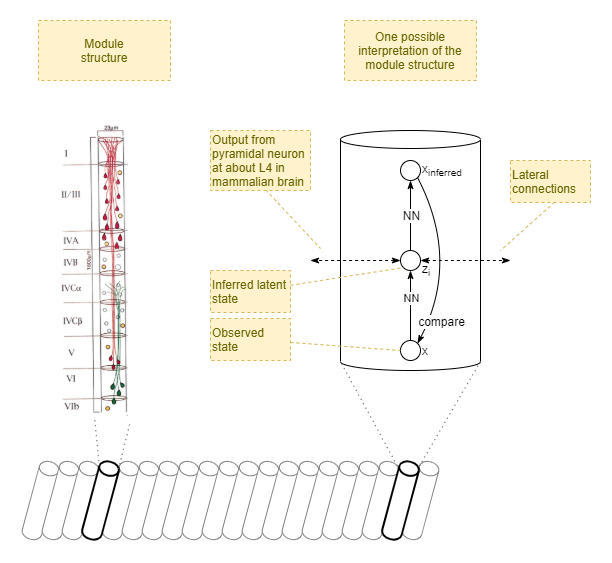

# Introduction

Modules within striate cortex of Macaque monkey (Mountcastle, 1997):

Columnar direction and axis (Mountcastle, 1997):

# Module Structure

# Hierarchical

# Bayesian Background

## Aleotoric Uncertainty
Given some generative process, where a latent state `s` (ie: unknown) produces an observation `o` (known), it is typically not the case that every exact value of `s` produces a consistent and unique value for `o`. Rather, the generative process usually has some _variability_. Thus, for a given value of `s`, the output `o` is sampled from a probability distribution `p(o|s)`. This is the _aleotoric uncertainty_ in the generative process.

## Epistemic Uncertainty
If modelling the generative process, we also have _epistemic uncertainty_: factors in our modelling process that mean that our inferred model is not accurate. These can occur from over simplifications (eg: using a simple mean plus standard deviation to model the probability distribution), from systemic uncertainty in the structure of the generative process, from systemic variability in our measurements, and from the fact that the model has to be _learned_ and thus starts off very inaccurate.

But the biggest epistemic uncertainty comes from the nature of the generative process itself. In addition to a generative process rarely producing consistent `o` for a given `s`, it also rarely produces unique values of `o`. Multiple different `s` can produce the same `o`. In other words, the probability distributions across multiple `s` often overlap. Thus, when inferring `s` from `o` even under a perfect model, there is also a probability distribution, `p(s|o)`, that reflects the epistemic uncertainty in the value of `s`.

Notice that the distribution of `p(s|o)` can get very complex very quickly. For example, consider a simple generative process where two discrete values of `s` produce overlapping probability distributions for `o`. For a given `o` there are only two possible values of `s`, so the probability distribution `p(s|o)` is not at all gaussian.

In practice, the epistemic uncertainty modelled as `p(s|o)` also reflects the systemic inaccuracies in the model.

## Conclusion
So, when you see an expression such as `p(y|x)`, it can be read as taking a precise value of `x`, but a distribution of possible `y`. Furthermore, in the following expression, while `x` is sampled from its own probability distribution, for each instance of the sum `x` takes a single precise value. And for each value of `x`, the distribution `p(y|x)` is independent of other probability distributions `p(y|x)` for other `x`.

* `Σ_{x~p(x)} p(y|x)

# References

Mountcastle, V. B. (1997). The columnar organization of the neocortex. Brain (1997), 120, 701–722. \[[Full Text](https://academic.oup.com/brain/article-pdf/120/4/701/17863573/1200701.pdf)\]

