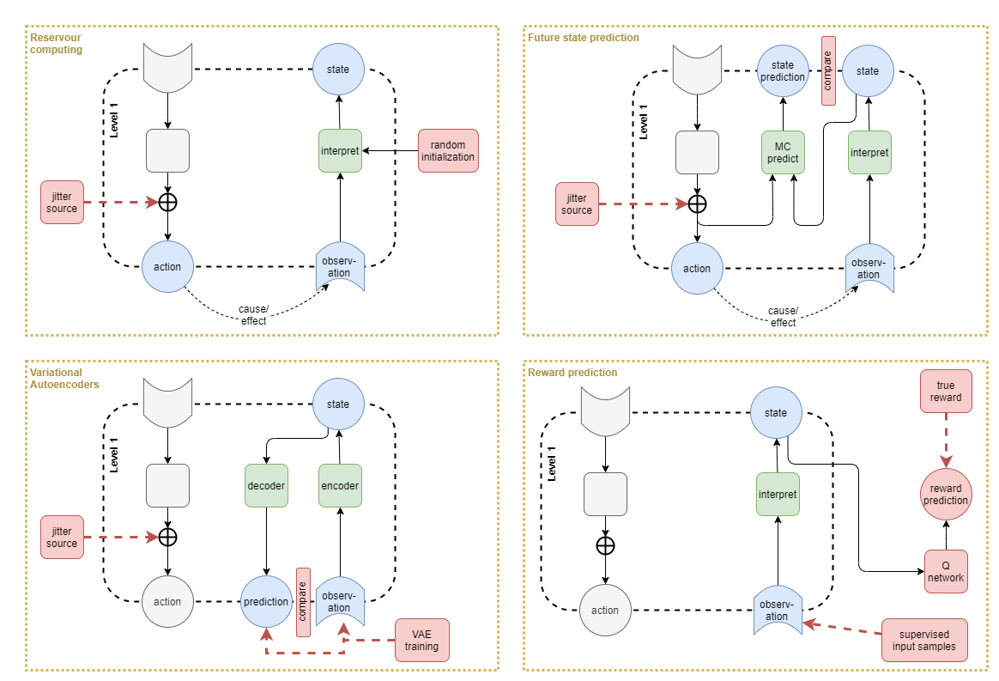
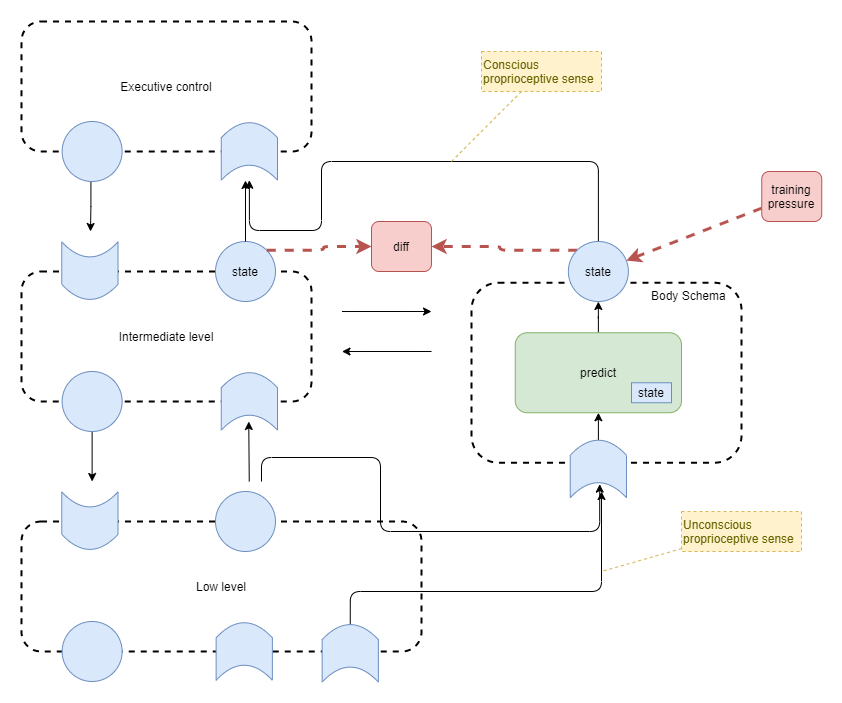
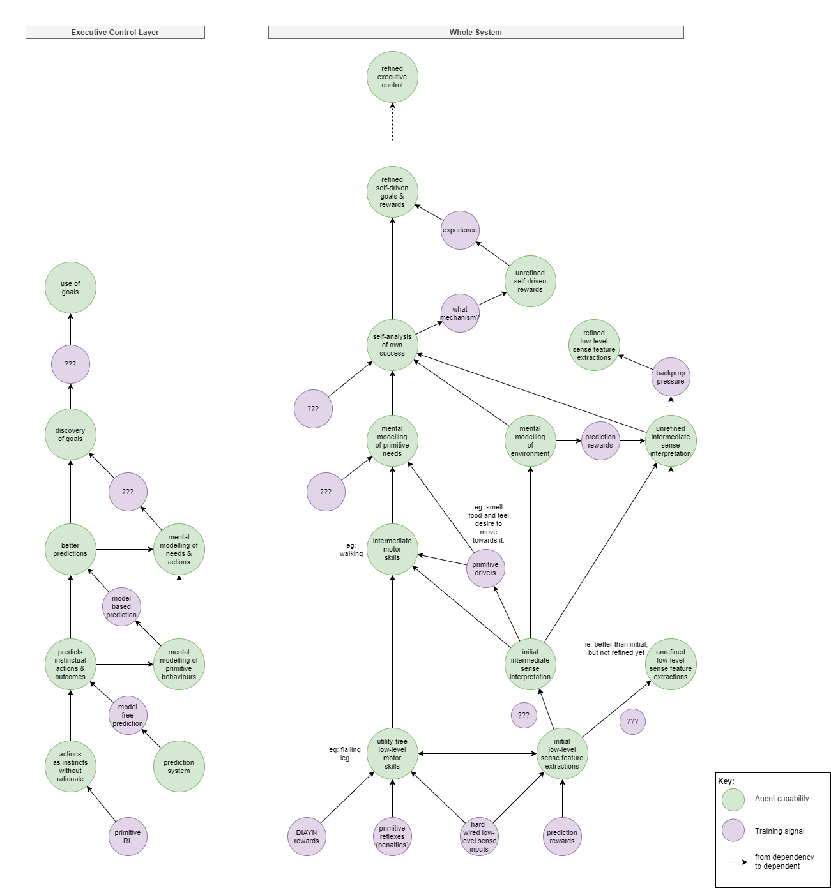
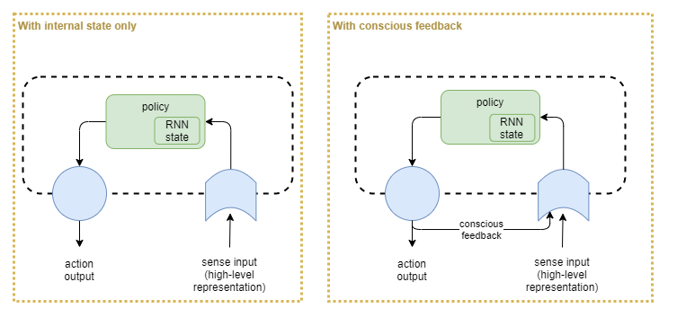

Can we use our best current understanding of neuroscience to inspire AI architectures that could form an artificial general intelligence (AGI)? This page attempts to do that. It uses the results of [[A Theory of Consciousness]] as the overarching guide, along with additional biological influences.

This page presents CIPAGIO, _Consciousness Inspired Proto Artificial General Intelligence Operative_. It is part of a collection of documents:

# Background
This page makes reference to content within other pages:
* [[Biological basis for proto AGI]]
* [[General Intelligence Classifications]]
* [[Executive Control in a proto AGI]]

Also see:
* [[Survey of Reinforcement Learning]]

## Principles

### Centralised

It appears that the biological brain largely produces its complex behaviour through decentralised coordination of many components. That's hard to reason about and to build for a proto AGI.

The design for this AGI assumes centralised control.

### Convergence

A multi-layered system like this will be inherently chaotc. So without explicit consideration it's chances of converging towards a stable and useful outcome are minimal.

To counteract that the architecture must build in convergent forces that apply at multiple points. These will be applied across all layers, and across multiple time scales.

### Brain growth

The human baby brain starts small, with many capabilities not fully formed. Those capabilities "come online" over time as the child grows. I believe this had two benefits:
* It helps to reduce the search space for optimal network training. Effectively it trains against a simpler problem to start with, then slowly increases the brain capacity and retrains on more complex problems. 
*  It helps to ensure convergence in an otherwise unstable system. With full executive control, we've got too much control over the reinforcement learning algorithm, but when in a fresh state, the executive control will be too unstable. So better to train level 1 systems first, holding executive control in a mostly disabled state. 

In contrast, a modern neural network is static in size, thus we will not be able to replicate the same efficiency of learning. However, there may be other opportunities for improving our architecture or approach. For example, we may initially attenuate-to-zero the output of particular components, and slowly ramp up their output signal strength and their accuracy improves.

### Avoiding catastrophic forgetting

Modern neural networks suffer from "catastrophic forgetting", where training on one skill causes loss of a prior learned skill. Humans don't suffer from this problem, as the brain seems to be able to slot different skills into slightly different regions. There is work on achieving that with AI. One promising angle is Stephen Grossberg's Adaptive Resonance Theory (ART).

To keep things simple, for now we will ignore the issue of catastrophic forgetting, and will setup a training environment where all required skills are repeatedly re-practiced.

### Executive Control and Decomposed Sandwich form of Reinforcement Learning

I think executive control incorporates a "decomposed sandwich" form of reinforcement learning - where many aspects of the algorithm are under direct control. This includes:
* Internalisation of reward function. 
* Exploration vs exploitation ratio
* Control over each individual attempt.

Executive control also learns to "drive" the unseen aspects of reinforcement learning by building up a model of how it works and choosing to leverage it. 
* Eg: we observe what methods of learning work best for ourselves. 
* Eg: we actively choose to learn a new skill. 

### Evolution as Learning Mechanism

Anything that is common amongst the majority of humanity is too consistent to be left to dumb luck; it has to be a result of evolution, and thus enforced (or at least predisposed) due to the architecture. At the very least, it must additionally depend on guaranteed aspects of the environment (eg: gravity, air, sunlight vs nighttime cycle).
 
Some aspects of human brain behaviour require the pre-wiring of feelings, urges, desires, distastes, etc.. In some cases these can be simple electrical signals that the brain can learn online to work with. In other cases, they must require pre-wiring of network structures -- ie: a whole NN "domain model" encoding. This is feasible from evolution - that some of the NN training is a result of evolution, which amounts to pre-training of the network weights (ie: not just the high level architecture).

# Architecture

## Artificial equivalents of Biological systems

Analysis of brain layers and how we'll emulate them in an AI:

|Layer|Description|Re-interpretation|AI Architecture Layer|
|---|---|---|---|
|1. Spinal chord|Reflexes|Mechanical layer. eg: senses to stop motorn at end of motion.|Omitted|
|2. Brain stem|(tbd)|(tbd)|(tbd)|
|3. Primary sensorimotor cortex|(tbd)|(tbd)|(tbd)|
|4. Non-primary sensorimotor cortex|(tbd)|(tbd)|(tbd)|
|5. Association cortex|(tbd)|(tbd)|(tbd)|
|6. Frontal cortex|(tbd)|(tbd)|(tbd)|

Analysis of brain memory types and how we'll emulate them in an AI:

|Layer|Description|Re-interpretation|AI Architecture Layer|
|---|---|---|---|
|Working Memory|Short-term executive function memory|Current working state for executive control layer|RNN state within executive control policy network|
|Episodic Memory|(tbd)|(tbd)|(tbd)|
|Semantic Memory|(tbd)|(tbd)|Bayesian models|
|Procedural Memory|(tbd)|(tbd)|Training pressure against layers|

## Overview

The following systems are involved:

## Full architecture

For a bit of fun, this is the complete architecture. This shall be broken down and the rationalisation explained in detail within the sections that follow.

## Training

Repeated cycles of the following sequence of training:
* RL of Level 1 with jitter as input
* Supervised Learning (SL) of Levels 1 + 1b with generated sense inputs
* RL of whole network with jitter against executive control output (?)
* RL of whole network with full policy execution

# Building up Architecture

## Low level motor control

Mammals don't learn motor control through external rewards; they learn it through watching and observing. And through _jitter_ - in the early stages of development randomly fired muscle signals cause the ligaments to move (citation needed), and the senses are used to pick up the result (particularly touch + vision). This is likely fundamental in bootstrapping a number of brain circuits. For our solution, this will be used to bootstrap the learning of two networks:
* motor control
* sense interpretation producing higher-order _latent state_ representations from raw sense inputs

Start with randomly initialised policy and sense interpretation networks. Random jitter (noise) is injected into the raw motor control signal. This causes movement that affects the sense inputs and an update of the latent state. 

For the moment we'll ignore how the sense interpretation network is trained and focus on the motor control policy. Jitter induces an action `a`, which leads to an observed latent state `s'` one time step later. This forms an trainable observation at time `t` of `a` causing a transitition from state `s` to `s'`. So we can now collect a series of observations of the form (`t` omitted for simplicity):

    p(s'|s,a)

We could use that to learn a predictive model of the sort that is used in model-based RL algorithms. But model-based RL algorithms are cumbersome and require a planning engine - which doesn't seem to make sense for the most low-level motor control. So we turn the observation on its head and use it to learn the action given an initial state `s` and a goal `g`. If we force that `g` uses the same latent state representation, then we can train with `g=s'`. So, instead we build a network on the form here, and use supervised learning on the observations:

    p(a|s,g)
    
It should be noted that use of latent state representation as goals has precedent in RL research. (Nair _et _al_, 2018) showed that it leads to sample efficient learning. In particular, they showed that using the latent state leads to much better results than the raw sense inputs. Additionally, they showed that with the right regularization the latent state representation can be treated as a euclidean space and distances used as errors during training. More on that in the _Low level state representation_ section below.

Now, there are a few gotchas here.

1. Under the rules of probabilities, you cannot flip from `p(s'|s,a)` to `p(a|s,s')` without incorporating some a-prioris about `p(s')` etc.. In practice our approximation will be good enough given that we are only using this to bootstrap learning and we will use other processes to smooth out the errors.

2. Jitter only enables us to observe `s'` for time `t+1`. But when we come to use this policy, goal `g` is quike likely only reachable at some `t+i` where `i > 1`, and our network hasn't received any training for that. For now we'll gloss over that issue with a foolish assumption that our network will generalise well enough to make reasonable guesses for the action at time `t` under those conditions. In the next section we'll use RL to train for `i > 1`.

3. Even given that assumption, it is likely that we'll run into problems of overfitting causing bad guesses. The problem is that our network capacity is significantly higher than is needed for the sparse data received so far. In humans, the initial bootstrap learning likely occurs while the brain is still developing and is much smaller than its eventual size. Thus it has less neurons to overfit with and will generalise better. In current ML, we always use fixed size networks, so we will probably need to resolve the overfitting problem here somehow.

4. In mammals, motor control is triggered by the primary motor cortex, but the exact sequencing, timing, and coordination with other movements is governed by the cerebellum. Exactly how that occurs is still unknown. For now we'll build all of that into our one policy network.

5. In mammals, the lowest level feedback-based sensorimotor development is probably further segregated into its independent modalities: muscle control and muscle senses learned against each other independent of other senses. The vision sense can only be incorporated into that circuit at a much higher level, where it can make sense of the differences when looking at the arm vs looking elsewhere.

## Reinforcement learning for low level motor control

Now we use RL to train the motor control policy (MC policy) for trajectories that best lead towards goal states. We'll use the current agent's state representation for the goals, so we do not _a priori_ know the parameters of the reward function. We must use data collected from the current policy, or at least near to it. During the training runs in the prior section, we'll collect the full unbroken trajectory within a sequential data buffer `D = (d1, d2, d3, ....dN)`, where `di` is the tuple of data taken at time `t`:

    (e,s,a,e',s')
    
where:
* `e` and `e'` are the true environment states at time `t` and `t+1`
* `s` and `s'` as before are the state representations at time `t` and `t+1`
* `a` is the action taken at time `t`.

We'll now sample from that buffer to produce (`e,g`) tuples for training: starting states and goals. There's a few ways of choosing these. The simplest is to pick a fixed number of `w` at random, separately a fixed number of `s'` at random, and to pair them up. We don't know how hard it is to get from any such `w` to `s'`, but we'll assume it's always achievable under the dynamics of a safe bootstrap training environment.

An alternative would be to randomly sample short sub-trajectories from `D` of some random length with (with a maximum length of say 10), and then to use the first event in each sub-trajectory as the initial environment state, and the last `s'` as the goal. This would definitely produce trajectories that we know are achievable within a short action length, but provide less exploration for our RL algorithm, so we'll use the first simpler approach for now and see how it goes.

We'll assume that any goal can be achieved within some reasonable maximum trajectory length, `n`, with say 10 steps. This seems a reasonable starting point, as any simple limb task is usually carried out very quickly.

We'll now run the agent under RL training conditions. For each of the training tuples selected above, we'll initialise the environment to `e`, fix the goal to `g`, and then allow the agent to run for a maximum of `n` steps. Our reward function will encourage the agent to achieve a state output that matches the goal sometime within that maximum trajectory length, but also to prefer achieving it sooner rather than later. For each run, we'll pick the state output `s(t+k)` that is closest to the goal `g`, and reward it based on how closely that state output matches the goal, and additionally discount based on how many steps it takes to achieve that best outcome. For the error measurement, we'll just pick something simple and convenient, such as RMSE. There are some more advanced "hard-wired" rewards that we might build into that too at a later time - see the section below on _Internalised Reward_.

As our policy network produces deterministic continuous actions, we'll use the [Deep Deterministic Policy Gradient (DDPG))](https://spinningup.openai.com/en/latest/algorithms/ddpg.html) algorithm for training.

The RL learning discussed here will be alternated with the jitter and supervised learning discussed above. Thus, the low-level MC policy will accurately learn `p(a|s(t),s(t+i)` for all of `1 <= i <= n`.

## Low level state representation

How do we train the state representation that the sense intepretation network will output? In the complete architecture, the state representation will be used as input to higher level networks, and possibly the goal representation too. We don't yet know what kind of information the high level networks will require, so we have only a vague notion that the state representation needs to be useful. This can be clarified a little by stating that it must produce a high contrast of outputs for highly different inputs. We paraphrase this vague requirement as requiring the representation to have _high saliency_.

There are a number of options available:

**Back-prop pressure from layers above**
* Depend entirely on training being applied at higher levels, with the back-propogation from that training applying a training pressure to the low level state interpretation network.
* We want to encourage convergence across multiple layers, whereas this approach depnds entirely on the layer above forcing convergence, so it's not so great on its own.
* Additionally, it means that activity that is triggered only within the low-level layer (eg: 'jitter' movements) will not apply any learning pressure.

**Reservour computing**
* In practice, provided the state interpretation network is initialised with random weights, its initial configuration will provide a meaningful usefulness of representation even without training. This is known as _reservior computing_, and its usefulness is proven and leveraged further in the theory of [Extreme Learning Machines](https://en.wikipedia.org/wiki/Extreme_learning_machine).

**Future state prediction**
* Under a sort of adversarial network architecture, tee off the sense interpretation network againts a prediction network. The prediction network would predict the expected state on the next time step, based on the current raw sense inputs and motor control inputs. The error would be the difference between the outputs from two networks. Both networks would be trained against this error, so that they converge to the same representation.
* This approach alone will likely converge towards a 'zero representation', where all inputs lead to a zero output. That would be the easiest path to minimise the training loss. Additionally, assuming that the networks are randomly initialised with a distribution having mean zero, the shared loss will on average encourage both networks towards zero.
* Thus it will need to be paired up with something to increase saliency. For example the 'gram matrix' used in the [neural style transfer](https://www.tensorflow.org/tutorials/generative/style_transfer) TensorFlow tutorial, or some other mutual-information metric.

**Reward prediction**
* Use the state representation as input to predict the reward received, and to use supervised learning to train a Q network with backpropagation into the state interpretation network.
* The intuition here is that it will ensure that the state representation has sufficient saliency for accurate reward prediction.
* The problem is that, in the section above on low-level motor control training, our choice was to reward motor control policy based on the current state representation. So this approach doesn't add anything that isn't already there.
* A solution could be to use ground truth values for motor control reward (ie: actual limb positions), and then a reward prediction network off the state representation could lead to something useful. However, this depends on external rewards, and we want to train the agent using intrinsic rewards -- especially for the low-level networks.

**Variational autoencoders**
* An approach that has been successfully applied by other researches is to use a [Variational Autoencoder](https://en.wikipedia.org/wiki/Variational_autoencoder) (VAE).
* Like the prediction approaches above, autoencoders tee off two networks against each other. They use the idea that the sense-interpretation network from raw sense to higher level representation is an _encoder_, and thus there can exist a _decoder_ which does the opposite. By feeding the encoder output into the decoder, the final output should be something similar to the raw sense inputs.
* VAEs are autoencoders with an additional regularization that ensures a smoother representation space. The intuition is that similar raw inputs should lead to similar encoded representations. However, in practice it has been observed that simple autoencoders produce chaotic results with similar raw inputs leading to very different encoded representations. So a regularization term is added to training to smooth that out.
* This has an added bonus that the representation space now operates as a euclidean space and you can compute _distances_ between two state representations (Nair _et _al_, 2018).
* The idea of pairing up a forward and a backward facing network seems to fit quite well with the [Adapative resonance theory](https://en.wikipedia.org/wiki/Adaptive_resonance_theory) of biological brains.

I suspect that the best result is a combination of:
* Variational autoencoders
* Back-prop pressure from layers above
* Use of a good state space exploration learning approach such as the jitter signals discussed above or the Diversity Is All You Need (DIAYN) approach of (Eysenbach _et al_, 2018).

## Proprioception

If mirroring humans, proprioception has a number of ways in which it connects into the system:
* Lowest level sensorimotor system trained via raw motor outputs and raw proprioceptive senses, probably with no input from even skin touch sense, and definitely none from vision.
* Touch sense feeds into sensorimotor system, but not sure exactly where.
* Intermediate layer uses high-level proprioception output to help plan movement
* Intermediate senses feed into proprioception system in order to train proprioceptive model and update proprioceptive state (eg: apply error correction)
* High level proprioceptive state fed in a first-class sense to executive control layer.
    * Note: in contrast to other senses, there is no raw proprioceptive sense data fed into executive control.
    * eg: you can lie still, close your eyes, and know where every part of your body is - but it's believed that you don't experience any direct awareness of the muscle spindle fibre senses. Furthermore, while you may not be consciously attentive to the proprioceptive sense at all times, that information is always available. This is in the same way that the touch sense of your clothes on your skin is available available, but you are only attentive to it occassionally.

### Proprioception Training
In order to train the proprioceptive system, need to tee off the following against each other:
* proprioceptive prediction of location of limbs
* visual interpretation of location of limbs
* ability to use that to predict accurate movements
    * eg: use error in final state when attempting to grasp something.

Also:
* Train to predict next state given current action
    * Corollary: predicts current state given no planned action.
    
tbd:    
* Which level of state representation to use for training?

## Mental Models

### Background discussion on kinds of model
In the combined context of AI and human brains, there are three kinds of level of "model", with different representations:
* Model Free Policy Networks - Used in reinforcement learning to predict best action given a state
* Model Based Policy Networks - Used in reinforcement learning to predict future state given an action
* Mental Models - The ideas that humans build up about themselves and about the world around them that are used to inform decisions.

While "mental models" may seem to be something completely different to the models used in AI reinforcement learning, there is perhaps a way that mental models fit naturally into that grouping.

Bayesian networks have been studied for many years because they would seem to emulate some of the characteristics of how humans form theories about the world. Their use has often failed when applied to low-level learning of the sort that is now done with deep neural networks. But they are a good fit for higher-order "mental models".

So, the theory proposed here is that the brain uses different structures for different layers and different tasks, that are roughly split into the following:
1. Model Free Policy Networks - Slowest learned best actions given current state and a goal
2. Model Based Policy Networks - Medium-speed learned predictions of next state given current state and action
3. Bayesian Network Models - Generated, manipulated, and used by high-order thought to help inform decision making.

### Bayesian modelling engine
The assumption for now is that there is some other system that is used for creating bayesian models.

Assumed characteristics are:
* Triggered: created when from some sort of event triggers identification of the need for a new model.
* Modified: built up and refined over time as more co-factual and counter-factual examples are observed. 
* Recursively Composed: each model is built up from other models with a new layer added. Eg: a car has a wheel.
* Introspection: We can inspect individual parts of a model, but this is probably due to the composition structure. ie: it's likely that we cannot inspect within a model, but that we can observe at the interface of each of the composed parts.

### Bayesian models for goal decisioning
I suspect that bayesian models are fundamental to the advanced goal decision making of general intelligence. This also fits with the fact that humans are so easily misguided in their goals - humans target ill-conceived ideas of self-value based on cultural expectations. Eg: one person may prefer to shop at the cheapest stores in order to spend less money, while another may prefer to shop at the most expensive stores because of the social status of that store or its products.

### Outstanding questions
* How to make this work in practice?
* Assuming "bayesian modelling engine" is separate, does main executive control network need to re-learn how to use the bayesian models as they are refined? For example, a baby with no bayesian models could not learn to use those models until _after_ it had formed some initial models. Then as the models get more advanced, it'd probably need to re-learn again to fully use the more advanced aspects of the models. At some point it'd presumably reach a point where it knows how to work with any new kind of bayesian model already.
* Are bayesian models used in lower level layers too or just within the executive control layers?

## Building up to a Higher-order motor control

The current design of the low-level motor-control/sense component will tend to use a fairly low-level representation at its interface to the layer above. This is because i) it runs on a 'reservoir' theory and thus has minimal training pressure to modify its representational level, and ii) it is trained on instantaneous sense inputs without time-sensitive context (ie: it will represent motion at level of "arm is moving up at speed x"). And the goal input to the low-level will have that same level of representation.

Thus, the low-level will not learn medium level representations like "move arm towards mouth in eating position". This fits well with observations from brain stimulation in monkeys.

To build up a higher level system, we need to enforce a higher level of representation. One component of that likely comes via the body map of _proprioception_. Inherently it must have some characteristics that force an optimum representational level, and that must apply a pressure to the level that it actually learns and outputs.

Another aspect of the system is that it is made up of many many neural net layers stacked on top of each other. From raw sense input up to executive control, each layer _integrates_ the data from below into a slightly higher representation. From executive control down to raw motor control, each layer _differentiates_ the data from above into a slightly lower representation. Across the system, this applies a pressure that is distributed between top and bottom, creating a _representational gradient_.

Like proprioception, other support components within the system must have inherent characteristics that apply pressure on the representational level. The final result will be found at the natural equilibrium of those pressures.

Lastly, evolution will have tuned all those inherent component characteristics so that the system as a whole produces "fit" results.

## Training Strategy for Intermediate Level

So, how to actually train the intermediate-level?

Based on the above notes, the training of the intermediate-level will be a combination of:
1. back-propagation from high-level and low-level component training.
2. training during RL that incorporates the support components (body map, modelling system)

Lastly, the following narrative provides some observation:
* I want to eat. I want my hand to put the food into my mouth. I don't care how it gets there as long as it doesn't drop the food, it doesn't hurt me in the process, and it basically follows an efficient path.
* My goal is a high-level concept of "food in mouth".
* I'll actively monitor the arm and provide internal reward to myself if I achieve my high-level goal.
* And it would appear that the level of that high-level goal is a result of the representational gradient and other pressures as described above.

## Absolute vs Relative Control
In this context, "absolute" refers to a goal or action representation that entirely encodes the full desired state, including ambient background state that isn't relevant to the task at hand. This can be a complex option for controlling a particular focused task, particularly when the ambient state may itself be changing independently. "Relative" is used to refer to any means of producing only a partial representation that focuses only on the task at hand. Additionally at times we will distinguish "static" motion (I want my hands to go to a particular position and stop there) from "dynamic" motion (I want to swing my axe in a chopping motion). And we'll also distinguish "continuous" motion (that requires continuous action signal for duration of motion) from "persisted" motion (begins from a 'start' signal and then can continue without further exec ctrl). 

Intuitively it would seem like we need to support relative goals and actions somehow, because that's our experience as a conscious agent. I can keep walking while my mind drifts off. In practice, I think that's better treated as a later optimisation tray someone wise will figure out. I can imagine an evolutionary path where the executive control layer works only in terms of absolute goals and actions initially, and then later frees up executive control by holding state in lower levels so that the exec ctrl layer only needs to send a signal when it's time to change the persistent request. 

There are a number of options available for supporting relative representations.

**Zero is off**
* Treat numbers near zero as "ignore" signals, and thus ignore them when calculating the error between goal and actual (presumably work some sort of soft-off). 
* Suffers from an inability to natively represent meaning via near-zero numbers because they've now been reserved for a meta signal. This will push the network to jump through hoops when it does need to represent zero, such as offsetting by some fixed amount. 

**Control mask**
* Double the size of the representation with the second copy being a mask, and use it as above. 
* A mask provides similar capability to Zero-is-off but with a different drawback of doubling the state space. Also, there is a risk that the policy will start using as few nodes as possible for the goal representation, masking all the rest off, so that it's easier to achieve maximum reward (from the goal vs actual error). It's possible that this risk can be mitigated by applying the same mask to the action output, so that it is forced to produce meaningful action representations. However, given that the mask is a separate signal, there's no reason why the lower layer would even use it, so it doesn't sound very effective. 
* In fact, the Zero-is-off approach is looking much better. It naturally encodes the mask in a way that the lower layer has to recognise. And because of that it solves the problem of the mask reducing towards only one active node. It also has a precedent in biology in the way that zero means no spiking, and that obviously encodes to no action. 

**Global attention**
* Extension to above where everything in executive control layer is masked by the same attentional control. 

**Delta**
* Action signals from exec ctrl are deltas applied to some persisted current request. 
* Delta signals primarily relate to continual vs persisted motion. It requires something to hold the state. Options for that are: hope that the exec ctrl RNN will handle it, hope that the intermediate layer RNN will handle it, or add a hard wired primitive component in between the two that holds the state and effectively acts as a translation layer from  delta to continuous absolute signals. Cons with primitive approach: blanket rule that everything must be delta is too simple. Con with delta: quickly leads to +ve or * ve saturation of persisted values. 

One of the biggest problems with all these options is that they presuppose that all actions operate under the same mode. The reality in biology is probably significantly more complex, with different actions operating under different modes. For example, in biology some parts are likely handled at the low level synaptic and recurrent level. Synaptic cycles are known to exist with separate "off" signals (eg: in primitive pain signalling). So, for something as primitive as walking, it is likely a delta signal from exec ctrl layer, with state handled within the intermediate and low levels. But for many other actions I need to continually produce the action signal: if I stop thinking about doing something, my body stops doing it.

# Overall Training Approach

## Capabilities Development

Our training approach needs to consider that some capabilities cannot be efficiently developed without first developing lower-level capabilities. This creates a dependency graph, which can be represented as follows:

wip....

From point of view of observable outcomes:
1. Learn utility free "skills" from mutual information metrics via DIAYN. 
	* Outcome: discovers bunch of disjointed utility free actions. Primarily low level, but may include some intermediate "skills" too. 
	* Outcome: some vision feature detections will be in place, but unrefined. Hopefully some prediction linking motion to sense changes. Limited to no meaning interpretation. And given that accurate sense prediction, with attention, requires higher level control, this will be quite inaccurate. 
	* However, eg: without any driver to learn to walk, it won't necessarily do so. 
2. Learn intermediate skills from primitive drivers
	* Needs a driver. But I don't want to use the kind of hidden-sourced sparse rewards that traditional RL uses. 
	* Babies use intermediate-level primitive instincts. Eg: smell food and move to it. 
	* Subsequently: can observe own actions and cause /effect to build mental model about hunger and food. 
3. Learn intermediate skills from external rewards 
	* Reward with food, pleasure, pain. 
	* Outcomes: improves mental models.
    
The abilities of the executive control layer will need to be bootstrapped via naive RL, and for this to slowly feed into mental models that later enable the production of goals. This looks something like:
1. Primitive RL without any self control
	* To a self-aware agent feels like across successive experiences its instinctive actions change over time to a different outcome. 
	* No experience of the error or reward signals or the learning. 
2. Model free Prediction 
	* Starts to predict that a particular sense observation is typically followed by an instinctual action and an outcome. 
	* Self aware agent now becomes aware of the prediction that certain actions and outcomes are about to follow. 
3. Model based prediction
	* Draws connection between primitive experience (eg hunger), the outcome that resolves the experience, and the actions that can get there. 
	* Self aware agent "understands" in a very primitive sense why it instinctively performs the actions it does. 
4. Discovery of goals
	* Somehow this translates into a model about its ability to have goals. 
	* (need to investigate this more) 
5. Use of goals

## Phases

Just like humans learn in phases, with particular focuses, we can apply the same here. In particular, it may prove useful to disable high-order systems initially.

|#|Focus|Description|Dependencies|
|---|---|---|---|
|1|Somatosensory + sensorimotor|.|.|
|.|...|.|.|
|.|visual proprioception|.|modelling engine|
|.|...|.|.|
|.|conscious control|.|.|

## Measuring success

How will we tell if all this effort is worth it?

Let's compare against the results of using standard reinforcement learning, then slowly build up the layers, using a standard RL policy on the top, until we have a full system.

We'll need to decide on a sensible goal, or set of goals, to experiment with. Then compare those by looking at:
* success rate at achieving goal
* learning time
* "smoothness" of actions
* "efficiency of actions"

### Use of conscious feedback
Rcurrent neural networks (RNNs) were designed to apply against sequences on the inputs. They were not intended for maintaining long term state -- such as required in order to sustain internal thought. So do we need an explicit concsious feedback loop that feeds last cycles' output as input to the next cycle? Let's test that.

How to measure utility of an explicit conscious feedback loop, vs just depending on internal state within a stateful policy (ie: RNN)? Use each of these configurations, and train on something simple but that requires processing loops in order to succeed.

# References

Eysenbach, B., Gupta, A., Ibarz, J., and Levine, S. (2018). Diversity is All You Need: Learning Skills without a Reward Function. ArXiv. https://arxiv.org/abs/1802.06070

Nair, A., Pong, V., Dalal, M., Bahl, S., Lin, S., and Levine, S. (2018). Visual Reinforcement Learning with Imagined Goals. ArXiv. https://arxiv.org/abs/1807.04742

(Added 2021-02-03. Labels: work-in-progress)
