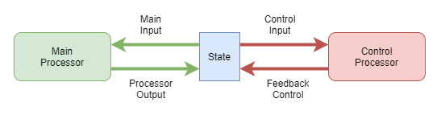

The high reasoning part of our brain is a state machine, but without the reliable stack of a computer CPU. The architecture of having many processors competing for attention is extremely flexible, but suffers from a susceptibility to wandering thought, circular thought (infinite loops), and stuck thought (dead ends in the state machine).

According to my theory, basic creatures like insects probably employ purely stateless processors. The only state coming from body feedback and hormones. So the evolution of higher reasoning also needed to develop a mechanism for managing the overall processing. That management process is complex, and needs domain knowledge of the data and thought process being carried out. So a natural solution is to just feed the mental state break in as a first class input. Interestingly, this would lead to evolved and learned processors with the processing of problem data and feedback being tightly integrated.

This doesn't need general intelligence. It's a fundamental architecture. It doesn't need tight integration of problem and feedback data, but it helps. It does need a sufficient level of intelligence applied to that feedback, and if there's no general intelligence, then it basically has to be hard coded.

What kind of control mechanism might be employed within a biological neuronal brain? The following distinguishes two basic approaches:

1. Independent control: an entirely separate control processor actively monitors and manipulates state to ensure stability

2. Integrated control: control is performed by a relatively simple feedback loop that is actioned on by the main processor.

tbd. the distinctions between the above options may be clearer if put in the context of learning pressures.

What information does that control mechanism need? And what level of computational complexity? The identification of infinite loops alone can be quite complex, as a sequence of states of arbitrary length may form an infinite loop. The control mechanism doesn't need tight integration of problem and feedback data, but it helps. It does need a sufficient level of intelligence applied to that feedback, and if there's no general intelligence, then it basically has to be hard coded from evolution alone.

So there's basically two options for achieving that level of feedback understanding:

1. Hard coded feedback processing and attention control. Limited data integration. Doesn't require general intelligence. Very unhuman-like.
2. Fully integrated General intelligence with learning. Human-like.

In the human case, we are probably born with some basic building blocks of attention control - that do only the most basic of attenuation of repeated signals to avoid tight infinite loops. And then we learn to override those and apply higher reasoning.

This theory also suggests there is a minimum level of intelligence required for consciousness, because otherwise it cannot control thought well enough. But in contrast, maybe that limit is very small...the slightest bit of self control could rate on the consciousness scale.

# Logical Inaccuracy
Biology is a deeply flawed way of creating a reliable, accurate computing engine. Evolutionary processes inherently introduce errors, and approximations. The network of neurons that our ability to learn and think depends on, depends on approximations. It's approximations start with high inaccuracy, and improve over time, but there is no boundary line between being untrained and trained. 

Thus, for a biologically based computing engine, every step is inaccurate and unreliable, and every step must cope with that error. 

It turns out that this error-prone nature is what leads to such overall adaptability. When every component must be adaptable in the face of high error rates, the aggregate is capable of amazing things. That aggregate is capable of not just adapting to our surroundings and changing social structures, but it's able to adapt to different methods of thinking. 

# Conscious from the Ground Up
With such an error prone architecture, how is it possible to execute step by step logical thought? The behaviour of thinking becomes a learned activity too, in much the same way that we learn to control our limbs through trial and observation.

Consciousness is a sense, in just the same way our standard 5 senses are. We are continually fed information about the state of our thoughts. 

At first we have no control. We learn to recognise some meaning from the stream of noise, just like we gradually learn to recognise patterns and correlates associated with our touch sense.

Eventually, almost by accident, we discover that we can control our thought in small ways. As we learn to control our limbs, we mostly send chaotic signals to our limb muscles, and eventually we recognise a correlation between the signals we have sent and their effect. The same goes for learning to control our thoughts. 

# Alien Brains
The discussion here leads to some interesting suggestions about possible alternative brain structures. For example, while we have concluded that the human brain uses an integrated control mechanism, that doesn't entirely rule out the possibility of brains developing that employ an independent control mechanism.

Such beings would likely develop quite different high-level thought styles than humans.