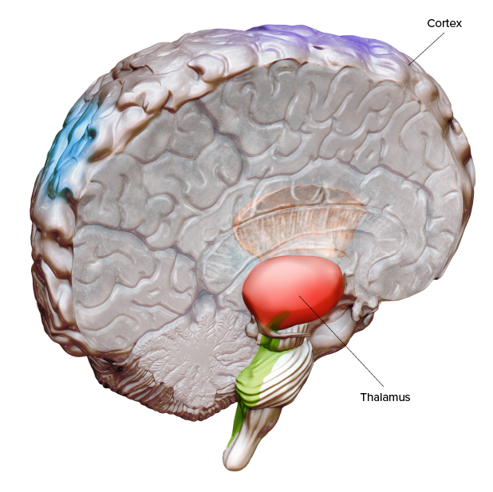
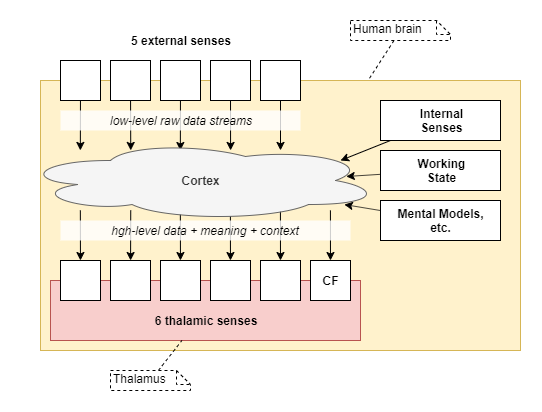
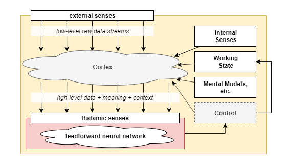

In neuroscience, the Thalamus is a small central region of the brain that is understood to have the role of transferring raw sense inputs to other brain regions for filtering and processing, and for receiving those processed senses. Neuroscience is starting to form the conclusion that the Thalamus receives processed data in a high-level representation and is where ultimate decision making is made. Combining that with understanding with observations of our own conscious experience, it seems plausible that the Thalamus is the seat of human consciousness.

This articles presents that theory in the form of an analogy of the Thalamus as existing in a symbiotic relationship with the rest of the brain.

CREDIT: NICOLLE R. FULLER / SAYOSTUDIO

## Analogy
Imagine the Thalamus as a separate entity that, through DNA combination, has evolved to live in a symbiotic relationship with the rest of the brain, herein referred to as the Human brain. The Thalamus defers most of the heavy lifting to the Human brain: sense processing, mental and physical skills learning, storage of mental state (ie: working memory), context enrichment via mental models of body and mind, and high-level thought processes that offer up suggestions for next steps in a thought sequence. The Human brain presents all of that to the Thalamus in simplified high-level representations.

In turn, the Thalamus uses the supplied high-level representations to make the ultimate decisions in terms of attention and control of overarching Human brain processes. Like any other organism, the Thalamus has external senses, which is how the Human brain supplies the high-level representations to it. In doing so, the Thalamus _experiences_ those high-level representations as they arrive at its senses. For now, we assume that the conscious feedback loop is a sense like any other, supplied to the Thalamus as a summary of the mental state stored within the Human brain.

In this analogy, the Human brain is an unconscious learning and environment prediction engine with a large capacity for retaining new memories and mental skills. While the Thalamus is a conscious high-level decision engine that is capable of great adaptability of thought, but which is considerably limited in its scope for growth.

Now, what's interesting here is that experience occurs exactly at the interface where the Human brain supplies data to the Thalamus' input senses. The Thalamus does not experience its own internal logic processes, nor does it experience its outputs, which it uses to control the Human brain.

In other words:
* The content of experience is defined entirely by the data supplied to the input sense of the Thalamus. No other data processing in the Thalamus or Human brain is involved in experience.

## Filling out the Analogy
So the human body has 5 raw nerve senses, while the Thalamus has 6 high-level senses, each with the following three pieces of information:
* raw-ish sense data
* meaning labels - eg: object detection in visual senses; sentence understanding in auditory senses
* context labels - eg: mental body model of location of touch; mental mind model of source of conscious feedback.

With the meaning and context attached, it's hard to imagine what the raw-ish sense data is needed for. But it is clearly part of experience. While there is evidence that we do not experience the actual raw senses, we certainly seem to be able to see our vision as an image, for example, and to examine low-level properties of that image.

With meaning and context labeling in place, it can be understood how those 6 thalamic senses are re-purposed for other human internal body and mind senses and states that otherwise do not fit exactly the typical 5 external physical senses:
* Inner voices are generated and subsequently interpreted by internal context processing, labeled as "internal thought" by mental models, and finally received by the Thalamus' auditory sense input.
* Some headache pain is known to not be caused by touch nerve endings, and yet it is interpreted as 'touch' sense, labeled with location in the head by mental body models, and received by the Thalamus' touch sense input.
* Hunger is indicated by the vagus nerve, interpreted as a 'touch' sense, labeled with location in the stomach by mental body models, and received by the Thalamus' touch sense input.
* Intention of action only becomes aware to us via conscious feedback, labeled as internal thought.

The thalamic senses appear to be received in parallel, as independent senses. An alternative often used in electronics is to use a single serial line, with multiple data streams multiplexed onto that line. However, on self-observation, it appears that we can experience multiple senses at the same time. For example, we can watch and listen at the same time as a car drives past, and also smell its exhaust. Additionally, due to the nature of how neural-networks grow and learn, it makes sense for separate senses to be handled via separate input processing within the Thalamus. Lastly, from biology, it appears that the Thalamus is involved in attention control, so it is easier for those separate senses to be provided to the Thalamus separately and for it to then decide on attention.

Based on ideas discussed in [[A Theory of the Human Mind]], the Thalamus controls the Human brain in the following ways:
* rates the accuracy/effectiveness of each processor, and attenuates the strength of underperforming processor outputs
* selects which processors to execute and/or decides which executed processor's output to select
* routes the selected processor output into Working Memory
* may construct special purpose meta-thought signals and load them into Working Memory, in order to control the flow of thought
* and/or may have other control mechanisms over the Human brain

With that as the assumed outcome, the logic within the Thalamus could be executed very a simple typical feedforward-style network.

## Properties of Experience
We have concluded the following properties:
* High-level sense representations include a triad of information: raw-ish sense + meaning + context,
* Experience is limited in scope to input senses only (specifically the 6 thalamic senses)
* Experience is limited to the human-thalamic interface
* Parallel - the thalamic senses are received and experienced as independent parallel inputs.
* Repurposing - Thalamic senses are limited to the 6, including CF. As the examples above show, many internal body and mind senses are fed into one or more of those 6, repurposing them beyond the scope of just the external physical senses.

## Conclusions
The analogy presented here frames the peculiarities of experiential vs non-experiential processing in a self-consistent model by treating the Thalamus as its own separate entity, existing in a symbiotic relationship with the Human part of the brain. It helped us define some properties of conscious experience that apply outside of the analogy.

We have shown that conscious experience is severely limited in scope. It seems likely that the whole of conscious experience is encapsulated in the content of Thalamic sense data. In other words, conscious experience must somehow be an artifact of the fact that the Thalamus' input senses receive a triad of raw data + meaning + context.

And yet, none of this explains why, in the real human brain, an arbitrary subset of neurons being supplied high-level representations of processed senses somehow creates experience.