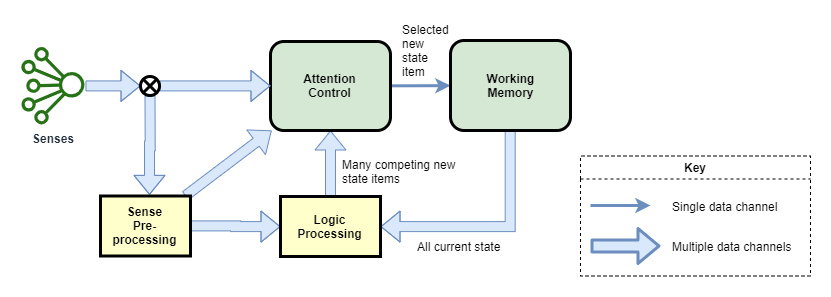
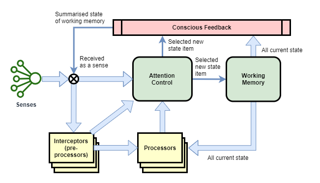

This page attempts to present a unified theory of how consciousness and high-level thinking function in the human mind, and likely in the mind of other mammals. Most of the points here are unproven assumptions, based on observations of my own thoughts and influenced from current scientific theories around world. See [[Background to A Theory of Mind]] for more details on how this theory was constructed.

While the theory uses the human mind as the primary example, it is focused on the theoretical fundamental architectures of consciousness, irrespective of whether that is in the form of a human biological consciousness, or some other alien mechanical consciousness.

# State Machine
The high-level thought system of the human brain is a state machine with a tightly integrated control mechanism, known as consciousness. The low-level older part of the brain is something much more akin to our current deep-learning artificial neural network models - basically just pattern matching/prediction engines. All thought, including high-level thought, is achieved through coordinating the function of the state machine with the low-level pattern matching/prediction components of the brain.

Ignoring the control-mechanism for the moment, the high-level state machine of the brain is illustrated in the following diagram. The senses are received as inputs, pre-processed, then used in conjunction with the current state (held in Working Memory) to produce multiple potential new states, which are selected by the attention control mechanism.

In the terminology of Danial Kahneman, the pre-processing and logic processing components produce _System 1_ or _Fast Thinking_, while the net result of multiple steps being executed by the state machine form _System 2_ or _Slow Thinking_.

## Senses
Raw senses are received as more or less continuous streams of data, whereas high-level thoughts works on discrete states. The raw senses are pre-processed for three reasons:
* convert from stream to discrete events, through a process of filtering and event detection
* feature extraction
* initial meaning detection

For example, our cochlea produce a continuous stream of auditory signals into our brain. This is pre-processed to detect the presence of language. The auditory stream is simultaneously parsed and split into discrete segments (words). Sections of partially extracted meaning are passed into through processors and directly into the attention control centre.

It appears that our senses can enter the attention centre through three pathways:
* Pre-processed and used as input to logic processing - this is the strongest and most used pathway, where we do not directly pay attention to our senses, but conclusions and actions are drawn from them anyway.
* Pre-processed and accepted directly into attention - significant events enter our attention with very minimal logic processing. This is likely the case for fight-or-flight style events.
* Raw or only minimally pre-processed and accepted directly into attention - occasionally we choose to pay direct attention to our senses. For example when observing a landscape in order to paint a picture.

The pre-processing stage is split into many individual segments that focus on a particular sense (or combination of one or two senses), and detection of a particular feature or event. They operate without the larger high-level context represented within working memory. This enables pre-processing to be focused, which makes it easier and faster to train.

I call these multiple pre-processing segments, _Interceptors_.

## Working Memory
Neuroscience currently believes that we hold about 7 items in working memory, for up to about 1 minute.

This is the state data store of our state machine. The presence or absence of certain data items directly influence which logic processes activate or are dormant.

The most simple state machine may be able to operate with only a single data item, and the larger the working memory the more efficient computation can be in theory. In practice, there are trade-offs affecting the size of working memory. If too small, then it is not sufficient to hold all data needed for a particular thought process - more logic processing actions are required for low-level swap-in/swap-out of data from long term storage. If too large, then the data transmission channels between working memory and logic processing become too wide.

The state representation within working memory is likely fairly high-level. It is likely at the level of what we observe within our consciousness.

## Logic Processing
Logic processing is performed by many individual _Processors_. All processors act on the current input and working memory state, and produce a suggested outcome. Those outcomes compete, and are selected by the attention control mechanism. The selected output is fed back into working memory, and this forms the next step within a stream of thought.

Each processor is largely stateless on its own, and follows something of the simple pattern recognition / prediction design of modern deep learning neural networks in AI research.

## Processor Output Selection
The attention control mechanism has the hard job of deciding which processor's output should be selected. It likely chooses only a single item from hundreds or thousands of competing processor outputs.

I'm not certain what exact approach is used for selection. The most basic approach could be as simple as picking the output with the strongest signal.

The attention control mechanism also needs to monitor the quality of results from processors, and attenuates their strength according to that quality. Over time, as processors are trained, their accuracy improves and their strength is increased.

Note: In reality, the biological architecture of processor output selection is probably quite different to the approach outlined here. But the exact implementation details shouldn't have too much of an impact on our goal of implementing an artificial intelligence.

# Control
tbd:
* Need for control
* Conscious Feedback

# Awareness of Thought
...tbd... what are we aware of and what not?
* Scope of experience of Conscious Thought limited by scope of conscious feedback.
* Working Memory - but only one item.

We don't have direct awareness of the execution of processors, or even of the total set of processors that activated. Rather, we only appear to observe the selected next step that is fed into working memory.

# Other Significant Components
* Mental model of mind - Like our mental model of body, we also maintain a mental model of mind.
* Actions - not too important for understanding thought processes so omitted from this description

# Other forms of Consciousness
I believe the most basic theoretical form of consciousness needs only the following:
* sufficiently interesting inputs & outputs
* 'current state' - ie: working memory
* feedback loop - current state of thought is fed back as an input
* a minimum level of complexity sufficient to incorporate the feedback loop into main logic processing

tbd:
* Mammals and other animals

## See Also
* [[What is Consciousness]]