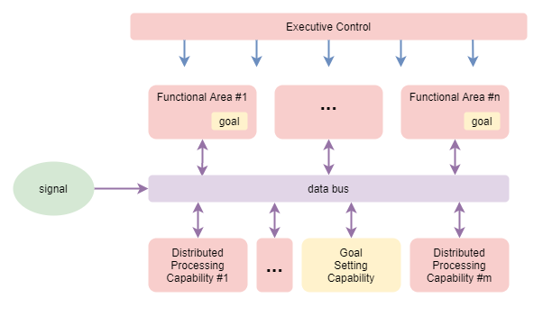

This page forms part of the [[Proto AGI v1]] series.

Here we shall review how the brain achieves its behaviours. We shall focus on both external behaviour (eg: that leads to physical motion) and internal behaviour (eg: thought). The purpose here is not to provide a complete or even accurate account of existing research. Rather, the purpose here is to identify principles that might need to be incorporated within an AI solution in order to build an AGI. Thus the content of this page is based on a mixture of neuroscience research, personal observations, and a careful selection of reasonable assumptions.

We will discover some important ways in which the current AI techniques of neural networks, reinforcement learning, and bayesian inferrence all fall short.

# Nervous System Evolution

_tbd_: see https://www.britannica.com/science/nervous-system

# Brain development

Brain size increases from birth, reaching full size at about 7 years. The number of neurons and quality of connections change drastically during that time too (Developmental Psychology, ch 4), as summarised in the following table:

|Age|Brain size as percentage of adult weight|Neuron development|
|---|---|
|0 months|25%|Most of 100 to 200 billion neurons present, but not fully mature, and with minimal myelin (fatty tissy around nerve axons, that help to increase the speed of transmission from one cell to another). Over next two years, brain undergoes proliferation of dendrites within cortex (thin outer covering of brain, involved with voluntary activity and thinking). |
|2 years|75%|Peak of cortex dendrites: a single neuron may have thousands of dendrites. Following this, neural pathways not used will be eliminated, and pathways in used will be made stronger.|
|6 years|95%|The prefrontal cortext (located behind the forehead) continues to grow and mature throughout childhood. Greatest myelin development occurs during first several years. |
|7 years|100%||
|13-18 years|100%|Prefrontal cortext experiences additional growth spurt. Experience shapes which connections are strengthened or lost, and by maturity about 40% of prefrontal connections are lost. This is the last part of the brain to mature, and eventually comprises 85% of total brain weight. Myelin levels reach maturity during this time.|

# Sensorimotor System

Approximate layers:

## Senses

(tbd)

## Motor Control

Motor control is governed by a number of layers, with increasing levels of abstraction (Neuroscience Online, s3):

|Layer|Responsibility|
|---|---|
|Level 1 - Spinal Cord|Contains motor neurons that control individual muscles. Governs rhythmic behaviours, such as walking. Ensures maintenance of balance and other safety actions through [_Reflexes_](https://en.wikipedia.org/wiki/Reflex). Reflexes elicit involuntary motion behaviours in response to stimuli, before the stimuli impulses even reach the brain. [_Primitive reflexes_](https://en.wikipedia.org/wiki/Primitive_reflexes) (a.k.a. infantile or newborn reflexes) are a subset that typically disappear as a child develops. A classic example of a reflex is the [_stretch reflex_](https://en.wikipedia.org/wiki/Stretch_reflex), which automatically contracts any muscle that feels a stretch, and is involved with maintaining balance.|
|Level 2 - Brain Stem|..|
|Level 3 - Motor Cortex|
|Level 4 - Association Cortex|

The motor cortex is further subdivided into a number of regions:

|Region|Responsibility|
|---|---|
|Primary Motor Cortex (M1)|Electrophysiological recordings have shown that the primary motor cortex homunculus appears to represent the movements of individual body parts, which often requires the coordinated activity of large groups of muscles throughout the body (Neuroscience Online, s3, ch3). In other words, the primary motor cortex homunculus does not map to the activity of individual muscles.|
|(more tbd)|..|

## Proprioception

* https://en.wikipedia.org/wiki/Body_schema
* https://en.wikipedia.org/wiki/Proprioception

Accuracy of motor control is coordinated through _proprioception_, which includes the senses of position and movement of limbs and trunk, the senses of effort, force, and heaviness, and the sense of balance. Alternatively, the term _kinesthesia_ is sometimes used when referring to just the sense of limb position and movement.

Proprioception is achieved through aggregation of direct senses and through mental tracking of limb position. It  depends on three distinct sources of feedback listed here highest priority first (Proske & Gandevia, 2012):
1. Muscle spindle fibres, tendon organs, and joints -- explicit proprioceptive senses
2. Skin
3. Vision

To summarise:
* "Proprioceptive sensations are mysterious because we are largely unaware of them. They are distinguishable from exteroceptors such as the eye and the ear in that they are not associated with specific, recognizable sensations. Yet, when we are not actually looking at our limbs, we are able to indicate with reasonable accuracy their positions and whether they are moving. Part of the explanation for this lack of identifiable sensations relates to the predictability of proprioceptive signals. We are aware that we are making a willed movement and so anticipate the sensory input that it generates. A general concept in sensory physiology is that what we feel commonly represents the difference between what is expected and what has actually occurred (e.g., Refs. 19, 86, 423). On that basis, if a movement goes to plan and there is no mismatch between the expected signals and those actually generated, no definable sensation is produced, yet the subject knows precisely the location of their limb. It is possible to generate an artificial proprioceptive signal using muscle vibration (159). Vibration produces sensations of limb displacement and movement, leading the subject to express astonishment at the unwilled nature of the sensations. This suggests that the will to move and the subsequent proprioceptive sensations are intimately linked." (quoted from Proske & Gandevia, 2012. section 1a).

In neurotypical individuals, vision feedback is only used for certain specific tasks requiring high accuracy. In deafferented individuals, where the sense from muscle spindle fibres is lost, vision can be used to replace the lost sense. However, this requires conscious control of movements, the movements are slower than normal, and are relatively short and simple due to the mental effort involved (Proske & Gandevia, 2012. section 4a).

The muscle spindle fibres etc. provide direct feedback on relative limb angles and movement, but not limb length or absolute position. The brain maintains a _body schema_ that aggregates all that information together along with learned parameters of the body shape and size, in order to track absolute limb position (Proske & Gandevia, 2012. section 4a). Studies have shown the this tracking is maintained even in the absense of visual feedback, and that predictive errors as much as 20 degrees can be induced in individuals through manipulation of muscle resting state (Proske & Gandevia, 2012. section 3).

Some theories suggest the existence of a separate _body image_, which holds more static information such as general capabilities, tracking of capability changes due to injury or amputation, and is implicated in body dismorphic syndromes. It is suggested that the body image is the cause of phantom limbs and anosognosia (Proske & Gandevia, 2012. section 4a).

## Sensorimotor Development

* https://en.wikipedia.org/wiki/Developmental_psychology

Piaget's theories on human child intellectual development come from the 1950s and 60s, and are still basically accepted today. They break development into four stages: _sensorimotor_, _pre-operational_, _concrete operational_, and _formal operational_. Sensorimotor development has six substages that build on top of each other (McLeod, 2019):
* **Reflex acts**: within first month of life, the neonate responds to external stimulation with innate reflex actions. For example, it will reflevively suck if a finger is brushed against its mouth or cheek. Piaget theorised that these are essential for bootstrapping sensorimotor learning.
* **Primary circular reactions**: from 1 to 4 months old, the baby will intentionally repeat pleasurable actions centred on its own body. Examples: wiggle its fingers, kick its legs, and suck their thumbs.
* **Secondary circular reactions**: typically from 4 to 8 months old, babies repeat pleasurable actions that involve objects as well as actions involving their own bodies. For example, shaking arattle for the pleasure of hearing the sound that it produces.
* **Co-ordinating Secondary circular reactions**: typically from 8 to 12 months old, babies show signs of an ability to use their acquired knowledge to reach a goal (ie: in contrast to simply prolonging interesting events). For example, it will reach out and knock to one side an object that stands in the way of it getting hold of the rattle.
* **Tertiary circular reactions**: from 12 to 18 months old, similar to secondary circular reactions, but actions are now intentional adaptations to specific situations. The infant who once explored an object by taking it apart now tries to put it back together. For example, it stacks the bricks it took out of its wooden truck back again or it puts back the nesting cups - one inside the other.
* **Symbolic/representational thought**: from 18 to 24 months old, babies learn to form mental representations of objects, enabling them to mentally visualise things that are not physically present. This is crucial to the acquisition of _object permanence_, which Piaget considered to be the most fundamental achievement of the whole sensorimotor stage of development. The symbolic substage is transitional to the pre-operational stage of cognitive development.

A couple of good writeups can be found on the [massey.ac.nz](https://www.massey.ac.nz/~wwpapajl/evolution/assign2/MH/webpage.htm), and [lumenlearning.com](https://courses.lumenlearning.com/suny-lifespandevelopment/chapter/piaget-and-the-sensorimotor-stage/) websites, including descriptions of the other stages.

## Corollary discharge and efference copy

These are two more or less synonymous terms with different histories. 

The basic premise is that the brain sends a copy of its intended motor command to secondary system that predicts the effect on the senses. This is used for example to counter the effect of eye or body movement on the visual image that we perceive. It is used to determine whether the observed change in image is caused by our own movement, or the movement of the scene. Vision is the only proven use of this mechanism, but it is believed that it may play a larger role throughout other systems within the brain. For example, one 2020 paper (https://journals.plos.org/plosbiology/article?id=10.1371/journal.pbio.3000639) focused on the amygdala and its management of emotions, suggested that the corollary discharge mechanism may be employed in how rewards are calculated by the brain. 

See:
* https://en.wikipedia.org/wiki/Corollary_discharge_theory
* https://en.wikipedia.org/wiki/Efference_copy
* http://www.scholarpedia.org/article/Corollary_discharge_in_primate_vision

# Memory

The kinds of memory in humans have been categorised in order to try to understand them. The categories are ([source](https://www.predictivesafety.com/blog/the-7-types-of-memory-and-how-to-improve-them)):
* Short-term Memory: memory that lasts for only about 20 to 30 seconds.
* Long-term Memory: memory that lasts longer than 30 seconds.
    * Explicit Memory: memories that you can consciously think about.
    * Implicit Memory: memories that you don't have to consciously recall

Within that categorisation, we have the following concrete forms of memory:
* Working Memory: a short-term memory
* Episodic Memory (aka Autiobiographical Memory): long-term explicit memory that stores experienced events. The details of events stored vary widely depending on the significance at the time, and on how often we access the memory. Eposidic memories are not stored in a literal form, but are reconstructed at the time of access. Episodic memories fade over time. 
* Semantic Memory: long-term explicit memory that represents general knowledge about the world. These are vey stable once learned, in contrast to episodic memories. Semantic memory declines only very slowly as we age.
* Procedural Memory: long-term implicit memory about how to do things. Better thought of as learned skill than a memory. eg: riding a bike, speaking a language.

Past theories had proclaimed that some or all of the above memories had specific brain regions primarily devoted to their storage. Increasingly that is shown to be false (Postle B. R., 2016). For example, it is now understood that upon recall of episodic memory, the past episode is _reconstructed_ through a distributed effort. If a memory included smell, vision, and physical activity, then the respective brain regions devoted to understanding smell, vision, and motion control are involved in reconstructing those aspects of the memory (_citation_).

Importantly, the same appears to be the case for working memory. Very little is understood how and where the brain retains the short-term temporary data required for thought. It is believed that the data is stored via recurrent networks - excitation that loops repeatedly for the duration of the data retention. Past theories claimed the Prefrontal Cortex (PFC) was the storage of working memory, but subsequent research has disproved this (Postle B. R., 2016).

## Push model of Memory
* tbd
* eg: current thought trajectory triggers spontaneous recall of a memory about the past experienced consequence of the trajectory. Can lead to re-planning following re-evaluation of the value of the current trajectory.

# Executive Control

To be clear, I use the term _executive control_ to refer specifically to consciously intentioned internal and external behaviours. The proposition is that executive control is only part of the high-order functions required for thought. With that, we can clarify some related terminology:

* **High-order thought** - Any thought that can be consciously observed by the individual either at the time or recalled after the fact.
* **High-order functions** - Any of the mechanisms behind high-order thought itself, and other capabilities that directly feed information into high-order thought.
* **Executive control** - A high-order function or set of functions through which high-order thought and external behaviour is consciously and intentionally executed.

## Active/Passive Model of Executive Control

It's well known that the majority of thought occurs without much conscious control. Largely it ebbs and flows with only occasional explicit adjustment from the most conscious part of our executive control system. Put this into consideration with the growing evidence discussed above of how behaviour is governed through distributed processes even more than previously thought. It starts to suggest that executive control might have an active and a passive mode of operation, and that it spends most the time in its passive mode.

The model might be something like this:
* The executive control process acts as a mediator of other high-order processes, and is largely passive most of the time.
* During its passive mode, it monitors the other high-order processes.
* Occasionaly the executive control process actively controls other high-order processes through tuning and inhibition of specific functions or data.
* Active control occurs in response to some sort of trigger.

This also makes sense when viewed in terms of evolution. A very simple nervous system is unlikely to need an overarching control system. For example, useful behaviour can be obtained from a simple state machine that acts as a function of external input and retained state. This is observed across the animal kingdom, and across human evolution with variations in the relative size of structures involved with inhibiting habitual action - eg: the prefrontal cortex in humans. So, in that context, the concept of executive control relates to an ability to monitor one's own behaviours, to detect when certain behaviours are not providing sufficient value, or are predicted to not provide sufficient value, to inhibit those processes, and perhaps also to encourage specific alternative processes.

This is illustrated in the diagram that follows. Multiple processing capabilities act on some sort of input signal in order to produce on output result, which may be subsequently further processed. An executive control system monitors the inputs, results, and possibly the behaviours of individual processes or regions, and adjusts their functioning via inhibitory and excitatory signals.

It's informative to note here that in most past and modern usage of AI neural-networks, the neural-network is nothing more than the very simple nervous system without overarching control that is described further above. That includes recurrent neural networks, which add internal state, but still amount to nothing more than a naive habitual action learner. It is no surprise that with increased usage of neural networks to solve larger AI problems, they are increasingly referred to as "function approximators".

### Target processes
The target of executive control is the set of other processing capabilities that make up the rest of high-order thought, eg: planning, reasoning, etc.

No assumption needs to be made about the specific architecture of individual processing capabilities - each may be localised to a specific functional region of the brain, or may be the result of distributed interactions across multiple brain regions. They are assumed to produce integrated behaviour via a combined cooperative / competitive model (Dolan & Dayan, 2013).

### Monitoring
The conscious feedback (CF) loop makes thought potentially executively observable (ie: within visceral loop), and at the same time available for monitoring by executive control. Thought also enters episodic memory, which may be later reviewed by executive control. However, thought may not be consciously experienced at the time because it may not have attentional focus.

So, while in passive mode, executive control merely monitors the behaviours of the high-order capabilities and the results that they are producing. A question remains about the exact pathways that executive control uses to monitor the behaviour of the individual capabilities.

### Activation
Executive control enters active model upon a trigger. For example:
* thought trajectories that diverge significantly from predicted paths.
* spontaneous memory recall of past experiences associated with the particular trajectory and which significantly change the predicted value of the trajectory.

Even when active, the executive control process does very little in terms of actually producing the result of any thought process. At the extreme view, executive control can only adjust tuning of the capabilities via inhibition and excitation signals.

Upon further thought, executive control probably has degrees of activation. An intermediate level enables us to actively observe thought in real time, without being involved in primary thought. This suggests a degree of parallel processing, which seems totally plausible. In contrast, full activation might cause all other thought processes to stop and to be explicitly governed by executive control.

When consciously examining the thought process under full activation, the reasoning would actually be focused on a memory of past thought, rather than on thought that is occurring at the time.

### Training 
Assume that the behaviour of other high-order capabilities, including their cooperation and competition, is trained through experience and hebbian learning. How does executive control apply training?

Where executive control is involved, its involvement applies a training pressure too. For example, consider a habitual bad thought process that is actively inhibited by executive control. Based on the theory of hebbian learning, that reduction in firing leads to excitation weight reduction within brain regions associated with that capability.

### Goal setting
How does this system set goals and follow them? At the extreme view of the above, goal setting may be one of the capabilities that executive control can increase the strength of when it needs to step in to force a new goal selection. Alternatively, it may be that goal setting is one of the few direct influences that executive control has over the data content of thought processes - by emitting a goal into the current state being processed.

Let's examine the former case in more detail.

Goal setting is as complex as many other processes. This complexity suggests that goal setting is a whole-of-brain undertaking - ie: one of the distributed processing capabilities. For example, it involves a number of steps - which won't necessarily happen in a simple predictable order - including:
1. identification of need for goal selection,
2. generation of one or more possible goals,
3. evaluation of their relative merit,
4. commitment to a selected goal, 
5. monitoring of progress, 
6. termination of goal (eg: when completed or failed), and
7. overall process governance.

Once a goal has been selected, where is it stored so that it can influence subsequent action? As discussed within the section on _Memory_, it is now understood that working memory is broken into its modal components (sound, vision, motor, etc.) and distributed between functional regions that specialise in those different modalities. It thus seems reasonable to conclude that the selected goal is distributed out to the functional region or regions that relate to its mixture of modalities. Those functional regions then hold the goal state in retention via internal recurrent networks, and use the goal state for adjusting their behaviour. The overall goal remains the focus at the aggregate level via the normal cooperative/competitive interactions between functional areas.

The following adapts the prior diagram to focus on goal setting. It draws a distinction between "functional regions" (regions within the brain with a dominant specialised function) and "distributed processing capabilities" (behavioural capabilities that are the result of distributed interactions throughout the brain).

### Attention
Another way in which executive control may directly influence behaviour is through attention. There appears to be many things that influence attentional focus, spanning from high-order thought processes to primitive reflexive actions in response to sudden unexpected events within the environment. Thus executive control certainly does not have primary control over attention. However, it seems reasonable to conclude that executive control has some influence over attention and that it uses this to drive the direction of thought when in an active mode.

For a detailed review of attention, see Lindsay (2020).

### Further research
Some areas for further research to elucidate the processes here better include:
* Models of cooperation/competition.
    * What do we know about how the brain manages cooperation/competition between capabilities and functional areas.
    * What theories have been implemented in AI settings?

# Distributed Architecture

Biology does not build architectures with neat and discrete separations between components. Our understanding of how the brain processes information is still very limited. Contrary to past assumptions about functional specialisation, a growing body of research is revealing some aspects of how any given function is a result of interactions across multiple brain areas (Postle B. R., 2016). One area however, the Prefrontal Cortex (PFC), is still believed to play an more specific role: that of controlling overall behaviour for the "Central Executive" functions (Postle B. R., 2016).

Other research, in particular [Adaptive Resonance Theory (ART)](https://en.wikipedia.org/wiki/Adaptive_resonance_theory), has found and proposed the importance of synchronized cyclic behaviours. These are produced between higher and lower levels through mutual feedback loops controlled by excitatory and inhibitory signals going in both directions.

A plausible interpretation of all this is that: i) the biological architecture of the human brain creates behaviour through distributed processing across multiple regions; ii) the behaviour is also significantly governed by highly co-dependent cross-talk between those regions; iii) that no one region has full overarching control; and iv) that of the various regions involved in executive control, the PFC probably has slightly greater overarching control than the others.

This is depicted as follows:

## Unification of Theories

A number of different theories, when seen together, are beginning to produce a cohesive theory of brain function at the low-level. These theories roughly follow three streams of thought:

* Replicated units
    * These theories hold that most regions of the brain have the same underlying low-level architecture, and that this architecture is made up of repeated units. Therefore the connectivity between regions is the only reason why different regions are more closely associated with different functions.
    * The most common example of this theory is that of [cortical columns](https://en.wikipedia.org/wiki/Cortical_column), first proposed by Vernon Mountcastle. In his theory, the neocortex is composed of approximately 150K columns, with each having a cross-section of about 1mm^2 and containing about 100K neurons (_tbd: citation_).
* Predictive coding
    * [Predictive coding](https://en.wikipedia.org/wiki/Predictive_coding) holds that the brain is continually predicting its environment, that actual input signals produce a prediction error, and that the prediction error is used to update its prediction.
    * Sense interpretation is the classic example of this. Further research has suggested that the same mechanism may be used for other purposes that we would not traditionally think of as a prediction problem - for example, motor control.
* Distributed behaviour through Competition
    * These theories hold that behaviour is not governed top-down by a central point of control. Rather, behaviour is the outcome of the collaboration of many independent systems, and that most collaboration is competitive in nature.
    * This was first proposed as the [Biased Competition Theory](https://en.wikipedia.org/wiki/Biased_Competition_Theory) of the brain.
    * This theory takes on even more prominence when one remembers that, unlike for modern AI neural networks, the [neural coding](https://en.wikipedia.org/wiki/Neural_coding) architecture of biological neurons does not require them to always produce an output signal. 
    
These three streams of thought are not just mutually compatible; they build on each other to produce a unified view of brain function. This unified theory states that the main bulk of the brain mass is a largely homogeneous mass of repeated predictive coding units; that regions of this mass take on functional domains as a result of high-level course-grained connectivity patterns; and that behaviour is a distributed collaboration across brain regions, mediated through mutual competition.

I would make the claim that the above represents our best starting point for understanding and replicating brain behaviour. But I would also add some further enhancements that I'm certain will become more significant as we gain a more accurate understanding:
* That small heterogeneous variations will be found across different brain regions. These will be the result of evolutionary processes that modify both the low-level and high-level connectivities. For example, they will lead to different biases in the low-level, representing evolutionarily learned priors. (The [cortical columns](https://en.wikipedia.org/wiki/Cortical_column) wikipedia article discusses a number of such heterogenities already discovered.)
* That some brain regions will still be found to have distinct functional purposes, eg: the Thalamus.
* That behaviour has different levels of centralisation vs decentralisation, depending on various factors such as attention and the state of the sympathetic nervous system.

On the last point, I believe that the behaviour can be attributed roughly to one of three modes:
1. Executive Control Mode
    * This is the most "self-actualised" behaviour that only occurs when attention specifically activates it.
    * The high-level choice of behaviour is primarily centralised; governed by explicit conscious thought.
    * Fine-detailed aspects of that behaviour is usually still driven through distributed mechanisms. However, aspects of fine-detailed behaviour may be overridden by centralised control.
2. Default Mode
    * The majority of behaviour occurs from this mode.
    * The high-level choice of behaviour is achieved without explicit conscious thought, and is the result of distributed competition.
    * In terms of competitive forces, this is the weakest of the modes. It easily gives way to commands from either executive control or the sympathetic nervous system.
3. Fight or Flight Mode
    * Here the sympathetic nervous system gains the primary control over behaviour, usually only for a short period of time.
    * The high-level choice of behaviour is primarily centralised.
    * Aspects of fine-detailed behaviour are also centralised, driven by the sympathetic nervous system.

## Replicated units

Some of the most concrete low-level theories of brain activity treat the neocortex as a largely uniform mosaic of replicated units. Simulations based on such principles have produced very good replications of observed behaviour. Further to that, some research suggests that the 6-layer neocortex evolved by replicating and stacking the 3-layer hippocampus with the piriform cortex (Jarvis _et al._, 2005; Luzatti, 2015), which further explains the uniformity of low-level architecture.

_tbd_: also see ideas talked about here:
* https://www.slideshare.net/numenta/location-location-location-a-framework-for-intelligence-and-cortical-computation

A small sample of simulations and applications to AI include:
* **capsules** (_citation needed, see GLOM for references_).
* **GLOM** (Hinton, 2021) - based on object recognition in vision
* **The Thousand Brains Theory** (Hawkins, 2019) - based on grid-cells

### Grid Cells
A classic case is that of grid-cells, one of the most well understood cells in the brain. Regions of cells reliably fire in relation the organism's position within the environment. These cells form a grid. And multiple collections of cells from grids at different scales. In this way a position can be uniquely encoded through the combination of grid cells that are active at the time. 

_(Image courtesy of wikipedia on [grid cells](https://en.wikipedia.org/wiki/Grid_cell))_

Each active cell exhibits an inhibitory signal radially outwards that weakens over distance. This leads to the intensity of activity coinciding with a stable triangular grid.

_tbd_: good summary of background here:
* https://www.slideshare.net/numenta/location-location-location-a-framework-for-intelligence-and-cortical-computation
* https://deepmind.com/blog/article/grid-cells

## Waves of activity
Some such research has even replicated and given an explanation for the typical 10hz alpha waves seen in brain activity (Ananthaswamy, 2021). That research is based on the idea of the brain as a _predictive machine_, constructed as a multi-layered predictive network that combines top-down prediction with bottom-up error signals produces. It was found that such a network produces waves of signals that flow from bottom-to-top in the presence of a strong signal, and from top-to-bottom when an input signal is absent.

The tell-tale triangular grid cell activity distribution is a result of regions of horizontal mutual inhibition across nearby space. It seems reasonable to theorise that the moving wave phenomenon is a result of similar mechanisms. In this case, the mutual inhibition spans across vertical layers. A wave could be produced if a layers (or group of layers acting together) alternates between agreement and disagreement with the layers immediately above and below.

# Examples

* Wildebeest calves can [walk within minutes of their birth](https://en.wikipedia.org/wiki/Wildebeest#Breeding_and_reproduction). While many aspects of walking (muscle development, basic muscle control) can be developed while in the womb; there is no way that the complicated act of walking (coordinating motion, maintaining balance) can be learned from experience while in the womb. The systems involved with walking are very complex. Importantly, they cannot be governed by hard-wired basic signals - like for reflexes. They require the use of complex trained neural networks. Surely the only reasonable explanation here is that evolution has encoded the exact neural configuration (including synaptic strengths) into the DNA, for those systems that are required immediately upon birth.

# Building up a theory

## Low level motor control and senses

During foetal development, the mammallian brain does not know about the existence of its limbs, nor about how to interpret the senses it receives. As it does not know about the existence of its limbs, it cannot intentionally attempt to move them and to use the observed error to train itself. It's a classic _chicken-and-egg_ problem problem. So how to bootstrap learning about limb movement (ie: motor control) and sense interpretation?

One observation I made about my own child during their first few months is that their legs and arms flailed around a lot, seemingly without intent. Over time I observed that the flailing seemed to become more intentional. Eventually the flailing was altogether replaced by intentional controlled movement. It turns out that this flailing may have a definite purpose in bootstrapping development (citation needed), as it acts as a form of exploration of the motor control signal space, and simultaneously provides a source of data labelling to correlate with sense inputs.

(diagram: jitter -> motor control -> sense inputs -> train predictions)

In the diagram above, this provides a feedback loop where jitter on the motor control causes visual stimuli that in turn are used to train interpretation of the visual sense. For the fetus in a darkish and blurry womb, the visual stimuli are probably not going to be clear enough to form strong associative connections. But there is another feedback loop, involving the touch sense instead. We do not directly sense our muscle contractions, but the movement of mucles and tendons cause our skin to move, and thus we do observe touch senses as an indirect result of motor control. So that jitter -> motor control -> touch input feedback loop can be used to bootstrap learning in a similar way to sight. Additionally, it likely helps to build up the mental map of our body, forming tightly coupled relationships between muscle control and the touch sensitive areas of the body closest to the muscles.

And finally, after birth, the touch-based bootstrapping gets extended into vision and all the other senses.

## Layering of Motor Control

### Low-level motor control
It's pretty clear from our understanding of neuroscience that the primary motor cortex, in combination with cerebellum, and brain stem perform motor control functions at a low level.

(more tbd)

### Tool use
There's something interesting about the limitations of the above model when you consider it in the context of tool use. A good example is that of driving a car. The car is a tool with relatively simple controls but moderately complex behaviours (eg: the effects of speed and weight on how it corners; the delay in acceleration). In order to control this tool, we use our limbs. While driving, we rarely consciously examine the particular movements that we make to drive the car. Instead, our attention is focused on the environment and how the tool can be used within that environment. When we wish to turn the wheel a certain amount to the left, our ability to control the wheel is agnostic to the particular position of our arms, even though the position of our arms will lead to very different arm movements in order to achieve the same outcome (eg: left hand to pull up or down, depending on where it is at the time). Our mental control is operating at the level of the steering wheel, as if it was a limb.

One way of producing that outcome is through the use of bayesian modelling at the executive control layer. Where we would consciously examine our mental model of a car, including its steering wheel, and use that to decide how to move our arms in order to turn the wheel. But I don't think that's how it works -- the act of turning the steering wheel is too automatic. It's easy to drive a known route on auto-pilot: where we're off in thought about something else, and all we're consciously doing is to keep our eyes open and the automatic systems are doing the rest -- including steering.

Another option is that the human primary motor cortex, in conjunction with the cerebellum, is sufficiently advanced that it can learn these second order instructions with the same network. My hunch is that this isn't the case. For one reason, the architecture of our ML agent shows that the low level motor control network is specifically trained against direct motor control objectives (eg: moving an arm to a particular location), and cannot extend that to higher level abstractions (eg: turning a steering wheel through whatever means is convenient at the time).

What seems like a more realistic explanation is that there is an extra layer of indirection between executive control and the low-level motor control. One which operates at a medium-level representation, and which can plan limb movements based on high-level requirements like the examples above. Conveniently, neuroscience has uncovered just such a layer in the mammalian brain: the secondary motor cortex.

### Meta tool use
So let's assume the above is accurate enough. What happens if we attempt to take this one step further? Driving on a road with clear road signs, good conditions, and following a known route is quite a simple goal. What happens if we want to use a tool like that for a more complex goal. For example, driving a digger to shape land. The act of planning how to use the tool (the digger) to achieve a particular result is a third order problem. 

We've shown that low-level motor control (first order control), and tool use (second order control) can both be achieved without the involvement of executive control. Can a third order control requirement be achieved without executive control as well?

I think the answer here is that, to the largest extent, this is not possible. The desire to dig a hole in a particular place in front of you, requires you to intentionally move the digger arm down to the ground, and then scoop it back up again. This leverages the bayesian model of the digger and its behaviours in your conscious thought.

To some extent though, you can learn to do that on auto-pilot. The simple act of digging a hole is as repeatable a process as driving the car to your regular grocery store, and requires you to merely play out a well learned series of actions (on the tool). So there is an extent to which it becomes automatic, but still not entirely automatic. And this seems to fit with the lack of a tertiary motor cortex.

# References

Ananthaswamy, A. (2021). Psychedelics open a new window on the mechanisms of perception. Knowledgable Magazine. \[[Website](https://knowablemagazine.org/article/mind/2021/psychedelics-open-new-window-mechanisms-perception)\]

Developmental Psychology, ch 4. Lumen Learning. https://courses.lumenlearning.com/suny-hccc-ss-152-1/chapter/physical-development/

Dolan, R. J., & Dayan, P. (2013). Goals and habits in the brain. Neuron, 80(2), 312–325. https://doi.org/10.1016/j.neuron.2013.09.007

Hawkins, J., Lewis, M., Klukas, M., Purdy, S., Ahmad, S. (2019). A Framework for Intelligence and Cortical Function Based on Grid Cells in the Neocortex. Front. Neural Circuits 12:121. https://doi.org/10.3389/fncir.2018.00121

Hinton, G. (2021). How to represent part-whole hierarchies in a neural network. ArXiv. https://arxiv.org/abs/2102.12627

Jarvis, E. D., Gunturkun, O., Bruce, L., Csillag, A. A., Karten, H. J., Kuenzel, W., et al. (2005). Avian brains and a new understanding of vertebrate brain evolution. Nat. Rev. Neurosci. 6, 151–159. https://doi.org/10.1038/nrn1606

Lindsay, G. W. (2020) Attention in Psychology, Neuroscience, and Machine Learning. Front. Comput. Neurosci. 14:29. https://doi.org/10.3389/fncom.2020.00029. \[[Website](https://www.frontiersin.org/articles/10.3389/fncom.2020.00029/full)\]

Luzzati, F. (2015). A hypothesis for the evolution of the upper layers of the neocortex through co-option of the olfactory cortex developmental program. Frontiers in Neuroscience. https://doi.org/10.3389/fnins.2015.00162

McLeod, S. A. 2019, April 09. Sensorimotor stage. Simply Psychology. https://www.simplypsychology.org/sensorimotor.html

Neuroscience Online. Neurobiology & Anatomy, McGovern Medical School, University of Texas. https://nba.uth.tmc.edu/neuroscience/

Proske, Uwe; and Gandevia, Simon C. 2012, Oct. "The Proprioceptive Senses: Their Roles in Signaling Body Shape, Body Position and Movement, and Muscle Force". Physiological review. https://doi.org/10.1152/physrev.00048.2011 ([full text](https://journals.physiology.org/doi/full/10.1152/physrev.00048.2011)).
