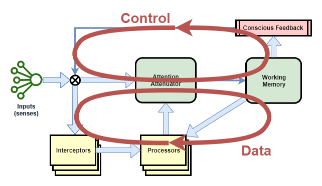

The following diagram describes the high-level architecture of Conscious Calculator.

It contains the following major components:

|Component|Description|
|----|----|
|Inputs|Input senses are treated as streams of data, and interceptors are required to identify meaningful events and/or features.|
|Attention Attenuator (AA)|Controls which input or processor output is selected for action and writing into Working Memory.|
|Working Memory (WM)|In human experiments this holds about 7 items for about 1 minute.|
|Short Term Memory (STM)|Records most recent events in chronological order. Acts like a swap-space to free up room in Working Memory.|
|Long Term Memory (LTM)|Records significant events and learned concepts.|
|Conscious Feedback (CF)|Summarises the current state of working memory and feeds it back into the system as an input sense.|
|Interceptors|Slightly stateful event detectors and pre-processors of input senses.|
|Processors|Each processor is specialised to a particular recognition, prediction, or mental task. Don't have any of their own state.|
|STM Interceptor|A special interceptor is used to populate events into Short Term Memory. Each novel state output from Conscious Feedback (CF) is fed into STM.|

There are two main data types that run through the system:
* Inputs in a stream of their raw data form
* Events

## Pathways
There are two main pathways that work together in this architecture.

The **data cycle** forms the main data processing. It primarily takes the external inputs and the current state of Working Memory, and uses this to update the state of Working Memory.

The **control cycle** monitors and controls activity in order to maintain stable thought. This uses Conscious Feedback to summarise the activity of the data cycle.

The two cycles operate in an integrated fashion, as managed by the Attention Attenuator.

## Inputs
In humans and other biological life-forms all raw senses behave like a continuous stream. Pre-processing pathways are required to identify features, to extract basic meaning, and to trigger on events. Humans seem to be able to observe the raw input when desired (eg: to objectively examine what we see in our sight), but generally we work off feature-extracted summaries of those inputs.

Thus, inputs can be fed into the system in any of three basic ways:
1. Raw input fed straight into conscious awareness via AA
2. Pre-processed input fed straight into conscious awareness via AA
3. Pre-processed input used by processors to produce their output

Inputs can be used within the system in any of the following ways, listed roughly in order of most common usage first:
1. Input event detected by Interceptor (eg: command request), picked up by a processor for that kind of event (eg: command request), and loaded into AA as something to be worked upon. May be all that's consumed of the input at that time.
2. Input event at the start of a sequence detected by Interceptor, picked up by a processor which outputs some sort of "observe input" event.
3. Presence of "observe input" event causes AA to directly feed intercepted input directly into conscious awareness. Raw input is used too, in some unknown way.

## Events
A general computing engine needs some form of abstract data structure that is flexible enough to represent widely varying concepts. The data structure used is an Event.

Events are made up of:
* a unique ID (UUID)
* an identification of its source
* a time
* a type
* arbitrary data

Most processors can only operate against specific events, as they require domain knowledge to interpret.

## Interceptors
Interceptors detect features and events. Some of the processing performed by them can be quite complex, especially in the area of vision and language. Interceptors do not have access to the current state of working-memory - at-least not significantly.

Interceptors will tend to be largely stateless, except for where needed in order to detect changes over time. For example, a simple interceptor may record the immediately previous input state, in order to detect when the input changes.

Examples include:
* identify the objects in the current visual field
* extract the words and their meaning from heard language
* identify when output from CF has changed - in order to trigger storing the new event into STM

In neural network terms, Interceptors are probably best implemented via some form of Recurrent Neural Network.

## Processors
Processors have no state of their own, but they receive many inputs.

Each processor may use any combination of the following:
* all state currently within WM
* outputs from interceptors - typically a processor will only ever by wired to one or more specific interceptors

In neural network terms, Processors are probably best implemented via deep-learning networks.

## Attention Attenuator
This is the key to making the biological computing engine work. It must maintain _stable_ thought.

It performs a number of roles:
* Decides which processor is used for output at each moment.
* Monitors processors over time and learns how useful they are - attenuating or strengthening their outputs as appropriate.
* Avoids infinite loops.

The chosen processor output is fed into Working Memory, updating its state.

## Working Memory
Working Memory (WM) holds the state in a state-machine. It holds a collection of Events, but only up to a low limit on total data quantity. All processors are given access to the full state of WM.

When each new event is added to WM, the following occurs:
* If room needs to be freed up, the oldest event(s) are either compacted or removed.
* The new event is added at the top.
* Additionally, events in WM that aren't being acted on fade over time.

Events may be _compacted_. If they hold a lot of contextual data, that data is either simplified or removed, eventually leaving only meta-data, before ultimately the whole event is removed. For example, the following sequence could occur:
* "Bob asked me 3 + 5" (original)
* "Bob asked me to do a +"
* "Bob asked me a calculation"
* "Bob asked me something"
* "I was asked something"

When an event has been compacted and it is needed in the thought process, it generally will not be good enough to use directly anymore. Rather, that will trigger a processor to attempt to re-load the full details from STM.

## Short Term Memory
General purpose processors cannot directly access Short Term Memory (STM). Rather, only a special purpose processor can query STM, based on the presence of a "STM request" event in WM. Processors must emit that event if they need information from STM.

STM stores event objects. It is organised as an ordered queue of most recent events, but it is limited in how much it can hold. For example, around 10 minutes.

STM is populated one event at a time, as the output from CF changes.

Data fetches are search-driven, based on a number of different available search queries:
* id-lookup - fetch an event by its unique ID
* by-time - search for all events within the most recent 'x' time
* like - search for events anywhere in STM based on similarity to something else
* by-association - search for events anywhere in STM related to an 'example' event or concept

## Long Term Memory
General purpose processors cannot directly access Long Term Memory (LTM). Rather, only a special purpose processor can query LTM, based on the presence of an "LTM request" event in WM. Processors must emit that event if they need information from LTM.

LTM stores Event and Concept objects. It is organised as an un-ordered associative bag of event and concept items. It has an unspecified large storage capacity.

LTM is pre-populated with concepts relating to pre-programmed processors. This enables the system, out of the box, to leverage those pre-programmed mental skills in the same way as if they had been learned them from scratch.

Data fetches are via:
* id-lookup - fetch an event or concept by its unique ID
* by-association - retrieve events and concepts related to an 'example' event or concept

The design for populating LTM during runtime is net yet defined.

## Conscious Feedback
The role of conscious feedback is to simplify and to summarise the state of mind. In full terms, this includes the current state of WM, plus data from a persistent "mental model of mind". In our implementation, this is restricted to WM. Furthermore, in humans we seem to only be able to observe one WM event at a time, and so this limitation is equally applied here.

CF just outputs whatever is the top event in WM.

It does not apply any summarisation or simplification.

The uniformity of data is chosen for convenience, but also because it seems biologically plausible that the data representation available to our conscious awareness is the same as the data representation used by its processors.