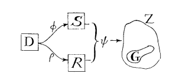
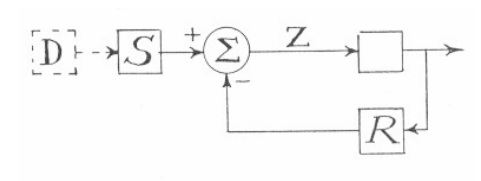

tbd: also needed for corollary discharge?

For example, many current artificial _reinforcement learning_ (RL) agents continually choose actions at a fixed rate of one (discrete or continuous) action per time step.

Here, _knowingly_ is used to refer to a processor being able to subsequently introspect both the input and output, to know the causal relationship between them, and to perform additional processing about the fact that it had performed that operation. Additionally, the act of performing that additional processing must itself be _knowable_.

# Models

|(a)|(b)|
|---|---|
|||

> **Figure 1: copied from Conant and Ashby (1970).** (a) is general case. (b) indicates special case with limited ability where regulator reacts based on result after system has been disturbed. _tbd_: draw own versions of this.

_tbd_: introduce good regulator in detail, and discuss difference between disturber-based and error-based (and using correct terms from their paper).

Different kinds of model are possible, as illustrated by Figure 2. The simplest model is a function `f`, that takes some sense input `x` and directly produces the regulation action as `f(x)`. A simple mechanical thermostat is an example of this: a bi-metallic strip bends in one of two directions depending on the temperature, switching connection to the power source on or off. The function (the bi-metallic strip here) directly controls the resultant action, without any additional controller required to enforce the output of the function. The mechanical thermostat models the underlying system in a very simple way: if the environment is too hot, then it can be cooled by removing the heat source; if it is too cold, then it can be warmed by applying the heat source. In the truest sense, it can be said that the thermostat _is_ a model of the system that it regulates (although, in the terminology of Conant and Ashby, it is not a "good" regulator, as it allows much fluctuation in the system that it attempts to regulate). Another example of a this kind of model is a biological neural network that observes its environment through senses and produces physical actions in order to regulate it. Like the thermostat, the neural network produces actions directly from its inputs (and its internal state); it does not require some external system to execute actions _based on_ the model inherent within the neural network.

A second kind of model, illustrated in Figure 2b, requires a controller. In this kind, the model is some set of data, `D`, that represents knowledge about the target system. The model has no inherent executional capability, and thus requires a controller, indicated here as a function `g`. The controller queries the model in some way with request to the current input state, obtaining `d ⊂ D` that represents information pertinent to the situation at hand. The controller then uses `d` along with the original input `x` to calculate an appropriate action as `g(x,d)`. It can be said that the regulator made up of `D` plus `g` both _is_ a model of the system, and _has_ a model of that system. It is not clear that biology would use this exact kind of model, as biological brains don't appear to just _hold_ data in arbitrary data structures and allow some other system to randomly access them.

A variant of the second kind, illustrated in Figure 2c, is more likely from a biological perspective. Rather than the model just storing data, it incorporates a function `f` that somehow infers data about the underlying system, based on some sort of query. This can be seen as a cross between (a) and (b), as the model is an executable function, but it requires a controller to apply it in context. Within modern AI, a model-based deep reinforcement learning agent is an example of this second kind: an artificial neural network is trained to predict the outcome of actions given known states, and a separate controller algorithm uses that neural network to plan the best sequence of actions towards the goal.

A fourth kind of model is also possible, which is also biologically plausible, and which combines (a) with (c). In this system, a functional model `f` executes inputs to produce actions of some sort, while an independent controller needs the ability to inspect the underlying model. As the controller is independent, it builds up its own model of the functional model `f`, as `f'`, and uses it in the same form as in (c). As mentioned, this is actually biologically plausible. For example, the separation between `f` and `g` may be the `g` uses its model `f'` to predict the best command to issue to `f` in order to produce a desired action. This is the core feature of Higher Order Thought Theory (HOTT), and is also used as the basis for Hierarchical Predictive Coding (citations).

Some analysis of the above can now be offered. The first point is that all variations are functionally equivalent in terms of the actions that may be produced. All of the above variations can be approximated as some function, `h`, that takes the input `x` and produces the `h(x)` as the output action. A second point is that where they differ is in the implementational ease of building up a representational model from experience and in inspecting that model for abstract rationalisations.

> **Figure 2: Model variants.** (a) simple action policy that is merely a function, `f`, of the input. (b) explicit model, `D`, that contains data about the target being modelled, and which requires a separate controller function, `g`, to execute actions based on the model by querying the model and obtaining a subset `d` that is subsequently used in action generation. (c) function `f` as an approximation of `D`. (d) function `f` generates actions, and a separate system `f'` and `g` as per (c) model function `f`, such as to predict the actions generated from `f` or to infer best input to generate for `f` that will produce the desired outcome (ie: if `x = g(y, f'(q))`).

## Visceral Loop

This paper introduces the concept of a _visceral loop_ as a characterisation of processing within a looping biological or AI agent. The visceral loop is so named because it refers to an agent concluding that it experiences consciousness "in a visceral way". It identifies, at the most optimum, the three iterations of a processing loop required for an agent to make such a conclusion.

Consider the following sequence of internal mental observations:
1. "What's that red blob in the tree? Oh, it's an apple".
2. "Oh, I those thoughts just came from my mind, and not from the outside world".
3. "That's what consciousness is. I am conscious".

Those three observations are produced from (at least) three iterations of a high order processing system. However, important distinctions can be drawn between the kinds of data represented as input and result within each of those loop iterations.

The visceral loop characterises those three observations as follows.

**Iteration 1**:

We assume that the agent (biological or otherwise) has some _a priori_ knowledge of the concept of consciousness, but has never previously analysed itself in that respect.

The first step in the thought sequence above is characterised as _Iteration 1_, whereby the agent produces an inference that is non-self-referential in terms of its mind schema. In that example the agent draws an inference about the observed red blob being an apple.

As stated within the introductory section, agents with sufficiently complex self-modelling requirements must have direct observation of their own sequence of thought actions. Thus, iteration 1 inference becomes available for subsequent processing.

**Iteration 2**:

During _Iteration 2_, the agent makes an inference about a prior Iteration 1 mental action, and this inference draws reference to its mind schema. The second step in the thought sequence above is an example of this, whereby the agent realises that it is aware of its own thoughts.

The agent has multiple sense inputs, most of which observe either the physical environment in which it exists, or observe its physical body. The agent's ability to observe its own non-physical actions counts as an additional sense input. During iteration 2, the agent explores its memory of its prior non-physical action, and produces an inference about that action; specifically, i) that the action was non-physical, and ii) that it was sourced from within the agent's own processing capabilities.

The result of Iteration 2 is a relationship between a simple Iteration 1 thought and the agent's mind schema.

**Iteration 3**:
During _Iteration 3_ that relationship becomes the input data that is further processed in relation to the mind schema. The result is an inferred self-referential relationship about its own mind schema.

In the third observation in the example above, the agent draws upon its memory of its immediately prior thought, and upon its _a priori_ knowledge about the concept of consciousness. Its immediately prior thought was a relationship between a simple thought and its own mind schema. Its _a priori_ knowledge of consciousness is effectively a set of beliefs about mind schemas in general. The conclusion it draws is a statement of belief about its own mind schema.

## Formal Description of Visceral Loop

A formal definition of the visceral loop shall now be presented.

Prerequisites:
* Ability for symbolic logic  (tbd...)

Let:
* `X` be the agent's set of beliefs about the external world
* `B` be the agent's set of beliefs about its own physical body
* `M` be the agent's set of beliefs about minds and it own mind
* `f(..)` be the function executed by the agent on the specified inputs in order to draw inferences
* `x_i` be an inference that results from the execution of `f` (it may be any output conclusion, decision, action, or intermediate logical steps)

Iteration 1:

Given `s`, some sense input or past state, iteration 1 inferences are of the following form:

* inference x_1: `f(s, X U B) -> x_1`

Iteration 2:

2. prerequisite: `x_1` is present
3. prerequisite: `x_1` is sourced from 'I' (as indicated through sense labelling)
4. prerequisite: ∃ memory of producing `x_1` in past thought
5. prerequisite: `x_1` is selected as focus of attention for processing
ie: producing: i) fact of presence of `x_1`, and ii) relationship of `x_1` to mind schema `M`

* inference x_2: `f(x_1, M) -> relationship(x_1 -> M)`

Iteration 3:

6. prerequisite: ∃ some _a priori_ belief about consciousness or experience
7. prerequisite: model contains i) fact of presence of `x_1`, and ii) relationship of `x_1` to `M`
8. `x_1` and its relationship to `M` is selected as focus of attention for processing, producing: "I am conscious of `t`"

* inference x_3: `f(x_2, M) = f(relationship(x_1 -> M), M) -> relationship(M -> M)`

....

Formally, the three iterations of the visceral loop can be represented using a mathematical notation that highlights the inputs to the function, and its result:

* Iteration 1: f(inputs) -> x - some result of simple thought
* Iteration 2: f(x, mind-schema) -> relationship(x : mind-schema)
* Iteration 3: f(relationship(x : mind-schema), mind-schema) -> relationship(mind-schema : mind-schema)

Theorem 1 Proof:
* The _content of conscious experience_ refers to the set of data represented and/or processed within the brain which is consciously experienced by that individual, in distinction to other data represented and/or processed in the brain which is not consciously experienced.
* As per claims 1 and 2, all of conscious experience must be available for further thought and the individual must be able to identify that thought as their own.
* In order for an individual to identify thought as being their own, they must have some beliefs about thought and how it relates to themselves as an individual entity. This is the set `M`, which iteration 2 produces inferences in relation to.
* Any supposed experience that is not available for input to iteration 2 (eg: due to some incompatibility of structure or a lack of data path to iteration 2 processing capabilities) cannot be identified in relation to the individual. As such, it fails on Claim 2, and any supposed thought about the experience must be thought about a non-conscious experience. Thus, any thought that cannot be used as input to an iteration 2 inference is not a conscious experience.

# Consciousness

The first observation is a straightforward example of Iteration 1 that does not make any self-reference to the agent's theory of mind (of their own mind or of others).

The second observation is an example of Iteration 2. However it is of specific form, whereby the individual produces an inference that identifies the source of the past thought in relation to their own mind schema (recall that this is a subset of `M`).

The third observation is additionally a specific form of Iteration 3, whereby the individual produces an inference based on the prior specialisation of Iteration 2, and produces an inference as a statement of fact about their own mind-schema. In this observation, the resultant inference is in relation to some _a priori_ conception about consciousness in general.

# Theorems

Theorem 1 proof:
* For any given experience, one of three possibilities is true:
    a) it is used as input to an iteration 2 processing step.
    b) it is _possible_ for it to be used as input to iteration 2, but current attentional focus avoids that in favour of other processing.
    c) it is not possible for it to be used as input to iteration 2, eg: due to some incompatibility of structure or a lack of data path to iteration 2.
* In order for an individual to identify thought as being their own, they must have some beliefs about thought and how it relates to themselves as an individual entity. This is the mind schema of which iteration 2 is focused upon.
* Both possibilities (a) and (b) satisfy the theorem. Possibility (c) fails on claim 2, and thus must not be a conscious experience.
* Possibility (c) fails on claim 2 because the individual
* 
* As conscious experience is characterised by the ability to think about that experience, and there is no experience that we cannot subsequently consciously think about, all of conscious experience must enter iteration 2 or otherwise it cannot be consciously experienced.

Theorem 2:
* Inferences produced by visceral loop iteration 2 processing define wholly the content of conscious experience.

Proof:
* An experience `x` is either:
    * immediately or later upon reflection via memory, thought about in relation to one's own mind - in which case it enters iteration 2 as input and an outcome is produced relating the experience to one's own mind.
    * always avoids being thought about in relation to one's own mind:
        * may be further thought about, but not in relation to one's own mind.
        * some subsequent thought `y` about that thought may itself become conscious experience
        * in which case `x` meets claims 1,2,3, and is thus consciously experienced.
        * thus, all thought is consciously experienced, even thought that is not conscious. doh!

Proof:
* Only a weak proof of Theorem 2 is offered, as it depends on some assumptions that will be discussed later....(tbd)...
* An experience must either be thought about in relation to one's own mind, in which case it enters iteration 2 as input and an outcome is produced relating the experience to one's own mind, or it must avoid being thought about in relation to one's own mind, in which case the individual is not aware of having had that experience.
* ...tbd better: the ability to think about something, and to know that you think about something requires a recursive ability to process that thing, and the knowledge of that thing, and the knowledge of knowing about that thing, and so forth. Thus data must exit iteration 2 and also exit iteration 3 in order for it to be knowingly consciously experienced. And, as a slight extension of claim 1, it is only consciously experienced if it is knowingly consciously experienced.

Weaknesses:
* Theorem 2 can only be weakly proven under a further assumption: that there is no meta-physical processing or processing of other sorts via physics or algorithmic capabilities not currently known to modern science.
* The proof of Theorem 2 rests on a recursive processing of thought and thought about thought, and thought about that thought, etc. Where does it stop?

Theorem 2 summarises the recursive nature of conscious experience.

# Summary

A couple of additional points of interest are worth mentioning....

An example of Theorem 2 is where an event occurs that is potentially available for conscious experience, but it does not become an iteration 2 inference at the time. The individual may still have a memory of that past event, and upon recalling that past event may draw an iteration 2 inference about it, at which time it becomes a conscious experience.

If we ascribe phenomenal experience as a feeling, and recognise that feelings are just additional data input produced through heuristic predictions, then we see that a simulation of a visceral loop, that we intuit to have no phenomenal experience, is computationally indistinguishable from a biological visceral loop that we know to be accompanied by such phenomenon.

_tbd_: argue for hierarchical architecture.

_tbd_: argue why needing a mental-schema also mandates needing direct awareness of thought.

_tbd_