This page forms part of the [[Proto AGI v1]] series.

I present an examination of executive control for the purpose of building a proto AGI.

# Introduction

General intelligence is a tremendously complex topic. The more I have thought about it, the more I have come to the conclusion that human general intelligence is the aggregation of many discrete facets working in concert. Understanding all those facets, and how they interact, is way beyond my own capabilities. So, although I desire to produce something of consequence in this research area, and I believe that I can do so based on the principles of consciousness theorised in [[A Theory of Consciousness]], I must focus on a narrow subset of problems if I am to make any progress. But which problems to focus on? General intelligence is a classic ill-defined problem in that it is not obvious how to break the larger problem into smaller pieces. What are those pieces?

In this page I investigate that by initially approaching the question of general intelligence in a haphazard way. I draw out and discuss areas of interest that may or may not be particularly relevant. In so doing, I hope to build up a deeper understanding of the different concrete mechanisms behind general intelligence. From that deeper understanding, we shall be able to determine where to focus our efforts.

## Research Goal

With reference to [[A Theory of Consciousness]], in this current research my primary goal is to:
1. Provide a convincing argument for a processing loop as the basis for general intelligence.
2. Prove that _conscious feedback_ is a required feature of that processing loop, and qualify what it is needed for and how it is used.
3. Show that this solution provides a significant improvement over current reinforcement learning techniques for rapid adaptation.

With some luck, I hope also to:
1. Show convincingly that this approach is the direction required in order to implement artificial intelligence.
2. Implement some key human general intelligence capabilities.

## Areas of Focus

Some of features that I suspect are key to general intelligence, and which will be discussed in detail in the sections below, are as follows...

**Mental modeling:**
* Being able to model the world, and one-self
* Using that for inference
* Using modelling for rapid learning and adaptation

**Neural networks:**
* Slow-learning neural networks, used in combination with mental modelling, for a best-of-both-worlds solution

**Brain as a deconstructed RL algorithm:**
* Brain learns through something similar to a reinforcement algorithm, except that it is "deconstructed": its components and steps are split out and distributed throughout the brain's systems and the conscious part of the mind is intimately involved with the process.

**Prediction:**
* Automatic sub-conscious processes produce most of the results that are used within conscious thought, through automated recognition of triggers, rather than conscious thought explicitly driving them.

**Goals:**
* Explicit goal representations, consciously observed, drive our actions.
* This is in direct contrast to many current reinforcement algorithms in AI where the agent is unaware of the goal.

**Learned rewards:**
* Explicit conscious awareness of rewards, both low-level and high-level in nature.

**Hierchical architecture:**
* [High-order Thought](https://en.wikipedia.org/wiki/Higher-order_theories_of_consciousness).
* Low-level layers of the brain (eg: priamry motor cortex, brain stem, spinal chord), and intermediate layers of the brain (eg: non-primary motor cortex, association areas other than frontal cortex), offload much of the hard work of recognising and interacting with the world, enabling the main conscous executive control part of the brain to focus on simplified high-level representations, enabling far more complex thought than would be possible if it had to deal with low-level signals.

## Assumed Architectural Components

As a way of representing some of the assumed main components necessary for general intelligence, we shall attempt to illustrate how they might play together in an AI architecture. At the centre is a policy component that is assumed to be implemented as a neural network of the sort used in reinforcement learning. In what is certainly an oversimplication, we will use the following view of biological advancement as a way to understand the important differences between three kinds of policy that might be possible at the higher-order control layer.

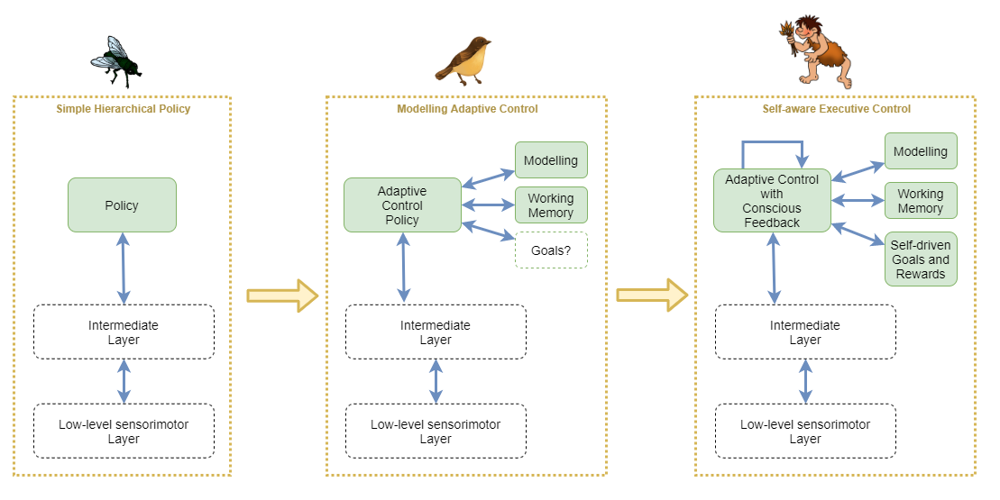

* Simple Hierarchical Policy
    * Here, the high-order policy is of the sort that is currently achievable with Deep Reinforcement Learning and [hierarchical learning](https://thegradient.pub/the-promise-of-hierarchical-reinforcement-learning/). It is trained to naively follow a particular policy that was found through unconscious experimentation to approximately maximise rewards. The policy operates only on immediate sense feedbacks, perhaps using a recurrent neural network (RNN), but without any more advanced system for holding state (eg: working memory), or for understanding the environment at a higher level.
    
* Modelling Adaptive Control
    * At this stage, the system employs persisted high-level modelling of the environment and its behaviours, including other individuals. The model is constantly updated and thus adaptations can be made from only a few or single experience. The policy network is still similar in structure to the simple hierchical policy, however it now integrates with the modelling and working memory systems. This system does not have the conscious feedback loop, and thus cannot model its own internal mental state, nor can it perform any of the more advanced behaviours that depend on that.
    * The inclusion of self-driven goals and rewards is contentious. In biology, this stage would likely incorporate self-driven goals, however to make that work I believe it requires the conscious feedback loop in order to maintain stability. So biological systems would most likely evolve abilities in tandem for self-driven goals/rewards and conscious feedback handling. Thus for our purposes, and in order to maintain a clear distinction between the stages, we'll try to leave self-driven goals and rewards out of the picture for this stage.
    
* Self-aware Executive Control
    * This stage builds on the previous by adding self-driven goals and rewards, and the conscious feedback loop that enables the system to maintain stability.

## Models, Models, and Models

In the combined context of AI and human brains, there are three kinds of "model" that might be referred to, each with different representations and scope:
* Model Free Policy Networks - Used in reinforcement learning to predict best action given a state
* Model Based Policy Networks - Used in reinforcement learning to predict future state given an action
* Mental Models - The ideas that humans build up about themselves and about the world around them that are used to inform decisions.

While "mental models" may seem to be something completely different to the models used in AI reinforcement learning, there is perhaps a way that mental models fit naturally into that grouping.

Bayesian networks have been studied for many years because they would seem to emulate some of the characteristics of how humans form theories about the world. Their use has often failed when applied to low-level learning of the sort that is now done with deep neural networks. But they are a good fit for higher-order "mental models".

So, the theory proposed here is that the brain uses different structures for different layers and different tasks, that are roughly split into the following:
1. Model Free Policy Networks - Slowest learned best actions given current state and a goal
2. Model Based Policy Networks - Medium-speed learned predictions of next state given current state and action
3. Bayesian Network Models - Generated, manipulated, and used by high-order thought to help inform decision making.

### Mental models as key to general intelligence
I believe that dynamic models are key to: i) the source of dynamic adaptable behaviour, ii) an agent's ability to categorise its observations, and iii) an agent's ability to model its own mental capabilities and to optimally take advantage of those capabilities. In general, I suspect that bayesian models are fundamental to the advanced goal decision making of general intelligence.

This also fits with the fact that humans are so easily misguided in their goals - humans target ill-conceived ideas of self-value based on cultural expectations. Eg: one person may prefer to shop at the cheapest stores in order to spend less money, while another may prefer to shop at the most expensive stores because of the social status of that store or its products.

For now, we assume that the best result for an AGI is achieved through a mixture of neural-network (NN) policy and bayesian networks for modelling and understanding.

Desired characteristics of a dynamic model:
* Continously updated
* Supports logical reasoning
* Supports inference, deduction, and induction
* Supports querying
* Can be used to produce a summary, explanation, or rationale for a decision.

### Interplay with other systems
Example 1:
* Observe it raining outside, then suddenly get a feeling that you're expecting to see people carrying umbrellas. Consciously accept that and decide that this means that people carry umbrellas when it rains. Bang! That forms a new dynamic model.

Example 2:
* Observe it raining outside and consciously notice that people are carrying umbrellas, causing you to wonder about that. Consciously review memories of past observations and realise that people tend to carry umbrellas when it rains. Bang! That forms a new dynamic model.

In the first example, a sub-conscious predictive process picks up on the correlation between rain and umbrellas over potentially several observations, and the prediction suddenly becomes strong enough to elicit an attentional focus (perhaps through another predictive process that observes that this prediction of umbrellas is novel across past experiences of observing rain). The brain's predictive processes don't need many observations, due to their mechanisms for segregating regions to focus on particular predictions (catastrophic forgetting protection). In most cases, the sub-conscious prediction would trigger a conscious review of past memories as in example 2, but it's entirely possible to blindly accept a prediction as sufficient evidence to form a conclusion.

In the second example, the majority of activity is carried out consciously and through review of episodic memory. At most, the only sub-conscious trigger might have been a predictive system that identifies novelty which happened to grab attentional focus.

The first example highlights the usefulness of a sub-conscious predictive system and how it can act as useful input into the conscious thought process. The second example highlights the importance of episodic memory in the process of forming conclusions.

### Dynamic modelling engine
The assumption for now is that there is some system that is used for creating dynamic models. We investigate bayesian methods for this in a later chapter.

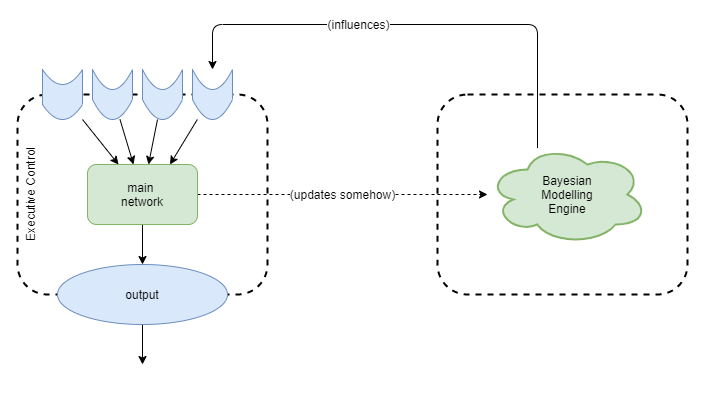

Assumed characteristics are:
* Triggered: created when from some sort of event triggers identification of the need for a new model.
* Modified: built up and refined over time as more co-factual and counter-factual examples are observed. 
* Recursively Composed: each model is built up from other models with a new layer added. Eg: a car has a wheel.
* Introspection: We can inspect individual parts of a model, but this is probably due to the composition structure. ie: it's likely that we cannot inspect within a model, but that we can observe at the interface of each of the composed parts.

Some outstanding questions are:
* How to make this work in practice?
* Assuming "bayesian modelling engine" is separate, does main executive control network need to re-learn how to use the bayesian models as they are refined? For example, a baby with no bayesian models could not learn to use those models until _after_ it had formed some initial models. Then as the models get more advanced, it'd probably need to re-learn again to fully use the more advanced aspects of the models. At some point it'd presumably reach a point where it knows how to work with any new kind of bayesian model already.
* Are bayesian models used in lower level layers too or just within the executive control layers?

## Policy autonomy

Most RL methods today don't trust the policy with much. They hide a number of key things from the policy by not making them available as inputs:
* Goal
	* On the basis that we don't know how to encode a goal. We hold the goal to ourselves like a secret card that we don't even reveal when the policy achieves it. 
* Rewards
* Execution strategy. 
	* Model based techniques execute the path search as a mechanical process that the polucy has no control over. 

I want a policy that can "think". One that can choose inaction in order to mull over the options. So I need to trust it more. This includes with goal, rewards, but most importantly with execution strategy. I treat mental action the same as physical action. In order to include mental actions within the policy gradient calculations, I include those actions in the value estimate. 

This "trust" is a key feature of the discussions that follow.


# Rewards

When a parent smiles or laughes at an infant, they seem to instinctively recognise it as a good thing, in comparison to someone frowning and shouting. As the child becomes more mature, they feel a pain of regret when they know they did something wrong. People learn complex relationships between actions and rewards, and most if it without any conscious thought. Importantly, we seem to be aware of all reward signals.

This is directly in contrast to current AI reinforcement learning techniques. The reward is merely a number that is fed into a expected value equation, used to calculate a loss value, and finally drives neural net weight adjustments through stochastic gradient descent. The agent isn't aware of any of that process, and is never informed of the reward value itself.

That seems strange, and something I hope to rectify. Executive control needs to be aware of the rewards. Why? So that it can rationalise about them, and directly and intentionally change its behaviours accordingly.

### Kinds of reward
The RL community takes a lot of inspiration from biology. One such inspiration is that animals and people are largely self-motivated. For example, children learn a lot just from curiosity alone and trial and error. The RL community calls this _intrinsic motivation_ and attempts to emulate it via mathematical techniques in the constrution of a reward function. Often these techniques produce impressive results.

I find the term _intrinsic motivation_ misleading on two fronts. Firstly, as discussed above, these reward functions are not intrinsic to the agent, but are executed by the RL algorithm as an external process that the agent has no involvement with. Secondly, they are rewards for carrying out certain sequences of actions after that fact; and while they may subsequently cause the agent to perform those actions more frequently, they do not _motivate_ the agent to try to do so. Motivation is something more closely related to goals that a self-governing agent chooses based on its own reasons. Most RL agents don't have any ability to choose their own goals.

Thus I prefer to think of these so called _intrinsic motivation_ techniques are _primitive rewards_.

This term draws different connotations. In particular, it suggests clear biological examples, including but not limited to: effort, pain, hunger. Importantly, these signals are all achieved through simple circuits that produce a signal on as few as even a single nerve fibre into the brain. Thus, a lot of handling related to these signals can be achieved without the need of neural networks for interpretation. Many of these signals trigger hormones, immune system response, etc. in ways that are driven entirely by pre-wired processes encoded by DNA; rather than requiring a neural network to be first trained to recognise and process the signals.

Thus, to me, _primitive rewards_ are those that I can architect into the system and that can be immediately used for training. In contrast, I can't reward an AI agent by smiling at it, until it has first learned to see, then to recognise smiles, and finally to realise that a smile is a good thing.

While I wish to use both kinds of rewards, I will need to use _primitive rewards_ to bootstrap learning of more advanced domain-specific rewards. In either case, all rewards should be available to the agent for examination.

For a detailed analysis of common techniques within RL, see [[Survey of Reinforcement Learning]].

### Example rewards
Some rewards that we might be of use initially include:
* primitive rewards such as
    * pain
    * satiation
    * learning amount - reward based on how much the agent learns over a period. Can be risky as it may discourage convergence of policy. So perhaps works better when only measured against the learning degree within modelling engine.
    * predictive errors - eg: in training sensorimotor network
    * boredom - desire for unique stimulation
    * curiosity - desire to learn following predictive "surprise" (similar to boredom but likely computed in a slightly different way)
    * predictive uncertainty - eg: active inference
* goal achievement
    * provided that it's possible to architect a simple stable system for recognising when goals have been achieved
* information theoretic measures such as
    * mutual information - eg: DIAYN
    
## Interactions Across Hierarchical Rewards

We want to be careful to offload the executive control layer from having to manage lower level aspects of the system. So we will need to carefully tune which layers receive the RL rewards related to specific things.

Each higher-order reward builds upon the policy trained via a lower-order reward. Thus they form a hierarchy. There are approximately two ways in which these categories of reward can interplay:
* Refinement
    * Each higher-order reward provides higher fidelity or a more fine-grained frequency of feedback, making it easier to train the policy to follow the best path.
* Supersedence
    * Each higher-order reward provides (or at least is interpreted to provide) a "better" measure of success, and thus can override the lower-order reward.
    
The refinement hierarchy leads to efficient convergence, and predictable outcomes, however it loses from its inflexibility. The supersedence hierarchy appears more relevant to human learning, as it recognises that a higher-order understanding of the situation enables a more accurate interpretation than is possible from the more primitive layers. Additionally, the higher-order rewards may trade off longer term larger rewards against small short term penalties. For example, an agent may be willing to tolerate a certain amount of pain in order to gain a worthwhile large reward. So the supersedence hierarchy can lead to more adaptable and interesting results, but at the cost of being less likely to converge.

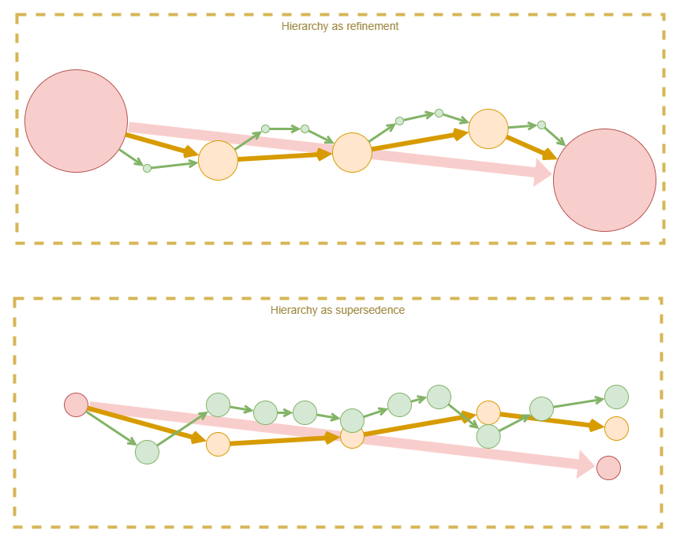

In practice, we must find some way of combining the two, as they both have considerably important benefits. One approach might be to adjust a weighting between the two over the course of training, with strict preference to refinement hierarchy at first. Another likely variation over the course of training, is to start with only primitive rewards, and to slowly add reward layers over time.

So, a likely training approach is:
1. Primitive rewards only
    * The machinery for other kinds of reward will be in place, so that they can learn, but they won't be allowed to actually influence the final reward value.
    * This phase will carry on for a long time, until the agent has good motor control that produces smooth movements.
    * During this phase, the instructor's "unsaid implicit" goal is the only thing that directs training: avoid getting hurt, use unergy efficiently, eat when hungry, and learn to correlate senses and motion control.
2. Sense-interpretation as refinement
    * A 'teacher' provides visual or tactile cues to train towards some arbitrary goal.
    * Question: how does agent understand that these cues are rewards, and whether they are positive or negative? Does initially associating them with pain/pleasure work? Does it make sense to look at how people train animals? For humans, have evolution just hard-wired recognition of social cues (smiling, etc.) to such an extent that we don't have to teach the association? Or do we do it instinctively from a child's birth and we don't realise it?
    * During this phase, the instructor's "unsaid implicit" goal is again the learning direction, but the agent is interpreting the rewards itself.
3. Achievement as refinement
    * Assumption is that a capability for mental modelling is learned during the first two phases, and that mental models about the world have already been constructed. Thus, now, those mental models and goals derived from them, can be used to measure success.
    * During this phase, the mental models are expected to help the agent more efficiently and accurately achieve the instructor's "unsaid implicit" goal by way of providing high-frequency high-fidelity rewards.
    * Effective reward calculation is heavily weighted towards lower-order rewards if they are available. When they are not available, then higher-order rewards are accepted without change.
4. Achievement as supersedence
    * Finally now we take the reigns off, let the agent explore the world more fully, and really let it develop its own character.
    * The base assumption is that we don't need to change anything about what feedback we're giving. We assume that the internalised reward function from the last phase already conflicts (disagrees) with the lower-order reward functions, but that we were previously constraining the effect of its deviation. So, now we just stop constraining the effect of its deviation, and the policies will adjust.
    * Effective reward is taken as an equally weighted average across the three reward layers, thus a strong high-order reward can counteract a weak primitive penalty.

## Building Up Specialised Rewards

Let's say that we want to encode a prime directive of:
* Be inquisitive

We can give a reward for _learning_: specifically, when the mental model is updated. Scale reward based on magnitude of change. Possibly even for the magnitude of change when collapsing models - ie: simplification is a better generalisation. 

Give penalty for getting hurt - don't want it to be inquisitive at the expense of its own well being. Primitive negative rewards such as hunger and pain teach us to avoid certain actions. We build up a mental model that helps us avoid those outcomes. Those mental models can become advanced and abstract over time, eg: maintain a healthy lifestyle.

These play into our goals.

But it still needs more constraints. I need to be able to give explicit rewards/punishments. But I want to give that via its senses rather than directly into its internal reward system (the equivalent of a wire into the brain). I could punish via pain, and reward via food, but that doesn't reflect the variety of ways that humans receive rewards.

I'd love to make it receive a reward when I smile at it. But I don't know how to make that happen.

A simplistic compromise is to use a hard coded system that gets direct signal from senses and is pretrained to feed into internal reward system. Eg: pretrained to recognise a particular token in the visual feed and to translate that to a reward signal. This is more like an implant in the brain that observes the visual nerve, rather than an external wire into the brain, but basically the same thing otherwise.

Also, will I know how to encode the reward? Maybe even the exploded RL algorithm still runs off simple reward signals at the low level so I can just tap into these. And maybe the learned "internalised" reward network will output in that same low level signal.

Such a reward system might look like:
* Hard coded low level system.
* Plus learning network, that adapts to higher order rewards based on higher order concepts.

What does the learning network actually model though?

## Pure Intrinsic Motivation

What if the solution is to get rid of external training altogether and use pure intrinsic motivation. The main intrinsic motivation drivers would be a combination of something like mutual information (DIAYN), prediction error, curiosity, desire.

How can that lead to an agent that actually tries to interact with others? Mutual information might again be useful there, as it will attempt to find novel interactions that elicit different states. That will still lead to it finding many different ways of interacting with us, many of which will annoy us but it won't make a distinction. Prediction won't help alleviate that because it will learn to accurately predict our annoyance. So 'Desire' will be necessary: that it wants us to achieve an outcome, but if we are annoyed we won't cooperate and thus it will fail to meet its goal.

The policy will also need to model its rewards so that it can use that to choose goals that lead to rewards. And this will ensure that it can continue to progress and be productive. Hopefully will build up a hierarchical model of rewards so that it can focus on long term gains. However, this reward modelling can be added later, and should only have a weak influence. Its not the main driver. 

Learning algorithms could include:
- DIAYN at all levels -- certainly at the start, then slowly attenuated away
- Variational Autoencoders (VAE) for representational training
- Prediction

This seems like a much more effective long term strategy for producing an AGI.

### Example Architecture
An example architecture using pure intrinsic motivation might look like:
* Maximise I(G:S) - mutual information between goals and states (DIAYN) - encourages exploration, diversity of capabilities, and training of goal representation. 
* Decode error with state regularization (VAE) - encourages saliency of goal representation, and smoothness of the state space. Potentially optimises for reconstructability at expense of utility to higher layers. 
* Maximise I(A:S) - mutual information between sequences of actions and states (Empowerment) - encourages utility of policies. Note: may need to look into whether there is a conflict with what DIAYN does with I(A:S). 
* Backprop pressure from training of layers above - encourages utility of state representation. Although, that pressure will be most effective only when applying rewards against the accuracy of the policy of the higher layers. 

Primitive rewards would be applied at each level independently and simultaneously.

### Functional specialisation
Intrinsic motivation approach make it very hard to produce results that are useful to us.

Brain uses a lot of functional specialisation, as evidenced by a growing body of research. Particularly from lesion studies. So what if we tried that approach. 

We could add:
* Explicit represenation of rewards, plus uncertainty. 
* Explicit support for model free and model based computation. 
* Explicit support for "simulation" of actions. 

Example:
* In order to support simulation, action outputs could include an on/off signal that chooses between physical action vs just simulation of an action. Action outputs feed into model free reward predictor -> output into reward memory. Action output, sense inputs and reward prediction states could be fed into a reward uncertainty predictor. Policy uses that to choose to output a control signal to model based reward predictor, and waits. Model based reward predictor emits possible paths through its model. And reward uncertainty predictor estimates uncertainty. 
* _(tbd: needs diagram).
* Then extend to actually producing action planning.

### Circular targets
Some instrinsic motivation techinques can lead to a policy that always moves the agent towards a particular stable state and then it tries to stay there. For example, empowerment can suffer from this technique, as it targets a state that affords the agent maximum capability of future state changes. Metaphorically, the agent will climb to the top of the hill and stay there.

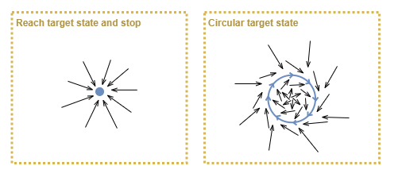

We want an agent that is driven to keep doing things. One way of looking at this is to target the "stable state" as a resonant circular path through state space. Examples of intrinsic motivation that might lead to such a "stable state" are:
* boredom - desire for unique stimulation
* curiosity - desire to learn when experiences surprise
* learning degree - reward based on how much the agent learns over a period

## Worked Example - Primitive Rewards plus Teacher Goals

We now look at how we can train the executive control layer to understand and target teacher specified goals. In order to "trust" our policy, and produce biologically plausible solution, our network will not be pre-trained to understand high-level rewards based on the actual goal, nor will we use any externally driven RL mechanism based on measurement against the goal. Rather, we will provide the teacher goal as high-level "sense" input to the agent, and depend on i) the existence of primitive rewards as the training force, ii) the fact that the primitive rewards coincide with the teacher goal signal, and iii) a modelling capability that will discover the relationship and subsequently understand goal signals in the absence of primitive rewards.

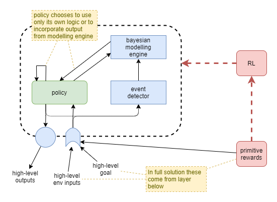

The policy network will learn to _choose_ whether or not to use the modelling capability at each time step.

In a full solution, the primitive rewards will be supplied from lower-level layers, and the teacher goal will be indicated by something in the environment that the agent must interpret. For example, a sign denoting the target goal position. For the purpose of focused experimentation, we will simulate the existence of the lower-level layers by providing our own high-level representations directly to the executive control layer. Simulated integrations will include:
* input of high-level representation of environment
* input of high-level representation of primitive reward
* input of high-level representation of teacher goal
* actions applied against a high-level representation of a simple environment (eg: grid-world office space with simple left/right/up/down movements).

Humans have envolved capabilities to learn through many mechanisms from birth, such as to receive rewards via smiles, and hugs, other body language, and voice intonation signals. Our solution is not advanced enough to learn from any of those sorts of signals and thus we must opt for significantly more simplistic methods that operate against the primitive reward signals that we can easily embed: pain, pleasure, and effort.

### Add model-free learning
We assume that the above approach causes the modelling engine to develop a model of the relationship to the goal signal and low-level rewards, and that the policy learns to choose between its own devices and the output from the modelling engine to achieve maximum primitive rewards. Now we can use the goal signal to cause the agent to perform different tasks, and the agent will continue to use the modelling engine to drive its actions.

How do we turn those actions into further learning of the policy itself? It's like we need some form of hebian learning, where the repitition of an action alone is sufficient to cause learning. One option is to use the trajectories produced by this system to train a secondary predictive network. The task of the predictive network is merely to predict what the next action will most likely be, given the current state. In other words, a standard policy of the form `π = p(a|s)`.

So we collect a cache of past trajectories, and use them, in conjunction with supervised learning and generated samples, to train the secondary predictive policy off the main policy. We probably want the predictive network to calculate and output an uncertainty too.

Now the main policy has three options for deriving the next action: calculate the next itself, use the output from the modeller, or use the output from the predictor.

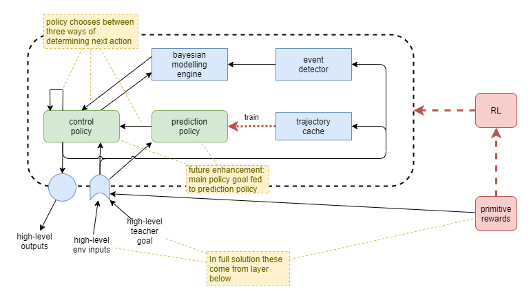

The predictor network acts entirely on the current state, unaware of the goal. It produces habits that are triggered by familiar states, without consideration to what the agent is actually trying to achieve at the time. This would seem to emulate human behaviour in some respects. For example, the experience of walking into a room and absent mindedly carrying out a particular sequence of actions that you routinely do, when you actually meant to do something else. These "slips of action" are a known effect in humans and relate to how strongly the habitual action is wired, and the brain's mechanism for choosing between habitual or goal-directed behaviour (de Wit _et al_, 2012).

### Future enhancements
**Control Policy Goal**
* Feed goal signal from control policy to prediction policy so that it can adjust its predictions based on the current goal.
* This may or may not be realistic in a biological sense, as it will impact the occurrence of "slips of action".
* Introducing this control policy goal into the predictive circuit will also significantly reduce stability because the solution needs a way of enforcing convergence of the goal signal to actually represent the policy's goal.

### Training
In order for policy to learn to understand rewards, it needs to bootstrap. Without primitive recognition of smiles etc we can't use that. So have to use pain and pleasure, and for agent to associate to higher domain rewards. 

Collapsing box of pain:

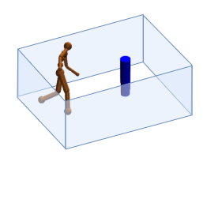

I need to look into techniques for bird training, as these techniques may have some important lessons on how to bootstrap advanced behaviour using only primitive reward techniques.


# Bayesian Modelling

There are a few approaches available for dynamic modelling. One approach could be to use one of the decision-tree solutions, such as BART, instead of a neural network. These could be perfect because they have the smaller size and reach saturation faster, and possibly even support tree growth. Of the various current techniques, bayesian models (or something with similar effects, such as the Probably Approximately Correct (PAC) approximation of bayes models) appear to be the most biologically plausible solution for dynamic modelling.

This chapter looks at how we might actually implement bayesian modeling. In short, how do we build the blue "bayes" boxes in the diarams above?

## Online Hierarchical Bayesian Clustering

It's not easy to do bayesian modelling if we don't have a method for extracting unique "features" to reason about. Given a visual field image, how would I identify that a certain section of that image represents one object as distinct from other objects in the scene? One way of doing that is noting the relative likelihoods of pixels that appear together vs those that are independent. So we need a mechanism that will identify discrete objects and events out of the state input, and we need to analyse for those discrete objects/events across the breadth of the state vector and across time. This will create the lowest level set of nodes in a bayesian model, from which further bayesian modelling can be built up, so it might be the first in a number of discrete bayesian layers.

Offline clustering methods require access to the complete set of past data, which is obviously not possible for an agent. Thus the clustering method must operate in an online mode. Conveniently, we don't need to worry too much about trying to hold onto past data to enable re-analysis, because the environment will always produce more data.

### A note on state vector representation
Our hierarchical sense interpretation will blur the inter-object independence. So maybe need to apply regularisation that seeks to maximise independence of output nodes. Perhaps, and hopefully, that's what VAE regularisation does. Will need to investigate.

### Sliding Window for Training
To make this work, we need to turn existing hierarchical bayesian clustering algorithms into an online mode that can use new information to discover errors in previous clustering. It needs to work in an _aglomerative_ (add samples to build up a cluster) and _divisive_ (divide clusters) mode. A possible training setup is a sliding window of recent state samples:

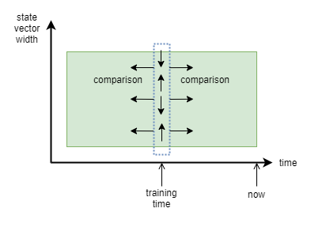

In order to train on events with equal before/after states, we lag the point in time that training is applied to the middle of the sliding window and analyse only that state sample in relation to others. The comparisons will probably be performed as part of the bayesian clustering algorithm, or otherwise we could bootstrap through background calculations of mutual information.

At runtime, the resultant clustered bayesian model can be used for predictions based on the current state, and the observation error would ultimately lead to re-clustering. The observation error might always lead to a "surprise" signal, and the magnitude of that surprise would ultimately be amplified according to a measure of "emotional affect".

### Background noise
We will also need to include a mechanism to discard background noise so that the agent doesn't try to cluster each and every noise data point it encounters. Should be able to calculate log likelihood of a given data point representing background noise vs belonging to a meaningful cluster. Perhaps with a small replay buffer from recent data points.

## Multi-Bayes Architecture

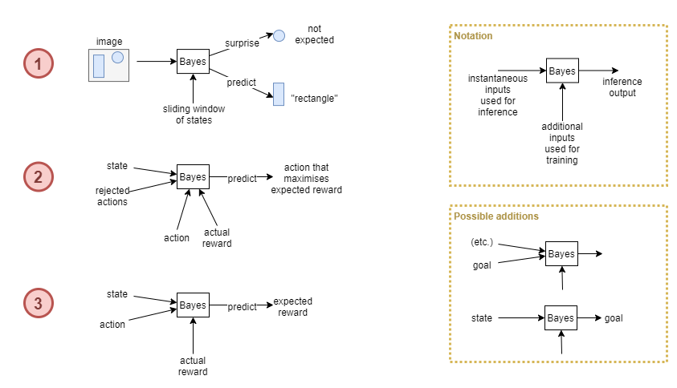

A possible architecture involves around three bayesian modelling systems:

**Bayesian Modeller #1:**
* Analyses inputs and performs online clustering
* At inference time it emits the predicted category (the best matching cluster), and surprise at state components that aren't expected to occur with that category

**Bayesian Modeller #2:**
* Given the current state, predict the next action that maximises reward.
* The policy will subsequent use Bayesian Modeller #3 to actually predict the expected reward from the action, and may choose to discard it.
* The policy is now looking for an alternative suggested action.
* Discarded actions are collected and used to reduce their likelihood of selection (reduced priors maybe?).
* Modeller #2 can now produce a new recommendation.
* As this uses bayesian techniques, it will adapt faster than a NN policy, so should help to train the agent faster.

**Bayesian Modeller #3:**
* Given an action output by the policy (either for actual physical action or just for simulation), predict most likely reward.
* Actual reward subsequently received becomes the prediction error that will be used for re-training.

So, we build into the architecture of the executive control layer an embedded mechanism that runs in a loop, predicting and simulating actions, analysing their rewards, and discarding them, until an action is simulated that is predicted to have useful reward.

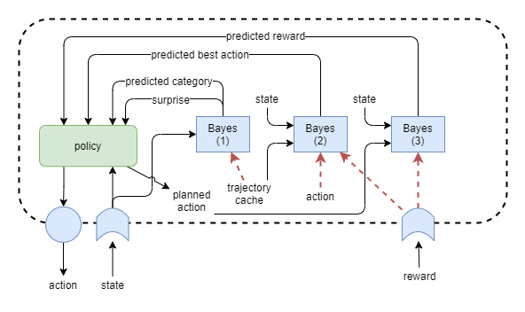

### Actions via Bayes vs Neural Nets
If Modeller #2 produces actions, it will be very unstable due to the fact that the benefit of an immediate next action depends on the policy, which changes over time. Additionally, it may be hard to train the policy to decide between its own judgement or the bayesian guess for the next action. A more stable solution would be for Modeller #2 to produce goals, and for the NN policy to execute them.

Alternatively, we could ask whether we even need a NN policy after all? Perhaps the executive control layer can operate entirely off bayesian models? The long term view, inspired by biology, is that both systems work in cooperation/competition, as indicated in the following diagram. However it's looking more and more like we'd be best to focus on bayesian solutions for the executive control layer as our first priority, and only later add in the slower-learning NN approaches. This is starting to look like a more realistic path to true autonomous, self-motivated, self-governed general intelligence.

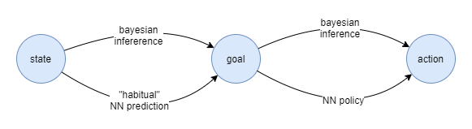

## Re-clustering with Memory

When an observation reveals a bayesian inference prediction error, and this triggers the need for a cluster division, we don't have all the data points available anymore for re-analysis. But, maybe we do, because in the full solution there will be a memory of past events too that could be re-loaded and re-analysed.

Example:
* I'm told this three-legged thing is not a chair. Oh now I need to reassess my assumptions. Are all three-legged things not chairs? Memory recall occurs: oh, I remember three-legged chairs.

The recall of those related memories would need to be loaded into working memory, and the whole executive control layer would need to partake in this re-training exercise. On the face of it, this seems like it's commandeering the executive control layer for the training task related to one particular component.

But maybe that's what the executive control layer is all about. The automated machinery needed in order to train these advanced computational systems. It just happens to be self-aware in order to apply top-level governance and prioritisation.

## Representational Dynamics

Something to consider is that the representational interpretation of the high-level state supplied by the intermediate layer will change over time. The modelling engine will have to cope with those changes.


# Goals

How do we enable the executive control layer to have goals? Why would a policy neural netwokr require an external goal representation. What advantage does a goal representation add? It seems that a goal is just another form of state. Perhaps it's just a way of persisting a past output in order to recall later, and to save having to reprocess and reproduce that goal value each time. Additionally it may be necessary if the production of that goal state cannot be calculated in a single step. So it helps for producing behaviour that is more complex than the network can produce via single pass only. 

We want the goal to represent a state that the agent eventually reaches. The first naive approach is to measure the actual state against the goal and reward based on minimising the error. But the policy will maximise that reward by always outputting the current state. We want the goal to not just be a copy of the current state, but to represent a goal in the future. So increase the reward for how much in the future the goal is achieved. In simplistic terms we can do that by rewarding based on how different the goal is to the current state at the time it is emitted, but only grant the reward if it is achieved. Additionally, we can penalise for producing goals that are never achieved.


Working through this a little further, at the time of the reward, pick the closest past goal and reward based on how different the state was to the goal at the time. Also, pick the past goal most different to the current state, and penalise for much different it is to the current state (penalise for not achieving a goal). Now turn that into a more continuous reward function and we have something like this for the reward at time `T`:

```
r(T) = Σ{t=0:T} |g(t) - s(t)| - |g(T) - s(T)|
```

That'll likely need a little more work. For one thing, when calculating rewards for a goal, it'll penalise past goals beacuse they are not achieved at time `T`, even if they were achieved at some other time in the past.

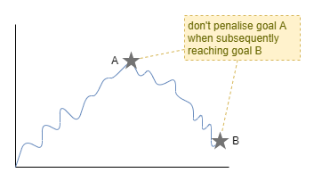

## Goal or Prediction?

The biggest issue with the design so far is that the supposed _goal_ is really just a _prediction_ about future state, ie: the agent will maximise reward by always outputting a value that accurately predicts as far into the future as possible. A related issue is that there's no training pressure for the policy to use the current state of the goal in its determination of action. In other words, we're rewarding the agent for predicting the inevitable, rather than striving for something else.

One way to enforce that the policy uses the goal is to maximise the mutual information between the goal and the actions that the policy takes. Something like:

```
I((a|s); g)
```

There is another way of looking at this though. A great way for the agent to succeed in its prediction is to intentionally make it happen, ie: to plan actions that lead to the predicted future state (aka goal). As it so happens I'm not the first to think of this approach, it's called [Active Inference](https://en.wikipedia.org/wiki/active_inference). So maybe this simple architecture could be used for goals.

The idea of active inference suggests another tweak: that failed goals are still good if the agent learns from the experience. So perhaps we shouldn't penalise a failed goal (negative reward), but simply reduce the goal's reward contribution towards zero, and add a learning quotient on top. Coincidentally, this sort of thing is incorporated in an information theoretic way within the idea of active inference.

## Policy Action Options

At any given time step, the policy now has a number of options available for which inputs to consider when choosing the next action. These are indicated here, with the options that we want to encourage in green, and other options (treated as short-cuts) in blue, and labelled according to what they translate to into our extended version of Daniel Kahneman's thought systems.

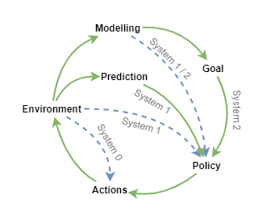

To emulate something close to human experience, it also needs to monitor its own mental behaviour through a _conscious feedback_ loop. Given the complexity of the architecture, that could well be a very useful feature for maintaining stability. A conscious feedback loop takes the raw policy output and feeds it back in as an input to the whole of the executive control layer. This can enable self-observation through access to trajectory memory of recent events. The agent can model those trajectories, in conjunction with the observed rewards received associated with those trajectories, to identify the kinds of thought processes that are best (maximise reward). Provided that rewards include not just sparse teacher feedback, but also include dense primitive rewards including effort, the agent can then use that modelling to plan its actions better.

For now, that process of self improvement will have to develop spontaneously as I don't know how to reward it for self analysis, and I hopefully shouldn't have to.

## Dynamic Modelling for Goals

Perhaps a solution is arrived at by recognising the relative strengths of neural networks and dynamic modelling techniques. The neural network is great for complex policies, and relative stability, while bayesian networks for example are great for inference and short-term adaptability. So, maybe the bayesian network produces the goal, and the policy actions it. Combine that with the simplistic goal achievement reward measure above, and we have a system that genuinely produces its own goals.

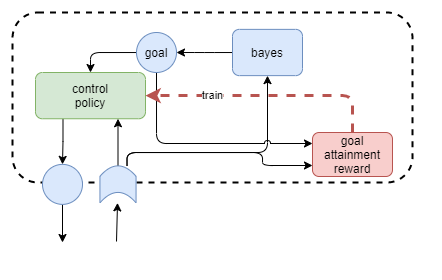

The bayesian modeller would infer a future state `s'` from the current state `s` that it predicts will generate the maximum reward. The policy (neural network) accepts `s'` as a goal, and attempts to produce a sequence of actions that moves it towards state `s'` as efficiently as possible. This solution has a nice advantage that it should produce fairly constant goal values during the window of time where it has not yet attained the goal. The value of having an explicit goal representation within the architecture is that accepted goal out of suggestions from multiple systems can encoded in one place and then fed into systems that need to action it and measure success.

In the longer term, the actual goal would probably be decided as a competitive/cooperative combination of bayesian inference and NN-based habitual predictions. Additionally, we would later need to recognise that sometimes rewards are tied to actions or trajectories, rather than target states. So predictor may need to be able to output different kinds of targets, unless we can figure out a sufficient state representation that can encompas all three scenarios.


### DIAYN
Convenietly, this approach combines very naturally with DIAYN as an initial exploration approach as it operates through randomly generated goal signals that the policy is expected to produce unique outcomes to. Now, DIAYN trains goal representations that don't mirror the state representation. Thus we've actually got two ways of combining DIAYN with a bayesian goal generator:

1. Constrain the goal representation to be the same as a state representation by only ever sampling from the set of realistic state values. Will likely also need to adjust the mutual information calculations of DIAYN and how they're used for training loss.

2. Constraint the bayesian model to operate against abstract goal representations. Use the exploration of possible goals and states from DIAYN as input to the training of the bayesian model so that it infers target goals `g` instead of future states `s'` values. Will additionally need to train a NN to recognise when a goal is achieved.

The latter has a nice feature that it enables the use of abstract goal representations rather than requiring the goal representation to mirror the state representation, and thus it enables more flexible goal achievement measurements. Likely at the expense of stability. Also, how do we continue to train the goal achievement measurement network after initial DIAYN training?

### Active inference
Alternatively, instead of DIAYN, we use Active Inference and its method of trading off exploitation vs exploration via learning likelihoods.

This may produce a more adaptable agent. For example, it will initially seek to learn its own abilities. Then, place an unusual object in front and it will explore it due to uncertainties in the prediction of it. Reward the agent for approaching and touching the object and the bayesian model will later seek a reward from it again. Place a different object that punishes instead, and after initial active inference curiosity, the bayesian model will avoid it in the future.

## Goal Inference

Let's now take a closer look into the suggestion of using dynamic models to infer the goal. We shall focus here on bayesian techniques.

Assume some unknown reward generator, `h`, that operates on unknown parameters, `θ`, and known state, `s`. Thus we have:
```
p(r|...) = h(θ,s) = p(r|θ,s)
```

Thus we can infer the reward probability distribution for a given state by integrating over possible values of θ:
```
p(r|s) = ∏p(r|θ,s)p(θ)
```

And by querying across different states it is possible to select a state that maximimes the expected likelihood of maximum reward.

Now, let's say that the agent is in state `s`, and we want to pick a target state `s'` that will maximise rewards. If we naively picked `s'` based on simply maximising the expected reward at `s'`, we would be ignoring the different costs associated with the trajectory from `s` to the different possible `s'` (eg: a target state that is further away may take more effort than one that is close). Additionally, there may be other factors to the state that the agent cannot control but may need to take into account and which may affect the reward (eg: if the agent is hungry, then going to the table and eating food will give a reward; but if it is full, the same action will not produce the same reward).

So, really we need to model as follows, and then pick the best `s'`:
```
p(s' for max r|s)
```

To take into account the true cost of trajectories from `s` to some possible `s'`, we would need to either sum over all possible trajectories (inaccurate, and computationally expensive) or execute planning (more accurate, but computationally expensive). A better approach would be to learn some simple statistical model heuristic for estimating cost to transition from one state to another. Thus, the propability of accumulated return `ret`, when moving from state `s` to `s'` can be modelled as a sum of the expected reward `r` at state `s'`, plus the likely cost `c` of the state transition:
```
p(ret|s,s') = p(r|s') + p(c|s...s')
```

A simple algorithm for using that approach, and simultaneously improving the cost estimation is as follows:
1. pick best guess of a worthy target `s'`, and its associated _prior_ cost, based on the above equation.
2. perform planning from `s` to `s'`, calculating a more accurate expected cost
3. if the new expected cost estimate is significantly different to the prior cost estimate, then update the cost estimate model, and perhaps forcing an explicit update of the prior somehow, and repeat from step #1.

### Bayesian Generative Model
_todo: to transfer into here......_

Inspired by Friston paper:
- Model external env as latent variables (based on external physical senses) 
- Model internal state as latent variable (based on internal physical senses such as hunger, plus mental state) 
- Model reward as function of those two latent variables. 
- In first cut can assume that hierarchical NN layers will suffice for the latent variable inference. 

Also
- Initially assume equal cost to all potential goal states, and just pick best reward based on external and internal state latent variables. 
- Apply active inference for exploration of goal space. 
- Give small reward for attaining a goal. 
- Give large reward for attaining hidden teacher goal. 
- Unpredictable nature of teacher reward will introduce variation of best predicted goal, provided there is some Stochastic selection. 

_......end_


In the same style as (Rigoli, 2017), the following illustrates a generative model that we may employ within our agent in order to infer the latent causes of rewards received at each time step. It is represented as a bayesian graph, which nodes indicate variables and arrows indicate conditional dependencies. A perceptual layer makes observations (O), which represent estimates of hidden and unobserved features (F). Furthermore, those features are themselves caused by hidden and unobserved latent states (L). Those latest states cause the resultant reward (R). All layers from O to R are connected in a probabilistic fashion. Furthermore, an action (A) performed by the agent during the prior time step is asumed to have had a probabilistic influence over latent states (L) that ultimately caused the observations during this time step.

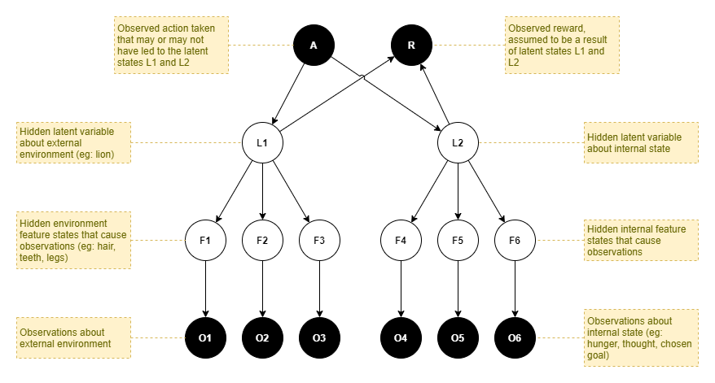

The observations, features, and latent states are split into two separate groups. One group represents the external environment and the effect of the agent's interactions with that environment. The other group represents the agent's internal state, which includes internal physical states such as hunger and pain, and includes its mental state such as current goal.

The goal decision problem is thus cast in terms of inferring the most likely latent states via a posterior distribution over latent states that the agent can reach through its own volition. The reward is used within this inference by picking a maximum past observed reward, perhaps with some measured or calculated uncertainty, and setting that as the prior probability distribution over the reward. Thus, we can infer the latent states that are most likely, given the reward (or more accurately, the prior belief that rewards will be observed).

It is instructive to compare this with the most elaborate generative model from (Rigoli, 2017), reproduced here with some slight modifications. Their generative model focuses on the inference of likely actions (a-priori unknown and unobserved) given a belief in an expected reward (classified as just "goal achieved" vs "goal not achieved"). They introduce a context variable (C), to encapsulate the agent's state. This coincides very well with our internal features and latent state.

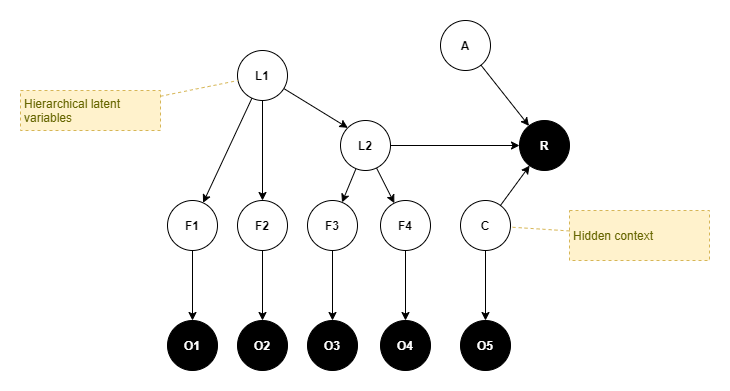

### Simplifications
For a first cut, there are some simplifications that we might make.

**Assume latent variables already inferred:**
* We can assume that the hierarchically layered architecture discussed within [[Proto AGI v1]] already performs the task of latent state inference, and thus the inputs to the executive control layer are already representations of the L nodes.
* In practice this may be naive because the hierarchical architecture is better thought of as a data compression and feature extraction engine, than producing accurate predictions of external latent states. So, a better assumption is that the inputs to the executive control layer represent estimations of the F nodes.


# Planning

We need to add _deconstructed planning_ into the mix of the total solution. The agent should learn to plan effectively, with only some components being hard wired. For example, perhaps the per-step planning outputs are produced through primitive mechanisms, but the agent itself must learn to use them in combination with working memory in order to build up the plan.

## State-space Clustering

We don't want the executive control layer to focus on low level time steps. Clustering may help.

We can apply online clustering in the models for `p(s|a)` and `p(s'|s)`, etc. That could possibly be combined with hierarchical bayesian models ; though that's probably a concern for a later day.

Clustering automatically groups related objects if it is likely that they stem from the same statistical model. So when infering against these models an action will be predicted to lead to some state that will occur a variable time in the future, instead of always exactly in one time step. This fits with comments from Rigoli _et al (2017) suggesting that the model structure will depend on the actions. And it seems very in line with human experience. 

## Details
_..more tbd.._


# Autonomous Monitoring and Control

Here I introduce the concept of _Intentional Autonomous Monitoring and Control_ (I-AMC). I-AMC refers to an agent that performs monitoring and control of itself, autonomously, and with active intent. In other words, using the same logic and inference processes that it would typically use for interaction with the external environment, it can determine the need and carry out actions in order to make changes to its own tuning parameters.

A full AGI solution must surely include many of the components illustrated in the diagram here, and probably many others that have been omitted. From conception to adulthood and beyond, each of these components learns to operate, based on past experience, and each component's learning is carried out within a system full of similar components learning and changing. The system as a whole must be very chaotic. So we must consider how all these components can operate together to produce benefit for the agent as a whole.

It is this observation that sets the background for the topic of _autonomous monitoring and control_ (AMC). 

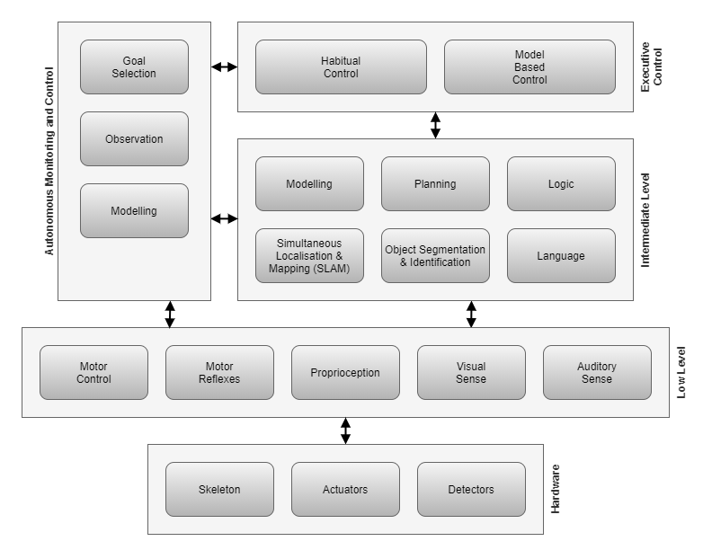

Further detailed background discussions for this topic can be found here:
* [[Autonomous Monitoring and Control]]

## Solution

_tbd_


# Learning through Observation

_todo: should this go into classification page?_

An AGI agent needs to obtain knowledge about the world at any moment that the knowledge presents itself, regardless of how the agent is involved at the time, or even involved at all, and regardless of what the agent is doing. 

Some sources of learning should include:
* Observe through own action
* Observe through others action
* Observe through external force executing own action (eg: hands being moved by other) 
* Observe through being told / reading
* Infer from other knowledge 

Acquired knowledge from the above sources include:
* States - > rewards 
* States - > States (actions / time) 
* States - > labels
* Labels - > labels (relations) 


# Working Memory

In humans, working memory appears to be a decentralised process. But we don't necessarily need to repeat that for an AI. We could perhaps achieve the same thing with a single 'working memory' (WM) component. One option is the main executive control (EC) system passes some of its output into working memory, and the current state of working memory feeds into EC as an input sense.

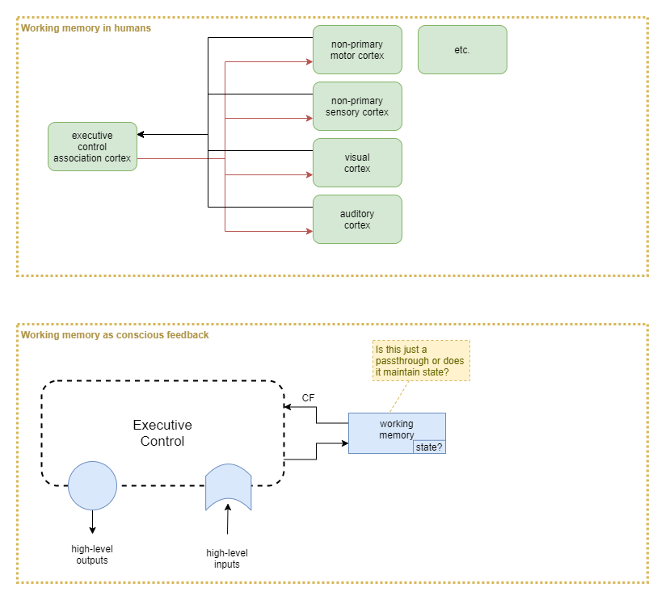

At this point the question becomes about what state, if any, that WM component holds. Or, is WM just a pass-through?


# Conscious Feedback

In prior work I've hypothesised that conscious feedback (CF) is important because it acts as a feedback mechanism that the higher-order brain uses against itself to maintain stability. But how exactly does that work?

## Analogue to Physical Senses

Learning of low-level motor control and physical sense interpretation incorporate feedback signals that act as measures of predictive error. In many cases part of the construction of those feedback error signals depend on higher layers. The executive control layer also needs to learn, and it needs error signals to help it with that. But when it's already the highest layer, where does it get its error signals from?

When the executive control layer decides on a physical action, its sense inputs become the feedback signal. They are interpreted and compared to the goal, and the difference becomes the feedback signal that the executive control layer applies to itself for that physical action. Importantly, the feedback signal is fine-grained and immediate. This leads to significantly more efficient learning and smoother actions than possible with sparse rewards.

What about thought? Many thoughts don't lead to physical actions, so the senses cannot be used to provide immediate feedback. Even for the thoughts that do lead to physical actions, the immediate action feedback may not provide much direct feedback about the quality of the thought process that lead to the action. The critiquing of a thought process requires domain knowledge that ony exists within the executive control layer, so it is only that layer that can produce and handle the feedback. Thus, CF provides a means for the executive control layer to critique its own thought processes.

How does it learn to do that critiquing? One way is for it to act as a form of sparse-to-dense reward transformation. Almost all thought leads to physical action of some sort eventually. It may be immediate body action (eg: I want to go somewhere, so I start walking). It may be immediate talking action (eg: I say what I was thinking). It may be delayed physical action. All of those physical actions have the possibility of providing some sparse reward from the environment (eg: I find that I've walked to the wrong place; the person I'm talking to looks confused). All of the executive control layer capabilities (prediction, mental models, memory, etc.) can be employed to learn that certain thought processes tend to be productive, while others tend to lead to negative rewards. So those processes can then provide constant critiquing of the thought process, and provide immediate feedback.

## Inputs vs Outputs

Why would the executive control layer need CF when it's already got access to all the sense inputs and internal state? It because those are all _inputs_ to the neural network of the executive control layer. CF is the only direct way of observing the network's _output_.

## Action Learning

In RL, we learning mappings from actions to probabilities or reward expectations. The actions here are the _output_ of the neural network of the executive control layer. So the RL algorithm needs to directly observe those outputs. Under a hypothesis that the brain implements something akin to RL, but embedded within all its other processes, then it is that same executive control layer that is involved with the RL training. Thus it needs to directly observe those outputs.


# Example Tasks

Learning to balance when walking (intermediate layer reward):
* Old-brain performs this without conscious control.
* Signal from vestibular system provides feedback signal that intermediate and low-level layers use to control balance.
* Same signal from vestibular system can be used as fine-grained reward function.
* But reward shoudln't kick in when lying down, so need a simple automatic mechanism to switch that reward on/off.
* Possible mechanism:
    * Switch on/off based on pressure on soles the feet.

Office world (copied from Illanes _et al_, 2020):
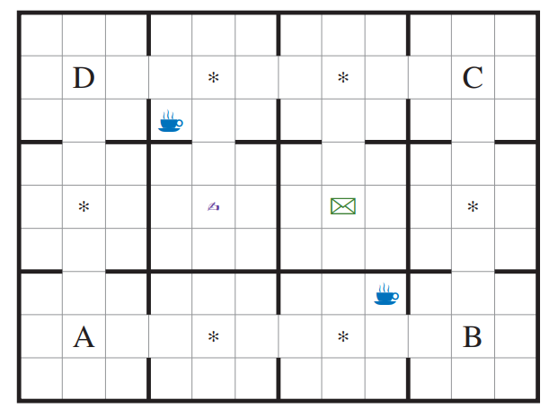

Planning:
* learn to simulate possible paths from model without carrying them all out. Great for efficiency in real world. 

Move efficiently with planning:
* Target is for policy to move efficiently, with planning, but only if it helps. 
* Penalise for effort 
* Thought step is 10% of physical step effort
* Time penalty for complete inaction
* Measure efficiency and duration of physical action so tries to go faster
* Measure pain so it doesn't go too fast and fall over
* Efficiency of effort alone should provide greyscale reward towards walking upright with best gate: walking on all fours requires more movement, running takes more effort, crawling is too slow.

Learn action / reward relationships:
* State: in a room plus hungry
* Bayesian model needs to predict target state, given hungry: eating. 
* Assume previous learning:
	* Previously observed action/outcome relationship: press Red button, food appears in front.
    * Planning model needs to predict the "press red button" action given that state as goal. But how to draw connection? 
	* Assume that food just has to be near mouth, and chew action kicks in automatically. 
	* Food initially given by trainer.
	* Model updated based on observation that food-near-mouth + chew = reward
	* So can predict chew action or ('chewing' state) given food-near-mouth.
    
Learning through observation:
* Observe someone else push red button and food appears. 
* Agent to learn that relation without carrying it out itself, so that it can use that knowledge later when trying to feed itself. 

Clustering:
* Our solution needs clustering, so want some tasks that require that. Identifying discrete objects in observed scene. Identifying object continuity through time. Note that humans take a long time to develop this, suggesting they use slow NN mechanism. But bayesian logic still needed to rationalise about the objects later. 

Single-shot learning:
* Purpose of using bayes is to draw inferences / govern action from minimal or just one training example (something NN cannot do). So focus on problems in that area. With or without NN pretraining, want to give only minimal examples for bayes to adjust to. 

Post-hoc analysis:
* Infering need to pick and carry an item to a particular location in order for that target location to produce the reward.


# References

de Wit, S., Watson, P., Harsay, H. A., Cohen, M. X., van de Vijver, I., & Ridderinkhof, K. R. (2012). Corticostriatal connectivity underlies individual differences in the balance between habitual and goal-directed action control. The Journal of neuroscience : the official journal of the Society for Neuroscience, 32(35), 12066–12075. https://doi.org/10.1523/JNEUROSCI.1088-12.2012

Illanes, L., Yan, X., Icarte, R. T., McIlraith, S. A. (2020). Symbolic Plans as High-Level Instructions for Reinforcement Learning. Proceedings of the Thirtieth International Conference on Automated Planning and Scheduling (ICAPS 2020). http://www.cs.toronto.edu/~lillanes/papers/IllanesYTM-icaps2020-symbolic.pdf

Rigoli, F., Pezzulo, G., Dolan, R., & Friston, K. (2017). A Goal-Directed Bayesian Framework for Categorization. Frontiers in psychology, 8, 408. https://doi.org/10.3389/fpsyg.2017.00408