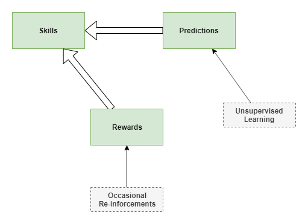

I wonder if the following three main components enable our advanced learning:
* Skills
* Prediction
* Reward

All three components learn in their own way, but in a circular inter-dependent way.

## Components
### Prediction centre
Learns to predict the effect of actions by the self, the effect of actions of others, and relationships between events (ie: likelihood of 'this' occurring with 'that', the likelihood of 'this' occurring after 'that'. 

Uses: unsupervised, online learning.

Initially very literal, examining only immediate effect: signal to hand, causes touch and visual feedback. Later users hierarchical learning to identify relationships over longer and longer periods of time. 

### Rewards
Provides immediate reward to skills centre for every action. But learns through slow reinforcement learning.

Inititally driven by "free energy principle" to act to reduce surprise by manipulating actions. 

Also uses hierarchical learning to understand benefit over longer and longer time frames. 

### Skills
Performs mental and physical actions. Improves capabilities and accuracy over time. 

Uses reward centres for fitness functions in learning.

May use predictions to decide on actions, through push (prediction centre suggests best action) and pull (test several actions via prediction centre).

## Jitters
On its own, the base case reward system will lead to inactivity as a way of reducing surprise. Some theory suggests the babies have jittery limbs as a way of providing initial training. This will train both the prediction and skills centres. 

Subsequently some other 'curiosity' reward system must kick in, that drives further high level experimentation. Which will be further followed by the development of 'satisfaction' reward through dopamine. 

Aside: I wonder why dopamine is required as a reward mechanism when there is already a pure computational mechanism for reward.

## Reward Reinforcement Learning Mechanism 
Reinforcement learning only works efficiently if there is an abstract model, like a bayesian belief network. It doesn't work so well with a pure typical neural network. That's OK, that can be engineered through evolution into the base case. 

Mind you, there are other techniques that don't require such models, eg: [Q learning](https://riptutorial.com/tensorflow/example/30637/minimal-example).

### Path-based Reward 
In humans, many small-scale actions lead to some sort of immediate reward. Most of the time we don't notice this. But sometimes we can observe this. Reinforcement reward only measures the final outcome. But we often receive internal reward for steps along the way. 

I posit that our reward system measures 'paths', as well as 'outcomes'. 

The system learns to recognise paths that have tended to produce outcome rewards. It recognises those paths in our actions, and provides small rewards for each action provided we stay close to those paths. 

Example: I spend a lot of time puzzling over problems because I find it fun. I feel a sense of happiness just in the act of thinking about the problem, even without making any particular progress. It causes me to keep coming back to the problem throughout the day, day-dreaming as it were.

(Added 2019-12-30. Labels: work-in-progress, theory)