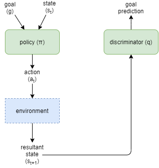
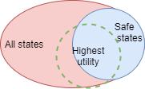

# Classifications

One way of slicing the range of RL algorithms available at the moment is to classify them as using one of two approaches:
* Value function estimation
* Policy representation and the policy gradient method.

In value function estimation, the agent attempts to learn a function `V(a(t) | s(t))` that predicts the value (expected sum of rewards) of the path beginning with action `a` at time `t`, given the current state `s(t)` and in implicit fixed goal. The expected value of each action depends on the likely subsequent actions, which are again decided based on the same value function, thus the value of action `a` at time `t`, depends on the expected subsequent actions. Algorithms based on this include the Q-learning algorithm originally proposed by Watkins and Dayan (1992) and the Sarsa algorithm proposed by Rummery and Niranjan (1994). The advantage of this type of algorithm is that the process is simple and easily implementable; however, it does not solve the problem of continuous action space well.

Typical algorithms based on the policy gradient method include the REINFORCE algorithm proposed by Sutton et al. (2000) and the actor-critic algorithm proposed by Konda and Tsitsiklis (2000) are typical algorithms based on policy gradient method. The main idea of these algorithms is to link the parameterization policy with the cumulative reward and continuously optimize the policy to obtain the optimal policy. This type of method can solve the problem of continuous action space, but can easily converge to the local optimal solution (Zhao, Liu, Zhao, and Tang, 2018).

## Value Methods

Deep Q Networks (DQN) is one of the simplest algorithms.

## Policy Gradient Methods

A simple actor-critic algorithm is relatively easy to write in equatio form, and while far more advanced techniques are now used, for the purposes of what we need to examine here, the difference is not too important. In particular, currently another popular algorithm Proximal Policy Optimization (PPO) essentially looks the same, but with some extra refinements. Both of these follow the policy gradient method, with an actor-critic used to calculate "advantage" for a given action - which has been found to reduce variance and improve convergence.

The following is a very brief summary of the simple actor-critic policy gradient functions (source: https://www.tensorflow.org/tutorials/reinforcement_learning/actor_critic):

Reward:
```
r(t) = actual reward at time t
```

Expected returns, at time `t`:
```
G(t) = sum(t'=t..T: gamma^(t'-t) * r(t'))
```

Networks:
```
policy(a(t) | s(t)) = policy network, parameterized by theta (network weights)
```

```
V(s(t)) = value network, parameterised by the same theta
```

Actor loss:
```
actor-loss = - sum(t=1..T: log(policy(a(t)|s(t))) * [G(s(t), a(t)) - V(s(t))])
```

Critic loss:
```
critic-loss = huber-loss(G, V)
```

Learning is usually accomplished by recording events into a replay buffer (as tuples of state, action, reward), then running supervised learning against batches retrieves from the replay buffer.

## Convergence Improvement Techniques

There are several methods that have been shown to improve convergence efficiency and/or accurancy. Two relatively simple methods that are frequently included are:

1. Using a target Q-Network that is updated separately from the online  Q-Network. The target network weights are updated periodically to match the online network, which is updated at every step. This maintains a longer period with the same action-values, in contrast to weight updates, which occur at every step.

2. The use of an Experience Replay (ER) buffer, enabling mini-batch training, rather than single sample training.

## Hierarchical Reinforcement Learning

tbd


# Intrinsic Motivation

The reinforcement learning community, inspired by biological organism's ability to self motivate their own behaviours, have experimented with ways of incorporating _intrinsic motivation_ into reinforcement learning.

Tbd ....summarise...

Many of the intrinsic motivation algorithms depend on abstract theoretical measures, for example mutual information.

However, motivation within biological organisms is something that the organism is aware of and experiences as part of their executive control. So, when viewed in that context, the mechanisms described above are better viewed as _primitive rewards_: _(tbd: define)_. Viewing them in this way can be important, as many of the so called intrinsic motivation techniques suffer from the law of unintended side effects. Often they are devised in the hope of achieviwing a particular outcome, but the actual computation used doesn't necessarily bare a direct relation to that outcome. For example, empowerment based rewards can lead to the agent getting stuck.

## Common mathematical functions

Before delving into the algorithms, it is helpful to explain a few commonly used functions and cocepts.

#### Mutual information

`I(X;Y)`

_Mutual information_ is an information theory concept, that measures the amount of mutual dependency between two variables, ie: how much knowing the value of one variable helps predict the value of the other. Given variables `X` and `Y`, the mutual information `I(X;Y)` is zero if the variables are entirely independendent, and a positive number of they have some amount of dependency.

#### Huber entropy
`H[X | Y]`

tbd...


## DIAYN

Diversity Is All You Need (DIAYN) (Eysenbach, Gupta, _et al_, 2018) provides an mechanism for pre-training a network via a form of intrinsic motivation based on the idea of discovering a collection of distinguishable _skills_. The approach aligns well with the approach taken here for AGI, as the skills that they refer to are encoded as an extra input parameter to the policy network. In our design, that is called a goal. DIAYN attempts to maximise the diversity of states that the agent can reach. The policy network takes two inputs, the state representation `S`, and a goal representation `G`. `G` a vector of fixed size, and its interpretation is formed as a result of the algorithm.



The algorithm:
* trains the policy using random goals sampled from some pre-defined distribution and held static for each training eposide.
* trains a discriminator to predict the original goal given observed state.
* maximises `I(G;S)`, the mutual information between goals and states, in order to ensure that the goal input to the policy has control over the outcome states
* minimises `I(G;A | S)`, the mutual information between goals and actions given the state, in order to ensure that the states distinguish the goals, not the actions.
* maximises the entropy `H[A | S]` to ensure that there is maximum diversity of actions

The algorithm maximises diversity of states that the agent can reach. With the goal encodings as the sampling indices, it ensures a diverse sampling of reachable states across all possible states. However, this can include many that are unhelpful or unsafe. So it attains high diversity, but potentially at the compromise of lower utility.



## Empowerment

Produces policy that tries to move agent into state with maximum control over future states. This can result in the equivalent of, for example, climbing to the top of a hill because it has the greatest advantage over attackers, and staying there forever.

tbd....

## Auto Encoders

While not typically used for intrinsic motivation _per se_, auto encoders have similar characteristics and can be used as a way of achieving a useful result without external rewards.

Assuming that the encoded representation has less capacity than the original data source, auto encoders converge to find the best possible compression strategy across the data samples used for training. In the context of images, they basically train for a domain-specific image compressor. In so doing, they take certain compromises that optimise for structure of the image, with variations depending largely on the error measure used during training.

Variational Auto Encoders (VAEs) add an extra constraint to the possible network configurations, that the encoded representation should have a smooth variation through its space across similar source data. So the encoded representation now must perform two goals instead of just one, and the range of possible optimal encodings is reduced. Thus in a sense this makes the encoding and decoding networks worker harder to reproduce the original input data from an encoding space with further constraints, rather than allowing the encoding representation to be fit optimally for the needs of the encoding and decoding networks.s


# My Own Additions

## Human inspired solutions for Hierarchical Reinforcement Learning

Many of the prevailing research in this area attempts to remove the need for a-priori knowledge of how to split the hierarchies, and how to reduce the effects of the non-stationarity problem (unstable division between the hierarchies). I propose that biological systems don't have those problems because they embrace a-priori knowledge from the evolutionary process.

Thus, I propose that biology uses hierarchical structures in a number of ways....
* Static (for an individual) physical hierarchical structures, as a result of evolution: cerebellum, primary motor cortex, association cortices, highest level cortex.
* Semi-static / semi-dynamic temporal hierarchy as a result of state within physical hierarchy above.
    * Eg: cerebellum manages lowest level sequences for fine motor control. Other layers likely have a level of recurrence too. 
* Semi-static / semi-dynamic representational hierarchy as a result of physical hierarchy above. 
* Semi-static / semi-dynamic control hierarchy as a result of interplay between above hierarchies. 
* Hierarchical learning of skills
* Hierarchical mental modelling

The aggregate result is achieved by forward and backward pressure that converges to a stable and productive balance of hierarchies across the physical structural layers, but which will continuously re-tune according to the current most common activities. In fact, this goes some way towards explaining why our skill levels for a particular thing wax and wane depending on our typical activities.

Hierarchical learning of skills plays an important part in achieving high order meaningful results. The process for building up skills hierarchically looks something like:
1. when new skills are practiced they become automatic
2. at that point the action of a skill becomes a single data point: a single request from the executive control system to execute the skill,
3. and it can now be incorporated into a larger plan;
4. furthermore, that larger plan can itself be practices to the point of becoming automatic, and again become a single data point.
5. This can probably happen at any of the physical structural levels, and in many cases across multiple layers. 
6. It depends on there being two ways of executing a task - effectively requiring two separate control pathways:
    * One, where the top level executive control system is involved with working out or remembering and actioning every step;
    * The other where the lower layers have subsequently learned the sequence into their neural networks, and can now execute an entire sequence given only a first instruction....Enabling the executive control layer to move on and think about something else.

More articles/papers on the topic of automaticity:
* https://www.thinkingmaps.com/automaticity-its-automatic
* https://www.quora.com/What-happens-in-the-brain-when-a-skill-becomes-automatic
* https://www.fastcompany.com/3058572/how-to-learn-a-new-skill-well-enough-to-do-it-automaticall
* https://betterhumans.pub/the-science-of-automating-and-perfecting-any-skill-ea89f55b5f3e

## Efficient Value Estimation 

_(tbd: flesh out)_

Is in creating a high level policy with high sample efficiency during training, I don't want to be measuring its estimated value using a bloated low level value estimator network that will take ages to train. One of the big problems with that is that the network has high capacity and needs saturation before it will be a useful predictor but large capacity networks take a long time to saturate.

I want something that produces useful results immediately, like it was always saturated and its capacity grows during training. 

Surely a better approach is to use bayesian techniques for the value estimation. 

## Training with growing networks

_(tbd: flesh out)_

Train network to saturation them increase size and use old network to train new one throufh supervised learning and random sampling. Do for both policy and critic networks. 

Could create genetic solution by starting small, detecting when reward stagnates, and double network size, repeat. 

Inefficient compared to training in simulated envs. But very efficient during real world learning. 


# References

Eysenbach, B., Gupta, A., Ibarz, J., and Levine, S. (2018). Diversity is All You Need: Learning Skills without a Reward Function. ArXiv. https://arxiv.org/abs/1802.06070

Konda, V. R., and Tsitsiklis, J. N. (2000). Actor-critic algorithms. Advances in Neural Information Processing Systems, pp. 1008–1014, MIT Press, Cambridge, MA, USA. [Google Scholar link](https://scholar.google.com/scholar_lookup?title=Actor-critic%20algorithms&author=V.%20R.%20Konda%20&author=J.%20N.%20Tsitsiklis&publication_year=2000)

Rummery, G., and Niranjan, M. (1994). On-line Q learning using connectionist systems. Cambridge University Engineering Department, Cambridge, UK. Technical Report CUDE/F-INFENG/TR 166. [Google Scholar link](https://scholar.google.com/scholar_lookup?title=On-line%20Q%20learning%20using%20connectionist%20systems&author=G.%20Rummery%20&author=M.%20Niranjan&publication_year=1994)

Sutton, R. S., McAllester, D. A., Singh, S. P., et al. (2000). Policy gradient methods for reinforcement learning with function approximation. Advances in Neural Information Processing Systems, pp. 1057–1063, MIT Press, Cambridge, MA, USA. [Google Scholar link](https://scholar.google.com/scholar_lookup?title=Policy%20gradient%20methods%20for%20reinforcement%20learning%20with%20function%20approximation&author=R.%20S.%20Sutton&author=D.%20A.%20McAllester&author=S.%20P.%20Singh%20et%20al.&publication_year=2000)

Watkins, C., and Dayan, P (1991). Q-learning. Machine Learning, vol. 8, no. 3-4, pp. 279–292. https://doi.org/10.1007/bf00992698

Zhao, Y.-N., Liu, P., Zhao, W., and Tang, X.-L. (2018). Twice sampling method in deep Q-network. Acta Automatica Sinica, vol. 45, no. 10, pp. 1870–1882. https://doi.org/10.16383/j.aas.2018.c170635

